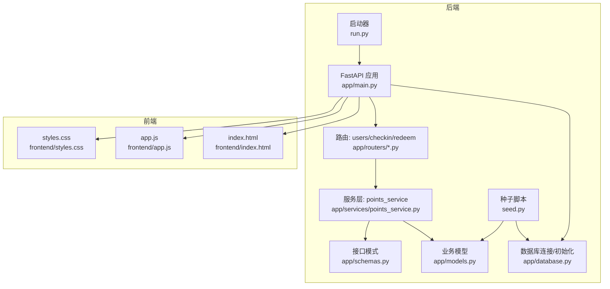
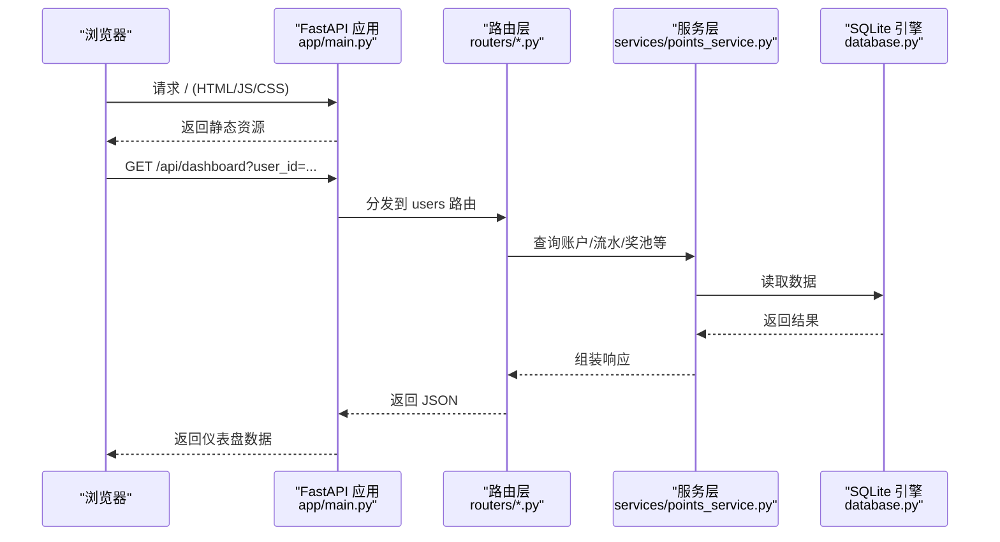
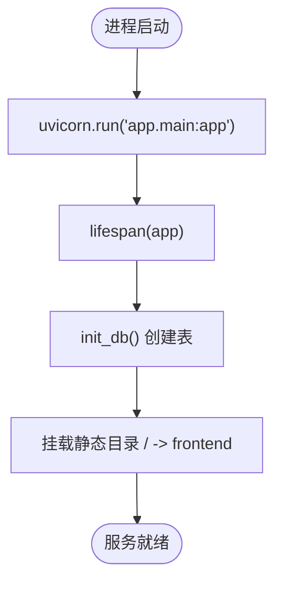
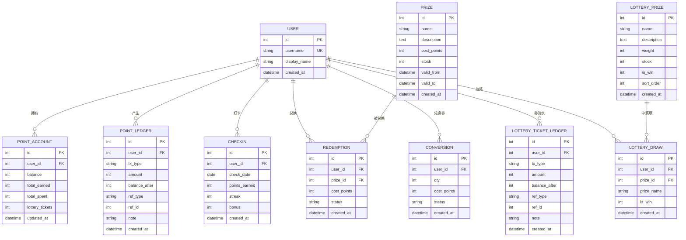
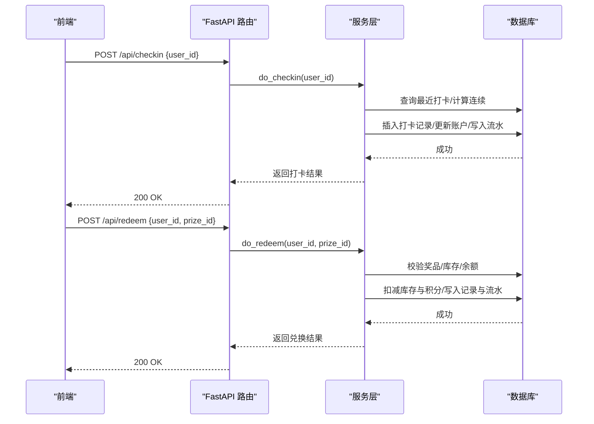
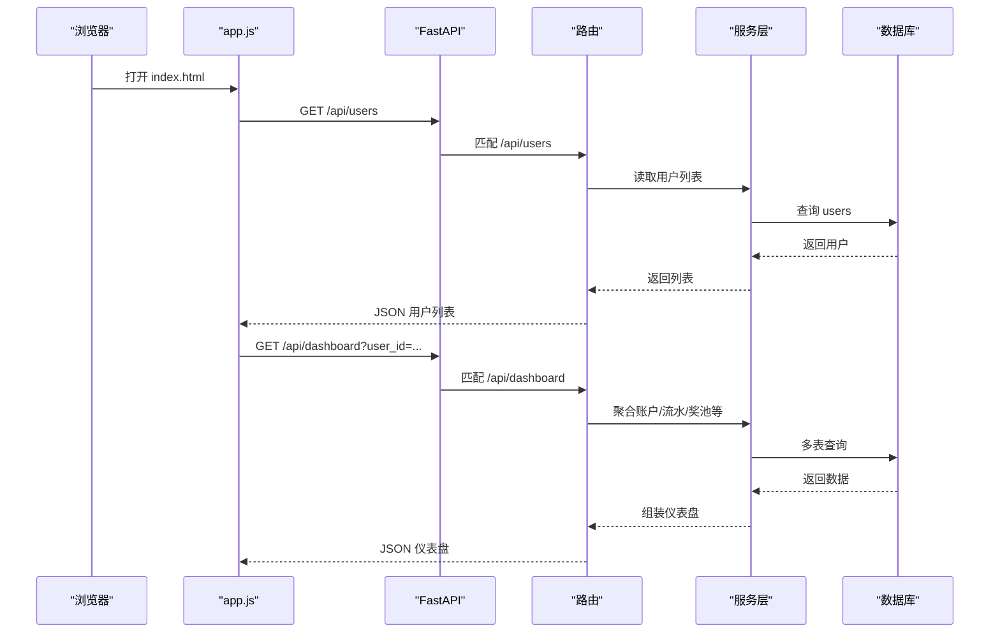
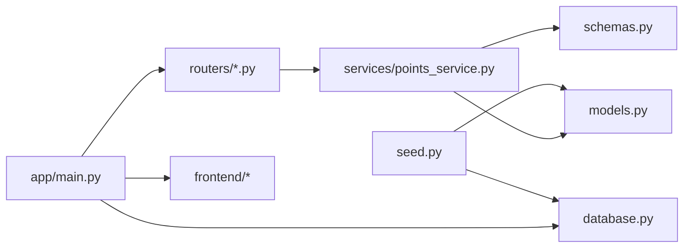

# 集成与部署指南

<cite>
**本文引用的文件**   
- [backend/app/main.py](file://points-system/backend/app/main.py)
- [backend/run.py](file://points-system/backend/run.py)
- [backend/seed.py](file://points-system/backend/seed.py)
- [backend/app/config.py](file://points-system/backend/app/config.py)
- [backend/app/database.py](file://points-system/backend/app/database.py)
- [backend/app/models.py](file://points-system/backend/app/models.py)
- [backend/app/schemas.py](file://points-system/backend/app/schemas.py)
- [backend/app/routers/users.py](file://points-system/backend/app/routers/users.py)
- [backend/app/routers/checkin.py](file://points-system/backend/app/routers/checkin.py)
- [backend/app/routers/redeem.py](file://points-system/backend/app/routers/redeem.py)
- [backend/app/services/points_service.py](file://points-system/backend/app/services/points_service.py)
- [frontend/index.html](file://points-system/frontend/index.html)
- [frontend/app.js](file://points-system/frontend/app.js)
</cite>

## 目录
1. [简介](#简介)
2. [项目结构](#项目结构)
3. [核心组件](#核心组件)
4. [架构总览](#架构总览)
5. [详细组件分析](#详细组件分析)
6. [依赖关系分析](#依赖关系分析)
7. [性能考虑](#性能考虑)
8. [故障排查指南](#故障排查指南)
9. [结论](#结论)
10. [附录](#附录)

## 简介
本指南面向开发与运维人员，提供积分兑换系统的集成与部署说明。内容涵盖：开发环境搭建（Python、依赖、数据库初始化）、生产部署方案（服务器要求、配置与环境变量管理）、前端静态资源集成、API 调用示例与错误处理最佳实践、数据种子脚本使用与测试数据生成技巧、系统监控与日志收集策略、性能调优建议以及常见问题排查与恢复流程。

## 项目结构
后端采用 FastAPI + SQLAlchemy + SQLite 的轻量架构；前端为纯静态页面，由后端统一托管。关键路径如下：
- 应用入口与路由挂载：backend/app/main.py
- 启动脚本：backend/run.py
- 数据库连接与初始化：backend/app/database.py
- 业务模型与接口定义：backend/app/models.py、backend/app/schemas.py
- 业务服务层：backend/app/services/points_service.py
- 路由模块：backend/app/routers/*.py
- 数据种子脚本：backend/seed.py
- 前端静态资源：frontend/index.html、frontend/app.js、frontend/styles.css

图表来源
- [backend/app/main.py:1-33](file://points-system/backend/app/main.py#L1-L33)
- [backend/run.py:1-6](file://points-system/backend/run.py#L1-L6)
- [backend/app/database.py:1-39](file://points-system/backend/app/database.py#L1-L39)
- [backend/app/models.py:1-151](file://points-system/backend/app/models.py#L1-L151)
- [backend/app/schemas.py:1-147](file://points-system/backend/app/schemas.py#L1-L147)
- [backend/app/routers/users.py:1-192](file://points-system/backend/app/routers/users.py#L1-L192)
- [backend/app/routers/checkin.py:1-16](file://points-system/backend/app/routers/checkin.py#L1-L16)
- [backend/app/routers/redeem.py:1-52](file://points-system/backend/app/routers/redeem.py#L1-L52)
- [backend/app/services/points_service.py:1-146](file://points-system/backend/app/services/points_service.py#L1-L146)
- [backend/seed.py:1-87](file://points-system/backend/seed.py#L1-L87)
- [frontend/index.html:1-111](file://points-system/frontend/index.html#L1-L111)
- [frontend/app.js:1-598](file://points-system/frontend/app.js#L1-L598)

章节来源
- [backend/app/main.py:1-33](file://points-system/backend/app/main.py#L1-L33)
- [backend/run.py:1-6](file://points-system/backend/run.py#L1-L6)
- [backend/app/database.py:1-39](file://points-system/backend/app/database.py#L1-L39)
- [backend/app/models.py:1-151](file://points-system/backend/app/models.py#L1-L151)
- [backend/app/schemas.py:1-147](file://points-system/backend/app/schemas.py#L1-L147)
- [backend/app/routers/users.py:1-192](file://points-system/backend/app/routers/users.py#L1-L192)
- [backend/app/routers/checkin.py:1-16](file://points-system/backend/app/routers/checkin.py#L1-L16)
- [backend/app/routers/redeem.py:1-52](file://points-system/backend/app/routers/redeem.py#L1-L52)
- [backend/app/services/points_service.py:1-146](file://points-system/backend/app/services/points_service.py#L1-L146)
- [backend/seed.py:1-87](file://points-system/backend/seed.py#L1-L87)
- [frontend/index.html:1-111](file://points-system/frontend/index.html#L1-L111)
- [frontend/app.js:1-598](file://points-system/frontend/app.js#L1-L598)

## 核心组件
- 应用生命周期与静态资源挂载：在应用启动时执行数据库建表，并将前端静态目录挂载到根路径，实现前后端一体化部署。
- 数据库连接与并发优化：SQLite 开启 WAL 模式与忙等待，降低读改写竞态窗口；通过线程安全参数适配 FastAPI 线程池。
- 业务服务层：打卡、兑换等核心逻辑封装在服务层，保证事务原子性与一致性。
- 路由与接口：RESTful API 暴露用户、积分、抽奖券、奖品、兑换、抽奖等能力。
- 前端集成：静态 HTML/JS/CSS 由后端直接托管，浏览器通过相对路径访问 API。

章节来源
- [backend/app/main.py:14-32](file://points-system/backend/app/main.py#L14-L32)
- [backend/app/database.py:10-23](file://points-system/backend/app/database.py#L10-L23)
- [backend/app/services/points_service.py:1-146](file://points-system/backend/app/services/points_service.py#L1-L146)
- [backend/app/routers/users.py:30-192](file://points-system/backend/app/routers/users.py#L30-L192)
- [frontend/index.html:1-111](file://points-system/frontend/index.html#L1-L111)
- [frontend/app.js:14-26](file://points-system/frontend/app.js#L14-L26)

## 架构总览
下图展示从浏览器到后端的路径、静态资源托管方式以及数据库交互。

图表来源
- [backend/app/main.py:20-32](file://points-system/backend/app/main.py#L20-L32)
- [backend/app/routers/users.py:30-192](file://points-system/backend/app/routers/users.py#L30-L192)
- [backend/app/services/points_service.py:1-146](file://points-system/backend/app/services/points_service.py#L1-L146)
- [backend/app/database.py:1-39](file://points-system/backend/app/database.py#L1-L39)

## 详细组件分析

### 应用启动与静态资源集成
- 启动入口：通过 uvicorn 运行 app.main:app，监听 0.0.0.0:8000。
- 生命周期钩子：应用启动时执行 init_db()，确保表结构存在。
- 静态资源：将 frontend 目录挂载至根路径，支持 index.html 与 CSS/JS 等资源访问。

图表来源
- [backend/run.py:1-6](file://points-system/backend/run.py#L1-L6)
- [backend/app/main.py:14-32](file://points-system/backend/app/main.py#L14-L32)
- [backend/app/database.py:36-39](file://points-system/backend/app/database.py#L36-L39)

章节来源
- [backend/run.py:1-6](file://points-system/backend/run.py#L1-L6)
- [backend/app/main.py:14-32](file://points-system/backend/app/main.py#L14-L32)
- [backend/app/database.py:36-39](file://points-system/backend/app/database.py#L36-L39)

### 数据库设计与并发优化
- 模型：用户、积分账户、积分流水、打卡记录、奖品、兑换记录、积分换抽奖券记录、抽奖券流水、抽奖奖池、抽奖记录。
- 并发优化：WAL 模式与 busy_timeout 提升并发读写稳定性；check_same_thread=False 适配多线程。
- 唯一约束：打卡防重（user_id, check_date）。

图表来源
- [backend/app/models.py:10-151](file://points-system/backend/app/models.py#L10-L151)
- [backend/app/database.py:10-23](file://points-system/backend/app/database.py#L10-L23)

章节来源
- [backend/app/models.py:10-151](file://points-system/backend/app/models.py#L10-L151)
- [backend/app/database.py:10-23](file://points-system/backend/app/database.py#L10-L23)

### 核心业务流程：打卡与兑换
- 打卡流程：校验重复 → 计算连续天数 → 计算奖励 → 更新账户余额与累计 → 写入流水 → 提交事务。
- 兑换流程：校验奖品有效期与库存 → 校验账户余额 → 同一事务内扣减库存与积分 → 写入兑换记录与支出流水 → 提交事务。

图表来源
- [backend/app/routers/checkin.py:11-16](file://points-system/backend/app/routers/checkin.py#L11-L16)
- [backend/app/routers/redeem.py:11-28](file://points-system/backend/app/routers/redeem.py#L11-L28)
- [backend/app/services/points_service.py:41-146](file://points-system/backend/app/services/points_service.py#L41-L146)

章节来源
- [backend/app/routers/checkin.py:11-16](file://points-system/backend/app/routers/checkin.py#L11-L16)
- [backend/app/routers/redeem.py:11-28](file://points-system/backend/app/routers/redeem.py#L11-L28)
- [backend/app/services/points_service.py:41-146](file://points-system/backend/app/services/points_service.py#L41-L146)

### 前端静态资源集成与 API 调用
- 静态资源：后端将 frontend 目录挂载至根路径，浏览器可直接访问 index.html、styles.css、app.js。
- API 基地址：前端默认空字符串，表示同域请求；可通过修改常量指向不同后端地址。
- 典型调用：
  - 获取用户列表：GET /api/users
  - 获取仪表盘：GET /api/dashboard?user_id=...
  - 打卡：POST /api/checkin {user_id}
  - 积分查询：GET /api/points?user_id=...
  - 积分流水：GET /api/ledger?user_id=...&limit=...
  - 兑换奖品：POST /api/redeem {user_id, prize_id}
  - 兑换抽奖券：POST /api/convert {user_id, qty}
  - 抽奖：POST /api/lottery/draw {user_id}

图表来源
- [frontend/app.js:272-299](file://points-system/frontend/app.js#L272-L299)
- [backend/app/routers/users.py:25-192](file://points-system/backend/app/routers/users.py#L25-L192)
- [backend/app/main.py:20-32](file://points-system/backend/app/main.py#L20-L32)

章节来源
- [frontend/index.html:1-111](file://points-system/frontend/index.html#L1-L111)
- [frontend/app.js:14-26](file://points-system/frontend/app.js#L14-L26)
- [frontend/app.js:272-299](file://points-system/frontend/app.js#L272-L299)
- [backend/app/routers/users.py:25-192](file://points-system/backend/app/routers/users.py#L25-L192)
- [backend/app/main.py:20-32](file://points-system/backend/app/main.py#L20-L32)

### 数据种子脚本与测试数据生成
- 用途：快速初始化演示用户、奖品、抽奖奖池等基础数据。
- 使用方法：在项目根目录下执行种子脚本，自动完成建表与数据填充。
- 注意事项：
  - 首次运行会创建数据库文件与表结构。
  - 重复运行不会覆盖已有同名数据（按名称去重）。
  - 可在本地或测试环境多次执行以重置演示数据。

章节来源
- [backend/seed.py:1-87](file://points-system/backend/seed.py#L1-L87)

## 依赖关系分析
- 运行时依赖：FastAPI、Uvicorn、SQLAlchemy、Pydantic。
- 数据库驱动：SQLite（内置），无需额外安装。
- 前端依赖：无外部库，原生 JS + Canvas。

图表来源
- [backend/app/main.py:1-33](file://points-system/backend/app/main.py#L1-L33)
- [backend/app/routers/users.py:1-192](file://points-system/backend/app/routers/users.py#L1-L192)
- [backend/app/services/points_service.py:1-146](file://points-system/backend/app/services/points_service.py#L1-L146)
- [backend/app/models.py:1-151](file://points-system/backend/app/models.py#L1-L151)
- [backend/app/schemas.py:1-147](file://points-system/backend/app/schemas.py#L1-L147)
- [backend/app/database.py:1-39](file://points-system/backend/app/database.py#L1-L39)
- [backend/seed.py:1-87](file://points-system/backend/seed.py#L1-L87)

章节来源
- [backend/app/main.py:1-33](file://points-system/backend/app/main.py#L1-L33)
- [backend/app/services/points_service.py:1-146](file://points-system/backend/app/services/points_service.py#L1-L146)
- [backend/app/models.py:1-151](file://points-system/backend/app/models.py#L1-L151)
- [backend/app/schemas.py:1-147](file://points-system/backend/app/schemas.py#L1-L147)
- [backend/app/database.py:1-39](file://points-system/backend/app/database.py#L1-L39)
- [backend/seed.py:1-87](file://points-system/backend/seed.py#L1-L87)

## 性能考虑
- 数据库层面：
  - SQLite 已启用 WAL 与忙等待，适合中小规模并发场景。
  - 若未来迁移至 PostgreSQL，建议在热点行加悲观锁（如 with_for_update）进一步提升一致性保障。
- 应用层面：
  - 单进程 Uvicorn 适用于低中负载；高并发可考虑多 worker 与反向代理（Nginx）负载均衡。
  - 减少不必要的 N+1 查询，仪表盘接口已聚合必要数据，避免前端多次请求。
- 前端层面：
  - 转盘动画使用 CSS transform 与 transition，GPU 加速友好。
  - 错误提示与按钮锁定避免重复提交。

[本节为通用指导，不直接分析具体文件]

## 故障排查指南
- 启动失败
  - 检查端口占用与权限；确认 uvicorn 能正确加载 app.main:app。
  - 查看日志输出定位异常堆栈。
- 数据库问题
  - 确认 app.db 文件存在且可写；WAL 模式下避免外部工具同时写入。
  - 若出现“数据库被锁定”，检查并发写入与 busy_timeout 设置。
- 接口报错
  - 404：用户或奖品不存在；检查入参与数据是否初始化。
  - 409：重复打卡或库存不足；检查唯一约束与库存状态。
  - 400：积分不足、未开始/已过期；检查时间范围与余额。
- 前端无法加载
  - 确认静态目录挂载正常；浏览器控制台查看网络请求路径与状态码。
- 恢复步骤
  - 重新执行种子脚本重建演示数据。
  - 重启服务后观察日志与数据库文件变化。

章节来源
- [backend/run.py:1-6](file://points-system/backend/run.py#L1-L6)
- [backend/app/database.py:10-23](file://points-system/backend/app/database.py#L10-L23)
- [backend/app/services/points_service.py:77-83](file://points-system/backend/app/services/points_service.py#L77-L83)
- [backend/app/routers/redeem.py:11-28](file://points-system/backend/app/routers/redeem.py#L11-L28)
- [backend/seed.py:38-87](file://points-system/backend/seed.py#L38-L87)

## 结论
本指南提供了从开发到生产的完整集成与部署路径。通过统一的静态资源托管、清晰的 API 设计、事务一致性的服务层实现以及完善的种子脚本，系统易于在本地与生产环境快速落地。结合监控与日志策略，可有效保障稳定运行与问题快速定位。

[本节为总结性内容，不直接分析具体文件]

## 附录

### 开发环境搭建步骤
- Python 环境
  - 安装 Python 3.x（建议使用 3.9+）。
  - 创建虚拟环境并激活。
- 依赖包安装
  - 安装 FastAPI、Uvicorn、SQLAlchemy、Pydantic 等依赖。
- 数据库初始化
  - 首次运行会自动创建 SQLite 数据库与表结构。
  - 执行种子脚本以生成演示数据。
- 启动服务
  - 使用 run.py 启动应用，监听 0.0.0.0:8000。
  - 浏览器访问 http://localhost:8000 即可看到前端界面。

章节来源
- [backend/run.py:1-6](file://points-system/backend/run.py#L1-L6)
- [backend/app/database.py:36-39](file://points-system/backend/app/database.py#L36-L39)
- [backend/seed.py:38-87](file://points-system/backend/seed.py#L38-L87)
- [frontend/index.html:1-111](file://points-system/frontend/index.html#L1-L111)

### 生产环境部署方案
- 服务器要求
  - CPU/内存：根据并发量评估，一般 2C4G 可满足中小规模。
  - 操作系统：Linux（推荐 Ubuntu/CentOS）。
- 配置文件与环境变量
  - 当前配置集中在 config.py，如需在生产环境覆盖，可将相关常量改为从环境变量读取并在部署前注入。
  - 数据库 URL 与路径可按需调整（当前默认 SQLite 文件路径位于应用目录）。
- 进程管理与反向代理
  - 使用 systemd 或容器编排管理进程。
  - 通过 Nginx 反代到 Uvicorn，并启用 HTTPS。
- 静态资源与缓存
  - 利用 CDN 或 Nginx 缓存静态资源，提升首屏加载速度。

章节来源
- [backend/app/config.py:1-17](file://points-system/backend/app/config.py#L1-L17)
- [backend/app/database.py:6-8](file://points-system/backend/app/database.py#L6-L8)
- [backend/app/main.py:20-32](file://points-system/backend/app/main.py#L20-L32)

### API 调用示例与错误处理最佳实践
- 示例
  - 注册：POST /api/register {username, display_name}
  - 打卡：POST /api/checkin {user_id}
  - 兑换：POST /api/redeem {user_id, prize_id}
  - 兑换券：POST /api/convert {user_id, qty}
  - 抽奖：POST /api/lottery/draw {user_id}
- 错误处理
  - 统一返回 HTTP 状态码与 detail 字段。
  - 前端捕获异常并提示用户，避免重复操作。
  - 对幂等接口增加客户端重试保护与服务端唯一约束兜底。

章节来源
- [backend/app/routers/users.py:11-22](file://points-system/backend/app/routers/users.py#L11-L22)
- [backend/app/routers/checkin.py:11-16](file://points-system/backend/app/routers/checkin.py#L11-L16)
- [backend/app/routers/redeem.py:11-28](file://points-system/backend/app/routers/redeem.py#L11-L28)
- [frontend/app.js:14-26](file://points-system/frontend/app.js#L14-L26)

### 系统监控与日志收集策略
- 应用日志
  - 在路由或服务层添加结构化日志（请求 ID、用户 ID、操作类型、耗时）。
  - 将日志输出到标准输出，便于容器化采集。
- 指标监控
  - 暴露健康检查端点（如 /health）。
  - 统计关键指标：QPS、错误率、P95 延迟、数据库连接数。
- 告警与追踪
  - 基于日志与指标设置阈值告警。
  - 引入分布式追踪（可选）以定位跨层调用瓶颈。

[本节为通用指导，不直接分析具体文件]

### 常见问题排查与恢复
- 重复打卡
  - 现象：返回 409 重复打卡。
  - 原因：业务层先查后写 + 唯一约束兜底。
  - 处理：引导用户次日再打；检查并发控制。
- 库存不足
  - 现象：返回 409 库存不足。
  - 处理：补充库存或关闭兑换；检查后台管理。
- 数据库锁定
  - 现象：SQLite 报 locked。
  - 处理：检查是否有外部工具写入；增大 busy_timeout；必要时迁移至 PostgreSQL。
- 前端无法加载
  - 现象：静态资源 404。
  - 处理：确认静态目录挂载与路径；检查浏览器网络面板。

章节来源
- [backend/app/services/points_service.py:77-83](file://points-system/backend/app/services/points_service.py#L77-L83)
- [backend/app/routers/redeem.py:11-28](file://points-system/backend/app/routers/redeem.py#L11-L28)
- [backend/app/database.py:10-23](file://points-system/backend/app/database.py#L10-L23)
- [backend/app/main.py:20-32](file://points-system/backend/app/main.py#L20-L32)