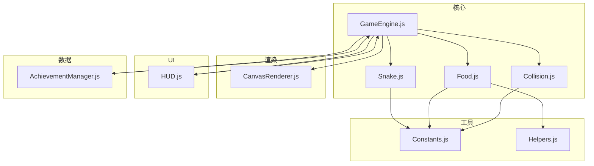
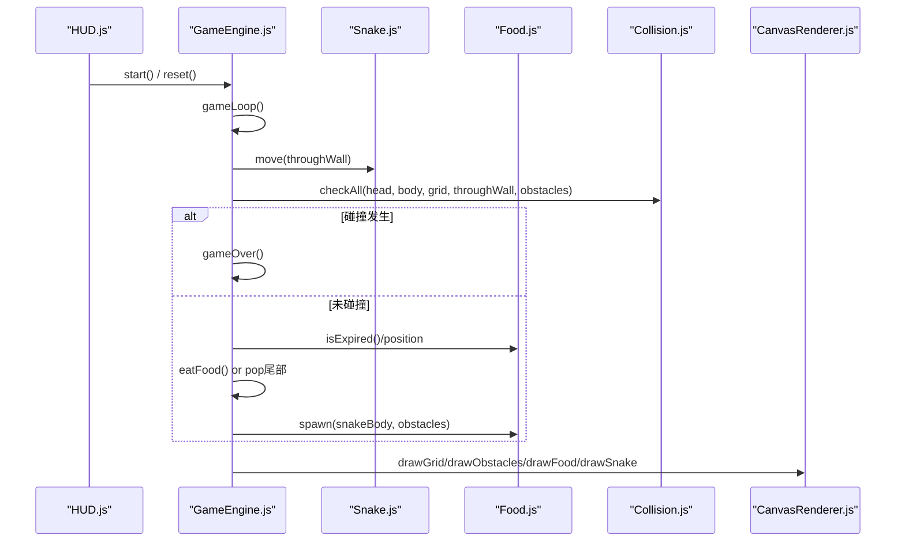
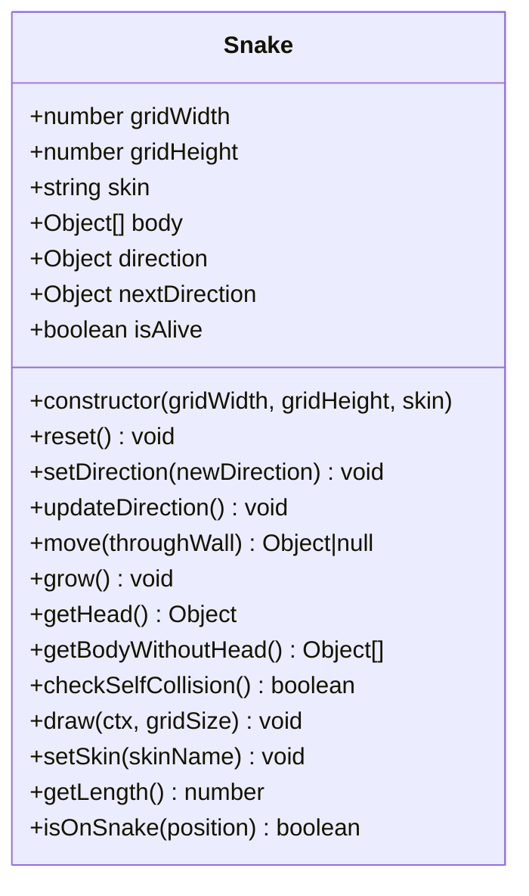
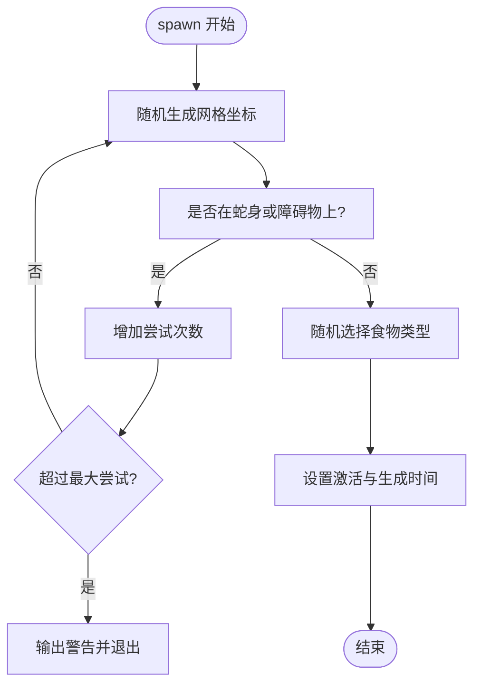
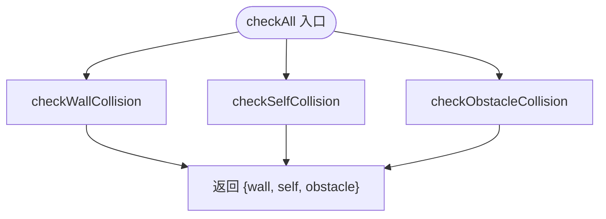
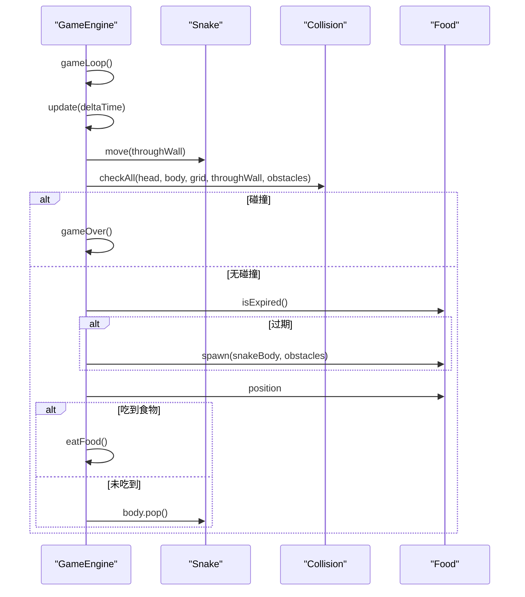
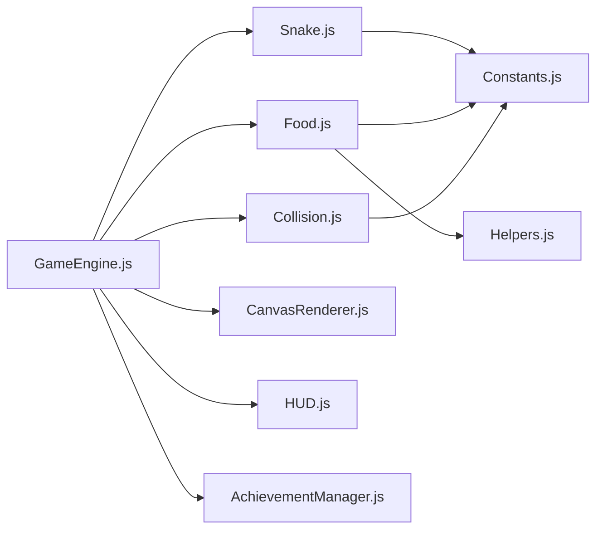

# 核心游戏模块

<cite>
**本文引用的文件列表**   
- [Snake.js](file://snake-game/js/core/Snake.js)
- [Food.js](file://snake-game/js/core/Food.js)
- [Collision.js](file://snake-game/js/core/Collision.js)
- [GameEngine.js](file://snake-game/js/core/GameEngine.js)
- [Constants.js](file://snake-game/js/utils/Constants.js)
- [Helpers.js](file://snake-game/js/utils/Helpers.js)
- [CanvasRenderer.js](file://snake-game/js/render/CanvasRenderer.js)
- [HUD.js](file://snake-game/js/ui/HUD.js)
- [AchievementManager.js](file://snake-game/js/data/AchievementManager.js)
</cite>

## 目录
1. [简介](#简介)
2. [项目结构](#项目结构)
3. [核心组件](#核心组件)
4. [架构总览](#架构总览)
5. [详细组件分析](#详细组件分析)
6. [依赖关系分析](#依赖关系分析)
7. [性能考量](#性能考量)
8. [故障排查指南](#故障排查指南)
9. [结论](#结论)
10. [附录：API与配置说明](#附录api与配置说明)

## 简介
本技术文档聚焦贪吃蛇游戏的“核心游戏模块”，围绕 Snake 蛇类、Food 食物系统、Collision 碰撞检测三大核心进行深度解析，并给出完整的 API 接口说明、参数配置选项与使用示例。目标是帮助开发者快速理解并扩展游戏核心功能，包括移动算法、方向控制、身体增长机制、碰撞检测优化、食物生成与过期策略等。

## 项目结构
核心模块位于 snake-game/js/core 目录下，配合 utils、render、ui、data 等辅助模块共同构成完整的游戏运行时。

图表来源
- [GameEngine.js:1-120](file://snake-game/js/core/GameEngine.js#L1-L120)
- [Snake.js:1-60](file://snake-game/js/core/Snake.js#L1-L60)
- [Food.js:1-60](file://snake-game/js/core/Food.js#L1-L60)
- [Collision.js:1-40](file://snake-game/js/core/Collision.js#L1-L40)
- [Constants.js:1-40](file://snake-game/js/utils/Constants.js#L1-L40)
- [Helpers.js:1-40](file://snake-game/js/utils/Helpers.js#L1-L40)
- [CanvasRenderer.js:1-40](file://snake-game/js/render/CanvasRenderer.js#L1-L40)
- [HUD.js:1-40](file://snake-game/js/ui/HUD.js#L1-L40)
- [AchievementManager.js:1-40](file://snake-game/js/data/AchievementManager.js#L1-L40)

章节来源
- [GameEngine.js:1-120](file://snake-game/js/core/GameEngine.js#L1-L120)
- [Constants.js:1-40](file://snake-game/js/utils/Constants.js#L1-L40)

## 核心组件
本节概述各核心组件的职责与交互方式，后续章节将深入展开。

- GameEngine：游戏主循环、状态管理、输入处理、事件总线集成、粒子与飘字效果、存储与统计。
- Snake：蛇的移动、方向控制、长度变化、自碰撞检测、绘制。
- Food：食物生成、随机位置选择、类型与分值、过期机制、绘制。
- Collision：边界、自身、障碍物、食物的碰撞检测聚合。
- CanvasRenderer：网格、障碍物、蛇、食物的绘制（可被引擎或独立渲染器调用）。
- Constants/Helpers：常量定义与通用工具函数。
- HUD：界面更新与用户交互绑定。
- AchievementManager：成就解锁逻辑与通知。

章节来源
- [GameEngine.js:1-120](file://snake-game/js/core/GameEngine.js#L1-L120)
- [Snake.js:1-60](file://snake-game/js/core/Snake.js#L1-L60)
- [Food.js:1-60](file://snake-game/js/core/Food.js#L1-L60)
- [Collision.js:1-40](file://snake-game/js/core/Collision.js#L1-L40)
- [CanvasRenderer.js:1-40](file://snake-game/js/render/CanvasRenderer.js#L1-L40)
- [Constants.js:1-40](file://snake-game/js/utils/Constants.js#L1-L40)
- [Helpers.js:1-40](file://snake-game/js/utils/Helpers.js#L1-L40)
- [HUD.js:1-40](file://snake-game/js/ui/HUD.js#L1-L40)
- [AchievementManager.js:1-40](file://snake-game/js/data/AchievementManager.js#L1-L40)

## 架构总览
下图展示了核心模块之间的协作关系与数据流。

图表来源
- [GameEngine.js:276-341](file://snake-game/js/core/GameEngine.js#L276-L341)
- [Snake.js:61-88](file://snake-game/js/core/Snake.js#L61-L88)
- [Collision.js:60-66](file://snake-game/js/core/Collision.js#L60-L66)
- [Food.js:28-52](file://snake-game/js/core/Food.js#L28-L52)
- [CanvasRenderer.js:11-60](file://snake-game/js/render/CanvasRenderer.js#L11-L60)

## 详细组件分析

### Snake 蛇类设计与实现
- 数据结构
  - body：坐标数组，索引0为头部，其余为身体节段。
  - direction/nextDirection：当前方向与下一帧方向，避免同帧多次转向导致反向。
  - skin：皮肤名称，影响颜色与眼睛绘制。
- 移动算法
  - 每帧计算新头部 = 旧头部 + 方向向量；支持穿墙模式（wrap-around）。
  - 通过 unshift 插入新头部；是否移除尾部由 GameEngine 根据是否吃到食物决定。
- 方向控制
  - setDirection 阻止180度反向；updateDirection 在移动前应用 nextDirection。
- 身体增长
  - grow 为语义方法，实际增长由 GameEngine 在吃食物时不执行 pop 实现。
- 碰撞检测
  - checkSelfCollision 比较头与身体其他节段坐标。
- 绘制
  - 按皮肤颜色绘制头部与身体，并根据方向绘制眼睛；身体连接处有圆角效果。
- 复杂度
  - 移动 O(1)，自碰撞 O(n)（n 为蛇身长度），绘制 O(n)。

图表来源
- [Snake.js:1-214](file://snake-game/js/core/Snake.js#L1-L214)

章节来源
- [Snake.js:1-214](file://snake-game/js/core/Snake.js#L1-L214)

### Food 食物系统设计
- 数据结构
  - position：网格坐标。
  - type：食物类型对象（包含 color/value）。
  - spawnTime/duration：生成时间与存在时长（毫秒），-1 表示永不过期。
  - active：是否激活。
- 生成算法
  - spawn 在网格内随机生成位置，避开蛇身与障碍物，最多尝试固定次数以避免死循环。
  - 随机选择食物类型：普通、金色、彩虹，概率不同。
- 过期机制
  - isExpired 基于时间差判断是否过期；过期后由 GameEngine 重新生成。
- 绘制
  - 圆形食物，带高光；特殊类型（金色/彩虹）添加闪烁外圈效果。
- 复杂度
  - 生成平均 O(1)，最坏受限于最大尝试次数；过期检查 O(1)。

图表来源
- [Food.js:28-52](file://snake-game/js/core/Food.js#L28-L52)
- [Helpers.js:37-46](file://snake-game/js/utils/Helpers.js#L37-L46)

章节来源
- [Food.js:1-168](file://snake-game/js/core/Food.js#L1-L168)
- [Helpers.js:37-46](file://snake-game/js/utils/Helpers.js#L37-L46)

### Collision 碰撞检测系统
- 边界检测
  - checkWallCollision：在非穿墙模式下，判断头坐标是否越界。
- 自碰撞检测
  - checkSelfCollision：判断头是否与身体其他节段重合。
- 障碍物碰撞
  - checkObstacleCollision：遍历障碍物集合判断是否重合。
- 食物碰撞
  - checkFoodCollision：判断头与食物坐标是否一致。
- 综合检测
  - checkAll：返回 wall/self/obstacle 布尔结果，供 GameEngine 统一判定。
- 复杂度
  - 边界 O(1)，自碰撞 O(n)，障碍物 O(m)（m 为障碍物数量），食物 O(1)。

图表来源
- [Collision.js:12-48](file://snake-game/js/core/Collision.js#L12-L48)
- [Collision.js:60-66](file://snake-game/js/core/Collision.js#L60-L66)

章节来源
- [Collision.js:1-73](file://snake-game/js/core/Collision.js#L1-L73)

### GameEngine 主循环与流程
- 初始化与尺寸适配
  - 监听窗口 resize，延迟调整 Canvas 尺寸以保持网格对齐。
- 游戏循环
  - 使用 requestAnimationFrame 驱动；accumulator 累加时间，按难度速度间隔触发 update。
- 更新流程
  - 计时模式倒计时；移动蛇；综合碰撞检测；若碰撞则结束；否则判断是否吃到食物；若食物过期则重新生成。
- 吃食物
  - 加分、触发粒子与飘字、震动与音效、事件广播、成就检查、重新生成食物。
- 死亡动画
  - 死亡后启动闪烁动画，随后保存最高分与记录，延迟显示结束界面。
- 暂停/恢复/重置
  - 管理状态机与事件，清理动画帧与视觉效果。

图表来源
- [GameEngine.js:276-341](file://snake-game/js/core/GameEngine.js#L276-L341)
- [GameEngine.js:343-378](file://snake-game/js/core/GameEngine.js#L343-L378)
- [GameEngine.js:460-506](file://snake-game/js/core/GameEngine.js#L460-L506)

章节来源
- [GameEngine.js:1-800](file://snake-game/js/core/GameEngine.js#L1-L800)

### 渲染与界面
- CanvasRenderer
  - 提供网格、障碍物、蛇、食物的绘制方法，便于引擎或外部渲染器复用。
- HUD
  - 绑定按钮事件，监听事件总线更新分数、最高分、计时器，展示结束界面。

章节来源
- [CanvasRenderer.js:1-188](file://snake-game/js/render/CanvasRenderer.js#L1-L188)
- [HUD.js:1-178](file://snake-game/js/ui/HUD.js#L1-L178)

### 成就系统
- AchievementManager
  - 维护成就列表与解锁状态，从本地存储加载/保存；在吃食物与游戏结束时检查条件并弹出通知。

章节来源
- [AchievementManager.js:1-252](file://snake-game/js/data/AchievementManager.js#L1-L252)

## 依赖关系分析
- 模块耦合
  - GameEngine 强依赖 Snake、Food、Collision、CanvasRenderer、HUD、AchievementManager。
  - Snake 依赖 Constants（DIRECTION、SKIN_COLORS）。
  - Food 依赖 Helpers（randomInt、isPositionInArray、getRandomFoodType）与 Constants（FOOD_TYPE）。
  - Collision 依赖 Constants（GRID 维度）。
- 潜在循环依赖
  - 当前设计以单向依赖为主，未见明显循环引用。
- 外部集成点
  - 事件总线 globalEventBus（用于 UI 与成就系统通信）。
  - localStorage 持久化设置与统计数据。

图表来源
- [GameEngine.js:1-120](file://snake-game/js/core/GameEngine.js#L1-L120)
- [Snake.js:1-60](file://snake-game/js/core/Snake.js#L1-L60)
- [Food.js:1-60](file://snake-game/js/core/Food.js#L1-L60)
- [Collision.js:1-40](file://snake-game/js/core/Collision.js#L1-L40)
- [CanvasRenderer.js:1-40](file://snake-game/js/render/CanvasRenderer.js#L1-L40)
- [HUD.js:1-40](file://snake-game/js/ui/HUD.js#L1-L40)
- [AchievementManager.js:1-40](file://snake-game/js/data/AchievementManager.js#L1-L40)
- [Constants.js:1-40](file://snake-game/js/utils/Constants.js#L1-L40)
- [Helpers.js:1-40](file://snake-game/js/utils/Helpers.js#L1-L40)

章节来源
- [GameEngine.js:1-120](file://snake-game/js/core/GameEngine.js#L1-L120)
- [Constants.js:1-40](file://snake-game/js/utils/Constants.js#L1-L40)
- [Helpers.js:1-40](file://snake-game/js/utils/Helpers.js#L1-L40)

## 性能考量
- 移动与碰撞
  - 自碰撞与障碍物碰撞为线性扫描，建议对大规模障碍物场景引入空间划分（如网格哈希或四叉树）以降低 O(n)/O(m)。
- 渲染
  - 大量粒子与飘字会频繁创建/销毁对象，建议使用对象池减少 GC 压力。
- 时间步进
  - accumulator 累积误差可能导致跳帧，可在极端情况下限制最大迭代次数。
- 随机生成
  - 食物生成在高密度障碍下可能多次重试，可预计算可用位置集合以提升稳定性。

[本节为通用性能建议，无需特定文件来源]

## 故障排查指南
- 食物无法生成
  - 检查 spawn 的最大尝试次数与网格大小，确认障碍物与蛇身覆盖比例过高导致无空位。
- 穿墙模式异常
  - 确认 difficulty.throughWall 与 Snake.move 的 wrap-around 逻辑一致。
- 方向反转无效
  - 检查 setDirection 的180度反向保护与 updateDirection 的调用时机。
- 碰撞误判
  - 核对 Collision.checkAll 的参数顺序与网格边界值，确保 head/body 不包含重复元素。
- 渲染错位
  - 确认 Canvas 尺寸与 gridSize 对齐，resizeCanvas 在容器可见后再执行。

章节来源
- [Food.js:28-52](file://snake-game/js/core/Food.js#L28-L52)
- [Snake.js:40-88](file://snake-game/js/core/Snake.js#L40-L88)
- [Collision.js:12-48](file://snake-game/js/core/Collision.js#L12-L48)
- [GameEngine.js:70-95](file://snake-game/js/core/GameEngine.js#L70-L95)

## 结论
核心模块采用清晰的分层与职责分离：GameEngine 作为协调者，Snake/Food/Collision 分别负责实体行为、资源管理与规则判定，CanvasRenderer 与 HUD 解耦渲染与界面。该设计易于扩展（新增食物类型、皮肤、成就、模式），并通过事件总线与本地存储增强可观测性与可玩性。建议在大规模场景下进一步优化碰撞与渲染性能。

[本节为总结性内容，无需特定文件来源]

## 附录：API与配置说明

### Snake 类 API
- 构造与重置
  - constructor(gridWidth, gridHeight, skin)
  - reset()
- 方向控制
  - setDirection({x, y})
  - updateDirection()
- 移动与增长
  - move(throughWall): 返回新头部坐标或 null（死亡）
  - grow(): 语义方法，实际增长由引擎控制
- 查询与检测
  - getHead(): 返回头部坐标
  - getBodyWithoutHead(): 返回除头外的身体
  - checkSelfCollision(): 是否撞到自己
  - getLength(): 长度
  - isOnSnake(position): 某位置是否在蛇身上
- 外观
  - draw(ctx, gridSize)
  - setSkin(skinName)

章节来源
- [Snake.js:1-214](file://snake-game/js/core/Snake.js#L1-L214)

### Food 类 API
- 构造与生成
  - constructor(gridWidth, gridHeight, duration)
  - spawn(snakeBody, obstacles)
- 生命周期
  - isExpired(): 是否过期
  - consume(): 标记被吃掉
  - reset(snakeBody, obstacles)
- 属性访问
  - getPosition(): 返回位置副本
  - getValue(): 返回分值
  - setType(type): 测试用设置类型
  - setDuration(duration): 设置存在时长
- 绘制
  - draw(ctx, gridSize)

章节来源
- [Food.js:1-168](file://snake-game/js/core/Food.js#L1-L168)

### Collision 模块 API
- checkWallCollision(head, gridWidth, gridHeight, throughWall)
- checkSelfCollision(head, body)
- checkFoodCollision(head, foodPos)
- checkObstacleCollision(head, obstacles)
- checkAll(head, body, gridWidth, gridHeight, throughWall, obstacles)

章节来源
- [Collision.js:1-73](file://snake-game/js/core/Collision.js#L1-L73)

### GameEngine 关键 API
- 生命周期
  - start(), pause(), resume(), reset(), stop()
- 配置
  - setDifficulty(level), setGameMode(mode), setSkin(skinName)
- 输入
  - handleInput(direction)
- 事件
  - 内部 emit 'game:start', 'game:playing', 'game:eatFood', 'game:over', 'game:timeUpdate', 'game:highScore' 等

章节来源
- [GameEngine.js:1-800](file://snake-game/js/core/GameEngine.js#L1-L800)

### 配置项（来自 Constants）
- 网格与方向
  - GRID_SIZE, GRID_WIDTH, GRID_HEIGHT
  - DIRECTION.UP/DOWN/LEFT/RIGHT
- 游戏状态与模式
  - GAME_STATE.IDLE/READY/PLAYING/PAUSED/GAME_OVER
  - GAME_MODE.CLASSIC/TIMED/OBSTACLE
- 难度
  - DIFFICULTY.EASY/MEDIUM/HARD（含 speed、throughWall、obstacleCount）
- 食物类型
  - FOOD_TYPE.NORMAL/GOLDEN/RAINBOW（color/value）
- 皮肤
  - SKIN_COLORS.classic/cartoon/neon/nature/minimal（head/body/eye）
- 默认设置
  - DEFAULT_SETTINGS（soundEnabled/vibrationEnabled/selectedSkin/selectedDifficulty/selectedMode/language/fontSize/eyeCareMode）
- 存储键
  - STORAGE_KEY

章节来源
- [Constants.js:1-81](file://snake-game/js/utils/Constants.js#L1-L81)

### 使用示例（步骤式）
- 初始化与启动
  - 创建 GameEngine 实例并调用 start()。
- 输入控制
  - 监听键盘/触摸事件，调用 engine.handleInput(DIRECTION.XXX)。
- 自定义食物
  - 通过 Food.setDuration 与 Food.setType 调整行为（测试用途）。
- 切换皮肤
  - engine.setSkin('neon') 并在 Snake 中生效。
- 观察事件
  - 订阅 'game:eatFood'/'game:over' 更新 UI 或统计。

章节来源
- [GameEngine.js:220-274](file://snake-game/js/core/GameEngine.js#L220-L274)
- [GameEngine.js:769-772](file://snake-game/js/core/GameEngine.js#L769-L772)
- [Food.js:149-161](file://snake-game/js/core/Food.js#L149-L161)
- [Snake.js:186-190](file://snake-game/js/core/Snake.js#L186-L190)
- [HUD.js:57-86](file://snake-game/js/ui/HUD.js#L57-L86)