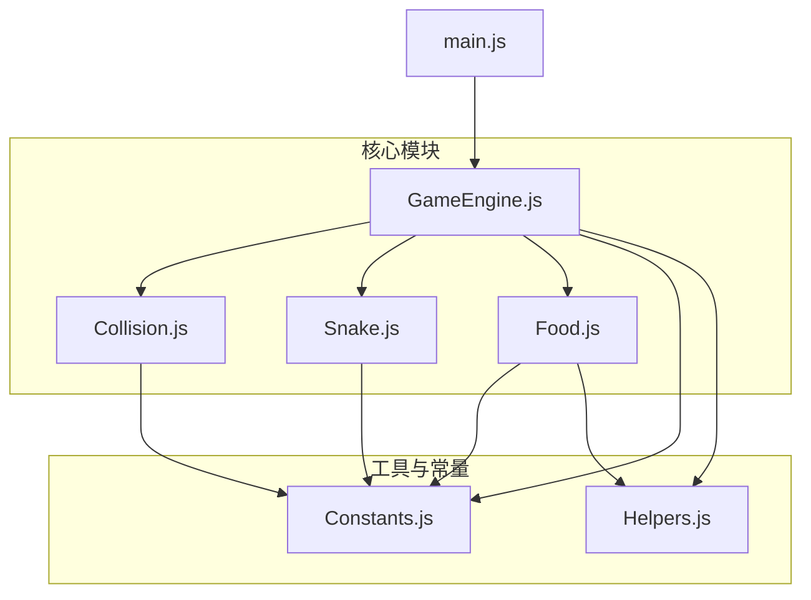
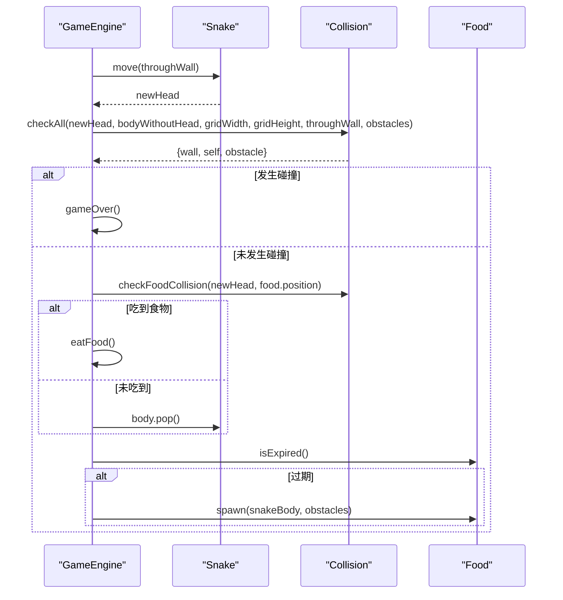
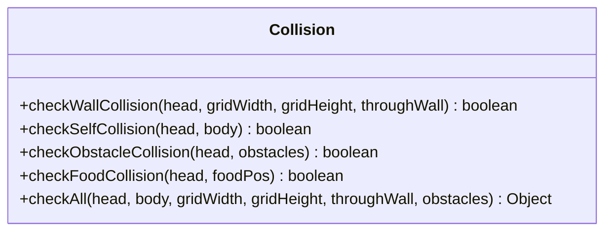
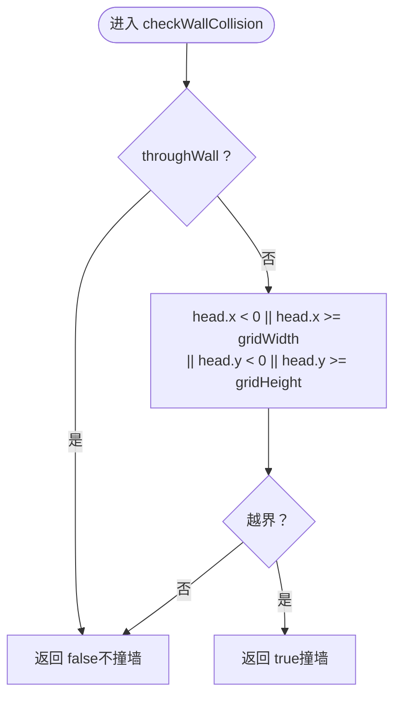
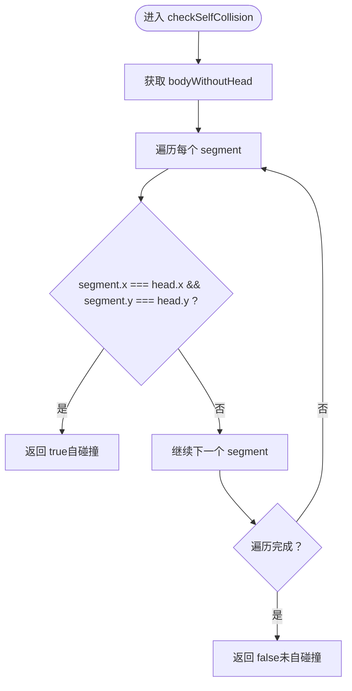
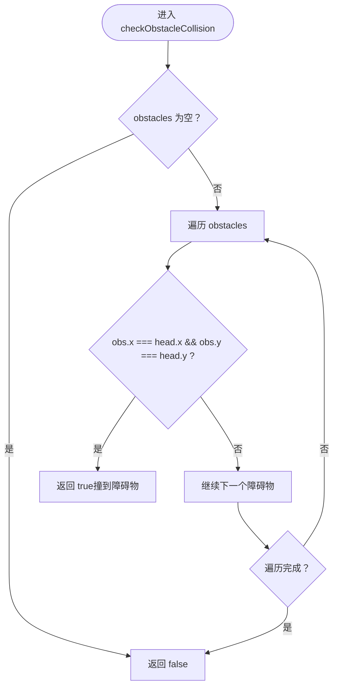
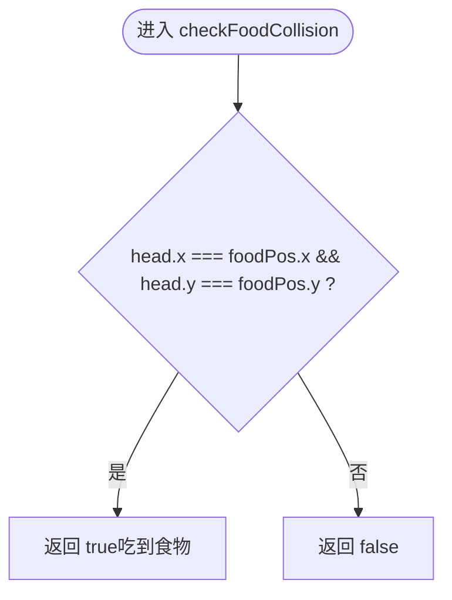
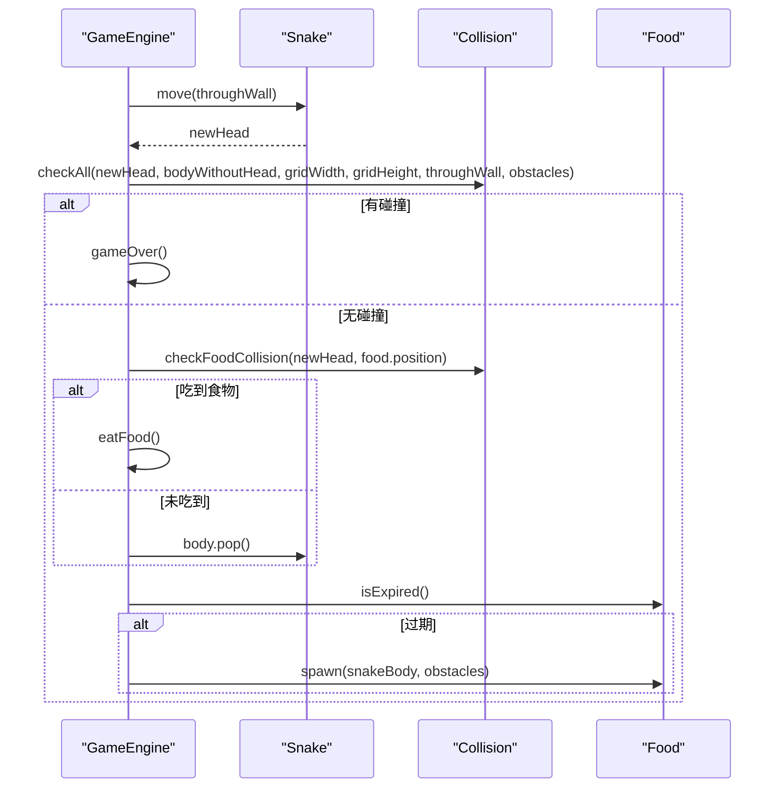
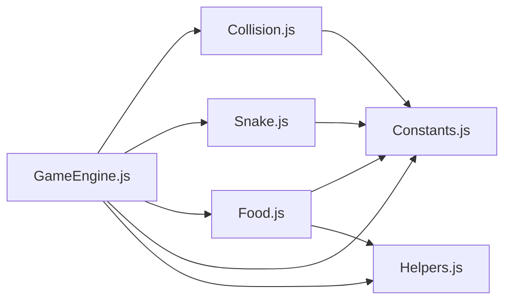

# 碰撞检测(Collision)

<cite>
**本文引用的文件**
- [Collision.js](file://snake-game/js/core/Collision.js)
- [Snake.js](file://snake-game/js/core/Snake.js)
- [Food.js](file://snake-game/js/core/Food.js)
- [GameEngine.js](file://snake-game/js/core/GameEngine.js)
- [Constants.js](file://snake-game/js/utils/Constants.js)
- [Helpers.js](file://snake-game/js/utils/Helpers.js)
- [main.js](file://snake-game/js/main.js)
</cite>

## 目录
1. [简介](#简介)
2. [项目结构](#项目结构)
3. [核心组件](#核心组件)
4. [架构总览](#架构总览)
5. [详细组件分析](#详细组件分析)
6. [依赖关系分析](#依赖关系分析)
7. [性能考量](#性能考量)
8. [故障排查指南](#故障排查指南)
9. [结论](#结论)
10. [附录：API 与使用示例](#附录api-与使用示例)

## 简介
本技术文档聚焦于贪吃蛇游戏的碰撞检测系统，围绕 Collision 模块的设计与实现进行深入解析。内容涵盖边界碰撞、自碰撞、障碍物碰撞与食物碰撞的检测算法、数据结构与处理流程；同时提供 API 接口说明、使用示例、性能优化建议与调试工具指南，帮助开发者快速理解并扩展碰撞检测能力。

## 项目结构
与碰撞检测相关的核心代码位于 snake-game/js/core 与 snake-game/js/utils 目录下：
- core/Collision.js：统一的碰撞检测模块，提供边界、自身、障碍物、食物的检测方法与综合检测入口。
- core/Snake.js：蛇的移动、方向控制、长度增长与自碰撞检测（内部也实现了 checkSelfCollision）。
- core/Food.js：食物生成、过期、类型与位置判定。
- core/GameEngine.js：游戏主循环中调用 Collision.checkAll 进行统一碰撞判断，并驱动后续逻辑（死亡、吃食物等）。
- utils/Constants.js：网格尺寸、难度、模式、食物类型等常量定义。
- utils/Helpers.js：通用工具函数，如随机数、坐标比较、数组包含检查等。
- main.js：入口脚本，负责初始化引擎与输入事件绑定。

图表来源
- [GameEngine.js:300-341](file://snake-game/js/core/GameEngine.js#L300-L341)
- [Collision.js:1-73](file://snake-game/js/core/Collision.js#L1-L73)
- [Snake.js:1-214](file://snake-game/js/core/Snake.js#L1-L214)
- [Food.js:1-168](file://snake-game/js/core/Food.js#L1-L168)
- [Constants.js:1-81](file://snake-game/js/utils/Constants.js#L1-L81)
- [Helpers.js:1-147](file://snake-game/js/utils/Helpers.js#L1-L147)
- [main.js:1-216](file://snake-game/js/main.js#L1-L216)

章节来源
- [GameEngine.js:300-341](file://snake-game/js/core/GameEngine.js#L300-L341)
- [Collision.js:1-73](file://snake-game/js/core/Collision.js#L1-L73)
- [Snake.js:1-214](file://snake-game/js/core/Snake.js#L1-L214)
- [Food.js:1-168](file://snake-game/js/core/Food.js#L1-L168)
- [Constants.js:1-81](file://snake-game/js/utils/Constants.js#L1-L81)
- [Helpers.js:1-147](file://snake-game/js/utils/Helpers.js#L1-L147)
- [main.js:1-216](file://snake-game/js/main.js#L1-L216)

## 核心组件
- Collision 模块
  - 职责：封装所有碰撞检测逻辑，对外暴露统一方法，供 GameEngine 在每帧更新时调用。
  - 关键方法：checkWallCollision、checkSelfCollision、checkObstacleCollision、checkFoodCollision、checkAll。
- Snake 类
  - 职责：管理蛇的状态（位置、方向、长度）、移动与绘制，并提供内部自碰撞检测方法。
  - 关键点：move() 计算新头部坐标，支持穿墙；getBodyWithoutHead() 返回不含头的身体段集合。
- Food 类
  - 职责：管理食物位置、类型、存在时长与是否活跃；提供 isAtPosition 用于判定蛇头是否与食物重合。
- GameEngine 类
  - 职责：驱动游戏循环，调用 Collision.checkAll 进行统一碰撞判断，并根据结果触发死亡或吃食物逻辑。

章节来源
- [Collision.js:1-73](file://snake-game/js/core/Collision.js#L1-L73)
- [Snake.js:1-214](file://snake-game/js/core/Snake.js#L1-L214)
- [Food.js:1-168](file://snake-game/js/core/Food.js#L1-L168)
- [GameEngine.js:300-341](file://snake-game/js/core/GameEngine.js#L300-L341)

## 架构总览
下图展示了单帧更新中的碰撞检测流程：GameEngine.update 先移动蛇，再调用 Collision.checkAll 进行统一碰撞判断，随后根据结果执行死亡或吃食物逻辑。

图表来源
- [GameEngine.js:300-341](file://snake-game/js/core/GameEngine.js#L300-L341)
- [Collision.js:1-73](file://snake-game/js/core/Collision.js#L1-L73)
- [Food.js:1-168](file://snake-game/js/core/Food.js#L1-L168)

## 详细组件分析

### Collision 模块设计
- 设计要点
  - 无状态对象：所有方法均为纯函数式计算，不持有外部状态，便于测试与复用。
  - 统一入口：checkAll 聚合多种碰撞类型，返回结构化结果，简化上层调用。
  - 参数化行为：通过 throughWall 控制边界碰撞策略，支持穿墙模式。
- 复杂度分析
  - 边界碰撞：O(1)。
  - 自碰撞：O(n)，n 为蛇身段数。
  - 障碍物碰撞：O(m)，m 为障碍物数量。
  - 食物碰撞：O(1)。
  - 综合检测：O(n + m)。

图表来源
- [Collision.js:1-73](file://snake-game/js/core/Collision.js#L1-L73)

章节来源
- [Collision.js:1-73](file://snake-game/js/core/Collision.js#L1-L73)

### 边界碰撞检测
- 网格边界判断
  - 当 throughWall 为 false 时，若 head.x < 0 或 head.x >= gridWidth 或 head.y < 0 或 head.y >= gridHeight，则判定撞墙。
  - 当 throughWall 为 true 时，直接返回 false，表示不检测边界碰撞。
- 穿墙模式处理
  - 穿墙逻辑由 Snake.move 负责：越界时将坐标折返到对侧（例如 x < 0 时置为 gridWidth - 1），从而保证后续 Collision.checkWallCollision 不会命中。
- 越界检测逻辑
  - 非穿墙模式下，一旦检测到越界即视为撞墙，GameEngine 将触发 gameOver。

图表来源
- [Collision.js:12-17](file://snake-game/js/core/Collision.js#L12-L17)
- [Snake.js:61-88](file://snake-game/js/core/Snake.js#L61-L88)
- [Constants.js:21-25](file://snake-game/js/utils/Constants.js#L21-L25)

章节来源
- [Collision.js:12-17](file://snake-game/js/core/Collision.js#L12-L17)
- [Snake.js:61-88](file://snake-game/js/core/Snake.js#L61-L88)
- [Constants.js:21-25](file://snake-game/js/utils/Constants.js#L21-L25)

### 自碰撞检测
- 算法原理
  - 获取蛇头坐标与不含头的蛇身段集合，逐一比较坐标是否完全相同。
  - 若存在任意一段与蛇头坐标一致，则判定自碰撞。
- 碰撞点定位与冲突解决
  - 当前实现仅返回布尔值，不返回具体碰撞段索引。如需定位，可在遍历过程中记录首个匹配段的索引并返回。
  - 冲突解决策略：GameEngine 在检测到 self 为真时直接结束游戏，无需进一步处理。
- 复杂度
  - O(n)，n 为蛇身段数。

图表来源
- [Collision.js:25-27](file://snake-game/js/core/Collision.js#L25-L27)
- [Snake.js:115-128](file://snake-game/js/core/Snake.js#L115-L128)

章节来源
- [Collision.js:25-27](file://snake-game/js/core/Collision.js#L25-L27)
- [Snake.js:115-128](file://snake-game/js/core/Snake.js#L115-L128)

### 障碍物碰撞检测
- 数据结构
  - obstacles 为坐标数组，元素形如 {x, y}。
- 判定算法
  - 遍历 obstacles，若存在某障碍物的坐标与 head 完全一致，则判定碰撞。
- 响应处理
  - GameEngine 在 collision.obstacle 为真时触发 gameOver。

图表来源
- [Collision.js:45-48](file://snake-game/js/core/Collision.js#L45-L48)
- [GameEngine.js:318-330](file://snake-game/js/core/GameEngine.js#L318-L330)

章节来源
- [Collision.js:45-48](file://snake-game/js/core/Collision.js#L45-L48)
- [GameEngine.js:318-330](file://snake-game/js/core/GameEngine.js#L318-L330)

### 食物碰撞检测
- 判定算法
  - 比较 head 与 food.position 的坐标是否完全一致。
- 优化策略
  - 当前实现为 O(1) 的直接坐标比较，已具备最优时间复杂度。
  - 批量检测场景（多食物）可采用空间分割（如网格哈希表）将查找从 O(k) 降至均摊 O(1)。
- 响应处理
  - GameEngine 在检测到食物碰撞后调用 eatFood，增加分数、生成粒子与飘字效果，并重新生成食物。

图表来源
- [Collision.js:35-37](file://snake-game/js/core/Collision.js#L35-L37)
- [GameEngine.js:332-341](file://snake-game/js/core/GameEngine.js#L332-L341)

章节来源
- [Collision.js:35-37](file://snake-game/js/core/Collision.js#L35-L37)
- [GameEngine.js:332-341](file://snake-game/js/core/GameEngine.js#L332-L341)

### GameEngine 中的碰撞集成
- 每帧更新流程
  - 调用 Snake.move 计算新头部坐标。
  - 调用 Collision.checkAll 进行统一碰撞判断。
  - 若任一碰撞为真，则 gameOver。
  - 否则，若与食物位置重合，则 eatFood；否则移除尾部保持长度不变。
  - 若食物过期，则重新生成。

图表来源
- [GameEngine.js:300-341](file://snake-game/js/core/GameEngine.js#L300-L341)
- [Collision.js:60-66](file://snake-game/js/core/Collision.js#L60-L66)

章节来源
- [GameEngine.js:300-341](file://snake-game/js/core/GameEngine.js#L300-L341)
- [Collision.js:60-66](file://snake-game/js/core/Collision.js#L60-L66)

## 依赖关系分析
- 模块耦合
  - GameEngine 强依赖 Collision、Snake、Food 与 Constants、Helpers。
  - Collision 为纯函数式模块，几乎无外部状态依赖，仅依赖常量与工具函数。
  - Snake 与 Food 依赖 Constants 与 Helpers。
- 潜在循环依赖
  - 当前结构清晰，未发现循环依赖。
- 外部依赖
  - Canvas 渲染由 GameEngine 负责，碰撞检测与渲染解耦。

图表来源
- [GameEngine.js:300-341](file://snake-game/js/core/GameEngine.js#L300-L341)
- [Collision.js:1-73](file://snake-game/js/core/Collision.js#L1-L73)
- [Snake.js:1-214](file://snake-game/js/core/Snake.js#L1-L214)
- [Food.js:1-168](file://snake-game/js/core/Food.js#L1-L168)
- [Constants.js:1-81](file://snake-game/js/utils/Constants.js#L1-L81)
- [Helpers.js:1-147](file://snake-game/js/utils/Helpers.js#L1-L147)

章节来源
- [GameEngine.js:300-341](file://snake-game/js/core/GameEngine.js#L300-L341)
- [Collision.js:1-73](file://snake-game/js/core/Collision.js#L1-L73)
- [Snake.js:1-214](file://snake-game/js/core/Snake.js#L1-L214)
- [Food.js:1-168](file://snake-game/js/core/Food.js#L1-L168)
- [Constants.js:1-81](file://snake-game/js/utils/Constants.js#L1-L81)
- [Helpers.js:1-147](file://snake-game/js/utils/Helpers.js#L1-L147)

## 性能考量
- 时间复杂度
  - 边界与食物碰撞为 O(1)。
  - 自碰撞为 O(n)，障碍物碰撞为 O(m)。
  - 综合检测为 O(n + m)。
- 优化建议
  - 自碰撞优化：维护一个以坐标为键的 Set 或二维布尔矩阵，将自碰撞检测降至 O(1)。注意在每次移动时同步更新该结构（添加新头、移除尾）。
  - 障碍物碰撞优化：构建网格哈希表（grid[x][y] = true/false），将碰撞判定降至 O(1)。
  - 食物批量检测：若未来引入多食物，采用空间分割（网格哈希）将查找从 O(k) 降至均摊 O(1)。
  - 减少对象分配：避免在高频路径中创建多余对象，尽量复用临时变量。
- 内存与缓存友好性
  - 使用连续数组存储蛇身与障碍物，提升 CPU 缓存命中率。
  - 避免频繁 GC：在 update 循环中尽量减少临时对象创建。

[本节为通用性能讨论，不涉及具体文件分析]

## 故障排查指南
- 常见问题
  - 穿墙模式无效：确认 Difficulty.throughWall 配置是否正确传入 Snake.move 与 Collision.checkWallCollision。
  - 自碰撞误判：检查 Snake.getBodyWithoutHead 是否排除了头部；确保 move 后尚未 pop 尾部前进行碰撞检测。
  - 障碍物未生效：确认 GameMode 是否为 OBSTACLE，且 generateObstacles 已正确生成障碍物列表。
  - 食物未触发：检查 Food.isAtPosition 与 Collision.checkFoodCollision 的参数一致性。
- 调试技巧
  - 在 GameEngine.update 中打印碰撞结果对象，观察 wall/self/obstacle 的具体值。
  - 在 Collision 各方法中加入日志输出，定位具体失败分支。
  - 使用浏览器控制台查看蛇头坐标、bodyWithoutHead 与 obstacles 的快照，验证数据一致性。

章节来源
- [GameEngine.js:300-341](file://snake-game/js/core/GameEngine.js#L300-L341)
- [Collision.js:1-73](file://snake-game/js/core/Collision.js#L1-L73)
- [Snake.js:61-88](file://snake-game/js/core/Snake.js#L61-L88)
- [Food.js:115-119](file://snake-game/js/core/Food.js#L115-L119)

## 结论
Collision 模块以简洁、可组合的方式提供了完整的碰撞检测能力，配合 GameEngine 的统一调度，形成了清晰的更新—检测—响应闭环。当前实现已在时间与空间上达到合理平衡，针对大规模障碍物或多食物的场景，可通过空间分割与哈希结构进一步优化。建议在后续迭代中引入更丰富的碰撞信息（如碰撞点与段索引），以便实现更精细的交互与反馈。

[本节为总结性内容，不涉及具体文件分析]

## 附录：API 与使用示例

### Collision 模块 API
- checkWallCollision(head, gridWidth, gridHeight, throughWall)
  - 功能：检测边界碰撞。
  - 参数：
    - head：蛇头坐标 {x, y}
    - gridWidth：网格宽度
    - gridHeight：网格高度
    - throughWall：是否开启穿墙模式
  - 返回：boolean
- checkSelfCollision(head, body)
  - 功能：检测自碰撞。
  - 参数：
    - head：蛇头坐标 {x, y}
    - body：不含头的蛇身坐标数组
  - 返回：boolean
- checkObstacleCollision(head, obstacles)
  - 功能：检测障碍物碰撞。
  - 参数：
    - head：蛇头坐标 {x, y}
    - obstacles：障碍物坐标数组
  - 返回：boolean
- checkFoodCollision(head, foodPos)
  - 功能：检测食物碰撞。
  - 参数：
    - head：蛇头坐标 {x, y}
    - foodPos：食物坐标 {x, y}
  - 返回：boolean
- checkAll(head, body, gridWidth, gridHeight, throughWall, obstacles)
  - 功能：综合碰撞检测。
  - 参数：同上
  - 返回：{ wall: boolean, self: boolean, obstacle: boolean }

章节来源
- [Collision.js:1-73](file://snake-game/js/core/Collision.js#L1-L73)

### 使用示例（概念性）
- 在 GameEngine.update 中：
  - 调用 Snake.move 获取新头部坐标。
  - 调用 Collision.checkAll 进行统一碰撞判断。
  - 若出现碰撞，调用 gameOver；否则判断是否吃到食物并相应处理。
- 在独立测试中：
  - 构造 head、body、obstacles 与网格尺寸，分别调用各检测方法验证预期结果。

章节来源
- [GameEngine.js:300-341](file://snake-game/js/core/GameEngine.js#L300-L341)
- [Collision.js:60-66](file://snake-game/js/core/Collision.js#L60-L66)

### 相关辅助 API（来自 Snake 与 Food）
- Snake.getBodyWithoutHead()
  - 返回不含头的蛇身坐标数组，用于自碰撞检测。
- Food.isAtPosition(position)
  - 判断指定位置是否为当前食物位置。

章节来源
- [Snake.js:115-117](file://snake-game/js/core/Snake.js#L115-L117)
- [Food.js:115-119](file://snake-game/js/core/Food.js#L115-L119)