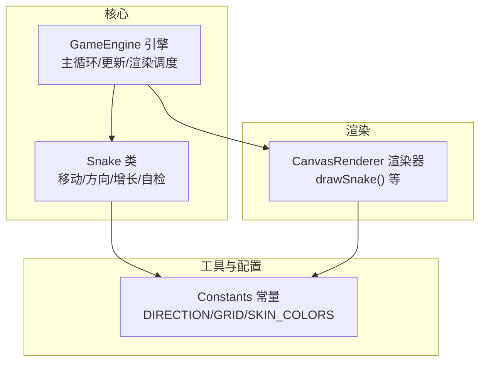
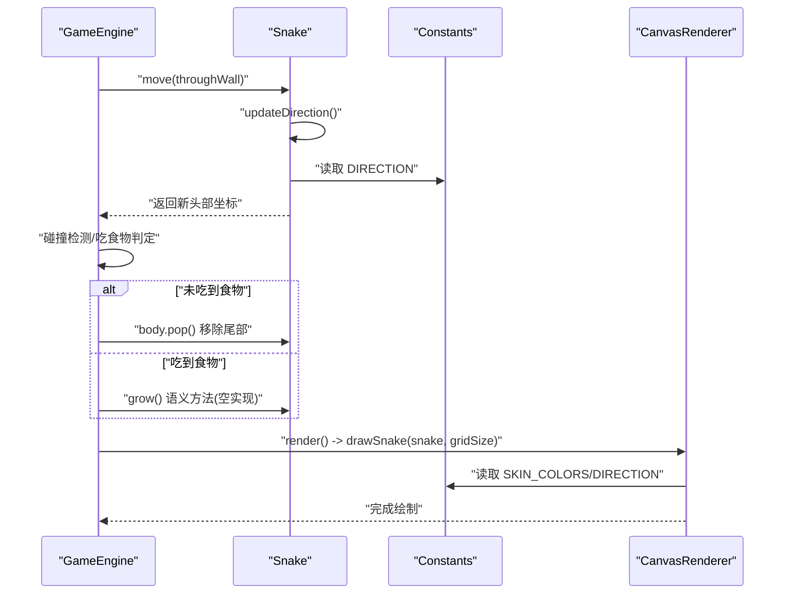
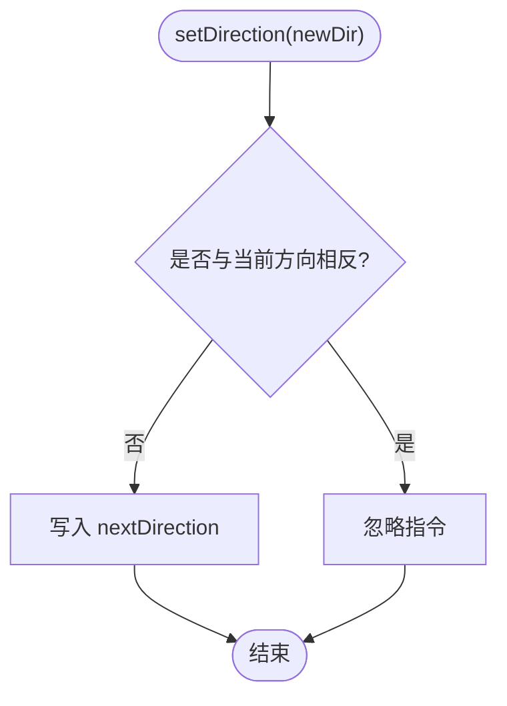
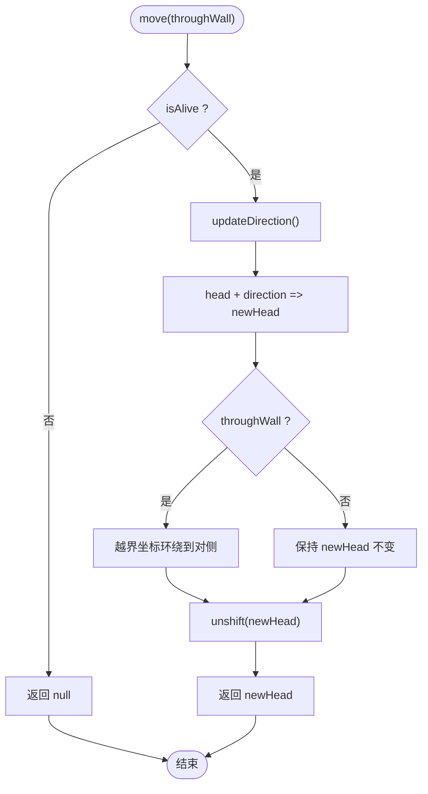
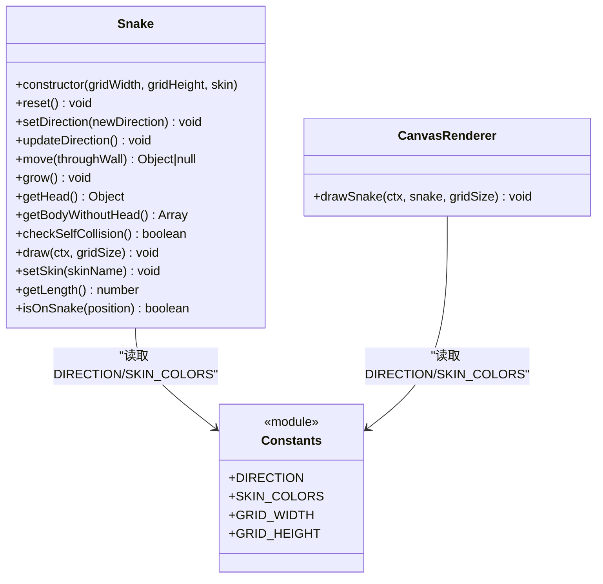
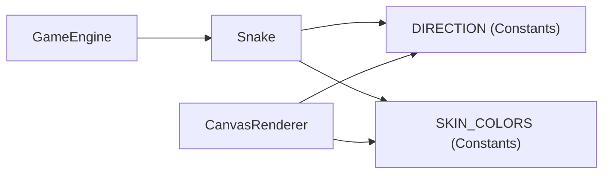

# 蛇类(Snake)

<cite>
**本文引用的文件**   
- [snake-game/js/core/Snake.js](file://snake-game/js/core/Snake.js)
- [snake-game/js/utils/Constants.js](file://snake-game/js/utils/Constants.js)
- [snake-game/js/render/CanvasRenderer.js](file://snake-game/js/render/CanvasRenderer.js)
- [snake-game/js/core/GameEngine.js](file://snake-game/js/core/GameEngine.js)
</cite>

## 目录
1. [简介](#简介)
2. [项目结构](#项目结构)
3. [核心组件](#核心组件)
4. [架构总览](#架构总览)
5. [详细组件分析](#详细组件分析)
6. [依赖关系分析](#依赖关系分析)
7. [性能考虑](#性能考虑)
8. [故障排查指南](#故障排查指南)
9. [结论](#结论)
10. [附录](#附录)

## 简介
本技术文档聚焦于贪吃蛇游戏中的“蛇”实体，围绕 Snake 类的完整实现进行深入解析。内容涵盖：
- 构造函数参数与初始状态、重置机制
- 移动算法（方向控制、180度转向防止、穿墙模式、边界检测）
- 身体增长机制（body数组操作、头部添加与尾部移除的协作）
- 皮肤系统设计与动态切换
- API接口说明与使用示例路径
- 性能优化建议与扩展开发指南

## 项目结构
Snake 相关代码位于 snake-game 子项目中，关键文件如下：
- Snake 逻辑：snake-game/js/core/Snake.js
- 常量与配置（网格、方向、难度、食物类型、皮肤颜色等）：snake-game/js/utils/Constants.js
- 渲染器（包含绘制蛇的方法）：snake-game/js/render/CanvasRenderer.js
- 游戏主循环与更新流程（驱动蛇移动、碰撞、增长）：snake-game/js/core/GameEngine.js

图表来源
- [snake-game/js/core/Snake.js:1-214](file://snake-game/js/core/Snake.js#L1-L214)
- [snake-game/js/utils/Constants.js:1-81](file://snake-game/js/utils/Constants.js#L1-L81)
- [snake-game/js/render/CanvasRenderer.js:1-188](file://snake-game/js/render/CanvasRenderer.js#L1-L188)
- [snake-game/js/core/GameEngine.js:1-888](file://snake-game/js/core/GameEngine.js#L1-L888)

章节来源
- [snake-game/js/core/Snake.js:1-214](file://snake-game/js/core/Snake.js#L1-L214)
- [snake-game/js/utils/Constants.js:1-81](file://snake-game/js/utils/Constants.js#L1-L81)
- [snake-game/js/render/CanvasRenderer.js:1-188](file://snake-game/js/render/CanvasRenderer.js#L1-L188)
- [snake-game/js/core/GameEngine.js:1-888](file://snake-game/js/core/GameEngine.js#L1-L888)

## 核心组件
本节对 Snake 类进行总体概览，并指出其在整体系统中的职责与交互点。

- 职责
  - 维护蛇的状态：位置(body)、方向(direction/nextDirection)、存活状态(isAlive)、皮肤(skin)
  - 提供方向设置与防反向逻辑
  - 计算新头部坐标，支持穿墙或边界外死亡（由调用方处理）
  - 提供自检碰撞、获取头/身、长度查询等方法
  - 提供绘制方法（也可交由渲染器统一绘制）

- 与 GameEngine 的关系
  - GameEngine 每帧调用 snake.move(throughWall)，并根据是否吃到食物决定是否保留尾部（实现增长）
  - GameEngine 负责碰撞检测与游戏状态管理，Snake 仅关注自身移动与状态

章节来源
- [snake-game/js/core/Snake.js:1-214](file://snake-game/js/core/Snake.js#L1-L214)
- [snake-game/js/core/GameEngine.js:300-341](file://snake-game/js/core/GameEngine.js#L300-L341)

## 架构总览
下图展示了 Snake 在单帧更新中的参与方式，以及它与 GameEngine、Constants 和渲染器的交互。

图表来源
- [snake-game/js/core/GameEngine.js:300-341](file://snake-game/js/core/GameEngine.js#L300-L341)
- [snake-game/js/core/Snake.js:56-101](file://snake-game/js/core/Snake.js#L56-L101)
- [snake-game/js/render/CanvasRenderer.js:68-112](file://snake-game/js/render/CanvasRenderer.js#L68-L112)
- [snake-game/js/utils/Constants.js:6-11](file://snake-game/js/utils/Constants.js#L6-L11)
- [snake-game/js/utils/Constants.js:39-65](file://snake-game/js/utils/Constants.js#L39-L65)

## 详细组件分析

### 1. 构造函数与初始状态
- 构造参数
  - gridWidth: 网格宽度（列数）
  - gridHeight: 网格高度（行数）
  - skin: 皮肤名称，默认 'classic'
- 初始状态
  - body: 初始三段，头部居中，向左延伸两格
  - direction/nextDirection: 初始向右
  - isAlive: true
- 重置机制
  - reset() 将蛇恢复到上述初始状态，便于重新开始或暂停后恢复

章节来源
- [snake-game/js/core/Snake.js:10-15](file://snake-game/js/core/Snake.js#L10-L15)
- [snake-game/js/core/Snake.js:20-34](file://snake-game/js/core/Snake.js#L20-L34)

### 2. 方向控制与180度转向防止
- setDirection(newDirection)
  - 若 newDirection 与当前 direction 完全相反，则忽略该指令
  - 否则写入 nextDirection，等待下一帧 updateDirection() 生效
- updateDirection()
  - 将 nextDirection 同步到 direction，确保一帧内只应用一次方向变更

图表来源
- [snake-game/js/core/Snake.js:40-54](file://snake-game/js/core/Snake.js#L40-L54)

章节来源
- [snake-game/js/core/Snake.js:40-54](file://snake-game/js/core/Snake.js#L40-L54)

### 3. 移动算法与边界/穿墙处理
- move(throughWall = false)
  - 若蛇已死亡，直接返回 null
  - 先 updateDirection() 应用待生效方向
  - 根据 direction 计算新头部坐标
  - 若 throughWall 为真，超出边界的坐标会环绕到对侧（穿墙）
  - 将新头部插入 body 前端；尾部移除由 GameEngine 控制（见下节）
  - 返回新头部坐标供上层做碰撞与吃食物判断

图表来源
- [snake-game/js/core/Snake.js:61-88](file://snake-game/js/core/Snake.js#L61-L88)

章节来源
- [snake-game/js/core/Snake.js:61-88](file://snake-game/js/core/Snake.js#L61-L88)

### 4. 身体增长机制（与 GameEngine 协作）
- 增长原理
  - 每帧 snake.move() 都会 unshift 一个新头部
  - 若未吃到食物，GameEngine 执行 snake.body.pop() 移除尾部，长度不变
  - 若吃到食物，GameEngine 不调用 pop()，长度+1，从而实现增长
  - grow() 为语义化空方法，用于表达“正在增长”的意图
- 关键点
  - 增长不在 Snake 内部完成，而是由 GameEngine 的 update() 中通过是否 pop 来控制
  - 这使 Snake 的职责更单一：只负责移动与状态，不耦合“是否增长”的业务决策

章节来源
- [snake-game/js/core/Snake.js:91-101](file://snake-game/js/core/Snake.js#L91-L101)
- [snake-game/js/core/GameEngine.js:316-341](file://snake-game/js/core/GameEngine.js#L316-L341)

### 5. 碰撞与自检
- checkSelfCollision()
  - 比较 head 与 body[1..] 是否有重合坐标
- 其他碰撞（墙壁、障碍物）
  - 由 GameEngine 委托 Collision 模块统一检查，Snake 不直接处理

章节来源
- [snake-game/js/core/Snake.js:123-128](file://snake-game/js/core/Snake.js#L123-L128)
- [snake-game/js/core/GameEngine.js:318-330](file://snake-game/js/core/GameEngine.js#L318-L330)

### 6. 绘制与皮肤系统
- 绘制
  - Snake.draw(ctx, gridSize) 从尾到头绘制，确保头部在最上层
  - 头部绘制眼睛，眼睛位置随 direction 变化
  - 身体段之间以圆形连接增强视觉连贯性
- 皮肤系统
  - SKIN_COLORS 定义多种皮肤配色（经典、卡通、霓虹、自然、极简）
  - setSkin(skinName) 校验皮肤名是否存在，存在则切换
  - CanvasRenderer.drawSnake() 同样基于 SKIN_COLORS 与 DIRECTION 绘制，保证渲染一致性

图表来源
- [snake-game/js/core/Snake.js:1-214](file://snake-game/js/core/Snake.js#L1-L214)
- [snake-game/js/utils/Constants.js:6-11](file://snake-game/js/utils/Constants.js#L6-L11)
- [snake-game/js/utils/Constants.js:39-65](file://snake-game/js/utils/Constants.js#L39-L65)
- [snake-game/js/render/CanvasRenderer.js:68-112](file://snake-game/js/render/CanvasRenderer.js#L68-L112)

章节来源
- [snake-game/js/core/Snake.js:135-190](file://snake-game/js/core/Snake.js#L135-L190)
- [snake-game/js/render/CanvasRenderer.js:68-112](file://snake-game/js/render/CanvasRenderer.js#L68-L112)
- [snake-game/js/utils/Constants.js:39-65](file://snake-game/js/utils/Constants.js#L39-L65)

### 7. API 接口说明与使用示例路径
以下为 Snake 的核心 API 及其典型用法要点（具体实现参考对应源码行号）：

- constructor(gridWidth, gridHeight, skin)
  - 作用：创建蛇实例，初始化网格尺寸与皮肤，并调用 reset()
  - 示例路径：[snake-game/js/core/Snake.js:10-15](file://snake-game/js/core/Snake.js#L10-L15)

- reset()
  - 作用：将蛇恢复到初始位置、方向与存活状态
  - 示例路径：[snake-game/js/core/Snake.js:20-34](file://snake-game/js/core/Snake.js#L20-L34)

- setDirection(newDirection)
  - 作用：设置下一帧的移动方向，自动阻止180度反向
  - 参数：newDirection 为 {x, y}，来自 DIRECTION 常量
  - 示例路径：[snake-game/js/core/Snake.js:40-47](file://snake-game/js/core/Snake.js#L40-L47)

- updateDirection()
  - 作用：将 nextDirection 应用到 direction
  - 示例路径：[snake-game/js/core/Snake.js:52-54](file://snake-game/js/core/Snake.js#L52-L54)

- move(throughWall = false)
  - 作用：计算新头部、处理穿墙、插入新头部并返回新头部坐标
  - 参数：throughWall 布尔值，true 表示允许穿墙
  - 返回值：新头部坐标对象或 null（死亡时）
  - 示例路径：[snake-game/js/core/Snake.js:61-88](file://snake-game/js/core/Snake.js#L61-L88)

- grow()
  - 作用：语义方法，实际增长由 GameEngine 控制（不 pop 尾部）
  - 示例路径：[snake-game/js/core/Snake.js:91-101](file://snake-game/js/core/Snake.js#L91-L101)

- getHead()
  - 作用：返回头部坐标
  - 示例路径：[snake-game/js/core/Snake.js:107-109](file://snake-game/js/core/Snake.js#L107-L109)

- getBodyWithoutHead()
  - 作用：返回除头部外的身体段数组
  - 示例路径：[snake-game/js/core/Snake.js:115-117](file://snake-game/js/core/Snake.js#L115-L117)

- checkSelfCollision()
  - 作用：检测头部是否与身体重叠
  - 示例路径：[snake-game/js/core/Snake.js:123-128](file://snake-game/js/core/Snake.js#L123-L128)

- draw(ctx, gridSize)
  - 作用：按皮肤绘制蛇身与头部眼睛
  - 示例路径：[snake-game/js/core/Snake.js:135-180](file://snake-game/js/core/Snake.js#L135-L180)

- setSkin(skinName)
  - 作用：校验并切换皮肤
  - 示例路径：[snake-game/js/core/Snake.js:186-190](file://snake-game/js/core/Snake.js#L186-L190)

- getLength()
  - 作用：返回蛇的长度
  - 示例路径：[snake-game/js/core/Snake.js:196-198](file://snake-game/js/core/Snake.js#L196-L198)

- isOnSnake(position)
  - 作用：判断某坐标是否在蛇身上
  - 示例路径：[snake-game/js/core/Snake.js:205-207](file://snake-game/js/core/Snake.js#L205-L207)

补充：GameEngine 中与 Snake 的协作示例路径
- 移动与增长：[snake-game/js/core/GameEngine.js:316-341](file://snake-game/js/core/GameEngine.js#L316-L341)
- 输入处理设置方向：[snake-game/js/core/GameEngine.js:769-772](file://snake-game/js/core/GameEngine.js#L769-L772)
- 重置时设置皮肤：[snake-game/js/core/GameEngine.js:623-630](file://snake-game/js/core/GameEngine.js#L623-L630)

## 依赖关系分析
- 内部依赖
  - Snake 依赖 Constants 中的 DIRECTION 与 SKIN_COLORS
  - CanvasRenderer 也依赖 Constants，用于一致地绘制蛇
  - GameEngine 组合 Snake，并在每帧驱动其移动与增长
- 耦合与内聚
  - Snake 高内聚：仅维护自身状态与行为
  - 低耦合：增长与碰撞等业务决策由 GameEngine 与 Collision 承担
- 外部依赖
  - 无第三方库依赖，纯原生 JS 实现

图表来源
- [snake-game/js/core/Snake.js:1-214](file://snake-game/js/core/Snake.js#L1-L214)
- [snake-game/js/utils/Constants.js:6-11](file://snake-game/js/utils/Constants.js#L6-L11)
- [snake-game/js/utils/Constants.js:39-65](file://snake-game/js/utils/Constants.js#L39-L65)
- [snake-game/js/render/CanvasRenderer.js:68-112](file://snake-game/js/render/CanvasRenderer.js#L68-L112)
- [snake-game/js/core/GameEngine.js:300-341](file://snake-game/js/core/GameEngine.js#L300-L341)

章节来源
- [snake-game/js/core/Snake.js:1-214](file://snake-game/js/core/Snake.js#L1-L214)
- [snake-game/js/utils/Constants.js:1-81](file://snake-game/js/utils/Constants.js#L1-L81)
- [snake-game/js/render/CanvasRenderer.js:1-188](file://snake-game/js/render/CanvasRenderer.js#L1-L188)
- [snake-game/js/core/GameEngine.js:1-888](file://snake-game/js/core/GameEngine.js#L1-L888)

## 性能考虑
- 数组操作复杂度
  - unshift/pop/slice 均为 O(n) 操作，当蛇体较长时会有开销
  - 建议：避免频繁创建中间数组；必要时可改用环形缓冲区或双端队列
- 渲染优化
  - 减少不必要的重绘区域；仅在需要时局部刷新
  - 合并绘制批次，减少 fillRect/canvas 状态切换次数
- 逻辑优化
  - 将方向更新与移动分离已在设计中体现，避免同一帧多次方向覆盖
  - 碰撞检测尽量复用已有数据（如 getBodyWithoutHead），避免重复遍历

[本节为通用性能建议，不直接分析特定文件]

## 故障排查指南
- 问题：蛇立即反向导致自撞
  - 现象：按下反向键后立即死亡
  - 原因：未在移动前应用方向，或多次 setDirection 在同一帧被累积
  - 解决：确保每帧只调用一次 updateDirection()，且 setDirection 有反向拦截
  - 参考路径：[snake-game/js/core/Snake.js:40-54](file://snake-game/js/core/Snake.js#L40-L54)

- 问题：穿墙模式下蛇仍死亡
  - 现象：开启 throughWall 后仍出现边界死亡
  - 原因：GameEngine 的碰撞检测可能仍包含边界检查
  - 解决：确认 Collision 模块在 throughWall=true 时跳过边界碰撞
  - 参考路径：[snake-game/js/core/GameEngine.js:318-330](file://snake-game/js/core/GameEngine.js#L318-L330)

- 问题：皮肤切换无效
  - 现象：setSkin 后画面未变化
  - 原因：传入的皮肤名不在 SKIN_COLORS 中
  - 解决：使用已定义的皮肤名（classic/cartoon/neon/nature/minimal）
  - 参考路径：[snake-game/js/core/Snake.js:186-190](file://snake-game/js/core/Snake.js#L186-L190), [snake-game/js/utils/Constants.js:39-65](file://snake-game/js/utils/Constants.js#L39-L65)

- 问题：蛇没有增长
  - 现象：吃到食物后长度不变
  - 原因：GameEngine 在吃食物分支仍执行了 body.pop()
  - 解决：确保吃食物时不调用 pop()，仅在未吃食物时 pop
  - 参考路径：[snake-game/js/core/GameEngine.js:316-341](file://snake-game/js/core/GameEngine.js#L316-L341)

章节来源
- [snake-game/js/core/Snake.js:40-54](file://snake-game/js/core/Snake.js#L40-L54)
- [snake-game/js/core/GameEngine.js:316-341](file://snake-game/js/core/GameEngine.js#L316-L341)
- [snake-game/js/utils/Constants.js:39-65](file://snake-game/js/utils/Constants.js#L39-L65)

## 结论
Snake 类设计清晰、职责单一，配合 GameEngine 实现了完整的移动、增长与绘制能力。通过常量集中管理与皮肤系统，具备良好的可扩展性与可维护性。建议在后续迭代中关注长蛇体的性能优化与渲染批量化，同时完善碰撞模块对穿墙模式的全面支持。

[本节为总结性内容，不直接分析特定文件]

## 附录

### A. 皮肤系统扩展指南
- 新增皮肤
  - 在 SKIN_COLORS 中添加新的皮肤键值，包含 head/body/eye 三色
  - 在 UI 中暴露选择项，并通过 GameEngine.setSkin() 或 Snake.setSkin() 切换
- 动态切换
  - 运行时调用 setSkin(skinName) 即可即时生效
  - 注意：需确保 skinName 存在于 SKIN_COLORS

章节来源
- [snake-game/js/utils/Constants.js:39-65](file://snake-game/js/utils/Constants.js#L39-L65)
- [snake-game/js/core/Snake.js:186-190](file://snake-game/js/core/Snake.js#L186-L190)
- [snake-game/js/core/GameEngine.js:795-801](file://snake-game/js/core/GameEngine.js#L795-L801)

### B. 与 GameEngine 的集成要点
- 每帧调用顺序
  - snake.move(throughWall) → 碰撞检测 → 吃食物判定 → 增长/去尾 → 渲染
- 输入处理
  - 用户输入通过 GameEngine.handleInput() 调用 snake.setDirection()
- 重置与销毁
  - reset() 会重新初始化蛇与食物，并应用当前皮肤
  - destroy() 会释放资源并清空视觉效果

章节来源
- [snake-game/js/core/GameEngine.js:300-341](file://snake-game/js/core/GameEngine.js#L300-L341)
- [snake-game/js/core/GameEngine.js:769-772](file://snake-game/js/core/GameEngine.js#L769-L772)
- [snake-game/js/core/GameEngine.js:623-655](file://snake-game/js/core/GameEngine.js#L623-L655)
- [snake-game/js/core/GameEngine.js:860-882](file://snake-game/js/core/GameEngine.js#L860-L882)