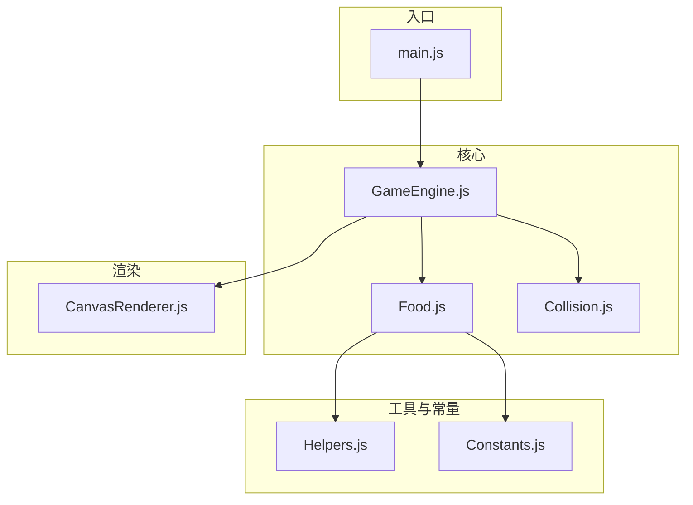
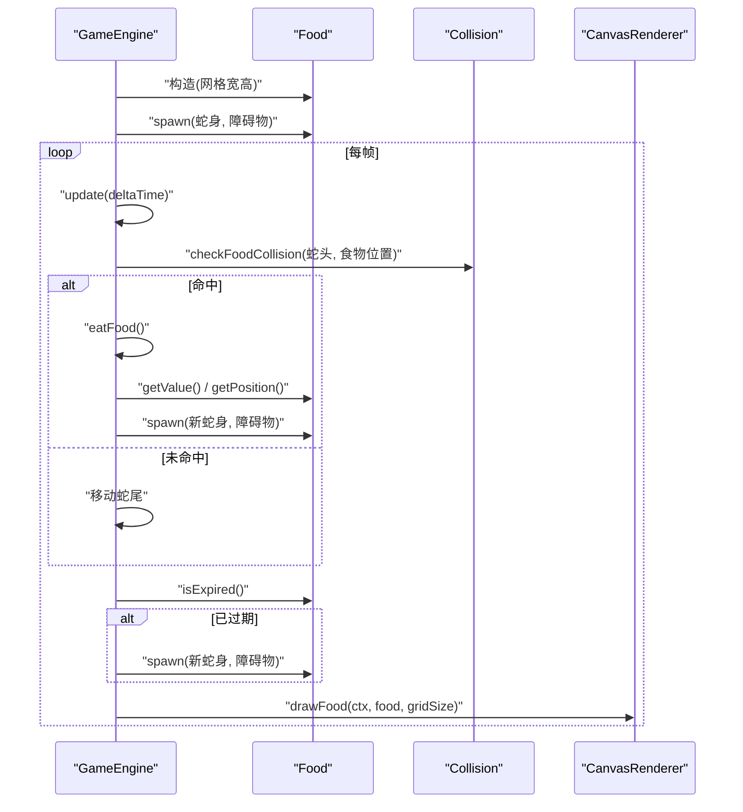
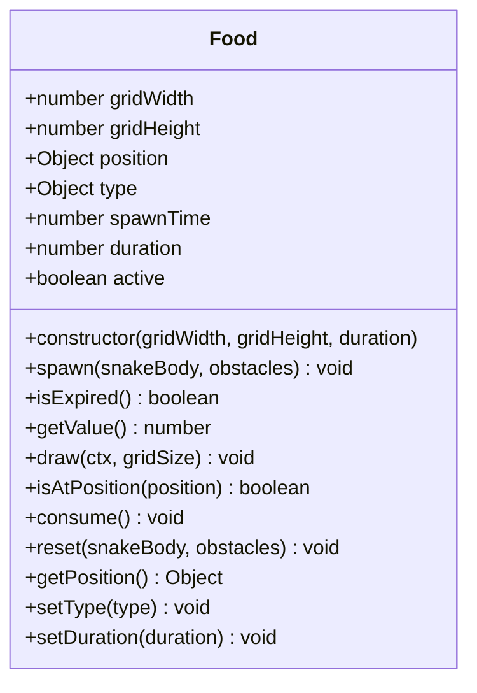
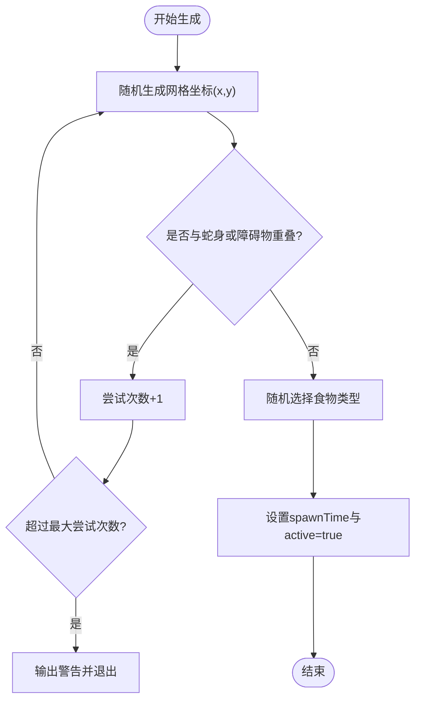
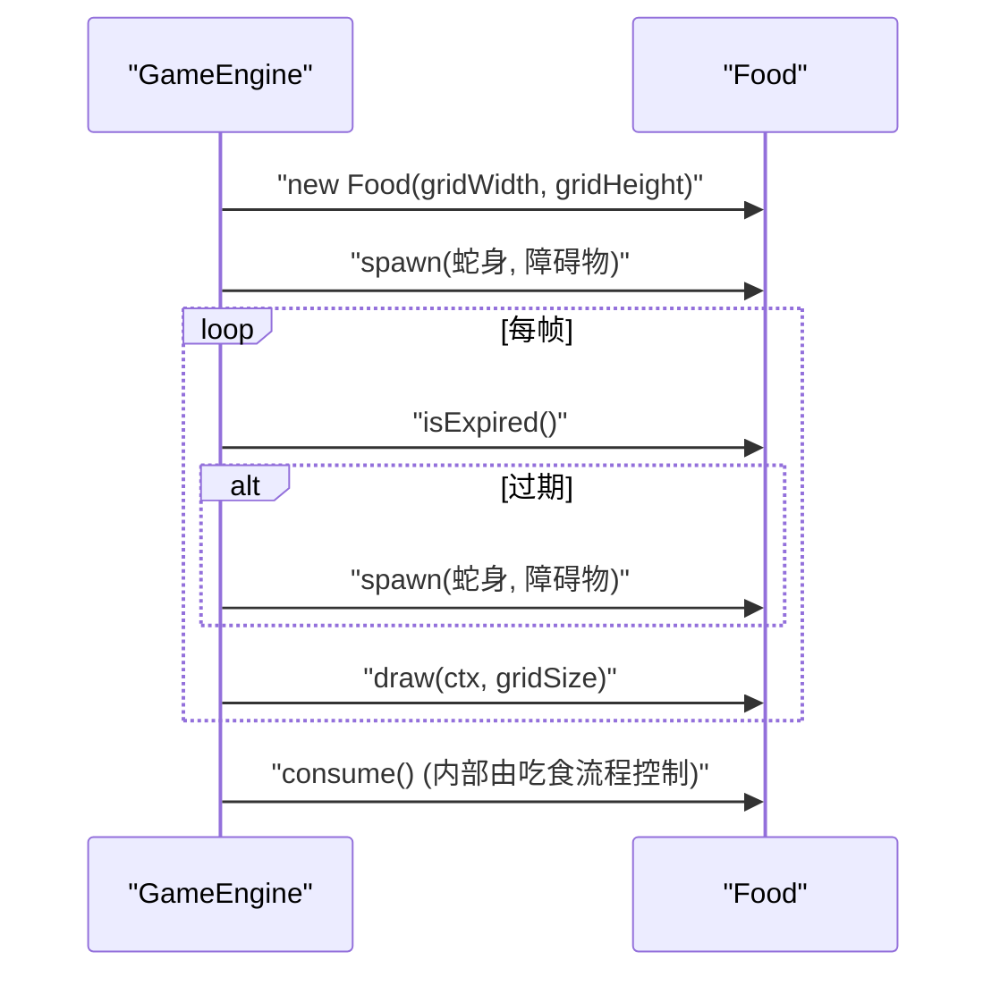
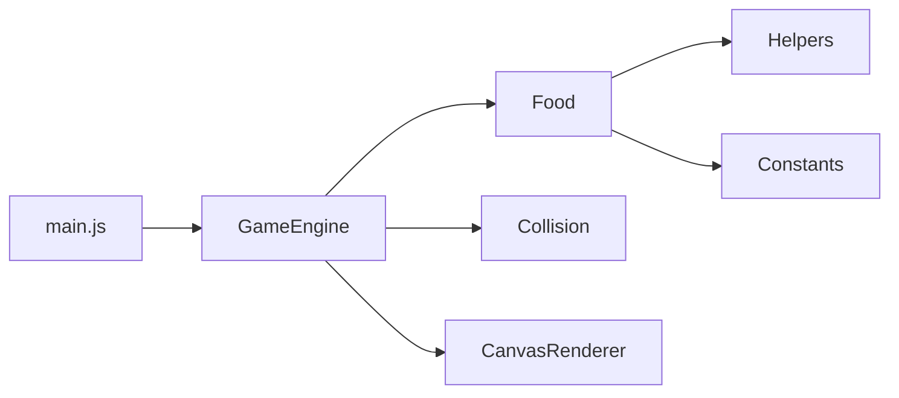

# 食物系统(Food)

<cite>
**本文引用的文件**   
- [Food.js](file://snake-game/js/core/Food.js)
- [GameEngine.js](file://snake-game/js/core/GameEngine.js)
- [CanvasRenderer.js](file://snake-game/js/render/CanvasRenderer.js)
- [Constants.js](file://snake-game/js/utils/Constants.js)
- [Helpers.js](file://snake-game/js/utils/Helpers.js)
- [Collision.js](file://snake-game/js/core/Collision.js)
- [main.js](file://snake-game/js/main.js)
</cite>

## 目录
1. [简介](#简介)
2. [项目结构](#项目结构)
3. [核心组件](#核心组件)
4. [架构总览](#架构总览)
5. [详细组件分析](#详细组件分析)
6. [依赖关系分析](#依赖关系分析)
7. [性能考量](#性能考量)
8. [故障排查指南](#故障排查指南)
9. [结论](#结论)
10. [附录：API 文档与使用示例](#附录api-文档与使用示例)

## 简介
本技术文档聚焦于贪吃蛇游戏的食物系统，围绕 Food 类的设计与实现展开，涵盖以下方面：
- 食物对象的创建、属性配置与生命周期管理
- 食物生成算法：随机位置选择策略、避免与蛇身重叠的检测机制、网格坐标计算
- 不同类型食物的差异化设计（普通、特殊、奖励）
- 食物的渲染实现：颜色配置、形状绘制与视觉效果
- 完整 API 接口说明与使用示例
- 性能优化策略与扩展开发模式

## 项目结构
食物系统位于 snake-game 子项目中，核心代码分布在 core、utils、render 三个模块中。关键文件如下：
- 核心逻辑：Food.js、GameEngine.js、Collision.js
- 工具与常量：Helpers.js、Constants.js
- 渲染：CanvasRenderer.js
- 入口：main.js

图表来源
- [Food.js:1-168](file://snake-game/js/core/Food.js#L1-L168)
- [GameEngine.js:1-800](file://snake-game/js/core/GameEngine.js#L1-L800)
- [CanvasRenderer.js:1-188](file://snake-game/js/render/CanvasRenderer.js#L1-L188)
- [Helpers.js:1-147](file://snake-game/js/utils/Helpers.js#L1-L147)
- [Constants.js:1-81](file://snake-game/js/utils/Constants.js#L1-L81)
- [Collision.js:1-73](file://snake-game/js/core/Collision.js#L1-L73)
- [main.js:1-216](file://snake-game/js/main.js#L1-L216)

章节来源
- [Food.js:1-168](file://snake-game/js/core/Food.js#L1-L168)
- [GameEngine.js:1-800](file://snake-game/js/core/GameEngine.js#L1-L800)
- [CanvasRenderer.js:1-188](file://snake-game/js/render/CanvasRenderer.js#L1-L188)
- [Helpers.js:1-147](file://snake-game/js/utils/Helpers.js#L1-L147)
- [Constants.js:1-81](file://snake-game/js/utils/Constants.js#L1-L81)
- [Collision.js:1-73](file://snake-game/js/core/Collision.js#L1-L73)
- [main.js:1-216](file://snake-game/js/main.js#L1-L216)

## 核心组件
- Food 类：负责食物对象的状态、生成、过期判定、分值获取、绘制与碰撞检测辅助方法。
- GameEngine：在游戏主循环中协调食物更新、碰撞处理、得分与特效触发。
- CanvasRenderer：提供统一的绘制能力（包含食物绘制）。
- Helpers：提供随机数、随机食物类型、位置判断等工具函数。
- Constants：定义网格尺寸、食物类型、皮肤颜色等全局常量。
- Collision：提供碰撞检测，包括“吃到食物”的判定。

章节来源
- [Food.js:1-168](file://snake-game/js/core/Food.js#L1-L168)
- [GameEngine.js:1-800](file://snake-game/js/core/GameEngine.js#L1-L800)
- [CanvasRenderer.js:1-188](file://snake-game/js/render/CanvasRenderer.js#L1-L188)
- [Helpers.js:1-147](file://snake-game/js/utils/Helpers.js#L1-L147)
- [Constants.js:1-81](file://snake-game/js/utils/Constants.js#L1-L81)
- [Collision.js:1-73](file://snake-game/js/core/Collision.js#L1-L73)

## 架构总览
食物系统在游戏中的交互流程如下：
- 初始化时由 GameEngine 创建 Food 实例并生成初始食物
- 每帧 update 中检查蛇头是否到达食物位置，若命中则调用 eatFood 增加分数、触发特效并重新生成食物
- 每帧 render 中调用 food.draw 进行绘制
- 食物支持过期机制，超过 duration 后自动重新生成

图表来源
- [GameEngine.js:276-341](file://snake-game/js/core/GameEngine.js#L276-L341)
- [GameEngine.js:343-378](file://snake-game/js/core/GameEngine.js#L343-L378)
- [GameEngine.js:657-684](file://snake-game/js/core/GameEngine.js#L657-L684)
- [Food.js:28-52](file://snake-game/js/core/Food.js#L28-L52)
- [Food.js:58-69](file://snake-game/js/core/Food.js#L58-L69)
- [Food.js:76-108](file://snake-game/js/core/Food.js#L76-L108)
- [CanvasRenderer.js:120-152](file://snake-game/js/render/CanvasRenderer.js#L120-L152)
- [Collision.js:35-37](file://snake-game/js/core/Collision.js#L35-L37)

## 详细组件分析

### Food 类设计与实现
- 构造函数
  - 接收网格宽度、高度与存在时长（毫秒），默认值为全局常量；设置初始位置、类型、生成时间、活跃状态，并在构造时立即生成一次食物。
- 生成算法 spawn
  - 在网格范围内随机选取坐标，使用最大尝试次数防止死循环；通过 isPositionInArray 检测是否与蛇身或障碍物重叠，直到找到空位；随后随机确定食物类型并标记为 active。
- 过期判定 isExpired
  - 根据当前时间与 spawnTime 差值与 duration 比较，支持永不过期（duration <= 0）。
- 分值获取 getValue
  - 返回当前 type.value。
- 绘制 draw
  - 将网格坐标转换为像素坐标，绘制圆形主体与高光；对特殊类型（金色、彩虹）添加闪烁外圈效果。
- 碰撞辅助 isAtPosition
  - 用于外部快速判断某网格位置是否为当前食物位置。
- 消费 consume
  - 将 active 置为 false，表示被吃掉。
- 重置 reset
  - 委托 spawn 重新生成。
- 访问器 getPosition/setType/setDuration
  - 提供只读位置拷贝、测试用类型设置、动态调整存在时长。

图表来源
- [Food.js:1-168](file://snake-game/js/core/Food.js#L1-L168)

章节来源
- [Food.js:1-168](file://snake-game/js/core/Food.js#L1-L168)

### 食物生成算法详解
- 随机位置选择策略
  - 使用 randomInt 在 [0, gridWidth-1] 与 [0, gridHeight-1] 范围内生成整数坐标。
- 避免重叠检测
  - 通过 isPositionInArray 遍历蛇身与障碍物数组，确保不重合。
- 网格坐标计算
  - 生成阶段使用网格坐标；绘制阶段乘以 gridSize 得到像素坐标。
- 随机食物类型
  - 使用 getRandomFoodType 按概率分配：彩虹 5%、金色 10%、普通 85%。

图表来源
- [Food.js:28-52](file://snake-game/js/core/Food.js#L28-L52)
- [Helpers.js:9-11](file://snake-game/js/utils/Helpers.js#L9-L11)
- [Helpers.js:29-31](file://snake-game/js/utils/Helpers.js#L29-L31)
- [Helpers.js:37-46](file://snake-game/js/utils/Helpers.js#L37-L46)

章节来源
- [Food.js:28-52](file://snake-game/js/core/Food.js#L28-L52)
- [Helpers.js:9-11](file://snake-game/js/utils/Helpers.js#L9-L11)
- [Helpers.js:29-31](file://snake-game/js/utils/Helpers.js#L29-L31)
- [Helpers.js:37-46](file://snake-game/js/utils/Helpers.js#L37-L46)

### 食物类型与差异化设计
- 普通食物
  - 颜色：红色系；分值：1
- 特殊食物（金色）
  - 颜色：金色；分值：3；绘制时带闪烁外圈
- 奖励食物（彩虹）
  - 颜色：粉色系；分值：5；绘制时带闪烁外圈
- 概率分布
  - 彩虹 5%，金色 10%，普通 85%

章节来源
- [Constants.js:33-37](file://snake-game/js/utils/Constants.js#L33-L37)
- [Helpers.js:37-46](file://snake-game/js/utils/Helpers.js#L37-L46)
- [Food.js:98-107](file://snake-game/js/core/Food.js#L98-L107)

### 食物渲染实现
- 基础绘制
  - 以网格坐标为中心绘制圆形，半径略小于格子边长，留出间隙；添加半透明白色高光提升立体感。
- 特殊效果
  - 对金色与彩虹食物，基于时间正弦函数产生脉动透明度，并绘制额外外圈增强视觉提示。
- 渲染入口
  - GameEngine 在 render 中调用 food.draw；CanvasRenderer 也提供 drawFood 作为统一绘制能力。

章节来源
- [Food.js:76-108](file://snake-game/js/core/Food.js#L76-L108)
- [CanvasRenderer.js:120-152](file://snake-game/js/render/CanvasRenderer.js#L120-L152)
- [GameEngine.js:657-684](file://snake-game/js/core/GameEngine.js#L657-L684)

### 生命周期管理与集成点
- 创建与初始生成
  - GameEngine 构造时 new Food(...)，并在 reset 时再次生成。
- 消耗与重生
  - 蛇头与食物同格时，GameEngine.eatFood 增加分数、触发特效，然后调用 food.spawn 重新生成。
- 过期与重生
  - 每帧 update 中检查 food.isExpired，若过期则调用 food.spawn 重新生成。
- 绘制
  - 每帧 render 中调用 food.draw 完成绘制。

图表来源
- [GameEngine.js:623-655](file://snake-game/js/core/GameEngine.js#L623-L655)
- [GameEngine.js:338-341](file://snake-game/js/core/GameEngine.js#L338-L341)
- [GameEngine.js:343-378](file://snake-game/js/core/GameEngine.js#L343-L378)
- [Food.js:124-135](file://snake-game/js/core/Food.js#L124-L135)

章节来源
- [GameEngine.js:623-655](file://snake-game/js/core/GameEngine.js#L623-L655)
- [GameEngine.js:338-341](file://snake-game/js/core/GameEngine.js#L338-L341)
- [GameEngine.js:343-378](file://snake-game/js/core/GameEngine.js#L343-L378)
- [Food.js:124-135](file://snake-game/js/core/Food.js#L124-L135)

## 依赖关系分析
- Food 依赖
  - Helpers.randomInt、Helpers.isPositionInArray、Helpers.getRandomFoodType
  - Constants.GRID_WIDTH、Constants.GRID_HEIGHT、Constants.FOOD_TYPE
- GameEngine 依赖
  - Food、Collision.checkFoodCollision、CanvasRenderer.drawFood（间接通过 food.draw）
  - Constants（网格尺寸、难度、模式等）
- 入口 main.js
  - 初始化 GameEngine，绑定输入事件，驱动游戏运行

图表来源
- [Food.js:1-168](file://snake-game/js/core/Food.js#L1-L168)
- [Helpers.js:1-147](file://snake-game/js/utils/Helpers.js#L1-L147)
- [Constants.js:1-81](file://snake-game/js/utils/Constants.js#L1-L81)
- [GameEngine.js:1-800](file://snake-game/js/core/GameEngine.js#L1-L800)
- [CanvasRenderer.js:1-188](file://snake-game/js/render/CanvasRenderer.js#L1-L188)
- [main.js:1-216](file://snake-game/js/main.js#L1-L216)

章节来源
- [Food.js:1-168](file://snake-game/js/core/Food.js#L1-L168)
- [GameEngine.js:1-800](file://snake-game/js/core/GameEngine.js#L1-L800)
- [CanvasRenderer.js:1-188](file://snake-game/js/render/CanvasRenderer.js#L1-L188)
- [Helpers.js:1-147](file://snake-game/js/utils/Helpers.js#L1-L147)
- [Constants.js:1-81](file://snake-game/js/utils/Constants.js#L1-L81)
- [main.js:1-216](file://snake-game/js/main.js#L1-L216)

## 性能考量
- 生成算法复杂度
  - 每次生成最多尝试固定上限次数（如 1000），平均情况下很快找到空位；当网格被大量占用时可能接近上限，建议在高密度场景下考虑更高效的可用位置集合维护策略。
- 碰撞检测
  - 使用 isPositionInArray 线性扫描蛇身与障碍物，O(n)；对于极长蛇身可考虑哈希表加速。
- 渲染开销
  - 特殊食物每帧计算正弦函数与绘制外圈，开销较小；如需更多粒子或复杂特效，应结合节流或减少绘制频率。
- 过期检查
  - 每帧一次 Date.now 比较，开销极低；可考虑批量更新或缓存上次结果以减少频繁时间戳读取。

[本节为通用性能讨论，无需具体文件引用]

## 故障排查指南
- 食物无法生成或一直重叠
  - 检查网格尺寸与障碍物数量是否过大导致无空位；确认 maxAttempts 阈值与 isPositionInArray 的实现是否正确。
- 食物未显示或绘制异常
  - 确认 food.active 状态；检查 gridSize 与网格坐标转换是否正确；验证 FOOD_TYPE.color 配置是否存在。
- 食物过期不重生
  - 检查 duration 设置与 isExpired 逻辑；确认 GameEngine.update 中过期分支是否执行。
- 吃到食物未加分或未重生
  - 检查 Collision.checkFoodCollision 条件；确认 GameEngine.eatFood 中 food.spawn 调用路径。

章节来源
- [Food.js:28-52](file://snake-game/js/core/Food.js#L28-L52)
- [Food.js:58-69](file://snake-game/js/core/Food.js#L58-L69)
- [Food.js:76-108](file://snake-game/js/core/Food.js#L76-L108)
- [GameEngine.js:332-341](file://snake-game/js/core/GameEngine.js#L332-L341)
- [GameEngine.js:343-378](file://snake-game/js/core/GameEngine.js#L343-L378)
- [Collision.js:35-37](file://snake-game/js/core/Collision.js#L35-L37)

## 结论
Food 类以简洁清晰的职责划分实现了食物系统的核心功能：随机生成、防重叠、过期管理、分值与绘制。配合 GameEngine 的主循环与 Collision 的碰撞检测，形成稳定且可扩展的食物子系统。通过常量与工具函数的解耦，新增食物类型与视觉效果较为便捷。

[本节为总结性内容，无需具体文件引用]

## 附录：API 文档与使用示例

### Food 类 API
- constructor(gridWidth, gridHeight, duration)
  - 参数：gridWidth 网格宽，gridHeight 网格高，duration 存在时长（毫秒，-1 表示永不过期）
  - 行为：初始化属性并立即生成一次食物
- spawn(snakeBody, obstacles)
  - 参数：snakeBody 蛇身坐标数组，obstacles 障碍物坐标数组（可选）
  - 行为：在空位随机生成食物，随机类型，标记 active
- isExpired()
  - 返回：布尔值，是否已过期
- getValue()
  - 返回：当前食物分值
- draw(ctx, gridSize)
  - 参数：ctx Canvas 上下文，gridSize 格子大小
  - 行为：绘制食物图形与特效
- isAtPosition(position)
  - 参数：position 网格坐标 {x, y}
  - 返回：布尔值，是否在该位置
- consume()
  - 行为：标记食物为不可见（被吃掉）
- reset(snakeBody, obstacles)
  - 行为：委托 spawn 重新生成
- getPosition()
  - 返回：深拷贝的位置对象
- setType(type)
  - 参数：type 食物类型对象（用于测试）
- setDuration(duration)
  - 参数：duration 存在时长（毫秒）

章节来源
- [Food.js:1-168](file://snake-game/js/core/Food.js#L1-L168)

### 使用示例（概念性步骤）
- 创建食物对象
  - 在 GameEngine 构造时传入网格宽高，Food 会自动生成初始食物
- 在每帧更新中
  - 调用 food.isExpired()，若为真则调用 food.spawn(snake.body, obstacles) 重新生成
- 在每帧渲染中
  - 调用 food.draw(ctx, gridSize) 完成绘制
- 吃到食物时
  - 通过 Collision.checkFoodCollision(head, food.position) 判定命中后，调用 food.getValue() 获取分值，再调用 food.spawn(snake.body, obstacles) 重新生成

章节来源
- [GameEngine.js:332-341](file://snake-game/js/core/GameEngine.js#L332-L341)
- [GameEngine.js:343-378](file://snake-game/js/core/GameEngine.js#L343-L378)
- [GameEngine.js:657-684](file://snake-game/js/core/GameEngine.js#L657-L684)
- [Collision.js:35-37](file://snake-game/js/core/Collision.js#L35-L37)

### 扩展开发模式
- 新增食物类型
  - 在 Constants.FOOD_TYPE 中添加新类型（color、value），并在 Helpers.getRandomFoodType 中调整概率分布
- 自定义视觉效果
  - 在 Food.draw 或 CanvasRenderer.drawFood 中扩展绘制逻辑（例如添加动画、阴影、纹理）
- 引入更多约束
  - 在 spawn 中增加新的障碍物列表或区域限制，复用 isPositionInArray 进行冲突检测
- 性能优化
  - 对高密度场景，维护可用位置集合或使用空间索引降低碰撞检测复杂度

章节来源
- [Constants.js:33-37](file://snake-game/js/utils/Constants.js#L33-L37)
- [Helpers.js:37-46](file://snake-game/js/utils/Helpers.js#L37-L46)
- [Food.js:76-108](file://snake-game/js/core/Food.js#L76-L108)
- [CanvasRenderer.js:120-152](file://snake-game/js/render/CanvasRenderer.js#L120-L152)