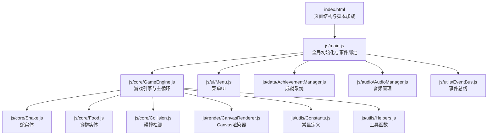
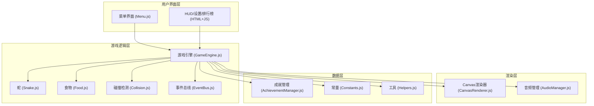
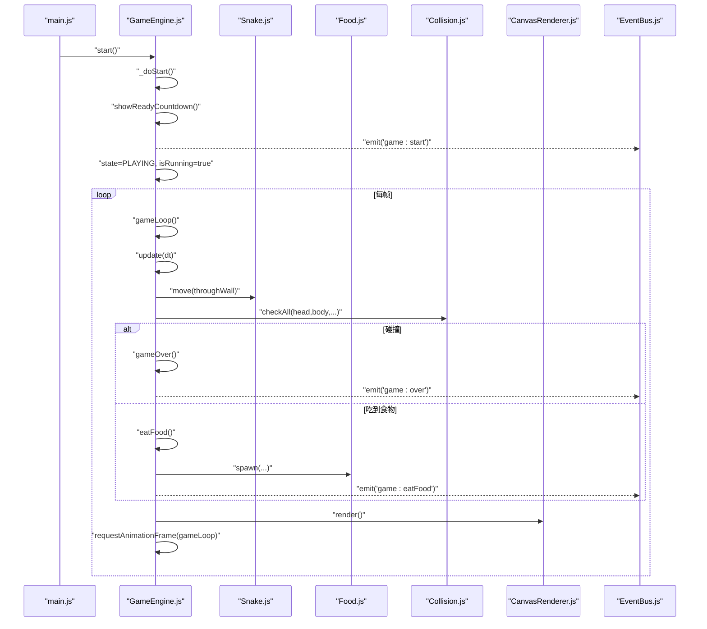
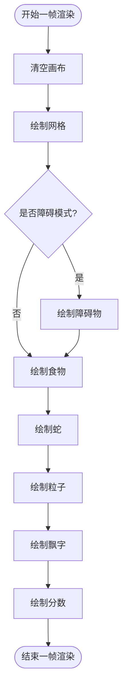
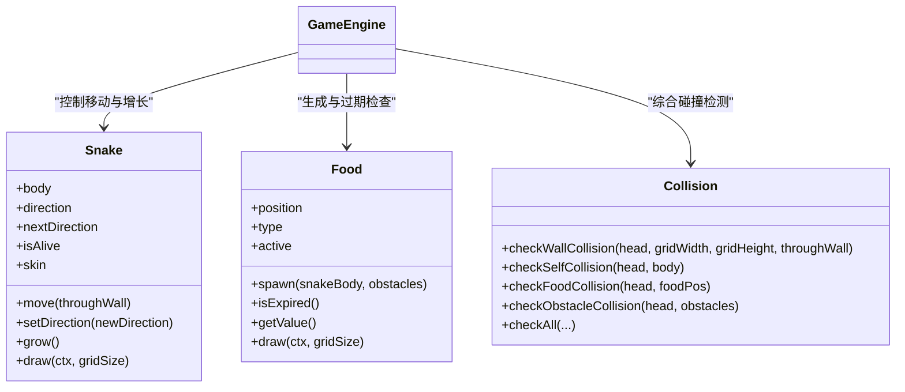
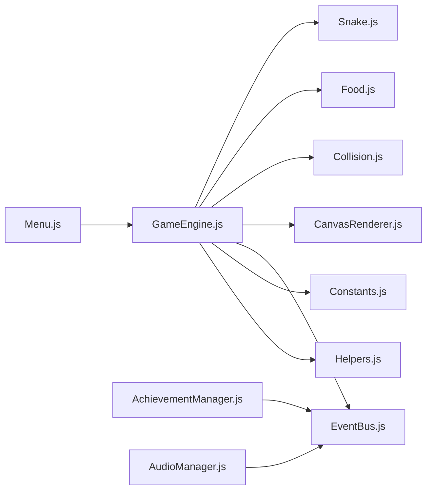

# 游戏架构设计

<cite>
**本文引用的文件**   
- [index.html](file://snake-game/index.html)
- [main.js](file://snake-game/js/main.js)
- [GameEngine.js](file://snake-game/js/core/GameEngine.js)
- [CanvasRenderer.js](file://snake-game/js/render/CanvasRenderer.js)
- [EventBus.js](file://snake-game/js/utils/EventBus.js)
- [Snake.js](file://snake-game/js/core/Snake.js)
- [Food.js](file://snake-game/js/core/Food.js)
- [Collision.js](file://snake-game/js/core/Collision.js)
- [Constants.js](file://snake-game/js/utils/Constants.js)
- [Helpers.js](file://snake-game/js/utils/Helpers.js)
- [Menu.js](file://snake-game/js/ui/Menu.js)
- [AchievementManager.js](file://snake-game/js/data/AchievementManager.js)
- [AudioManager.js](file://snake-game/js/audio/AudioManager.js)
</cite>

## 目录
1. [简介](#简介)
2. [项目结构](#项目结构)
3. [核心组件](#核心组件)
4. [架构总览](#架构总览)
5. [详细组件分析](#详细组件分析)
6. [依赖关系分析](#依赖关系分析)
7. [性能考量](#性能考量)
8. [故障排查指南](#故障排查指南)
9. [结论](#结论)
10. [附录](#附录)

## 简介
本技术文档围绕贪吃蛇游戏的架构设计与实现进行深入解析，重点覆盖以下主题：
- GameEngine主引擎的设计模式与核心架构
- 游戏状态管理机制与事件驱动架构
- Canvas渲染系统的性能优化策略
- 游戏循环（gameLoop）的工作原理、时间增量计算与帧率控制
- 模块化设计、组件通信机制与可扩展性原则
- 游戏初始化流程、资源管理与内存优化技巧
- 架构图表与代码级示例路径，帮助开发者快速理解整体架构

## 项目结构
本项目采用分层与模块化组织方式，核心模块按职责划分到不同目录：
- core：游戏核心逻辑（引擎、蛇、食物、碰撞检测）
- render：渲染相关（Canvas绘制）
- ui：界面交互（菜单、HUD、设置、排行榜）
- data：数据管理（成就、存储）
- utils：工具与常量（事件总线、辅助函数、常量定义）
- audio：音频系统（音效生成与管理）
- main：应用入口与全局初始化



图表来源
- [index.html:279-294](file://snake-game/index.html#L279-L294)
- [main.js:1-180](file://snake-game/js/main.js#L1-L180)
- [GameEngine.js:1-120](file://snake-game/js/core/GameEngine.js#L1-L120)
- [CanvasRenderer.js:1-60](file://snake-game/js/render/CanvasRenderer.js#L1-L60)
- [EventBus.js:1-80](file://snake-game/js/utils/EventBus.js#L1-L80)
- [Snake.js:1-60](file://snake-game/js/core/Snake.js#L1-L60)
- [Food.js:1-60](file://snake-game/js/core/Food.js#L1-L60)
- [Collision.js:1-40](file://snake-game/js/core/Collision.js#L1-L40)
- [Constants.js:1-81](file://snake-game/js/utils/Constants.js#L1-L81)
- [Helpers.js:1-80](file://snake-game/js/utils/Helpers.js#L1-L80)
- [Menu.js:1-60](file://snake-game/js/ui/Menu.js#L1-L60)
- [AchievementManager.js:1-60](file://snake-game/js/data/AchievementManager.js#L1-L60)
- [AudioManager.js:1-60](file://snake-game/js/audio/AudioManager.js#L1-L60)

章节来源
- [index.html:279-294](file://snake-game/index.html#L279-L294)
- [main.js:1-180](file://snake-game/js/main.js#L1-L180)

## 核心组件
- 游戏引擎（GameEngine）
  - 负责游戏生命周期、状态机、主循环、输入处理、分数与记录持久化、视觉效果更新等。
  - 关键方法包括 start、_doStart、showReadyCountdown、gameLoop、update、render、pause、resume、reset、handleInput、setDifficulty、setGameMode、setSkin 等。
- 渲染器（CanvasRenderer）
  - 提供网格、障碍物、蛇、食物、分数等绘制能力，支持特殊食物的闪烁效果。
- 事件总线（EventBus）
  - 发布-订阅模型，用于跨模块解耦通信，如音频播放、游戏状态变更、成就解锁等。
- 实体类（Snake、Food）
  - Snake：移动、方向控制、增长语义、绘制；Food：随机生成、过期判断、绘制。
- 碰撞检测（Collision）
  - 墙、自身、食物、障碍物的综合碰撞判定。
- UI与数据（Menu、AchievementManager、AudioManager）
  - Menu：菜单交互、难度/模式选择、限时时间选择。
  - AchievementManager：成就定义、解锁条件、通知展示与持久化。
  - AudioManager：基于Web Audio API的音效生成与播放控制。

章节来源
- [GameEngine.js:1-120](file://snake-game/js/core/GameEngine.js#L1-L120)
- [CanvasRenderer.js:1-188](file://snake-game/js/render/CanvasRenderer.js#L1-L188)
- [EventBus.js:1-80](file://snake-game/js/utils/EventBus.js#L1-L80)
- [Snake.js:1-120](file://snake-game/js/core/Snake.js#L1-L120)
- [Food.js:1-120](file://snake-game/js/core/Food.js#L1-L120)
- [Collision.js:1-73](file://snake-game/js/core/Collision.js#L1-L73)
- [Menu.js:1-120](file://snake-game/js/ui/Menu.js#L1-L120)
- [AchievementManager.js:1-120](file://snake-game/js/data/AchievementManager.js#L1-L120)
- [AudioManager.js:1-120](file://snake-game/js/audio/AudioManager.js#L1-L120)

## 架构总览
系统采用“UI层—逻辑层—渲染层—数据层”的分层架构，并通过事件总线进行松耦合通信。



图表来源
- [GameEngine.js:1-120](file://snake-game/js/core/GameEngine.js#L1-L120)
- [CanvasRenderer.js:1-60](file://snake-game/js/render/CanvasRenderer.js#L1-L60)
- [EventBus.js:1-80](file://snake-game/js/utils/EventBus.js#L1-L80)
- [Snake.js:1-60](file://snake-game/js/core/Snake.js#L1-L60)
- [Food.js:1-60](file://snake-game/js/core/Food.js#L1-L60)
- [Collision.js:1-40](file://snake-game/js/core/Collision.js#L1-L40)
- [Menu.js:1-60](file://snake-game/js/ui/Menu.js#L1-L60)
- [AchievementManager.js:1-60](file://snake-game/js/data/AchievementManager.js#L1-L60)
- [AudioManager.js:1-60](file://snake-game/js/audio/AudioManager.js#L1-L60)
- [Constants.js:1-81](file://snake-game/js/utils/Constants.js#L1-L81)
- [Helpers.js:1-80](file://snake-game/js/utils/Helpers.js#L1-L80)

## 详细组件分析

### GameEngine 主引擎
- 设计模式
  - 单例式实例：通过构造函数创建唯一引擎实例，并在入口挂载至全局供其他模块访问。
  - 状态机：IDLE、READY、PLAYING、PAUSED、GAME_OVER 五种状态，配合 showReadyCountdown 与 pause/resume 完成状态转换。
  - 固定时间步长 + 累加器：使用 accumulator 将 deltaTime 累积，按 updateInterval 触发 update，保证在不同刷新率下行为一致。
  - 事件驱动：通过 globalEventBus 广播 game:start、game:playing、game:paused、game:resumed、game:over、audio:play 等事件，实现模块间解耦。
- 游戏循环（gameLoop）
  - 使用 requestAnimationFrame 驱动渲染，每帧计算 now - lastUpdateTime 得到 deltaTime，并累加到 accumulator。
  - 根据 difficulty.speed 计算 updateInterval，循环执行 update(deltaTime/1000)，直至 accumulator < updateInterval。
  - 在渲染前更新粒子与飘字效果，再调用 render 输出画面。
- 时间增量与帧率控制
  - 通过 performance.now() 获取高精度时间戳，确保时间增量准确。
  - 固定时间步长避免物理/逻辑不稳定，同时保持渲染流畅。
- 输入处理
  - 键盘与触摸事件统一转发到 handleInput，最终由 Snake.setDirection 防止180度转向。
- 资源与持久化
  - 高分、设置、统计、游戏记录均通过 localStorage 读写，并提供 saveHighScore、saveGameRecord、updateStatistics 等方法。
- 可视化特效
  - 粒子系统与得分飘字在 updateEffects 中按生命周期衰减，renderDeathAnimation 提供死亡闪烁动画。



图表来源
- [main.js:1-180](file://snake-game/js/main.js#L1-L180)
- [GameEngine.js:220-300](file://snake-game/js/core/GameEngine.js#L220-L300)
- [GameEngine.js:300-380](file://snake-game/js/core/GameEngine.js#L300-L380)
- [GameEngine.js:460-506](file://snake-game/js/core/GameEngine.js#L460-L506)
- [Snake.js:60-120](file://snake-game/js/core/Snake.js#L60-L120)
- [Food.js:28-52](file://snake-game/js/core/Food.js#L28-L52)
- [Collision.js:60-66](file://snake-game/js/core/Collision.js#L60-L66)
- [CanvasRenderer.js:1-188](file://snake-game/js/render/CanvasRenderer.js#L1-L188)
- [EventBus.js:40-50](file://snake-game/js/utils/EventBus.js#L40-L50)

章节来源
- [GameEngine.js:1-120](file://snake-game/js/core/GameEngine.js#L1-L120)
- [GameEngine.js:220-300](file://snake-game/js/core/GameEngine.js#L220-L300)
- [GameEngine.js:300-380](file://snake-game/js/core/GameEngine.js#L300-L380)
- [GameEngine.js:460-506](file://snake-game/js/core/GameEngine.js#L460-L506)
- [GameEngine.js:657-756](file://snake-game/js/core/GameEngine.js#L657-L756)

### Canvas 渲染系统
- 职责分离
  - GameEngine 负责调度与场景对象管理，CanvasRenderer 专注绘制细节（网格、障碍物、蛇、食物、分数）。
- 性能优化策略
  - 离屏缓存建议：静态背景（网格）可预先绘制到离屏Canvas，主循环直接 blit，减少重复绘制开销。
  - 局部重绘：仅对变化区域进行绘制，避免整屏重绘。
  - 合并状态变化：减少 ctx 状态切换次数，批量绘制相同样式元素。
  - 特殊食物闪烁：使用 globalAlpha 与正弦函数产生脉冲效果，注意控制绘制成本。
- 绘制顺序
  - 清空画布 → 绘制网格 → 障碍物 → 食物 → 蛇 → 粒子 → 飘字 → 分数



图表来源
- [CanvasRenderer.js:11-60](file://snake-game/js/render/CanvasRenderer.js#L11-L60)
- [CanvasRenderer.js:68-152](file://snake-game/js/render/CanvasRenderer.js#L68-L152)
- [CanvasRenderer.js:161-181](file://snake-game/js/render/CanvasRenderer.js#L161-L181)
- [GameEngine.js:657-756](file://snake-game/js/core/GameEngine.js#L657-L756)

章节来源
- [CanvasRenderer.js:1-188](file://snake-game/js/render/CanvasRenderer.js#L1-L188)
- [GameEngine.js:657-756](file://snake-game/js/core/GameEngine.js#L657-L756)

### 事件驱动架构（EventBus）
- 设计要点
  - on/off/once/emit/clear 提供完整的订阅-发布能力。
  - emit 内部 try-catch 保护监听器异常，避免影响主循环。
- 典型事件
  - game:start、game:playing、game:paused、game:resumed、game:over、game:highScore、audio:play、achievement:unlock 等。
- 使用场景
  - 引擎启动时广播 game:start，UI层监听以显示倒计时或隐藏遮罩。
  - 吃到食物时广播 game:eatFood，成就系统检查并可能解锁成就。
  - 音频播放通过 audio:play 事件交由 AudioManager 处理。

```mermaid
classDiagram
class EventBus {
+on(event, callback)
+off(event, callback)
+once(event, callback)
+emit(event, data)
+clear()
}
class GameEngine {
+emit("game : *")
+emit("audio : play")
}
class AudioManager {
+init()
+play(soundName)
}
class AchievementManager {
+checkOnEatFood(score)
+checkOnGameOver(score)
+unlock(id)
}
GameEngine --> EventBus : "发布事件"
AudioManager --> EventBus : "订阅 audio : play"
AchievementManager --> EventBus : "订阅 achievement : unlock"
```

图表来源
- [EventBus.js:1-80](file://snake-game/js/utils/EventBus.js#L1-L80)
- [GameEngine.js:240-275](file://snake-game/js/core/GameEngine.js#L240-L275)
- [GameEngine.js:360-378](file://snake-game/js/core/GameEngine.js#L360-L378)
- [GameEngine.js:486-506](file://snake-game/js/core/GameEngine.js#L486-L506)
- [AchievementManager.js:109-120](file://snake-game/js/data/AchievementManager.js#L109-L120)
- [AudioManager.js:44-66](file://snake-game/js/audio/AudioManager.js#L44-L66)

章节来源
- [EventBus.js:1-80](file://snake-game/js/utils/EventBus.js#L1-L80)
- [GameEngine.js:240-275](file://snake-game/js/core/GameEngine.js#L240-L275)
- [GameEngine.js:360-378](file://snake-game/js/core/GameEngine.js#L360-L378)
- [GameEngine.js:486-506](file://snake-game/js/core/GameEngine.js#L486-L506)
- [AchievementManager.js:109-120](file://snake-game/js/data/AchievementManager.js#L109-L120)
- [AudioManager.js:44-66](file://snake-game/js/audio/AudioManager.js#L44-L66)

### 实体与碰撞（Snake、Food、Collision）
- Snake
  - 移动逻辑：先更新方向，再计算新头部坐标，支持穿墙模式。
  - 增长语义：grow()为语义方法，实际增长由 GameEngine.update 中不 pop 尾部实现。
  - 防反向：setDirection 阻止180度转向。
- Food
  - 随机生成：避开蛇身与障碍物，支持不同类型（普通、金色、彩虹），具有价值与颜色属性。
  - 过期机制：duration > 0 时按 spawnTime 判断过期，GameEngine 定期检测并重新生成。
- Collision
  - 提供 checkWallCollision、checkSelfCollision、checkFoodCollision、checkObstacleCollision 以及综合 checkAll。



图表来源
- [Snake.js:60-120](file://snake-game/js/core/Snake.js#L60-L120)
- [Food.js:28-52](file://snake-game/js/core/Food.js#L28-L52)
- [Collision.js:12-66](file://snake-game/js/core/Collision.js#L12-L66)
- [GameEngine.js:300-341](file://snake-game/js/core/GameEngine.js#L300-L341)

章节来源
- [Snake.js:1-120](file://snake-game/js/core/Snake.js#L1-L120)
- [Food.js:1-120](file://snake-game/js/core/Food.js#L1-L120)
- [Collision.js:1-73](file://snake-game/js/core/Collision.js#L1-L73)
- [GameEngine.js:300-341](file://snake-game/js/core/GameEngine.js#L300-L341)

### UI 与数据（Menu、AchievementManager、AudioManager）
- Menu
  - 绑定开始、设置、排行榜、帮助按钮，支持难度与模式切换，限时模式下弹出时间选择。
- AchievementManager
  - 维护成就列表与解锁状态，提供 checkOnEatFood 与 checkOnGameOver 钩子，结合 StorageManager 持久化。
- AudioManager
  - 使用 Web Audio API 合成音效，避免外部音频文件依赖，首次交互后初始化 AudioContext。

章节来源
- [Menu.js:1-120](file://snake-game/js/ui/Menu.js#L1-L120)
- [AchievementManager.js:1-120](file://snake-game/js/data/AchievementManager.js#L1-L120)
- [AudioManager.js:1-120](file://snake-game/js/audio/AudioManager.js#L1-L120)

### 常量与工具（Constants、Helpers）
- Constants
  - 定义网格尺寸、方向、游戏状态、难度、模式、食物类型、皮肤颜色、默认设置与本地存储键。
- Helpers
  - 提供 randomInt、isPositionInArray、getRandomFoodType、debounce、throttle、vibrate、isMobileDevice 等通用工具。

章节来源
- [Constants.js:1-81](file://snake-game/js/utils/Constants.js#L1-L81)
- [Helpers.js:1-147](file://snake-game/js/utils/Helpers.js#L1-L147)

## 依赖关系分析
- 模块耦合
  - GameEngine 为核心枢纽，依赖 Snake、Food、Collision、CanvasRenderer、EventBus、Constants、Helpers。
  - UI 层（Menu）与数据层（AchievementManager）通过事件总线与引擎交互，降低直接依赖。
- 外部依赖
  - 浏览器API：Canvas、LocalStorage、Web Audio API、requestAnimationFrame、performance.now、navigator.vibrate。
- 潜在循环依赖
  - 当前结构无直接循环依赖，但需注意在扩展时避免 UI 与引擎之间的双向强引用。



图表来源
- [GameEngine.js:1-120](file://snake-game/js/core/GameEngine.js#L1-L120)
- [Snake.js:1-60](file://snake-game/js/core/Snake.js#L1-L60)
- [Food.js:1-60](file://snake-game/js/core/Food.js#L1-L60)
- [Collision.js:1-40](file://snake-game/js/core/Collision.js#L1-L40)
- [CanvasRenderer.js:1-60](file://snake-game/js/render/CanvasRenderer.js#L1-L60)
- [EventBus.js:1-80](file://snake-game/js/utils/EventBus.js#L1-L80)
- [Constants.js:1-81](file://snake-game/js/utils/Constants.js#L1-L81)
- [Helpers.js:1-80](file://snake-game/js/utils/Helpers.js#L1-L80)
- [Menu.js:1-60](file://snake-game/js/ui/Menu.js#L1-L60)
- [AchievementManager.js:1-60](file://snake-game/js/data/AchievementManager.js#L1-L60)
- [AudioManager.js:1-60](file://snake-game/js/audio/AudioManager.js#L1-L60)

章节来源
- [GameEngine.js:1-120](file://snake-game/js/core/GameEngine.js#L1-L120)
- [EventBus.js:1-80](file://snake-game/js/utils/EventBus.js#L1-L80)

## 性能考量
- 渲染优化
  - 使用 requestAnimationFrame 保证60FPS渲染节奏。
  - 建议引入离屏Canvas缓存静态背景（网格），主循环直接 blit。
  - 局部重绘：仅重绘变化区域，减少全画布重绘。
  - 合并状态变化：减少 ctx 状态切换，批量绘制同样式元素。
- 内存优化
  - 对象池：复用蛇身段、食物、粒子等频繁创建销毁的对象，降低GC压力。
  - 及时清理：游戏结束后清除定时器与事件监听，释放引用。
  - 图片压缩：若使用外部资源，优先使用WebP格式。
- 电池优化（移动端）
  - 页面不可见时暂停渲染循环，降低CPU占用。
  - 使用 passive: true 提升触摸事件性能。
  - 合理控制粒子数量与特效强度。

[本节为通用指导，无需具体文件分析]

## 故障排查指南
- 常见问题定位
  - 游戏未启动：检查入口 main.js 是否正确创建 GameEngine 实例并调用 start。
  - 输入无效：确认 handleInput 仅在 PLAYING 状态下生效，且 Snake.setDirection 正确设置 nextDirection。
  - 渲染异常：检查 Canvas 尺寸与网格对齐，确保 resizeCanvas 在可见容器后执行。
  - 事件未触发：查看 EventBus.emit 是否被调用，监听器是否注册且未被移除。
  - 音频无法播放：确认首次交互后 AudioContext 已初始化，且 settings.soundEnabled 为真。
- 调试建议
  - 使用 console.log 打印关键状态（state、score、accumulator、deltaTime）。
  - 打开浏览器性能面板，观察帧率与内存占用，定位卡顿点。
  - 针对移动端，检查 touchstart/touchend 事件与虚拟方向键绑定。

章节来源
- [main.js:1-180](file://snake-game/js/main.js#L1-L180)
- [GameEngine.js:220-300](file://snake-game/js/core/GameEngine.js#L220-L300)
- [GameEngine.js:657-756](file://snake-game/js/core/GameEngine.js#L657-L756)
- [EventBus.js:40-50](file://snake-game/js/utils/EventBus.js#L40-L50)
- [AudioManager.js:44-66](file://snake-game/js/audio/AudioManager.js#L44-L66)

## 结论
本架构通过清晰的分层与模块化设计，实现了高内聚低耦合的游戏系统。GameEngine 作为核心协调者，结合事件总线与固定时间步长的游戏循环，确保了稳定与可扩展性。CanvasRenderer 专注于渲染细节，配合性能优化策略，可在多平台保持良好体验。未来可进一步引入对象池、离屏缓存与更完善的测试体系，以提升性能与可维护性。

[本节为总结，无需具体文件分析]

## 附录
- 初始化流程概览
  - DOMContentLoaded → 创建 GameEngine → 初始化各模块（成就、菜单、HUD、设置、排行榜、音频）→ 绑定全局键盘与触摸事件 → 显示初始界面。
- 资源管理策略
  - 设置与高分、统计、记录均持久化至 localStorage，避免每次启动重复计算。
  - 音频使用 Web Audio API 合成，减少外部资源依赖。
- 可扩展性原则
  - 新增功能通过事件总线与模块接口接入，避免修改核心引擎。
  - 常量集中管理，便于配置化与主题化。

章节来源
- [main.js:1-180](file://snake-game/js/main.js#L1-L180)
- [GameEngine.js:1-120](file://snake-game/js/core/GameEngine.js#L1-L120)
- [Constants.js:1-81](file://snake-game/js/utils/Constants.js#L1-L81)
- [AudioManager.js:1-60](file://snake-game/js/audio/AudioManager.js#L1-L60)