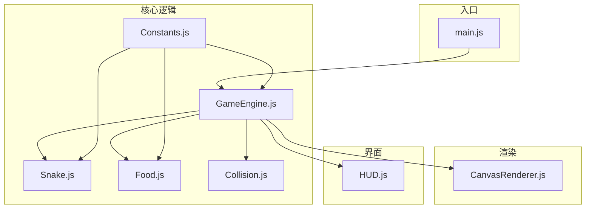
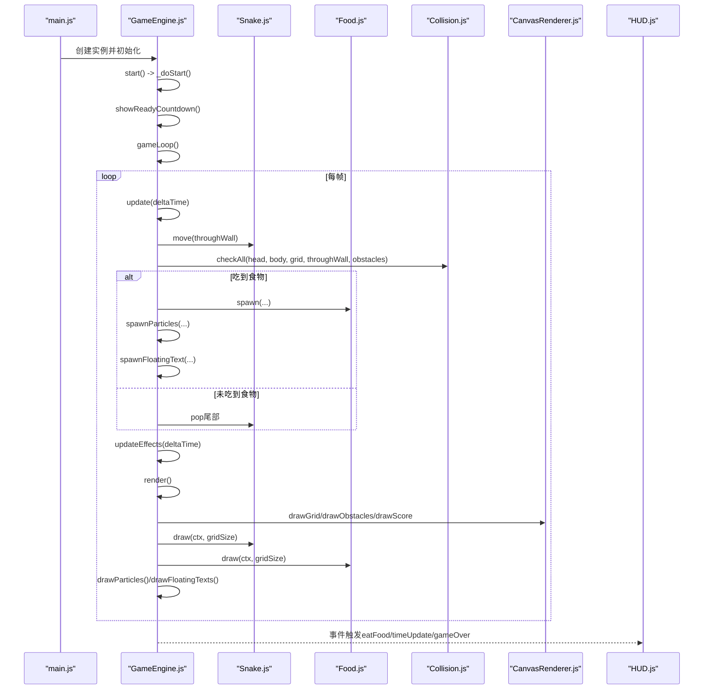
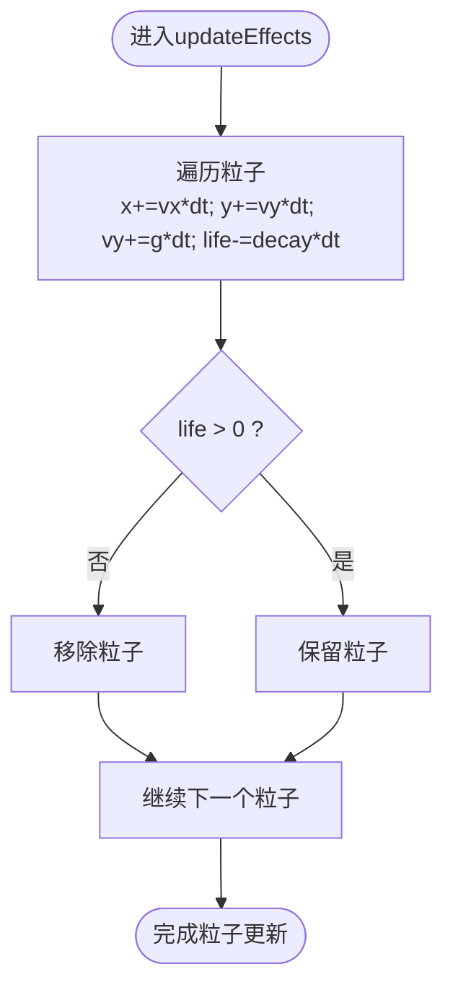
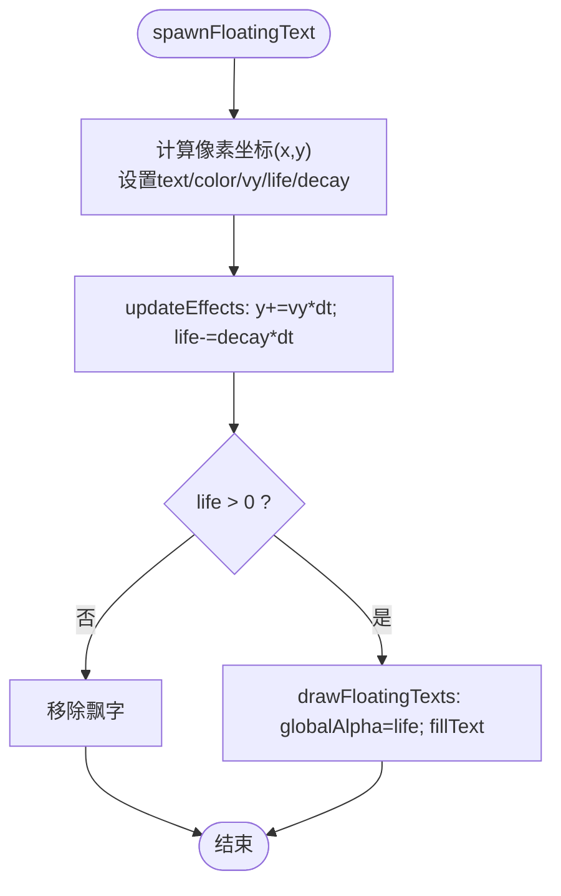
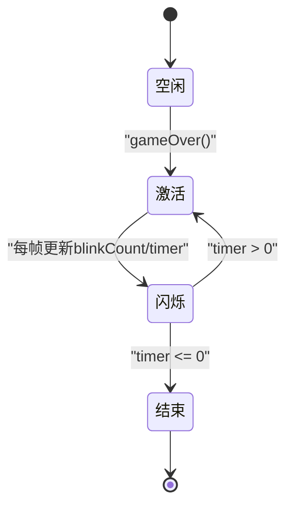
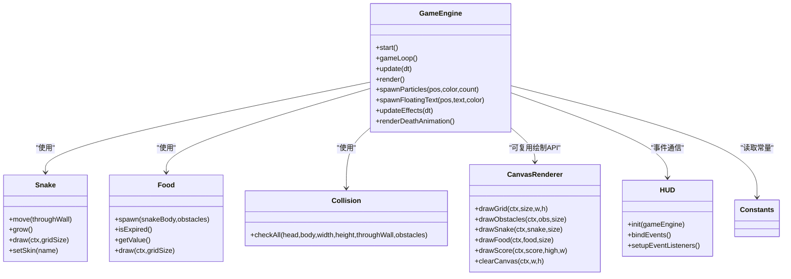

# Canvas渲染系统

<cite>
**本文引用的文件**
- [CanvasRenderer.js](file://snake-game/js/render/CanvasRenderer.js)
- [GameEngine.js](file://snake-game/js/core/GameEngine.js)
- [Snake.js](file://snake-game/js/core/Snake.js)
- [Food.js](file://snake-game/js/core/Food.js)
- [Collision.js](file://snake-game/js/core/Collision.js)
- [HUD.js](file://snake-game/js/ui/HUD.js)
- [Constants.js](file://snake-game/js/utils/Constants.js)
- [main.js](file://snake-game/js/main.js)
</cite>

## 目录
1. [简介](#简介)
2. [项目结构](#项目结构)
3. [核心组件](#核心组件)
4. [架构总览](#架构总览)
5. [详细组件分析](#详细组件分析)
6. [依赖关系分析](#依赖关系分析)
7. [性能考量与优化](#性能考量与优化)
8. [故障排查指南](#故障排查指南)
9. [结论](#结论)
10. [附录：自定义特效开发指南](#附录自定义特效开发指南)

## 简介
本技术文档聚焦于贪吃蛇游戏的Canvas渲染系统，围绕以下目标展开：
- 解析CanvasRenderer模块的渲染架构设计（画布初始化、渲染循环控制、图层管理机制）
- 深入说明粒子效果系统的实现（生命周期管理、物理运动模拟、碰撞检测算法）
- 解析得分飘字动画系统（文字生成、位置计算、动画轨迹控制、透明度渐变）
- 介绍死亡闪烁特效的实现原理（闪烁频率控制、颜色变换算法、视觉反馈优化）
- 总结渲染性能优化技术（离屏渲染、批量绘制、内存优化策略）
- 提供自定义特效开发指南和最佳实践

## 项目结构
游戏采用模块化组织方式，渲染相关代码主要分布在render与core目录下，UI层通过事件总线与引擎交互。

图表来源
- [main.js:1-216](file://snake-game/js/main.js#L1-L216)
- [GameEngine.js:1-888](file://snake-game/js/core/GameEngine.js#L1-L888)
- [CanvasRenderer.js:1-188](file://snake-game/js/render/CanvasRenderer.js#L1-L188)
- [Snake.js:1-214](file://snake-game/js/core/Snake.js#L1-L214)
- [Food.js:1-168](file://snake-game/js/core/Food.js#L1-L168)
- [Collision.js:1-73](file://snake-game/js/core/Collision.js#L1-L73)
- [HUD.js:1-178](file://snake-game/js/ui/HUD.js#L1-L178)
- [Constants.js:1-81](file://snake-game/js/utils/Constants.js#L1-L81)

章节来源
- [main.js:1-216](file://snake-game/js/main.js#L1-L216)
- [GameEngine.js:1-888](file://snake-game/js/core/GameEngine.js#L1-L888)
- [CanvasRenderer.js:1-188](file://snake-game/js/render/CanvasRenderer.js#L1-L188)
- [Snake.js:1-214](file://snake-game/js/core/Snake.js#L1-L214)
- [Food.js:1-168](file://snake-game/js/core/Food.js#L1-L168)
- [Collision.js:1-73](file://snake-game/js/core/Collision.js#L1-L73)
- [HUD.js:1-178](file://snake-game/js/ui/HUD.js#L1-L178)
- [Constants.js:1-81](file://snake-game/js/utils/Constants.js#L1-L81)

## 核心组件
- GameEngine：负责游戏状态机、输入处理、更新循环、渲染调度、视觉效果（粒子、飘字、死亡闪烁）以及数据持久化。
- Snake：维护蛇身坐标、方向、移动与增长语义。
- Food：管理食物位置、类型、过期时间与绘制。
- Collision：统一的碰撞检测接口（墙、自身、障碍物、食物）。
- CanvasRenderer：提供网格、障碍物、蛇、食物、分数等基础绘制方法（当前未在游戏主渲染路径中被调用）。
- HUD：基于事件总线更新DOM显示（分数、最高分、计时器、结束界面）。
- Constants：全局常量（网格尺寸、方向、难度、模式、食物类型、皮肤配色、默认设置等）。

章节来源
- [GameEngine.js:1-888](file://snake-game/js/core/GameEngine.js#L1-L888)
- [Snake.js:1-214](file://snake-game/js/core/Snake.js#L1-L214)
- [Food.js:1-168](file://snake-game/js/core/Food.js#L1-L168)
- [Collision.js:1-73](file://snake-game/js/core/Collision.js#L1-L73)
- [CanvasRenderer.js:1-188](file://snake-game/js/render/CanvasRenderer.js#L1-L188)
- [HUD.js:1-178](file://snake-game/js/ui/HUD.js#L1-L178)
- [Constants.js:1-81](file://snake-game/js/utils/Constants.js#L1-L81)

## 架构总览
下图展示了从入口到渲染的关键流程，包括渲染循环、更新阶段、视觉效果更新与绘制顺序。

图表来源
- [main.js:1-216](file://snake-game/js/main.js#L1-L216)
- [GameEngine.js:1-888](file://snake-game/js/core/GameEngine.js#L1-L888)
- [Snake.js:1-214](file://snake-game/js/core/Snake.js#L1-L214)
- [Food.js:1-168](file://snake-game/js/core/Food.js#L1-L168)
- [Collision.js:1-73](file://snake-game/js/core/Collision.js#L1-L73)
- [CanvasRenderer.js:1-188](file://snake-game/js/render/CanvasRenderer.js#L1-L188)
- [HUD.js:1-178](file://snake-game/js/ui/HUD.js#L1-L178)

## 详细组件分析

### CanvasRenderer模块与渲染架构
- 职责边界
  - CanvasRenderer提供通用绘制方法（网格、障碍物、蛇、食物、分数），便于复用或替换渲染后端。
  - 当前GameEngine在render中直接调用自身的draw*方法与实体对象的draw方法，未使用CanvasRenderer对象的方法。该模块可作为“可插拔渲染器”保留，未来可通过切换实现以支持离屏渲染或WebGL后端。
- 画布初始化
  - GameEngine构造函数获取canvas与2D上下文，并在start前根据容器尺寸调整画布大小，确保网格对齐。
- 渲染循环控制
  - 使用requestAnimationFrame驱动gameLoop；update阶段按固定时间步长推进（accumulator累加），保证不同刷新率下的稳定逻辑步进。
- 图层管理机制
  - 绘制顺序：背景清空 → 网格 → 障碍物 → 食物 → 蛇 → 粒子 → 飘字 → 分数。此顺序确保上层元素覆盖下层元素，符合视觉层级预期。

章节来源
- [CanvasRenderer.js:1-188](file://snake-game/js/render/CanvasRenderer.js#L1-L188)
- [GameEngine.js:1-888](file://snake-game/js/core/GameEngine.js#L1-L888)

### 粒子效果系统
- 数据结构
  - 每个粒子包含位置(x,y)、速度(vx,vy)、生命(life)、衰减(decay)、尺寸(size)、颜色(color)。
- 生命周期管理
  - 生成：在吃到食物时调用spawnParticles，依据食物位置与颜色批量创建粒子。
  - 更新：updateEffects中对每个粒子施加重力（vy增加）、位移更新、life衰减，过滤掉已死亡的粒子。
  - 销毁：当life<=0时移除，避免数组膨胀。
- 物理运动模拟
  - 简单欧拉积分：x+=vx*dt, y+=vy*dt；vy+=gravity*dt，形成抛物线轨迹。
- 碰撞检测算法
  - 粒子不与游戏实体进行碰撞检测，仅做自衰减与重力下落，降低每帧开销。
- 绘制
  - drawParticles遍历粒子，按life设置globalAlpha，绘制圆形，最后恢复alpha为1。

图表来源
- [GameEngine.js:1-888](file://snake-game/js/core/GameEngine.js#L1-L888)

章节来源
- [GameEngine.js:1-888](file://snake-game/js/core/GameEngine.js#L1-L888)

### 得分飘字动画系统
- 文字生成
  - 在eatFood中调用spawnFloatingText，传入食物网格坐标、文本内容（如“+分数”）与颜色。
- 位置计算
  - 将网格坐标转换为像素坐标，初始y位于食物顶部中心，x位于食物中心。
- 动画轨迹控制
  - 每帧在updateEffects中执行y+=vy*dt，使文字向上漂移；life随时间衰减。
- 透明度渐变效果
  - drawFloatingTexts中使用globalAlpha=life，实现淡出效果；结束后清理。

图表来源
- [GameEngine.js:1-888](file://snake-game/js/core/GameEngine.js#L1-L888)

章节来源
- [GameEngine.js:1-888](file://snake-game/js/core/GameEngine.js#L1-L888)

### 死亡闪烁特效
- 触发时机
  - gameOver中启动deathAnimation，设置active=true、duration=1.5秒、blinkCount=0。
- 闪烁频率控制
  - 在renderDeathAnimation中，使用blinkCount奇偶性决定是否绘制蛇体，形成闪烁效果；每帧递增blinkCount并按dt递减timer。
- 颜色变换算法
  - 头部与身体分别使用红色系填充，增强“死亡”视觉反馈。
- 视觉反馈优化
  - 独立渲染循环（requestAnimationFrame）播放死亡动画，不影响主循环；结束后关闭active，避免持续占用资源。

图表来源
- [GameEngine.js:1-888](file://snake-game/js/core/GameEngine.js#L1-L888)

章节来源
- [GameEngine.js:1-888](file://snake-game/js/core/GameEngine.js#L1-L888)

### 渲染管线与绘制顺序
- 清空画布
  - 使用纯色背景填充，确保无残留。
- 绘制层次
  - 网格 → 障碍物 → 食物 → 蛇 → 粒子 → 飘字 → 分数。
- 特殊效果
  - 食物的高光与特殊类型（金色/彩虹）的脉冲效果；蛇头的眼睛随方向变化。

章节来源
- [GameEngine.js:1-888](file://snake-game/js/core/GameEngine.js#L1-L888)
- [Food.js:1-168](file://snake-game/js/core/Food.js#L1-L168)
- [Snake.js:1-214](file://snake-game/js/core/Snake.js#L1-L214)

## 依赖关系分析
- GameEngine依赖
  - Snake：移动、绘制、长度查询、皮肤设置。
  - Food：生成、过期检查、绘制、值获取。
  - Collision：综合碰撞检测。
  - Constants：网格尺寸、方向、难度、模式、食物类型、皮肤配色、默认设置。
  - HUD：通过事件总线更新UI。
- CanvasRenderer与GameEngine的关系
  - CanvasRenderer提供通用绘制方法，但当前GameEngine未调用其方法，而是自行实现draw*与实体draw。这为后续解耦与替换渲染后端预留空间。

图表来源
- [GameEngine.js:1-888](file://snake-game/js/core/GameEngine.js#L1-L888)
- [Snake.js:1-214](file://snake-game/js/core/Snake.js#L1-L214)
- [Food.js:1-168](file://snake-game/js/core/Food.js#L1-L168)
- [Collision.js:1-73](file://snake-game/js/core/Collision.js#L1-L73)
- [CanvasRenderer.js:1-188](file://snake-game/js/render/CanvasRenderer.js#L1-L188)
- [HUD.js:1-178](file://snake-game/js/ui/HUD.js#L1-L178)
- [Constants.js:1-81](file://snake-game/js/utils/Constants.js#L1-L81)

章节来源
- [GameEngine.js:1-888](file://snake-game/js/core/GameEngine.js#L1-L888)
- [CanvasRenderer.js:1-188](file://snake-game/js/render/CanvasRenderer.js#L1-L188)

## 性能考量与优化
- 固定时间步长与渲染分离
  - accumulator机制保证逻辑更新稳定，不受显示器刷新率影响；渲染尽可能轻量，减少重绘区域。
- 批量绘制与状态复用
  - 在绘制大量相同属性对象时，尽量复用fillStyle/strokeStyle与font设置，减少状态切换次数。
- 内存优化
  - 粒子与飘字在生命周期结束时及时从数组中移除，避免内存泄漏与垃圾回收抖动。
- 离屏渲染建议
  - 可将静态背景（网格、障碍物）绘制至离屏Canvas，每帧仅复制该缓冲区，再叠加动态元素（蛇、食物、特效），显著降低重复绘制成本。
- 批处理绘制
  - 对同色同形状的元素（如网格线）可使用路径合并或更少的beginPath/lineTo调用，减少上下文切换。
- 透明度与合成
  - 谨慎使用globalAlpha与复杂阴影，必要时在低配设备上降级特效。

[本节为通用指导，不直接分析具体文件]

## 故障排查指南
- 画布尺寸异常
  - 现象：网格错位或蛇/食物绘制偏移。
  - 排查：确认容器可见后再resizeCanvas；监听visibilitychange与resize事件，确保尺寸计算正确。
- 渲染卡顿
  - 现象：帧率下降。
  - 排查：减少每帧绘制数量（粒子/飘字上限）；避免频繁创建临时对象；考虑离屏缓存静态层。
- 粒子/飘字不消失
  - 现象：数组持续增长导致内存问题。
  - 排查：检查updateEffects中的life衰减与filter逻辑是否正确执行。
- 死亡动画不结束
  - 现象：闪烁持续不停。
  - 排查：确认renderDeathAnimation中timer递减与active标志重置逻辑。

章节来源
- [GameEngine.js:1-888](file://snake-game/js/core/GameEngine.js#L1-L888)

## 结论
Canvas渲染系统以GameEngine为核心，结合Snake、Food、Collision等模块，实现了稳定的更新循环与清晰的绘制层次。粒子与飘字系统提供了即时反馈与视觉吸引力，死亡闪烁增强了失败体验的清晰度。CanvasRenderer虽未被主渲染路径直接使用，但为未来扩展（离屏渲染、多后端）奠定了良好基础。通过合理的性能优化与特效管理，可在保持流畅性的同时提升表现力。

[本节为总结性内容，不直接分析具体文件]

## 附录：自定义特效开发指南
- 新增特效类型
  - 在GameEngine中定义新的特效数组（例如explosions[]），并提供spawnExplosion(position, color, count)方法。
  - 在updateEffects中统一更新所有特效的生命周期与物理参数。
  - 在render中新增drawExplosions(ctx)进行绘制。
- 生命周期与性能
  - 为每种特效设定合理的最大数量与生命周期，避免无限增长。
  - 使用池化对象（对象池）减少频繁分配与GC压力。
- 与现有系统协作
  - 通过事件总线与HUD或其他模块通信，展示特效相关的UI反馈（如连击数、暴击提示）。
- 配置化
  - 将特效强度、颜色、衰减等参数放入配置对象，便于运行时调整与A/B测试。
- 兼容性
  - 在低端设备上自动降级特效（减少数量、禁用复杂混合模式）。

[本节为概念性指导，不直接分析具体文件]