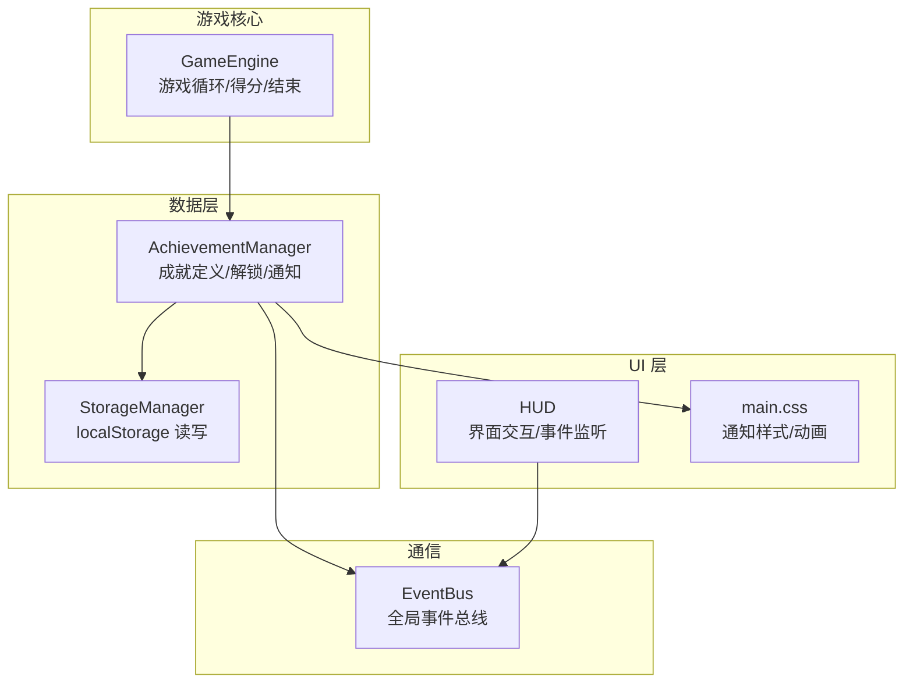
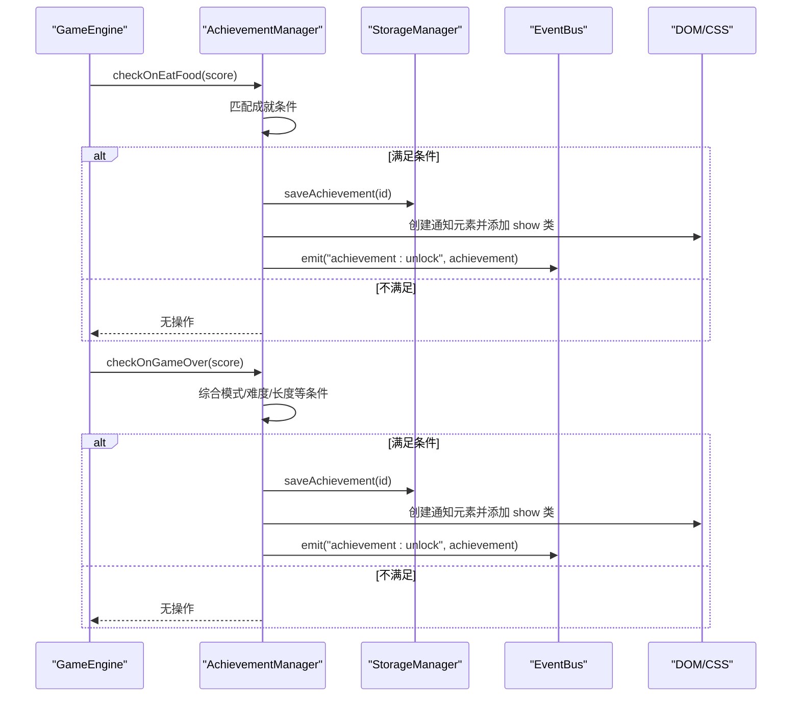
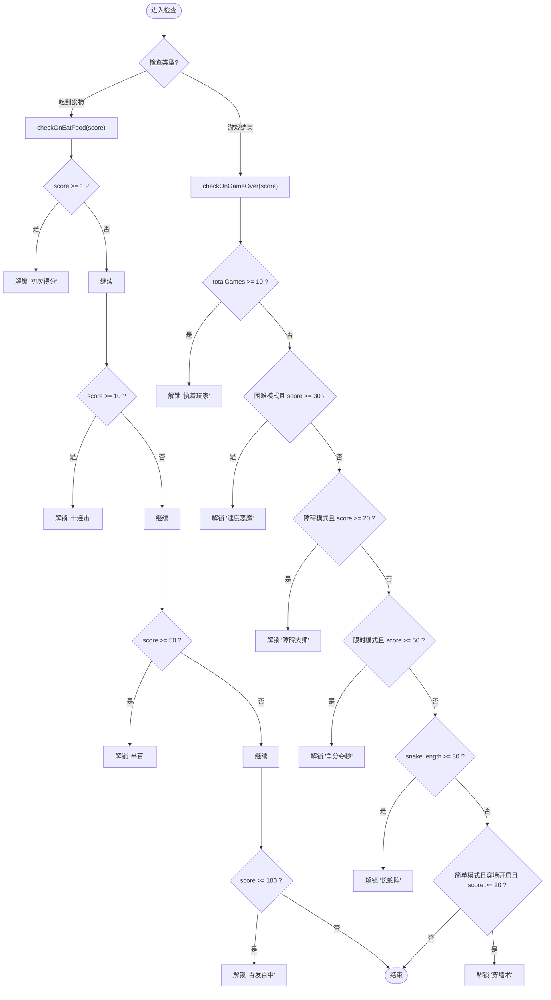
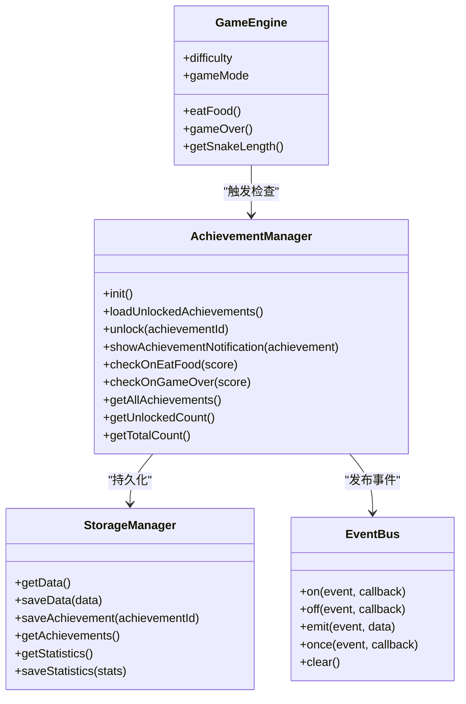

# 成就系统

<cite>
**本文引用的文件**   
- [AchievementManager.js](file://snake-game/js/data/AchievementManager.js)
- [StorageManager.js](file://snake-game/js/data/StorageManager.js)
- [GameEngine.js](file://snake-game/js/core/GameEngine.js)
- [HUD.js](file://snake-game/js/ui/HUD.js)
- [EventBus.js](file://snake-game/js/utils/EventBus.js)
- [main.css](file://snake-game/css/main.css)
</cite>

## 目录
1. [简介](#简介)
2. [项目结构](#项目结构)
3. [核心组件](#核心组件)
4. [架构总览](#架构总览)
5. [详细组件分析](#详细组件分析)
6. [依赖关系分析](#依赖关系分析)
7. [性能与可扩展性](#性能与可扩展性)
8. [故障排查指南](#故障排查指南)
9. [结论](#结论)
10. [附录：扩展新成就开发指南](#附录扩展新成就开发指南)

## 简介
本技术文档聚焦贪吃蛇游戏的“成就系统”，围绕 AchievementManager 模块展开，系统性阐述其设计架构、数据模型、解锁条件检查机制、进度跟踪逻辑、本地持久化、UI 通知实现，以及 10 个内置成就的触发时机与判定规则。同时提供扩展新成就的最佳实践，帮助开发者快速集成新的成就类型与业务逻辑。

## 项目结构
成就系统涉及以下关键文件与职责：
- 数据层
  - AchievementManager.js：成就定义、状态管理、解锁流程、通知渲染、事件发布
  - StorageManager.js：localStorage 读写封装（设置、最高分、统计、成就列表）
- 游戏核心
  - GameEngine.js：游戏循环、得分与结束流程、成就检查调用点
- UI 层
  - HUD.js：界面交互与事件监听（分数、计时器、结束界面等）
  - main.css：成就通知样式与动画
- 通信
  - EventBus.js：全局事件总线，用于模块间解耦通信

图表来源
- [AchievementManager.js:1-252](file://snake-game/js/data/AchievementManager.js#L1-L252)
- [StorageManager.js:1-175](file://snake-game/js/data/StorageManager.js#L1-L175)
- [GameEngine.js:343-378](file://snake-game/js/core/GameEngine.js#L343-L378)
- [GameEngine.js:460-506](file://snake-game/js/core/GameEngine.js#L460-L506)
- [HUD.js:57-87](file://snake-game/js/ui/HUD.js#L57-L87)
- [EventBus.js:1-80](file://snake-game/js/utils/EventBus.js#L1-L80)
- [main.css:701-747](file://snake-game/css/main.css#L701-L747)

章节来源
- [AchievementManager.js:1-252](file://snake-game/js/data/AchievementManager.js#L1-L252)
- [StorageManager.js:1-175](file://snake-game/js/data/StorageManager.js#L1-L175)
- [GameEngine.js:343-378](file://snake-game/js/core/GameEngine.js#L343-L378)
- [GameEngine.js:460-506](file://snake-game/js/core/GameEngine.js#L460-L506)
- [HUD.js:57-87](file://snake-game/js/ui/HUD.js#L57-L87)
- [EventBus.js:1-80](file://snake-game/js/utils/EventBus.js#L1-L80)
- [main.css:701-747](file://snake-game/css/main.css#L701-L747)

## 核心组件
- AchievementManager
  - 维护成就定义数组，包含 id、name、description、icon、unlocked 字段
  - 提供初始化、加载已解锁成就、解锁流程、通知显示、按场景检查（吃到食物/游戏结束）、查询接口
- StorageManager
  - 统一 localStorage 访问，提供保存/读取设置、最高分、统计数据、成就列表等方法
- GameEngine
  - 在 eatFood() 和 gameOver() 中分别触发成就检查入口
- HUD
  - 通过事件总线订阅游戏事件，更新 UI；成就通知由 AchievementManager 直接操作 DOM
- EventBus
  - 提供 on/off/emit/once/clear 方法，作为模块间松耦合通信通道

章节来源
- [AchievementManager.js:1-252](file://snake-game/js/data/AchievementManager.js#L1-L252)
- [StorageManager.js:1-175](file://snake-game/js/data/StorageManager.js#L1-L175)
- [GameEngine.js:343-378](file://snake-game/js/core/GameEngine.js#L343-L378)
- [GameEngine.js:460-506](file://snake-game/js/core/GameEngine.js#L460-L506)
- [HUD.js:57-87](file://snake-game/js/ui/HUD.js#L57-L87)
- [EventBus.js:1-80](file://snake-game/js/utils/EventBus.js#L1-L80)

## 架构总览
成就系统的整体工作流如下：
- 游戏运行期间，GameEngine 在每次吃到食物时调用 AchievementManager.checkOnEatFood(score)
- 游戏结束时，GameEngine 调用 AchievementManager.checkOnGameOver(score)
- AchievementManager 根据当前状态与配置判断是否满足解锁条件，若满足则：
  - 标记 unlocked 为 true
  - 通过 StorageManager.saveAchievement(id) 持久化
  - 创建并展示通知 DOM，使用 CSS 动画
  - 通过 EventBus 发出 achievement:unlock 事件，供其他模块响应

图表来源
- [GameEngine.js:343-378](file://snake-game/js/core/GameEngine.js#L343-L378)
- [GameEngine.js:460-506](file://snake-game/js/core/GameEngine.js#L460-L506)
- [AchievementManager.js:109-155](file://snake-game/js/data/AchievementManager.js#L109-L155)
- [AchievementManager.js:158-221](file://snake-game/js/data/AchievementManager.js#L158-L221)
- [StorageManager.js:101-110](file://snake-game/js/data/StorageManager.js#L101-L110)
- [EventBus.js:40-50](file://snake-game/js/utils/EventBus.js#L40-L50)
- [main.css:701-747](file://snake-game/css/main.css#L701-L747)

## 详细组件分析

### AchievementManager 模块
- 数据结构
  - achievements 数组：每个对象包含 id、name、description、icon、unlocked
- 生命周期
  - init(): 启动时从本地存储加载已解锁成就
  - loadUnlockedAchievements(): 读取 StorageManager 中的 achievements 列表，映射到内存状态
- 解锁流程
  - unlock(achievementId): 查找对应成就，若未解锁则标记并持久化，随后显示通知并发布事件
  - showAchievementNotification(achievement): 动态创建 DOM 节点，注入图标、标题、名称、描述，通过 requestAnimationFrame 添加 show 类触发 CSS 过渡动画，3 秒后移除
- 检查入口
  - checkOnEatFood(score): 基于当前分数阈值触发初次得分、十连击、半百、百发百中
  - checkOnGameOver(score): 基于总游戏局数、模式与难度、蛇身长度、穿墙能力等条件触发其余成就
- 查询接口
  - getAllAchievements()/getUnlockedCount()/getTotalCount()

图表来源
- [AchievementManager.js:158-221](file://snake-game/js/data/AchievementManager.js#L158-L221)

章节来源
- [AchievementManager.js:1-252](file://snake-game/js/data/AchievementManager.js#L1-L252)

### StorageManager 模块
- 作用
  - 封装 localStorage 的读写，避免重复 try-catch 与 JSON 解析错误处理
- 与成就相关的方法
  - saveAchievement(achievementId): 将成就 ID 写入 data.achievements 数组并去重保存
  - getAchievements(): 返回已解锁成就 ID 列表
  - getData()/saveData(): 通用存取接口，被多处复用
- 健壮性
  - 解析失败或保存异常时记录错误日志并返回默认值，保证主流程不受影响

章节来源
- [StorageManager.js:1-175](file://snake-game/js/data/StorageManager.js#L1-L175)

### GameEngine 集成点
- 吃到食物
  - eatFood() 中计算分数、生成特效、播放音效/震动后，调用 AchievementManager.checkOnEatFood(this.score)
- 游戏结束
  - gameOver() 中保存最高分与游戏记录、更新统计、播放音效/震动后，调用 AchievementManager.checkOnGameOver(this.score)
- 注意
  - GameEngine 持有 snake、difficulty、gameMode 等上下文，供成就检查读取

章节来源
- [GameEngine.js:343-378](file://snake-game/js/core/GameEngine.js#L343-L378)
- [GameEngine.js:460-506](file://snake-game/js/core/GameEngine.js#L460-L506)

### HUD 与事件总线
- HUD 通过 globalEventBus 订阅 game:eatFood、game:over、game:timeUpdate、game:start、game:reset、game:highScore 等事件，负责更新分数、计时器、结束界面等
- 成就通知由 AchievementManager 直接操作 DOM，无需 HUD 介入；但可通过 EventBus 的 achievement:unlock 事件进行扩展（例如记录日志、联动排行榜等）

章节来源
- [HUD.js:57-87](file://snake-game/js/ui/HUD.js#L57-L87)
- [EventBus.js:1-80](file://snake-game/js/utils/EventBus.js#L1-L80)

### UI 通知样式与动画
- 通知容器
  - .achievement-notification：固定定位、居中、渐变背景、阴影、flex 布局、z-index 置顶
  - .achievement-notification.show：通过 top 属性变化触发过渡动画，实现从上方滑入效果
- 内容结构
  - 图标、标题、名称、描述四个子元素，分别对应 icon、title、name、desc
- 生命周期
  - JS 创建节点并插入 body，requestAnimationFrame 后添加 show 类，3 秒后移除 show 类并在过渡结束后清理 DOM

章节来源
- [AchievementManager.js:126-155](file://snake-game/js/data/AchievementManager.js#L126-L155)
- [main.css:701-747](file://snake-game/css/main.css#L701-L747)

## 依赖关系分析
- AchievementManager 依赖
  - StorageManager：持久化已解锁成就
  - EventBus：发布解锁事件
  - DOM/CSS：创建通知元素与样式动画
- GameEngine 依赖
  - AchievementManager：在关键时机触发检查
- HUD 依赖
  - EventBus：订阅游戏事件以更新 UI
- 全局常量
  - GAME_MODE、DIFFICULTY、GRID_* 等在游戏引擎与配置中定义，成就检查通过 window._gameEngine 访问运行时上下文

图表来源
- [AchievementManager.js:1-252](file://snake-game/js/data/AchievementManager.js#L1-L252)
- [StorageManager.js:1-175](file://snake-game/js/data/StorageManager.js#L1-L175)
- [GameEngine.js:343-378](file://snake-game/js/core/GameEngine.js#L343-L378)
- [GameEngine.js:460-506](file://snake-game/js/core/GameEngine.js#L460-L506)
- [EventBus.js:1-80](file://snake-game/js/utils/EventBus.js#L1-L80)

章节来源
- [AchievementManager.js:1-252](file://snake-game/js/data/AchievementManager.js#L1-L252)
- [StorageManager.js:1-175](file://snake-game/js/data/StorageManager.js#L1-L175)
- [GameEngine.js:343-378](file://snake-game/js/core/GameEngine.js#L343-L378)
- [GameEngine.js:460-506](file://snake-game/js/core/GameEngine.js#L460-L506)
- [EventBus.js:1-80](file://snake-game/js/utils/EventBus.js#L1-L80)

## 性能与可扩展性
- 性能
  - 成就检查仅在两个低频次时机触发（吃食物与游戏结束），对主循环影响极小
  - 通知 DOM 创建与销毁采用一次性操作，CSS 过渡动画由浏览器合成线程执行，避免频繁重排
- 可扩展性
  - 新增成就只需在 achievements 数组追加定义，并在相应检查函数中添加条件分支
  - 复杂条件可抽取为独立函数，保持 checkOnEatFood/checkOnGameOver 简洁
  - 如需跨模块联动，可在 unlock 后通过 EventBus 的 achievement:unlock 事件扩展行为

[本节为通用指导，不涉及具体文件分析]

## 故障排查指南
- 本地存储异常
  - StorageManager 在解析或保存失败时会记录错误日志并返回默认值，不会中断主流程
  - 建议检查浏览器控制台错误信息，确认 STORAGE_KEY 是否一致
- 通知未显示
  - 确认 AchievementManager.init() 已在应用启动阶段调用
  - 检查 CSS 是否加载成功，.achievement-notification 与 .show 类是否存在
  - 确认 DOM 节点未被其他脚本提前移除
- 成就未解锁
  - 核对 GameEngine 是否在 eatFood/gameOver 中正确调用检查入口
  - 检查 window._gameEngine 上下文是否可用（难度、模式、蛇长等）
  - 验证 StorageManager.saveAchievement 是否被调用且数据持久化成功

章节来源
- [StorageManager.js:8-31](file://snake-game/js/data/StorageManager.js#L8-L31)
- [AchievementManager.js:88-103](file://snake-game/js/data/AchievementManager.js#L88-L103)
- [AchievementManager.js:126-155](file://snake-game/js/data/AchievementManager.js#L126-L155)
- [GameEngine.js:343-378](file://snake-game/js/core/GameEngine.js#L343-L378)
- [GameEngine.js:460-506](file://snake-game/js/core/GameEngine.js#L460-L506)

## 结论
成就系统以 AchievementManager 为核心，结合 StorageManager 的持久化能力与 EventBus 的解耦通信，实现了轻量、稳定、易扩展的成就体系。通过在 GameEngine 的关键路径上植入检查入口，达成“低侵入、高内聚”的设计目标。UI 通知采用原生 DOM 与 CSS 过渡，兼顾性能与体验。整体架构清晰，便于后续新增成就与联动功能。

[本节为总结性内容，不涉及具体文件分析]

## 附录：扩展新成就开发指南

### 步骤一：添加成就定义
- 在 AchievementManager.achievements 数组末尾追加新条目，包含 id、name、description、icon、unlocked 字段
- 确保 id 唯一且语义明确

章节来源
- [AchievementManager.js:12-83](file://snake-game/js/data/AchievementManager.js#L12-L83)

### 步骤二：编写解锁逻辑
- 若条件与分数相关，在 checkOnEatFood(score) 中添加阈值判断
- 若条件与模式/难度/长度等相关，在 checkOnGameOver(score) 中增加分支
- 复杂条件建议拆分为私有方法，提高可读性与可测试性

章节来源
- [AchievementManager.js:158-221](file://snake-game/js/data/AchievementManager.js#L158-L221)

### 步骤三：集成到游戏流程
- 确认 GameEngine.eatFood() 与 GameEngine.gameOver() 已调用对应检查入口
- 如需要额外上下文（如特定模式标志位），确保 GameEngine 暴露必要属性或方法

章节来源
- [GameEngine.js:343-378](file://snake-game/js/core/GameEngine.js#L343-L378)
- [GameEngine.js:460-506](file://snake-game/js/core/GameEngine.js#L460-L506)

### 步骤四：可选——扩展通知与联动
- 如需在解锁时联动其他模块（如排行榜、统计面板），订阅 EventBus 的 achievement:unlock 事件
- 如需自定义通知样式，调整 main.css 中 .achievement-notification 相关类

章节来源
- [EventBus.js:40-50](file://snake-game/js/utils/EventBus.js#L40-L50)
- [main.css:701-747](file://snake-game/css/main.css#L701-L747)

### 10 个内置成就的解锁条件与触发时机
- 初次得分
  - 条件：单局分数达到 1 或以上
  - 触发时机：吃食物后检查
- 十连击
  - 条件：单局分数达到 10
  - 触发时机：吃食物后检查
- 半百
  - 条件：单局分数达到 50
  - 触发时机：吃食物后检查
- 百发百中
  - 条件：单局分数达到 100
  - 触发时机：吃食物后检查
- 执着玩家
  - 条件：累计游戏局数达到 10
  - 触发时机：游戏结束时检查
- 速度恶魔
  - 条件：困难模式下得分超过 30
  - 触发时机：游戏结束时检查
- 障碍大师
  - 条件：障碍模式下得分超过 20
  - 触发时机：游戏结束时检查
- 争分夺秒
  - 条件：限时模式下得分超过 50
  - 触发时机：游戏结束时检查
- 长蛇阵
  - 条件：蛇身长度达到 30
  - 触发时机：游戏结束时检查
- 穿墙术
  - 条件：简单模式且开启穿墙能力，且得分超过 20
  - 触发时机：游戏结束时检查

章节来源
- [AchievementManager.js:12-83](file://snake-game/js/data/AchievementManager.js#L12-L83)
- [AchievementManager.js:158-221](file://snake-game/js/data/AchievementManager.js#L158-L221)