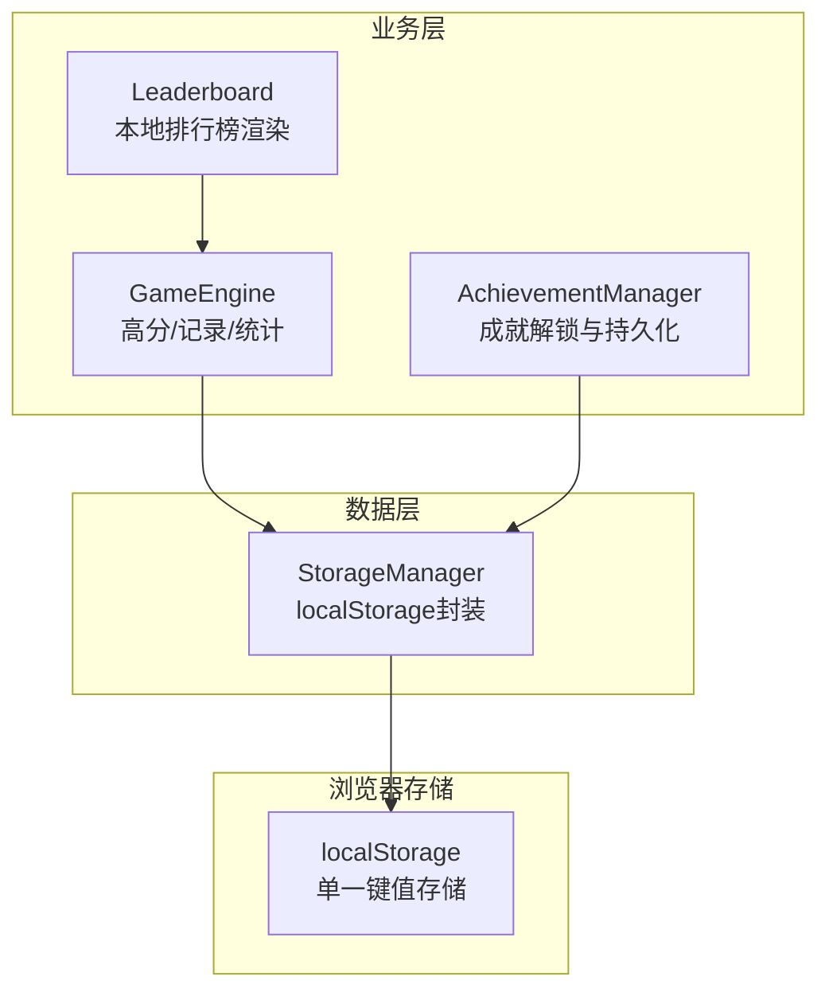
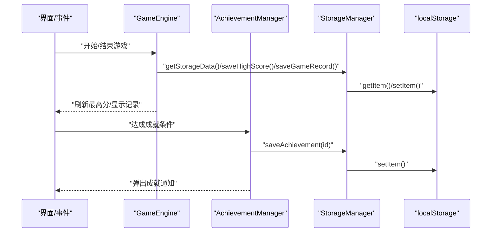
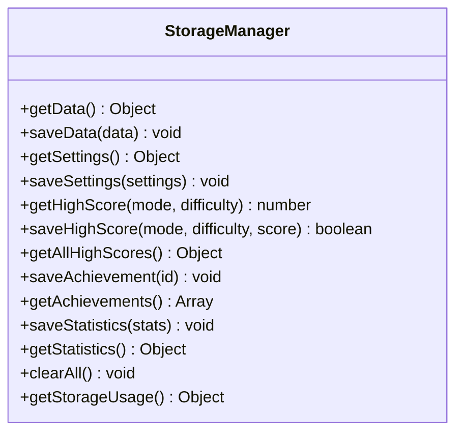
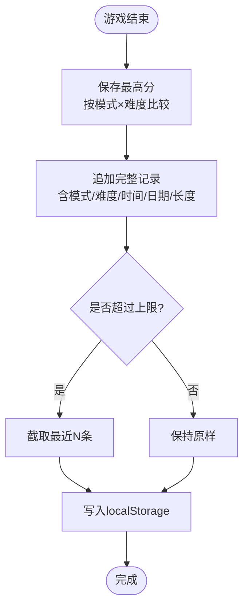
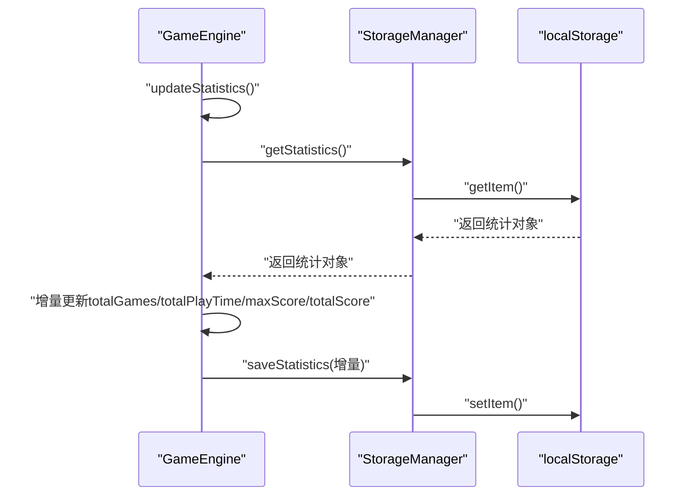
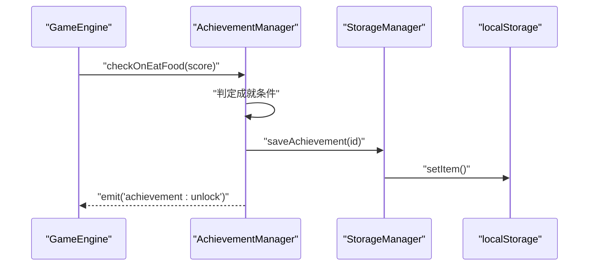
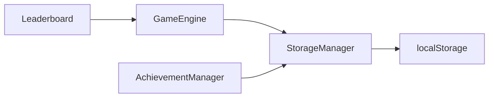

# 数据持久化管理

<cite>
**本文引用的文件**   
- [StorageManager.js](file://snake-game/js/data/StorageManager.js)
- [AchievementManager.js](file://snake-game/js/data/AchievementManager.js)
- [GameEngine.js](file://snake-game/js/core/GameEngine.js)
- [Leaderboard.js](file://snake-game/js/ui/Leaderboard.js)
- [qa_test.js](file://snake-game/test/qa_test.js)
</cite>

## 目录
1. [简介](#简介)
2. [项目结构](#项目结构)
3. [核心组件](#核心组件)
4. [架构总览](#架构总览)
5. [详细组件分析](#详细组件分析)
6. [依赖关系分析](#依赖关系分析)
7. [性能与容量考量](#性能与容量考量)
8. [故障排查指南](#故障排查指南)
9. [结论](#结论)
10. [附录：数据结构与字段说明](#附录数据结构与字段说明)

## 简介
本技术文档聚焦贪吃蛇游戏的本地数据持久化体系，围绕 StorageManager 模块的存储架构、数据结构设计、版本管理策略展开，并系统梳理游戏记录保存（单局成绩、历史战绩、排行榜）、统计信息收集（时长、成就、难度偏好、行为追踪）、本地缓存策略（压缩、增量更新、冲突解决）、数据迁移与备份恢复（导出导入、格式兼容、错误处理），以及数据安全与隐私保护建议。

## 项目结构
与数据持久化相关的核心代码位于 snake-game 前端目录中，关键文件如下：
- 数据存储层：js/data/StorageManager.js
- 成就系统：js/data/AchievementManager.js
- 游戏引擎与持久化交互：js/core/GameEngine.js
- 排行榜展示：js/ui/Leaderboard.js
- 测试用例：test/qa_test.js

图表来源
- [StorageManager.js:1-174](file://snake-game/js/data/StorageManager.js#L1-L174)
- [GameEngine.js:116-188](file://snake-game/js/core/GameEngine.js#L116-L188)
- [AchievementManager.js:96-120](file://snake-game/js/data/AchievementManager.js#L96-L120)
- [Leaderboard.js:52-105](file://snake-game/js/ui/Leaderboard.js#L52-L105)

章节来源
- [StorageManager.js:1-174](file://snake-game/js/data/StorageManager.js#L1-L174)
- [GameEngine.js:116-188](file://snake-game/js/core/GameEngine.js#L116-L188)
- [AchievementManager.js:96-120](file://snake-game/js/data/AchievementManager.js#L96-L120)
- [Leaderboard.js:52-105](file://snake-game/js/ui/Leaderboard.js#L52-L105)

## 核心组件
- StorageManager：提供统一的 localStorage 读写封装，包含设置、最高分、成就、统计等字段的存取方法，并提供存储用量查询与全量清理能力。
- GameEngine：在游戏生命周期内负责读取/写入高分、完整游戏记录与统计数据；在结算阶段触发持久化。
- AchievementManager：维护成就定义与解锁状态，从持久化加载已解锁成就，并在达成条件时调用 StorageManager 持久化。
- Leaderboard：基于持久化的完整游戏记录或最高分数据渲染本地排行榜。

章节来源
- [StorageManager.js:1-174](file://snake-game/js/data/StorageManager.js#L1-L174)
- [GameEngine.js:116-188](file://snake-game/js/core/GameEngine.js#L116-L188)
- [AchievementManager.js:96-120](file://snake-game/js/data/AchievementManager.js#L96-L120)
- [Leaderboard.js:52-105](file://snake-game/js/ui/Leaderboard.js#L52-L105)

## 架构总览
整体采用“单键对象”模型：所有用户数据以 JSON 对象形式保存在 localStorage 的一个键下，由 StorageManager 统一读写。GameEngine 与 AchievementManager 作为上层消费者，按领域拆分职责：前者关注分数与记录，后者关注成就状态。

图表来源
- [GameEngine.js:140-188](file://snake-game/js/core/GameEngine.js#L140-L188)
- [AchievementManager.js:109-120](file://snake-game/js/data/AchievementManager.js#L109-L120)
- [StorageManager.js:8-31](file://snake-game/js/data/StorageManager.js#L8-L31)

## 详细组件分析

### StorageManager 模块
- 存储键与对象模型
  - 使用单一键名（常量 STORAGE_KEY）承载全部数据。
  - 顶层对象包含以下子域：settings、highScores、achievements、statistics、gameRecords。
- 核心方法
  - getData/saveData：JSON 序列化/反序列化的安全封装，含异常捕获与默认空对象回退。
  - getSettings/saveSettings：合并默认设置与用户设置。
  - getHighScore/saveHighScore/getAllHighScores：按模式×难度维度维护最高分。
  - saveAchievement/getAchievements：去重保存成就ID列表。
  - saveStatistics/getStatistics：增量合并统计字段，提供默认初始值。
  - clearAll：删除整个存储键。
  - getStorageUsage：估算已用空间与配额占比。
- 复杂度与性能
  - 读写均为 O(1) 次 localStorage 操作；对象大小随记录增长线性增加。
  - 注意避免频繁大对象写盘，应合并写入或使用节流。

图表来源
- [StorageManager.js:1-174](file://snake-game/js/data/StorageManager.js#L1-L174)

章节来源
- [StorageManager.js:1-174](file://snake-game/js/data/StorageManager.js#L1-L174)

### 游戏记录保存（单局成绩、历史战绩、排行榜）
- 单局成绩与最高分
  - GameEngine.saveHighScore：按 mode × difficulty 维度比较并更新最高分，同时广播事件。
- 完整游戏记录
  - GameEngine.saveGameRecord：追加一条包含得分、模式、难度、时间限制、ISO 日期、蛇长度等信息的记录；仅保留最近 N 条（实现为固定上限）。
- 排行榜展示
  - Leaderboard.renderLocalLeaderboard：优先使用完整记录排序展示，若无则回退到 highScores 聚合结果，取前若干条。

图表来源
- [GameEngine.js:140-188](file://snake-game/js/core/GameEngine.js#L140-L188)
- [Leaderboard.js:52-105](file://snake-game/js/ui/Leaderboard.js#L52-L105)

章节来源
- [GameEngine.js:140-188](file://snake-game/js/core/GameEngine.js#L140-L188)
- [Leaderboard.js:52-105](file://snake-game/js/ui/Leaderboard.js#L52-L105)

### 统计信息收集系统
- 统计字段
  - totalGames：累计对局数
  - totalPlayTime：累计游玩时长（秒）
  - maxScore：历史最高分
  - totalScore：累计总分（用于计算平均分的中间量）
- 更新时机
  - GameEngine.updateStatistics：每局结束时增量更新上述字段，并落盘。
- 扩展点
  - 可在 updateStatistics 中追加难度偏好计数、各模式胜率、行为埋点等字段，并通过 StorageManager.saveStatistics 进行增量合并。

图表来源
- [GameEngine.js:571-590](file://snake-game/js/core/GameEngine.js#L571-L590)
- [StorageManager.js:125-146](file://snake-game/js/data/StorageManager.js#L125-L146)

章节来源
- [GameEngine.js:571-590](file://snake-game/js/core/GameEngine.js#L571-L590)
- [StorageManager.js:125-146](file://snake-game/js/data/StorageManager.js#L125-L146)

### 成就系统与持久化
- 成就定义与状态
  - AchievementManager 内置成就清单，含 id/name/description/icon/unlocked。
- 加载与解锁
  - init/loadUnlockedAchievements：从持久化 achievements 数组映射 unlocked 状态。
  - unlock：若未解锁则标记并持久化，同时触发 UI 通知与全局事件。
- 触发时机
  - checkOnEatFood：根据当前分数判定基础成就。
  - checkOnGameOver：结合 GameEngine 上下文（难度、模式、蛇长等）判定进阶成就。

图表来源
- [AchievementManager.js:109-120](file://snake-game/js/data/AchievementManager.js#L109-L120)
- [AchievementManager.js:161-181](file://snake-game/js/data/AchievementManager.js#L161-L181)
- [AchievementManager.js:187-221](file://snake-game/js/data/AchievementManager.js#L187-L221)

章节来源
- [AchievementManager.js:96-120](file://snake-game/js/data/AchievementManager.js#L96-L120)
- [AchievementManager.js:161-181](file://snake-game/js/data/AchievementManager.js#L161-L181)
- [AchievementManager.js:187-221](file://snake-game/js/data/AchievementManager.js#L187-L221)

### 本地缓存策略（压缩、增量更新、冲突解决）
- 压缩
  - 当前未启用显式压缩；可通过将大对象（如 gameRecords）转为紧凑结构或引入轻量压缩库降低体积。
- 增量更新
  - StorageManager.saveStatistics 使用浅合并策略，避免覆盖其他统计字段。
  - GameEngine.updateStatistics 仅修改必要字段后落盘，减少不必要写入。
- 冲突解决
  - 最高分：严格大于才更新，避免覆盖更优成绩。
  - 成就：数组去重，避免重复条目。
  - 记录上限：通过切片保留最近 N 条，控制增长。
- 建议增强
  - 引入版本号字段（如 storageVersion）与迁移钩子，便于未来结构演进。
  - 对高频写入做节流/批处理，降低 I/O 压力。

章节来源
- [StorageManager.js:72-86](file://snake-game/js/data/StorageManager.js#L72-L86)
- [StorageManager.js:101-110](file://snake-game/js/data/StorageManager.js#L101-L110)
- [GameEngine.js:167-188](file://snake-game/js/core/GameEngine.js#L167-L188)
- [GameEngine.js:571-590](file://snake-game/js/core/GameEngine.js#L571-L590)

### 数据迁移与备份恢复（导出/导入、兼容性、错误处理）
- 现状
  - 未提供显式的导出/导入与版本迁移接口；StorageManager.clearAll 可清空数据。
- 建议方案
  - 导出：读取 STORAGE_KEY 对应对象，生成 JSON 字符串供下载。
  - 导入：校验 JSON 结构与必填字段，合并至现有数据，失败时回滚。
  - 版本迁移：在对象中加入 storageVersion，启动时检测并执行迁移脚本。
  - 兼容性：对旧版字段提供默认值与降级逻辑（例如缺失 statistics 时返回默认对象）。
- 错误处理
  - 解析异常：StorageManager.getData 已捕获 JSON 解析错误并返回空对象。
  - 写入异常：StorageManager.saveData 捕获异常并记录日志。
  - 建议：导入流程增加 try/catch 与事务式回滚，确保一致性。

章节来源
- [StorageManager.js:8-31](file://snake-game/js/data/StorageManager.js#L8-L31)
- [StorageManager.js:148-153](file://snake-game/js/data/StorageManager.js#L148-L153)

### 数据安全与隐私保护建议
- 最小化采集：仅保存必要的游戏数据，避免敏感信息。
- 本地加密：如需更高安全性，可对存储内容进行简单加密后再落盘。
- 访问控制：避免在控制台暴露原始数据；对外导出需二次确认。
- 容量监控：利用 getStorageUsage 监控占用，必要时提示清理。
- 合规性：遵循浏览器隐私策略，不跨站共享数据。

[本节为通用建议，不直接分析具体文件]

## 依赖关系分析
- 耦合关系
  - GameEngine 与 AchievementManager 均依赖 StorageManager 提供的统一接口。
  - Leaderboard 依赖 GameEngine 的 getStorageData 获取数据源。
- 外部依赖
  - 浏览器 localStorage API。
- 潜在循环依赖
  - 当前无循环依赖；各模块职责清晰。

图表来源
- [GameEngine.js:116-188](file://snake-game/js/core/GameEngine.js#L116-L188)
- [AchievementManager.js:96-120](file://snake-game/js/data/AchievementManager.js#L96-L120)
- [Leaderboard.js:52-105](file://snake-game/js/ui/Leaderboard.js#L52-L105)
- [StorageManager.js:1-174](file://snake-game/js/data/StorageManager.js#L1-L174)

章节来源
- [GameEngine.js:116-188](file://snake-game/js/core/GameEngine.js#L116-L188)
- [AchievementManager.js:96-120](file://snake-game/js/data/AchievementManager.js#L96-L120)
- [Leaderboard.js:52-105](file://snake-game/js/ui/Leaderboard.js#L52-L105)
- [StorageManager.js:1-174](file://snake-game/js/data/StorageManager.js#L1-L174)

## 性能与容量考量
- 写入频率
  - 建议对高频写入（如统计增量）进行节流或批量合并，减少 localStorage 调用次数。
- 对象大小
  - gameRecords 建议设置合理上限（当前实现为固定上限），避免无限增长导致解析变慢。
- 内存与CPU
  - 排行榜渲染前进行排序与裁剪，避免大数据集导致的卡顿。
- 容量监控
  - 使用 getStorageUsage 定期评估占用，必要时提示用户清理或归档历史数据。

[本节为通用指导，不直接分析具体文件]

## 故障排查指南
- 常见问题
  - 数据为空：检查 StorageManager.getData 的默认回退逻辑与 localStorage 是否被清理。
  - 最高分未更新：确认 compare 逻辑与调用时机是否正确。
  - 成就未持久化：检查 saveAchievement 的去重与写入路径。
  - 排行榜无数据：确认 gameRecords 是否存在或回退到 highScores。
- 定位手段
  - 查看 qa_test.js 中的断言用例，复现问题场景。
  - 在关键路径添加 console 输出或断点，观察对象结构与写入时机。

章节来源
- [qa_test.js:505-565](file://snake-game/test/qa_test.js#L505-L565)

## 结论
StorageManager 提供了简洁可靠的 localStorage 封装，配合 GameEngine 与 AchievementManager 的职责分离，形成了清晰的本地持久化体系。当前已支持最高分、完整记录、成就与基础统计的持久化，具备良好可扩展性。建议在后续迭代中补充版本迁移、导出导入、压缩与写入节流等能力，以提升鲁棒性与用户体验。

[本节为总结性内容，不直接分析具体文件]

## 附录：数据结构与字段说明
- 顶层对象键
  - settings：用户设置（与默认设置合并）
  - highScores：{mode: {difficulty: score}}
  - achievements：string[]（已解锁成就ID）
  - statistics：{totalGames, totalPlayTime, maxScore, totalScore}
  - gameRecords：Array<{score, mode, difficulty, timeLimit, date, snakeLength}>
- 字段含义
  - mode：经典/限时/障碍
  - difficulty：简单/中等/困难
  - timeLimit：限时模式的时限（非限时为 null）
  - date：ISO 8601 时间戳
  - snakeLength：结束时蛇的长度

章节来源
- [StorageManager.js:125-146](file://snake-game/js/data/StorageManager.js#L125-L146)
- [GameEngine.js:167-188](file://snake-game/js/core/GameEngine.js#L167-L188)