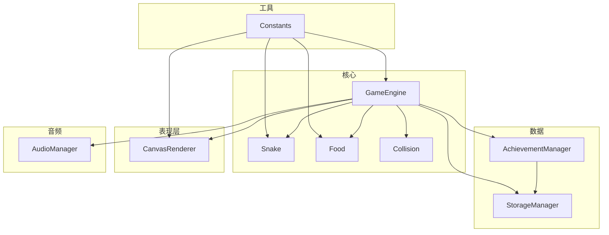
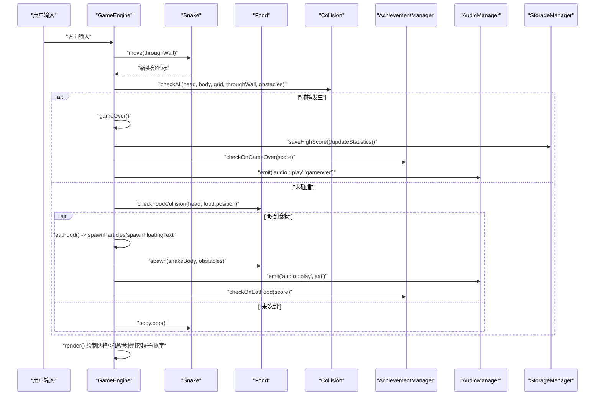
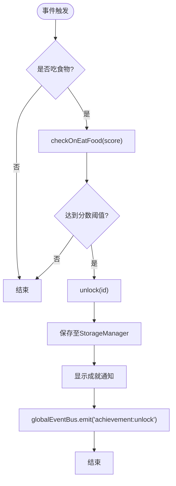
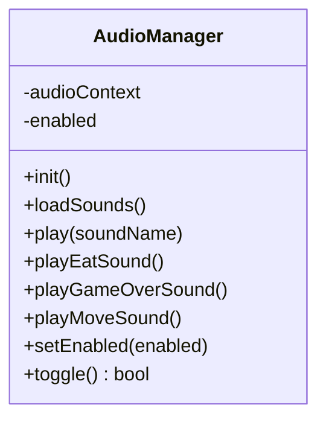
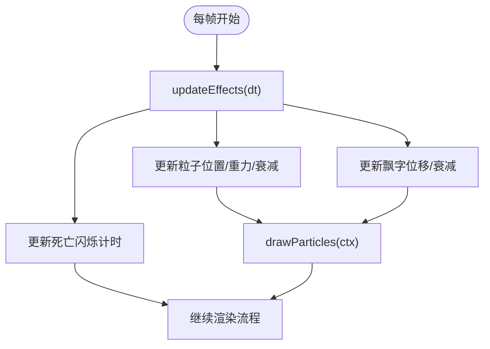
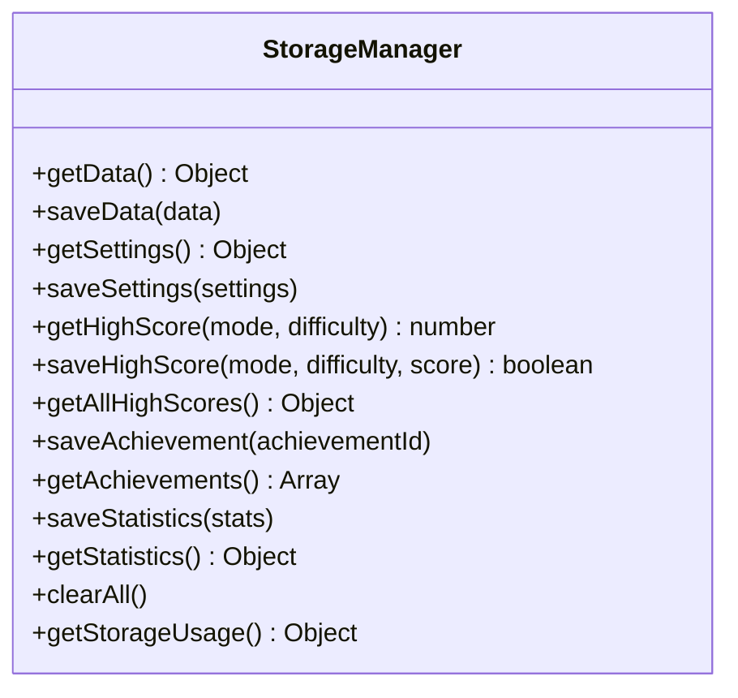
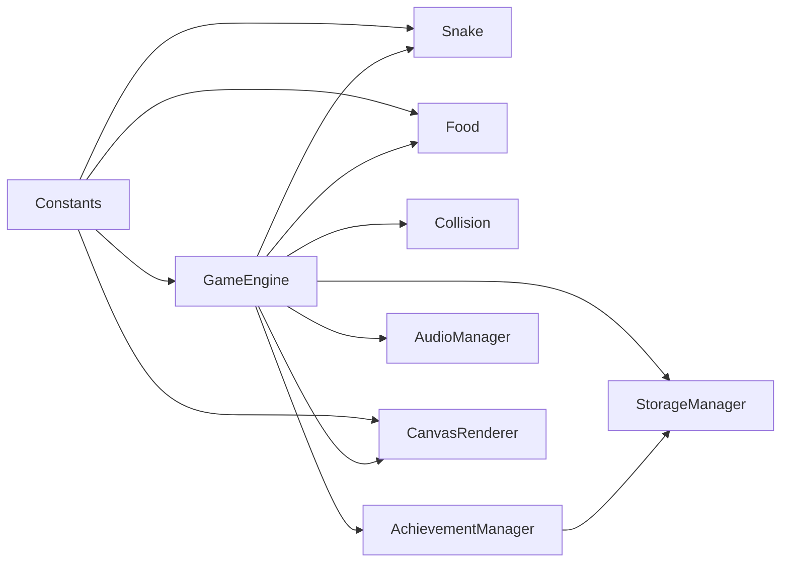

# 游戏特性实现

<cite>
**本文引用的文件**   
- [AchievementManager.js](file://snake-game/js/data/AchievementManager.js)
- [AudioManager.js](file://snake-game/js/audio/AudioManager.js)
- [CanvasRenderer.js](file://snake-game/js/render/CanvasRenderer.js)
- [StorageManager.js](file://snake-game/js/data/StorageManager.js)
- [GameEngine.js](file://snake-game/js/core/GameEngine.js)
- [Snake.js](file://snake-game/js/core/Snake.js)
- [Food.js](file://snake-game/js/core/Food.js)
- [Collision.js](file://snake-game/js/core/Collision.js)
- [Constants.js](file://snake-game/js/utils/Constants.js)
</cite>

## 目录
1. [简介](#简介)
2. [项目结构](#项目结构)
3. [核心组件](#核心组件)
4. [架构总览](#架构总览)
5. [详细组件分析](#详细组件分析)
6. [依赖关系分析](#依赖关系分析)
7. [性能考量](#性能考量)
8. [故障排查指南](#故障排查指南)
9. [结论](#结论)
10. [附录：扩展开发指南与最佳实践](#附录扩展开发指南与最佳实践)

## 简介
本技术文档聚焦贪吃蛇游戏的四大特性实现：成就系统、音效管理、Canvas渲染优化（粒子效果、得分飘字、死亡闪烁）、以及数据持久化。文档从代码级出发，梳理各模块的职责边界、数据流与控制流，并提供可视化图示与扩展建议，帮助开发者快速理解并在此基础上进行二次开发。

## 项目结构
本项目采用按功能域划分的模块化组织方式：
- core：核心逻辑（游戏引擎、蛇、食物、碰撞检测）
- data：数据管理与成就系统
- audio：音频播放控制
- render：Canvas绘制工具
- utils：常量与通用工具
- ui：界面交互（HUD、菜单、设置等）

图表来源
- [GameEngine.js:1-120](file://snake-game/js/core/GameEngine.js#L1-L120)
- [Snake.js:1-60](file://snake-game/js/core/Snake.js#L1-L60)
- [Food.js:1-60](file://snake-game/js/core/Food.js#L1-L60)
- [Collision.js:1-40](file://snake-game/js/core/Collision.js#L1-L40)
- [AchievementManager.js:1-60](file://snake-game/js/data/AchievementManager.js#L1-L60)
- [StorageManager.js:1-60](file://snake-game/js/data/StorageManager.js#L1-L60)
- [CanvasRenderer.js:1-40](file://snake-game/js/render/CanvasRenderer.js#L1-L40)
- [AudioManager.js:1-40](file://snake-game/js/audio/AudioManager.js#L1-L40)
- [Constants.js:1-40](file://snake-game/js/utils/Constants.js#L1-L40)

章节来源
- [GameEngine.js:1-120](file://snake-game/js/core/GameEngine.js#L1-L120)
- [Constants.js:1-81](file://snake-game/js/utils/Constants.js#L1-L81)

## 核心组件
- 成就系统(AchievementManager)：定义成就条目、加载已解锁状态、在关键事件触发时检查并解锁，同时通过事件总线广播通知UI展示。
- 音效管理(AudioManager)：基于Web Audio API合成音效，支持吃食、结束等音效的触发与开关控制。
- Canvas渲染(CanvasRenderer + GameEngine内联绘制)：提供网格、障碍物、蛇、食物绘制；GameEngine内部维护粒子、飘字、死亡动画，并在每帧更新与绘制。
- 数据持久化(StorageManager)：封装localStorage读写，提供最高分、统计信息、成就列表、设置的存取接口。

章节来源
- [AchievementManager.js:1-120](file://snake-game/js/data/AchievementManager.js#L1-L120)
- [AudioManager.js:1-120](file://snake-game/js/audio/AudioManager.js#L1-L120)
- [CanvasRenderer.js:1-120](file://snake-game/js/render/CanvasRenderer.js#L1-L120)
- [StorageManager.js:1-120](file://snake-game/js/data/StorageManager.js#L1-L120)
- [GameEngine.js:300-420](file://snake-game/js/core/GameEngine.js#L300-L420)

## 架构总览
下图展示了游戏主循环中“更新-渲染”的关键路径，以及成就、音效、存储的集成点。

图表来源
- [GameEngine.js:300-420](file://snake-game/js/core/GameEngine.js#L300-L420)
- [GameEngine.js:460-506](file://snake-game/js/core/GameEngine.js#L460-L506)
- [GameEngine.js:657-756](file://snake-game/js/core/GameEngine.js#L657-L756)
- [AchievementManager.js:158-221](file://snake-game/js/data/AchievementManager.js#L158-L221)
- [AudioManager.js:44-66](file://snake-game/js/audio/AudioManager.js#L44-L66)
- [StorageManager.js:58-86](file://snake-game/js/data/StorageManager.js#L58-L86)

## 详细组件分析

### 成就系统(AchievementManager)
- 设计要点
  - 成就清单集中定义，包含id、名称、描述、图标与解锁状态。
  - 初始化时从本地存储加载已解锁的成就ID集合，映射到对应条目。
  - 在“吃食物”和“游戏结束”两个时机触发检查，满足条件则解锁并持久化。
  - 解锁后创建DOM通知元素，并通过事件总线广播，供UI订阅显示。
- 解锁条件示例
  - 初次得分、分数阈值（10/50/100）、模式相关（困难/障碍/限时）、长度阈值、穿墙模式达成等。
- 进度跟踪与奖励
  - 当前实现以“解锁即完成”，无累计进度条或阶段目标；可通过扩展数据结构增加progress字段与阈值判定。
  - 奖励机制可扩展为积分、皮肤解锁、排行榜加分等，由事件监听处接入。

图表来源
- [AchievementManager.js:158-221](file://snake-game/js/data/AchievementManager.js#L158-L221)
- [AchievementManager.js:109-155](file://snake-game/js/data/AchievementManager.js#L109-L155)
- [StorageManager.js:101-119](file://snake-game/js/data/StorageManager.js#L101-L119)

章节来源
- [AchievementManager.js:1-252](file://snake-game/js/data/AchievementManager.js#L1-252)
- [StorageManager.js:96-119](file://snake-game/js/data/StorageManager.js#L96-L119)

### 音效管理系统(AudioManager)
- 设计要点
  - 使用Web Audio API动态合成音效，避免外部资源依赖。
  - 首次用户交互（点击/按键）后初始化AudioContext，满足浏览器自动播放策略。
  - 提供统一入口play(soundName)，内部分发到具体音效函数（吃食、结束、移动）。
  - 支持全局启用/禁用，便于设置面板联动。
- 播放控制
  - 吃食：短促清脆的上行频率+增益衰减。
  - 结束：下行频率+较长衰减，传达失败感。
  - 移动：可选低频短音，默认关闭以避免噪音。
- 音量调节
  - 当前实现固定增益值，可在GainNode上暴露setVolume方法，结合设置项实现动态调节。

图表来源
- [AudioManager.js:1-172](file://snake-game/js/audio/AudioManager.js#L1-L172)

章节来源
- [AudioManager.js:1-172](file://snake-game/js/audio/AudioManager.js#L1-L172)

### Canvas渲染系统与视觉增强
- 基础绘制
  - 网格背景、障碍物、蛇身与眼睛、食物圆形与高光、特殊食物闪烁。
  - 分数文本绘制于画布左上/右上角。
- 性能优化技术
  - 增量更新：仅更新活跃粒子与飘字，生命周期结束后过滤移除，减少无效绘制。
  - 批量绘制：每帧统一设置globalAlpha，避免频繁状态切换。
  - 延迟resize：仅在容器可见且尺寸有效时调整Canvas大小，避免隐藏容器导致的计算浪费。
  - 固定时间步长：使用累加器将物理更新与渲染解耦，保证稳定速度。
- 视觉特效
  - 粒子效果：吃食时在食物位置生成多向扩散粒子，带重力与衰减。
  - 得分飘字：在食物位置上方生成向上漂移的得分提示，透明度随时间衰减。
  - 死亡闪烁：游戏结束时启动独立动画循环，交替显示蛇体并变红，持续约1.5秒。

图表来源
- [GameEngine.js:432-458](file://snake-game/js/core/GameEngine.js#L432-L458)
- [GameEngine.js:731-756](file://snake-game/js/core/GameEngine.js#L731-L756)
- [GameEngine.js:511-566](file://snake-game/js/core/GameEngine.js#L511-L566)
- [CanvasRenderer.js:11-152](file://snake-game/js/render/CanvasRenderer.js#L11-L152)

章节来源
- [GameEngine.js:386-458](file://snake-game/js/core/GameEngine.js#L386-L458)
- [GameEngine.js:657-756](file://snake-game/js/core/GameEngine.js#L657-L756)
- [CanvasRenderer.js:1-188](file://snake-game/js/render/CanvasRenderer.js#L1-188)

### 数据持久化管理(StorageManager)
- 能力概览
  - 统一读取/写入localStorage，提供settings、highScores、achievements、statistics等结构化接口。
  - 最高分按“模式-难度”维度保存，返回是否刷新了记录。
  - 统计数据聚合：总局数、总时长、最高单局分、总分等。
  - 成就列表去重保存，避免重复写入。
- 缓存策略
  - 所有写操作均先读后改再写，保证一致性。
  - 异常捕获：解析失败或写入失败时降级处理，不影响主流程。
- 与成就系统集成
  - AchievementManager在解锁时调用saveAchievement，确保跨会话持久化。

图表来源
- [StorageManager.js:1-175](file://snake-game/js/data/StorageManager.js#L1-L175)

章节来源
- [StorageManager.js:1-175](file://snake-game/js/data/StorageManager.js#L1-L175)

## 依赖关系分析
- 耦合与内聚
  - GameEngine作为中枢，聚合Snake、Food、Collision、AchievementManager、AudioManager与Canvas绘制逻辑，职责清晰但耦合度较高，适合单体小游戏。
  - AchievementManager与StorageManager低耦合，通过接口访问数据，易于替换存储后端。
  - AudioManager与GameEngine通过事件总线松耦合，便于扩展更多音效类型。
- 外部依赖
  - Web Audio API用于音效合成。
  - localStorage用于本地持久化。
  - DOM API用于成就通知与UI交互。

图表来源
- [GameEngine.js:1-120](file://snake-game/js/core/GameEngine.js#L1-L120)
- [AchievementManager.js:1-120](file://snake-game/js/data/AchievementManager.js#L1-L120)
- [AudioManager.js:1-120](file://snake-game/js/audio/AudioManager.js#L1-L120)
- [CanvasRenderer.js:1-120](file://snake-game/js/render/CanvasRenderer.js#L1-L120)
- [Constants.js:1-81](file://snake-game/js/utils/Constants.js#L1-L81)

章节来源
- [GameEngine.js:1-120](file://snake-game/js/core/GameEngine.js#L1-L120)
- [Constants.js:1-81](file://snake-game/js/utils/Constants.js#L1-L81)

## 性能考量
- 渲染
  - 使用requestAnimationFrame驱动主循环，避免阻塞UI线程。
  - 粒子与飘字采用生命周期过滤，减少每帧遍历开销。
  - 固定时间步长更新，降低不同设备帧率差异带来的抖动。
- I/O
  - 本地存储写入集中在关键节点（高分、统计、成就），避免高频写入造成卡顿。
- 音频
  - 按需初始化AudioContext，避免不必要的上下文创建。
  - 合成音效轻量，CPU占用极低。

[本节为通用指导，不直接分析具体文件]

## 故障排查指南
- 音效无法播放
  - 现象：点击或按键后仍无声。
  - 排查：确认首次交互后AudioContext是否成功创建；检查全局音效开关是否被禁用。
  - 参考路径：[AudioManager.js:21-38](file://snake-game/js/audio/AudioManager.js#L21-L38)、[AudioManager.js:44-66](file://snake-game/js/audio/AudioManager.js#L44-L66)
- 成就未解锁
  - 现象：达成条件后无通知或未持久化。
  - 排查：检查对应时机是否调用checkOnEatFood/checkOnGameOver；查看StorageManager是否正确保存；确认UI是否订阅了achievement:unlock事件。
  - 参考路径：[AchievementManager.js:158-221](file://snake-game/js/data/AchievementManager.js#L158-L221)、[StorageManager.js:101-119](file://snake-game/js/data/StorageManager.js#L101-L119)
- 数据丢失或解析错误
  - 现象：重置后最高分/统计/设置丢失。
  - 排查：检查localStorage键名是否一致；确认JSON序列化/反序列化的异常捕获分支。
  - 参考路径：[StorageManager.js:8-31](file://snake-game/js/data/StorageManager.js#L8-L31)
- 画面卡顿
  - 现象：高帧率下掉帧明显。
  - 排查：检查粒子数量上限与衰减参数；确认是否在隐藏容器中执行resize；评估是否可合并绘制批次。
  - 参考路径：[GameEngine.js:70-95](file://snake-game/js/core/GameEngine.js#L70-L95)、[GameEngine.js:432-458](file://snake-game/js/core/GameEngine.js#L432-L458)

章节来源
- [AudioManager.js:21-66](file://snake-game/js/audio/AudioManager.js#L21-L66)
- [AchievementManager.js:158-221](file://snake-game/js/data/AchievementManager.js#L158-L221)
- [StorageManager.js:8-31](file://snake-game/js/data/StorageManager.js#L8-L31)
- [GameEngine.js:70-95](file://snake-game/js/core/GameEngine.js#L70-L95)
- [GameEngine.js:432-458](file://snake-game/js/core/GameEngine.js#L432-L458)

## 结论
本实现围绕“核心玩法-反馈-持久化”的主线展开，成就系统与音效管理通过事件总线与模块化解耦，Canvas渲染在保持简洁的同时提供了丰富的视觉反馈。整体结构清晰、扩展点明确，适合进一步引入更复杂的成就进度、音效库与渲染管线优化。

[本节为总结性内容，不直接分析具体文件]

## 附录：扩展开发指南与最佳实践
- 新增成就
  - 在成就清单中添加条目，定义id、名称、描述、图标。
  - 在合适时机调用unlock(id)，或在现有checkOnEatFood/checkOnGameOver中补充条件判断。
  - 如需进度型成就，可在条目中增加progress与threshold字段，并在检查逻辑中累积与判定。
  - 参考路径：[AchievementManager.js:12-83](file://snake-game/js/data/AchievementManager.js#L12-L83)、[AchievementManager.js:158-221](file://snake-game/js/data/AchievementManager.js#L158-L221)
- 新增音效
  - 在AudioManager.play中新增case分支，实现新的playXxxSound方法。
  - 在GameEngine相应事件处通过事件总线触发播放。
  - 参考路径：[AudioManager.js:44-66](file://snake-game/js/audio/AudioManager.js#L44-L66)、[GameEngine.js:365-367](file://snake-game/js/core/GameEngine.js#L365-L367)
- 新增视觉特效
  - 在GameEngine.updateEffects中扩展特效更新逻辑，在render中追加绘制。
  - 注意生命周期管理与alpha叠加，避免过度绘制。
  - 参考路径：[GameEngine.js:432-458](file://snake-game/js/core/GameEngine.js#L432-L458)、[GameEngine.js:731-756](file://snake-game/js/core/GameEngine.js#L731-L756)
- 数据持久化扩展
  - 在StorageManager中新增存取方法，遵循“先读后改再写”的模式。
  - 对大数据量考虑分页或压缩，避免localStorage容量限制。
  - 参考路径：[StorageManager.js:25-31](file://snake-game/js/data/StorageManager.js#L25-L31)
- 配置与常量
  - 新增游戏模式、难度、食物类型等，应在Constants中统一定义，并在GameEngine中适配。
  - 参考路径：[Constants.js:21-37](file://snake-game/js/utils/Constants.js#L21-L37)

章节来源
- [AchievementManager.js:12-83](file://snake-game/js/data/AchievementManager.js#L12-L83)
- [AudioManager.js:44-66](file://snake-game/js/audio/AudioManager.js#L44-L66)
- [GameEngine.js:432-458](file://snake-game/js/core/GameEngine.js#L432-L458)
- [StorageManager.js:25-31](file://snake-game/js/data/StorageManager.js#L25-L31)
- [Constants.js:21-37](file://snake-game/js/utils/Constants.js#L21-L37)