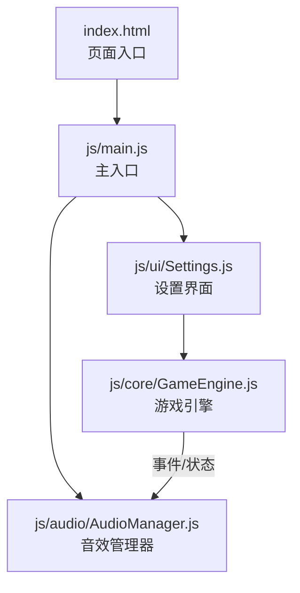
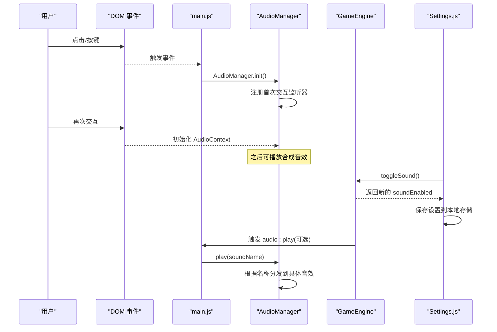
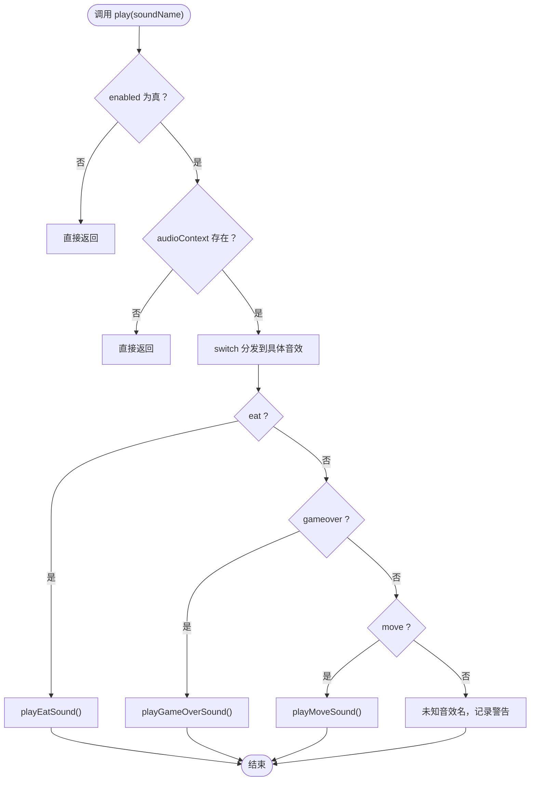
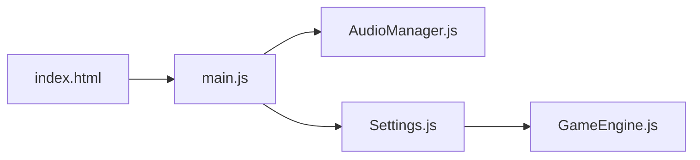

# 音效管理系统

<cite>
**本文引用的文件**
- [AudioManager.js](file://snake-game/js/audio/AudioManager.js)
- [main.js](file://snake-game/js/main.js)
- [GameEngine.js](file://snake-game/js/core/GameEngine.js)
- [Settings.js](file://snake-game/js/ui/Settings.js)
- [index.html](file://snake-game/index.html)
</cite>

## 目录
1. [简介](#简介)
2. [项目结构](#项目结构)
3. [核心组件](#核心组件)
4. [架构总览](#架构总览)
5. [详细组件分析](#详细组件分析)
6. [依赖关系分析](#依赖关系分析)
7. [性能与优化](#性能与优化)
8. [故障排查指南](#故障排查指南)
9. [结论](#结论)
10. [附录：音频资源管理与替换指南](#附录音频资源管理与替换指南)

## 简介
本技术文档聚焦于贪吃蛇游戏的音效管理系统，围绕 AudioManager 模块的音频播放控制架构展开，涵盖以下主题：
- 音频资源加载策略（当前采用 Web Audio API 合成音效）
- 播放状态管理（启用/禁用、静音模式）
- 音量调节机制（全局音量、分类控制）
- 背景音乐（BGM）循环播放控制与音效（SFX）即时触发
- 音频预加载优化策略
- 音频格式支持与跨浏览器兼容性处理（Web Audio API）
- 并发播放限制与内存管理
- 音频文件管理与替换流程

## 项目结构
游戏采用模块化组织，音频相关代码位于 js/audio 目录，并通过入口脚本在应用启动时初始化。

图表来源
- [index.html:279-294](file://snake-game/index.html#L279-L294)
- [main.js:1-20](file://snake-game/js/main.js#L1-L20)
- [AudioManager.js:1-40](file://snake-game/js/audio/AudioManager.js#L1-L40)
- [Settings.js:1-30](file://snake-game/js/ui/Settings.js#L1-L30)
- [GameEngine.js:1-50](file://snake-game/js/core/GameEngine.js#L1-L50)

章节来源
- [index.html:279-294](file://snake-game/index.html#L279-L294)
- [main.js:1-20](file://snake-game/js/main.js#L1-L20)

## 核心组件
- AudioManager：负责音频上下文创建、音效合成与播放、全局开关控制、占位 BGM 接口。
- main.js：监听全局事件并转发到 AudioManager；完成各模块初始化顺序。
- Settings.js：提供“音效”开关 UI，调用 GameEngine 持久化设置。
- GameEngine：维护 settings.soundEnabled 等设置项，供 UI 层读写。

章节来源
- [AudioManager.js:1-172](file://snake-game/js/audio/AudioManager.js#L1-L172)
- [main.js:172-176](file://snake-game/js/main.js#L172-L176)
- [Settings.js:24-36](file://snake-game/js/ui/Settings.js#L24-L36)
- [GameEngine.js:803-807](file://snake-game/js/core/GameEngine.js#L803-L807)

## 架构总览
整体数据流与控制流如下：
- 页面加载后，main.js 初始化各模块，包括 AudioManager.init()。
- 用户交互（点击/按键）触发 AudioManager 内部 initAudioContext，满足浏览器自动播放策略。
- 其他模块通过 EventBus 发出 audio:play 事件，main.js 订阅并调用 AudioManager.play(soundName)。
- Settings 界面切换“音效”开关，影响 GameEngine.settings.soundEnabled，后续可在业务逻辑中读取该值以决定是否触发音效。

图表来源
- [main.js:14-19](file://snake-game/js/main.js#L14-L19)
- [main.js:172-176](file://snake-game/js/main.js#L172-L176)
- [AudioManager.js:20-38](file://snake-game/js/audio/AudioManager.js#L20-L38)
- [Settings.js:24-36](file://snake-game/js/ui/Settings.js#L24-L36)
- [GameEngine.js:803-807](file://snake-game/js/core/GameEngine.js#L803-L807)

## 详细组件分析

### AudioManager 模块
职责与能力
- 初始化与上下文管理：延迟创建 AudioContext，避免违反浏览器自动播放策略。
- 音效合成与播放：基于 Oscillator + GainNode 生成短促 SFX（如“吃食物”、“游戏结束”）。
- 播放路由：根据 soundName 分派到对应方法。
- 全局开关：setEnabled/toggle 控制是否允许播放。
- BGM 占位接口：提供 playBackgroundMusic/stopBackgroundMusic 空实现，便于后续扩展。

关键流程
- 首次交互初始化 AudioContext
- 播放前检查 enabled 与 audioContext
- 按名称分发到具体音效方法
- 异常捕获与日志输出

图表来源
- [AudioManager.js:44-66](file://snake-game/js/audio/AudioManager.js#L44-L66)
- [AudioManager.js:71-89](file://snake-game/js/audio/AudioManager.js#L71-L89)
- [AudioManager.js:94-112](file://snake-game/js/audio/AudioManager.js#L94-L112)
- [AudioManager.js:117-133](file://snake-game/js/audio/AudioManager.js#L117-L133)

章节来源
- [AudioManager.js:1-172](file://snake-game/js/audio/AudioManager.js#L1-L172)

### 主入口与事件总线集成
- main.js 在 DOMContentLoaded 后初始化所有模块，包括 AudioManager.init()。
- 订阅 globalEventBus 的 audio:play 事件，将参数中的 sound 名称转发给 AudioManager.play。
- 键盘与触摸输入最终由 GameEngine 处理，若需要触发音效，可通过事件总线发布 audio:play。

章节来源
- [main.js:1-20](file://snake-game/js/main.js#L1-L20)
- [main.js:172-176](file://snake-game/js/main.js#L172-L176)

### 设置界面与全局静音
- Settings.js 绑定“音效”开关，调用 GameEngine.toggleSound() 更新 settings.soundEnabled，并持久化。
- GameEngine 暴露 toggleSound 方法，返回新状态，供 UI 同步勾选框。
- 当前 AudioManager 自身维护一个独立的 enabled 标志；建议未来统一使用 GameEngine.settings.soundEnabled 作为权威源，并在 AudioManager.play 入口处读取该值。

章节来源
- [Settings.js:24-36](file://snake-game/js/ui/Settings.js#L24-L36)
- [GameEngine.js:803-807](file://snake-game/js/core/GameEngine.js#L803-L807)

## 依赖关系分析
- index.html 引入脚本顺序确保常量、工具、核心、UI、渲染、音频、主入口依次加载。
- main.js 依赖 AudioManager、Settings、GameEngine 等模块。
- AudioManager 仅依赖浏览器原生 Web Audio API，无外部库依赖。

图表来源
- [index.html:279-294](file://snake-game/index.html#L279-L294)
- [main.js:14-19](file://snake-game/js/main.js#L14-L19)

章节来源
- [index.html:279-294](file://snake-game/index.html#L279-L294)
- [main.js:14-19](file://snake-game/js/main.js#L14-L19)

## 性能与优化
当前实现采用 Web Audio API 实时合成短音效，具备以下优势与注意点：
- 零网络请求：无需下载音频文件，首屏加载更快，适合移动端弱网环境。
- 低内存占用：不缓存音频解码后的缓冲，每次按需创建振荡器与增益节点，生命周期短。
- 并发控制：当前每个音效独立创建 oscillator/gain，短时间高频触发可能产生叠加声；建议在高频场景（如移动音效）增加节流或队列控制。
- 预加载策略：由于未使用外部音频文件，无需传统意义上的预加载；若未来引入真实音频，建议使用 AudioBuffer 预解码并复用。
- 浏览器兼容：AudioContext 需用户手势触发，已实现首次点击/按键初始化，符合主流浏览器策略。

优化建议
- 对高频音效（如 move）加入节流或合并播放窗口，避免过多振荡器同时运行。
- 引入全局音量节点（GainNode），统一管理输出音量，便于后续扩展分类音量控制。
- 若引入真实音频，建立统一的资源池与引用计数，避免重复解码与内存泄漏。

[本节为通用指导，不涉及具体文件分析]

## 故障排查指南
常见问题与定位要点
- 无声或无法播放
  - 确认用户已有交互（点击/按键），AudioContext 才会被创建。
  - 检查 AudioManager.enabled 是否为 true。
  - 检查是否在非生产环境下被控制台错误拦截。
- 音效未按预期触发
  - 确认业务侧是否正确发布 audio:play 事件，且 sound 名称匹配。
  - 核对 switch 分支是否包含目标音效名。
- 设置开关无效
  - 确认 Settings.js 正确调用 GameEngine.toggleSound() 并持久化。
  - 若业务逻辑未读取 GameEngine.settings.soundEnabled，可能导致 UI 与实际行为不一致。

章节来源
- [AudioManager.js:20-38](file://snake-game/js/audio/AudioManager.js#L20-L38)
- [AudioManager.js:44-66](file://snake-game/js/audio/AudioManager.js#L44-L66)
- [main.js:172-176](file://snake-game/js/main.js#L172-L176)
- [Settings.js:24-36](file://snake-game/js/ui/Settings.js#L24-L36)
- [GameEngine.js:803-807](file://snake-game/js/core/GameEngine.js#L803-L807)

## 结论
当前音效系统以轻量、低耦合的方式实现了基础 SFX 播放与全局开关控制，借助 Web Audio API 避免了外部资源依赖，具备良好的跨平台与性能表现。后续可按需扩展 BGM 循环、分类音量控制与资源缓存策略，进一步提升用户体验与可维护性。

[本节为总结性内容，不涉及具体文件分析]

## 附录：音频资源管理与替换指南
现状说明
- 当前音效全部通过 Web Audio API 合成，assets/audio 目录为空，暂无外部音频文件。
- 如需引入真实音频文件（mp3/wav/ogg），建议遵循以下流程：
  - 资源命名与分类：按类型（bgm/sfx）与用途（eat/gameover/move）组织。
  - 预加载与缓存：使用 AudioBuffer 预解码，建立资源池，避免重复解码。
  - 播放路径改造：在 AudioManager 中新增 loadSoundsFromFiles 方法，按名称映射到 Buffer；在 play 中根据名称选择合成或文件播放。
  - 兼容性处理：优先尝试 mp3，回退到 ogg；必要时检测浏览器支持并提示。
  - 音量与分类：引入全局与分类音量节点，统一接入现有开关与设置。
  - 测试验证：覆盖桌面与移动端、不同浏览器版本，验证自动播放策略与内存占用。

[本节为概念性指导，不涉及具体文件分析]