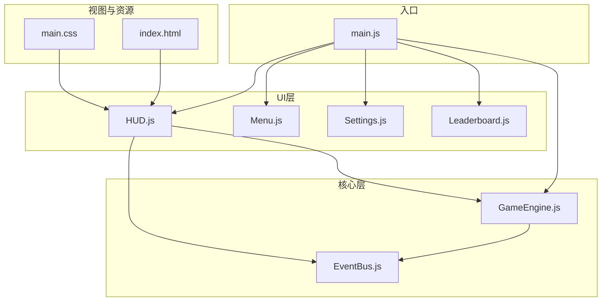
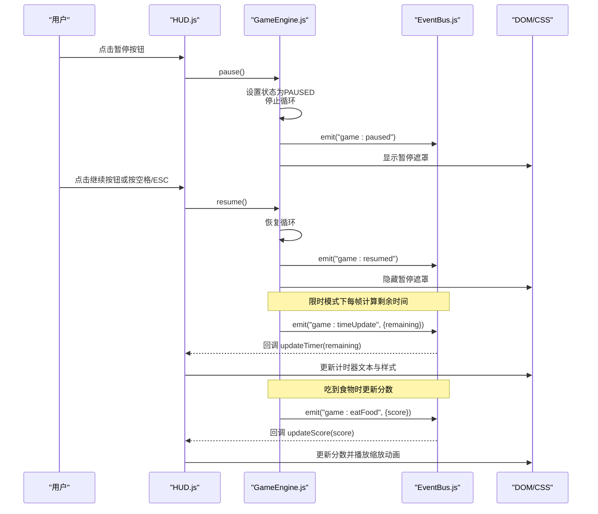
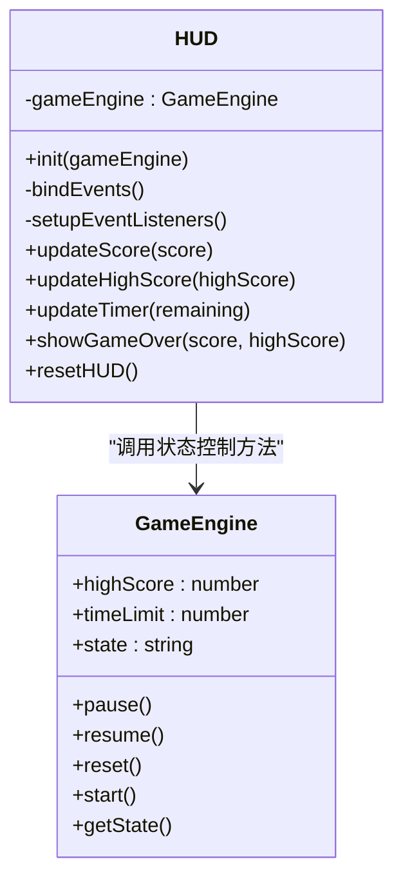
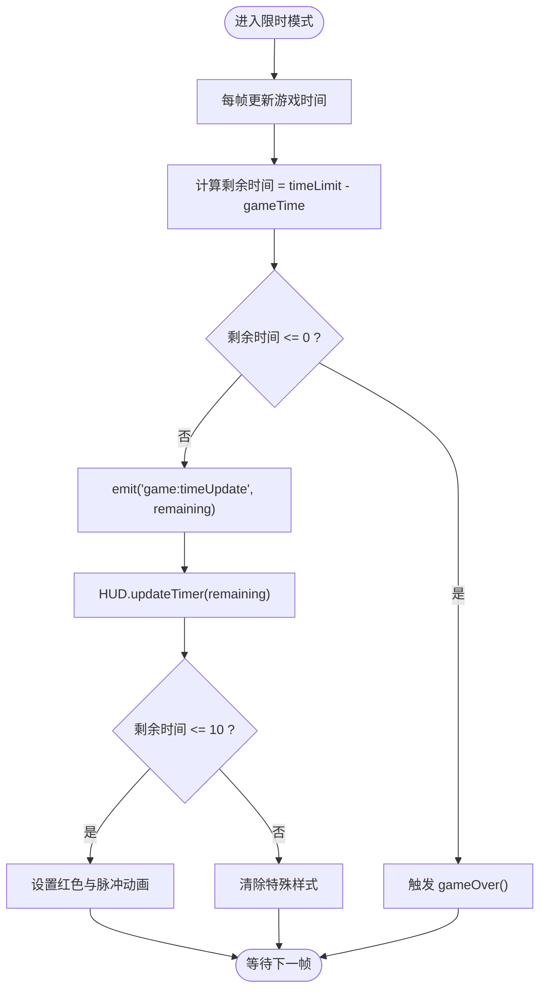
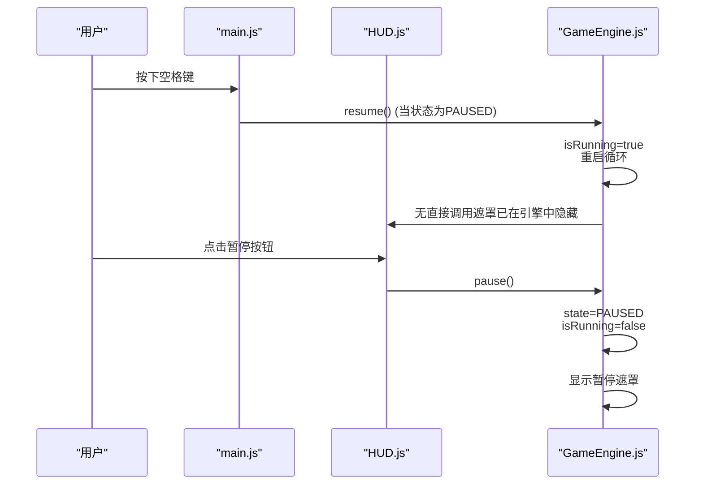
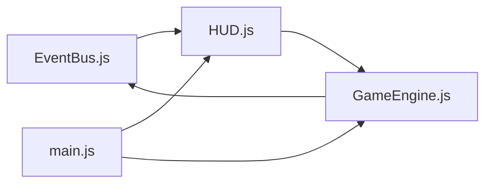

# 头部显示系统

<cite>
**本文引用的文件**
- [HUD.js](file://snake-game/js/ui/HUD.js)
- [GameEngine.js](file://snake-game/js/core/GameEngine.js)
- [EventBus.js](file://snake-game/js/utils/EventBus.js)
- [main.js](file://snake-game/js/main.js)
- [index.html](file://snake-game/index.html)
- [main.css](file://snake-game/css/main.css)
</cite>

## 目录
1. [简介](#简介)
2. [项目结构](#项目结构)
3. [核心组件](#核心组件)
4. [架构总览](#架构总览)
5. [详细组件分析](#详细组件分析)
6. [依赖关系分析](#依赖关系分析)
7. [性能考虑](#性能考虑)
8. [故障排查指南](#故障排查指南)
9. [结论](#结论)

## 简介
本文件聚焦于贪吃蛇游戏的头部显示系统（HUD），围绕实时信息展示、状态同步与交互体验展开，覆盖以下要点：
- 分数显示更新与动画反馈
- 计时器倒计时与限时模式提示
- 暂停/继续的用户交互（键盘快捷键、按钮、界面遮罩）
- HUD 与游戏引擎的数据同步机制（事件驱动）
- 性能优化策略（避免频繁 DOM 操作与重绘）

## 项目结构
与 HUD 相关的代码分布在 UI 层、核心引擎、事件总线与入口文件中。HTML 提供 HUD 的 DOM 节点，CSS 定义样式与动画。

图表来源
- [HUD.js:1-178](file://snake-game/js/ui/HUD.js#L1-L178)
- [GameEngine.js:1-800](file://snake-game/js/core/GameEngine.js#L1-L800)
- [EventBus.js:1-80](file://snake-game/js/utils/EventBus.js#L1-L80)
- [main.js:1-216](file://snake-game/js/main.js#L1-L216)
- [index.html:76-146](file://snake-game/index.html#L76-L146)
- [main.css:263-348](file://snake-game/css/main.css#L263-L348)

章节来源
- [index.html:76-146](file://snake-game/index.html#L76-L146)
- [main.css:263-348](file://snake-game/css/main.css#L263-L348)

## 核心组件
- HUD 模块：负责渲染分数、最高分、计时器，处理暂停/继续按钮与返回菜单逻辑，监听全局事件以更新界面。
- GameEngine：维护游戏状态、时间、分数等数据，通过事件总线向 HUD 推送更新。
- EventBus：发布/订阅机制，解耦 HUD 与 GameEngine。
- main.js：初始化各模块，绑定全局键盘与触摸事件，控制页面可见性变化时的自动暂停。
- index.html：提供 HUD 所需的 DOM 元素（分数、最高分、计时器、暂停遮罩、结束界面等）。
- main.css：定义 HUD 相关样式与动画（如分数缩放、计时器闪烁等）。

章节来源
- [HUD.js:1-178](file://snake-game/js/ui/HUD.js#L1-L178)
- [GameEngine.js:276-341](file://snake-game/js/core/GameEngine.js#L276-L341)
- [EventBus.js:1-80](file://snake-game/js/utils/EventBus.js#L1-L80)
- [main.js:36-76](file://snake-game/js/main.js#L36-L76)
- [index.html:76-146](file://snake-game/index.html#L76-L146)
- [main.css:290-348](file://snake-game/css/main.css#L290-L348)

## 架构总览
HUD 采用“事件驱动 + 单向数据流”的架构：GameEngine 在关键时机发布事件，HUD 订阅并更新对应 DOM；用户交互由 HUD 触发 GameEngine 的状态变更，再由 GameEngine 广播新状态，形成闭环。

图表来源
- [HUD.js:17-52](file://snake-game/js/ui/HUD.js#L17-L52)
- [GameEngine.js:592-621](file://snake-game/js/core/GameEngine.js#L592-L621)
- [GameEngine.js:300-341](file://snake-game/js/core/GameEngine.js#L300-L341)
- [EventBus.js:40-50](file://snake-game/js/utils/EventBus.js#L40-L50)
- [main.js:36-76](file://snake-game/js/main.js#L36-L76)

## 详细组件分析

### HUD 模块
职责与能力
- 初始化与事件绑定：绑定暂停、重新开始、返回菜单、继续按钮的点击事件。
- 事件监听：订阅 game:start、game:reset、game:highScore、game:eatFood、game:timeUpdate、game:over 等事件，驱动界面更新。
- 分数更新：更新当前分数并触发缩放动画。
- 最高分更新：同步最高分显示。
- 计时器更新：更新剩余时间并在低时间阈值内添加闪烁提醒。
- 游戏结束界面：显示最终得分与最高分，并提供重新开始与返回菜单操作。
- 重置 HUD：在游戏开始或重置时恢复初始状态。

关键实现路径
- 事件绑定与交互：[bindEvents:17-52](file://snake-game/js/ui/HUD.js#L17-L52)
- 事件监听注册：[setupEventListeners:57-87](file://snake-game/js/ui/HUD.js#L57-L87)
- 分数更新与动画：[updateScore:93-104](file://snake-game/js/ui/HUD.js#L93-L104)
- 最高分更新：[updateHighScore:110-112](file://snake-game/js/ui/HUD.js#L110-L112)
- 计时器更新与低时间提醒：[updateTimer:118-130](file://snake-game/js/ui/HUD.js#L118-L130)
- 游戏结束界面展示与按钮绑定：[showGameOver:137-158](file://snake-game/js/ui/HUD.js#L137-L158)
- HUD 重置：[resetHUD:163-171](file://snake-game/js/ui/HUD.js#L163-L171)

图表来源
- [HUD.js:1-178](file://snake-game/js/ui/HUD.js#L1-L178)
- [GameEngine.js:592-655](file://snake-game/js/core/GameEngine.js#L592-L655)

章节来源
- [HUD.js:1-178](file://snake-game/js/ui/HUD.js#L1-L178)

### 游戏引擎（GameEngine）与 HUD 的数据同步
- 分数变化：当蛇吃到食物时，引擎增加分数并通过事件总线广播 game:eatFood，HUD 收到后更新分数与动画。
- 计时器：在限时模式下，引擎每帧计算剩余时间并发布 game:timeUpdate，HUD 据此更新计时器文本与样式。
- 游戏结束：引擎保存最高分并发布 game:over，HUD 显示结束界面。
- 状态切换：pause/resume 改变引擎状态并显示/隐藏暂停遮罩，同时广播相应事件供其他模块响应。

关键实现路径
- 限时模式时间更新与广播：[update 中的时间逻辑:300-341](file://snake-game/js/core/GameEngine.js#L300-L341)
- 吃到食物广播分数：[eatFood:343-378](file://snake-game/js/core/GameEngine.js#L343-L378)
- 游戏结束广播与延迟显示：[gameOver:460-506](file://snake-game/js/core/GameEngine.js#L460-L506)
- 暂停/继续状态切换与遮罩控制：[pause/resume:592-621](file://snake-game/js/core/GameEngine.js#L592-L621)

图表来源
- [GameEngine.js:300-341](file://snake-game/js/core/GameEngine.js#L300-L341)
- [HUD.js:118-130](file://snake-game/js/ui/HUD.js#L118-L130)

章节来源
- [GameEngine.js:300-341](file://snake-game/js/core/GameEngine.js#L300-L341)
- [GameEngine.js:343-378](file://snake-game/js/core/GameEngine.js#L343-L378)
- [GameEngine.js:460-506](file://snake-game/js/core/GameEngine.js#L460-L506)
- [GameEngine.js:592-621](file://snake-game/js/core/GameEngine.js#L592-L621)
- [HUD.js:118-130](file://snake-game/js/ui/HUD.js#L118-L130)

### 暂停/继续功能与用户交互
- 键盘快捷键：
  - 游戏中按 ESC 暂停。
  - 暂停状态下按 ESC 或空格键继续。
- 按钮交互：
  - 暂停按钮：将游戏从 PLAYING 切换到 PAUSED。
  - 继续按钮：将游戏从 PAUSED 恢复到 PLAYING。
  - 返回菜单：若处于 PLAYING 则先暂停，确认后停止引擎并返回菜单；若处于 PAUSED 则恢复后再返回。
- 触摸手势识别：
  - 滑动屏幕用于方向控制（非暂停/继续）。
  - 虚拟方向键点击用于方向控制。
- 界面反馈：
  - 暂停遮罩显示“暂停”文字与继续按钮。
  - 计时器在低时间阈值内闪烁提醒。
  - 分数变化时出现缩放动画。

关键实现路径
- 键盘事件处理（暂停/继续）：[keydown 监听:36-76](file://snake-game/js/main.js#L36-L76)
- HUD 按钮事件绑定：[bindEvents:17-52](file://snake-game/js/ui/HUD.js#L17-L52)
- 暂停遮罩显示/隐藏：[pause/resume 中遮罩控制:592-621](file://snake-game/js/core/GameEngine.js#L592-L621)
- 移动端滑动与虚拟方向键：[touchstart/touchend 与 d-pad 绑定:78-163](file://snake-game/js/main.js#L78-L163)

图表来源
- [main.js:36-76](file://snake-game/js/main.js#L36-L76)
- [HUD.js:17-52](file://snake-game/js/ui/HUD.js#L17-L52)
- [GameEngine.js:592-621](file://snake-game/js/core/GameEngine.js#L592-L621)

章节来源
- [main.js:36-76](file://snake-game/js/main.js#L36-L76)
- [HUD.js:17-52](file://snake-game/js/ui/HUD.js#L17-L52)
- [GameEngine.js:592-621](file://snake-game/js/core/GameEngine.js#L592-L621)
- [main.js:78-163](file://snake-game/js/main.js#L78-L163)

### HUD 与 DOM/CSS 的联动
- DOM 节点：
  - 分数：current-score
  - 最高分：high-score
  - 计时器：timer-value
  - 暂停遮罩：pause-overlay
  - 游戏结束界面：gameover-screen 及其内部 final-score、final-high-score
- 样式与动画：
  - 分数缩放过渡：transform 与 transition
  - 计时器低时间闪烁：颜色与 animation
  - 遮罩背景与层级：overlay 类

关键实现路径
- HUD 对 DOM 的读写：[updateScore/updateTimer/showGameOver/resetHUD:93-171](file://snake-game/js/ui/HUD.js#L93-L171)
- 暂停遮罩显示/隐藏：[pause/resume 中遮罩控制:592-621](file://snake-game/js/core/GameEngine.js#L592-L621)
- CSS 变量与动画：[score-value/timer-value/overlay/pause-text:290-348](file://snake-game/css/main.css#L290-L348)

章节来源
- [HUD.js:93-171](file://snake-game/js/ui/HUD.js#L93-L171)
- [GameEngine.js:592-621](file://snake-game/js/core/GameEngine.js#L592-L621)
- [main.css:290-348](file://snake-game/css/main.css#L290-L348)

## 依赖关系分析
- HUD 依赖 GameEngine 的状态与方法（pause/resume/reset/start/getState/highScore/timeLimit）。
- HUD 通过 EventBus 订阅 GameEngine 发布的事件（game:eatFood、game:timeUpdate、game:over、game:start、game:reset、game:highScore）。
- main.js 作为入口，初始化所有模块并绑定全局输入事件，确保 HUD 与引擎协同工作。

图表来源
- [EventBus.js:1-80](file://snake-game/js/utils/EventBus.js#L1-L80)
- [HUD.js:1-178](file://snake-game/js/ui/HUD.js#L1-L178)
- [GameEngine.js:1-800](file://snake-game/js/core/GameEngine.js#L1-L800)
- [main.js:1-216](file://snake-game/js/main.js#L1-L216)

章节来源
- [EventBus.js:1-80](file://snake-game/js/utils/EventBus.js#L1-L80)
- [HUD.js:1-178](file://snake-game/js/ui/HUD.js#L1-L178)
- [GameEngine.js:1-800](file://snake-game/js/core/GameEngine.js#L1-L800)
- [main.js:1-216](file://snake-game/js/main.js#L1-L216)

## 性能考虑
为避免频繁的 DOM 操作与重绘，建议如下策略：
- 批量更新：在单次事件回调中合并多个 DOM 写入，减少布局抖动。例如在分数更新时仅修改 textContent 与 transform，避免多次读取样式。
- 使用 CSS 过渡与动画：利用 transform 与 opacity 提升合成性能，避免直接修改影响布局的属性（如 width/height/top/left）。
- 节流/防抖：对于高频事件（如计时器每秒更新），可结合 requestAnimationFrame 或节流函数降低更新频率。
- 条件渲染：仅在必要时显示/隐藏遮罩与面板，避免不必要的重排。
- 事件去重：在快速按键或触摸场景下，忽略重复输入，防止多余状态切换。
- 最小化样式变更：将样式变更集中在一次操作中，例如统一设置 color 与 animation，再一次性清空。

章节来源
- [HUD.js:93-104](file://snake-game/js/ui/HUD.js#L93-L104)
- [HUD.js:118-130](file://snake-game/js/ui/HUD.js#L118-L130)
- [main.css:290-348](file://snake-game/css/main.css#L290-L348)

## 故障排查指南
常见问题与定位思路
- 分数不更新：检查是否订阅了 game:eatFood 事件，以及 updateScore 是否被调用。
  - 参考路径：[setupEventListeners:57-87](file://snake-game/js/ui/HUD.js#L57-L87)、[updateScore:93-104](file://snake-game/js/ui/HUD.js#L93-L104)
- 计时器不显示或不闪烁：确认限时模式已启用，且 game:timeUpdate 事件正常发布；检查 timer-value 元素是否存在。
  - 参考路径：[updateTimer:118-130](file://snake-game/js/ui/HUD.js#L118-L130)、[GameEngine.update 时间逻辑:300-341](file://snake-game/js/core/GameEngine.js#L300-L341)
- 暂停无效或无法继续：检查 pause/resume 状态判断与遮罩显示逻辑；确认键盘事件是否正确触发。
  - 参考路径：[pause/resume:592-621](file://snake-game/js/core/GameEngine.js#L592-L621)、[keydown 监听:36-76](file://snake-game/js/main.js#L36-L76)
- 返回菜单后游戏仍运行：确认返回菜单前是否调用了 stop() 或 reset()，并正确隐藏游戏界面。
  - 参考路径：[HUD.bindEvents 返回菜单逻辑:32-46](file://snake-game/js/ui/HUD.js#L32-L46)

章节来源
- [HUD.js:57-87](file://snake-game/js/ui/HUD.js#L57-L87)
- [HUD.js:93-104](file://snake-game/js/ui/HUD.js#L93-L104)
- [HUD.js:118-130](file://snake-game/js/ui/HUD.js#L118-L130)
- [GameEngine.js:300-341](file://snake-game/js/core/GameEngine.js#L300-L341)
- [GameEngine.js:592-621](file://snake-game/js/core/GameEngine.js#L592-L621)
- [main.js:36-76](file://snake-game/js/main.js#L36-L76)
- [HUD.js:32-46](file://snake-game/js/ui/HUD.js#L32-L46)

## 结论
头部显示系统通过事件驱动的架构实现了 HUD 与游戏引擎的高效解耦与实时同步。分数动画、计时器闪烁与暂停遮罩为用户提供了清晰的反馈。借助合理的性能优化策略，可在保证流畅体验的同时避免不必要的重绘与布局抖动。建议在后续迭代中进一步引入批量更新与节流机制，以提升整体性能与稳定性。