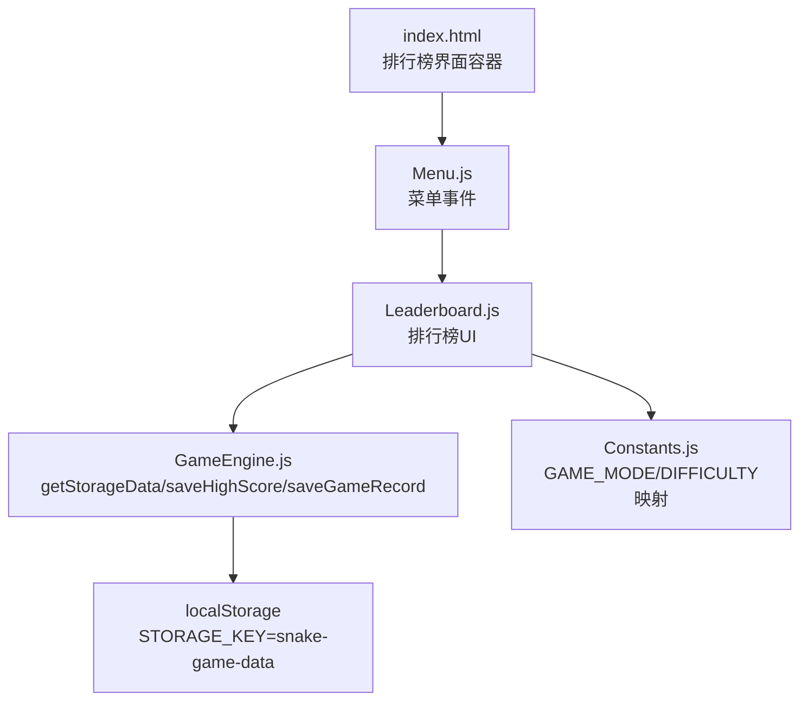
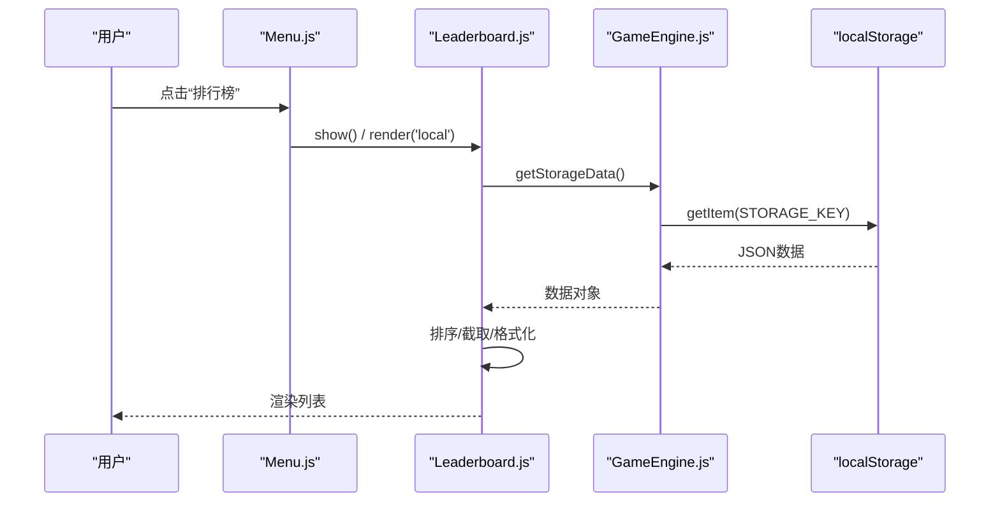
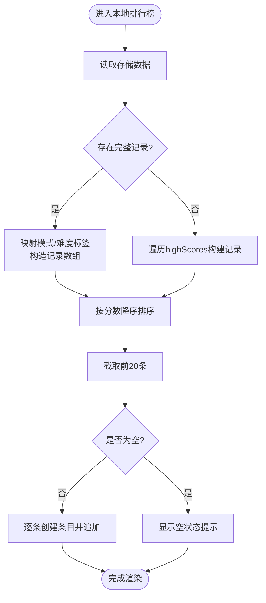
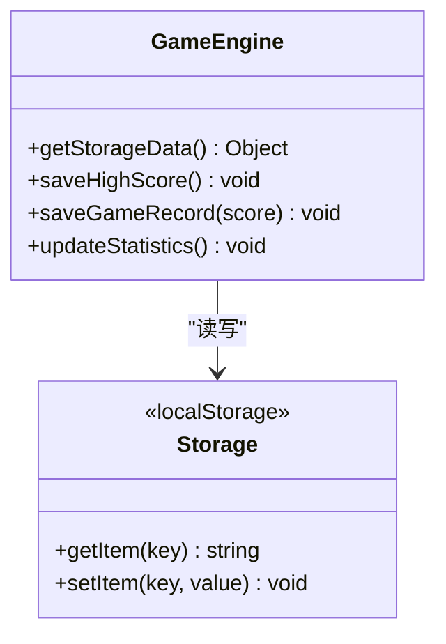
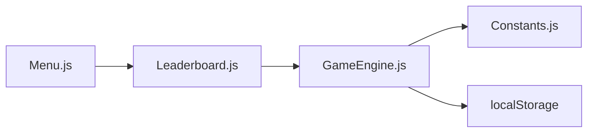
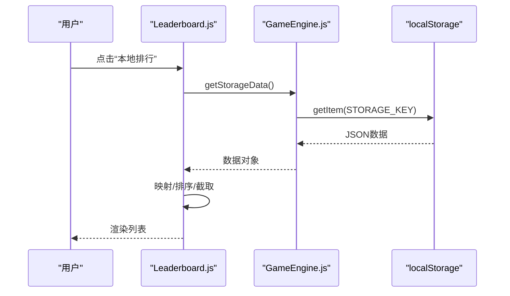

# 排行榜系统

<cite>
**本文引用的文件**   
- [index.html](file://snake-game/index.html)
- [Leaderboard.js](file://snake-game/js/ui/Leaderboard.js)
- [GameEngine.js](file://snake-game/js/core/GameEngine.js)
- [StorageManager.js](file://snake-game/js/data/StorageManager.js)
- [Constants.js](file://snake-game/js/utils/Constants.js)
- [Menu.js](file://snake-game/js/ui/Menu.js)
</cite>

## 目录
1. [简介](#简介)
2. [项目结构](#项目结构)
3. [核心组件](#核心组件)
4. [架构总览](#架构总览)
5. [详细组件分析](#详细组件分析)
6. [依赖关系分析](#依赖关系分析)
7. [性能与存储优化](#性能与存储优化)
8. [故障排查指南](#故障排查指南)
9. [结论](#结论)
10. [附录：数据模型与接口](#附录数据模型与接口)

## 简介
本文件为贪吃蛇游戏“排行榜系统”的UI组件文档，聚焦 Leaderboard 模块的本地数据存储、排名计算机制、榜单刷新逻辑与界面渲染。内容涵盖：
- 高分记录保存与排序算法实现
- 榜单刷新与Tab切换流程
- 玩家名称、分数、日期和时间戳格式化显示
- 按游戏模式（经典、限时）和难度级别的数据过滤能力说明与扩展建议
- 本地存储结构设计及查询优化策略
- 排行榜清空、数据导入导出与批量管理的功能设计与实现建议
- 响应式适配与移动端触摸交互优化建议

## 项目结构
排行榜相关代码位于前端脚本中，通过HTML页面挂载并加载。关键文件职责如下：
- index.html：包含排行榜界面的DOM结构与入口按钮
- js/ui/Leaderboard.js：排行榜UI模块，负责事件绑定、数据读取、排序与渲染
- js/core/GameEngine.js：游戏引擎，负责保存最高分与完整游戏记录，提供getStorageData等数据访问方法
- js/data/StorageManager.js：本地存储封装，提供通用存取、最高分读写、统计与清理等方法
- js/utils/Constants.js：全局常量，包括LocalStorage键名、游戏模式与难度定义
- js/ui/Menu.js：主菜单模块，点击“排行榜”后打开排行榜界面并触发渲染

图表来源
- [index.html:210-224](file://snake-game/index.html#L210-L224)
- [Menu.js:37-42](file://snake-game/js/ui/Menu.js#L37-L42)
- [Leaderboard.js:37-46](file://snake-game/js/ui/Leaderboard.js#L37-L46)
- [GameEngine.js:116-126](file://snake-game/js/core/GameEngine.js#L116-L126)
- [Constants.js:79-81](file://snake-game/js/utils/Constants.js#L79-L81)

章节来源
- [index.html:210-224](file://snake-game/index.html#L210-L224)
- [Menu.js:37-42](file://snake-game/js/ui/Menu.js#L37-L42)
- [Leaderboard.js:37-46](file://snake-game/js/ui/Leaderboard.js#L37-L46)
- [GameEngine.js:116-126](file://snake-game/js/core/GameEngine.js#L116-L126)
- [Constants.js:79-81](file://snake-game/js/utils/Constants.js#L79-L81)

## 核心组件
- Leaderboard（排行榜UI）
  - 初始化与事件绑定：返回按钮、Tab切换
  - 渲染逻辑：本地排行优先使用完整游戏记录；若无记录则回退到最高分数据
  - 排序：按分数降序，取前20条
  - 日期格式化：ISO字符串转为“月-日 时:分”，异常或空值显示“N/A”
  - 条目创建：排名徽章、信息行（模式·难度）、时间戳、分数
- GameEngine（游戏引擎）
  - getStorageData：从localStorage读取并解析数据对象
  - saveHighScore：按模式+难度维度更新最高分，并发出事件
  - saveGameRecord：保存完整游戏记录（含模式、难度、时间戳、蛇长度），限制最近100条
  - updateStatistics：累计游戏次数、时长、总分与最高分
- StorageManager（本地存储封装）
  - getData/saveData：统一JSON序列化与错误处理
  - getHighScore/saveHighScore：按模式+难度存取最高分
  - clearAll：清除所有数据
  - getStorageUsage：估算已用空间与配额
- Constants（常量）
  - STORAGE_KEY：localStorage键名
  - GAME_MODE/DIFFICULTY：模式与难度枚举

章节来源
- [Leaderboard.js:1-234](file://snake-game/js/ui/Leaderboard.js#L1-L234)
- [GameEngine.js:116-188](file://snake-game/js/core/GameEngine.js#L116-L188)
- [StorageManager.js:1-175](file://snake-game/js/data/StorageManager.js#L1-L175)
- [Constants.js:27-31](file://snake-game/js/utils/Constants.js#L27-L31)
- [Constants.js:21-25](file://snake-game/js/utils/Constants.js#L21-L25)
- [Constants.js:79-81](file://snake-game/js/utils/Constants.js#L79-L81)

## 架构总览
排行榜系统采用“UI层 + 引擎层 + 存储层”的分层设计：
- UI层（Leaderboard）：负责用户交互与列表渲染
- 引擎层（GameEngine）：负责业务数据生成与持久化（最高分、完整记录、统计）
- 存储层（localStorage + StorageManager）：负责数据存取与容错

图表来源
- [Menu.js:37-42](file://snake-game/js/ui/Menu.js#L37-L42)
- [Leaderboard.js:37-46](file://snake-game/js/ui/Leaderboard.js#L37-L46)
- [GameEngine.js:116-126](file://snake-game/js/core/GameEngine.js#L116-L126)
- [Constants.js:79-81](file://snake-game/js/utils/Constants.js#L79-L81)

## 详细组件分析

### Leaderboard 模块（排行榜UI）
- 初始化与事件
  - 绑定返回按钮：隐藏排行榜并回到主菜单
  - Tab切换：根据data-tab属性渲染本地或全球排行
- 本地排行榜渲染
  - 数据来源：优先使用完整游戏记录（gameRecords），否则回退到最高分（highScores）
  - 字段映射：将内部模式/难度键映射为中文标签
  - 排序：按score降序，仅展示前20条
  - 空状态：无数据时显示提示文案
- 全球排行榜渲染
  - 当前为模拟数据，最后一项插入当前玩家的最高分
- 日期格式化
  - ISO字符串转“MM-DD HH:mm”，异常或占位符返回“N/A”
- 条目构建
  - 动态创建节点，包含排名徽章、信息行（模式·难度）、可选时间戳、分数

图表来源
- [Leaderboard.js:52-118](file://snake-game/js/ui/Leaderboard.js#L52-L118)

章节来源
- [Leaderboard.js:16-31](file://snake-game/js/ui/Leaderboard.js#L16-L31)
- [Leaderboard.js:37-46](file://snake-game/js/ui/Leaderboard.js#L37-L46)
- [Leaderboard.js:52-118](file://snake-game/js/ui/Leaderboard.js#L52-L118)
- [Leaderboard.js:155-167](file://snake-game/js/ui/Leaderboard.js#L155-L167)
- [Leaderboard.js:177-213](file://snake-game/js/ui/Leaderboard.js#L177-L213)

### GameEngine 模块（数据写入与读取）
- 读取存储
  - getStorageData：安全解析localStorage中的JSON，失败返回空对象
- 最高分保存
  - saveHighScore：按模式+难度维度比较并更新，同时发出事件通知
- 完整记录保存
  - saveGameRecord：追加一条记录，包含模式、难度、时间戳、蛇长度；保留最近100条
- 统计更新
  - updateStatistics：累计游戏次数、时长、总分与最高分

图表来源
- [GameEngine.js:116-126](file://snake-game/js/core/GameEngine.js#L116-L126)
- [GameEngine.js:140-161](file://snake-game/js/core/GameEngine.js#L140-L161)
- [GameEngine.js:167-188](file://snake-game/js/core/GameEngine.js#L167-L188)
- [GameEngine.js:571-590](file://snake-game/js/core/GameEngine.js#L571-L590)

章节来源
- [GameEngine.js:116-126](file://snake-game/js/core/GameEngine.js#L116-L126)
- [GameEngine.js:140-161](file://snake-game/js/core/GameEngine.js#L140-L161)
- [GameEngine.js:167-188](file://snake-game/js/core/GameEngine.js#L167-L188)
- [GameEngine.js:571-590](file://snake-game/js/core/GameEngine.js#L571-L590)

### StorageManager 模块（本地存储封装）
- 通用存取
  - getData/saveData：统一JSON序列化与错误处理
- 最高分API
  - getHighScore/saveHighScore：按模式+难度存取最高分
- 其他功能
  - clearAll：清除所有数据
  - getStorageUsage：估算存储空间使用情况

章节来源
- [StorageManager.js:8-31](file://snake-game/js/data/StorageManager.js#L8-L31)
- [StorageManager.js:58-86](file://snake-game/js/data/StorageManager.js#L58-L86)
- [StorageManager.js:151-168](file://snake-game/js/data/StorageManager.js#L151-L168)

### 常量与配置（Constants）
- STORAGE_KEY：localStorage键名
- GAME_MODE：classic/timed/obstacle
- DIFFICULTY：easy/medium/hard（含速度、穿墙、障碍物数量等）

章节来源
- [Constants.js:27-31](file://snake-game/js/utils/Constants.js#L27-L31)
- [Constants.js:21-25](file://snake-game/js/utils/Constants.js#L21-L25)
- [Constants.js:79-81](file://snake-game/js/utils/Constants.js#L79-L81)

## 依赖关系分析
- Leaderboard 依赖 GameEngine 提供的 getStorageData 获取原始数据
- GameEngine 直接操作 localStorage，并通过常量 STORAGE_KEY 定位键名
- Menu 在点击“排行榜”时调用 Leaderboard.render 进行渲染
- Leaderboard 内部对模式与难度进行中文映射，便于展示

图表来源
- [Menu.js:37-42](file://snake-game/js/ui/Menu.js#L37-L42)
- [Leaderboard.js:37-46](file://snake-game/js/ui/Leaderboard.js#L37-L46)
- [GameEngine.js:116-126](file://snake-game/js/core/GameEngine.js#L116-L126)
- [Constants.js:79-81](file://snake-game/js/utils/Constants.js#L79-L81)

章节来源
- [Menu.js:37-42](file://snake-game/js/ui/Menu.js#L37-L42)
- [Leaderboard.js:37-46](file://snake-game/js/ui/Leaderboard.js#L37-L46)
- [GameEngine.js:116-126](file://snake-game/js/core/GameEngine.js#L116-L126)
- [Constants.js:79-81](file://snake-game/js/utils/Constants.js#L79-L81)

## 性能与存储优化
- 排序与切片
  - 本地排行榜先排序再截取前20，避免不必要的DOM渲染开销
- 记录上限
  - 完整记录限制最近100条，控制localStorage体积增长
- 容错与健壮性
  - 读取JSON失败时返回空对象，避免崩溃
  - 日期格式化捕获异常，降级为“N/A”
- 存储估算
  - 提供存储空间使用率估算，便于监控与清理策略

章节来源
- [Leaderboard.js:73-100](file://snake-game/js/ui/Leaderboard.js#L73-L100)
- [GameEngine.js:182-188](file://snake-game/js/core/GameEngine.js#L182-L188)
- [GameEngine.js:116-126](file://snake-game/js/core/GameEngine.js#L116-L126)
- [Leaderboard.js:155-167](file://snake-game/js/ui/Leaderboard.js#L155-L167)
- [StorageManager.js:159-168](file://snake-game/js/data/StorageManager.js#L159-L168)

## 故障排查指南
- 排行榜无数据
  - 检查是否已完成至少一局游戏以产生记录或最高分
  - 确认localStorage未被浏览器清理或禁用
- 日期显示异常
  - 检查ISO字符串格式是否正确，异常将显示“N/A”
- 数据未持久化
  - 检查saveHighScore/saveGameRecord是否被调用
  - 确认STORAGE_KEY一致且localStorage可用
- 存储空间不足
  - 使用getStorageUsage评估占用，必要时清理历史数据

章节来源
- [Leaderboard.js:155-167](file://snake-game/js/ui/Leaderboard.js#L155-L167)
- [GameEngine.js:140-161](file://snake-game/js/core/GameEngine.js#L140-L161)
- [GameEngine.js:167-188](file://snake-game/js/core/GameEngine.js#L167-L188)
- [StorageManager.js:151-168](file://snake-game/js/data/StorageManager.js#L151-L168)

## 结论
排行榜系统通过清晰的UI-引擎-存储分层实现了可靠的本地数据管理与展示。Leaderboard模块专注于渲染与交互，GameEngine负责数据生产与持久化，StorageManager提供统一的存储抽象。当前实现支持按分数排序、前20条展示、日期格式化与空状态提示。后续可在此基础上扩展分类筛选、数据导入导出与批量管理等高级功能。

## 附录：数据模型与接口

### 本地存储数据结构（摘要）
- highScores：{ [mode]: { [difficulty]: score } }
- gameRecords：[{ score, mode, difficulty, timeLimit, date, snakeLength }]
- statistics：{ totalGames, totalPlayTime, maxScore, totalScore }
- settings：默认设置合并后的用户设置
- achievements：成就ID列表

章节来源
- [GameEngine.js:140-161](file://snake-game/js/core/GameEngine.js#L140-L161)
- [GameEngine.js:167-188](file://snake-game/js/core/GameEngine.js#L167-L188)
- [GameEngine.js:571-590](file://snake-game/js/core/GameEngine.js#L571-L590)
- [StorageManager.js:37-50](file://snake-game/js/data/StorageManager.js#L37-L50)
- [StorageManager.js:101-119](file://snake-game/js/data/StorageManager.js#L101-L119)

### 排行榜渲染流程（序列图）

图表来源
- [Leaderboard.js:37-46](file://snake-game/js/ui/Leaderboard.js#L37-L46)
- [GameEngine.js:116-126](file://snake-game/js/core/GameEngine.js#L116-L126)
- [Constants.js:79-81](file://snake-game/js/utils/Constants.js#L79-L81)

### 分类筛选与批量管理（扩展建议）
- 分类筛选
  - 建议在Leaderboard.renderLocalLeaderboard中增加mode与difficulty过滤参数，并在UI增加下拉或复选框控件
  - 过滤后重新执行排序与截取，保持前20条展示
- 数据导入导出
  - 导出：将storage数据序列化为JSON并提供下载
  - 导入：读取用户上传的JSON文件，校验结构后覆盖或合并至现有数据
- 批量管理
  - 清空：调用clearAll或仅删除gameRecords/highScores
  - 批量删除：按模式/难度/时间段批量移除记录
  - 去重与校验：导入时对重复记录与非法字段进行处理

[本节为概念性扩展建议，不直接分析具体源码文件]