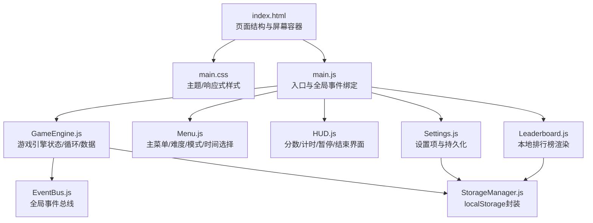
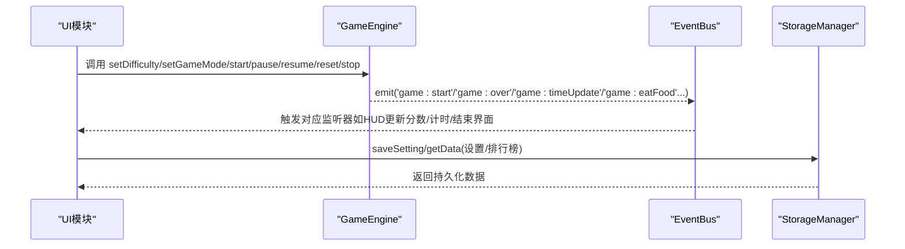
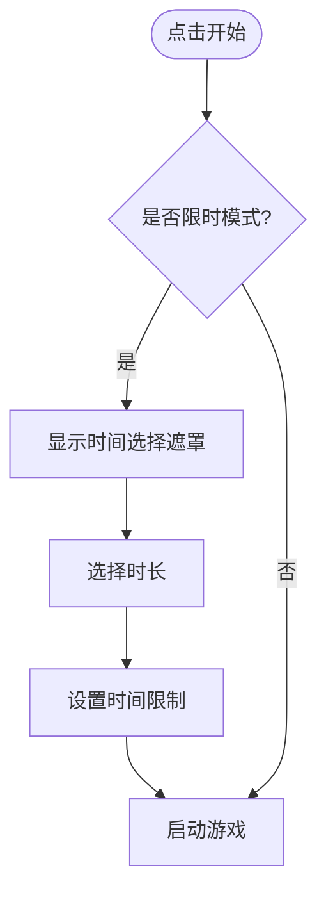
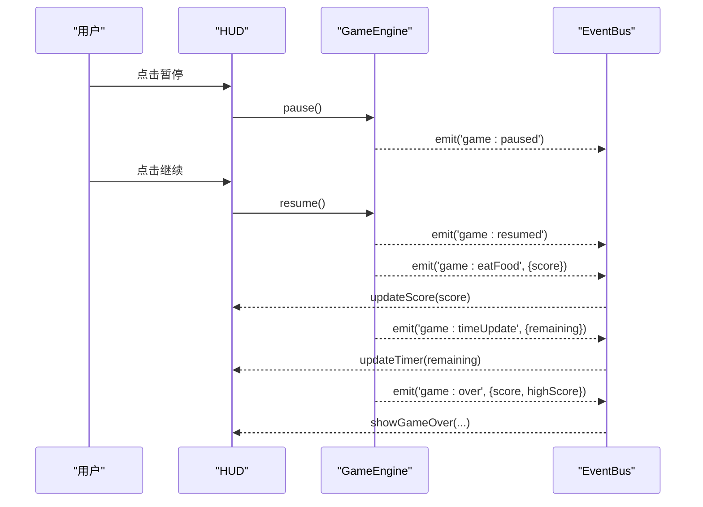
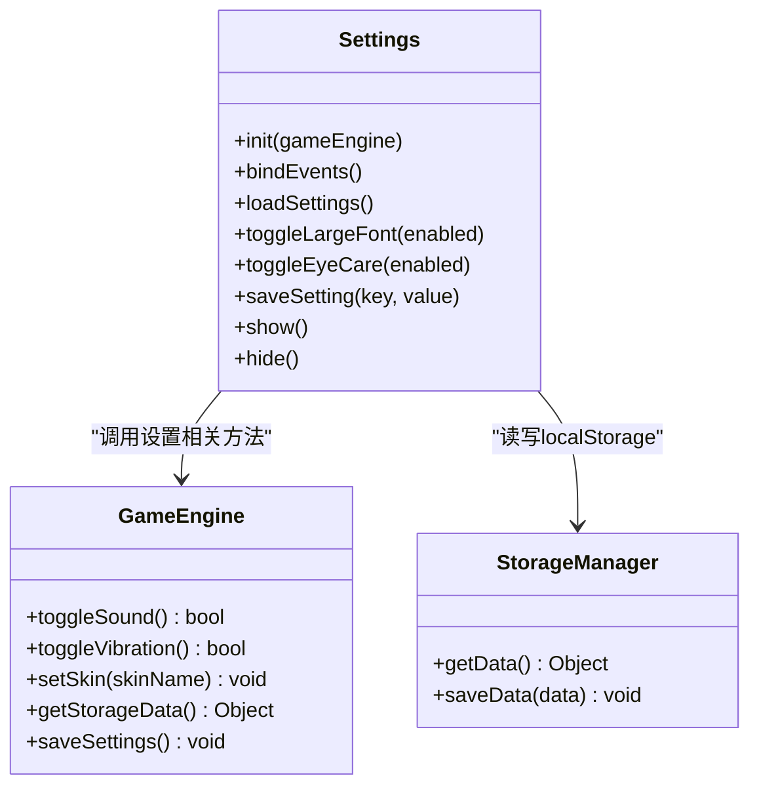
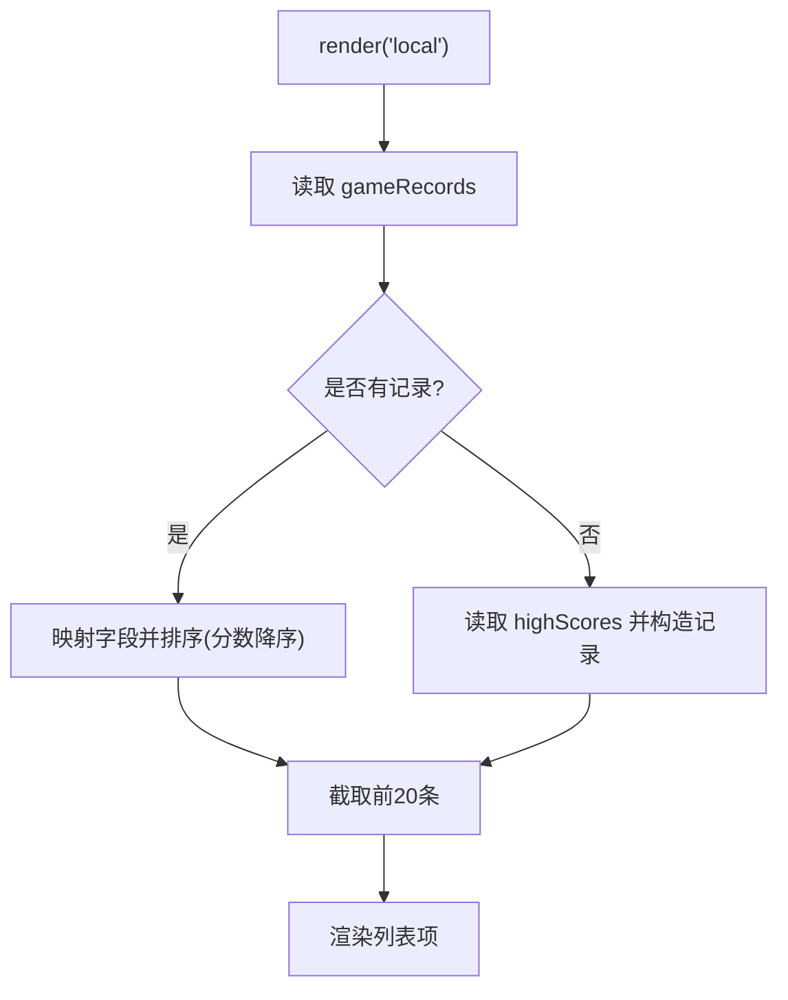
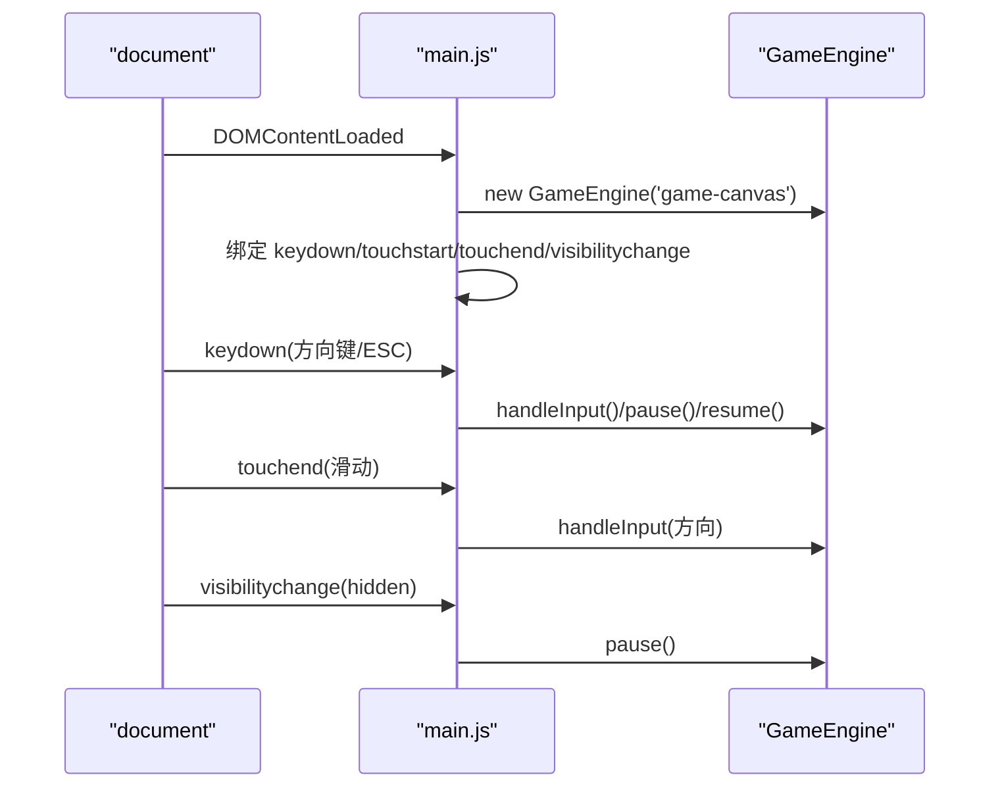
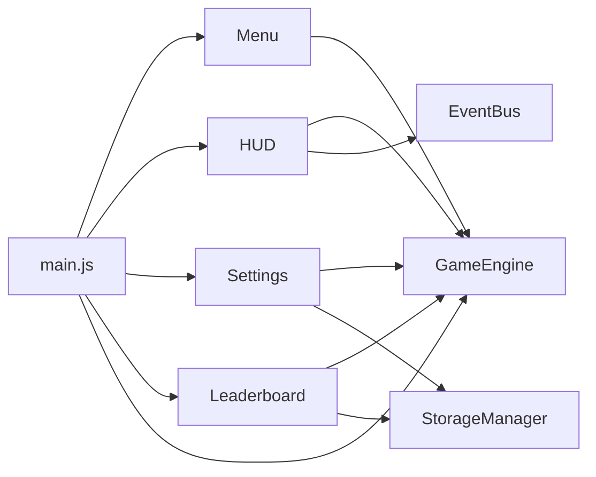

# 用户界面系统

<cite>
**本文引用的文件**   
- [index.html](file://snake-game/index.html)
- [Menu.js](file://snake-game/js/ui/Menu.js)
- [HUD.js](file://snake-game/js/ui/HUD.js)
- [Settings.js](file://snake-game/js/ui/Settings.js)
- [Leaderboard.js](file://snake-game/js/ui/Leaderboard.js)
- [GameEngine.js](file://snake-game/js/core/GameEngine.js)
- [EventBus.js](file://snake-game/js/utils/EventBus.js)
- [StorageManager.js](file://snake-game/js/data/StorageManager.js)
- [main.js](file://snake-game/js/main.js)
- [main.css](file://snake-game/css/main.css)
</cite>

## 更新摘要
**变更内容**   
- 文档已更新为历史项目状态，保留UI组件设计模式与事件驱动通信机制的前端开发参考价值
- 重点分析Menu菜单系统、HUD显示系统、Settings设置界面、Leaderboard排行榜等核心UI组件
- 强调模块化架构、事件总线通信、本地存储持久化等前端最佳实践
- 提供响应式设计实现、触摸事件处理、键盘事件绑定等技术细节

## 目录
1. [简介](#简介)
2. [项目结构](#项目结构)
3. [核心组件](#核心组件)
4. [架构总览](#架构总览)
5. [详细组件分析](#详细组件分析)
6. [依赖关系分析](#依赖关系分析)
7. [性能与可访问性](#性能与可访问性)
8. [故障排查指南](#故障排查指南)
9. [结论](#结论)
10. [附录](#附录)

## 简介
本文件面向贪吃蛇游戏的用户界面系统，聚焦以下模块：
- Menu 菜单系统：主菜单、难度选择、游戏模式切换、限时时间选择等界面逻辑。
- HUD 显示系统：实时分数、最高分、计时器展示与暂停交互。
- Settings 设置界面：音效开关、震动反馈、皮肤选择、语言、大字体、护眼模式等配置管理。
- Leaderboard 排行榜系统：本地存储的数据持久化机制与数据渲染。
- 前端交互技术：响应式设计、触摸事件处理、键盘事件绑定。

目标是帮助开发者快速理解UI组件的职责边界、数据流、事件总线通信以及本地存储策略，并提供可视化图示和排障建议。

## 项目结构
UI系统由多个独立模块组成，通过全局事件总线进行解耦通信，HTML负责页面结构与屏幕切换，CSS提供主题与响应式样式，JS负责交互与状态更新。

**图表来源**
- [index.html:1-297](file://snake-game/index.html#L1-L297)
- [main.js:1-216](file://snake-game/js/main.js#L1-L216)
- [GameEngine.js:1-888](file://snake-game/js/core/GameEngine.js#L1-L888)
- [Menu.js:1-183](file://snake-game/js/ui/Menu.js#L1-L183)
- [HUD.js:1-178](file://snake-game/js/ui/HUD.js#L1-L178)
- [Settings.js:1-154](file://snake-game/js/ui/Settings.js#L1-L154)
- [Leaderboard.js:1-234](file://snake-game/js/ui/Leaderboard.js#L1-L234)
- [EventBus.js:1-80](file://snake-game/js/utils/EventBus.js#L1-L80)
- [StorageManager.js:1-175](file://snake-game/js/data/StorageManager.js#L1-L175)
- [main.css:1-847](file://snake-game/css/main.css#L1-L847)

**章节来源**
- [index.html:1-297](file://snake-game/index.html#L1-L297)
- [main.js:1-216](file://snake-game/js/main.js#L1-L216)

## 核心组件
- Menu：负责主菜单的初始化、事件绑定、难度与模式切换、限时时间选择弹窗、界面显隐控制。
- HUD：负责游戏内信息面板（分数、最高分、计时器）、暂停/继续、返回菜单、游戏结束界面渲染。
- Settings：负责设置项的加载、变更、保存至本地存储，并应用大字体与护眼模式。
- Leaderboard：负责本地排行榜数据的读取、排序、格式化与列表渲染，支持"本地排行"与"全球排行"Tab切换。
- GameEngine：作为状态机与数据源，暴露方法供UI调用，并通过事件总线广播关键状态变化。
- EventBus：发布订阅模型，用于模块间松耦合通信。
- StorageManager：对localStorage的读写封装，提供设置、最高分、成就、统计等存取接口。
- main.js：入口脚本，初始化各模块，绑定键盘、触摸、虚拟方向键、页面可见性等全局交互。

**章节来源**
- [Menu.js:1-183](file://snake-game/js/ui/Menu.js#L1-L183)
- [HUD.js:1-178](file://snake-game/js/ui/HUD.js#L1-L178)
- [Settings.js:1-154](file://snake-game/js/ui/Settings.js#L1-L154)
- [Leaderboard.js:1-234](file://snake-game/js/ui/Leaderboard.js#L1-L234)
- [GameEngine.js:1-888](file://snake-game/js/core/GameEngine.js#L1-L888)
- [EventBus.js:1-80](file://snake-game/js/utils/EventBus.js#L1-L80)
- [StorageManager.js:1-175](file://snake-game/js/data/StorageManager.js#L1-L175)
- [main.js:1-216](file://snake-game/js/main.js#L1-L216)

## 架构总览
UI层通过事件总线与GameEngine协作，避免直接紧耦合；设置与排行榜通过StorageManager持久化到localStorage。

**图表来源**
- [GameEngine.js:220-341](file://snake-game/js/core/GameEngine.js#L220-L341)
- [HUD.js:57-87](file://snake-game/js/ui/HUD.js#L57-L87)
- [Settings.js:126-133](file://snake-game/js/ui/Settings.js#L126-L133)
- [Leaderboard.js:52-118](file://snake-game/js/ui/Leaderboard.js#L52-L118)
- [EventBus.js:40-50](file://snake-game/js/utils/EventBus.js#L40-L50)

## 详细组件分析

### Menu 菜单系统
职责与流程
- 初始化时绑定开始、设置、排行榜、帮助按钮事件，并加载当前设置以高亮选中项。
- 难度与模式按钮点击后，更新GameEngine的状态，并根据模式动态显示/隐藏限时时间选择区域。
- 限时模式下，点击开始会弹出ready-overlay中的时间选择，选择后设置时间限制并启动游戏。
- 提供show/hide方法控制菜单屏幕显隐。

交互要点
- 难度/模式按钮使用data属性传递值，统一通过GameEngine的方法更新状态。
- 限时时间选择通过动态创建按钮并绑定click事件，选择后关闭遮罩并启动游戏。
- 与HUD联动：在限时模式下显示顶部计时器。

**图表来源**
- [Menu.js:17-79](file://snake-game/js/ui/Menu.js#L17-L79)
- [Menu.js:85-137](file://snake-game/js/ui/Menu.js#L85-L137)
- [index.html:50-72](file://snake-game/index.html#L50-L72)

**章节来源**
- [Menu.js:1-183](file://snake-game/js/ui/Menu.js#L1-L183)
- [index.html:12-74](file://snake-game/index.html#L12-L74)

### HUD 显示系统
职责与流程
- 初始化时绑定暂停、重新开始、返回菜单、继续按钮事件。
- 订阅事件总线，根据游戏事件实时更新分数、最高分、计时器，并在游戏结束时渲染结束界面。
- 提供resetHUD方法重置所有显示元素。

交互要点
- 暂停按钮仅在PLAYING状态下生效。
- 返回菜单前提示确认，确认后停止引擎并回到菜单；若处于PAUSED则恢复后再退出。
- 计时器在剩余时间<=10秒时闪烁提醒。

**图表来源**
- [HUD.js:17-87](file://snake-game/js/ui/HUD.js#L17-L87)
- [HUD.js:93-171](file://snake-game/js/ui/HUD.js#L93-L171)
- [GameEngine.js:276-341](file://snake-game/js/core/GameEngine.js#L276-L341)

**章节来源**
- [HUD.js:1-178](file://snake-game/js/ui/HUD.js#L1-L178)
- [index.html:76-146](file://snake-game/index.html#L76-L146)

### Settings 设置界面
职责与流程
- 初始化时绑定返回、音效、震动、皮肤、语言、大字体、护眼模式等控件事件。
- 加载当前设置到UI控件，并在变更时调用GameEngine相应方法并保存到本地存储。
- 提供toggleLargeFont/toggleEyeCare方法通过body属性切换样式。

交互要点
- 音效/震动开关通过GameEngine.toggleSound/toggleVibration切换并回写checkbox状态。
- 皮肤选择通过GameEngine.setSkin即时生效并持久化。
- 大字体/护眼模式通过body属性切换，配合CSS变量实现主题切换。

**图表来源**
- [Settings.js:1-154](file://snake-game/js/ui/Settings.js#L1-L154)
- [GameEngine.js:803-817](file://snake-game/js/core/GameEngine.js#L803-L817)
- [StorageManager.js:1-175](file://snake-game/js/data/StorageManager.js#L1-L175)

**章节来源**
- [Settings.js:1-154](file://snake-game/js/ui/Settings.js#L1-L154)
- [index.html:148-207](file://snake-game/index.html#L148-L207)
- [main.css:23-32](file://snake-game/css/main.css#L23-L32)

### Leaderboard 排行榜系统
职责与流程
- 初始化时绑定返回与Tab切换事件。
- render(tab)根据tab类型渲染本地或全球排行榜。
- 本地排行榜优先读取完整游戏记录（含模式、难度、日期、蛇长度），按分数降序排列，最多取前20条；若无记录则回退到最高分数据。
- 全球排行榜为模拟数据，包含玩家名、分数、模式等信息。
- 提供createLeaderboardItem与formatDate辅助方法。

数据持久化
- 使用GameEngine.getStorageData获取本地数据，其中包含highScores与gameRecords。
- GameEngine.saveHighScore/saveGameRecord维护最高分与完整记录。

**图表来源**
- [Leaderboard.js:37-118](file://snake-game/js/ui/Leaderboard.js#L37-L118)
- [GameEngine.js:140-188](file://snake-game/js/core/GameEngine.js#L140-L188)

**章节来源**
- [Leaderboard.js:1-234](file://snake-game/js/ui/Leaderboard.js#L1-L234)
- [index.html:209-224](file://snake-game/index.html#L209-L224)

### 前端交互技术细节
- 键盘事件：在main.js中监听keydown，仅在游戏PLAYING状态处理方向键与WASD，ESC暂停，空格在PAUSED时恢复。
- 触摸事件：touchstart/touchend计算滑动方向与最小距离阈值，驱动方向输入；虚拟方向键同时绑定click与touchstart，防止长按菜单弹出。
- 页面可见性：visibilitychange时自动暂停，提升多标签页体验。
- 响应式设计：CSS使用flex布局、变量与媒体适配，Canvas尺寸在GameEngine.resizeCanvas中自适应容器并保持网格对齐。

**图表来源**
- [main.js:36-170](file://snake-game/js/main.js#L36-L170)
- [GameEngine.js:769-821](file://snake-game/js/core/GameEngine.js#L769-L821)

**章节来源**
- [main.js:1-216](file://snake-game/js/main.js#L1-L216)
- [main.css:254-314](file://snake-game/css/main.css#L254-L314)

## 依赖关系分析
- UI模块均依赖GameEngine提供的状态与方法，但不直接操作DOM以外的业务逻辑。
- HUD与Menu通过EventBus订阅游戏事件，实现低耦合更新。
- Settings与Leaderboard通过StorageManager或直接调用GameEngine的存储方法完成持久化。
- main.js作为入口协调初始化顺序与全局事件绑定。

**图表来源**
- [Menu.js:1-183](file://snake-game/js/ui/Menu.js#L1-L183)
- [HUD.js:1-178](file://snake-game/js/ui/HUD.js#L1-L178)
- [Settings.js:1-154](file://snake-game/js/ui/Settings.js#L1-L154)
- [Leaderboard.js:1-234](file://snake-game/js/ui/Leaderboard.js#L1-L234)
- [main.js:1-216](file://snake-game/js/main.js#L1-L216)

**章节来源**
- [EventBus.js:1-80](file://snake-game/js/utils/EventBus.js#L1-L80)
- [StorageManager.js:1-175](file://snake-game/js/data/StorageManager.js#L1-L175)

## 性能与可访问性
- Canvas自适应：GameEngine在容器尺寸变化时延迟调整，避免在隐藏容器中计算导致尺寸异常。
- 动画与过渡：HUD分数增加与计时器不足时的视觉反馈使用CSS过渡与动画，注意在低端设备上减少复杂动画。
- 事件节流：resize使用防抖函数，降低频繁重绘开销。
- 可访问性：大字体与护眼模式通过body属性切换，便于辅助工具识别；按钮具备明确的语义与焦点行为。

## 故障排查指南
常见问题与建议
- 菜单无法切换到限时时间选择：检查Menu中模式按钮的事件绑定与time-selector显示逻辑，确保data-mode="timed"时正确显示。
- 计时器未更新：确认GameEngine在限时模式下emit('game:timeUpdate')且HUD已订阅该事件。
- 返回菜单后游戏仍运行：确保HUD返回菜单调用的是stop()而非destroy()，保持引擎可重用。
- 设置未持久化：检查Settings.saveSetting是否正确写入localStorage，并确认StorageManager.getData/saveData无异常。
- 排行榜为空：确认GameEngine.saveGameRecord在gameOver时被调用，且Leaderboard.renderLocalLeaderboard能读取gameRecords。

**章节来源**
- [Menu.js:59-79](file://snake-game/js/ui/Menu.js#L59-L79)
- [HUD.js:31-46](file://snake-game/js/ui/HUD.js#L31-L46)
- [GameEngine.js:460-506](file://snake-game/js/core/GameEngine.js#L460-L506)
- [Settings.js:126-133](file://snake-game/js/ui/Settings.js#L126-L133)
- [Leaderboard.js:52-118](file://snake-game/js/ui/Leaderboard.js#L52-L118)

## 结论
UI系统采用模块化设计与事件总线通信，清晰分离了界面交互与游戏逻辑。Menu负责导航与参数配置，HUD负责实时信息展示与用户控制，Settings提供个性化配置与持久化，Leaderboard基于本地存储呈现历史成绩。结合响应式CSS与完善的键盘/触摸事件处理，整体具备良好的用户体验与可维护性。

## 附录
- 屏幕与容器：index.html定义了menu-screen、game-screen、gameover-screen、settings-screen、leaderboard-screen等容器，通过active类控制显隐。
- 样式主题：main.css定义CSS变量与主题切换，支持护眼与大字体模式。
- 入口初始化：main.js按顺序初始化各模块并绑定全局事件，确保UI与引擎协同工作。

**章节来源**
- [index.html:12-276](file://snake-game/index.html#L12-L276)
- [main.css:1-847](file://snake-game/css/main.css#L1-L847)
- [main.js:1-216](file://snake-game/js/main.js#L1-L216)