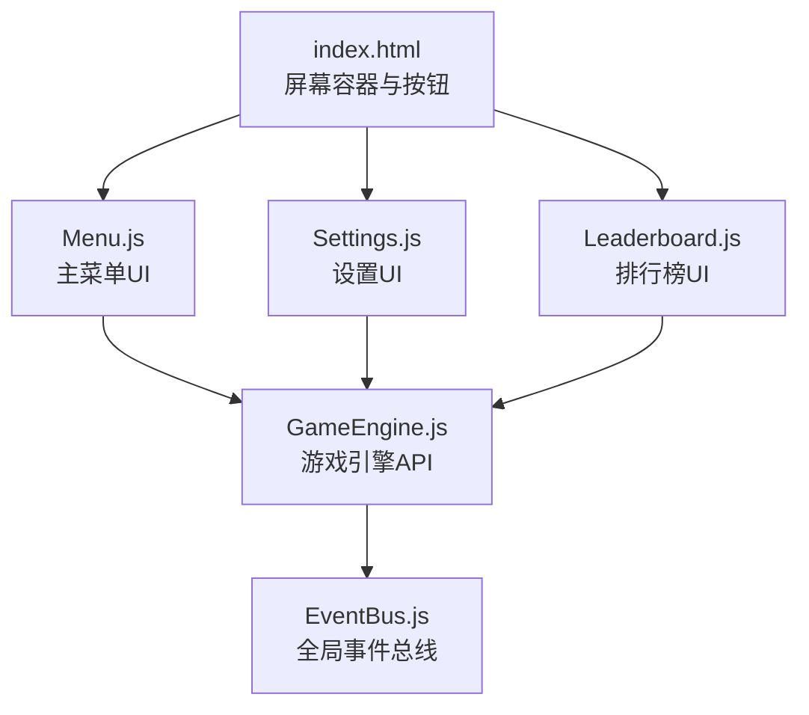
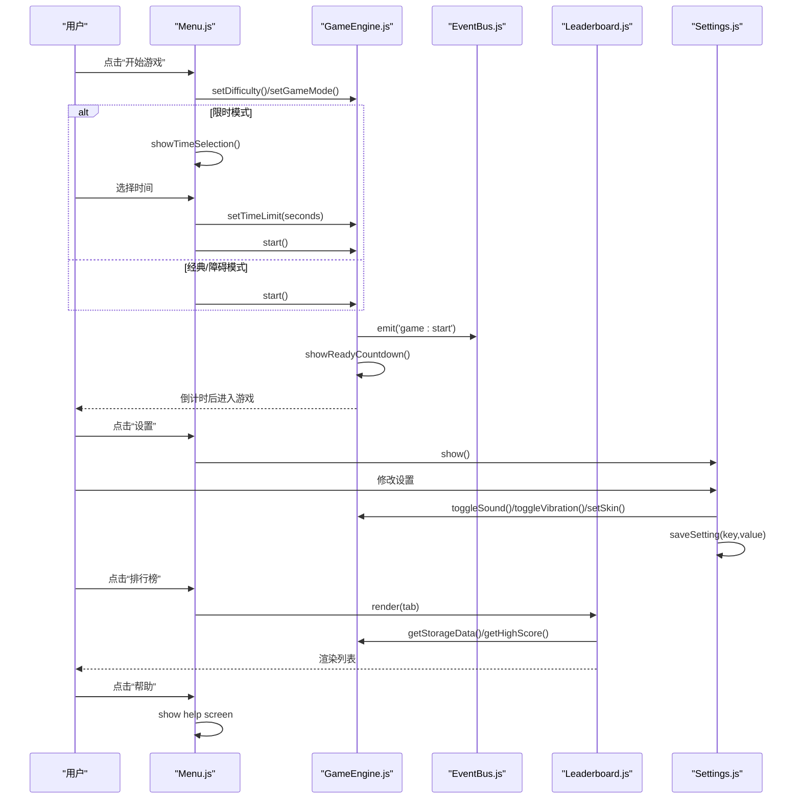
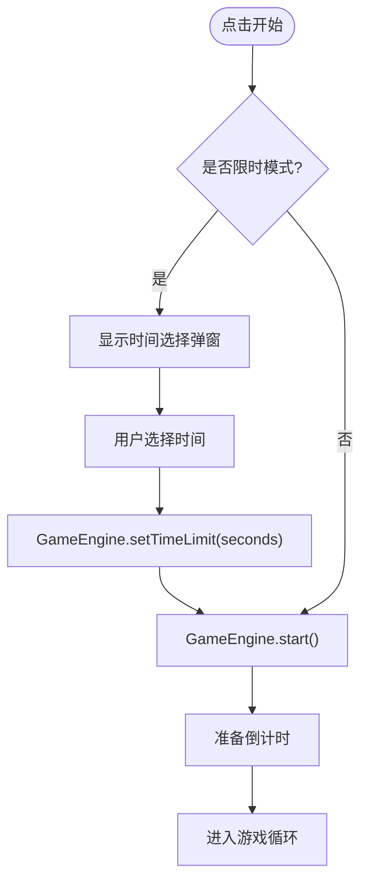
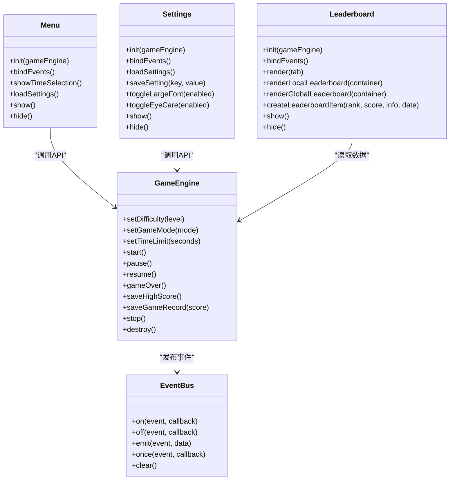

# 菜单系统

<cite>
**本文引用的文件**   
- [index.html](file://snake-game/index.html)
- [Menu.js](file://snake-game/js/ui/Menu.js)
- [Settings.js](file://snake-game/js/ui/Settings.js)
- [Leaderboard.js](file://snake-game/js/ui/Leaderboard.js)
- [GameEngine.js](file://snake-game/js/core/GameEngine.js)
- [EventBus.js](file://snake-game/js/utils/EventBus.js)
</cite>

## 目录
1. [简介](#简介)
2. [项目结构](#项目结构)
3. [核心组件](#核心组件)
4. [架构总览](#架构总览)
5. [详细组件分析](#详细组件分析)
6. [依赖关系分析](#依赖关系分析)
7. [性能与优化](#性能与优化)
8. [故障排查指南](#故障排查指南)
9. [结论](#结论)

## 简介
本文件聚焦于贪吃蛇游戏的菜单系统，围绕 Menu 模块的设计与实现展开，覆盖主菜单初始化、事件绑定机制、界面切换逻辑、游戏开始按钮处理流程（难度选择、模式切换、限时时间选择）、设置页跳转、排行榜访问、帮助文档显示等导航功能。同时给出事件监听器管理、DOM 操作优化和状态同步的技术细节说明，帮助读者快速理解并扩展菜单系统。

## 项目结构
菜单系统由 HTML 页面结构与多个 UI 模块组成：
- index.html 提供所有屏幕容器与按钮元素，作为菜单系统的宿主。
- js/ui/Menu.js 负责主菜单的初始化、事件绑定、界面切换与限时模式的时间选择弹窗。
- js/ui/Settings.js 负责设置页面的交互与本地存储持久化。
- js/ui/Leaderboard.js 负责排行榜渲染与返回导航。
- js/core/GameEngine.js 提供游戏引擎能力（难度、模式、计时、启动/暂停/结束、设置读写）。
- js/utils/EventBus.js 提供全局事件总线用于跨模块通信。

图表来源
- [index.html:12-74](file://snake-game/index.html#L12-L74)
- [Menu.js:1-183](file://snake-game/js/ui/Menu.js#L1-L183)
- [Settings.js:1-154](file://snake-game/js/ui/Settings.js#L1-L154)
- [Leaderboard.js:1-234](file://snake-game/js/ui/Leaderboard.js#L1-L234)
- [GameEngine.js:1-888](file://snake-game/js/core/GameEngine.js#L1-L888)
- [EventBus.js:1-80](file://snake-game/js/utils/EventBus.js#L1-L80)

章节来源
- [index.html:12-74](file://snake-game/index.html#L12-L74)
- [Menu.js:1-183](file://snake-game/js/ui/Menu.js#L1-L183)
- [Settings.js:1-154](file://snake-game/js/ui/Settings.js#L1-L154)
- [Leaderboard.js:1-234](file://snake-game/js/ui/Leaderboard.js#L1-L234)
- [GameEngine.js:1-888](file://snake-game/js/core/GameEngine.js#L1-L888)
- [EventBus.js:1-80](file://snake-game/js/utils/EventBus.js#L1-L80)

## 核心组件
- Menu 模块
  - 职责：主菜单初始化、事件绑定、界面切换、限时模式时间选择弹窗、加载当前设置到UI。
  - 关键方法：init、bindEvents、showTimeSelection、loadSettings、show/hide。
- Settings 模块
  - 职责：设置页交互、本地存储读写、主题与字体切换。
  - 关键方法：init、bindEvents、loadSettings、saveSetting、toggleLargeFont、toggleEyeCare、show/hide。
- Leaderboard 模块
  - 职责：排行榜渲染（本地/全球）、Tab 切换、返回导航。
  - 关键方法：init、bindEvents、render、renderLocalLeaderboard、renderGlobalLeaderboard、createLeaderboardItem、show/hide。
- GameEngine 类
  - 职责：游戏状态机、难度/模式/时间限制设置、启动/暂停/结束、高分与记录保存、事件发布。
  - 关键方法：setDifficulty、setGameMode、setTimeLimit、start、pause/resume、gameOver、saveHighScore/saveGameRecord、stop/destroy。
- EventBus
  - 职责：订阅/取消订阅/发布事件，支持一次性订阅与清理。
  - 关键方法：on/off/emit/once/clear。

章节来源
- [Menu.js:1-183](file://snake-game/js/ui/Menu.js#L1-L183)
- [Settings.js:1-154](file://snake-game/js/ui/Settings.js#L1-L154)
- [Leaderboard.js:1-234](file://snake-game/js/ui/Leaderboard.js#L1-L234)
- [GameEngine.js:1-888](file://snake-game/js/core/GameEngine.js#L1-L888)
- [EventBus.js:1-80](file://snake-game/js/utils/EventBus.js#L1-L80)

## 架构总览
菜单系统与游戏引擎通过直接调用 API 与事件总线进行协作。主菜单负责用户输入与界面切换；设置与排行榜各自维护独立的状态与渲染逻辑；GameEngine 提供统一的游戏控制接口，并通过 EventBus 广播关键生命周期事件，供其他模块（如 HUD、成就）订阅。

图表来源
- [Menu.js:17-79](file://snake-game/js/ui/Menu.js#L17-L79)
- [Menu.js:99-137](file://snake-game/js/ui/Menu.js#L99-L137)
- [GameEngine.js:220-274](file://snake-game/js/core/GameEngine.js#L220-L274)
- [GameEngine.js:774-817](file://snake-game/js/core/GameEngine.js#L774-L817)
- [Leaderboard.js:16-46](file://snake-game/js/ui/Leaderboard.js#L16-L46)
- [Settings.js:17-66](file://snake-game/js/ui/Settings.js#L17-L66)

## 详细组件分析

### Menu 模块
- 初始化与事件绑定
  - init 接收 GameEngine 实例，完成事件绑定与设置加载。
  - bindEvents 为“开始游戏”、“设置”、“排行榜”、“帮助”以及难度/模式选择按钮注册事件。
  - 难度与模式选择通过 data-* 属性传递值，调用 GameEngine.setDifficulty/setGameMode 更新引擎状态，并根据模式动态显示/隐藏时间选择区域。
- 界面切换逻辑
  - 通过切换 DOM 容器的 active 类名实现屏幕切换（menu-screen、game-screen、settings-screen、leaderboard-screen、help-screen）。
  - 排行榜打开时主动触发 Leaderboard.render() 以刷新数据。
- 游戏开始按钮处理流程
  - 若当前模式为限时模式，则显示时间选择弹窗；否则直接启动游戏。
  - 限时模式下，在 ready-overlay 中动态生成时间选项按钮，点击后设置 timeLimit 并启动游戏。
- 限时模式时间选择
  - showTimeSelection 使用 ready-overlay 作为弹窗容器，动态创建时间按钮，默认高亮当前已选时间。
  - 选择完成后关闭弹窗并恢复原始文本，随后调用 GameEngine.start()。
- 设置加载到UI
  - loadSettings 读取 GameEngine.settings，将当前难度与模式对应的按钮标记为 active。

图表来源
- [Menu.js:17-79](file://snake-game/js/ui/Menu.js#L17-L79)
- [Menu.js:99-137](file://snake-game/js/ui/Menu.js#L99-L137)
- [GameEngine.js:220-274](file://snake-game/js/core/GameEngine.js#L220-L274)

章节来源
- [Menu.js:1-183](file://snake-game/js/ui/Menu.js#L1-L183)
- [index.html:12-74](file://snake-game/index.html#L12-L74)

### Settings 模块
- 初始化与事件绑定
  - init 接收 GameEngine 实例，绑定返回按钮与各设置项变更事件。
  - 音效/震动开关调用 GameEngine.toggleSound/toggleVibration 并回写 checkbox 状态，同时保存到本地存储。
  - 皮肤选择调用 GameEngine.setSkin 并保存；语言选择预留扩展点。
  - 大字体与护眼模式通过给 body 添加/移除 data-* 属性实现样式切换，并保存配置。
- 设置加载到UI
  - loadSettings 从 GameEngine.settings 读取当前值，同步到各控件状态。
- 本地存储
  - saveSetting 基于 GameEngine.getStorageData 获取完整数据对象，写入 settings 字段后持久化。

章节来源
- [Settings.js:1-154](file://snake-game/js/ui/Settings.js#L1-L154)
- [GameEngine.js:97-126](file://snake-game/js/core/GameEngine.js#L97-L126)
- [GameEngine.js:803-817](file://snake-game/js/core/GameEngine.js#L803-L817)

### Leaderboard 模块
- 初始化与事件绑定
  - init 绑定返回按钮与 Tab 切换按钮，点击后根据 data-tab 渲染对应榜单。
- 渲染逻辑
  - renderLocalLeaderboard 优先读取完整游戏记录（包含模式、难度、时间限制、日期、蛇长度），按分数降序排列，最多展示前20条；若无记录则回退到最高分数据。
  - renderGlobalLeaderboard 使用模拟数据，并在末尾插入当前玩家的高分位置。
  - createLeaderboardItem 构建条目 DOM，包含排名、信息（模式/难度或名称）、分数与可选日期。
- 导航
  - 返回按钮隐藏排行榜并显示主菜单。

章节来源
- [Leaderboard.js:1-234](file://snake-game/js/ui/Leaderboard.js#L1-L234)
- [GameEngine.js:167-188](file://snake-game/js/core/GameEngine.js#L167-L188)

### GameEngine 集成点（与菜单相关）
- 难度与模式设置
  - setDifficulty 校验并更新难度，重新加载对应最高分。
  - setGameMode 校验并更新模式，必要时生成障碍物或清空障碍物，重新加载最高分。
- 时间限制
  - setTimeLimit 设置限时模式的秒数。
- 启动流程
  - start 确保 Canvas 尺寸就绪后执行 _doStart，重置状态并显示准备倒计时，发布 game:start 事件。
  - showReadyCountdown 在 overlay 中倒计时，结束后进入 PLAYING 状态并发布 game:playing。
- 事件发布
  - 在游戏开始、进行中、暂停/恢复、结束等阶段通过 globalEventBus.emit 广播事件，便于 HUD、成就等模块响应。

章节来源
- [GameEngine.js:774-817](file://snake-game/js/core/GameEngine.js#L774-L817)
- [GameEngine.js:220-274](file://snake-game/js/core/GameEngine.js#L220-L274)
- [EventBus.js:1-80](file://snake-game/js/utils/EventBus.js#L1-L80)

## 依赖关系分析
- Menu 对 GameEngine 的直接依赖：设置难度/模式/时间、启动游戏。
- Settings 对 GameEngine 的直接依赖：切换音效/震动、设置皮肤、读写本地存储。
- Leaderboard 对 GameEngine 的直接依赖：读取存储数据与最高分。
- 所有模块共享 EventBus 进行解耦通信。

图表来源
- [Menu.js:1-183](file://snake-game/js/ui/Menu.js#L1-L183)
- [Settings.js:1-154](file://snake-game/js/ui/Settings.js#L1-L154)
- [Leaderboard.js:1-234](file://snake-game/js/ui/Leaderboard.js#L1-L234)
- [GameEngine.js:1-888](file://snake-game/js/core/GameEngine.js#L1-L888)
- [EventBus.js:1-80](file://snake-game/js/utils/EventBus.js#L1-L80)

章节来源
- [Menu.js:1-183](file://snake-game/js/ui/Menu.js#L1-L183)
- [Settings.js:1-154](file://snake-game/js/ui/Settings.js#L1-L154)
- [Leaderboard.js:1-234](file://snake-game/js/ui/Leaderboard.js#L1-L234)
- [GameEngine.js:1-888](file://snake-game/js/core/GameEngine.js#L1-L888)
- [EventBus.js:1-80](file://snake-game/js/utils/EventBus.js#L1-L80)

## 性能与优化
- DOM 操作优化
  - 使用类名切换（active）控制屏幕显隐，避免频繁 style.display 切换带来的重排。
  - 限时模式时间选择采用动态创建少量按钮节点，减少初始 DOM 复杂度。
- 事件监听器管理
  - 使用 querySelectorAll 批量绑定同类按钮事件，降低重复代码量。
  - 建议在模块销毁或页面卸载时移除监听器，防止内存泄漏（可扩展 off 机制）。
- 状态同步
  - 设置页与主菜单均从 GameEngine.settings 同步状态，保证一致性。
  - 排行榜渲染前清空容器 innerHTML，避免旧数据残留。
- 渲染与动画
  - 游戏循环使用 requestAnimationFrame，保证流畅度；死亡动画与飘字效果在独立数组中更新，避免阻塞主循环。

[本节为通用指导，不直接分析具体文件]

## 故障排查指南
- 问题：点击“开始游戏”无反应
  - 检查 Menu.bindEvents 是否正确绑定 #btn-start 点击事件。
  - 确认 GameEngine 实例已传入 Menu.init，且 setGameMode/setDifficulty 未被错误覆盖。
- 问题：限时模式未显示时间选择
  - 检查 mode-btn 的 data-mode 是否为 timed，以及 Menu.loadSettings 是否正确设置 active。
  - 确认 showTimeSelection 中的 ready-overlay 存在并可显示。
- 问题：设置更改未持久化
  - 检查 Settings.saveSetting 是否正确写入 localStorage，并确保 STORAGE_KEY 常量可用。
- 问题：排行榜数据为空
  - 确认 GameEngine.saveGameRecord 是否在 gameOver 时被调用，且 storage 中存在 gameRecords 或 highScores。
- 问题：事件未触发或异常
  - 检查 EventBus.emit 的 try/catch 是否捕获了回调异常，必要时增加日志定位。

章节来源
- [Menu.js:17-79](file://snake-game/js/ui/Menu.js#L17-L79)
- [Menu.js:99-137](file://snake-game/js/ui/Menu.js#L99-L137)
- [Settings.js:126-133](file://snake-game/js/ui/Settings.js#L126-L133)
- [Leaderboard.js:52-118](file://snake-game/js/ui/Leaderboard.js#L52-L118)
- [GameEngine.js:460-506](file://snake-game/js/core/GameEngine.js#L460-L506)
- [EventBus.js:40-50](file://snake-game/js/utils/EventBus.js#L40-L50)

## 结论
菜单系统通过清晰的模块划分与统一的 GameEngine API，实现了主菜单、设置、排行榜与帮助页面的良好组织与交互。Menu 模块承担入口与导航职责，结合限时模式的时间选择弹窗，提供了灵活的游戏启动流程。Settings 与 Leaderboard 分别专注于自身领域，借助 EventBus 与 GameEngine 的数据与事件通道，形成松耦合、易扩展的架构。建议后续补充事件监听器的集中管理与销毁策略，进一步提升可维护性与稳定性。