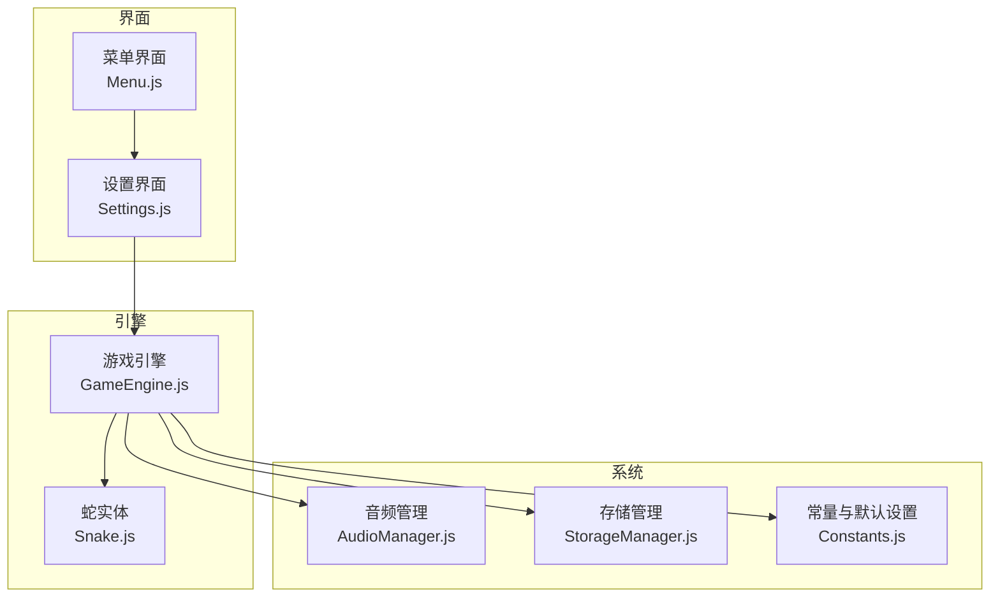
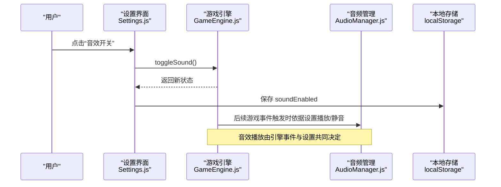
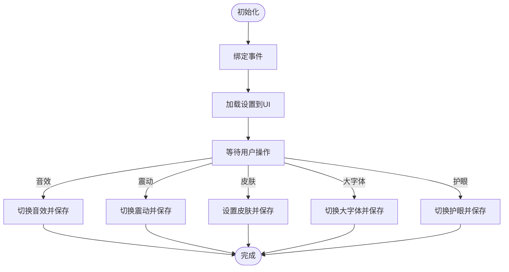
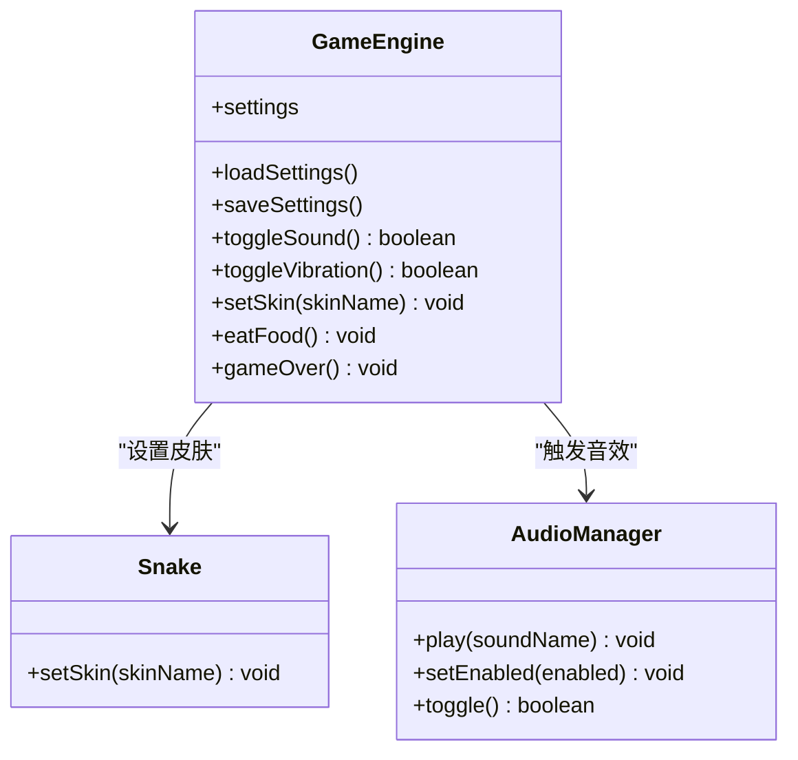
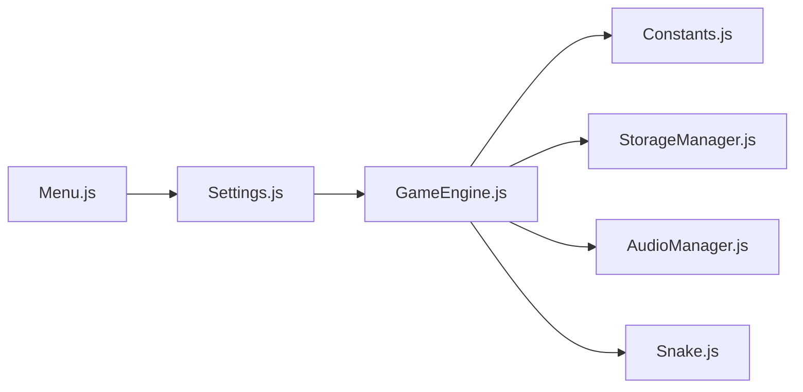

# 设置界面

<cite>
**本文引用的文件**
- [snake-game/js/ui/Settings.js](file://snake-game/js/ui/Settings.js)
- [snake-game/js/core/GameEngine.js](file://snake-game/js/core/GameEngine.js)
- [snake-game/js/data/StorageManager.js](file://snake-game/js/data/StorageManager.js)
- [snake-game/js/utils/Constants.js](file://snake-game/js/utils/Constants.js)
- [snake-game/js/audio/AudioManager.js](file://snake-game/js/audio/AudioManager.js)
- [snake-game/js/ui/Menu.js](file://snake-game/js/ui/Menu.js)
- [snake-game/js/core/Snake.js](file://snake-game/js/core/Snake.js)
</cite>

## 目录
1. [简介](#简介)
2. [项目结构](#项目结构)
3. [核心组件](#核心组件)
4. [架构总览](#架构总览)
5. [详细组件分析](#详细组件分析)
6. [依赖关系分析](#依赖关系分析)
7. [性能与可用性考虑](#性能与可用性考虑)
8. [故障排查指南](#故障排查指南)
9. [结论](#结论)
10. [附录](#附录)

## 简介
本文件面向贪吃蛇游戏的“设置界面”模块，系统性说明其配置管理、本地持久化、UI数据绑定与双向同步、即时行为影响（音效、震动、主题），以及导入导出与备份机制的实现现状与建议。目标是帮助开发者快速理解并扩展设置能力，确保用户偏好跨会话保存且变更可即时生效。

## 项目结构
与设置相关的关键代码位于以下位置：
- UI层：设置界面交互与事件绑定
- 引擎层：游戏运行时对设置的读取与应用
- 存储层：localStorage的读写封装与默认值合并
- 常量层：默认设置项与存储键定义
- 音频层：音效开关控制
- 菜单层：进入设置界面的入口

图表来源
- [snake-game/js/ui/Menu.js:32-35](file://snake-game/js/ui/Menu.js#L32-L35)
- [snake-game/js/ui/Settings.js:8-12](file://snake-game/js/ui/Settings.js#L8-L12)
- [snake-game/js/core/GameEngine.js:97-114](file://snake-game/js/core/GameEngine.js#L97-L114)
- [snake-game/js/data/StorageManager.js:37-50](file://snake-game/js/data/StorageManager.js#L37-L50)
- [snake-game/js/utils/Constants.js:67-81](file://snake-game/js/utils/Constants.js#L67-L81)
- [snake-game/js/audio/AudioManager.js:154-165](file://snake-game/js/audio/AudioManager.js#L154-L165)
- [snake-game/js/core/Snake.js:185-190](file://snake-game/js/core/Snake.js#L185-L190)

章节来源
- [snake-game/js/ui/Menu.js:32-35](file://snake-game/js/ui/Menu.js#L32-L35)
- [snake-game/js/ui/Settings.js:8-12](file://snake-game/js/ui/Settings.js#L8-L12)
- [snake-game/js/core/GameEngine.js:97-114](file://snake-game/js/core/GameEngine.js#L97-L114)
- [snake-game/js/data/StorageManager.js:37-50](file://snake-game/js/data/StorageManager.js#L37-L50)
- [snake-game/js/utils/Constants.js:67-81](file://snake-game/js/utils/Constants.js#L67-L81)
- [snake-game/js/audio/AudioManager.js:154-165](file://snake-game/js/audio/AudioManager.js#L154-L165)
- [snake-game/js/core/Snake.js:185-190](file://snake-game/js/core/Snake.js#L185-L190)

## 核心组件
- 设置界面（Settings）
  - 负责加载当前设置到表单控件、监听用户操作、将变更写入持久化存储，并调用引擎方法使变更立即生效。
- 游戏引擎（GameEngine）
  - 维护运行时 settings 对象；提供切换音效、震动、皮肤等接口；在关键时机触发音效与震动反馈。
- 存储管理（StorageManager）
  - 统一读写 localStorage，提供获取/保存设置、合并默认值等方法。
- 常量与默认设置（Constants）
  - 定义 DEFAULT_SETTINGS 与 STORAGE_KEY，保证设置项一致性。
- 音频管理（AudioManager）
  - 根据全局 enabled 状态播放或屏蔽音效。
- 蛇实体（Snake）
  - 支持按皮肤名称渲染不同颜色方案。

章节来源
- [snake-game/js/ui/Settings.js:17-66](file://snake-game/js/ui/Settings.js#L17-L66)
- [snake-game/js/core/GameEngine.js:803-813](file://snake-game/js/core/GameEngine.js#L803-L813)
- [snake-game/js/data/StorageManager.js:37-50](file://snake-game/js/data/StorageManager.js#L37-L50)
- [snake-game/js/utils/Constants.js:67-81](file://snake-game/js/utils/Constants.js#L67-L81)
- [snake-game/js/audio/AudioManager.js:154-165](file://snake-game/js/audio/AudioManager.js#L154-L165)
- [snake-game/js/core/Snake.js:185-190](file://snake-game/js/core/Snake.js#L185-L190)

## 架构总览
设置变更从 UI 层发起，经引擎层应用并持久化，同时通过事件或 API 驱动音效、触觉与视觉主题即时生效。

图表来源
- [snake-game/js/ui/Settings.js:25-29](file://snake-game/js/ui/Settings.js#L25-L29)
- [snake-game/js/core/GameEngine.js:803-807](file://snake-game/js/core/GameEngine.js#L803-L807)
- [snake-game/js/audio/AudioManager.js:44-66](file://snake-game/js/audio/AudioManager.js#L44-66)

## 详细组件分析

### 设置界面（Settings）
职责
- 初始化时绑定事件并加载已保存的设置到表单控件。
- 监听各设置项变化，调用引擎对应方法实现即时生效，并将变更保存到本地存储。
- 提供显示/隐藏设置面板的能力。

关键流程
- 初始化：绑定事件、加载设置。
- 音效开关：切换后更新 UI 勾选状态并持久化。
- 震动开关：同上。
- 皮肤选择：选择后立即应用到蛇并持久化。
- 语言与大字体、护眼模式：保存设置并应用至 DOM 属性以驱动样式。

数据绑定与双向同步
- 加载阶段：从引擎 settings 读取并回填表单控件。
- 变更阶段：事件回调中先调用引擎方法，再写回本地存储，确保 UI 与存储一致。

图表来源
- [snake-game/js/ui/Settings.js:8-12](file://snake-game/js/ui/Settings.js#L8-L12)
- [snake-game/js/ui/Settings.js:25-66](file://snake-game/js/ui/Settings.js#L25-L66)
- [snake-game/js/ui/Settings.js:71-95](file://snake-game/js/ui/Settings.js#L71-L95)

章节来源
- [snake-game/js/ui/Settings.js:8-12](file://snake-game/js/ui/Settings.js#L8-L12)
- [snake-game/js/ui/Settings.js:17-66](file://snake-game/js/ui/Settings.js#L17-L66)
- [snake-game/js/ui/Settings.js:71-95](file://snake-game/js/ui/Settings.js#L71-L95)
- [snake-game/js/ui/Settings.js:126-133](file://snake-game/js/ui/Settings.js#L126-L133)

### 游戏引擎（GameEngine）
职责
- 维护运行时 settings 对象，并在构造时从本地存储加载，合并默认值。
- 暴露设置变更接口：切换音效、切换震动、设置皮肤。
- 在游戏过程中依据设置触发音效与震动反馈。

设置加载与保存
- 加载：读取 localStorage，解析 JSON，合并 DEFAULT_SETTINGS 得到最终 settings。
- 保存：将当前 settings 写回 localStorage。

即时行为影响
- 音效：在吃食物与游戏结束时，若开启则通过事件总线触发音效播放。
- 震动：在吃食物与游戏结束时，若开启则调用设备震动 API。
- 皮肤：重置或设置皮肤时，立即应用到蛇实例。

图表来源
- [snake-game/js/core/GameEngine.js:97-114](file://snake-game/js/core/GameEngine.js#L97-L114)
- [snake-game/js/core/GameEngine.js:803-813](file://snake-game/js/core/GameEngine.js#L803-L813)
- [snake-game/js/core/GameEngine.js:361-367](file://snake-game/js/core/GameEngine.js#L361-L367)
- [snake-game/js/core/GameEngine.js:486-492](file://snake-game/js/core/GameEngine.js#L486-L492)
- [snake-game/js/core/Snake.js:185-190](file://snake-game/js/core/Snake.js#L185-L190)
- [snake-game/js/audio/AudioManager.js:44-66](file://snake-game/js/audio/AudioManager.js#L44-66)

章节来源
- [snake-game/js/core/GameEngine.js:97-114](file://snake-game/js/core/GameEngine.js#L97-L114)
- [snake-game/js/core/GameEngine.js:803-813](file://snake-game/js/core/GameEngine.js#L803-L813)
- [snake-game/js/core/GameEngine.js:361-367](file://snake-game/js/core/GameEngine.js#L361-L367)
- [snake-game/js/core/GameEngine.js:486-492](file://snake-game/js/core/GameEngine.js#L486-L492)
- [snake-game/js/core/Snake.js:185-190](file://snake-game/js/core/Snake.js#L185-L190)

### 存储管理（StorageManager）
职责
- 统一读取/写入 localStorage，提供 getSettings/saveSettings 等便捷方法。
- 在获取设置时合并默认值，避免缺失字段导致异常。

要点
- 读取失败或格式错误时返回空对象，保障健壮性。
- 提供清除全部数据的方法，便于测试与重置。

章节来源
- [snake-game/js/data/StorageManager.js:8-31](file://snake-game/js/data/StorageManager.js#L8-31)
- [snake-game/js/data/StorageManager.js:37-50](file://snake-game/js/data/StorageManager.js#L37-L50)
- [snake-game/js/data/StorageManager.js:151-153](file://snake-game/js/data/StorageManager.js#L151-L153)

### 常量与默认设置（Constants）
职责
- 定义所有默认设置项，包括音效、震动、皮肤、难度、模式、语言、字号、护眼模式等。
- 定义 localStorage 的存储键名，确保全链路一致。

章节来源
- [snake-game/js/utils/Constants.js:67-81](file://snake-game/js/utils/Constants.js#L67-L81)

### 音频管理（AudioManager）
职责
- 基于 Web Audio API 生成简单音效，受全局 enabled 控制。
- 提供 play/toggle/setEnabled 等接口。

与设置的关系
- 引擎在启用音效时通过事件总线触发播放，实际是否发声取决于 AudioManager.enabled。

章节来源
- [snake-game/js/audio/AudioManager.js:44-66](file://snake-game/js/audio/AudioManager.js#L44-66)
- [snake-game/js/audio/AudioManager.js:154-165](file://snake-game/js/audio/AudioManager.js#L154-L165)

### 菜单界面（Menu）
职责
- 提供进入设置界面的入口，点击后显示设置面板。

章节来源
- [snake-game/js/ui/Menu.js:32-35](file://snake-game/js/ui/Menu.js#L32-L35)

## 依赖关系分析
- Settings 依赖 GameEngine 提供的设置变更接口与 settings 对象。
- GameEngine 依赖 Constants 中的默认设置与存储键，依赖 StorageManager 或直接使用 localStorage 进行持久化。
- GameEngine 在运行期依据 settings 触发 AudioManager 与设备震动。
- Snake 根据皮肤名称渲染不同配色。

图表来源
- [snake-game/js/ui/Settings.js:8-12](file://snake-game/js/ui/Settings.js#L8-L12)
- [snake-game/js/core/GameEngine.js:97-114](file://snake-game/js/core/GameEngine.js#L97-L114)
- [snake-game/js/data/StorageManager.js:37-50](file://snake-game/js/data/StorageManager.js#L37-L50)
- [snake-game/js/utils/Constants.js:67-81](file://snake-game/js/utils/Constants.js#L67-L81)
- [snake-game/js/audio/AudioManager.js:44-66](file://snake-game/js/audio/AudioManager.js#L44-66)
- [snake-game/js/core/Snake.js:185-190](file://snake-game/js/core/Snake.js#L185-L190)
- [snake-game/js/ui/Menu.js:32-35](file://snake-game/js/ui/Menu.js#L32-L35)

章节来源
- [snake-game/js/ui/Settings.js:8-12](file://snake-game/js/ui/Settings.js#L8-L12)
- [snake-game/js/core/GameEngine.js:97-114](file://snake-game/js/core/GameEngine.js#L97-L114)
- [snake-game/js/data/StorageManager.js:37-50](file://snake-game/js/data/StorageManager.js#L37-L50)
- [snake-game/js/utils/Constants.js:67-81](file://snake-game/js/utils/Constants.js#L67-L81)
- [snake-game/js/audio/AudioManager.js:44-66](file://snake-game/js/audio/AudioManager.js#L44-66)
- [snake-game/js/core/Snake.js:185-190](file://snake-game/js/core/Snake.js#L185-L190)
- [snake-game/js/ui/Menu.js:32-35](file://snake-game/js/ui/Menu.js#L32-L35)

## 性能与可用性考虑
- 设置变更应尽量避免频繁 I/O。当前实现每次变更即写入 localStorage，建议在批量设置场景下合并写入。
- 皮肤切换仅修改颜色映射，开销较小；但应避免在高频路径中进行 DOM 重排。
- 音效与震动应在必要时才触发，避免造成卡顿或耗电。

[本节为通用建议，不直接分析具体文件]

## 故障排查指南
常见问题与定位思路
- 设置未持久化
  - 检查 localStorage 是否可用及存储空间是否充足。
  - 确认存储键名与读取逻辑一致。
- 设置未生效
  - 确认 UI 事件是否正确绑定并触发了引擎方法。
  - 检查引擎是否在相应时机读取了最新设置。
- 音效无声
  - 确认浏览器是否允许自动播放策略下的音频上下文创建。
  - 检查音效开关状态与 AudioManager 的 enabled 标志。
- 皮肤未改变
  - 确认皮肤名称是否为有效键，且蛇实例已调用 setSkin。

章节来源
- [snake-game/js/ui/Settings.js:126-133](file://snake-game/js/ui/Settings.js#L126-L133)
- [snake-game/js/core/GameEngine.js:97-114](file://snake-game/js/core/GameEngine.js#L97-L114)
- [snake-game/js/audio/AudioManager.js:44-66](file://snake-game/js/audio/AudioManager.js#L44-66)
- [snake-game/js/core/Snake.js:185-190](file://snake-game/js/core/Snake.js#L185-L190)

## 结论
设置界面实现了基础而清晰的配置管理能力：通过 UI 事件驱动引擎方法，结合 localStorage 完成持久化，并在游戏运行期即时影响音效、震动与视觉主题。整体耦合度适中，易于扩展更多个性化选项。

[本节为总结性内容，不直接分析具体文件]

## 附录

### 设置项清单与默认值
- 音效开关：默认开启
- 震动反馈：默认开启
- 皮肤主题：默认经典
- 难度/模式：默认简单/经典
- 语言：默认中文
- 字号：默认正常
- 护眼模式：默认关闭

章节来源
- [snake-game/js/utils/Constants.js:67-77](file://snake-game/js/utils/Constants.js#L67-L77)

### 导入导出与备份机制（现状与建议）
现状
- 当前代码未提供显式的“导入/导出”按钮或 API。
- 所有设置均保存在 localStorage 的单一键名下，数据结构包含 settings、最高分、统计等信息。

建议实现
- 导出
  - 读取完整存储数据，序列化为 JSON 字符串，提供下载链接或复制到剪贴板。
- 导入
  - 提供文件选择或粘贴区域，校验 JSON 结构后覆盖或合并到现有存储。
- 备份
  - 定期导出关键配置（如 settings）到独立文件或云端（可选）。
- 恢复/重置
  - 提供“恢复默认设置”功能，用 DEFAULT_SETTINGS 覆盖 settings 字段。

参考路径
- 读取/写入存储：[snake-game/js/data/StorageManager.js:8-31](file://snake-game/js/data/StorageManager.js#L8-31)
- 合并默认设置：[snake-game/js/data/StorageManager.js:37-40](file://snake-game/js/data/StorageManager.js#L37-L40)
- 存储键名：[snake-game/js/utils/Constants.js:79-81](file://snake-game/js/utils/Constants.js#L79-L81)

章节来源
- [snake-game/js/data/StorageManager.js:8-31](file://snake-game/js/data/StorageManager.js#L8-31)
- [snake-game/js/data/StorageManager.js:37-40](file://snake-game/js/data/StorageManager.js#L37-L40)
- [snake-game/js/utils/Constants.js:79-81](file://snake-game/js/utils/Constants.js#L79-L81)