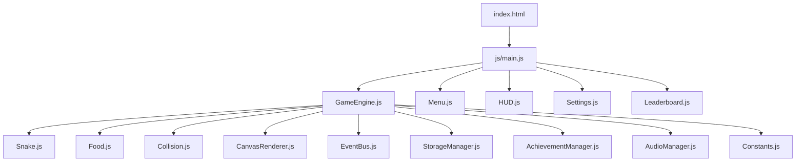
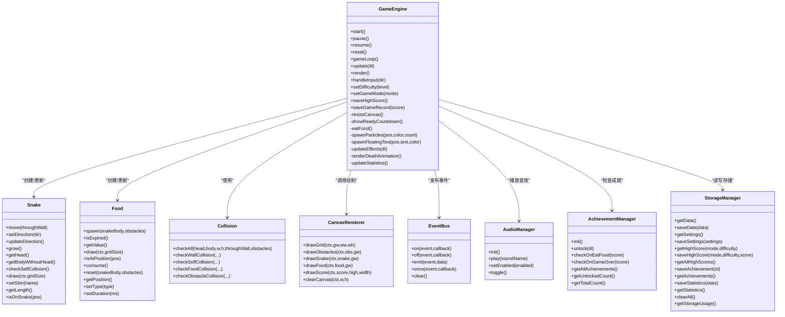
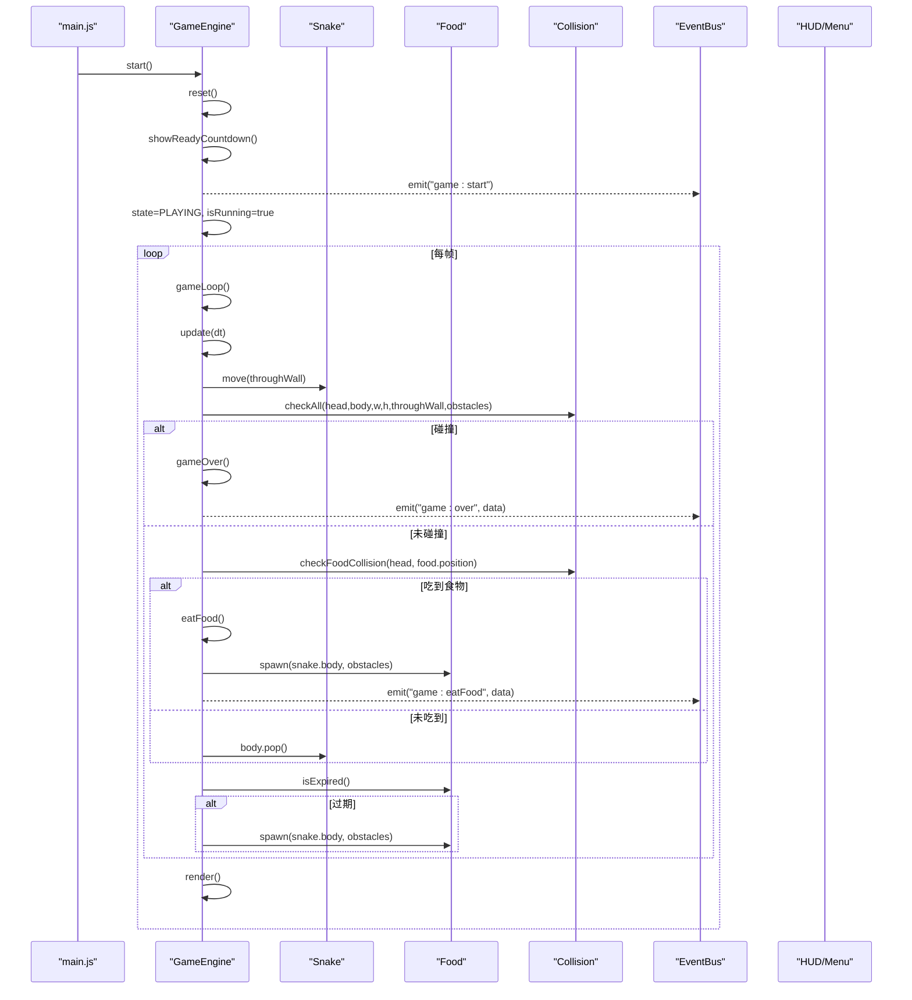
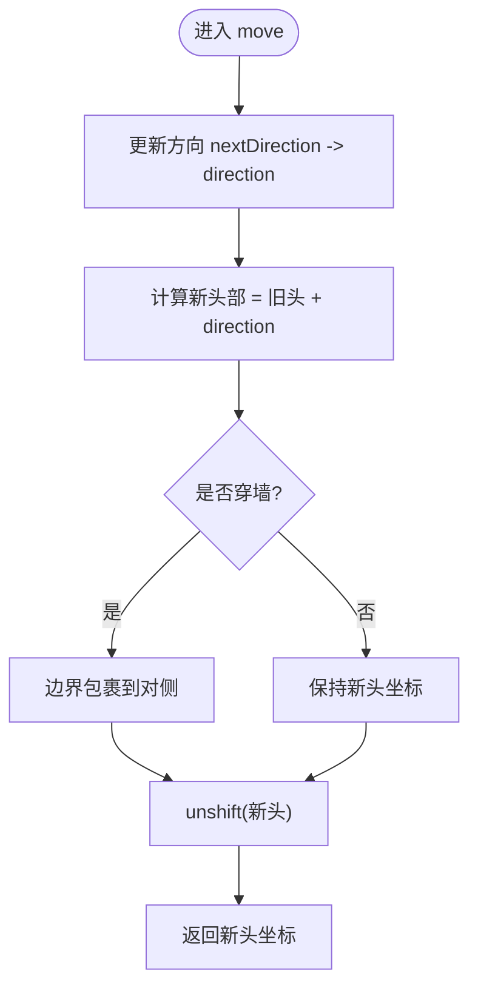
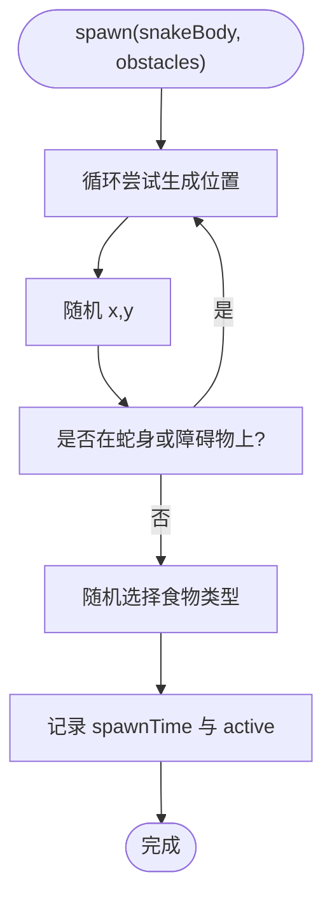
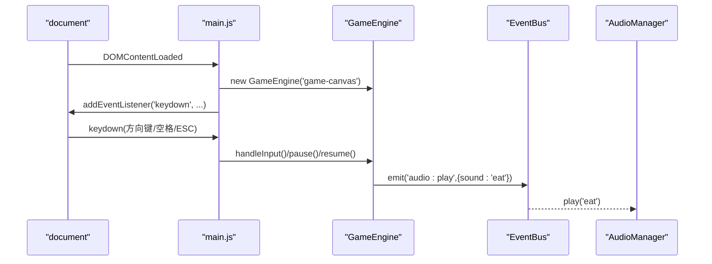
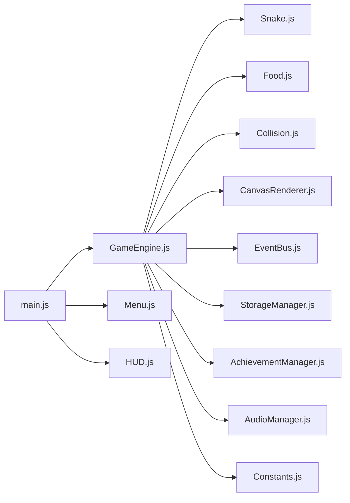

# 贪吃蛇游戏

<cite>
**本文引用的文件**   
- [index.html](file://snake-game/index.html)
- [main.js](file://snake-game/js/main.js)
- [GameEngine.js](file://snake-game/js/core/GameEngine.js)
- [Snake.js](file://snake-game/js/core/Snake.js)
- [Food.js](file://snake-game/js/core/Food.js)
- [Collision.js](file://snake-game/js/core/Collision.js)
- [CanvasRenderer.js](file://snake-game/js/render/CanvasRenderer.js)
- [Constants.js](file://snake-game/js/utils/Constants.js)
- [EventBus.js](file://snake-game/js/utils/EventBus.js)
- [AudioManager.js](file://snake-game/js/audio/AudioManager.js)
- [AchievementManager.js](file://snake-game/js/data/AchievementManager.js)
- [StorageManager.js](file://snake-game/js/data/StorageManager.js)
- [Menu.js](file://snake-game/js/ui/Menu.js)
- [HUD.js](file://snake-game/js/ui/HUD.js)
</cite>

## 更新摘要
**变更内容**   
- 项目状态更新：贪吃蛇游戏项目已被完全从版本控制中移除，文档保持为历史架构参考
- 保留完整的技术实现记录，供后续类似项目开发参考
- 强调项目的模块化设计、事件驱动架构和Canvas渲染优化等技术价值

## 目录
1. [简介](#简介)
2. [项目结构](#项目结构)
3. [核心组件](#核心组件)
4. [架构总览](#架构总览)
5. [详细组件分析](#详细组件分析)
6. [依赖关系分析](#依赖关系分析)
7. [性能考量](#性能考量)
8. [故障排查指南](#故障排查指南)
9. [结论](#结论)
10. [附录](#附录)

## 简介
本项目是一个基于原生 JavaScript 与 HTML5 Canvas 的完整贪吃蛇游戏。它采用模块化组织，围绕一个主引擎 GameEngine 驱动游戏循环、状态机、输入处理、碰撞检测、渲染与持久化等核心能力；同时提供多模式（经典、限时、障碍）、难度调节、成就解锁、音效管理、UI 菜单与 HUD 等高级特性。

**项目状态说明**：该项目已被完全从版本控制中移除，但保留了完整的技术实现记录。本文档作为历史架构参考，详细记录了项目的模块化设计、事件驱动架构和Canvas渲染优化等技术实现，为后续类似项目开发提供宝贵的技术借鉴和经验总结。

## 项目结构
- 入口与页面：index.html 负责加载资源、挂载 UI 屏幕与脚本顺序。
- 核心逻辑：core 目录下包含 GameEngine、Snake、Food、Collision。
- 渲染层：render 下提供 CanvasRenderer 模块（当前由 GameEngine 直接绘制）。
- 工具与常量：utils 下提供 Constants、EventBus、Helpers。
- 数据与存储：data 下提供 StorageManager、AchievementManager。
- 音频：audio 下提供 AudioManager（Web Audio API 合成音效）。
- UI：ui 下提供 Menu、HUD、Settings、Leaderboard。
- 启动器：js/main.js 初始化各模块、绑定全局事件与移动端交互。

**图表来源**
- [index.html:279-294](file://snake-game/index.html#L279-L294)
- [main.js:1-20](file://snake-game/js/main.js#L1-L20)
- [GameEngine.js:1-47](file://snake-game/js/core/GameEngine.js#L1-L47)

**章节来源**
- [index.html:1-297](file://snake-game/index.html#L1-L297)
- [main.js:1-20](file://snake-game/js/main.js#L1-L20)

## 核心组件
- GameEngine：游戏主循环、状态机、输入分发、更新与渲染调度、粒子与飘字效果、死亡动画、统计与记录保存、设置与高分持久化、模式与难度切换。
- Snake：蛇身数据结构与移动算法、方向控制、穿墙逻辑、皮肤颜色、绘制。
- Food：食物位置随机生成、类型与分值、过期机制、绘制。
- Collision：统一碰撞检测接口（墙、自身、障碍物、食物）。
- CanvasRenderer：可复用的 Canvas 绘制方法（网格、障碍物、蛇、食物、分数）。
- EventBus：发布订阅总线，用于模块间解耦通信。
- StorageManager：本地存储封装（设置、最高分、成就、统计、记录）。
- AchievementManager：成就定义、检查与通知、持久化。
- AudioManager：Web Audio API 合成音效（吃食、结束等），支持开关。
- Menu/HUD：界面导航、开始/暂停/返回、分数与计时显示、事件监听。

**章节来源**
- [GameEngine.js:1-800](file://snake-game/js/core/GameEngine.js#L1-L800)
- [Snake.js:1-214](file://snake-game/js/core/Snake.js#L1-L214)
- [Food.js:1-168](file://snake-game/js/core/Food.js#L1-L168)
- [Collision.js:1-73](file://snake-game/js/core/Collision.js#L1-L73)
- [CanvasRenderer.js:1-188](file://snake-game/js/render/CanvasRenderer.js#L1-L188)
- [EventBus.js:1-80](file://snake-game/js/utils/EventBus.js#L1-L80)
- [StorageManager.js:1-175](file://snake-game/js/data/StorageManager.js#L1-L175)
- [AchievementManager.js:1-252](file://snake-game/js/data/AchievementManager.js#L1-L252)
- [AudioManager.js:1-172](file://snake-game/js/audio/AudioManager.js#L1-L172)
- [Menu.js:1-183](file://snake-game/js/ui/Menu.js#L1-L183)
- [HUD.js:1-178](file://snake-game/js/ui/HUD.js#L1-L178)
- [Constants.js:1-81](file://snake-game/js/utils/Constants.js#L1-L81)

## 架构总览
整体采用"主引擎 + 领域对象 + 渲染抽象 + 事件总线"的分层架构：
- 主引擎负责生命周期与协调，不直接耦合 UI 细节。
- 领域对象（Snake、Food）专注业务规则与数据。
- 渲染层提供可复用绘制方法，当前由引擎内联调用。
- 事件总线贯穿 UI、成就、音频等子系统，降低耦合度。

**图表来源**
- [GameEngine.js:1-800](file://snake-game/js/core/GameEngine.js#L1-L800)
- [Snake.js:1-214](file://snake-game/js/core/Snake.js#L1-L214)
- [Food.js:1-168](file://snake-game/js/core/Food.js#L1-L168)
- [Collision.js:1-73](file://snake-game/js/core/Collision.js#L1-L73)
- [CanvasRenderer.js:1-188](file://snake-game/js/render/CanvasRenderer.js#L1-L188)
- [EventBus.js:1-80](file://snake-game/js/utils/EventBus.js#L1-L80)
- [AudioManager.js:1-172](file://snake-game/js/audio/AudioManager.js#L1-L172)
- [AchievementManager.js:1-252](file://snake-game/js/data/AchievementManager.js#L1-L252)
- [StorageManager.js:1-175](file://snake-game/js/data/StorageManager.js#L1-L175)

## 详细组件分析

### GameEngine 主引擎
- 设计模式
  - 状态机：IDLE/READY/PLAYING/PAUSED/GAME_OVER 明确转换边界，避免竞态。
  - 固定时间步长累加器：按 difficulty.speed 计算 updateInterval，保证不同帧率下逻辑稳定。
  - 观察者模式：通过 globalEventBus 广播 game:start、game:playing、game:over、game:timeUpdate、game:eatFood、game:highScore 等事件。
- 关键流程
  - start -> _doStart -> showReadyCountdown -> 进入 PLAYING -> gameLoop。
  - gameLoop 中按 deltaTime 累积，执行 update 与 render，并请求下一帧。
  - update 中：计时（限时模式）、蛇移动、碰撞检测、吃食物、食物过期刷新。
  - eatFood：加分、增长语义、粒子与飘字、震动与音效、触发成就检查。
  - gameOver：停止循环、死亡闪烁动画、保存高分与记录、更新统计、延迟通知 UI。
- 渲染与视觉效果
  - 网格、障碍物、食物、蛇、粒子、飘字、分数。
  - 死亡动画独立渲染循环，闪烁蛇体并保留场景元素。
- 配置与持久化
  - 设置项（音效、震动、皮肤、语言、字体、护眼）与 LocalStorage 互操作。
  - 最高分按 mode+difficulty 维度维护；游戏记录保留最近 100 条。
- 扩展点
  - setGameMode/setDifficulty 动态切换行为。
  - spawnParticles/spawnFloatingText 可扩展更多特效。
  - 可通过替换 draw* 方法或引入 CanvasRenderer 集中绘制。

**图表来源**
- [main.js:1-20](file://snake-game/js/main.js#L1-L20)
- [GameEngine.js:220-341](file://snake-game/js/core/GameEngine.js#L220-L341)
- [GameEngine.js:343-378](file://snake-game/js/core/GameEngine.js#L343-L378)
- [GameEngine.js:460-506](file://snake-game/js/core/GameEngine.js#L460-L506)
- [GameEngine.js:657-684](file://snake-game/js/core/GameEngine.js#L657-L684)
- [HUD.js:57-87](file://snake-game/js/ui/HUD.js#L57-L87)

**章节来源**
- [GameEngine.js:1-800](file://snake-game/js/core/GameEngine.js#L1-L800)
- [main.js:1-20](file://snake-game/js/main.js#L1-L20)
- [HUD.js:57-87](file://snake-game/js/ui/HUD.js#L57-L87)

### Snake 蛇移动逻辑
- 数据结构：body 为坐标数组，头部在索引 0。
- 移动算法：
  - setDirection 防止 180 度反向。
  - move 先更新方向，再计算新头，支持穿墙（简单模式）。
  - 增长逻辑：GameEngine 在吃食物时不调用 body.pop()，从而自然增长。
- 绘制：根据 skin 颜色绘制头与身体，并根据方向绘制眼睛。
- 复杂度：每次移动 O(1)，自碰撞检测 O(n)。

**图表来源**
- [Snake.js:61-88](file://snake-game/js/core/Snake.js#L61-L88)

**章节来源**
- [Snake.js:1-214](file://snake-game/js/core/Snake.js#L1-L214)

### Food 食物生成系统
- 随机生成：在网格范围内随机取整坐标，避开蛇身与障碍物，最多尝试上限后回退。
- 类型与分值：NORMAL/GOLDEN/RAINBOW，对应不同颜色与分值。
- 过期机制：支持 duration 毫秒后过期，GameEngine 每帧检查并重新生成。
- 绘制：圆形主体 + 高光，特殊类型带脉冲外圈。

**图表来源**
- [Food.js:28-52](file://snake-game/js/core/Food.js#L28-L52)

**章节来源**
- [Food.js:1-168](file://snake-game/js/core/Food.js#L1-L168)

### 碰撞检测 Collision
- 统一接口 checkAll 返回 wall/self/obstacle 布尔结果。
- 支持穿墙模式下的墙碰撞禁用。
- 障碍物碰撞基于坐标匹配。

**章节来源**
- [Collision.js:1-73](file://snake-game/js/core/Collision.js#L1-L73)

### Canvas 渲染系统与优化
- 当前实现：GameEngine 直接调用 ctx 绘制网格、障碍物、食物、蛇、粒子、飘字与分数。
- 可复用渲染：CanvasRenderer 提供 drawGrid/drawObstacles/drawSnake/drawFood/drawScore/clearCanvas 等方法，便于抽取与复用。
- 性能优化策略
  - 固定时间步长更新，渲染尽可能高频（requestAnimationFrame）。
  - 仅绘制必要元素，减少重绘区域（当前全画布清屏，后续可引入脏矩形）。
  - 粒子与飘字使用生命周期衰减过滤，及时剔除无效对象。
  - 文本绘制尽量减少样式变更，合并属性设置。
  - 网格线绘制可考虑离屏缓存（OffscreenCanvas）以降低重复开销。

**章节来源**
- [GameEngine.js:657-756](file://snake-game/js/core/GameEngine.js#L657-L756)
- [CanvasRenderer.js:1-188](file://snake-game/js/render/CanvasRenderer.js#L1-L188)

### 事件处理机制与响应式设计
- 键盘事件：main.js 监听方向键/WASD、ESC 暂停/恢复，阻止默认滚动。
- 触摸事件：滑动识别（最小阈值）、虚拟方向键点击与 touchstart 防长按。
- 页面可见性：visibilitychange 自动暂停。
- 事件总线：模块间通过 globalEventBus 解耦（如 audio:play、game:* 系列事件）。
- 响应式 Canvas：窗口 resize 时按网格对齐调整尺寸，延迟至可见容器非零尺寸。

**图表来源**
- [main.js:36-76](file://snake-game/js/main.js#L36-L76)
- [main.js:78-118](file://snake-game/js/main.js#L78-L118)
- [main.js:165-175](file://snake-game/js/main.js#L165-L175)
- [GameEngine.js:769-772](file://snake-game/js/core/GameEngine.js#L769-L772)
- [AudioManager.js:44-66](file://snake-game/js/audio/AudioManager.js#L44-66)

**章节来源**
- [main.js:1-216](file://snake-game/js/main.js#L1-L216)
- [EventBus.js:1-80](file://snake-game/js/utils/EventBus.js#L1-L80)

### 多种游戏模式与难度调节
- 模式
  - 经典：无限时，追求最高分。
  - 限时：倒计时结束即结束，HUD 实时显示剩余时间。
  - 障碍：地图随机生成障碍物，增加挑战。
- 难度
  - 简单：速度较慢，允许穿墙，无/少障碍。
  - 中等：速度提升，不可穿墙，少量障碍。
  - 困难：速度快，不可穿墙，较多障碍。
- 切换：Menu 按钮触发 GameEngine.setGameMode/setDifficulty，必要时重新生成障碍并加载对应最高分。

**章节来源**
- [Constants.js:21-31](file://snake-game/js/utils/Constants.js#L21-L31)
- [GameEngine.js:774-793](file://snake-game/js/core/GameEngine.js#L774-L793)
- [Menu.js:50-76](file://snake-game/js/ui/Menu.js#L50-L76)

### 成就解锁机制
- 成就定义：包含 id、名称、描述、图标与解锁状态。
- 触发时机：吃食物时检查分数里程碑；游戏结束时检查累计局数、模式得分、蛇长度、穿墙条件等。
- 通知与持久化：解锁后弹出通知并通过 StorageManager 保存已解锁列表。

**章节来源**
- [AchievementManager.js:1-252](file://snake-game/js/data/AchievementManager.js#L1-L252)
- [StorageManager.js:98-119](file://snake-game/js/data/StorageManager.js#L98-L119)

### 音效管理系统
- Web Audio API 合成音效：吃食"叮"声、结束下降音。
- 用户交互后初始化 AudioContext，避免浏览器策略拦截。
- 支持开关与切换，结合设置项与事件总线触发。

**章节来源**
- [AudioManager.js:1-172](file://snake-game/js/audio/AudioManager.js#L1-L172)
- [main.js:172-175](file://snake-game/js/main.js#L172-L175)

## 依赖关系分析
- 低耦合：通过 EventBus 进行跨模块通信，UI、成就、音频均作为订阅者。
- 高内聚：GameEngine 聚合核心逻辑，Snake/Food/Collision 专注领域规则。
- 外部依赖：LocalStorage 持久化；Web Audio API 音效；Canvas 渲染。
- 潜在循环：当前未见循环引用；若未来引入双向回调需小心。

**图表来源**
- [index.html:279-294](file://snake-game/index.html#L279-L294)
- [main.js:1-20](file://snake-game/js/main.js#L1-L20)
- [GameEngine.js:1-47](file://snake-game/js/core/GameEngine.js#L1-L47)

**章节来源**
- [index.html:279-294](file://snake-game/index.html#L279-L294)
- [main.js:1-20](file://snake-game/js/main.js#L1-L20)

## 性能考量
- 固定时间步长：确保逻辑稳定性，避免快慢机问题。
- 渲染优化
  - 减少不必要的 ctx 状态切换。
  - 粒子与飘字及时清理，避免内存泄漏。
  - 网格线可考虑离屏缓存或按需绘制。
- 事件节流：resize 使用 debounce，避免频繁重算。
- 移动端优化：touchstart 阻止默认行为，避免长按菜单；被动事件监听提升滚动性能。
- 存储读写：localStorage 序列化仅在关键节点写入，避免频繁 IO。

## 故障排查指南
- 无法播放音效
  - 确认用户首次交互后 AudioContext 已初始化。
  - 检查设置项中音效开关与事件总线是否正确触发。
- 画面不更新或卡顿
  - 检查 requestAnimationFrame 是否被 cancelAnimationFrame 提前终止。
  - 确认 visibilitychange 导致 pause 后 resume 正常恢复。
- 食物无法生成或重叠
  - 检查 spawn 的冲突检测逻辑与最大尝试次数。
- 移动端方向键误触
  - 确认 d-pad 按钮的 touchstart 阻止默认行为。
- 设置或最高分未保存
  - 检查 STORAGE_KEY 一致性与 JSON 序列化异常捕获。

**章节来源**
- [AudioManager.js:20-38](file://snake-game/js/audio/AudioManager.js#L20-L38)
- [GameEngine.js:592-621](file://snake-game/js/core/GameEngine.js#L592-L621)
- [Food.js:28-52](file://snake-game/js/core/Food.js#L28-L52)
- [main.js:142-163](file://snake-game/js/main.js#L142-L163)
- [StorageManager.js:25-31](file://snake-game/js/data/StorageManager.js#L25-L31)

## 结论
该贪吃蛇项目以清晰的分层与职责划分实现了完整的游戏体验：稳定的主循环与状态机、灵活的移动与碰撞算法、可扩展的食物与成就系统、解耦的事件总线与音效管理，以及良好的移动端适配。通过引入 CanvasRenderer 进一步抽离渲染逻辑、利用离屏缓冲与脏矩形优化、完善错误边界与日志，可在保持可读性的同时持续提升性能与可维护性。

**项目价值总结**：虽然项目已从版本控制中移除，但其技术实现展现了优秀的游戏开发实践，包括模块化架构设计、事件驱动编程模式、Canvas 渲染优化策略等，为后续类似项目开发提供了宝贵的技术参考和学习价值。

## 附录
- 开发最佳实践
  - 单一职责：每个模块只做一件事，通过事件总线协作。
  - 配置集中：难度、模式、皮肤等集中在 Constants 与 Settings。
  - 幂等与健壮：所有存储读写包含 try/catch 与默认值。
  - 可测试性：领域对象（Snake/Food/Collision）易于单元测试。
- 可扩展性建议
  - 新增模式：扩展 GAME_MODE 并在 GameEngine 中分支处理。
  - 新增食物类型：扩展 FOOD_TYPE 与随机权重。
  - 新增皮肤：扩展 SKIN_COLORS 并在 Snake 绘制中使用。
  - 新增特效：在 GameEngine 的 updateEffects/drawParticles/drawFloatingTexts 中扩展。

**技术遗产价值**：本项目的代码结构和实现方案可作为学习现代前端游戏开发的优秀案例，其模块化设计思想、性能优化策略和用户体验考虑都值得在后续项目中借鉴和应用。