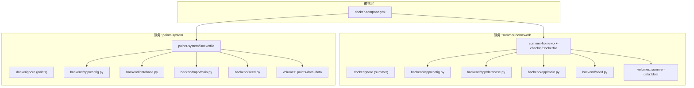
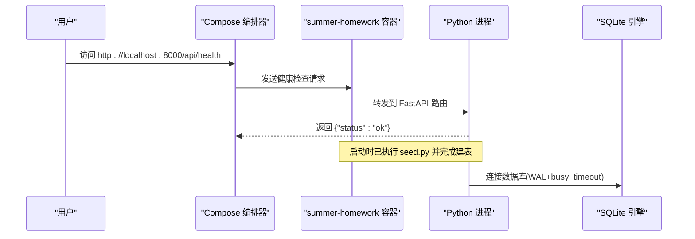
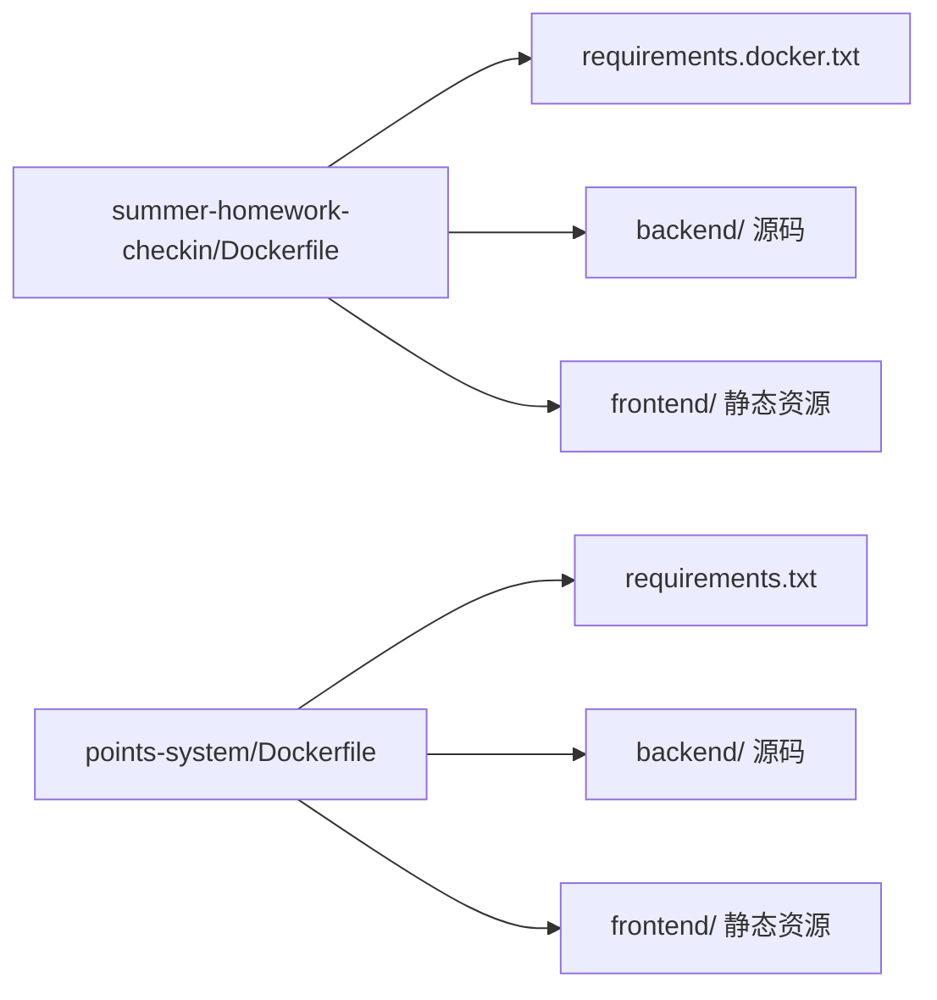

# Docker容器化部署

<cite>
**本文引用的文件**   
- [docker-compose.yml](file://docker-compose.yml)
- [points-system/Dockerfile](file://points-system/Dockerfile)
- [summer-homework-checkin/Dockerfile](file://summer-homework-checkin/Dockerfile)
- [points-system/.dockerignore](file://points-system/.dockerignore)
- [summer-homework-checkin/.dockerignore](file://summer-homework-checkin/.dockerignore)
- [points-system/backend/requirements.txt](file://points-system/backend/requirements.txt)
- [summer-homework-checkin/backend/requirements.docker.txt](file://summer-homework-checkin/backend/requirements.docker.txt)
- [summer-homework-checkin/backend/requirements.txt](file://summer-homework-checkin/backend/requirements.txt)
- [points-system/backend/app/config.py](file://points-system/backend/app/config.py)
- [summer-homework-checkin/backend/app/config.py](file://summer-homework-checkin/backend/app/config.py)
- [points-system/backend/app/main.py](file://points-system/backend/app/main.py)
- [summer-homework-checkin/backend/app/main.py](file://summer-homework-checkin/backend/app/main.py)
- [points-system/backend/database.py](file://points-system/backend/database.py)
- [summer-homework-checkin/backend/app/database.py](file://summer-homework-checkin/backend/app/database.py)
- [points-system/backend/seed.py](file://points-system/backend/seed.py)
- [summer-homework-checkin/backend/seed.py](file://summer-homework-checkin/backend/seed.py)
- [summer-homework-checkin/README.md](file://summer-homework-checkin/README.md)
</cite>

## 目录
1. [简介](#简介)
2. [项目结构](#项目结构)
3. [核心组件](#核心组件)
4. [架构总览](#架构总览)
5. [详细组件分析](#详细组件分析)
6. [依赖分析](#依赖分析)
7. [性能考虑](#性能考虑)
8. [故障排查指南](#故障排查指南)
9. [结论](#结论)
10. [附录](#附录)

## 简介
本仓库包含两个独立的 Python FastAPI 应用，均提供完整的容器化与编排能力：
- 暑假作业打卡系统（summer-homework-checkin）：面向三年级学生的日常打卡、人脸比对、抽奖与报表等。
- 打卡积分兑换系统（points-system）：基于打卡的积分获取、奖品兑换与抽奖功能。

通过 Docker 与 docker-compose，可在本地一键构建镜像、启动服务、挂载持久化卷，并暴露健康检查端点用于编排与健康探测。

## 项目结构
从容器化视角，关键文件分布如下：
- 顶层编排：docker-compose.yml
- 应用镜像定义：各项目的 Dockerfile 与 .dockerignore
- 运行时配置：环境变量注入数据库路径、上传目录、密钥与 CORS 白名单
- 数据持久化：Docker Compose volumes 映射到 /data
- 初始化脚本：seed.py 在首次启动时写入演示数据



图示来源
- [docker-compose.yml:1-59](file://docker-compose.yml#L1-L59)
- [summer-homework-checkin/Dockerfile:1-22](file://summer-homework-checkin/Dockerfile#L1-L22)
- [points-system/Dockerfile:1-22](file://points-system/Dockerfile#L1-L22)

章节来源
- [docker-compose.yml:1-59](file://docker-compose.yml#L1-L59)
- [summer-homework-checkin/Dockerfile:1-22](file://summer-homework-checkin/Dockerfile#L1-L22)
- [points-system/Dockerfile:1-22](file://points-system/Dockerfile#L1-L22)

## 核心组件
- 镜像构建
  - 基础镜像：python:3.11-slim，使用国内镜像代理加速拉取。
  - 依赖安装：优先复制 requirements 清单并安装，利用镜像层缓存提升构建速度。
  - 源码复制：后端与前端静态资源一并打包。
  - 启动命令：先执行 seed.py 幂等初始化，再启动 uvicorn 监听 8000 端口。
- 运行配置
  - 数据库路径 DB_PATH 与上传目录 UPLOAD_DIR 通过环境变量重定向至持久化卷 /data。
  - 安全密钥 SUMMER_SECRET 与 CORS 白名单 ALLOWED_ORIGINS 支持环境变量覆盖。
- 数据持久化
  - 使用 Docker Compose 的 named volumes 将 /data 持久化，避免容器重建导致数据丢失。
- 健康检查
  - 每个服务提供 /api/health 端点，供编排器进行健康探测。

章节来源
- [summer-homework-checkin/Dockerfile:1-22](file://summer-homework-checkin/Dockerfile#L1-L22)
- [points-system/Dockerfile:1-22](file://points-system/Dockerfile#L1-L22)
- [summer-homework-checkin/backend/app/config.py:1-68](file://summer-homework-checkin/backend/app/config.py#L1-L68)
- [points-system/backend/app/config.py:1-17](file://points-system/backend/app/config.py#L1-L17)
- [docker-compose.yml:1-59](file://docker-compose.yml#L1-L59)

## 架构总览
下图展示了两个服务的容器化部署关系、端口映射、环境变量与数据卷挂载。

```mermaid
graph TB
Client["浏览器/客户端"]
SH["summer-homework<br/>容器:8000"]
PS["points-system<br/>容器:8000(宿主机:8001)")
VolSH["volume: summer-data:/data"]
VolPS["volume: points-data:/data"]
Client --> |http://localhost:8000| SH
Client --> |http://localhost:8001| PS
SH --> VolSH
PS --> VolPS
```

图示来源
- [docker-compose.yml:10-54](file://docker-compose.yml#L10-L54)

章节来源
- [docker-compose.yml:10-54](file://docker-compose.yml#L10-L54)

## 详细组件分析

### 暑假作业打卡系统（summer-homework-checkin）
- 镜像构建要点
  - 使用 requirements.docker.txt 精简依赖，默认不包含人脸识别重型依赖；如需启用，可替换为完整 requirements.txt。
  - 启动流程：seed.py 创建管理员账号、预设奖品池与示例任务；随后 uvicorn 启动服务。
- 运行配置与环境变量
  - DB_PATH、UPLOAD_DIR 指向 /data 下的持久化位置。
  - SUMMER_SECRET 用于签名 Token；ALLOWED_ORIGINS 控制跨域来源。
  - 其他可调参数：GEO_THRESHOLD_METERS、MAX_MAKEUP_PER_MONTH、FACE_MATCH_THRESHOLD、FACE_MODE_ON_ENROLLED 等。
- 路由与静态资源
  - 挂载 /admin 管理页与 / 学生端 H5，同时提供 /uploads 静态访问。
  - 提供 /api/health 健康检查端点。
- 数据库与并发
  - SQLite + WAL 模式 + busy_timeout，降低并发写冲突风险。
- 健康检查
  - compose 中通过 HTTP GET /api/health 探测服务可用性。



图示来源
- [summer-homework-checkin/Dockerfile:20-22](file://summer-homework-checkin/Dockerfile#L20-L22)
- [summer-homework-checkin/backend/app/main.py:45-61](file://summer-homework-checkin/backend/app/main.py#L45-L61)
- [summer-homework-checkin/backend/app/database.py:13-22](file://summer-homework-checkin/backend/app/database.py#L13-L22)
- [summer-homework-checkin/backend/seed.py:45-124](file://summer-homework-checkin/backend/seed.py#L45-L124)
- [docker-compose.yml:29-34](file://docker-compose.yml#L29-L34)

章节来源
- [summer-homework-checkin/Dockerfile:1-22](file://summer-homework-checkin/Dockerfile#L1-22)
- [summer-homework-checkin/backend/app/config.py:1-68](file://summer-homework-checkin/backend/app/config.py#L1-68)
- [summer-homework-checkin/backend/app/main.py:1-61](file://summer-homework-checkin/backend/app/main.py#L1-61)
- [summer-homework-checkin/backend/app/database.py:1-31](file://summer-homework-checkin/backend/app/database.py#L1-31)
- [summer-homework-checkin/backend/seed.py:1-124](file://summer-homework-checkin/backend/seed.py#L1-124)
- [summer-homework-checkin/README.md:1-126](file://summer-homework-checkin/README.md#L1-126)

### 打卡积分兑换系统（points-system）
- 镜像构建要点
  - 使用 backend/requirements.txt 安装依赖，包含 FastAPI、SQLAlchemy、Pydantic、图像处理库等。
  - 启动流程：seed.py 写入演示用户、奖品与抽奖奖池；随后 uvicorn 启动服务。
- 运行配置与环境变量
  - DB_PATH 指向 /data 下的持久化位置。
  - 业务规则常量（如每次打卡积分、连续奖励、兑换比例等）集中在配置文件中，可通过环境变量扩展。
- 路由与静态资源
  - 挂载根路径静态前端，提供 /api/health 健康检查端点。
- 数据库与并发
  - SQLite + WAL 模式 + busy_timeout，确保多线程访问稳定性。


图示来源
- [points-system/Dockerfile:20-22](file://points-system/Dockerfile#L20-L22)
- [points-system/backend/app/main.py:32-39](file://points-system/backend/app/main.py#L32-L39)
- [points-system/backend/seed.py:38-87](file://points-system/backend/seed.py#L38-L87)

章节来源
- [points-system/Dockerfile:1-22](file://points-system/Dockerfile#L1-22)
- [points-system/backend/app/config.py:1-17](file://points-system/backend/app/config.py#L1-17)
- [points-system/backend/app/main.py:1-39](file://points-system/backend/app/main.py#L1-39)
- [points-system/backend/database.py:1-41](file://points-system/backend/database.py#L1-41)
- [points-system/backend/seed.py:1-87](file://points-system/backend/seed.py#L1-87)

## 依赖分析
- 基础镜像与网络
  - 使用 DaoCloud 镜像代理拉取 python:3.11-slim，解决直连超时问题。
- 依赖清单差异
  - summer-homework-checkin 提供 requirements.docker.txt（精简版），默认不含人脸识别依赖；如需启用，请替换为完整版 requirements.txt。
  - points-system 使用标准 requirements.txt，包含图像处理相关依赖。
- 忽略文件优化
  - .dockerignore 排除 __pycache__、venv、.env、*.db 等无关文件，减小镜像体积与构建时间。



图示来源
- [summer-homework-checkin/Dockerfile:9-15](file://summer-homework-checkin/Dockerfile#L9-L15)
- [points-system/Dockerfile:9-15](file://points-system/Dockerfile#L9-L15)
- [summer-homework-checkin/backend/requirements.docker.txt:1-14](file://summer-homework-checkin/backend/requirements.docker.txt#L1-14)
- [summer-homework-checkin/backend/requirements.txt:1-11](file://summer-homework-checkin/backend/requirements.txt#L1-11)
- [points-system/backend/requirements.txt:1-8](file://points-system/backend/requirements.txt#L1-8)

章节来源
- [summer-homework-checkin/Dockerfile:1-22](file://summer-homework-checkin/Dockerfile#L1-22)
- [points-system/Dockerfile:1-22](file://points-system/Dockerfile#L1-22)
- [summer-homework-checkin/backend/requirements.docker.txt:1-14](file://summer-homework-checkin/backend/requirements.docker.txt#L1-14)
- [summer-homework-checkin/backend/requirements.txt:1-11](file://summer-homework-checkin/backend/requirements.txt#L1-11)
- [points-system/backend/requirements.txt:1-8](file://points-system/backend/requirements.txt#L1-8)
- [summer-homework-checkin/.dockerignore:1-16](file://summer-homework-checkin/.dockerignore#L1-16)
- [points-system/.dockerignore:1-13](file://points-system/.dockerignore#L1-13)

## 性能考虑
- 镜像构建优化
  - 先复制依赖清单并安装，充分利用镜像层缓存，减少重复构建时间。
  - 使用国内 PyPI 镜像源加速依赖下载。
- 运行时并发
  - SQLite 开启 WAL 模式与 busy_timeout，降低并发写冲突导致的阻塞。
- 存储与 I/O
  - 使用命名卷持久化 /data，避免频繁磁盘拷贝；生产环境建议将数据库迁移至 PostgreSQL/MySQL 以获得更好的并发与恢复能力。
- 服务扩展
  - 可通过 uvicorn --workers N 增加工作进程数，或前置 Nginx 做反向代理与静态资源缓存。

[本节为通用指导，不直接分析具体文件]

## 故障排查指南
- 无法访问服务
  - 确认端口映射是否正确：summer-homework 映射 8000，points-system 映射 8001。
  - 检查健康检查端点是否可达：GET /api/health。
- 数据丢失
  - 确认 volumes 是否挂载成功，/data 目录是否存在且可写。
  - 若使用 docker compose down -v，会删除数据卷，需重新初始化。
- 依赖安装失败
  - 检查网络是否能访问 DaoCloud 镜像代理与阿里云 PyPI 镜像。
  - 如需启用人脸识别，请使用完整版 requirements.txt 构建镜像并确保外网可下载模型。
- 权限与路径
  - 确认 DB_PATH 与 UPLOAD_DIR 指向的 /data 子目录存在并可写。
  - 检查 .dockerignore 是否误排除了必要文件。

章节来源
- [docker-compose.yml:17-54](file://docker-compose.yml#L17-L54)
- [summer-homework-checkin/backend/app/config.py:18-26](file://summer-homework-checkin/backend/app/config.py#L18-26)
- [points-system/backend/database.py:6-10](file://points-system/backend/database.py#L6-L10)
- [summer-homework-checkin/.dockerignore:1-16](file://summer-homework-checkin/.dockerignore#L1-16)
- [points-system/.dockerignore:1-13](file://points-system/.dockerignore#L1-13)

## 结论
本项目通过标准化的 Dockerfile 与 docker-compose 编排，实现了两个独立应用的快速本地部署与演示。借助环境变量与持久化卷，既保证了开发体验，也为生产环境的可扩展性预留了空间。建议在正式环境中：
- 将 SQLite 替换为更健壮的数据库（PostgreSQL/MySQL）。
- 使用多 worker 与反向代理提升吞吐与稳定性。
- 按需启用人脸识别依赖，并确保模型下载策略与网络安全。

[本节为总结性内容，不直接分析具体文件]

## 附录
- 常用命令
  - 构建并启动：docker compose up -d --build
  - 停止并清理数据卷：docker compose down -v
  - 查看日志：docker compose logs -f
- 访问地址
  - 暑假作业打卡系统：http://localhost:8000/ 与 http://localhost:8000/admin/
  - 打卡积分兑换系统：http://localhost:8001/

章节来源
- [docker-compose.yml:1-8](file://docker-compose.yml#L1-L8)