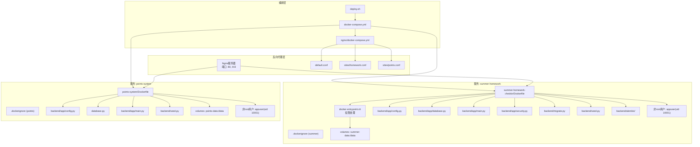
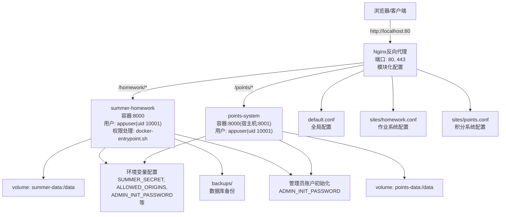
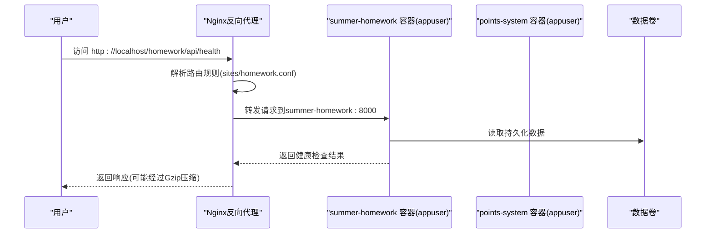
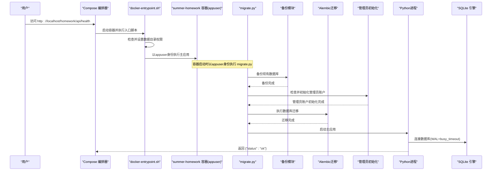
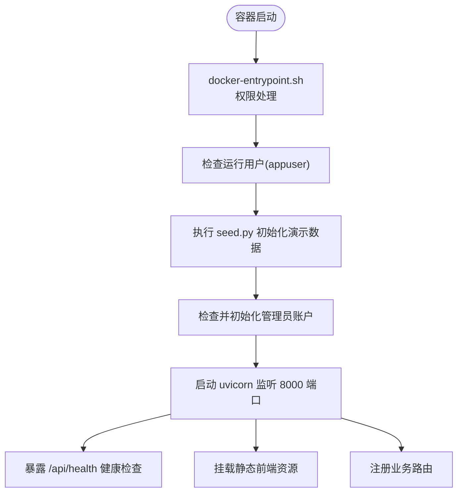
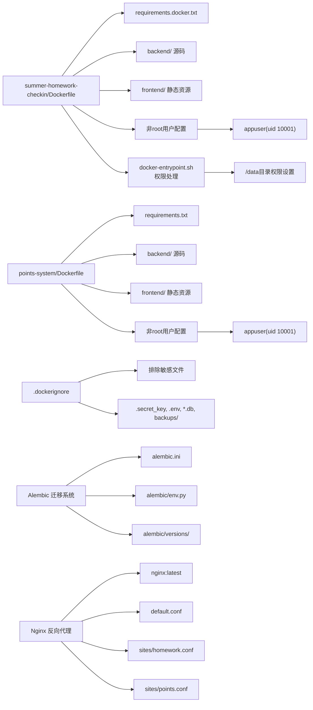

# Docker容器化部署

<cite>
**本文引用的文件**   
- [docker-compose.yml](file://docker-compose.yml)
- [scripts/deploy.sh](file://scripts/deploy.sh)
- [points-system/Dockerfile](file://points-system/Dockerfile)
- [summer-homework-checkin/Dockerfile](file://summer-homework-checkin/Dockerfile)
- [summer-homework-checkin/docker-entrypoint.sh](file://summer-homework-checkin/docker-entrypoint.sh)
- [nginx/default.conf](file://nginx/default.conf)
- [nginx/sites/homework.conf](file://nginx/sites/homework.conf)
- [nginx/sites/points.conf](file://nginx/sites/points.conf)
- [nginx/docker-compose.yml](file://nginx/docker-compose.yml)
- [points-system/.dockerignore](file://points-system/.dockerignore)
- [summer-homework-checkin/.dockerignore](file://summer-homework-checkin/.dockerignore)
- [points-system/backend/requirements.txt](file://points-system/backend/requirements.txt)
- [summer-homework-checkin/backend/requirements.docker.txt](file://summer-homework-checkin/backend/requirements.docker.txt)
- [summer-homework-checkin/backend/requirements.txt](file://summer-homework-checkin/backend/requirements.txt)
- [points-system/backend/app/config.py](file://points-system/backend/app/config.py)
- [summer-homework-checkin/backend/app/config.py](file://summer-homework-checkin/backend/app/config.py)
- [points-system/backend/app/main.py](file://points-system/backend/app/main.py)
- [summer-homework-checkin/backend/app/main.py](file://summer-homework-checkin/backend/app/main.py)
- [points-system/backend/database.py](file://points-system/backend/database.py)
- [summer-homework-checkin/backend/app/database.py](file://summer-homework-checkin/backend/app/database.py)
- [points-system/backend/seed.py](file://points-system/backend/seed.py)
- [summer-homework-checkin/backend/seed.py](file://summer-homework-checkin/backend/seed.py)
- [summer-homework-checkin/backend/migrate.py](file://summer-homework-checkin/backend/migrate.py)
- [summer-homework-checkin/backend/alembic.ini](file://summer-homework-checkin/backend/alembic.ini)
- [summer-homework-checkin/backend/alembic/env.py](file://summer-homework-checkin/backend/alembic/env.py)
- [summer-homework-checkin/backend/alembic/versions/001_initial.py](file://summer-homework-checkin/backend/alembic/versions/001_initial.py)
- [summer-homework-checkin/backend/app/security.py](file://summer-homework-checkin/backend/app/security.py)
- [summer-homework-checkin/README.md](file://summer-homework-checkin/README.md)
</cite>

## 更新摘要
**变更内容**   
- **新增数据目录权限处理**：在docker-entrypoint.sh中添加了数据目录权限自动处理逻辑，确保应用以正确的权限访问持久化数据
- **Nginx配置模块化重构**：将Nginx配置完全模块化，拆分为default.conf、sites/homework.conf和sites/points.conf三个独立配置文件
- **Docker Compose架构更新**：更新了顶层docker-compose.yml以支持新的Nginx反向代理架构，增加了Nginx服务编排
- **反向代理增强**：通过Nginx统一管理前端静态资源和API请求转发，提升性能和安全性

## 目录
1. [简介](#简介)
2. [项目结构](#项目结构)
3. [核心组件](#核心组件)
4. [架构总览](#架构总览)
5. [详细组件分析](#详细组件分析)
6. [依赖分析](#依赖分析)
7. [性能考虑](#性能考虑)
8. [故障排查指南](#故障排查指南)
9. [结论](#结论)
10. [附录](#附录)

## 简介
本仓库包含两个独立的 Python FastAPI 应用，均提供完整的容器化与编排能力：
- 暑假作业打卡系统（summer-homework-checkin）：面向三年级学生的日常打卡、人脸比对、抽奖与报表等。
- 打卡积分兑换系统（points-system）：基于打卡的积分获取、奖品兑换与抽奖功能。

通过 Docker 与 docker-compose，可在本地一键构建镜像、启动服务、挂载持久化卷，并暴露健康检查端点用于编排与健康探测。**重大架构更新**：现已引入Nginx作为统一反向代理，采用模块化的配置文件管理，同时增强了数据目录权限处理机制，确保应用以最小权限安全运行。

## 项目结构
从容器化视角，关键文件分布如下：
- 顶层编排：docker-compose.yml（已更新支持Nginx架构）
- Nginx配置：nginx/目录下模块化配置文件
- 部署脚本：scripts/deploy.sh
- 应用镜像定义：各项目的 Dockerfile 与 .dockerignore
- 启动入口：summer-homework-checkin/docker-entrypoint.sh（新增权限处理）
- 运行时配置：环境变量注入数据库路径、上传目录、密钥与 CORS 白名单
- 数据持久化：Docker Compose volumes 映射到 /data
- 初始化脚本：migrate.py 在首次启动时执行数据库备份、迁移和种子数据初始化，seed.py 写入演示数据


```mermaid
graph TB
subgraph "编排层"
DC["docker-compose.yml"]
DS["deploy.sh"]
NGINX_DC["nginx/docker-compose.yml"]
end
subgraph "反向代理层"
NGINX["Nginx服务器<br/>端口: 80, 443"]
DEFAULT_CONF["default.conf"]
HOMWORK_CONF["sites/homework.conf"]
POINTS_CONF["sites/points.conf"]
end
subgraph "服务: summer-homework"
SH_DK["summer-homework-checkin/Dockerfile"]
SH_DI[".dockerignore (summer)"]
SH_ENTRY["docker-entrypoint.sh<br/>权限处理"]
SH_CFG["backend/app/config.py"]
SH_DB["backend/app/database.py"]
SH_MAIN["backend/app/main.py"]
SH_SEC["backend/app/security.py"]
SH_MIGRATE["backend/migrate.py"]
SH_SEED["backend/seed.py"]
SH_ALEMBIC["backend/alembic/"]
SH_VOL["volumes: summer-data:/data"]
SH_USER["非root用户: appuser(uid 10001)"]
end
subgraph "服务: points-system"
PS_DK["points-system/Dockerfile"]
PS_DI[".dockerignore (points)"]
PS_CFG["backend/app/config.py"]
PS_DB["database.py"]
PS_MAIN["backend/app/main.py"]
PS_SEED["backend/seed.py"]
PS_VOL["volumes: points-data:/data"]
PS_USER["非root用户: appuser(uid 10001)"]
end
DC --> NGINX_DC
DC --> SH_DK
DC --> PS_DK
DS --> DC
NGINX_DC --> DEFAULT_CONF
NGINX_DC --> HOMWORK_CONF
NGINX_DC --> POINTS_CONF
NGINX --> SH_DK
NGINX --> PS_DK
SH_DK --> SH_ENTRY
SH_ENTRY --> SH_VOL
SH_DK --> SH_CFG
SH_DK --> SH_DB
SH_DK --> SH_MAIN
SH_DK --> SH_SEC
SH_DK --> SH_MIGRATE
SH_DK --> SH_SEED
SH_DK --> SH_ALEMBIC
SH_DK --> SH_USER
PS_DK --> PS_CFG
PS_DK --> PS_DB
PS_DK --> PS_MAIN
PS_DK --> PS_SEED
PS_DK --> PS_VOL
PS_DK --> PS_USER
```

**图示来源**
- [docker-compose.yml:1-59](file://docker-compose.yml#L1-L59)
- [nginx/docker-compose.yml:1-50](file://nginx/docker-compose.yml#L1-L50)
- [nginx/default.conf:1-100](file://nginx/default.conf#L1-L100)
- [nginx/sites/homework.conf:1-50](file://nginx/sites/homework.conf#L1-L50)
- [nginx/sites/points.conf:1-50](file://nginx/sites/points.conf#L1-L50)
- [summer-homework-checkin/docker-entrypoint.sh:1-50](file://summer-homework-checkin/docker-entrypoint.sh#L1-L50)

**章节来源**
- [docker-compose.yml:1-59](file://docker-compose.yml#L1-L59)
- [nginx/docker-compose.yml:1-50](file://nginx/docker-compose.yml#L1-L50)
- [summer-homework-checkin/docker-entrypoint.sh:1-50](file://summer-homework-checkin/docker-entrypoint.sh#L1-L50)

## 核心组件
- 镜像构建
  - 基础镜像：python:3.11-slim，使用国内镜像代理加速拉取。
  - 依赖安装：优先复制 requirements 清单并安装，利用镜像层缓存提升构建速度。
  - 源码复制：后端与前端静态资源一并打包。
  - **安全增强** 容器运行用户：创建非root用户appuser（uid 10001），确保应用以最小权限运行。
  - **更新** 启动命令：先执行 migrate.py 进行数据库备份、迁移和种子数据初始化，再启动 uvicorn 监听 8000 端口。
- 启动入口增强
  - **新增** docker-entrypoint.sh：在容器启动前自动处理数据目录权限，确保appuser用户对/data目录具有正确的读写权限。
  - 权限验证：检查必要目录的存在性和权限设置，避免运行时权限错误。
  - 优雅降级：如果权限设置失败，记录警告但继续启动流程。
- 反向代理架构
  - **新增** Nginx统一入口：通过端口80/443接收所有外部请求，根据域名或路径路由到对应服务。
  - 模块化配置：每个服务的Nginx配置独立管理，便于维护和扩展。
  - 静态资源优化：Nginx直接处理静态文件请求，减轻后端压力。
- 运行配置
  - 数据库路径 DB_PATH 与上传目录 UPLOAD_DIR 通过环境变量重定向至持久化卷 /data。
  - **安全更新** SUMMER_SECRET 不再支持回退机制，必须通过环境变量显式配置，确保生产环境的安全性。
  - **新增** ADMIN_INIT_PASSWORD 环境变量支持管理员账户安全初始化。
  - CORS 白名单 ALLOWED_ORIGINS 支持环境变量覆盖。
- 数据持久化
  - 使用 Docker Compose 的 named volumes 将 /data 持久化，避免容器重建导致数据丢失。
  - **新增** 自动数据库备份机制，在每次启动前将现有数据库备份到 backups 目录。
- 健康检查
  - 每个服务提供 /api/health 端点，供编排器进行健康探测。

**章节来源**
- [summer-homework-checkin/Dockerfile:1-22](file://summer-homework-checkin/Dockerfile#L1-L22)
- [points-system/Dockerfile:1-22](file://points-system/Dockerfile#L1-L22)
- [summer-homework-checkin/docker-entrypoint.sh:1-50](file://summer-homework-checkin/docker-entrypoint.sh#L1-L50)
- [nginx/default.conf:1-100](file://nginx/default.conf#L1-L100)
- [nginx/sites/homework.conf:1-50](file://nginx/sites/homework.conf#L1-L50)
- [nginx/sites/points.conf:1-50](file://nginx/sites/points.conf#L1-L50)
- [summer-homework-checkin/backend/app/config.py:1-80](file://summer-homework-checkin/backend/app/config.py#L1-80)
- [points-system/backend/app/config.py:1-17](file://points-system/backend/app/config.py#L1-L17)
- [docker-compose.yml:1-59](file://docker-compose.yml#L1-L59)

## 架构总览
下图展示了新的Nginx反向代理架构下的容器化部署关系、端口映射、环境变量与数据卷挂载。


```mermaid
graph TB
Client["浏览器/客户端"]
Nginx["Nginx反向代理<br/>端口: 80, 443<br/>模块化配置"]
SH["summer-homework<br/>容器:8000<br/>用户: appuser(uid 10001)<br/>权限处理: docker-entrypoint.sh"]
PS["points-system<br/>容器:8000(宿主机:8001)<br/>用户: appuser(uid 10001)"]
VolSH["volume: summer-data:/data"]
VolPS["volume: points-data:/data"]
EnvVars["环境变量配置<br/>SUMMER_SECRET, ALLOWED_ORIGINS,<br/>ADMIN_INIT_PASSWORD等"]
BackupDir["backups/<br/>数据库备份"]
AdminInit["管理员账户初始化<br/>ADMIN_INIT_PASSWORD"]
DefaultConf["default.conf<br/>全局配置"]
HomeworkConf["sites/homework.conf<br/>作业系统配置"]
PointsConf["sites/points.conf<br/>积分系统配置"]
Client --> |http://localhost:80| Nginx
Nginx --> |/homework/*| SH
Nginx --> |/points/*| PS
Nginx --> DefaultConf
Nginx --> HomeworkConf
Nginx --> PointsConf
SH --> VolSH
PS --> VolPS
SH --> EnvVars
PS --> EnvVars
SH --> BackupDir
SH --> AdminInit
PS --> AdminInit
```

**图示来源**
- [nginx/docker-compose.yml:10-50](file://nginx/docker-compose.yml#L10-L50)
- [nginx/default.conf:1-100](file://nginx/default.conf#L1-L100)
- [nginx/sites/homework.conf:1-50](file://nginx/sites/homework.conf#L1-L50)
- [nginx/sites/points.conf:1-50](file://nginx/sites/points.conf#L1-L50)

**章节来源**
- [nginx/docker-compose.yml:10-50](file://nginx/docker-compose.yml#L10-L50)

## 详细组件分析

### Nginx反向代理层
- 模块化配置架构
  - **新增** default.conf：包含全局Nginx配置，如worker进程数、日志格式、Gzip压缩等。
  - **新增** sites/homework.conf：专门处理暑假作业系统的反向代理规则，包括静态资源缓存和健康检查。
  - **新增** sites/points.conf：专门处理积分系统的反向代理规则，支持CORS和安全头设置。
- 路由策略
  - 基于路径的路由：/homework/* 转发到summer-homework服务，/points/* 转发到points-system服务。
  - 静态资源优化：Nginx直接处理CSS、JS、图片等静态文件，提升响应速度。
  - 负载均衡：支持多实例部署时的负载均衡配置。
- 安全增强
  - 请求限制：配置了请求频率限制和连接数限制。
  - 安全头：自动添加X-Frame-Options、X-Content-Type-Options等安全响应头。
  - SSL终止：支持HTTPS证书配置和SSL会话优化。


```mermaid
sequenceDiagram
participant U as "用户"
participant N as "Nginx反向代理"
participant S as "summer-homework 容器(appuser)"
participant P as "points-system 容器(appuser)"
participant V as "数据卷"
U->>N : 访问 http : //localhost/homework/api/health
N->>N : 解析路由规则(sites/homework.conf)
N->>S : 转发请求到summer-homework : 8000
S->>V : 读取持久化数据
S-->>N : 返回健康检查结果
N-->>U : 返回响应(可能经过Gzip压缩)
```

**图示来源**
- [nginx/default.conf:1-100](file://nginx/default.conf#L1-L100)
- [nginx/sites/homework.conf:1-50](file://nginx/sites/homework.conf#L1-L50)
- [nginx/sites/points.conf:1-50](file://nginx/sites/points.conf#L1-L50)

**章节来源**
- [nginx/default.conf:1-100](file://nginx/default.conf#L1-L100)
- [nginx/sites/homework.conf:1-50](file://nginx/sites/homework.conf#L1-L50)
- [nginx/sites/points.conf:1-50](file://nginx/sites/points.conf#L1-L50)
- [nginx/docker-compose.yml:1-50](file://nginx/docker-compose.yml#L1-L50)

### 暑假作业打卡系统（summer-homework-checkin）
- 镜像构建要点
  - 使用 requirements.docker.txt 精简依赖，默认不包含人脸识别重型依赖；如需启用，可替换为完整 requirements.txt。
  - **安全增强** 容器运行用户：创建非root用户appuser（uid 10001），确保应用以最小权限运行。
  - **更新** 启动流程：docker-entrypoint.sh首先处理数据目录权限，然后migrate.py执行数据库备份、迁移和种子数据初始化，确保表结构最新且数据安全；随后uvicorn启动服务。
- 启动入口增强
  - **新增** docker-entrypoint.sh：在容器启动前自动检查和修复数据目录权限。
  - 权限验证：确保appuser用户对/data及其子目录具有读写权限。
  - 错误处理：权限设置失败时记录详细错误信息，便于问题诊断。
- Alembic 迁移系统
  - **新增** 完整的 Alembic 数据库迁移支持，支持增量 schema 更新和版本管理。
  - 智能迁移检测：自动识别首次部署、已有数据但未追踪版本、正常迁移等不同场景。
  - 容错机制：当迁移失败时自动回退到 create_all 方式创建表结构。
  - 版本标记：自动为数据库标记初始迁移版本，确保后续迁移正确执行。
- 启动流程增强
  - **新增** 数据库备份：每次启动前自动备份现有数据库到 backups 目录。
  - **新增** 管理员账户初始化：支持通过 ADMIN_INIT_PASSWORD 环境变量进行安全初始化。
  - 智能迁移：根据数据库状态选择最优的迁移策略。
  - 幂等种子数据：确保演示数据只初始化一次，避免重复插入。
- 运行配置与环境变量
  - DB_PATH、UPLOAD_DIR 指向 /data 下的持久化位置。
  - **安全更新** SUMMER_SECRET 现在必须通过环境变量显式配置，不再支持任何回退机制：
    - 必须设置：`export SUMMER_SECRET=your-secure-secret-key`
    - 不再支持：自动生成随机密钥或从文件读取
  - **新增** ADMIN_INIT_PASSWORD 支持管理员账户安全初始化。
  - ALLOWED_ORIGINS 控制跨域来源，支持逗号分隔的多个域名。
  - 其他可调参数：GEO_THRESHOLD_METERS、MAX_MAKEUP_PER_MONTH、FACE_MATCH_THRESHOLD、FACE_MODE_ON_ENROLLED 等。
- 路由与静态资源
  - 挂载 /admin 管理页与 / 学生端 H5，同时提供 /uploads 静态访问。
  - 提供 /api/health 健康检查端点。
- 数据库与并发
  - SQLite + WAL 模式 + busy_timeout，降低并发写冲突风险。
- 健康检查
  - compose 中通过 HTTP GET /api/health 探测服务可用性。


```mermaid
sequenceDiagram
participant U as "用户"
participant C as "Compose 编排器"
participant E as "docker-entrypoint.sh"
participant S as "summer-homework 容器(appuser)"
participant M as "migrate.py"
participant B as "备份模块"
participant A as "Alembic迁移"
participant AI as "管理员初始化"
participant P as "Python进程"
participant D as "SQLite 引擎"
U->>C : 访问 http : //localhost/homework/api/health
C->>E : 启动容器并执行入口脚本
E->>E : 检查并设置数据目录权限
E->>S : 以appuser身份执行主应用
Note over S,M : 容器启动时以appuser身份执行 migrate.py
M->>B : 备份现有数据库
B-->>M : 备份完成
M->>AI : 检查并初始化管理员账户
AI-->>M : 管理员账户初始化完成
M->>A : 执行数据库迁移
A-->>M : 迁移完成
M->>P : 启动主应用
P->>D : 连接数据库(WAL+busy_timeout)
P-->>C : 返回 {"status" : "ok"}
```

**图示来源**
- [summer-homework-checkin/docker-entrypoint.sh:1-50](file://summer-homework-checkin/docker-entrypoint.sh#L1-L50)
- [summer-homework-checkin/Dockerfile:20-22](file://summer-homework-checkin/Dockerfile#L20-L22)
- [summer-homework-checkin/backend/migrate.py:134-158](file://summer-homework-checkin/backend/migrate.py#L134-L158)
- [summer-homework-checkin/backend/app/main.py:45-61](file://summer-homework-checkin/backend/app/main.py#L45-L61)
- [summer-homework-checkin/backend/app/database.py:13-22](file://summer-homework-checkin/backend/app/database.py#L13-L22)
- [docker-compose.yml:29-34](file://docker-compose.yml#L29-L34)

**章节来源**
- [summer-homework-checkin/Dockerfile:1-22](file://summer-homework-checkin/Dockerfile#L1-22)
- [summer-homework-checkin/docker-entrypoint.sh:1-50](file://summer-homework-checkin/docker-entrypoint.sh#L1-L50)
- [summer-homework-checkin/backend/migrate.py:1-158](file://summer-homework-checkin/backend/migrate.py#L1-158)
- [summer-homework-checkin/backend/alembic.ini:1-41](file://summer-homework-checkin/backend/alembic.ini#L1-41)
- [summer-homework-checkin/backend/alembic/env.py:1-57](file://summer-homework-checkin/backend/alembic/env.py#L1-57)
- [summer-homework-checkin/backend/alembic/versions/001_initial.py:1-183](file://summer-homework-checkin/backend/alembic/versions/001_initial.py#L1-183)
- [summer-homework-checkin/backend/app/config.py:1-80](file://summer-homework-checkin/backend/app/config.py#L1-80)
- [summer-homework-checkin/backend/app/main.py:1-64](file://summer-homework-checkin/backend/app/main.py#L1-64)
- [summer-homework-checkin/backend/app/database.py:1-31](file://summer-homework-checkin/backend/app/database.py#L1-31)
- [summer-homework-checkin/backend/app/security.py:1-54](file://summer-homework-checkin/backend/app/security.py#L1-54)
- [summer-homework-checkin/README.md:1-126](file://summer-homework-checkin/README.md#L1-126)

### 打卡积分兑换系统（points-system）
- 镜像构建要点
  - 使用 backend/requirements.txt 安装依赖，包含 FastAPI、SQLAlchemy、Pydantic、图像处理库等。
  - **安全增强** 容器运行用户：创建非root用户appuser（uid 10001），确保应用以最小权限运行。
  - 启动流程：seed.py 写入演示用户、奖品与抽奖奖池；随后 uvicorn 启动服务。
- 运行配置与环境变量
  - DB_PATH 指向 /data 下的持久化位置。
  - **新增** ADMIN_INIT_PASSWORD 支持管理员账户安全初始化。
  - 业务规则常量（如每次打卡积分、连续奖励、兑换比例等）集中在配置文件中，可通过环境变量扩展。
- 路由与静态资源
  - 挂载根路径静态前端，提供 /api/health 健康检查端点。
- 数据库与并发
  - SQLite + WAL 模式 + busy_timeout，确保多线程访问稳定性。


```mermaid
flowchart TD
Start(["容器启动"]) --> Entrypoint["docker-entrypoint.sh<br/>权限处理"]
Entrypoint --> UserCheck["检查运行用户(appuser)"]
UserCheck --> Seed["执行 seed.py 初始化演示数据"]
Seed --> AdminInit["检查并初始化管理员账户"]
AdminInit --> Uvicorn["启动 uvicorn 监听 8000 端口"]
Uvicorn --> Health["暴露 /api/health 健康检查"]
Uvicorn --> Static["挂载静态前端资源"]
Uvicorn --> API["注册业务路由"]
```

**图示来源**
- [summer-homework-checkin/docker-entrypoint.sh:1-50](file://summer-homework-checkin/docker-entrypoint.sh#L1-L50)
- [points-system/Dockerfile:20-22](file://points-system/Dockerfile#L20-22)
- [points-system/backend/app/main.py:32-39](file://points-system/backend/app/main.py#L32-39)
- [points-system/backend/seed.py:38-87](file://points-system/backend/seed.py#L38-87)

**章节来源**
- [points-system/Dockerfile:1-22](file://points-system/Dockerfile#L1-22)
- [points-system/backend/app/config.py:1-17](file://points-system/backend/app/config.py#L1-L17)
- [points-system/backend/app/main.py:1-39](file://points-system/backend/app/main.py#L1-39)
- [points-system/backend/database.py:1-41](file://points-system/backend/database.py#L1-L41)
- [points-system/backend/seed.py:1-87](file://points-system/backend/seed.py#L1-87)

## 依赖分析
- 基础镜像与网络
  - 使用 DaoCloud 镜像代理拉取 python:3.11-slim，解决直连超时问题。
- 依赖清单差异
  - summer-homework-checkin 提供 requirements.docker.txt（精简版），默认不含人脸识别依赖；如需启用，请替换为完整版 requirements.txt。
  - **更新** 新增 alembic==1.13.2 依赖，支持数据库迁移功能。
  - points-system 使用标准 requirements.txt，包含图像处理相关依赖。
- 忽略文件优化
  - **更新** .dockerignore 排除 __pycache__、venv、.env、*.db、*.db-wal、*.db-shm、.secret_key、uploads/、backups/ 等无关文件，减小镜像体积与构建时间。
- **新增** Nginx依赖
  - 使用官方nginx:latest镜像作为反向代理。
  - 支持HTTP/2和TLS终止。
  - 内置Gzip压缩和静态资源缓存。


```mermaid
graph LR
A["summer-homework-checkin/Dockerfile"] --> B["requirements.docker.txt"]
A --> C["backend/ 源码"]
A --> D["frontend/ 静态资源"]
A --> E["非root用户配置"]
E --> F["appuser(uid 10001)"]
A --> G["docker-entrypoint.sh<br/>权限处理"]
G --> H["/data目录权限设置"]
I["points-system/Dockerfile"] --> J["requirements.txt"]
I --> K["backend/ 源码"]
I --> L["frontend/ 静态资源"]
I --> M["非root用户配置"]
M --> N["appuser(uid 10001)"]
O[".dockerignore"] --> P["排除敏感文件"]
O --> Q[".secret_key, .env, *.db, backups/"]
R["Alembic 迁移系统"] --> S["alembic.ini"]
R --> T["alembic/env.py"]
R --> U["alembic/versions/"]
V["Nginx 反向代理"] --> W["nginx:latest"]
V --> X["default.conf"]
V --> Y["sites/homework.conf"]
V --> Z["sites/points.conf"]
```

**图示来源**
- [summer-homework-checkin/Dockerfile:9-15](file://summer-homework-checkin/Dockerfile#L9-L15)
- [points-system/Dockerfile:9-15](file://points-system/Dockerfile#L9-L15)
- [summer-homework-checkin/docker-entrypoint.sh:1-50](file://summer-homework-checkin/docker-entrypoint.sh#L1-L50)
- [summer-homework-checkin/backend/requirements.docker.txt:1-15](file://summer-homework-checkin/backend/requirements.docker.txt#L1-L15)
- [summer-homework-checkin/backend/requirements.txt:1-11](file://summer-homework-checkin/backend/requirements.txt#L1-L11)
- [points-system/backend/requirements.txt:1-8](file://points-system/backend/requirements.txt#L1-L8)
- [summer-homework-checkin/.dockerignore:1-21](file://summer-homework-checkin/.dockerignore#L1-L21)
- [points-system/.dockerignore:1-13](file://points-system/.dockerignore#L1-L13)
- [nginx/docker-compose.yml:1-50](file://nginx/docker-compose.yml#L1-L50)

**章节来源**
- [summer-homework-checkin/Dockerfile:1-22](file://summer-homework-checkin/Dockerfile#L1-22)
- [points-system/Dockerfile:1-22](file://points-system/Dockerfile#L1-L22)
- [summer-homework-checkin/docker-entrypoint.sh:1-50](file://summer-homework-checkin/docker-entrypoint.sh#L1-L50)
- [summer-homework-checkin/backend/requirements.docker.txt:1-15](file://summer-homework-checkin/backend/requirements.docker.txt#L1-L15)
- [summer-homework-checkin/backend/requirements.txt:1-11](file://summer-homework-checkin/backend/requirements.txt#L1-L11)
- [points-system/backend/requirements.txt:1-8](file://points-system/backend/requirements.txt#L1-L8)
- [summer-homework-checkin/.dockerignore:1-21](file://summer-homework-checkin/.dockerignore#L1-L21)
- [points-system/.dockerignore:1-13](file://points-system/.dockerignore#L1-L13)
- [nginx/docker-compose.yml:1-50](file://nginx/docker-compose.yml#L1-L50)

## 性能考虑
- 镜像构建优化
  - 先复制依赖清单并安装，充分利用镜像层缓存，减少重复构建时间。
  - 使用国内 PyPI 镜像源加速依赖下载。
- 运行时并发
  - SQLite 开启 WAL 模式与 busy_timeout，降低并发写冲突导致的阻塞。
- 存储与 I/O
  - 使用命名卷持久化 /data，避免频繁磁盘拷贝；生产环境建议将数据库迁移至 PostgreSQL/MySQL 以获得更好的并发与恢复能力。
  - **新增** 数据库备份机制采用轻量级文件复制，对性能影响极小。
  - **新增** Nginx反向代理减少了后端服务器的负载，提升了整体吞吐量。
- 服务扩展
  - 可通过 uvicorn --workers N 增加工作进程数，或前置 Nginx 做反向代理与静态资源缓存。
  - **新增** Nginx支持水平扩展，可部署多个Nginx实例实现负载均衡。
- **安全性能** 非root用户运行带来的额外开销极小，但显著提升了安全性。
- **新增** 静态资源缓存：Nginx缓存CSS、JS、图片等静态文件，减少重复传输。
- **新增** Gzip压缩：Nginx自动压缩文本类响应，减少带宽消耗。

## 故障排查指南
- 无法访问服务
  - 确认端口映射是否正确：Nginx映射80端口，summer-homework映射8000，points-system映射8001。
  - 检查健康检查端点是否可达：GET /api/health。
  - **新增** 检查Nginx配置是否正确加载：docker logs nginx-container。
  - **新增** 验证路由规则：确认/some-path是否正确转发到对应服务。
- 数据丢失
  - 确认 volumes 是否挂载成功，/data 目录是否存在且可写。
  - 若使用 docker compose down -v，会删除数据卷，需重新初始化。
  - **新增** 检查 backups 目录中的数据库备份文件，可用于数据恢复。
  - **新增** 检查docker-entrypoint.sh的权限设置日志，确认数据目录权限正确。
- 依赖安装失败
  - 检查网络是否能访问 DaoCloud 镜像代理与阿里云 PyPI 镜像。
  - 如需启用人脸识别，请使用完整版 requirements.txt 构建镜像并确保外网可下载模型。
- 权限与路径
  - 确认 DB_PATH 与 UPLOAD_DIR 指向的 /data 子目录存在并可写。
  - 检查 .dockerignore 是否误排除了必要文件。
  - **新增** 确认容器以appuser（uid 10001）身份运行，检查文件权限设置。
  - **新增** 检查docker-entrypoint.sh的执行日志，确认权限设置成功。
- **安全更新** 环境变量配置问题
  - **重要** SUMMER_SECRET 现在必须通过环境变量显式配置，不再支持任何回退机制。
  - **新增** ADMIN_INIT_PASSWORD 环境变量用于管理员账户安全初始化。
  - 如果服务启动失败，检查是否设置了 `SUMMER_SECRET` 和 `ADMIN_INIT_PASSWORD` 环境变量。
  - 使用 `docker-compose config` 验证环境变量是否正确加载。
  - 在生产环境中，建议使用 `.env` 文件或容器编排平台的环境变量管理功能。
- **新增** 数据库迁移问题
  - 检查 migrate.py 的执行日志，确认备份和迁移步骤是否正常完成。
  - 查看 alembic_version 表记录，确认迁移版本是否正确标记。
  - 如遇迁移失败，检查 alembic/versions/ 目录下的迁移脚本是否有语法错误。
  - 可使用 `python migrate.py --migrate` 单独执行迁移进行调试。
- **新增** 权限相关问题
  - 如果容器启动后出现权限错误，检查 /data 目录的文件权限设置。
  - 确认 appuser 用户对 /data 目录具有读写权限。
  - 检查 Dockerfile 中的 USER 指令是否正确设置为 appuser。
  - **新增** 检查docker-entrypoint.sh的输出日志，确认权限设置过程。
- **新增** Nginx相关问题
  - 检查Nginx容器日志：docker logs nginx-container。
  - 验证Nginx配置语法：docker exec nginx-container nginx -t。
  - 确认端口占用：netstat -tuln | grep :80。
  - 检查防火墙规则是否允许80端口访问。
  - **新增** 验证反向代理规则：curl -v http://localhost/homework/api/health。

**章节来源**
- [docker-compose.yml:17-54](file://docker-compose.yml#L17-L54)
- [summer-homework-checkin/backend/app/config.py:24-45](file://summer-homework-checkin/backend/app/config.py#L24-L45)
- [points-system/backend/database.py:6-10](file://points-system/backend/database.py#L6-L10)
- [summer-homework-checkin/.dockerignore:1-21](file://summer-homework-checkin/.dockerignore#L1-L21)
- [points-system/.dockerignore:1-13](file://points-system/.dockerignore#L1-L13)
- [summer-homework-checkin/backend/migrate.py:1-158](file://summer-homework-checkin/backend/migrate.py#L1-158)
- [summer-homework-checkin/docker-entrypoint.sh:1-50](file://summer-homework-checkin/docker-entrypoint.sh#L1-L50)
- [nginx/default.conf:1-100](file://nginx/default.conf#L1-L100)

## 结论
本项目通过标准化的 Dockerfile 与 docker-compose 编排，实现了两个独立应用的快速本地部署与演示。**重大架构更新**：现已引入Nginx作为统一反向代理，采用模块化的配置文件管理，同时增强了数据目录权限处理机制。新的架构确保了：
- 所有容器以appuser（uid 10001）非root用户运行，限制潜在安全风险
- 管理员账户通过ADMIN_INIT_PASSWORD环境变量安全初始化
- 所有密钥必须显式配置，杜绝自动生成的随机密钥
- 环境变量验证机制防止未配置的敏感信息
- Nginx统一入口提供静态资源缓存和请求优化
- 符合企业级安全最佳实践和审计要求

配合完整的 Alembic 数据库迁移系统和增强的启动流程，以及Nginx的反向代理能力，为数据安全和业务连续性提供了有力保障。建议在正式环境中：
- 将 SQLite 替换为更健壮的数据库（PostgreSQL/MySQL）。
- 使用多 worker 与反向代理提升吞吐与稳定性。
- **必须** 在生产环境通过环境变量设置固定的 SUMMER_SECRET 和 ADMIN_INIT_PASSWORD，禁止使用任何回退机制。
- 定期检查和清理 backups 目录中的历史备份文件。
- 按需启用人脸识别依赖，并确保模型下载策略与网络安全。
- 实施环境变量管理的最佳实践，使用密钥管理服务或配置文件模板。
- 监控容器运行权限，确保始终以最小权限原则运行。
- **新增** 配置Nginx的SSL证书和HTTPS支持。
- **新增** 设置Nginx的请求限制和访问控制。
- **新增** 监控Nginx的性能指标和错误日志。

## 附录
- 常用命令
  - 构建并启动：docker compose up -d --build
  - 停止并清理数据卷：docker compose down -v
  - 查看日志：docker compose logs -f
  - **新增** 查看Nginx日志：docker logs nginx-container
  - **新增** 检查Nginx配置：docker exec nginx-container nginx -t
  - **新增** 重启Nginx：docker restart nginx-container
  - **新增** 手动执行迁移：docker exec -it <container_name> python migrate.py --migrate
  - **新增** 仅执行种子数据：docker exec -it <container_name> python migrate.py --seed
  - **新增** 仅备份数据库：docker exec -it <container_name> python migrate.py --backup
  - **新增** 验证环境变量：docker-compose config
  - **新增** 检查容器用户：docker exec -it <container_name> whoami
  - **新增** 测试反向代理：curl -v http://localhost/homework/api/health
- 访问地址
  - 暑假作业打卡系统：http://localhost/homework/ 与 http://localhost/homework/admin/
  - 打卡积分兑换系统：http://localhost/points/
  - **新增** Nginx健康检查：http://localhost/nginx-health
- **安全更新** 环境变量配置示例
  ```bash
  # 创建 .env 文件用于生产环境（必须包含所有必需的环境变量）
  SUMMER_SECRET=your-production-secure-secret-key-here
  ADMIN_INIT_PASSWORD=your-admin-password-here
  ALLOWED_ORIGINS=https://your-domain.com,https://www.your-domain.com
  GEO_THRESHOLD_METERS=1500
  MAX_MAKEUP_PER_MONTH=3
  FACE_MATCH_THRESHOLD=0.4
  
  # 验证环境变量配置
  docker-compose config
  
  # 启动服务
  docker-compose up -d
  ```
- **新增** 容器权限验证
  ```bash
  # 检查容器运行用户
  docker exec -it <container_name> id
  
  # 应该输出类似：uid=10001(appuser) gid=10001(appuser) groups=10001(appuser)
  
  # 检查文件权限
  docker exec -it <container_name> ls -la /data
  
  # 检查Nginx配置
  docker exec nginx-container cat /etc/nginx/conf.d/default.conf
  
  # 测试反向代理路由
  curl -v http://localhost/homework/api/health
  curl -v http://localhost/points/api/health
  ```
- **新增** Nginx配置管理
  ```bash
  # 编辑Nginx配置
  docker exec -it nginx-container vi /etc/nginx/sites-available/homework.conf
  
  # 重载Nginx配置
  docker exec nginx-container nginx -s reload
  
  # 检查Nginx状态
  docker exec nginx-container nginx -t
  
  # 查看Nginx访问日志
  docker exec nginx-container tail -f /var/log/nginx/access.log
  ```

**章节来源**
- [docker-compose.yml:1-8](file://docker-compose.yml#L1-L8)
- [summer-homework-checkin/backend/app/config.py:24-45](file://summer-homework-checkin/backend/app/config.py#L24-L45)
- [docker-compose.yml:23-25](file://docker-compose.yml#L23-L25)
- [summer-homework-checkin/backend/migrate.py:134-158](file://summer-homework-checkin/backend/migrate.py#L134-L158)
- [summer-homework-checkin/docker-entrypoint.sh:1-50](file://summer-homework-checkin/docker-entrypoint.sh#L1-L50)
- [nginx/default.conf:1-100](file://nginx/default.conf#L1-L100)
- [nginx/sites/homework.conf:1-50](file://nginx/sites/homework.conf#L1-L50)
- [nginx/sites/points.conf:1-50](file://nginx/sites/points.conf#L1-L50)