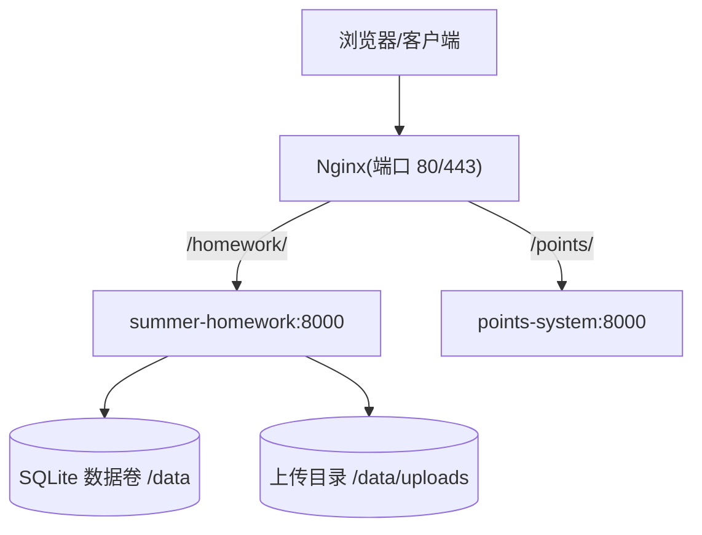
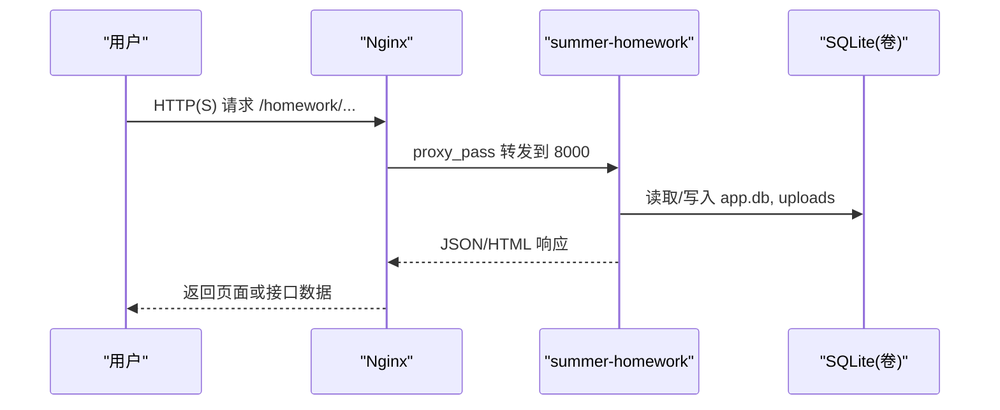
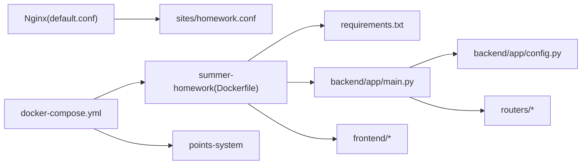

# 生产部署检查清单

<cite>
**本文引用的文件**
- [summer-homework-checkin/docs/PRODUCTION_DEPLOY_CHECKLIST.md](file://summer-homework-checkin/docs/PRODUCTION_DEPLOY_CHECKLIST.md)
- [summer-homework-checkin/docs/DEPLOYMENT.md](file://summer-homework-checkin/docs/DEPLOYMENT.md)
- [scripts/deploy.sh](file://scripts/deploy.sh)
- [docker-compose.yml](file://docker-compose.yml)
- [nginx/docker-compose.yml](file://nginx/docker-compose.yml)
- [nginx/default.conf](file://nginx/default.conf)
- [nginx/sites/homework.conf](file://nginx/sites/homework.conf)
- [nginx/https.conf.example](file://nginx/https.conf.example)
- [nginx/README-HTTPS.md](file://nginx/README-HTTPS.md)
- [summer-homework-checkin/Dockerfile](file://summer-homework-checkin/Dockerfile)
- [summer-homework-checkin/backend/app/config.py](file://summer-homework-checkin/backend/app/config.py)
- [summer-homework-checkin/backend/app/main.py](file://summer-homework-checkin/backend/app/main.py)
- [summer-homework-checkin/backend/requirements.txt](file://summer-homework-checkin/backend/requirements.txt)
</cite>

## 目录
1. [简介](#简介)
2. [项目结构](#项目结构)
3. [核心组件](#核心组件)
4. [架构总览](#架构总览)
5. [详细组件分析](#详细组件分析)
6. [依赖关系分析](#依赖关系分析)
7. [性能与容量建议](#性能与容量建议)
8. [故障排查指南](#故障排查指南)
9. [结论](#结论)
10. [附录：一键执行命令集](#附录：一键执行命令集)

## 简介
本检查清单面向“暑假作业打卡系统”的生产部署与运维，覆盖部署前准备、增量部署、回归验证、回滚策略与安全加固要点。内容基于仓库内现有文档与脚本整理，确保每一步可操作、可回滚、可审计。

## 项目结构
- 应用服务
  - summer-homework-checkin：FastAPI 后端 + 静态前端（学生端/管理端）
  - points-system：积分兑换系统（独立服务）
- 反向代理
  - Nginx 独立编排，通过外部共享网络 hanghang-net 将 /homework/ 等子路径转发到后端容器
- 部署与运维
  - scripts/deploy.sh：本地/生产增量部署脚本，含数据库备份、镜像构建、健康检查、权限修正
  - docker-compose.yml：应用服务编排（命名卷持久化、资源限制、只读根文件系统）
  - nginx/*：Nginx 配置模板与 HTTPS 启用指南

图表来源
- [nginx/default.conf:23-52](file://nginx/default.conf#L23-L52)
- [nginx/sites/homework.conf:7-11](file://nginx/sites/homework.conf#L7-L11)
- [docker-compose.yml:17-119](file://docker-compose.yml#L17-L119)

章节来源
- [docker-compose.yml:1-119](file://docker-compose.yml#L1-L119)
- [nginx/docker-compose.yml:1-44](file://nginx/docker-compose.yml#L1-L44)
- [nginx/default.conf:1-53](file://nginx/default.conf#L1-L53)
- [nginx/sites/homework.conf:1-17](file://nginx/sites/homework.conf#L1-L17)

## 核心组件
- 应用启动与健康检查
  - FastAPI 应用入口注册路由、CORS、安全头、静态资源挂载；提供 /api/health 健康检查
- 配置与密钥
  - 通过环境变量注入密钥、CORS、限流开关、人脸阈值等；生产环境关闭交互式 API 文档
- 数据持久化
  - SQLite 与上传目录均指向持久化卷 /data，支持 WAL 一致性快照备份
- 反向代理
  - Nginx 统一处理请求头、缓存、上传大小限制，按子路径转发至后端容器
- 部署脚本
  - 自动完成备份、传输、构建、启停、健康检查、权限修正与回滚指引

章节来源
- [summer-homework-checkin/backend/app/main.py:1-110](file://summer-homework-checkin/backend/app/main.py#L1-L110)
- [summer-homework-checkin/backend/app/config.py:1-123](file://summer-homework-checkin/backend/app/config.py#L1-L123)
- [scripts/deploy.sh:1-340](file://scripts/deploy.sh#L1-L340)
- [summer-homework-checkin/Dockerfile:1-34](file://summer-homework-checkin/Dockerfile#L1-L34)

## 架构总览

图表来源
- [nginx/sites/homework.conf:7-11](file://nginx/sites/homework.conf#L7-L11)
- [docker-compose.yml:17-72](file://docker-compose.yml#L17-L72)
- [summer-homework-checkin/backend/app/main.py:92-94](file://summer-homework-checkin/backend/app/main.py#L92-L94)

## 详细组件分析

### 部署前置条件核对
- 代码处于待发布状态，工作区干净且已提交
- 本地脚本语法校验通过
- 服务器可达且磁盘空间充足
- 生产数据位于 bind mount 目录，部署不删除不清空；seed 幂等，已有数据自动跳过

章节来源
- [summer-homework-checkin/docs/PRODUCTION_DEPLOY_CHECKLIST.md:9-16](file://summer-homework-checkin/docs/PRODUCTION_DEPLOY_CHECKLIST.md#L9-L16)

### 部署前只读探测（在生产服务器上执行）
- 探测 Nginx upstream 绑定地址，决定 DEPLOY_BIND_ADDR 取值
- 检查是否残留弱口令初始化密码
- 检查密钥文件权限，确保为 600

章节来源
- [summer-homework-checkin/docs/PRODUCTION_DEPLOY_CHECKLIST.md:18-43](file://summer-homework-checkin/docs/PRODUCTION_DEPLOY_CHECKLIST.md#L18-L43)

### 执行部署（本地/生产）
- 本地：备份本地数据库 → 重建镜像并启动 → 健康检查
- 生产：SSH 传输代码 → 自动备份数据库（WAL 一致性快照）→ 构建镜像 → 停止旧服务 → 删除旧容器 → 创建新容器（安全加固）→ 启动 → 健康检查轮询 → 迁移日志与镜像一致性校验

关键行为
- 自动沿用并过滤 CORS 白名单中的本地来源
- 非 root 容器适配：chown 数据目录属主
- 安全加固：no-new-privileges、cap_drop ALL + 必要 cap_add、内存/CPU 限额、PRODUCTION=1

章节来源
- [scripts/deploy.sh:49-85](file://scripts/deploy.sh#L49-L85)
- [scripts/deploy.sh:87-321](file://scripts/deploy.sh#L87-L321)

### 部署后回归（服务器 + 浏览器）
- 服务器侧：容器状态、健康检查、API 文档关闭、迁移日志
- 浏览器侧：登录、照片访问、分页控件、弹窗功能、推送测试（可选）
- 如启用 HTTPS：核对 443 监听、证书有效期、HSTS、80→443 跳转

章节来源
- [summer-homework-checkin/docs/PRODUCTION_DEPLOY_CHECKLIST.md:78-105](file://summer-homework-checkin/docs/PRODUCTION_DEPLOY_CHECKLIST.md#L78-L105)

### 回滚策略
- 仅回滚代码：使用旧镜像 tag 重启服务
- 数据也需回退：从容器内备份恢复 app.db 后重启服务

章节来源
- [summer-homework-checkin/docs/PRODUCTION_DEPLOY_CHECKLIST.md:107-122](file://summer-homework-checkin/docs/PRODUCTION_DEPLOY_CHECKLIST.md#L107-L122)

### 安全与合规要点
- 密钥强度与多样性校验，拒绝弱密钥
- 生产环境关闭交互式 API 文档
- 容器只读根文件系统（可选）、最小能力集、资源限制
- 安全响应头（X-Frame-Options、X-Content-Type-Options、CSP、Referrer-Policy、Permissions-Policy）
- CORS 白名单严格限定，剔除本地来源

章节来源
- [summer-homework-checkin/backend/app/config.py:24-66](file://summer-homework-checkin/backend/app/config.py#L24-L66)
- [summer-homework-checkin/backend/app/main.py:17-35](file://summer-homework-checkin/backend/app/main.py#L17-L35)
- [summer-homework-checkin/backend/app/main.py:64-89](file://summer-homework-checkin/backend/app/main.py#L64-L89)
- [docker-compose.yml:45-65](file://docker-compose.yml#L45-L65)
- [scripts/deploy.sh:260-281](file://scripts/deploy.sh#L260-L281)

### HTTPS 启用（当前未启用，模板就绪）
- 前提：域名解析到服务器，80 端口可公网访问
- 步骤：签发证书 → 替换 default.conf → 调整 compose volumes/ports → 校验并热重载 → 设置自动续期
- 同步更新 ALLOWED_ORIGINS 为 https 域名

章节来源
- [nginx/https.conf.example:1-94](file://nginx/https.conf.example#L1-L94)
- [nginx/README-HTTPS.md:1-107](file://nginx/README-HTTPS.md#L1-L107)

## 依赖关系分析
- 应用层依赖
  - FastAPI、uvicorn、SQLAlchemy、cryptography、insightface、onnxruntime、opencv-python-headless、numpy、pillow
- 运行时依赖
  - Docker 引擎、Nginx、外部共享网络 hanghang-net
- 数据依赖
  - SQLite 数据库文件与上传目录，均通过命名卷或 bind mount 持久化

图表来源
- [summer-homework-checkin/Dockerfile:1-34](file://summer-homework-checkin/Dockerfile#L1-L34)
- [summer-homework-checkin/backend/requirements.txt:1-13](file://summer-homework-checkin/backend/requirements.txt#L1-L13)
- [summer-homework-checkin/backend/app/main.py:1-110](file://summer-homework-checkin/backend/app/main.py#L1-L110)
- [summer-homework-checkin/backend/app/config.py:1-123](file://summer-homework-checkin/backend/app/config.py#L1-L123)
- [nginx/default.conf:1-53](file://nginx/default.conf#L1-L53)
- [nginx/sites/homework.conf:1-17](file://nginx/sites/homework.conf#L1-L17)
- [docker-compose.yml:1-119](file://docker-compose.yml#L1-L119)

章节来源
- [summer-homework-checkin/backend/requirements.txt:1-13](file://summer-homework-checkin/backend/requirements.txt#L1-L13)
- [docker-compose.yml:1-119](file://docker-compose.yml#L1-L119)

## 性能与容量建议
- 数据库：SQLite 适合演示与小规模；正式环境建议 PostgreSQL/MySQL 并配置连接池
- 服务：uvicorn 多 worker 或前置 Nginx；静态资源可托管对象存储/CDN
- 密钥：固定随机值并妥善保管，避免重启导致 Token 失效
- 人脸模型：保障首次联网下载模型或预置模型；无外网时自动降级安全模式
- 通知：可在 notify_service 扩展短信/微信模板消息渠道

章节来源
- [summer-homework-checkin/docs/DEPLOYMENT.md:200-207](file://summer-homework-checkin/docs/DEPLOYMENT.md#L200-L207)

## 故障排查指南
- 页面显示原始模板变量：确认 CDN 可用，检查网络与缓存
- 静态资源 404（子路径部署）：改为相对路径引用，确保 BASE_PATH 生效
- 客户端无法访问：服务端 curl 全 200 则为客户端问题
- 打卡被拒：人脸 enforce 模式且无模型时，联网下载或切换 soft 模式
- 登录 429：触发限流，稍后重试或临时关闭限流
- 重启后数据丢失：确认数据卷挂载，勿使用 down -v

章节来源
- [summer-homework-checkin/docs/DEPLOYMENT.md:187-197](file://summer-homework-checkin/docs/DEPLOYMENT.md#L187-L197)

## 结论
本检查清单以“可粘贴执行”的方式组织生产部署流程，覆盖前置检查、增量部署、回归验证、回滚策略与安全加固。配合仓库内的部署脚本与 Nginx 配置模板，可在保证数据安全的前提下快速、稳定地发布新版本。建议在启用 HTTPS 前完成域名与证书链路的验证，并在上线后持续监控健康检查与日志。

## 附录：一键执行命令集
- 本地增量更新
  - bash scripts/deploy.sh local
- 生产增量更新（密钥认证）
  - DEPLOY_SSH_HOST=<服务器IP> DEPLOY_SSH_KEY=~/.ssh/id_ed25519 ./scripts/deploy.sh prod
- 生产增量更新（密码认证）
  - DEPLOY_SSH_HOST=<服务器IP> DEPLOY_SSH_PASS=xxx ./scripts/deploy.sh prod
- 跳过备份（不推荐用于生产）
  - ./scripts/deploy.sh prod --no-backup

章节来源
- [scripts/deploy.sh:1-31](file://scripts/deploy.sh#L1-L31)
- [scripts/deploy.sh:323-340](file://scripts/deploy.sh#L323-L340)