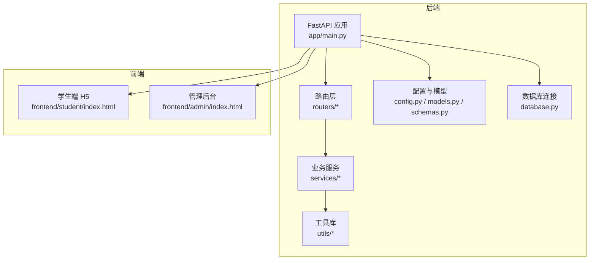
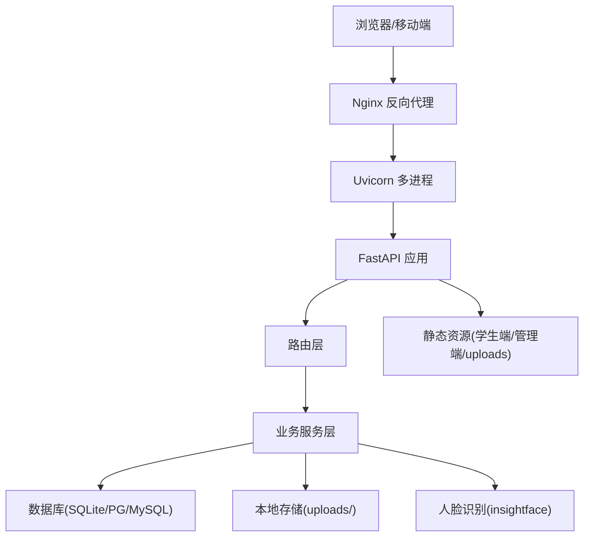
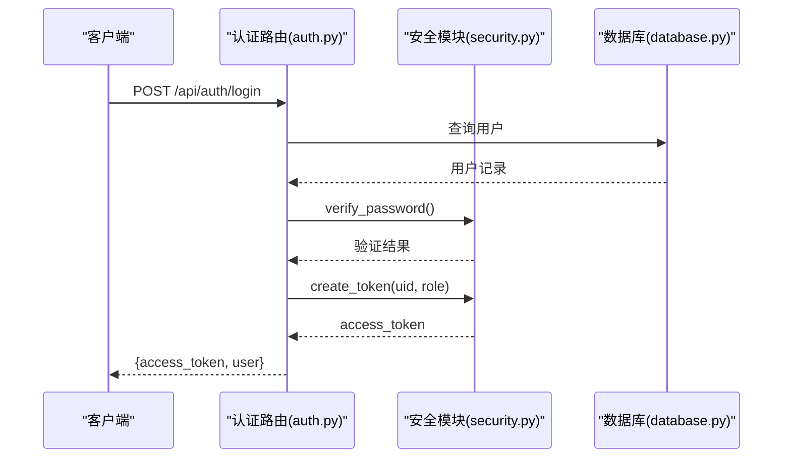
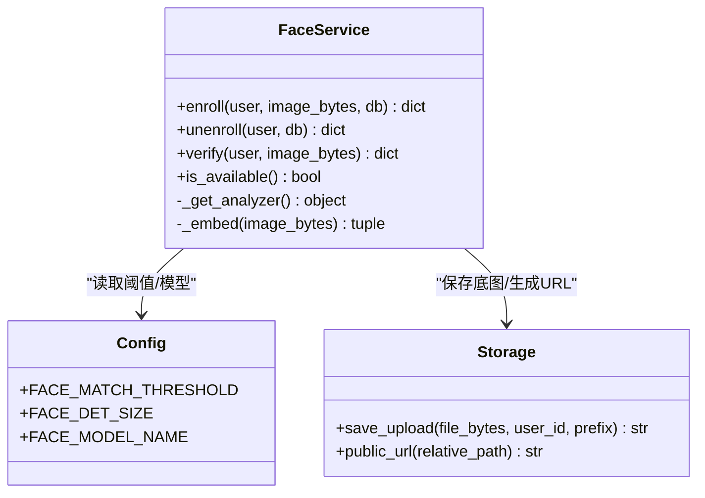
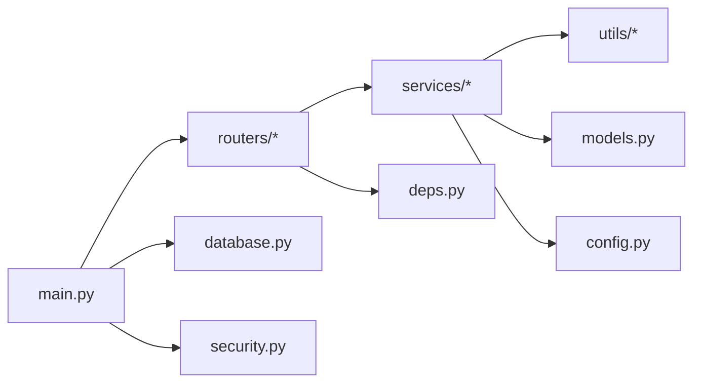

# 部署与运维指南

<cite>
**本文引用的文件**
- [README.md](file://summer-homework-checkin/README.md)
- [config.py](file://summer-homework-checkin/backend/app/config.py)
- [database.py](file://summer-homework-checkin/backend/app/database.py)
- [main.py](file://summer-homework-checkin/backend/app/main.py)
- [requirements.txt](file://summer-homework-checkin/backend/requirements.txt)
- [auth.py](file://summer-homework-checkin/backend/app/routers/auth.py)
- [checkin.py](file://summer-homework-checkin/backend/app/routers/checkin.py)
- [face_service.py](file://summer-homework-checkin/backend/app/services/face_service.py)
- [geo.py](file://summer-homework-checkin/backend/app/utils/geo.py)
- [models.py](file://summer-homework-checkin/backend/app/models.py)
- [schemas.py](file://summer-homework-checkin/backend/app/schemas.py)
- [checkin_service.py](file://summer-homework-checkin/backend/app/services/checkin_service.py)
- [storage.py](file://summer-homework-checkin/backend/app/utils/storage.py)
- [image.py](file://summer-homework-checkin/backend/app/utils/image.py)
- [security.py](file://summer-homework-checkin/backend/app/security.py)
- [deps.py](file://summer-homework-checkin/backend/app/deps.py)
- [index.html（学生端）](file://summer-homework-checkin/frontend/student/index.html)
- [index.html（管理端）](file://summer-homework-checkin/frontend/admin/index.html)
- [.gitignore](file://.gitignore)
</cite>

## 更新摘要
**所做变更**
- 更新了版本控制配置说明，反映 snake-game 目录被排除的版本控制策略
- 增强了开发环境搭建章节，包含仓库清理和版本控制最佳实践
- 添加了代码仓库卫生管理的指导原则

## 目录
1. [简介](#简介)
2. [项目结构](#项目结构)
3. [核心组件](#核心组件)
4. [架构总览](#架构总览)
5. [详细组件分析](#详细组件分析)
6. [依赖关系分析](#依赖关系分析)
7. [性能考虑](#性能考虑)
8. [故障排查指南](#故障排查指南)
9. [结论](#结论)
10. [附录](#附录)

## 简介
本指南面向开发与生产环境的部署与运维，覆盖以下内容：
- 开发环境搭建：Python 虚拟环境、依赖安装、数据库初始化、服务启动
- 生产环境部署：服务器要求、Nginx 反向代理、多进程策略、静态资源托管
- 环境变量配置管理：人脸识别阈值、地理距离限制、补卡限额等关键参数调优
- 日志收集、性能监控、错误追踪配置建议
- 备份恢复策略、扩容升级方案
- PWA 应用配置、静态资源优化与 CDN 部署最佳实践
- **新增** 代码仓库卫生管理与版本控制最佳实践

## 项目结构
后端采用 FastAPI + SQLAlchemy + SQLite（可替换为 PostgreSQL/MySQL），前端为免构建的 Vue3 H5 与管理后台，通过后端静态挂载提供。



图表来源
- [main.py:1-48](file://summer-homework-checkin/backend/app/main.py#L1-L48)
- [config.py:1-50](file://summer-homework-checkin/backend/app/config.py#L1-L50)
- [database.py:1-22](file://summer-homework-checkin/backend/app/database.py#L1-L22)
- [index.html（学生端）:1-271](file://summer-homework-checkin/frontend/student/index.html#L1-L271)
- [index.html（管理端）:1-410](file://summer-homework-checkin/frontend/admin/index.html#L1-L410)

章节来源
- [README.md:26-49](file://summer-homework-checkin/README.md#L26-L49)
- [main.py:1-48](file://summer-homework-checkin/backend/app/main.py#L1-L48)

## 核心组件
- 应用入口与静态资源挂载：统一注册路由、CORS、健康检查、静态目录挂载（上传、学生端、管理端）
- 认证与鉴权：基于 HMAC 签名 Token 的无状态鉴权，依赖注入获取当前用户
- 打卡流程：照片校验、位置风险判定、人脸 1:1 比对、审核与积分发放、连续天数重算与抽奖资格解锁
- 人脸识别：insightface 懒加载、CPU 推理、降级安全模式
- 存储与图片：本地文件系统上传、公开 URL 生成、轻量图像解析

章节来源
- [main.py:1-48](file://summer-homework-checkin/backend/app/main.py#L1-L48)
- [deps.py:1-34](file://summer-homework-checkin/backend/app/deps.py#L1-L34)
- [security.py:1-47](file://summer-homework-checkin/backend/app/security.py#L1-L47)
- [checkin.py:1-80](file://summer-homework-checkin/backend/app/routers/checkin.py#L1-L80)
- [checkin_service.py:1-254](file://summer-homework-checkin/backend/app/services/checkin_service.py#L1-L254)
- [face_service.py:1-133](file://summer-homework-checkin/backend/app/services/face_service.py#L1-L133)
- [storage.py:1-24](file://summer-homework-checkin/backend/app/utils/storage.py#L1-L24)
- [image.py:1-61](file://summer-homework-checkin/backend/app/utils/image.py#L1-L61)

## 架构总览
系统由 FastAPI 作为 API 与服务端渲染入口，前端静态页面通过 StaticFiles 直接托管；数据库默认 SQLite，支持热切换至关系型数据库；人脸识别使用 insightface 本地推理，具备自动降级能力。



图表来源
- [main.py:1-48](file://summer-homework-checkin/backend/app/main.py#L1-L48)
- [database.py:1-22](file://summer-homework-checkin/backend/app/database.py#L1-L22)
- [face_service.py:1-133](file://summer-homework-checkin/backend/app/services/face_service.py#L1-L133)
- [storage.py:1-24](file://summer-homework-checkin/backend/app/utils/storage.py#L1-L24)

## 详细组件分析

### 开发环境搭建
- 创建并激活 Python 虚拟环境
- 安装依赖：requirements.txt
- 初始化数据：执行种子脚本以建表、写入预设奖品与管理员账号
- 启动服务：uvicorn 单进程或带 workers 的多进程
- 访问地址：根路径为学生端，/admin 为管理后台

**更新** 版本控制配置优化

为了提高开发工作流效率，项目采用了严格的版本控制策略：
- 根目录 `.gitignore` 配置排除了 `snake-game/` 目录，避免无关代码污染主仓库
- 各子项目独立的 `.gitignore` 配置确保运行时文件和敏感信息不被提交
- 推荐的 Git 工作流程包括定期清理未跟踪文件和维护干净的提交历史

**章节来源**
- [README.md:53-77](file://summer-homework-checkin/README.md#L53-L77)
- [requirements.txt:1-11](file://summer-homework-checkin/backend/requirements.txt#L1-L11)
- [main.py:32-47](file://summer-homework-checkin/backend/app/main.py#L32-L47)
- [.gitignore:1-2](file://.gitignore#L1-L2)

### 版本控制与仓库卫生管理
**新增** 代码仓库卫生配置

项目采用多层级的 .gitignore 策略来维护代码仓库的整洁性：

#### 根级版本控制策略
- 排除实验性项目：`snake-game/` 目录被完全排除，保持主仓库专注核心功能
- 统一的忽略规则确保所有开发者遵循相同的版本控制标准

#### 子项目独立配置
每个子项目都有针对性的 `.gitignore` 配置：
- **summer-homework-checkin**: 排除运行时数据库、上传文件、Python 缓存
- **points-system**: 完整的 Python 项目忽略规则，包含测试覆盖率文件
- **homework-monorepo**: 聚合项目的通用忽略规则

#### 推荐的 Git 工作流
```bash
# 查看未跟踪的文件
git status --untracked-files=all

# 清理未跟踪的文件（谨慎使用）
git clean -fd

# 查看将被忽略的文件
git check-ignore -v filename

# 添加特定文件到版本控制（即使被忽略）
git add -f specific-file
```

**章节来源**
- [.gitignore:1-2](file://.gitignore#L1-L2)
- [summer-homework-checkin/.gitignore:1-9](file://summer-homework-checkin/.gitignore#L1-L9)
- [points-system/.gitignore:1-60](file://points-system/.gitignore#L1-L60)
- [homework-monorepo/.gitignore:1-29](file://homework-monorepo/.gitignore#L1-L29)

### 生产环境部署方案
- 服务器要求
  - CPU：至少 2 核（含人脸推理时建议更高）
  - 内存：≥ 4GB（insightface 首次下载与推理占用较高）
  - 磁盘：预留足够空间用于 uploads 与模型缓存（~/.insightface）
  - 网络：需能访问外网以首次下载人脸模型；若离线部署，需预置模型
- 反向代理（Nginx）
  - 将 /api 转发到 Uvicorn 监听端口
  - 将 / 与 /admin 静态资源交由 Nginx 直接返回以提升性能
  - 开启 gzip、HTTP/2、缓存头与 HTTPS
- 多进程部署
  - 使用 uvicorn --workers N 或 gunicorn + uvicorn worker
  - 结合 Nginx upstream 做负载均衡与健康检查
- 静态资源与对象存储
  - 可将 uploads 迁移至对象存储（如 OSS/S3），并在 Nginx 或应用层重写 URL
  - 启用 CDN 加速静态资源与图片访问

**章节来源**
- [README.md:120-126](file://summer-homework-checkin/README.md#L120-L126)
- [main.py:42-47](file://summer-homework-checkin/backend/app/main.py#L42-L47)

### 环境变量配置管理
以下关键参数均支持通过环境变量覆盖，便于不同环境差异化配置：
- 地理位置相关
  - GEO_THRESHOLD_METERS：距常用位置超过该值标记代打卡风险（单位：米）
- 补卡规则
  - MAX_MAKEUP_PER_MONTH：单自然月最多补卡次数
  - CHECKIN_POINTS：正常打卡所得积分
  - MAKEUP_POINTS：补卡所得积分
- 人脸识别
  - FACE_MATCH_THRESHOLD：余弦相似度阈值（越高越严格）
  - FACE_MODE_ON_ENROLLED：已采集底图后的人脸策略（enforce=拒绝打卡；soft=仅标记风险）
  - FACE_DET_SIZE：检测输入尺寸（越小越快、越小越易漏检）
  - FACE_MODEL_NAME：insightface 预训练模型名称
- 其他
  - SECRET：签名密钥（生产务必通过环境变量注入）
  - TOKEN_EXPIRE_DAYS：Token 有效期（天）
  - MIN_PHOTO_BYTES / PHOTO_MAX_BYTES / MIN_PHOTO_DIM：照片体积与尺寸门槛

**章节来源**
- [config.py:1-50](file://summer-homework-checkin/backend/app/config.py#L1-L50)
- [README.md:65-77](file://summer-homework-checkin/README.md#L65-L77)

### 数据库初始化与迁移
- 默认 SQLite：应用启动时自动创建所有表（Base.metadata.create_all）
- 会话管理：SessionLocal 提供请求级数据库会话
- 生产建议：替换为 PostgreSQL/MySQL，修改 DATABASE_URL 并配置连接池

**章节来源**
- [main.py:37-39](file://summer-homework-checkin/backend/app/main.py#L37-L39)
- [database.py:1-22](file://summer-homework-checkin/backend/app/database.py#L1-L22)
- [README.md:120-126](file://summer-homework-checkin/README.md#L120-L126)

### 认证与鉴权流程
- 登录/注册：POST /api/auth/login 与 /api/auth/register
- Token：HMAC 签名无状态 Token，包含 uid、role、exp
- 鉴权：HTTPBearer 依赖注入，校验签名与过期时间，查询用户



图表来源
- [auth.py:1-52](file://summer-homework-checkin/backend/app/routers/auth.py#L1-L52)
- [security.py:1-47](file://summer-homework-checkin/backend/app/security.py#L1-L47)
- [deps.py:1-34](file://summer-homework-checkin/backend/app/deps.py#L1-L34)
- [database.py:1-22](file://summer-homework-checkin/backend/app/database.py#L1-L22)

### 打卡业务流程
- 接口：POST /api/checkin（支持正常打卡与补卡）
- 流程要点：
  - 照片合规校验（体积、格式、最小边长）
  - 补卡规则校验（日期范围、重复校验、月度上限）
  - 防代打卡：地理位置风险、人脸 1:1 比对（可强制拒绝）
  - 提交后通知本人与家长，等待审核
  - 审核通过后发放积分、重算连续天数与抽奖资格


图表来源
- [checkin.py:1-80](file://summer-homework-checkin/backend/app/routers/checkin.py#L1-L80)
- [checkin_service.py:64-163](file://summer-homework-checkin/backend/app/services/checkin_service.py#L64-L163)
- [image.py:1-61](file://summer-homework-checkin/backend/app/utils/image.py#L1-L61)
- [geo.py:1-24](file://summer-homework-checkin/backend/app/utils/geo.py#L1-L24)
- [face_service.py:99-125](file://summer-homework-checkin/backend/app/services/face_service.py#L99-L125)

### 人脸识别服务
- 懒加载：首次调用时按需初始化 insightface 分析器
- 推理：CPU 模式，提取 512 维特征向量
- 策略：
  - enroll：采集正脸底图并持久化 embedding
  - verify：现场照与底图进行余弦相似度比对
  - 降级：模型不可用时返回明确提示，按策略拒绝或放行



图表来源
- [face_service.py:1-133](file://summer-homework-checkin/backend/app/services/face_service.py#L1-L133)
- [config.py:41-49](file://summer-homework-checkin/backend/app/config.py#L41-L49)
- [storage.py:1-24](file://summer-homework-checkin/backend/app/utils/storage.py#L1-L24)

### 静态资源与 PWA 配置
- 静态资源挂载：/uploads、/admin、/ 分别对应上传目录、管理端与学生端
- PWA 建议：
  - 在 student/index.html 所在目录添加 manifest.json、service-worker.js
  - 在 Nginx 中设置正确的 MIME 类型与缓存策略
  - 对静态资源启用压缩与长期缓存，提升首屏与离线体验

**章节来源**
- [main.py:42-47](file://summer-homework-checkin/backend/app/main.py#L42-L47)
- [index.html（学生端）:1-271](file://summer-homework-checkin/frontend/student/index.html#L1-L271)
- [index.html（管理端）:1-410](file://summer-homework-checkin/frontend/admin/index.html#L1-L410)

## 依赖关系分析
- 运行时依赖：FastAPI、Uvicorn、SQLAlchemy、insightface、onnxruntime、opencv-python-headless、numpy、pillow
- 模块耦合：
  - main.py 聚合路由与静态资源
  - routers 依赖 services 与 utils
  - services 依赖 config、models、utils
  - database.py 提供引擎与会话
  - security.py 与 deps.py 实现鉴权



图表来源
- [main.py:1-48](file://summer-homework-checkin/backend/app/main.py#L1-L48)
- [requirements.txt:1-11](file://summer-homework-checkin/backend/requirements.txt#L1-L11)

**章节来源**
- [requirements.txt:1-11](file://summer-homework-checkin/backend/requirements.txt#L1-L11)
- [main.py:1-48](file://summer-homework-checkin/backend/app/main.py#L1-L48)

## 性能考虑
- 多进程与线程
  - 使用 uvicorn --workers N 提升并发处理能力
  - 人脸推理为 CPU 密集，合理设置 workers 数量避免争用
- 数据库
  - SQLite 适合演示；生产建议切换为 PG/MySQL 并启用连接池
- 静态资源
  - 将静态资源与上传文件交由 Nginx 或对象存储/CDN 处理
- 图片处理
  - 轻量图像解析避免重型依赖；必要时引入缩略图与异步处理队列

[本节为通用指导，无需代码来源]

## 故障排查指南
- 常见问题定位
  - 人脸模型不可用：检查网络与 ~/.insightface 目录；确认 FACE_MODEL_NAME 与 FACE_DET_SIZE
  - 照片校验失败：检查体积与尺寸门槛（MIN_PHOTO_BYTES、PHOTO_MAX_BYTES、MIN_PHOTO_DIM）
  - 令牌无效：核对 SECRET 与 TOKEN_EXPIRE_DAYS 配置一致性
  - 静态资源 404：确认 Nginx 与 FastAPI 静态挂载路径一致
- 日志与监控
  - 应用日志：Uvicorn 标准输出接入 journald 或容器日志系统
  - 访问日志：Nginx access/error log 集中收集
  - 指标监控：暴露 /api/health 健康检查；集成 Prometheus/Grafana 采集 QPS、延迟、错误率
  - 错误追踪：接入 Sentry 或类似平台，捕获 HTTPException 与未处理异常
- 备份与恢复
  - SQLite：定期 cp app.db；或使用 sqlite3 .backup 命令在线备份
  - 对象存储：对 uploads 目录增量同步；保留版本与生命周期策略
  - 恢复演练：定期在测试环境验证备份可用性
- **新增** 版本控制问题排查
  - 检查 .gitignore 配置是否正确排除不必要的文件
  - 使用 `git status` 和 `git diff` 检查意外提交的敏感信息
  - 清理未跟踪文件：`git clean -fd`

**章节来源**
- [config.py:1-50](file://summer-homework-checkin/backend/app/config.py#L1-L50)
- [image.py:1-61](file://summer-homework-checkin/backend/app/utils/image.py#L1-L61)
- [security.py:1-47](file://summer-homework-checkin/backend/app/security.py#L1-L47)
- [main.py:32-47](file://summer-homework-checkin/backend/app/main.py#L32-L47)
- [.gitignore:1-2](file://.gitignore#L1-L2)

## 结论
本指南提供了从开发到生产的完整部署与运维方案，涵盖环境搭建、反向代理、多进程、环境变量调优、日志监控、备份恢复以及 PWA 与静态资源优化。**新增的版本控制最佳实践**帮助团队维护代码仓库的整洁性和安全性。按照本文实践，可在保证稳定性的同时获得良好的用户体验与可观测性。

[本节为总结，无需代码来源]

## 附录

### 环境变量清单与说明
- SUMMER_SECRET：签名密钥（生产必须通过环境变量注入）
- GEO_THRESHOLD_METERS：地理距离阈值（米）
- MAX_MAKEUP_PER_MONTH：每月补卡上限
- CHECKIN_POINTS：正常打卡积分
- MAKEUP_POINTS：补卡积分
- FACE_MATCH_THRESHOLD：人脸相似度阈值
- FACE_MODE_ON_ENROLLED：已采集底图后的人脸策略（enforce/soft）
- FACE_DET_SIZE：人脸检测输入尺寸
- FACE_MODEL_NAME：insightface 模型名称
- TOKEN_EXPIRE_DAYS：Token 有效期（天）
- MIN_PHOTO_BYTES / PHOTO_MAX_BYTES / MIN_PHOTO_DIM：照片体积与尺寸门槛

**章节来源**
- [config.py:1-50](file://summer-homework-checkin/backend/app/config.py#L1-L50)
- [README.md:65-77](file://summer-homework-checkin/README.md#L65-L77)

### 关键 API 参考
- 认证：/api/auth/register、/api/auth/login、/api/auth/me
- 打卡：/api/checkin、/api/checkin/today、/api/checkin/streak、/api/checkin/history
- 人脸：/api/face/enroll、/api/face/status（见 README 概览）
- 管理：/api/admin/prizes（CRUD）、家长绑定与通知（见 README 概览）

**章节来源**
- [README.md:81-94](file://summer-homework-checkin/README.md#L81-L94)
- [auth.py:1-52](file://summer-homework-checkin/backend/app/routers/auth.py#L1-L52)
- [checkin.py:1-80](file://summer-homework-checkin/backend/app/routers/checkin.py#L1-L80)

### 版本控制配置示例
**新增** 推荐的 .gitignore 配置模板

```gitignore
# Python 相关文件
__pycache__/
*.py[cod]
*.so
.env
venv/
ENV/

# 数据库文件
*.db
*.sqlite
*.sqlite3
*.db-wal
*.db-shm

# 上传文件（运行时生成）
**/uploads/*
!**/uploads/.gitkeep

# 日志文件
*.log

# IDE 和操作系统文件
.vscode/
.idea/
.DS_Store
Thumbs.db

# 实验性项目（根据需要调整）
snake-game/
```

**章节来源**
- [.gitignore:1-2](file://.gitignore#L1-L2)
- [summer-homework-checkin/.gitignore:1-9](file://summer-homework-checkin/.gitignore#L1-L9)
- [points-system/.gitignore:1-60](file://points-system/.gitignore#L1-L60)
- [homework-monorepo/.gitignore:1-29](file://homework-monorepo/.gitignore#L1-L29)