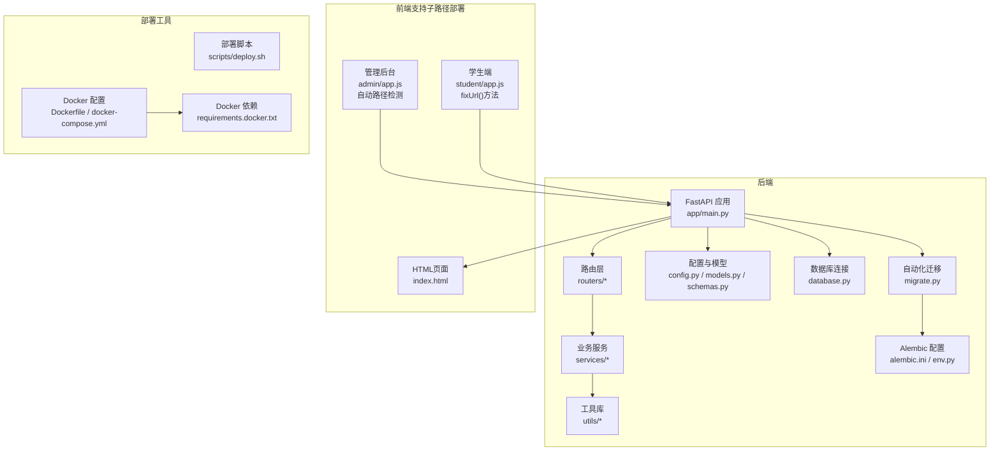
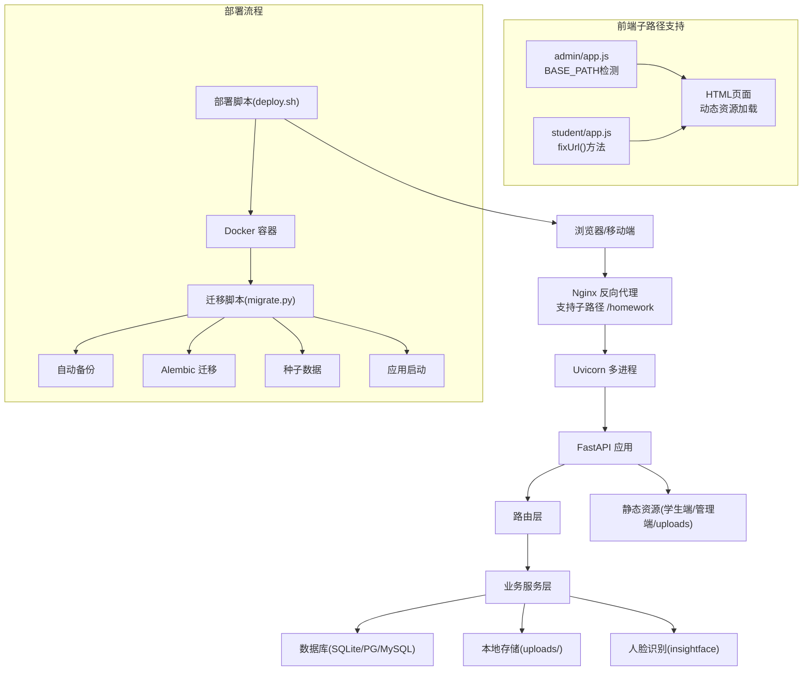
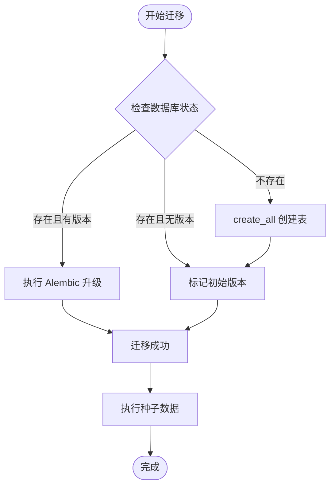
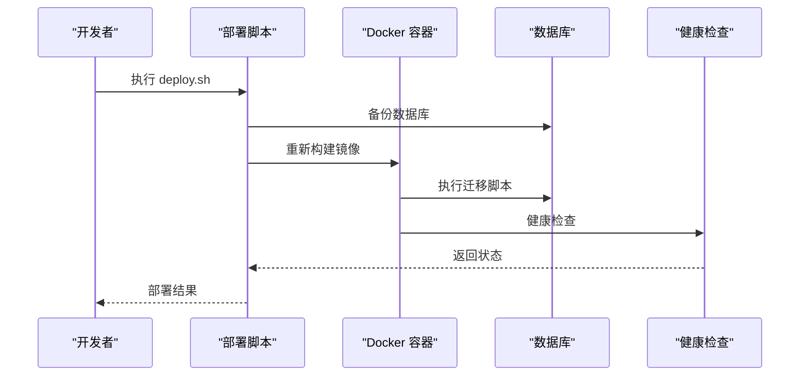
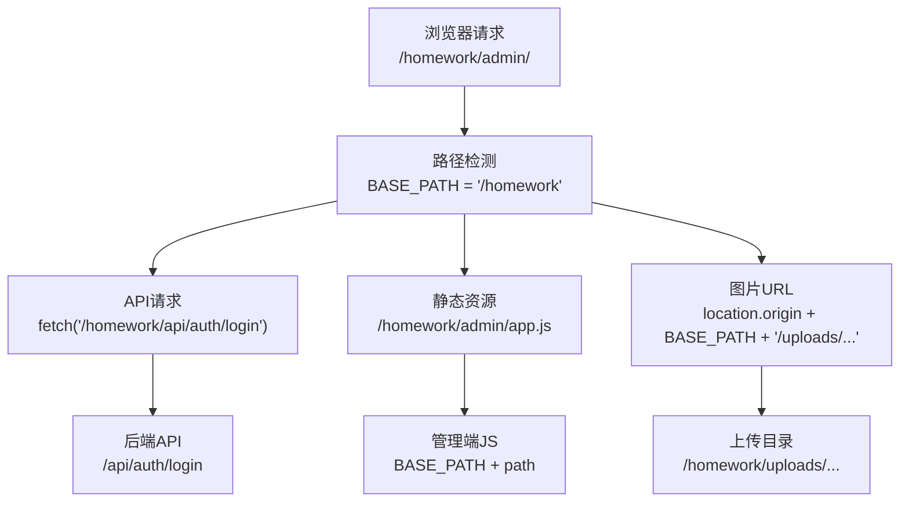
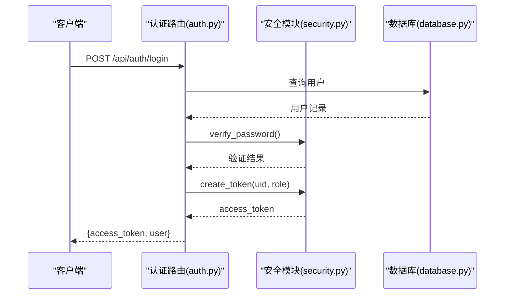
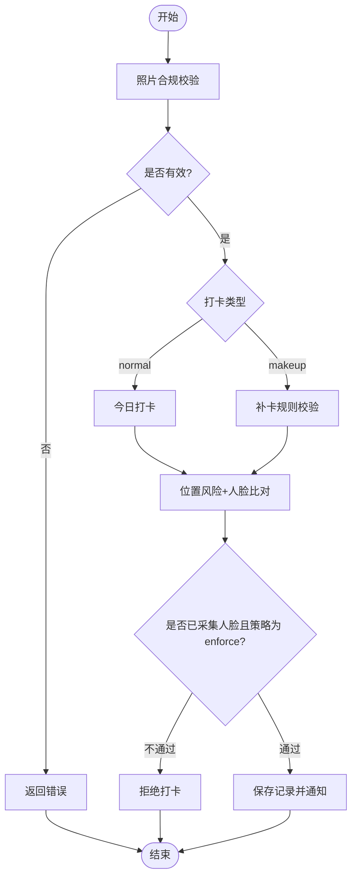
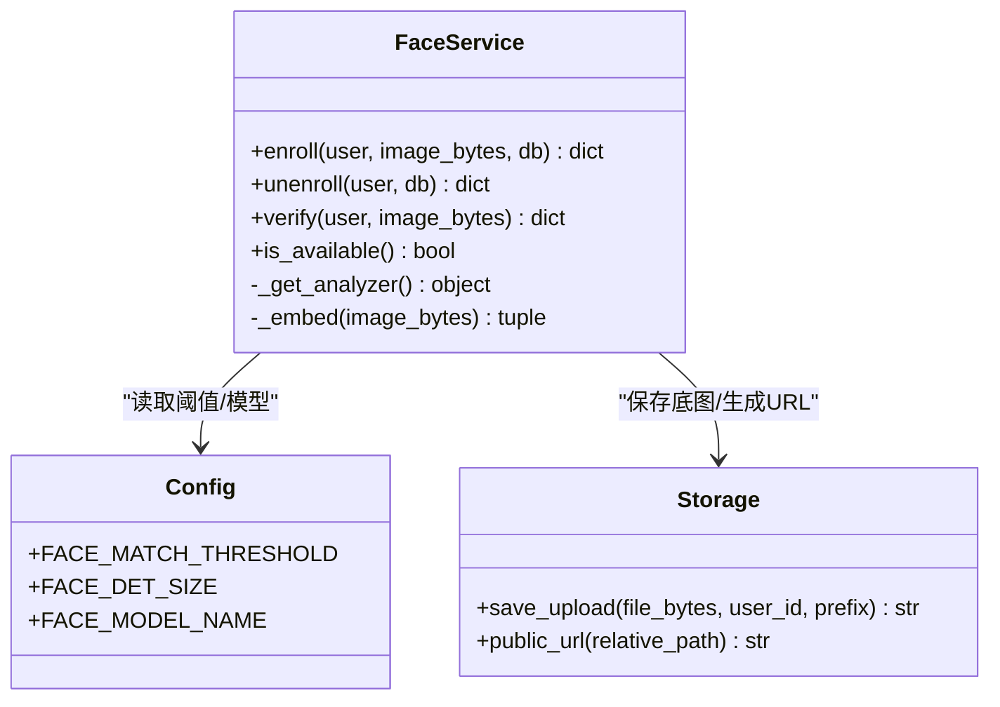
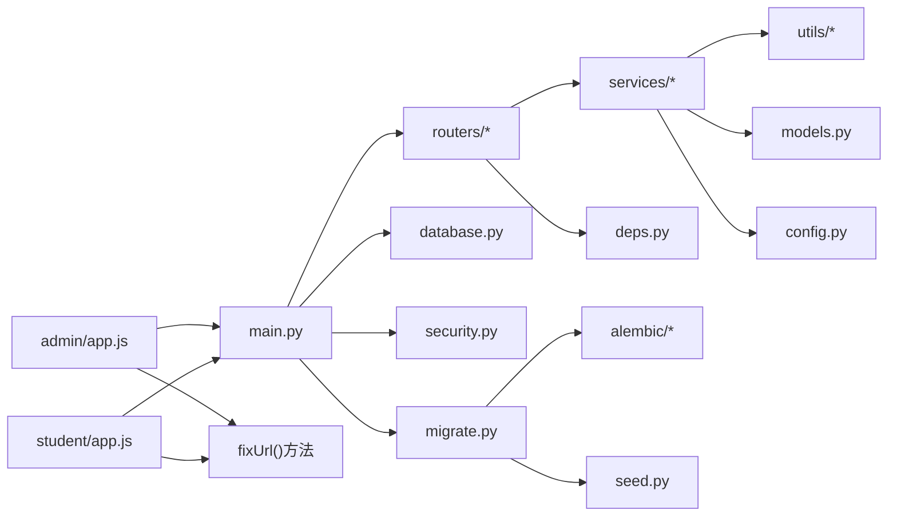

# 部署与运维指南

<cite>
**本文引用的文件**
- [README.md](file://summer-homework-checkin/README.md)
- [config.py](file://summer-homework-checkin/backend/app/config.py)
- [database.py](file://summer-homework-checkin/backend/app/database.py)
- [main.py](file://summer-homework-checkin/backend/app/main.py)
- [requirements.txt](file://summer-homework-checkin/backend/requirements.txt)
- [auth.py](file://summer-homework-checkin/backend/app/routers/auth.py)
- [checkin.py](file://summer-homework-checkin/backend/app/routers/checkin.py)
- [face_service.py](file://summer-homework-checkin/backend/app/services/face_service.py)
- [geo.py](file://summer-homework-checkin/backend/app/utils/geo.py)
- [models.py](file://summer-homework-checkin/backend/app/models.py)
- [schemas.py](file://summer-homework-checkin/backend/app/schemas.py)
- [checkin_service.py](file://summer-homework-checkin/backend/app/services/checkin_service.py)
- [storage.py](file://summer-homework-checkin/backend/app/utils/storage.py)
- [image.py](file://summer-homework-checkin/backend/app/utils/image.py)
- [security.py](file://summer-homework-checkin/backend/app/security.py)
- [deps.py](file://summer-homework-checkin/backend/app/deps.py)
- [index.html（学生端）](file://summer-homework-checkin/frontend/student/index.html)
- [index.html（管理端）](file://summer-homework-checkin/frontend/admin/index.html)
- [.gitignore](file://.gitignore)
- [test_review.py](file://summer-homework-checkin/test_review.py)
- [seed.py](file://summer-homework-checkin/backend/seed.py)
- [migrate.py](file://summer-homework-checkin/backend/migrate.py)
- [deploy.sh](file://scripts/deploy.sh)
- [Dockerfile](file://summer-homework-checkin/Dockerfile)
- [docker-compose.yml](file://docker-compose.yml)
- [alembic.ini](file://summer-homework-checkin/backend/alembic.ini)
- [env.py](file://summer-homework-checkin/backend/alembic/env.py)
- [001_initial.py](file://summer-homework-checkin/backend/alembic/versions/001_initial.py)
- [requirements.docker.txt](file://summer-homework-checkin/backend/requirements.docker.txt)
- [app.js（管理端）](file://summer-homework-checkin/frontend/admin/app.js)
- [app.js（学生端）](file://summer-homework-checkin/frontend/student/app.js)
</cite>

## 更新摘要
**所做变更**
- **重大改进**：新增子路径部署支持，自动检测基础路径并调整API调用和静态资源URL
- **增强** 前端应用的路径处理能力，支持在Docker容器、反向代理和云平台路由等多种部署环境中灵活运行
- **完善** 部署配置说明，包含子路径部署的最佳实践和Nginx配置示例
- **优化** 故障排查指南，增加子路径部署相关问题的诊断方法

## 目录
1. [简介](#简介)
2. [项目结构](#项目结构)
3. [核心组件](#核心组件)
4. [架构总览](#架构总览)
5. [详细组件分析](#详细组件分析)
6. [依赖关系分析](#依赖关系分析)
7. [性能考虑](#性能考虑)
8. [故障排查指南](#故障排查指南)
9. [结论](#结论)
10. [附录](#附录)

## 简介
本指南面向开发与生产环境的部署与运维，覆盖以下内容：
- 开发环境搭建：Python 虚拟环境、依赖安装、数据库初始化、服务启动
- **全新** 自动化部署流程：一键部署脚本、数据库迁移、增量升级
- **新增** 子路径部署支持：自动基础路径检测，支持 /homework 等子路径部署
- 生产环境部署：服务器要求、Nginx 反向代理、多进程策略、静态资源托管
- 环境变量配置管理：人脸识别阈值、地理距离限制、补卡限额等关键参数调优
- 日志收集、性能监控、错误追踪配置建议
- 备份恢复策略、扩容升级方案
- PWA 应用配置、静态资源优化与 CDN 部署最佳实践
- **增强** 代码仓库卫生管理与版本控制最佳实践，包括敏感文件保护
- **新增** 安全的测试工作流和环境变量管理

## 项目结构
后端采用 FastAPI + SQLAlchemy + Alembic 迁移 + SQLite（可替换为 PostgreSQL/MySQL），前端为免构建的 Vue3 H5 与管理后台，通过后端静态挂载提供。**新增** 子路径部署支持，自动识别基础路径并调整所有资源URL。



**图表来源**
- [main.py:1-48](file://summer-homework-checkin/backend/app/main.py#L1-L48)
- [config.py:1-50](file://summer-homework-checkin/backend/app/config.py#L1-L50)
- [database.py:1-22](file://summer-homework-checkin/backend/app/database.py#L1-L22)
- [migrate.py:1-158](file://summer-homework-checkin/backend/migrate.py#L1-L158)
- [deploy.sh:1-163](file://scripts/deploy.sh#L1-L163)
- [Dockerfile:1-22](file://summer-homework-checkin/Dockerfile#L1-L22)
- [docker-compose.yml:1-59](file://docker-compose.yml#L1-L59)
- [index.html（学生端）:1-271](file://summer-homework-checkin/frontend/student/index.html#L1-L271)
- [index.html（管理端）:1-410](file://summer-homework-checkin/frontend/admin/index.html#L1-L410)
- [app.js（管理端）:3-8](file://summer-homework-checkin/frontend/admin/app.js#L3-L8)
- [app.js（学生端）:3-9](file://summer-homework-checkin/frontend/student/app.js#L3-L9)

章节来源
- [README.md:26-49](file://summer-homework-checkin/README.md#L26-L49)
- [main.py:1-48](file://summer-homework-checkin/backend/app/main.py#L1-L48)

## 核心组件
- 应用入口与静态资源挂载：统一注册路由、CORS、健康检查、静态目录挂载（上传、学生端、管理端）
- **新增** 自动化迁移系统：智能数据库迁移、版本控制、数据备份保护
- **新增** 自动化部署脚本：一键部署、增量升级、生产环境管理
- **新增** 子路径部署支持：自动基础路径检测、fixUrl()方法处理相对路径
- 认证与鉴权：基于 HMAC 签名 Token 的无状态鉴权，依赖注入获取当前用户
- 打卡流程：照片校验、位置风险判定、人脸 1:1 比对、审核与积分发放、连续天数重算与抽奖资格解锁
- 人脸识别：insightface 懒加载、CPU 推理、降级安全模式
- 存储与图片：本地文件系统上传、公开 URL 生成、轻量图像解析

**章节来源**
- [main.py:1-48](file://summer-homework-checkin/backend/app/main.py#L1-L48)
- [migrate.py:1-158](file://summer-homework-checkin/backend/migrate.py#L1-L158)
- [deploy.sh:1-163](file://scripts/deploy.sh#L1-L163)
- [deps.py:1-34](file://summer-homework-checkin/backend/app/deps.py#L1-L34)
- [security.py:1-47](file://summer-homework-checkin/backend/app/security.py#L1-L47)
- [checkin.py:1-80](file://summer-homework-checkin/backend/app/routers/checkin.py#L1-L80)
- [checkin_service.py:1-254](file://summer-homework-checkin/backend/app/services/checkin_service.py#L1-L254)
- [face_service.py:1-133](file://summer-homework-checkin/backend/app/services/face_service.py#L1-L133)
- [storage.py:1-24](file://summer-homework-checkin/backend/app/utils/storage.py#L1-L24)
- [image.py:1-61](file://summer-homework-checkin/backend/app/utils/image.py#L1-L61)

## 架构总览
系统由 FastAPI 作为 API 与服务端渲染入口，前端静态页面通过 StaticFiles 直接托管；数据库默认 SQLite，支持热切换至关系型数据库；**新增** 自动化迁移系统确保数据库版本一致性；**新增** 子路径部署支持，前端自动检测基础路径并调整所有资源URL；人脸识别使用 insightface 本地推理，具备自动降级能力。



**图表来源**
- [main.py:1-48](file://summer-homework-checkin/backend/app/main.py#L1-L48)
- [database.py:1-22](file://summer-homework-checkin/backend/app/database.py#L1-L22)
- [migrate.py:1-158](file://summer-homework-checkin/backend/migrate.py#L1-L158)
- [deploy.sh:1-163](file://scripts/deploy.sh#L1-L163)
- [Dockerfile:20-21](file://summer-homework-checkin/Dockerfile#L20-L21)
- [face_service.py:1-133](file://summer-homework-checkin/backend/app/services/face_service.py#L1-L133)
- [storage.py:1-24](file://summer-homework-checkin/backend/app/utils/storage.py#L1-L24)
- [app.js（管理端）:3-8](file://summer-homework-checkin/frontend/admin/app.js#L3-L8)
- [app.js（学生端）:3-9](file://summer-homework-checkin/frontend/student/app.js#L3-L9)

## 详细组件分析

### 开发环境搭建
- 创建并激活 Python 虚拟环境
- 安装依赖：requirements.txt
- **新增** 自动化迁移：执行 `python backend/migrate.py` 进行数据库迁移和种子数据初始化
- 启动服务：uvicorn 单进程或带 workers 的多进程
- 访问地址：根路径为学生端，/admin 为管理后台

**增强** 版本控制与安全配置优化

为了提高开发工作流效率和安全性，项目采用了严格的版本控制策略：
- 根目录 `.gitignore` 配置排除了 `snake-game/` 目录和所有敏感文件
- **安全增强**：明确排除 `.secret_key`、`.env`、数据库文件等敏感信息
- 各子项目独立的 `.gitignore` 配置确保运行时文件和敏感信息不被提交
- 推荐的 Git 工作流程包括定期清理未跟踪文件和维护干净的提交历史

**章节来源**
- [README.md:53-77](file://summer-homework-checkin/README.md#L53-L77)
- [requirements.txt:1-11](file://summer-homework-checkin/backend/requirements.txt#L1-L11)
- [main.py:32-47](file://summer-homework-checkin/backend/app/main.py#L32-L47)
- [migrate.py:1-158](file://summer-homework-checkin/backend/migrate.py#L1-158)
- [.gitignore:1-12](file://.gitignore#L1-L12)

### 自动化数据库迁移系统
**新增** 智能数据库版本管理和增量升级

项目引入了完整的 Alembic 迁移系统，支持数据库版本的自动管理和增量升级：

#### 迁移脚本功能
- **智能检测**：自动识别首次部署、已有数据、版本不一致等情况
- **自动备份**：每次迁移前自动备份数据库到 `backups/` 目录
- **版本控制**：维护 alembic_version 表记录当前迁移版本
- **容错处理**：迁移失败时自动回退到 create_all 确保表结构存在
- **幂等性**：多次执行不会产生重复数据或错误

#### 迁移流程


**图表来源**
- [migrate.py:33-98](file://summer-homework-checkin/backend/migrate.py#L33-L98)

#### 使用方法
```bash
# 完整流程（默认）：备份 + 迁移 + 种子数据
python backend/migrate.py

# 仅执行迁移
python backend/migrate.py --migrate

# 仅执行种子数据
python backend/migrate.py --seed

# 仅备份数据库
python backend/migrate.py --backup
```

**章节来源**
- [migrate.py:1-158](file://summer-homework-checkin/backend/migrate.py#L1-158)
- [alembic.ini:1-41](file://summer-homework-checkin/backend/alembic.ini#L1-41)
- [env.py:1-57](file://summer-homework-checkin/backend/alembic/env.py#L1-L57)
- [001_initial.py:1-183](file://summer-homework-checkin/backend/alembic/versions/001_initial.py#L1-L183)

### 自动化部署脚本
**新增** 一键部署和增量升级工具

项目提供了完整的部署脚本，支持本地开发和生产环境的无缝部署：

#### 部署脚本功能
- **本地部署**：Docker Compose 增量更新，保留数据卷
- **生产部署**：SSH 远程部署，自动备份和验证
- **数据安全**：部署前自动备份数据库
- **健康检查**：部署后自动验证服务可用性
- **日志输出**：详细的彩色日志输出和错误提示

#### 本地部署流程
```bash
# 本地增量更新（保留数据卷）
./scripts/deploy.sh local
```

#### 生产部署流程
```bash
# 生产环境增量更新（自动备份）
./scripts/deploy.sh prod

# 跳过备份（不推荐用于生产）
./scripts/deploy.sh prod --no-backup
```

#### 部署流程图


**图表来源**
- [deploy.sh:28-59](file://scripts/deploy.sh#L28-L59)
- [deploy.sh:61-144](file://scripts/deploy.sh#L61-L144)

**章节来源**
- [deploy.sh:1-163](file://scripts/deploy.sh#L1-L163)

### Docker 容器化部署
**增强** 优化的容器启动流程

Docker 配置文件已更新，确保数据库在应用启动前就绪：

#### 启动流程
1. **依赖安装**：使用 requirements.docker.txt 精简依赖
2. **源码复制**：复制后端和前端代码
3. **数据库准备**：执行 migrate.py 进行迁移和种子数据
4. **服务启动**：启动 Uvicorn 服务

#### 容器编排
- **数据持久化**：使用 Docker volumes 持久化数据库和上传文件
- **健康检查**：内置健康检查确保服务可用性
- **自动重启**：容器异常时自动重启
- **端口映射**：标准 8000 端口暴露

**章节来源**
- [Dockerfile:1-22](file://summer-homework-checkin/Dockerfile#L1-L22)
- [docker-compose.yml:1-59](file://docker-compose.yml#L1-L59)
- [requirements.docker.txt:1-15](file://summer-homework-checkin/backend/requirements.docker.txt#L1-L15)

### 子路径部署支持
**新增** 自动基础路径检测和动态资源URL处理

系统现已支持在子路径下部署（如 `/homework/`），前端应用会自动检测基础路径并调整所有API调用和静态资源URL：

#### 子路径检测机制
- **自动检测**：通过 `window.location.pathname` 检测当前路径
- **正则匹配**：使用 `/^(\/homework)/` 匹配子路径前缀
- **动态BASE_PATH**：根据检测结果设置 BASE_PATH 常量

#### fixUrl() 方法实现
- **绝对路径处理**：http://、https://、data: 开头的URL保持不变
- **特殊路径处理**：/uploads/ 和 /static/ 路径直接拼接 BASE_PATH
- **相对路径处理**：其他相对路径自动转换为完整URL

#### 部署场景支持
- **Docker容器**：支持在容器内以子路径提供服务
- **反向代理**：Nginx/Apache 反向代理下的子路径部署
- **云平台路由**：各种云平台的子路径路由配置
- **多应用共存**：同一域名下多个应用的子路径隔离



**图表来源**
- [app.js（管理端）:3-8](file://summer-homework-checkin/frontend/admin/app.js#L3-L8)
- [app.js（管理端）:665-674](file://summer-homework-checkin/frontend/admin/app.js#L665-L674)
- [app.js（学生端）:3-9](file://summer-homework-checkin/frontend/student/app.js#L3-L9)
- [app.js（学生端）:71-78](file://summer-homework-checkin/frontend/student/app.js#L71-L78)

#### Nginx 子路径配置示例
```nginx
server {
    listen 80;
    server_name example.com;
    
    # 子路径部署配置
    location /homework {
        proxy_pass http://localhost:6565;
        proxy_set_header Host $host;
        proxy_set_header X-Real-IP $remote_addr;
        proxy_set_header X-Forwarded-For $proxy_add_x_forwarded_for;
        proxy_set_header X-Forwarded-Proto $scheme;
        
        # 静态资源缓存
        location ~* \.(js|css|png|jpg|jpeg|gif|ico)$ {
            expires 30d;
            add_header Cache-Control "public, immutable";
        }
    }
    
    # API代理
    location /homework/api {
        proxy_pass http://localhost:6565/api;
        proxy_set_header Host $host;
        proxy_set_header X-Real-IP $remote_addr;
        proxy_set_header X-Forwarded-For $proxy_add_x_forwarded_for;
        proxy_set_header X-Forwarded-Proto $scheme;
    }
}
```

**章节来源**
- [app.js（管理端）:3-8](file://summer-homework-checkin/frontend/admin/app.js#L3-L8)
- [app.js（管理端）:665-674](file://summer-homework-checkin/frontend/admin/app.js#L665-L674)
- [app.js（学生端）:3-9](file://summer-homework-checkin/frontend/student/app.js#L3-L9)
- [app.js（学生端）:71-78](file://summer-homework-checkin/frontend/student/app.js#L71-L78)

### 版本控制与仓库卫生管理
**增强** 代码仓库安全配置

项目采用多层级的 .gitignore 策略来维护代码仓库的整洁性和安全性：

#### 根级版本控制策略
- 排除实验性项目：`snake-game/` 目录被完全排除，保持主仓库专注核心功能
- **安全增强**：明确排除敏感文件 `.secret_key`、`.env`、数据库文件 (`*.db`, `*.db-wal`, `*.db-shm`)
- 统一的忽略规则确保所有开发者遵循相同的版本控制标准

#### 子项目独立配置
每个子项目都有针对性的 `.gitignore` 配置：
- **summer-homework-checkin**: 排除运行时数据库、上传文件、Python 缓存、环境变量文件
- **points-system**: 完整的 Python 项目忽略规则，包含测试覆盖率文件
- **homework-monorepo**: 聚合项目的通用忽略规则

#### 推荐的 Git 工作流
```bash
# 查看未跟踪的文件
git status --untracked-files=all

# 清理未跟踪的文件（谨慎使用）
git clean -fd

# 查看将被忽略的文件
git check-ignore -v filename

# 添加特定文件到版本控制（即使被忽略）
git add -f specific-file

# 检查是否有敏感文件被意外提交
git ls-files | grep -E '\.(secret|env|db)$'
```

**章节来源**
- [.gitignore:1-12](file://.gitignore#L1-L12)
- [summer-homework-checkin/.gitignore:1-9](file://summer-homework-checkin/.gitignore#L1-L9)
- [points-system/.gitignore:1-60](file://points-system/.gitignore#L1-L60)
- [homework-monorepo/.gitignore:1-29](file://homework-monorepo/.gitignore#L1-L29)

### 生产环境部署方案
- 服务器要求
  - CPU：至少 2 核（含人脸推理时建议更高）
  - 内存：≥ 4GB（insightface 首次下载与推理占用较高）
  - 磁盘：预留足够空间用于 uploads 与模型缓存（~/.insightface）
  - 网络：需能访问外网以首次下载人脸模型；若离线部署，需预置模型
- **新增** 自动化部署流程
  - 使用 `./scripts/deploy.sh prod` 进行生产环境部署
  - 自动备份数据库，确保数据安全
  - 增量升级，无需停机维护
  - 自动健康检查和回滚机制
- **新增** 子路径部署配置
  - 支持在 `/homework` 等子路径下部署
  - 前端自动检测基础路径，无需手动配置
  - Nginx反向代理需要正确转发子路径
- 反向代理（Nginx）
  - 将 /api 转发到 Uvicorn 监听端口
  - 将 / 与 /admin 静态资源交由 Nginx 直接返回以提升性能
  - **新增** 子路径代理配置，支持 /homework 等子路径
  - 开启 gzip、HTTP/2、缓存头与 HTTPS
- 多进程部署
  - 使用 uvicorn --workers N 或 gunicorn + uvicorn worker
  - 结合 Nginx upstream 做负载均衡与健康检查
- 静态资源与对象存储
  - 可将 uploads 迁移至对象存储（如 OSS/S3），并在 Nginx 或应用层重写 URL
  - 启用 CDN 加速静态资源与图片访问

**章节来源**
- [README.md:120-126](file://summer-homework-checkin/README.md#L120-L126)
- [deploy.sh:61-144](file://scripts/deploy.sh#L61-L144)
- [main.py:42-47](file://summer-homework-checkin/backend/app/main.py#L42-L47)
- [app.js（管理端）:3-8](file://summer-homework-checkin/frontend/admin/app.js#L3-L8)
- [app.js（学生端）:3-9](file://summer-homework-checkin/frontend/student/app.js#L3-L9)

### 环境变量配置管理
以下关键参数均支持通过环境变量覆盖，便于不同环境差异化配置：

#### 安全相关配置
- **SUMMER_SECRET**：签名密钥（生产务必通过环境变量注入，避免使用生成的 .secret_key 文件）
- **ADMIN_INIT_PASSWORD**：初始管理员密码（测试和生产环境必须设置）
- **ALLOWED_ORIGINS**：CORS 允许的域名列表

#### 地理位置相关
- GEO_THRESHOLD_METERS：距常用位置超过该值标记代打卡风险（单位：米）

#### 补卡规则
- MAX_MAKEUP_PER_MONTH：单自然月最多补卡次数
- CHECKIN_POINTS：正常打卡所得积分
- MAKEUP_POINTS：补卡所得积分

#### 人脸识别
- FACE_MATCH_THRESHOLD：余弦相似度阈值（越高越严格）
- FACE_MODE_ON_ENROLLED：已采集底图后的人脸策略（enforce=拒绝打卡；soft=仅标记风险）
- FACE_DET_SIZE：检测输入尺寸（越小越快、越小越易漏检）
- FACE_MODEL_NAME：insightface 预训练模型名称

#### 其他
- TOKEN_EXPIRE_DAYS：Token 有效期（天）
- MIN_PHOTO_BYTES / PHOTO_MAX_BYTES / MIN_PHOTO_DIM：照片体积与尺寸门槛
- UPLOAD_DIR：上传文件存储目录（Docker 部署时可重定向）
- DB_PATH：数据库文件路径（Docker 部署时可重定向）

**章节来源**
- [config.py:1-80](file://summer-homework-checkin/backend/app/config.py#L1-L80)
- [README.md:65-77](file://summer-homework-checkin/README.md#L65-L77)

### 数据库初始化与迁移
- **新增** 自动化迁移系统：应用启动时自动执行 migrate.py 进行数据库迁移
- **增强** 版本控制：使用 Alembic 管理数据库 schema 变更
- **安全** 自动备份：每次迁移前自动备份数据库
- 会话管理：SessionLocal 提供请求级数据库会话
- 生产建议：替换为 PostgreSQL/MySQL，修改 DATABASE_URL 并配置连接池

**章节来源**
- [Dockerfile:20-21](file://summer-homework-checkin/Dockerfile#L20-L21)
- [migrate.py:1-158](file://summer-homework-checkin/backend/migrate.py#L1-L158)
- [database.py:1-22](file://summer-homework-checkin/backend/app/database.py#L1-L22)
- [README.md:120-126](file://summer-homework-checkin/README.md#L120-L126)

### 认证与鉴权流程
- 登录/注册：POST /api/auth/login 与 /api/auth/register
- Token：HMAC 签名无状态 Token，包含 uid、role、exp
- 鉴权：HTTPBearer 依赖注入，校验签名与过期时间，查询用户



**图表来源**
- [auth.py:1-52](file://summer-homework-checkin/backend/app/routers/auth.py#L1-L52)
- [security.py:1-47](file://summer-homework-checkin/backend/app/security.py#L1-L47)
- [deps.py:1-34](file://summer-homework-checkin/backend/app/deps.py#L1-L34)
- [database.py:1-22](file://summer-homework-checkin/backend/app/database.py#L1-L22)

### 打卡业务流程
- 接口：POST /api/checkin（支持正常打卡与补卡）
- 流程要点：
  - 照片合规校验（体积、格式、最小边长）
  - 补卡规则校验（日期范围、重复校验、月度上限）
  - 防代打卡：地理位置风险、人脸 1:1 比对（可强制拒绝）
  - 提交后通知本人与家长，等待审核
  - 审核通过后发放积分、重算连续天数与抽奖资格



**图表来源**
- [checkin.py:1-80](file://summer-homework-checkin/backend/app/routers/checkin.py#L1-L80)
- [checkin_service.py:64-163](file://summer-homework-checkin/backend/app/services/checkin_service.py#L64-L163)
- [image.py:1-61](file://summer-homework-checkin/backend/app/utils/image.py#L1-L61)
- [geo.py:1-24](file://summer-homework-checkin/backend/app/utils/geo.py#L1-L24)
- [face_service.py:99-125](file://summer-homework-checkin/backend/app/services/face_service.py#L99-L125)

### 人脸识别服务
- 懒加载：首次调用时按需初始化 insightface 分析器
- 推理：CPU 模式，提取 512 维特征向量
- 策略：
  - enroll：采集正脸底图并持久化 embedding
  - verify：现场照与底图进行余弦相似度比对
  - 降级：模型不可用时返回明确提示，按策略拒绝或放行



**图表来源**
- [face_service.py:1-133](file://summer-homework-checkin/backend/app/services/face_service.py#L1-L133)
- [config.py:41-49](file://summer-homework-checkin/backend/app/config.py#L41-L49)
- [storage.py:1-24](file://summer-homework-checkin/backend/app/utils/storage.py#L1-L24)

### 静态资源与 PWA 配置
- 静态资源挂载：/uploads、/admin、/ 分别对应上传目录、管理端与学生端
- **新增** 子路径支持：静态资源URL自动包含BASE_PATH前缀
- PWA 建议：
  - 在 student/index.html 所在目录添加 manifest.json、service-worker.js
  - 在 Nginx 中设置正确的 MIME 类型与缓存策略
  - 对静态资源启用压缩与长期缓存，提升首屏与离线体验

**章节来源**
- [main.py:42-47](file://summer-homework-checkin/backend/app/main.py#L42-L47)
- [index.html（学生端）:1-271](file://summer-homework-checkin/frontend/student/index.html#L1-L271)
- [index.html（管理端）:1-410](file://summer-homework-checkin/frontend/admin/index.html#L1-L410)
- [app.js（管理端）:665-674](file://summer-homework-checkin/frontend/admin/app.js#L665-L674)
- [app.js（学生端）:71-78](file://summer-homework-checkin/frontend/student/app.js#L71-L78)

### 安全的测试工作流
**新增** 基于环境变量的测试配置

项目现已支持通过环境变量管理测试凭据，提高测试安全性和灵活性：

#### 测试环境变量
- **TEST_STUDENT_PASSWORD**：测试学生用户的密码（默认：test123456）
- **ADMIN_INIT_PASSWORD**：管理员初始密码（默认：admin123）

#### 测试工作流特点
- 测试脚本从环境变量读取凭据，避免硬编码敏感信息
- 支持灵活的测试环境配置
- 与生产环境的安全策略保持一致

#### 运行测试
```bash
# 设置环境变量
export TEST_STUDENT_PASSWORD="secure_test_password"
export ADMIN_INIT_PASSWORD="secure_admin_password"

# 运行测试
python summer-homework-checkin/test_review.py
```

**章节来源**
- [test_review.py:24-51](file://summer-homework-checkin/test_review.py#L24-L51)
- [seed.py:62-79](file://summer-homework-checkin/backend/seed.py#L62-L79)

## 依赖关系分析
- 运行时依赖：FastAPI、Uvicorn、SQLAlchemy、insightface、onnxruntime、opencv-python-headless、numpy、pillow
- **新增** 迁移依赖：Alembic 用于数据库版本管理
- **优化** Docker 依赖：requirements.docker.txt 精简依赖，减小镜像体积
- 模块耦合：
  - main.py 聚合路由与静态资源
  - routers 依赖 services 与 utils
  - services 依赖 config、models、utils
  - database.py 提供引擎与会话
  - security.py 与 deps.py 实现鉴权
  - **新增** migrate.py 协调数据库迁移和种子数据
  - **新增** 前端子路径支持：app.js 中的 BASE_PATH 检测和 fixUrl() 方法



**图表来源**
- [main.py:1-48](file://summer-homework-checkin/backend/app/main.py#L1-L48)
- [requirements.txt:1-11](file://summer-homework-checkin/backend/requirements.txt#L1-L11)
- [migrate.py:1-158](file://summer-homework-checkin/backend/migrate.py#L1-L158)
- [app.js（管理端）:665-674](file://summer-homework-checkin/frontend/admin/app.js#L665-L674)
- [app.js（学生端）:71-78](file://summer-homework-checkin/frontend/student/app.js#L71-L78)

**章节来源**
- [requirements.txt:1-11](file://summer-homework-checkin/backend/requirements.txt#L1-L11)
- [requirements.docker.txt:1-15](file://summer-homework-checkin/backend/requirements.docker.txt#L1-L15)
- [main.py:1-48](file://summer-homework-checkin/backend/app/main.py#L1-L48)

## 性能考虑
- 多进程与线程
  - 使用 uvicorn --workers N 提升并发处理能力
  - 人脸推理为 CPU 密集，合理设置 workers 数量避免争用
- 数据库
  - SQLite 适合演示；生产建议切换为 PG/MySQL 并启用连接池
  - **新增** 迁移优化：Alembic 增量升级，避免全量重建
- 静态资源
  - 将静态资源与上传文件交由 Nginx 或对象存储/CDN 处理
  - **新增** 子路径部署优化：Nginx缓存策略针对子路径配置
- 图片处理
  - 轻量图像解析避免重型依赖；必要时引入缩略图与异步处理队列
- **新增** 部署优化
  - Docker 镜像分层缓存，加速构建过程
  - 增量部署减少停机时间
  - 子路径部署减少配置复杂度

[本节为通用指导，无需代码来源]

## 故障排查指南
- 常见问题定位
  - 人脸模型不可用：检查网络与 ~/.insightface 目录；确认 FACE_MODEL_NAME 与 FACE_DET_SIZE
  - 照片校验失败：检查体积与尺寸门槛（MIN_PHOTO_BYTES、PHOTO_MAX_BYTES、MIN_PHOTO_DIM）
  - 令牌无效：核对 SECRET 与 TOKEN_EXPIRE_DAYS 配置一致性
  - 静态资源 404：确认 Nginx 与 FastAPI 静态挂载路径一致
  - **新增** 子路径部署问题：检查 BASE_PATH 是否正确检测，fixUrl() 方法是否正常执行
  - **新增** API请求失败：确认子路径下API调用是否正确拼接BASE_PATH
  - **新增** 数据库迁移问题：检查 migrate.py 日志和 alembic_version 表
  - **新增** 部署失败：查看部署脚本日志和健康检查结果
- 日志与监控
  - 应用日志：Uvicorn 标准输出接入 journald 或容器日志系统
  - 访问日志：Nginx access/error log 集中收集
  - 指标监控：暴露 /api/health 健康检查；集成 Prometheus/Grafana 采集 QPS、延迟、错误率
  - 错误追踪：接入 Sentry 或类似平台，捕获 HTTPException 与未处理异常
  - **新增** 迁移日志：migrate.py 输出详细的迁移过程和错误信息
  - **新增** 部署日志：deploy.sh 提供彩色的部署进度和错误提示
  - **新增** 子路径调试：浏览器控制台检查 BASE_PATH 值和 fixUrl() 方法输出
- 备份与恢复
  - SQLite：定期 cp app.db；或使用 sqlite3 .backup 命令在线备份
  - **新增** 自动备份：migrate.py 自动备份到 backups/ 目录
  - **新增** 部署备份：deploy.sh 在生产部署前自动备份数据库
  - 对象存储：对 uploads 目录增量同步；保留版本与生命周期策略
  - 恢复演练：定期在测试环境验证备份可用性
- **增强** 版本控制问题排查
  - 检查 .gitignore 配置是否正确排除不必要的文件
  - 使用 `git status` 和 `git diff` 检查意外提交的敏感信息
  - 清理未跟踪文件：`git clean -fd`
  - **安全检查**：定期检查是否有敏感文件被意外提交到版本控制
- **新增** 子路径部署问题排查
  - 检查浏览器控制台的网络请求，确认API路径是否正确
  - 验证Nginx子路径代理配置是否正确转发请求
  - 检查静态资源URL是否包含正确的基础路径前缀
  - 确认fixUrl()方法在不同浏览器中的兼容性

**章节来源**
- [config.py:1-80](file://summer-homework-checkin/backend/app/config.py#L1-L80)
- [image.py:1-61](file://summer-homework-checkin/backend/app/utils/image.py#L1-L61)
- [security.py:1-47](file://summer-homework-checkin/backend/app/security.py#L1-L47)
- [main.py:32-47](file://summer-homework-checkin/backend/app/main.py#L32-L47)
- [migrate.py:1-158](file://summer-homework-checkin/backend/migrate.py#L1-L158)
- [deploy.sh:1-163](file://scripts/deploy.sh#L1-L163)
- [.gitignore:1-12](file://.gitignore#L1-L12)
- [app.js（管理端）:665-674](file://summer-homework-checkin/frontend/admin/app.js#L665-L674)
- [app.js（学生端）:71-78](file://summer-homework-checkin/frontend/student/app.js#L71-L78)

## 结论
本指南提供了从开发到生产的完整部署与运维方案，涵盖环境搭建、**全新的自动化部署流程**、反向代理、多进程、环境变量调优、日志监控、备份恢复以及 PWA 与静态资源优化。**增强的版本控制最佳实践**帮助团队维护代码仓库的整洁性和安全性，**新的安全测试工作流**确保了测试过程的安全性。**新增的自动化迁移系统和部署脚本**大幅简化了生产环境的运维复杂度，提高了部署的可靠性和效率。**新增的子路径部署支持**使得系统能够在各种复杂的部署环境中灵活运行，包括Docker容器、反向代理和云平台路由等场景。按照本文实践，可在保证稳定性的同时获得良好的用户体验与可观测性。

[本节为总结，无需代码来源]

## 附录

### 环境变量清单与说明
- **SUMMER_SECRET**：签名密钥（生产必须通过环境变量注入）
- **ADMIN_INIT_PASSWORD**：管理员初始密码（测试和生产环境必须设置）
- **TEST_STUDENT_PASSWORD**：测试学生用户密码（测试环境）
- **GEO_THRESHOLD_METERS**：地理距离阈值（米）
- **MAX_MAKEUP_PER_MONTH**：每月补卡上限
- **CHECKIN_POINTS**：正常打卡积分
- **MAKEUP_POINTS**：补卡积分
- **FACE_MATCH_THRESHOLD**：人脸相似度阈值
- **FACE_MODE_ON_ENROLLED**：已采集底图后的人脸策略（enforce/soft）
- **FACE_DET_SIZE**：人脸检测输入尺寸
- **FACE_MODEL_NAME**：insightface 模型名称
- **TOKEN_EXPIRE_DAYS**：Token 有效期（天）
- **MIN_PHOTO_BYTES / PHOTO_MAX_BYTES / MIN_PHOTO_DIM**：照片体积与尺寸门槛
- **ALLOWED_ORIGINS**：CORS 允许的域名列表
- **UPLOAD_DIR**：上传文件存储目录
- **DB_PATH**：数据库文件路径

**章节来源**
- [config.py:1-80](file://summer-homework-checkin/backend/app/config.py#L1-L80)
- [README.md:65-77](file://summer-homework-checkin/README.md#L65-L77)
- [test_review.py:24-51](file://summer-homework-checkin/test_review.py#L24-L51)

### 关键 API 参考
- 认证：/api/auth/register、/api/auth/login、/api/auth/me
- 打卡：/api/checkin、/api/checkin/today、/api/checkin/streak、/api/checkin/history
- 人脸：/api/face/enroll、/api/face/status（见 README 概览）
- 管理：/api/admin/prizes（CRUD）、家长绑定与通知（见 README 概览）

**章节来源**
- [README.md:81-94](file://summer-homework-checkin/README.md#L81-L94)
- [auth.py:1-52](file://summer-homework-checkin/backend/app/routers/auth.py#L1-L52)
- [checkin.py:1-80](file://summer-homework-checkin/backend/app/routers/checkin.py#L1-L80)

### 版本控制配置示例
**增强** 推荐的 .gitignore 配置模板

```gitignore
# 根目录配置
snake-game/

# 安全：不提交密钥文件和数据库
.secret_key
.env
*.db
*.db-wal
*.db-shm
uploads/

# Python 相关文件
__pycache__/
*.py[cod]
*.so
venv/
ENV/

# 数据库文件
*.sqlite
*.sqlite3

# 上传文件（运行时生成）
**/uploads/*
!**/uploads/.gitkeep

# 日志文件
*.log

# IDE 和操作系统文件
.vscode/
.idea/
.DS_Store
Thumbs.db

# 实验性项目（根据需要调整）
snake-game/
```

**章节来源**
- [.gitignore:1-12](file://.gitignore#L1-L12)
- [summer-homework-checkin/.gitignore:1-9](file://summer-homework-checkin/.gitignore#L1-L9)
- [points-system/.gitignore:1-60](file://points-system/.gitignore#L1-L60)
- [homework-monorepo/.gitignore:1-29](file://homework-monorepo/.gitignore#L1-L29)

### 安全部署检查清单
**新增** 生产环境安全配置检查

在部署到生产环境前，请确保完成以下安全检查：

#### 环境变量配置
- [ ] 设置了强随机 SUMMER_SECRET 环境变量
- [ ] 配置了 ADMIN_INIT_PASSWORD 环境变量
- [ ] 设置了适当的 ALLOWED_ORIGINS 白名单
- [ ] 移除了所有硬编码的敏感信息

#### 版本控制安全
- [ ] 确认 .gitignore 正确排除了敏感文件
- [ ] 检查是否有敏感文件被意外提交到版本控制
- [ ] 清理本地未跟踪的敏感文件

#### 文件权限
- [ ] 确保 .secret_key 文件具有适当的文件权限
- [ ] 检查 uploads 目录的写权限
- [ ] 验证数据库文件的访问权限

#### 网络安全
- [ ] 配置了 HTTPS 证书
- [ ] 设置了 CORS 白名单
- [ ] 启用了必要的防火墙规则

#### **新增** 子路径部署检查
- [ ] 验证子路径检测逻辑正常工作
- [ ] 检查 fixUrl() 方法在所有浏览器中兼容
- [ ] 确认Nginx子路径代理配置正确
- [ ] 测试所有API调用在子路径下正常工作
- [ ] 验证静态资源URL包含正确的基础路径

#### **新增** 部署安全
- [ ] 测试了部署脚本在本地环境的工作
- [ ] 验证了数据库备份功能
- [ ] 确认了健康检查端点可用
- [ ] 准备了回滚方案和应急联系人

**章节来源**
- [.gitignore:1-12](file://.gitignore#L1-L12)
- [config.py:24-45](file://summer-homework-checkin/backend/app/config.py#L24-L45)
- [seed.py:62-79](file://summer-homework-checkin/backend/seed.py#L62-L79)
- [deploy.sh:1-163](file://scripts/deploy.sh#L1-L163)
- [app.js（管理端）:3-8](file://summer-homework-checkin/frontend/admin/app.js#L3-L8)
- [app.js（学生端）:3-9](file://summer-homework-checkin/frontend/student/app.js#L3-L9)

### 自动化部署操作手册
**新增** 完整的部署操作流程

#### 本地开发环境
```bash
# 1. 克隆项目
git clone <repository-url>
cd hanghang_WS

# 2. 构建并启动服务
docker compose up -d --build

# 3. 验证服务
curl http://localhost:8000/api/health

# 4. 增量更新
./scripts/deploy.sh local
```

#### 生产环境部署
```bash
# 1. 准备工作
chmod +x scripts/deploy.sh

# 2. 测试本地部署
./scripts/deploy.sh local

# 3. 生产环境部署（自动备份）
./scripts/deploy.sh prod

# 4. 查看部署日志
./scripts/deploy.sh prod 2>&1 | tee deploy.log

# 5. 紧急回滚
sshpass -p 'password' ssh user@host "sudo docker stop summer-homework && sudo docker rm summer-homework"
```

#### 子路径部署配置
```bash
# 1. 配置Nginx子路径代理
# 编辑 /etc/nginx/conf.d/homework.conf

# 2. 重启Nginx
sudo systemctl restart nginx

# 3. 验证子路径访问
curl http://example.com/homework/api/health

# 4. 检查前端资源加载
# 打开浏览器开发者工具，检查网络请求
```

#### 数据库管理
```bash
# 手动执行迁移
docker exec -it summer-homework python migrate.py

# 查看迁移历史
docker exec -it summer-homework python -c "from alembic.config import Config; from alembic.script import ScriptDirectory; cfg = Config('alembic.ini'); print(ScriptDirectory.from_config(cfg).get_all_revisions())"

# 备份数据库
docker exec -it summer-homework python migrate.py --backup

# 恢复数据库
cp backup_file.db /path/to/data/app.db
docker restart summer-homework
```

#### 子路径部署故障排查
```bash
# 1. 检查BASE_PATH检测
# 打开浏览器控制台，执行：
console.log(BASE_PATH)

# 2. 检查fixUrl方法
# 在控制台测试：
console.log(fixUrl('/uploads/test.jpg'))

# 3. 检查API请求路径
# 查看网络请求，确认API路径是否正确

# 4. 检查Nginx配置
sudo nginx -t
sudo tail -f /var/log/nginx/error.log
```

**章节来源**
- [deploy.sh:1-163](file://scripts/deploy.sh#L1-L163)
- [migrate.py:1-158](file://summer-homework-checkin/backend/migrate.py#L1-L158)
- [docker-compose.yml:1-59](file://docker-compose.yml#L1-L59)
- [app.js（管理端）:3-8](file://summer-homework-checkin/frontend/admin/app.js#L3-L8)
- [app.js（学生端）:3-9](file://summer-homework-checkin/frontend/student/app.js#L3-L9)