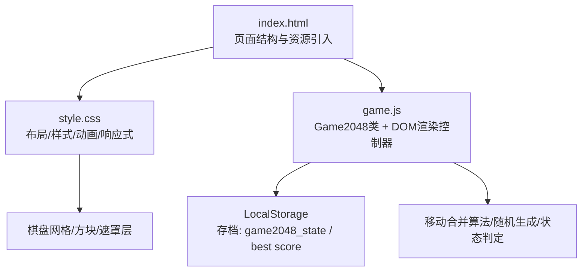
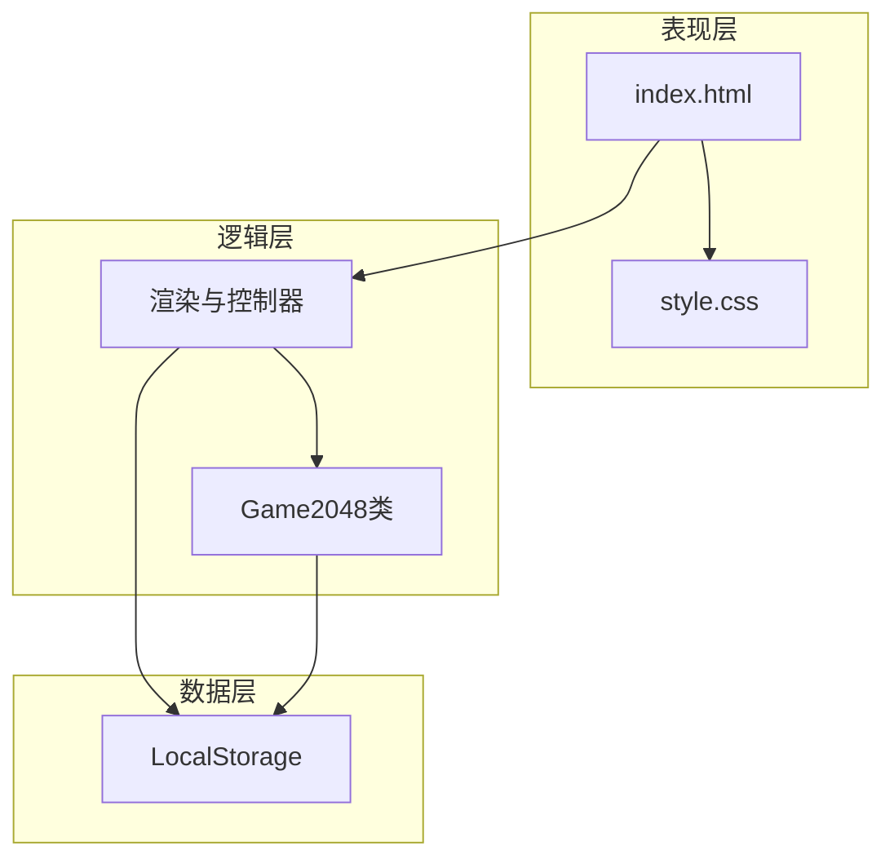
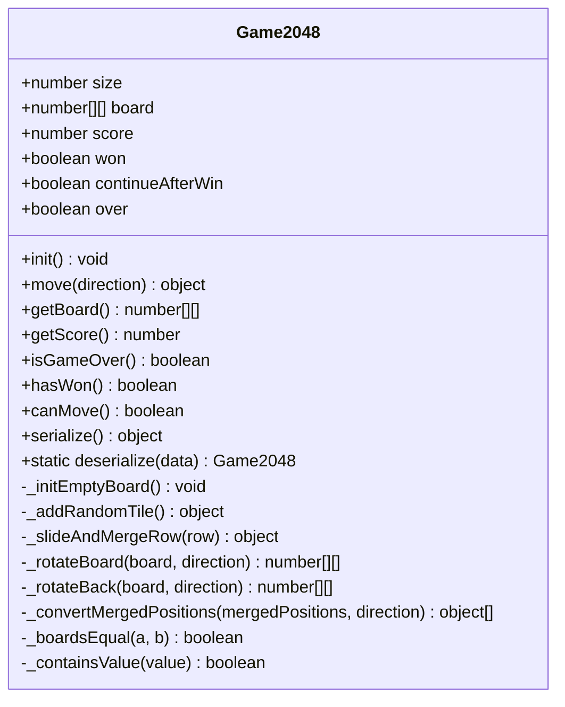
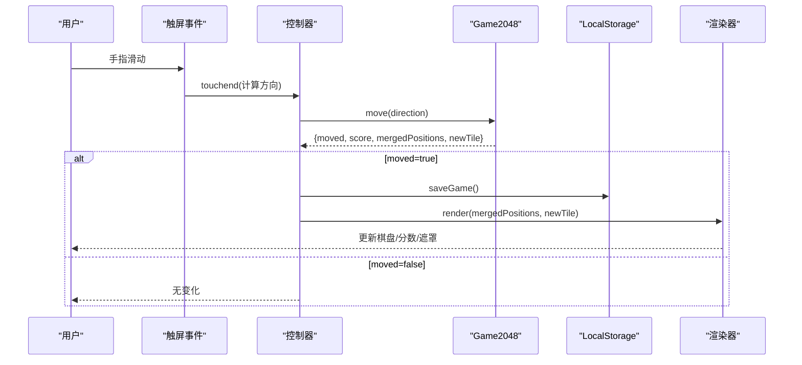
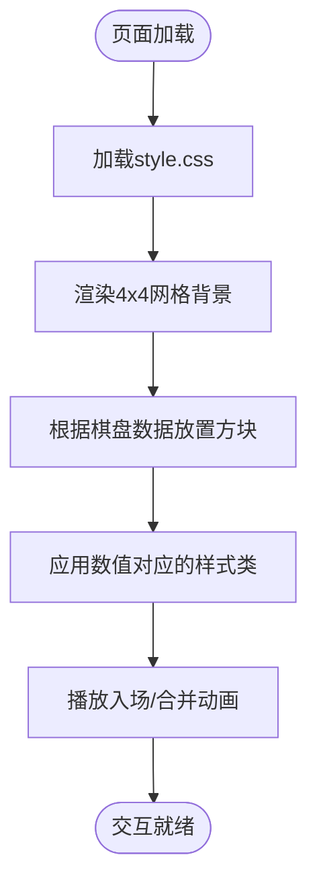
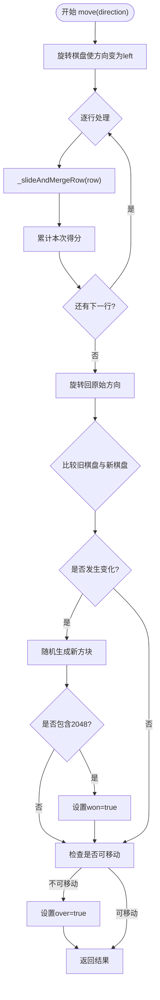
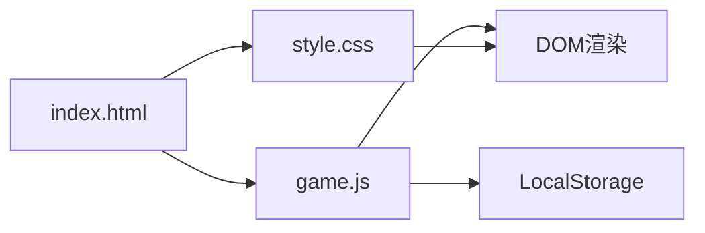

# 2048游戏项目

<cite>
**本文引用的文件**
- [index.html](file://2048/src/index.html)
- [game.js](file://2048/src/js/game.js)
- [style.css](file://2048/src/css/style.css)
- [01-项目章程.md](file://2048/docs/01-项目章程.md)
- [02-需求分析文档(PRD).md](file://2048/docs/02-需求分析文档(PRD).md)
- [03-系统设计文档.md](file://2048/docs/03-系统设计文档.md)
- [05-部署上线文档.md](file://2048/docs/05-部署上线文档.md)
</cite>

## 目录
1. [简介](#简介)
2. [项目结构](#项目结构)
3. [核心组件](#核心组件)
4. [架构总览](#架构总览)
5. [详细组件分析](#详细组件分析)
6. [依赖关系分析](#依赖关系分析)
7. [性能考量](#性能考量)
8. [故障排查指南](#故障排查指南)
9. [结论](#结论)
10. [附录](#附录)

## 简介
本项目是一个纯前端H5实现的移动端2048数字合并游戏，目标是在手机浏览器中提供即开即玩的轻量级休闲体验。项目采用HTML5 + CSS3 + JavaScript ES6+实现，无后端依赖，使用LocalStorage进行本地数据持久化，支持触屏滑动与键盘方向键操作，具备分数记录、最高分保存、游戏状态恢复等基础能力。

## 项目结构
项目采用清晰的前端三层结构：表现层（HTML/CSS）、逻辑层（Game2048类及控制器）、数据层（LocalStorage）。源码位于src目录，文档位于docs目录。

图表来源
- [index.html:1-72](file://2048/src/index.html#L1-L72)
- [style.css:1-355](file://2048/src/css/style.css#L1-L355)
- [game.js:1-545](file://2048/src/js/game.js#L1-L545)

章节来源
- [01-项目章程.md:66-94](file://2048/docs/01-项目章程.md#L66-L94)
- [03-系统设计文档.md:49-58](file://2048/docs/03-系统设计文档.md#L49-L58)

## 核心组件
- Game2048类：封装全部游戏逻辑，包括棋盘初始化、移动合并、随机生成新方块、胜负判定、序列化/反序列化等。
- 渲染与控制器：负责DOM渲染、事件绑定（触屏/键盘）、UI更新（分数、遮罩层）、存档读写。
- 样式系统：定义棋盘网格、方块配色、动画效果、响应式布局与横屏适配。

章节来源
- [game.js:9-303](file://2048/src/js/game.js#L9-L303)
- [game.js:305-545](file://2048/src/js/game.js#L305-L545)
- [style.css:119-212](file://2048/src/css/style.css#L119-L212)
- [style.css:288-355](file://2048/src/css/style.css#L288-L355)

## 架构总览
整体为纯前端三层架构，无后端服务：
- 表现层：index.html + style.css，负责DOM渲染、动画、触屏事件捕获。
- 逻辑层：game.js中的Game2048类，负责棋盘数据、移动合并算法、分数计算、状态判定、LocalStorage存档。
- 数据层：LocalStorage，存储棋盘JSON、当前分数、最高分。

图表来源
- [03-系统设计文档.md:25-47](file://2048/docs/03-系统设计文档.md#L25-L47)
- [index.html:1-72](file://2048/src/index.html#L1-L72)
- [game.js:305-545](file://2048/src/js/game.js#L305-L545)

## 详细组件分析

### Game2048类（核心逻辑）
- 职责：维护棋盘二维数组、执行移动合并、生成随机方块、判断胜负与可移动性、序列化和反序列化。
- 关键方法：
  - move(direction)：统一通过“旋转棋盘”将任意方向转换为向左处理，再还原坐标，返回是否移动、得分、合并位置与新方块信息。
  - _slideAndMergeRow(row)：过滤零值、相邻相同值合并、补零至原长度，并统计合并索引与得分。
  - canMove()：扫描空位与相邻相等值，判断是否仍可移动。
  - serialize()/deserialize()：用于LocalStorage的完整状态保存与恢复。
- 复杂度：每次move对4x4棋盘遍历，时间复杂度O(n^2)，n=4，常数级开销；空间复杂度O(n^2)。

图表来源
- [game.js:9-303](file://2048/src/js/game.js#L9-L303)

章节来源
- [game.js:85-163](file://2048/src/js/game.js#L85-L163)
- [game.js:165-264](file://2048/src/js/game.js#L165-L264)
- [game.js:266-303](file://2048/src/js/game.js#L266-L303)

### 渲染与控制器（DOM与事件）
- 职责：初始化DOM元素、加载存档、渲染棋盘与分数、绑定触屏与键盘事件、处理新游戏/继续游戏/重试等操作。
- 关键流程：
  - init()：获取DOM引用、读取最高分、加载存档、渲染、绑定事件。
  - render(mergedPositions, newTile)：清空tile容器，按棋盘数据创建方块DOM，标记新方块与合并方块，更新分数与遮罩层。
  - handleMove(direction)：调用Game2048.move，若发生移动则保存存档、渲染、触发分数动效。
  - 触屏处理：touchstart/touchmove/touchend，计算偏移量与阈值，判定方向后调用handleMove。
  - 键盘处理：方向键与WASD映射到方向，调用handleMove。

图表来源
- [game.js:317-358](file://2048/src/js/game.js#L317-L358)
- [game.js:361-415](file://2048/src/js/game.js#L361-L415)
- [game.js:418-446](file://2048/src/js/game.js#L418-L446)
- [game.js:448-533](file://2048/src/js/game.js#L448-L533)

章节来源
- [game.js:317-545](file://2048/src/js/game.js#L317-L545)

### 样式与响应式
- 棋盘网格：使用CSS Grid构建4x4背景格，绝对定位的方块容器承载实际方块。
- 方块配色：不同数值对应不同背景色与字号，2048及以上有发光或深色背景。
- 动画：新方块出现缩放动画、合并脉冲动画、分数增加缩放反馈。
- 响应式：基于视口宽度与媒体查询适配竖屏与横屏，确保棋盘正方形且完整显示。

图表来源
- [style.css:119-212](file://2048/src/css/style.css#L119-L212)
- [style.css:288-355](file://2048/src/css/style.css#L288-L355)

章节来源
- [style.css:1-355](file://2048/src/css/style.css#L1-L355)

### 移动合并算法流程图

图表来源
- [game.js:85-135](file://2048/src/js/game.js#L85-L135)
- [game.js:137-163](file://2048/src/js/game.js#L137-L163)
- [game.js:165-264](file://2048/src/js/game.js#L165-L264)

章节来源
- [game.js:85-264](file://2048/src/js/game.js#L85-L264)

## 依赖关系分析
- 文件内依赖：
  - index.html引入style.css与game.js，作为入口页面。
  - game.js包含Game2048类与渲染控制器，依赖LocalStorage进行状态持久化。
  - style.css提供所有视觉与动画样式，被index.html引用。
- 外部依赖：无第三方库，纯原生实现。
- 耦合与内聚：
  - Game2048类高内聚，不依赖DOM，便于单元测试。
  - 渲染控制器与DOM强耦合，但职责单一，易于维护。
  - 样式与逻辑解耦，通过CSS类名驱动视觉效果。

图表来源
- [index.html:1-72](file://2048/src/index.html#L1-L72)
- [game.js:305-545](file://2048/src/js/game.js#L305-L545)
- [style.css:1-355](file://2048/src/css/style.css#L1-L355)

章节来源
- [03-系统设计文档.md:25-47](file://2048/docs/03-系统设计文档.md#L25-L47)

## 性能考量
- 动画性能：使用CSS3 transform与transition，避免重排重绘，提升移动端流畅度。
- 渲染策略：全量重渲染DOM，对于4x4场景足够高效；新方块与合并方块通过CSS animation触发入场与脉冲效果。
- 事件优化：在棋盘区域阻止默认滚动行为，防止与触屏滑动冲突。
- 缓存策略：静态资源（CSS/JS）可配置长期缓存头，减少重复加载。

[本节为通用指导，不直接分析具体文件]

## 故障排查指南
- 触屏滑动无效：
  - 检查是否在棋盘区域绑定了touch事件，并在touchmove中阻止默认行为。
  - 确认滑动阈值与方向判定逻辑正确。
- 游戏状态未恢复：
  - 检查LocalStorage键名与序列化格式是否正确。
  - 验证反序列化时棋盘尺寸校验与异常处理。
- 动画卡顿：
  - 避免频繁DOM操作，尽量使用transform与will-change。
  - 检查是否有不必要的重排重绘。
- 兼容性问题：
  - 在不同浏览器与设备上进行测试，重点关注iOS Safari与微信内置浏览器。

章节来源
- [game.js:448-533](file://2048/src/js/game.js#L448-L533)
- [game.js:334-358](file://2048/src/js/game.js#L334-L358)
- [style.css:1-212](file://2048/src/css/style.css#L1-L212)

## 结论
本项目以极简的前端架构实现了移动端2048游戏的核心玩法，具备良好的用户体验与可维护性。通过清晰的模块划分、高效的动画与响应式设计，以及完善的本地存档机制，满足了即开即玩的需求。后续可扩展更多功能如音效、主题切换、排行榜等，同时保持轻量与高性能。

[本节为总结，不直接分析具体文件]

## 附录
- 部署方式：支持Nginx、静态托管平台（GitHub Pages/Vercel/Netlify等）、Docker容器化部署。
- 上线检查：涵盖文件完整性、功能验证、兼容性、性能与安全项。
- 回滚方案：保留备份文件，覆盖回滚并验证功能。

章节来源
- [05-部署上线文档.md:12-250](file://2048/docs/05-部署上线文档.md#L12-L250)