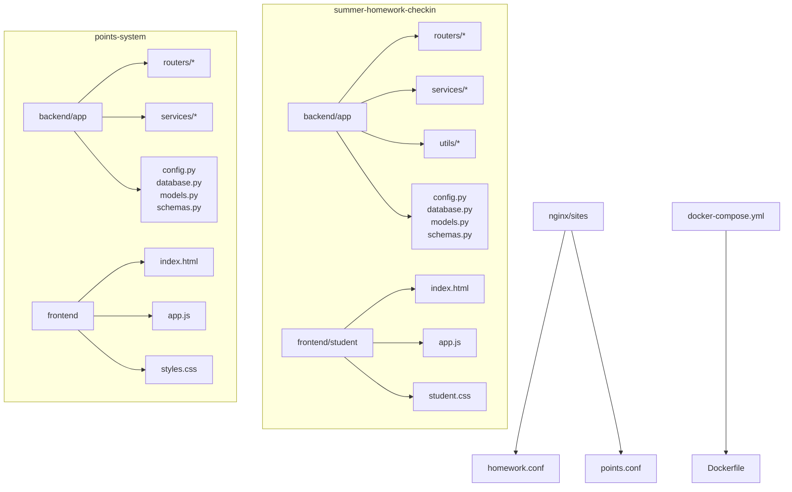
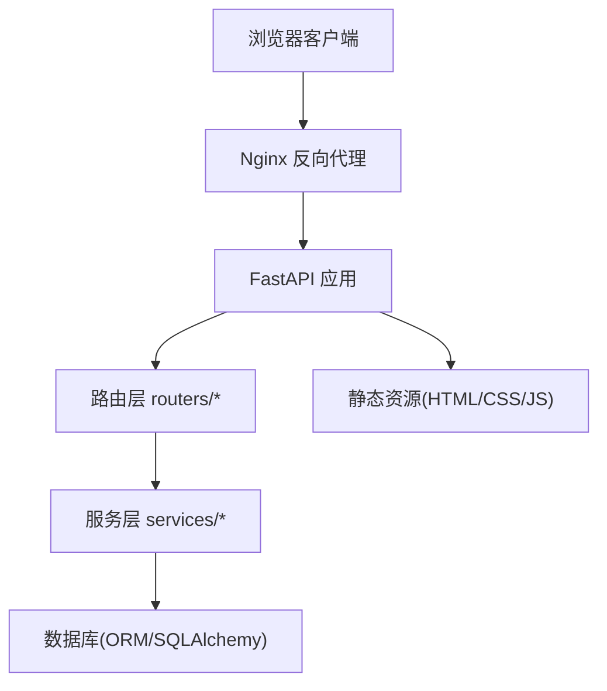
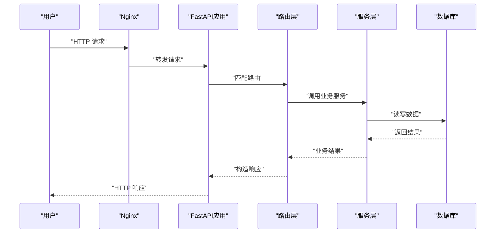
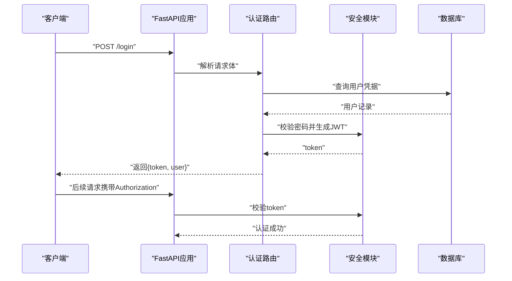
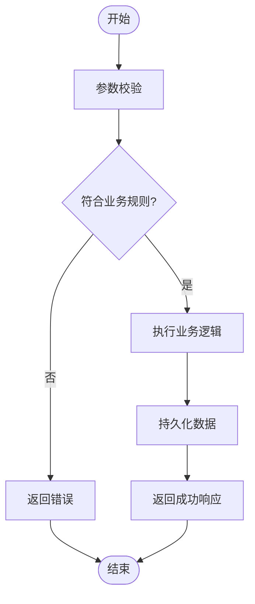
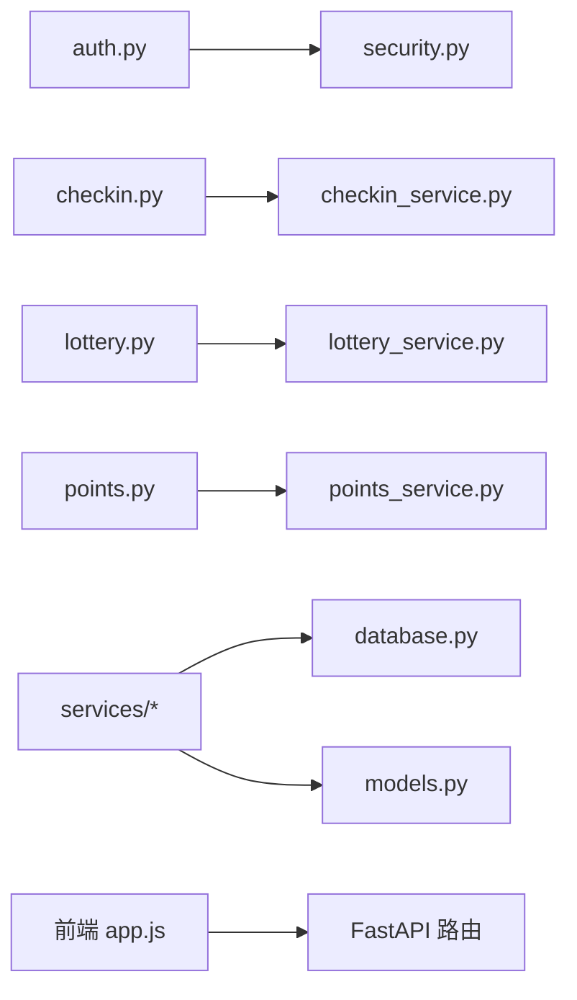

# FastAPI Vue全栈开发技能

<cite>
**本文档引用的文件**   
- [main.py](file://summer-homework-checkin/backend/app/main.py)
- [config.py](file://summer-homework-checkin/backend/app/config.py)
- [database.py](file://summer-homework-checkin/backend/app/database.py)
- [models.py](file://summer-homework-checkin/backend/app/models.py)
- [schemas.py](file://summer-homework-checkin/backend/app/schemas.py)
- [deps.py](file://summer-homework-checkin/backend/app/deps.py)
- [security.py](file://summer-homework-checkin/backend/app/security.py)
- [auth.py](file://summer-homework-checkin/backend/app/routers/auth.py)
- [checkin.py](file://summer-homework-checkin/backend/app/routers/checkin.py)
- [lottery_service.py](file://summer-homework-checkin/backend/app/services/lottery_service.py)
- [points_service.py](file://points-system/backend/app/services/points_service.py)
- [app.js](file://summer-homework-checkin/frontend/student/app.js)
- [index.html](file://summer-homework-checkin/frontend/student/index.html)
- [styles.css](file://summer-homework-checkin/frontend/student/student.css)
- [docker-compose.yml](file://docker-compose.yml)
- [Dockerfile](file://summer-homework-checkin/Dockerfile)
</cite>

## 目录
1. [简介](#简介)
2. [项目结构](#项目结构)
3. [核心组件](#核心组件)
4. [架构总览](#架构总览)
5. [详细组件分析](#详细组件分析)
6. [依赖关系分析](#依赖关系分析)
7. [性能考虑](#性能考虑)
8. [故障排查指南](#故障排查指南)
9. [结论](#结论)
10. [附录](#附录)

## 简介
本项目是一个基于 FastAPI + Vue（原生JS）的全栈示例，涵盖签到、抽奖、积分兑换等常见业务场景。后端采用模块化路由与分层服务设计，使用 SQLAlchemy 进行数据访问，Alembic 管理数据库迁移；前端通过静态 HTML/CSS/JS 直接调用后端 API，并通过 Nginx 统一反向代理。项目同时提供 Docker 化部署方案与 docker-compose 编排，便于本地开发与演示。

## 项目结构
仓库包含多个子项目：points-system（积分系统）、summer-homework-checkin（暑期作业打卡），以及统一的 nginx 配置与 docker-compose 编排。每个子项目均遵循“后端 app + 前端静态资源”的布局，后端按 routers/services/utils 分层组织，前端以单页应用形式提供管理员与学生两个入口。

图表来源
- [main.py](file://summer-homework-checkin/backend/app/main.py)
- [docker-compose.yml](file://docker-compose.yml)
- [Dockerfile](file://summer-homework-checkin/Dockerfile)

章节来源
- [main.py](file://summer-homework-checkin/backend/app/main.py)
- [docker-compose.yml](file://docker-compose.yml)
- [Dockerfile](file://summer-homework-checkin/Dockerfile)

## 核心组件
- 应用入口与路由注册：FastAPI 应用初始化、中间件、CORS、路由挂载。
- 配置与环境变量：集中式配置加载、数据库连接参数、第三方服务密钥。
- 数据层：SQLAlchemy 引擎/会话、模型定义、Alembic 迁移。
- 安全与鉴权：JWT 签发与校验、密码哈希、权限控制。
- 业务服务层：签到、抽奖、积分等业务逻辑封装。
- 前端页面：学生端与管理端的静态页面与交互脚本。
- 部署与运维：Nginx 反向代理、Docker 镜像构建与容器编排。

章节来源
- [main.py](file://summer-homework-checkin/backend/app/main.py)
- [config.py](file://summer-homework-checkin/backend/app/config.py)
- [database.py](file://summer-homework-checkin/backend/app/database.py)
- [models.py](file://summer-homework-checkin/backend/app/models.py)
- [schemas.py](file://summer-homework-checkin/backend/app/schemas.py)
- [security.py](file://summer-homework-checkin/backend/app/security.py)
- [auth.py](file://summer-homework-checkin/backend/app/routers/auth.py)
- [checkin.py](file://summer-homework-checkin/backend/app/routers/checkin.py)
- [lottery_service.py](file://summer-homework-checkin/backend/app/services/lottery_service.py)
- [points_service.py](file://points-system/backend/app/services/points_service.py)
- [app.js](file://summer-homework-checkin/frontend/student/app.js)
- [index.html](file://summer-homework-checkin/frontend/student/index.html)
- [styles.css](file://summer-homework-checkin/frontend/student/student.css)

## 架构总览
整体采用前后端分离架构：浏览器请求由 Nginx 转发至后端 FastAPI 服务，后端通过 SQLAlchemy 访问数据库，业务逻辑集中在 services 层，路由层仅做参数校验与响应组装。前端为轻量级 SPA，通过 fetch/AJAX 调用 RESTful API。

图表来源
- [main.py](file://summer-homework-checkin/backend/app/main.py)
- [auth.py](file://summer-homework-checkin/backend/app/routers/auth.py)
- [checkin.py](file://summer-homework-checkin/backend/app/routers/checkin.py)
- [lottery_service.py](file://summer-homework-checkin/backend/app/services/lottery_service.py)
- [database.py](file://summer-homework-checkin/backend/app/database.py)

## 详细组件分析

### 应用入口与路由注册
- 应用初始化：创建 FastAPI 实例，配置 CORS、异常处理、日志。
- 路由挂载：将各功能模块路由（如 auth、checkin、lottery）挂载到主应用。
- 中间件：可添加限流、审计、请求追踪等通用能力。

图表来源
- [main.py](file://summer-homework-checkin/backend/app/main.py)
- [auth.py](file://summer-homework-checkin/backend/app/routers/auth.py)
- [checkin.py](file://summer-homework-checkin/backend/app/routers/checkin.py)
- [lottery_service.py](file://summer-homework-checkin/backend/app/services/lottery_service.py)
- [database.py](file://summer-homework-checkin/backend/app/database.py)

章节来源
- [main.py](file://summer-homework-checkin/backend/app/main.py)

### 配置与环境变量
- 集中式配置：从环境变量或配置文件读取数据库 URL、JWT 密钥、第三方服务配置。
- 安全建议：敏感信息不硬编码，使用 .env 或密钥管理服务。

章节来源
- [config.py](file://summer-homework-checkin/backend/app/config.py)

### 数据层与 ORM
- 引擎与会话：创建数据库引擎、会话工厂，支持事务与连接池。
- 模型定义：使用 SQLAlchemy 声明式模型，映射业务实体。
- 迁移管理：Alembic 版本化数据库变更，保证环境一致性。

章节来源
- [database.py](file://summer-homework-checkin/backend/app/database.py)
- [models.py](file://summer-homework-checkin/backend/app/models.py)

### 安全与鉴权
- JWT 流程：登录成功后签发 token，后续请求携带 token 进行身份验证。
- 密码安全：使用 bcrypt/argon2 等算法进行哈希存储。
- 权限控制：基于角色或资源的访问控制中间件。

图表来源
- [security.py](file://summer-homework-checkin/backend/app/security.py)
- [auth.py](file://summer-homework-checkin/backend/app/routers/auth.py)

章节来源
- [security.py](file://summer-homework-checkin/backend/app/security.py)
- [auth.py](file://summer-homework-checkin/backend/app/routers/auth.py)

### 业务服务层
- 签到服务：处理签到规则、时间窗口、重复提交防护。
- 抽奖服务：概率计算、奖品库存扣减、防刷机制。
- 积分服务：积分获取、消耗、对账与统计。

图表来源
- [checkin.py](file://summer-homework-checkin/backend/app/routers/checkin.py)
- [lottery_service.py](file://summer-homework-checkin/backend/app/services/lottery_service.py)
- [points_service.py](file://points-system/backend/app/services/points_service.py)

章节来源
- [checkin.py](file://summer-homework-checkin/backend/app/routers/checkin.py)
- [lottery_service.py](file://summer-homework-checkin/backend/app/services/lottery_service.py)
- [points_service.py](file://points-system/backend/app/services/points_service.py)

### 前端交互（Vue/原生JS）
- 页面结构：index.html 作为入口，引入 app.js 与样式文件。
- 网络请求：使用 fetch 或 axios 调用后端 API，处理登录态与错误提示。
- 状态管理：简单场景可使用全局变量或 localStorage 缓存用户信息。

章节来源
- [index.html](file://summer-homework-checkin/frontend/student/index.html)
- [app.js](file://summer-homework-checkin/frontend/student/app.js)
- [styles.css](file://summer-homework-checkin/frontend/student/student.css)

### 部署与运维
- Docker 镜像：多阶段构建，最小化运行时依赖。
- 容器编排：docker-compose 统一管理后端、数据库、Nginx。
- Nginx 配置：反向代理与静态资源托管，HTTPS 终止。

章节来源
- [Dockerfile](file://summer-homework-checkin/Dockerfile)
- [docker-compose.yml](file://docker-compose.yml)

## 依赖关系分析
后端模块间耦合度低，路由层依赖服务层，服务层依赖数据层与安全模块。前端通过 HTTP 接口与后端解耦。外部依赖包括数据库驱动、JWT 库、ORM 框架等。

图表来源
- [auth.py](file://summer-homework-checkin/backend/app/routers/auth.py)
- [checkin.py](file://summer-homework-checkin/backend/app/routers/checkin.py)
- [lottery_service.py](file://summer-homework-checkin/backend/app/services/lottery_service.py)
- [points_service.py](file://points-system/backend/app/services/points_service.py)
- [database.py](file://summer-homework-checkin/backend/app/database.py)
- [models.py](file://summer-homework-checkin/backend/app/models.py)
- [app.js](file://summer-homework-checkin/frontend/student/app.js)

章节来源
- [auth.py](file://summer-homework-checkin/backend/app/routers/auth.py)
- [checkin.py](file://summer-homework-checkin/backend/app/routers/checkin.py)
- [lottery_service.py](file://summer-homework-checkin/backend/app/services/lottery_service.py)
- [points_service.py](file://points-system/backend/app/services/points_service.py)
- [database.py](file://summer-homework-checkin/backend/app/database.py)
- [models.py](file://summer-homework-checkin/backend/app/models.py)
- [app.js](file://summer-homework-checkin/frontend/student/app.js)

## 性能考虑
- 数据库连接池：合理设置 pool_size 与 max_overflow，避免连接耗尽。
- 异步优化：I/O 密集型操作使用异步函数，提升并发处理能力。
- 缓存策略：热点数据使用 Redis 缓存，降低数据库压力。
- 前端优化：静态资源压缩、CDN 加速、懒加载与按需渲染。

## 故障排查指南
- 启动失败：检查环境变量、数据库连接、端口占用。
- 鉴权失败：确认 JWT 密钥一致、token 过期时间、请求头 Authorization 格式。
- 路由 404：核对路由前缀、Nginx 代理路径、静态资源路径。
- 数据库错误：查看 Alembic 迁移状态、表结构是否一致、外键约束。
- 前端报错：检查跨域配置、API 地址、网络请求状态码。

## 结论
本项目展示了 FastAPI + Vue 全栈开发的典型实践，涵盖路由设计、服务分层、数据安全、前端交互与容器化部署。通过模块化与清晰的职责划分，代码易于扩展与维护。建议在后续迭代中引入更完善的测试、监控与日志体系，进一步提升稳定性与可观测性。

## 附录
- 快速开始：克隆仓库、安装依赖、运行数据库迁移、启动服务。
- 常用命令：Docker 构建与编排、Nginx 配置更新、前端构建与部署。
- 最佳实践：命名规范、错误码约定、API 文档自动生成。