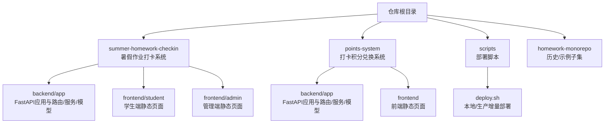
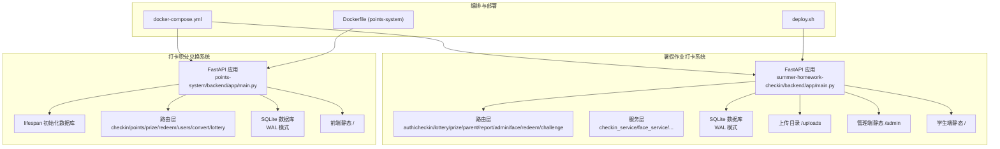
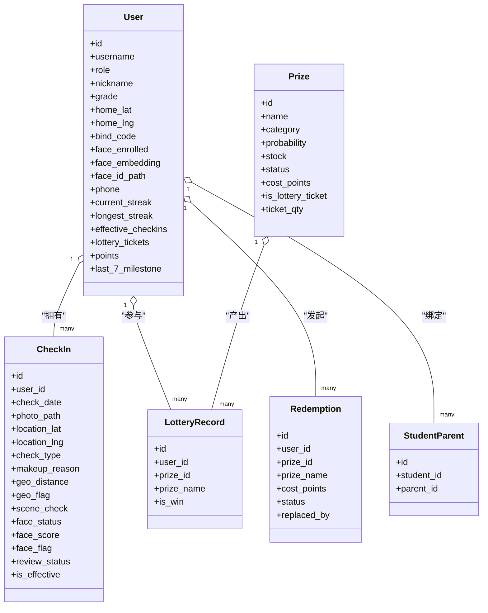
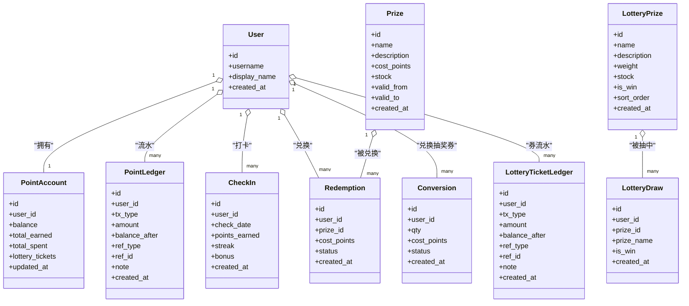
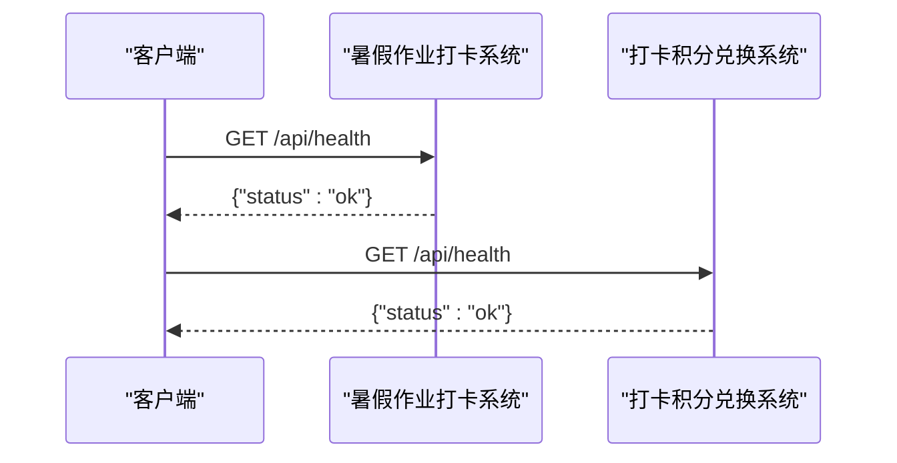
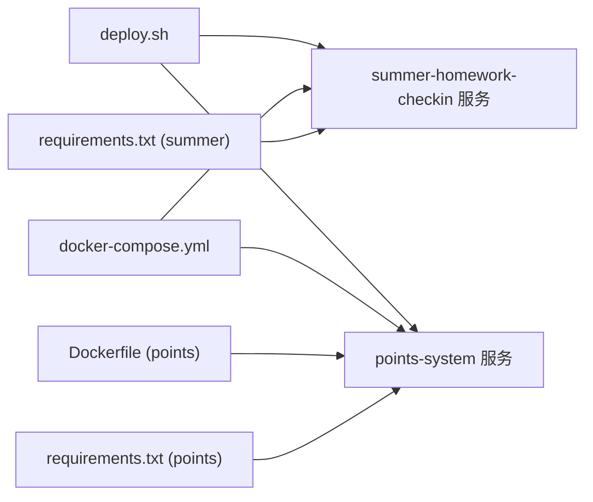
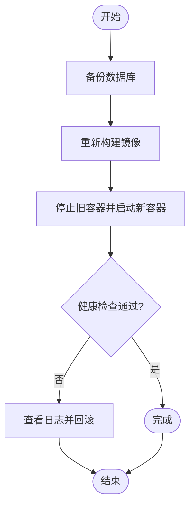

# Monorepo多项目管理架构

<cite>
**本文引用的文件**   
- [docker-compose.yml](file://docker-compose.yml)
- [deploy.sh](file://scripts/deploy.sh)
- [points-system/backend/app/main.py](file://points-system/backend/app/main.py)
- [summer-homework-checkin/backend/app/main.py](file://summer-homework-checkin/backend/app/main.py)
- [points-system/backend/app/config.py](file://points-system/backend/app/config.py)
- [summer-homework-checkin/backend/app/config.py](file://summer-homework-checkin/backend/app/config.py)
- [points-system/backend/app/database.py](file://points-system/backend/app/database.py)
- [summer-homework-checkin/backend/app/database.py](file://summer-homework-checkin/backend/app/database.py)
- [points-system/backend/app/models.py](file://points-system/backend/app/models.py)
- [summer-homework-checkin/backend/app/models.py](file://summer-homework-checkin/backend/app/models.py)
- [points-system/Dockerfile](file://points-system/Dockerfile)
</cite>

## 目录
1. [简介](#简介)
2. [项目结构](#项目结构)
3. [核心组件](#核心组件)
4. [架构总览](#架构总览)
5. [详细组件分析](#详细组件分析)
6. [依赖关系分析](#依赖关系分析)
7. [性能与并发特性](#性能与并发特性)
8. [部署与运维](#部署与运维)
9. [故障排查指南](#故障排查指南)
10. [结论](#结论)

## 简介
本仓库采用 Monorepo 组织方式，统一管理两个独立业务系统：
- 暑假作业打卡系统（summer-homework-checkin）：面向学生与家长，支持人脸核验、地理围栏、抽奖与积分兑换等能力。
- 打卡积分兑换系统（points-system）：提供积分账户、流水对账、奖品兑换与抽奖券兑换等通用能力。

两个系统均基于 FastAPI + SQLAlchemy + SQLite，通过 Docker Compose 统一编排本地运行，并提供增量部署脚本以支持生产环境更新。

## 项目结构
仓库根目录包含两个业务系统的后端与前端代码、Docker 编排与部署脚本，以及若干文档与提示词文件。整体结构如下：

图表来源
- [docker-compose.yml:1-59](file://docker-compose.yml#L1-L59)
- [points-system/Dockerfile:1-22](file://points-system/Dockerfile#L1-L22)

章节来源
- [docker-compose.yml:1-59](file://docker-compose.yml#L1-L59)
- [points-system/Dockerfile:1-22](file://points-system/Dockerfile#L1-L22)

## 核心组件
- 应用入口与路由挂载
  - 暑假作业打卡系统：在应用启动时注册 CORS、中间件、路由，并挂载上传目录与管理端/学生端静态资源。
  - 打卡积分兑换系统：使用 lifespan 初始化数据库，注册路由后挂载前端静态资源。
- 配置与环境变量
  - 暑假作业打卡系统：集中管理上传目录、数据库路径、密钥、CORS、打卡规则、人脸识别阈值等。
  - 打卡积分兑换系统：定义打卡积分、连续奖励、抽奖券兑换比例等规则。
- 数据持久化
  - 两者均采用 SQLite，开启 WAL 模式与忙等待以提升并发读写安全性；通过环境变量将 DB 与上传目录重定向到持久化卷。
- 容器化与编排
  - 通过 Dockerfile 构建镜像，docker-compose.yml 编排两个服务，分别暴露不同端口，挂载独立数据卷。

章节来源
- [summer-homework-checkin/backend/app/main.py:1-64](file://summer-homework-checkin/backend/app/main.py#L1-L64)
- [points-system/backend/app/main.py:1-39](file://points-system/backend/app/main.py#L1-L39)
- [summer-homework-checkin/backend/app/config.py:1-80](file://summer-homework-checkin/backend/app/config.py#L1-L80)
- [points-system/backend/app/config.py:1-17](file://points-system/backend/app/config.py#L1-L17)
- [summer-homework-checkin/backend/app/database.py:1-31](file://summer-homework-checkin/backend/app/database.py#L1-L31)
- [points-system/backend/app/database.py:1-41](file://points-system/backend/app/database.py#L1-L41)
- [docker-compose.yml:1-59](file://docker-compose.yml#L1-L59)

## 架构总览
下图展示了两个服务的职责边界、静态资源挂载与数据持久化策略。

图表来源
- [summer-homework-checkin/backend/app/main.py:1-64](file://summer-homework-checkin/backend/app/main.py#L1-L64)
- [points-system/backend/app/main.py:1-39](file://points-system/backend/app/main.py#L1-L39)
- [docker-compose.yml:1-59](file://docker-compose.yml#L1-L59)
- [points-system/Dockerfile:1-22](file://points-system/Dockerfile#L1-L22)

## 详细组件分析

### 暑假作业打卡系统（summer-homework-checkin）
- 应用入口与中间件
  - 注册 CORS 中间件，允许指定来源访问。
  - 注册 HTTP 中间件实现登录/注册等敏感接口的速率限制。
  - 启动事件内创建表结构作为兜底。
  - 挂载上传目录、管理端与学生端静态资源。
- 配置项
  - 上传目录、数据库路径、签名密钥、CORS 来源、打卡规则、人脸识别阈值与策略等均可通过环境变量覆盖。
- 数据模型
  - 用户角色区分 student/parent/admin，支持家长绑定、人脸采集与比对、打卡记录（含补卡）、抽奖记录、积分兑换、通知、闯关任务等。
- 并发与安全
  - SQLite 启用 WAL 与 busy_timeout，降低写竞争风险。
  - 通过环境变量注入固定密钥，避免每次重启生成新密钥导致鉴权失效。

图表来源
- [summer-homework-checkin/backend/app/models.py:1-213](file://summer-homework-checkin/backend/app/models.py#L1-L213)

章节来源
- [summer-homework-checkin/backend/app/main.py:1-64](file://summer-homework-checkin/backend/app/main.py#L1-L64)
- [summer-homework-checkin/backend/app/config.py:1-80](file://summer-homework-checkin/backend/app/config.py#L1-L80)
- [summer-homework-checkin/backend/app/database.py:1-31](file://summer-homework-checkin/backend/app/database.py#L1-L31)
- [summer-homework-checkin/backend/app/models.py:1-213](file://summer-homework-checkin/backend/app/models.py#L1-L213)

### 打卡积分兑换系统（points-system）
- 应用入口与生命周期
  - 使用 lifespan 在启动时执行数据库初始化。
  - 注册各业务路由后挂载前端静态资源。
- 配置项
  - 定义打卡基础积分、连续奖励、抽奖券兑换比例与抽奖消耗等规则。
- 数据模型
  - 用户与积分账户、积分流水、打卡记录、奖品、兑换记录、积分兑换抽奖券记录、抽奖券流水、抽奖奖池与抽奖记录等，强调可追溯与对账。
- 并发与安全
  - SQLite 启用 WAL 与 busy_timeout，减少「读-改-写」竞态窗口。

图表来源
- [points-system/backend/app/models.py:1-151](file://points-system/backend/app/models.py#L1-L151)

章节来源
- [points-system/backend/app/main.py:1-39](file://points-system/backend/app/main.py#L1-L39)
- [points-system/backend/app/config.py:1-17](file://points-system/backend/app/config.py#L1-L17)
- [points-system/backend/app/database.py:1-41](file://points-system/backend/app/database.py#L1-L41)
- [points-system/backend/app/models.py:1-151](file://points-system/backend/app/models.py#L1-L151)

### 关键流程时序图（健康检查）

图表来源
- [summer-homework-checkin/backend/app/main.py:45-47](file://summer-homework-checkin/backend/app/main.py#L45-L47)
- [points-system/backend/app/main.py:32-34](file://points-system/backend/app/main.py#L32-L34)

## 依赖关系分析
- 运行时依赖
  - 暑假作业打卡系统：FastAPI、SQLAlchemy、人脸识别相关库（insightface/onnxruntime/opencv-python-headless）。
  - 打卡积分兑换系统：FastAPI、SQLAlchemy、图像处理与数值计算库。
- 容器与编排
  - points-system 提供 Dockerfile，docker-compose.yml 编排两个服务，分别映射 8000 与 8001 端口，挂载独立数据卷。
- 部署脚本
  - deploy.sh 支持本地与生产环境的增量更新，包含备份、重建镜像、重启容器与健康检查。

图表来源
- [summer-homework-checkin/backend/requirements.txt:1-11](file://summer-homework-checkin/backend/requirements.txt#L1-L11)
- [points-system/backend/requirements.txt:1-8](file://points-system/backend/requirements.txt#L1-L8)
- [points-system/Dockerfile:1-22](file://points-system/Dockerfile#L1-L22)
- [docker-compose.yml:1-59](file://docker-compose.yml#L1-L59)
- [deploy.sh:1-163](file://scripts/deploy.sh#L1-L163)

章节来源
- [summer-homework-checkin/backend/requirements.txt:1-11](file://summer-homework-checkin/backend/requirements.txt#L1-L11)
- [points-system/backend/requirements.txt:1-8](file://points-system/backend/requirements.txt#L1-L8)
- [points-system/Dockerfile:1-22](file://points-system/Dockerfile#L1-L22)
- [docker-compose.yml:1-59](file://docker-compose.yml#L1-L59)
- [deploy.sh:1-163](file://scripts/deploy.sh#L1-L163)

## 性能与并发特性
- SQLite 并发优化
  - 两个系统均在连接建立时设置 journal_mode=WAL 与 busy_timeout，提升并发读写稳定性。
- 静态资源与服务分离
  - 通过 StaticFiles 直接提供静态资源，减少动态处理开销。
- 速率限制
  - 暑假作业打卡系统在中间件中实现登录/注册等敏感接口的速率限制，防止滥用。

章节来源
- [summer-homework-checkin/backend/app/database.py:13-19](file://summer-homework-checkin/backend/app/database.py#L13-L19)
- [points-system/backend/app/database.py:18-24](file://points-system/backend/app/database.py#L18-L24)
- [summer-homework-checkin/backend/app/main.py:34-42](file://summer-homework-checkin/backend/app/main.py#L34-L42)

## 部署与运维
- 本地开发
  - 使用 docker compose up -d --build 启动两个服务，分别访问 8000 与 8001 端口。
  - 数据库与上传目录通过 volume 持久化，重启不丢失数据。
- 生产部署
  - 使用 deploy.sh 进行增量更新，自动备份数据库、传输代码、重建镜像、重启容器并验证健康状态。
  - 生产环境建议通过环境变量注入固定密钥与允许的 CORS 来源。

图表来源
- [deploy.sh:29-58](file://scripts/deploy.sh#L29-L58)
- [deploy.sh:62-144](file://scripts/deploy.sh#L62-L144)

章节来源
- [docker-compose.yml:1-59](file://docker-compose.yml#L1-L59)
- [deploy.sh:1-163](file://scripts/deploy.sh#L1-L163)

## 故障排查指南
- 健康检查失败
  - 检查容器日志与端口映射是否正确。
  - 确认 /api/health 接口是否返回正常响应。
- 数据库不可用或锁冲突
  - 确认 WAL 模式与 busy_timeout 已生效。
  - 检查数据卷挂载路径与权限。
- 静态资源无法访问
  - 确认 StaticFiles 挂载路径与 HTML 开关参数正确。
- 人脸识别异常
  - 检查环境变量 FACE_MATCH_THRESHOLD、FACE_MODE_ON_ENROLLED 等配置。
  - 确认上传目录存在且可写。

章节来源
- [summer-homework-checkin/backend/app/main.py:45-47](file://summer-homework-checkin/backend/app/main.py#L45-L47)
- [summer-homework-checkin/backend/app/config.py:71-79](file://summer-homework-checkin/backend/app/config.py#L71-L79)
- [summer-homework-checkin/backend/app/database.py:13-19](file://summer-homework-checkin/backend/app/database.py#L13-L19)

## 结论
该 Monorepo 通过清晰的模块划分与统一的编排部署，实现了两个业务系统的协同开发与高效运维。SQLite + WAL 的轻量方案满足中小规模场景的并发需求；环境变量驱动的配置与部署脚本提升了可移植性与可维护性。未来可在以下方面持续优化：
- 引入更完善的迁移工具链（如 Alembic）统一管理数据库版本。
- 增加分布式缓存与消息队列以支撑更高并发。
- 完善监控与告警体系，提升线上可观测性。