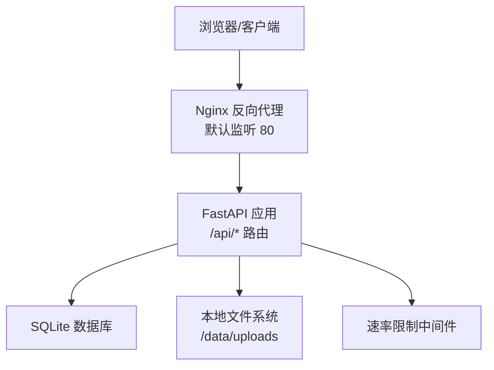
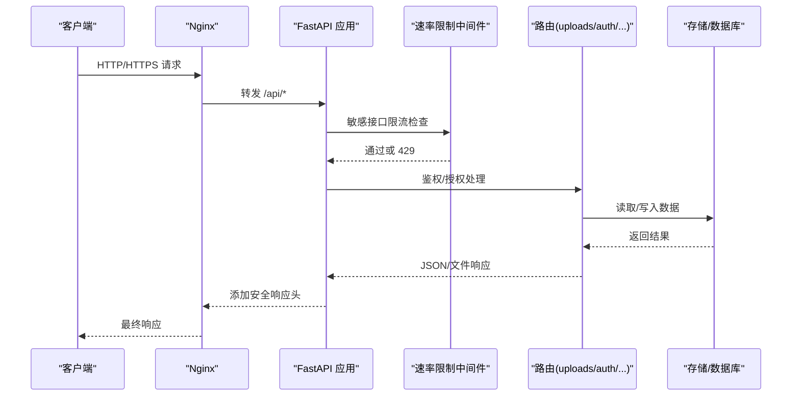
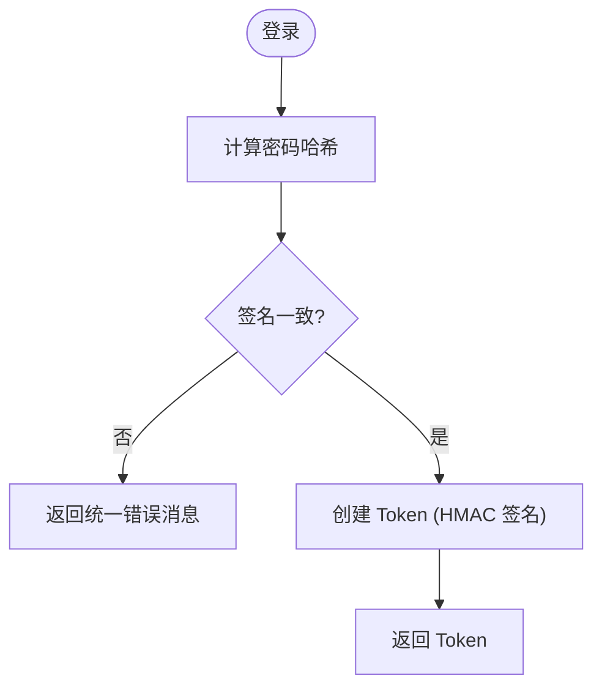
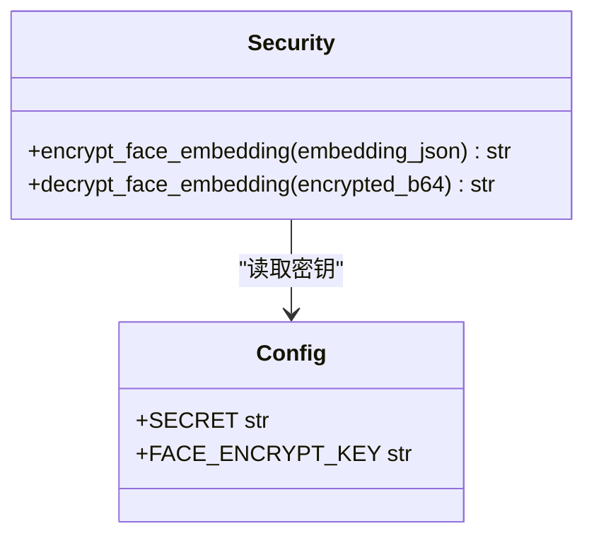
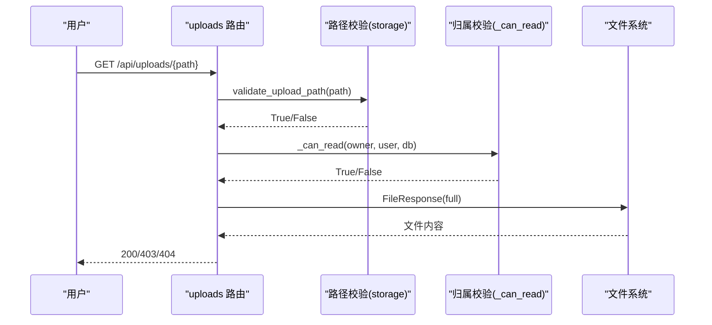
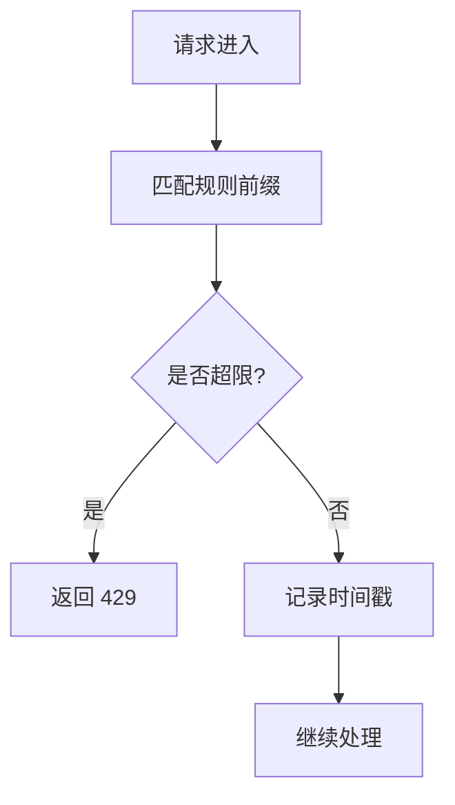
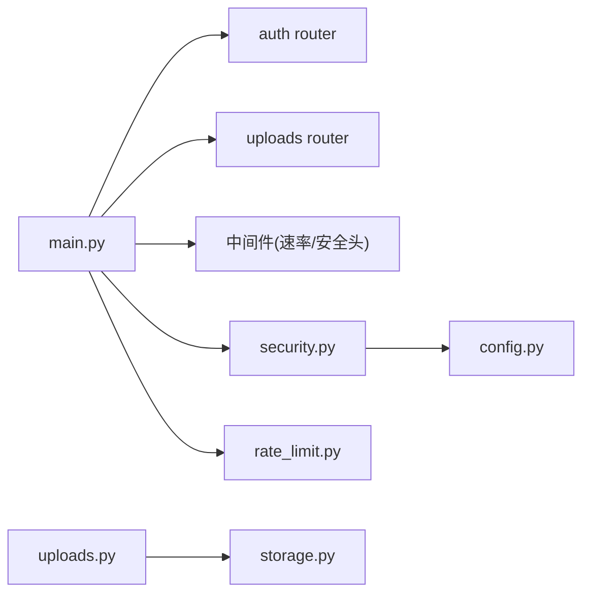

# 安全修复报告

<cite>
**本文引用的文件**
- [SECURITY_PENETRATION_TEST_REPORT.md](file://summer-homework-checkin/docs/SECURITY_PENETRATION_TEST_REPORT.md)
- [SECURITY_REMEDIATION_REPORT.md](file://summer-homework-checkin/docs/SECURITY_REMEDIATION_REPORT.md)
- [security.py](file://summer-homework-checkin/backend/app/security.py)
- [config.py](file://summer-homework-checkin/backend/app/config.py)
- [main.py](file://summer-homework-checkin/backend/app/main.py)
- [uploads.py](file://summer-homework-checkin/backend/app/routers/uploads.py)
- [storage.py](file://summer-homework-checkin/backend/app/utils/storage.py)
- [rate_limit.py](file://summer-homework-checkin/backend/app/utils/rate_limit.py)
- [deploy.sh](file://scripts/deploy.sh)
- [default.conf](file://nginx/default.conf)
</cite>

## 目录
1. [引言](#引言)
2. [项目结构](#项目结构)
3. [核心组件](#核心组件)
4. [架构总览](#架构总览)
5. [详细组件分析](#详细组件分析)
6. [依赖关系分析](#依赖关系分析)
7. [性能与安全权衡](#性能与安全权衡)
8. [故障排查指南](#故障排查指南)
9. [结论](#结论)
10. [附录：修复清单与验证要点](#附录修复清单与验证要点)

## 引言
本报告基于对暑假作业打卡系统的全栈白盒审计与整改记录，汇总已发现的安全问题、修复措施与验证结果。重点覆盖网络层、身份认证与授权、API端点、文件上传、容器与部署链路、数据传输与存储等维度，并给出可操作的加固建议与回归核验要点。

## 项目结构
本仓库包含多个子系统，本次安全修复聚焦于 summer-homework-checkin（后端 FastAPI + 前端静态资源 + Nginx 反向代理 + Docker 部署）。关键路径如下：
- 后端应用：backend/app（路由、服务、工具、配置、安全模块）
- 部署脚本：scripts/deploy.sh
- 反向代理：nginx/default.conf 及 sites/*.conf
- 文档：docs/SECURITY_PENETRATION_TEST_REPORT.md、SECURITY_REMEDIATION_REPORT.md

图表来源
- [default.conf:23-51](file://nginx/default.conf#L23-L51)
- [main.py:20-50](file://summer-homework-checkin/backend/app/main.py#L20-L50)
- [main.py:53-89](file://summer-homework-checkin/backend/app/main.py#L53-L89)

章节来源
- [default.conf:23-51](file://nginx/default.conf#L23-L51)
- [main.py:20-50](file://summer-homework-checkin/backend/app/main.py#L20-L50)

## 核心组件
- 安全与加密：密码哈希、Token 签名、人脸特征向量加密
- 配置管理：密钥生成与强度校验、CORS、环境变量注入
- 应用入口：中间件（速率限制、安全响应头）、生产模式开关
- 文件访问：上传路径校验、归属权限控制、认证下载
- 部署与运行：SSH 凭据安全、端口绑定、容器加固、健康检查

章节来源
- [security.py:11-53](file://summer-homework-checkin/backend/app/security.py#L11-L53)
- [security.py:58-103](file://summer-homework-checkin/backend/app/security.py#L58-L103)
- [config.py:24-66](file://summer-homework-checkin/backend/app/config.py#L24-L66)
- [main.py:17-26](file://summer-homework-checkin/backend/app/main.py#L17-L26)
- [main.py:53-89](file://summer-homework-checkin/backend/app/main.py#L53-L89)
- [uploads.py:16-54](file://summer-homework-checkin/backend/app/routers/uploads.py#L16-L54)
- [storage.py:7-43](file://summer-homework-checkin/backend/app/utils/storage.py#L7-L43)
- [rate_limit.py:1-107](file://summer-homework-checkin/backend/app/utils/rate_limit.py#L1-L107)
- [deploy.sh:112-144](file://scripts/deploy.sh#L112-L144)

## 架构总览
下图展示请求从客户端到后端的完整链路，以及安全控制点（HTTPS、CORS、速率限制、鉴权、文件访问控制、安全响应头等）。

图表来源
- [default.conf:23-51](file://nginx/default.conf#L23-L51)
- [main.py:28-35](file://summer-homework-checkin/backend/app/main.py#L28-L35)
- [main.py:53-89](file://summer-homework-checkin/backend/app/main.py#L53-L89)
- [uploads.py:37-54](file://summer-homework-checkin/backend/app/routers/uploads.py#L37-L54)

## 详细组件分析

### 身份认证与令牌
- 密码哈希采用 PBKDF2-SHA256，带随机盐与迭代次数；验证使用时序安全比较，防时序攻击。
- Token 为自定义 HMAC 签名格式，含用户ID、角色与过期时间；解码时校验签名与过期。
- 建议长期迁移至标准 JWT（含 iat/jti），并实现撤销列表。

图表来源
- [security.py:11-24](file://summer-homework-checkin/backend/app/security.py#L11-L24)
- [security.py:27-53](file://summer-homework-checkin/backend/app/security.py#L27-L53)

章节来源
- [security.py:11-53](file://summer-homework-checkin/backend/app/security.py#L11-L53)

### 人脸特征向量加密
- 新数据使用 AES-GCM 认证加密（机密性+完整性），旧数据兼容 AES-CTR 解密路径。
- 密钥由应用 SECRET 派生，避免额外配置；建议后续迁移历史数据至 GCM 并移除 CTR 兼容代码。

图表来源
- [security.py:58-103](file://summer-homework-checkin/backend/app/security.py#L58-L103)
- [config.py:74-76](file://summer-homework-checkin/backend/app/config.py#L74-L76)

章节来源
- [security.py:58-103](file://summer-homework-checkin/backend/app/security.py#L58-L103)
- [config.py:74-76](file://summer-homework-checkin/backend/app/config.py#L74-L76)

### 文件上传与访问控制
- 上传路径生成与校验防止路径穿越；公开挂载已移除，改为认证 API 下载。
- 下载接口强制鉴权，并进行三层校验：路径合法性、归属校验（admin/student/parent）、文件存在性。
- 前端统一通过 Bearer token 获取 blob URL 渲染图片。

图表来源
- [uploads.py:16-54](file://summer-homework-checkin/backend/app/routers/uploads.py#L16-L54)
- [storage.py:7-43](file://summer-homework-checkin/backend/app/utils/storage.py#L7-L43)

章节来源
- [uploads.py:16-54](file://summer-homework-checkin/backend/app/routers/uploads.py#L16-L54)
- [storage.py:7-43](file://summer-homework-checkin/backend/app/utils/storage.py#L7-L43)

### 速率限制与账户锁定
- 内存型速率限制器覆盖登录、注册、密码修改、人脸采集、打卡等敏感接口。
- 按用户名维度记录失败次数，达到阈值临时锁定，缓解暴力破解。
- 支持通过环境变量关闭（测试环境），生产建议保持开启。

图表来源
- [rate_limit.py:14-66](file://summer-homework-checkin/backend/app/utils/rate_limit.py#L14-L66)
- [rate_limit.py:68-107](file://summer-homework-checkin/backend/app/utils/rate_limit.py#L68-L107)

章节来源
- [rate_limit.py:1-107](file://summer-homework-checkin/backend/app/utils/rate_limit.py#L1-L107)

### 部署与运行安全
- SSH 认证优先密钥；密码回退通过 SSHPASS 环境变量传递，避免明文出现在进程命令行。
- 主机密钥校验默认 accept-new，指纹变更即拒绝，降低 MITM 风险。
- 容器启动参数启用 no-new-privileges、cap_drop ALL（保留必要能力）、CPU/内存限制；根文件系统只读可选。
- 端口绑定默认仅本机（127.0.0.1），避免绕过 Nginx 直接访问后端。

章节来源
- [deploy.sh:112-144](file://scripts/deploy.sh#L112-L144)
- [deploy.sh:260-281](file://scripts/deploy.sh#L260-L281)

## 依赖关系分析
- main.py 引入各路由与安全中间件，统一注册路由与全局策略。
- uploads.py 依赖 storage.py 的路径校验与归属校验逻辑。
- security.py 依赖 config.py 的密钥与配置项。
- rate_limit.py 被 main.py 中间件调用，保护敏感接口。
- deploy.sh 负责生产环境的构建、启动与健康检查，注入环境变量与加固选项。

图表来源
- [main.py:20-50](file://summer-homework-checkin/backend/app/main.py#L20-L50)
- [uploads.py:1-12](file://summer-homework-checkin/backend/app/routers/uploads.py#L1-L12)
- [security.py:1-8](file://summer-homework-checkin/backend/app/security.py#L1-L8)
- [rate_limit.py:1-20](file://summer-homework-checkin/backend/app/utils/rate_limit.py#L1-L20)

章节来源
- [main.py:20-50](file://summer-homework-checkin/backend/app/main.py#L20-L50)
- [uploads.py:1-12](file://summer-homework-checkin/backend/app/routers/uploads.py#L1-L12)
- [security.py:1-8](file://summer-homework-checkin/backend/app/security.py#L1-L8)
- [rate_limit.py:1-20](file://summer-homework-checkin/backend/app/utils/rate_limit.py#L1-L20)

## 性能与安全权衡
- 速率限制在内存中维护计数，具备低开销特性，但重启会清零；生产如需持久化可考虑 Redis 方案。
- 人脸特征向量加密带来 CPU 开销，但保障生物特征数据安全；建议批量迁移历史数据至 GCM 并移除 CTR 兼容分支。
- 容器资源限制防止 DoS，同时需确保业务峰值可用；当前设置 CPU/Memory 限额兼顾稳定性与可用性。
- 生产模式关闭 API 文档减少信息泄露面，不影响功能。

[本节为通用指导，不直接分析具体文件]

## 故障排查指南
- 上传访问 401/403：确认请求携带 Authorization 头且路径合法；检查归属校验逻辑与学生/家长权限。
- 速率限制触发 429：检查请求频率与规则前缀；必要时调整 RATE_LIMIT_ENABLED 或窗口参数。
- 登录失败锁定：确认用户名维度失败计数；成功登录后自动重置。
- 部署失败：查看健康检查日志；确认密钥文件存在且权限正确；核对端口绑定与 CORS 白名单。

章节来源
- [uploads.py:37-54](file://summer-homework-checkin/backend/app/routers/uploads.py#L37-L54)
- [rate_limit.py:43-66](file://summer-homework-checkin/backend/app/utils/rate_limit.py#L43-L66)
- [rate_limit.py:76-107](file://summer-homework-checkin/backend/app/utils/rate_limit.py#L76-L107)
- [deploy.sh:290-318](file://scripts/deploy.sh#L290-L318)

## 结论
系统在安全加固方面已有良好基础：密码哈希、安全响应头、非 root 容器、人脸特征加密、路径遍历防护、速率限制等均到位。本次修复重点解决了上传目录公开、部署脚本凭据暴露、端口直连、生产文档暴露、容器加固不足等关键风险。建议持续推进 HTTPS 全站启用、JWT 标准化、Webhook 凭证加密存储与历史数据迁移，以进一步提升整体安全性与可维护性。

[本节为总结性内容，不直接分析具体文件]

## 附录：修复清单与验证要点
- 上传目录认证化：移除公开挂载，新增 /api/uploads 认证下载；验证矩阵包括无 token、越权、路径穿越、不存在文件等场景。
- 弱口令清理：本地 .env 移除弱口令；生产待探测确认。
- 生产关闭 API 文档：PRODUCTION 环境变量控制 docs/redoc/openapi 开关。
- 部署脚本安全：SSH 密钥优先、密码经环境变量传递、主机密钥校验启用。
- 端口绑定收窄：默认 127.0.0.1，避免绕过 Nginx。
- CORS 白名单过滤：剔除 localhost/127.0.0.1，生产需显式指定。
- 容器加固：no-new-privileges、cap_drop ALL、资源限制、只读根文件系统可选。
- 密钥文件权限：创建时即 600，镜像排除 .secret_key。

章节来源
- [SECURITY_REMEDIATION_REPORT.md:29-127](file://summer-homework-checkin/docs/SECURITY_REMEDIATION_REPORT.md#L29-L127)
- [SECURITY_PENETRATION_TEST_REPORT.md:135-766](file://summer-homework-checkin/docs/SECURITY_PENETRATION_TEST_REPORT.md#L135-L766)