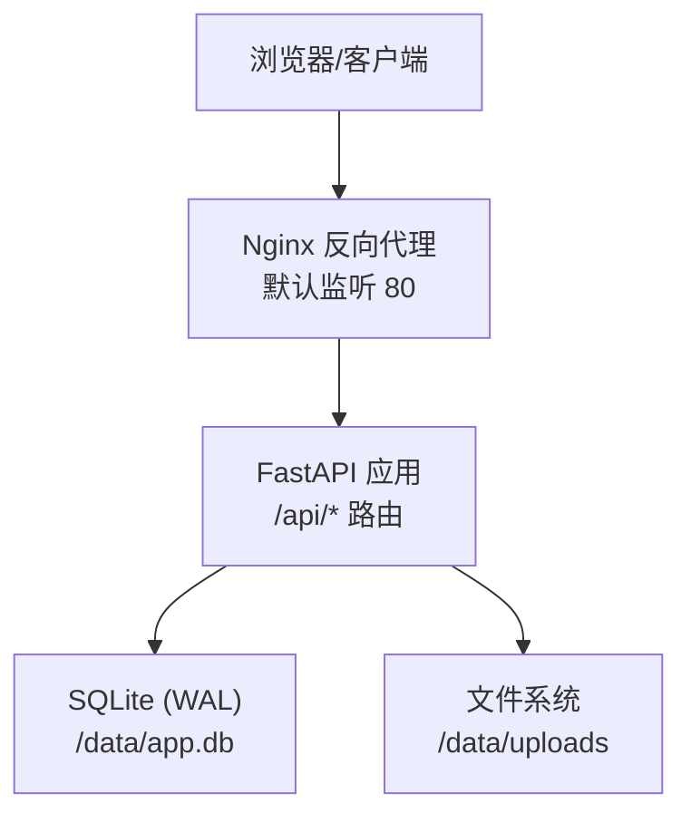
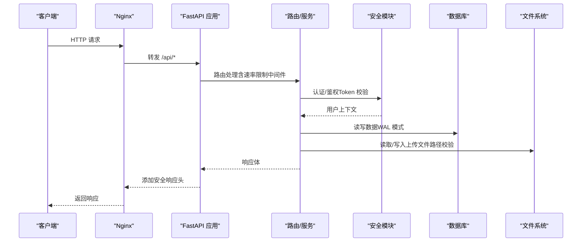
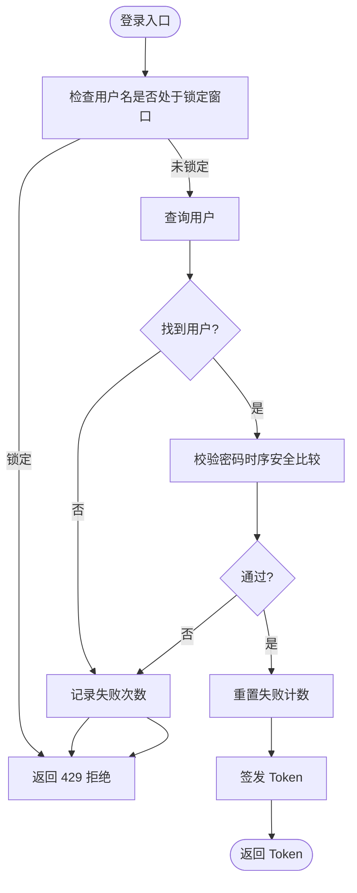
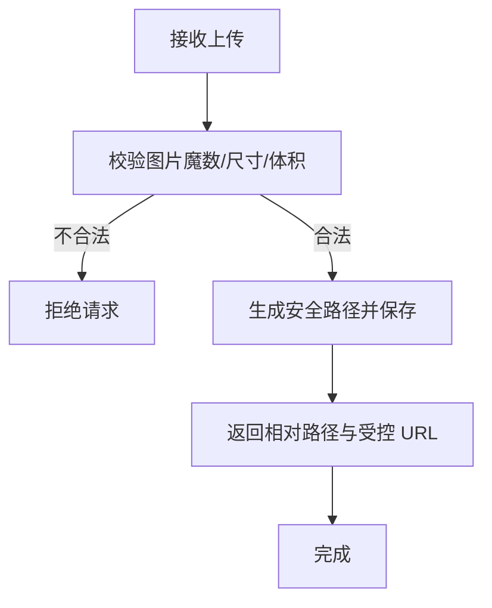
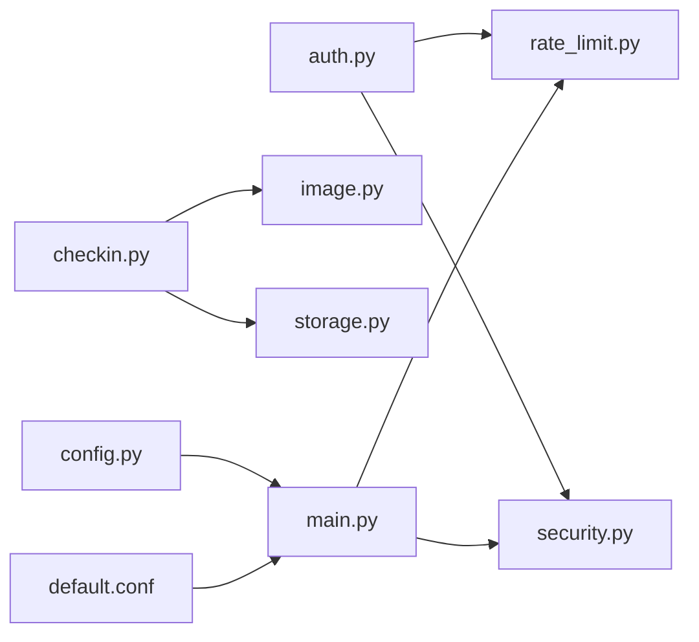

# 安全渗透测试报告

<cite>
**本文引用的文件**
- [SECURITY_PENETRATION_TEST_REPORT.md](file://summer-homework-checkin/docs/SECURITY_PENETRATION_TEST_REPORT.md)
- [main.py](file://summer-homework-checkin/backend/app/main.py)
- [security.py](file://summer-homework-checkin/backend/app/security.py)
- [config.py](file://summer-homework-checkin/backend/app/config.py)
- [database.py](file://summer-homework-checkin/backend/app/database.py)
- [auth.py](file://summer-homework-checkin/backend/app/routers/auth.py)
- [checkin.py](file://summer-homework-checkin/backend/app/routers/checkin.py)
- [storage.py](file://summer-homework-checkin/backend/app/utils/storage.py)
- [image.py](file://summer-homework-checkin/backend/app/utils/image.py)
- [rate_limit.py](file://summer-homework-checkin/backend/app/utils/rate_limit.py)
- [default.conf](file://nginx/default.conf)
- [docker-compose.yml](file://docker-compose.yml)
- [deploy.sh](file://scripts/deploy.sh)
</cite>

## 目录
1. [引言](#引言)
2. [项目结构](#项目结构)
3. [核心组件](#核心组件)
4. [架构总览](#架构总览)
5. [详细组件分析](#详细组件分析)
6. [依赖关系分析](#依赖关系分析)
7. [性能与安全权衡](#性能与安全权衡)
8. [故障排查指南](#故障排查指南)
9. [结论](#结论)
10. [附录：修复实施路线图与用例](#附录修复实施路线图与用例)

## 引言
本报告基于对暑假作业打卡系统（后端 FastAPI + SQLite、前端静态页面、Nginx 反向代理、Docker 部署）的白盒代码审计与配置审查，覆盖网络层、身份认证与授权、API 端点、文件上传、容器与部署、数据传输与存储六大维度。系统已具备多项良好安全实践（密码哈希、安全响应头、非 root 容器运行、人脸特征加密等），但仍存在若干高危与中危问题需要修复，尤其是 HTTPS 缺失与上传目录公开访问风险。

## 项目结构
本仓库包含多个子系统，本次渗透测试聚焦 summer-homework-checkin 子项目及其配套 Nginx 与 Docker 编排。关键路径如下：
- 后端应用：backend/app（路由、服务、工具、配置、安全模块）
- 数据库：SQLite（WAL 模式）
- 反向代理：nginx/default.conf 与各站点片段
- 容器编排：docker-compose.yml、Dockerfile、entrypoint
- 部署脚本：scripts/deploy.sh

图表来源
- [default.conf:23-51](file://nginx/default.conf#L23-L51)
- [main.py:20-50](file://summer-homework-checkin/backend/app/main.py#L20-L50)
- [database.py:6-21](file://summer-homework-checkin/backend/app/database.py#L6-L21)

章节来源
- [default.conf:23-51](file://nginx/default.conf#L23-L51)
- [main.py:20-50](file://summer-homework-checkin/backend/app/main.py#L20-L50)
- [database.py:6-21](file://summer-homework-checkin/backend/app/database.py#L6-L21)

## 核心组件
- 安全与认证：密码哈希、Token 签发与校验、人脸特征向量加密
- 速率限制与登录锁定：防暴力破解与批量注册
- 文件上传与校验：图片魔数检查、尺寸限制、路径穿越防护
- 安全响应头：X-Frame-Options、CSP、Referrer-Policy 等
- 容器与部署：只读根文件系统、资源限制、健康检查、密钥管理

章节来源
- [security.py:11-53](file://summer-homework-checkin/backend/app/security.py#L11-L53)
- [security.py:58-103](file://summer-homework-checkin/backend/app/security.py#L58-L103)
- [rate_limit.py:14-20](file://summer-homework-checkin/backend/app/utils/rate_limit.py#L14-L20)
- [rate_limit.py:76-106](file://summer-homework-checkin/backend/app/utils/rate_limit.py#L76-L106)
- [image.py:60-100](file://summer-homework-checkin/backend/app/utils/image.py#L60-L100)
- [storage.py:7-44](file://summer-homework-checkin/backend/app/utils/storage.py#L7-L44)
- [main.py:53-89](file://summer-homework-checkin/backend/app/main.py#L53-L89)
- [docker-compose.yml:45-71](file://docker-compose.yml#L45-L71)
- [docker-compose.yml:91-108](file://docker-compose.yml#L91-L108)

## 架构总览
下图展示了从请求到鉴权、业务处理、数据落盘与静态资源访问的整体流程，并标注了安全控制点。

图表来源
- [main.py:28-50](file://summer-homework-checkin/backend/app/main.py#L28-L50)
- [main.py:53-89](file://summer-homework-checkin/backend/app/main.py#L53-L89)
- [database.py:13-21](file://summer-homework-checkin/backend/app/database.py#L13-L21)
- [storage.py:20-44](file://summer-homework-checkin/backend/app/utils/storage.py#L20-L44)

## 详细组件分析

### 身份认证与授权
- 密码哈希使用 PBKDF2-SHA256 与随机盐，验证采用时序安全比较，降低侧信道风险。
- Token 为自定义 HMAC 签名格式，包含用户 ID、角色与过期时间；建议后续迁移至标准 JWT 以支持撤销与多设备会话区分。
- 登录接口按用户名维度记录失败次数并锁定，弥补 IP 限流可被伪造 XFF 绕过的缺陷。
- 注册接口对用户名长度、字符集、昵称长度进行校验，但当前在用户名已存在时返回具体错误消息，存在枚举风险。

图表来源
- [auth.py:56-66](file://summer-homework-checkin/backend/app/routers/auth.py#L56-L66)
- [rate_limit.py:76-106](file://summer-homework-checkin/backend/app/utils/rate_limit.py#L76-L106)
- [security.py:11-24](file://summer-homework-checkin/backend/app/security.py#L11-L24)
- [security.py:27-53](file://summer-homework-checkin/backend/app/security.py#L27-L53)

章节来源
- [auth.py:15-66](file://summer-homework-checkin/backend/app/routers/auth.py#L15-L66)
- [security.py:11-53](file://summer-homework-checkin/backend/app/security.py#L11-L53)
- [rate_limit.py:76-106](file://summer-homework-checkin/backend/app/utils/rate_limit.py#L76-L106)

### 文件上传与存储
- 图片校验严格检查魔数，仅允许 JPEG/PNG，检测 SVG/HTML 伪装，限制最大尺寸防止资源耗尽。
- 上传路径生成使用 realpath 校验，防止路径穿越；保存后返回相对路径并通过统一 API 提供受控访问。
- 当前主程序不再公开挂载上传目录，改为认证后可访问的 API 下载，避免人脸照片遍历。

图表来源
- [image.py:60-100](file://summer-homework-checkin/backend/app/utils/image.py#L60-L100)
- [storage.py:7-44](file://summer-homework-checkin/backend/app/utils/storage.py#L7-L44)
- [checkin.py:41-53](file://summer-homework-checkin/backend/app/routers/checkin.py#L41-L53)

章节来源
- [image.py:60-100](file://summer-homework-checkin/backend/app/utils/image.py#L60-L100)
- [storage.py:7-44](file://summer-homework-checkin/backend/app/utils/storage.py#L7-L44)
- [checkin.py:41-53](file://summer-homework-checkin/backend/app/routers/checkin.py#L41-L53)

### 安全响应头与中间件
- 全局中间件设置 X-Frame-Options、X-Content-Type-Options、X-XSS-Protection、CSP、Referrer-Policy、Permissions-Policy，缓解点击劫持、MIME 嗅探、XSS 等常见 Web 攻击。
- CORS 允许的来源与方法/头部在配置中集中管理，生产环境需收紧为实际域名。

章节来源
- [main.py:53-89](file://summer-homework-checkin/backend/app/main.py#L53-L89)
- [config.py:78-84](file://summer-homework-checkin/backend/app/config.py#L78-L84)

### 容器与部署安全
- 容器以非 root 用户运行，根文件系统只读，tmpfs 限制执行位，禁用新权限提升，丢弃全部能力并仅保留必要项，CPU/内存限制防止资源耗尽。
- 部署脚本优先使用 SSH 密钥认证，若使用密码则通过环境变量传递以避免进程命令行泄露；默认启用主机密钥校验策略 accept-new，首次连接自动记录指纹，后续变更即拒绝。
- 生产环境关闭交互式文档（/docs、/redoc、/openapi.json）。

章节来源
- [docker-compose.yml:45-71](file://docker-compose.yml#L45-L71)
- [docker-compose.yml:91-108](file://docker-compose.yml#L91-L108)
- [deploy.sh:112-144](file://scripts/deploy.sh#L112-L144)
- [main.py:17-26](file://summer-homework-checkin/backend/app/main.py#L17-L26)

### 数据传输与存储
- 人脸特征向量使用 AES-GCM 加密存储，保证机密性与完整性；兼容历史 AES-CTR 数据，建议迁移后移除旧路径。
- SQLite 启用 WAL 模式与 busy_timeout，提升并发读写安全性与稳定性。

章节来源
- [security.py:58-103](file://summer-homework-checkin/backend/app/security.py#L58-L103)
- [database.py:13-21](file://summer-homework-checkin/backend/app/database.py#L13-L21)

## 依赖关系分析
- 路由层依赖安全模块进行认证与令牌校验，依赖速率限制中间件保护敏感接口。
- 文件上传依赖图片校验与存储工具，确保输入合法性与路径安全。
- 配置模块集中管理密钥、CORS、阈值等安全参数，便于统一治理。
- Nginx 作为反向代理统一入口，承载缓存策略与上传大小限制。

图表来源
- [auth.py:1-66](file://summer-homework-checkin/backend/app/routers/auth.py#L1-L66)
- [security.py:11-53](file://summer-homework-checkin/backend/app/security.py#L11-L53)
- [rate_limit.py:14-20](file://summer-homework-checkin/backend/app/utils/rate_limit.py#L14-L20)
- [checkin.py:18-53](file://summer-homework-checkin/backend/app/routers/checkin.py#L18-L53)
- [image.py:60-100](file://summer-homework-checkin/backend/app/utils/image.py#L60-L100)
- [storage.py:7-44](file://summer-homework-checkin/backend/app/utils/storage.py#L7-L44)
- [main.py:28-50](file://summer-homework-checkin/backend/app/main.py#L28-L50)
- [config.py:78-84](file://summer-homework-checkin/backend/app/config.py#L78-L84)
- [default.conf:23-51](file://nginx/default.conf#L23-L51)

章节来源
- [auth.py:1-66](file://summer-homework-checkin/backend/app/routers/auth.py#L1-L66)
- [security.py:11-53](file://summer-homework-checkin/backend/app/security.py#L11-L53)
- [rate_limit.py:14-20](file://summer-homework-checkin/backend/app/utils/rate_limit.py#L14-L20)
- [checkin.py:18-53](file://summer-homework-checkin/backend/app/routers/checkin.py#L18-L53)
- [image.py:60-100](file://summer-homework-checkin/backend/app/utils/image.py#L60-L100)
- [storage.py:7-44](file://summer-homework-checkin/backend/app/utils/storage.py#L7-L44)
- [main.py:28-50](file://summer-homework-checkin/backend/app/main.py#L28-L50)
- [config.py:78-84](file://summer-homework-checkin/backend/app/config.py#L78-L84)
- [default.conf:23-51](file://nginx/default.conf#L23-L51)

## 性能与安全权衡
- 速率限制与登录锁定在内存中实现，简单高效但跨实例不可共享；可通过外部存储（如 Redis）扩展以实现集群一致性。
- 图片校验与尺寸限制在内存中解析，避免引入重型依赖，兼顾性能与安全。
- SQLite WAL 模式提升并发写性能与崩溃恢复能力，适合轻量部署场景。
- 容器资源限制与只读根文件系统有助于抑制资源滥用与持久化篡改，但需注意日志与临时文件的合理挂载。

[本节为通用指导，不直接分析具体文件]

## 故障排查指南
- 登录失败锁定触发：检查 rate_limit 配置与登录失败次数，确认是否达到锁定阈值。
- 上传失败：核对图片魔数、体积与尺寸限制，确认未上传 SVG/HTML 伪装文件。
- 健康检查失败：查看容器日志与迁移过程，确认数据库与上传目录权限正确。
- 部署失败：检查 SSH 认证方式、主机密钥校验策略、密钥文件是否存在以及端口绑定地址。

章节来源
- [rate_limit.py:76-106](file://summer-homework-checkin/backend/app/utils/rate_limit.py#L76-L106)
- [image.py:60-100](file://summer-homework-checkin/backend/app/utils/image.py#L60-L100)
- [deploy.sh:112-144](file://scripts/deploy.sh#L112-L144)

## 结论
系统在密码安全、响应头加固、容器安全、人脸特征加密等方面具备良好基础，但仍需优先修复以下问题：
- 配置 HTTPS 以消除明文传输风险
- 确保上传目录不可公开访问
- 生产环境关闭交互式文档
- 收紧 CORS 白名单与端口暴露范围
- 完善弱口令与账户锁定策略
- 迁移旧加密格式并清理兼容代码

上述修复将显著提升系统的整体安全水位，降低数据泄露与越权访问的风险。

[本节为总结性内容，不直接分析具体文件]

## 附录：修复实施路线图与用例
- 紧急修复（1-2 天）
  - 配置 HTTPS（Let's Encrypt + Nginx SSL）
  - 移除 uploads 公开挂载，改为认证 API 访问
  - 修改本地 .env 弱密码
  - 生产环境关闭 /docs 和 /redoc
- 短期加固（1-2 周）
  - 收紧 CORS 白名单与端口绑定
  - 增强密码复杂度与账户锁定机制
  - 迁移人脸特征向量至 AES-GCM 并移除 CTR 兼容代码
  - 对 Webhook URL 与 Outgoing Token 加密存储
- 长期优化（持续）
  - 迁移至标准 JWT，实现令牌撤销与多设备会话管理
  - 引入外部速率限制存储（Redis）以支持集群部署
  - 建立镜像供应链安全策略（固定 digest、镜像扫描）

章节来源
- [SECURITY_PENETRATION_TEST_REPORT.md:791-800](file://summer-homework-checkin/docs/SECURITY_PENETRATION_TEST_REPORT.md#L791-L800)
- [security.py:58-103](file://summer-homework-checkin/backend/app/security.py#L58-L103)
- [config.py:78-84](file://summer-homework-checkin/backend/app/config.py#L78-L84)
- [docker-compose.yml:24-35](file://docker-compose.yml#L24-L35)
- [main.py:17-26](file://summer-homework-checkin/backend/app/main.py#L17-L26)