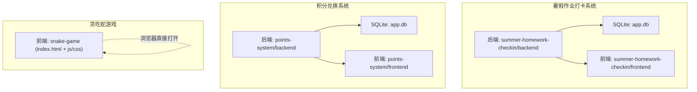
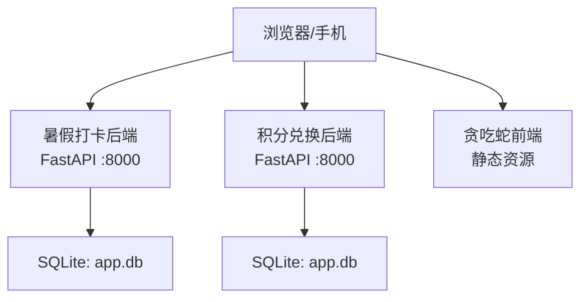
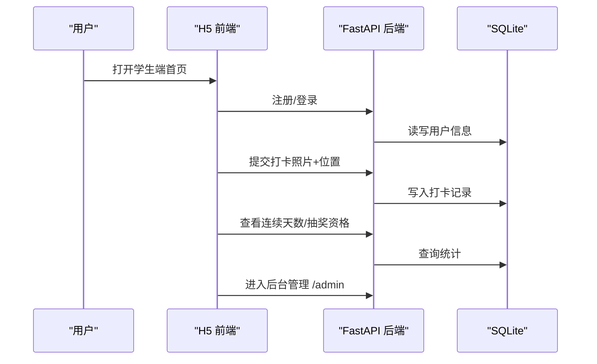
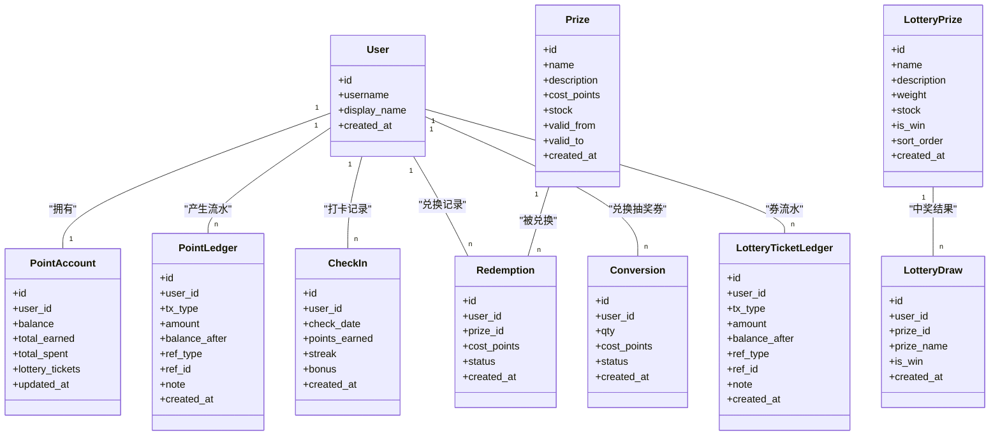
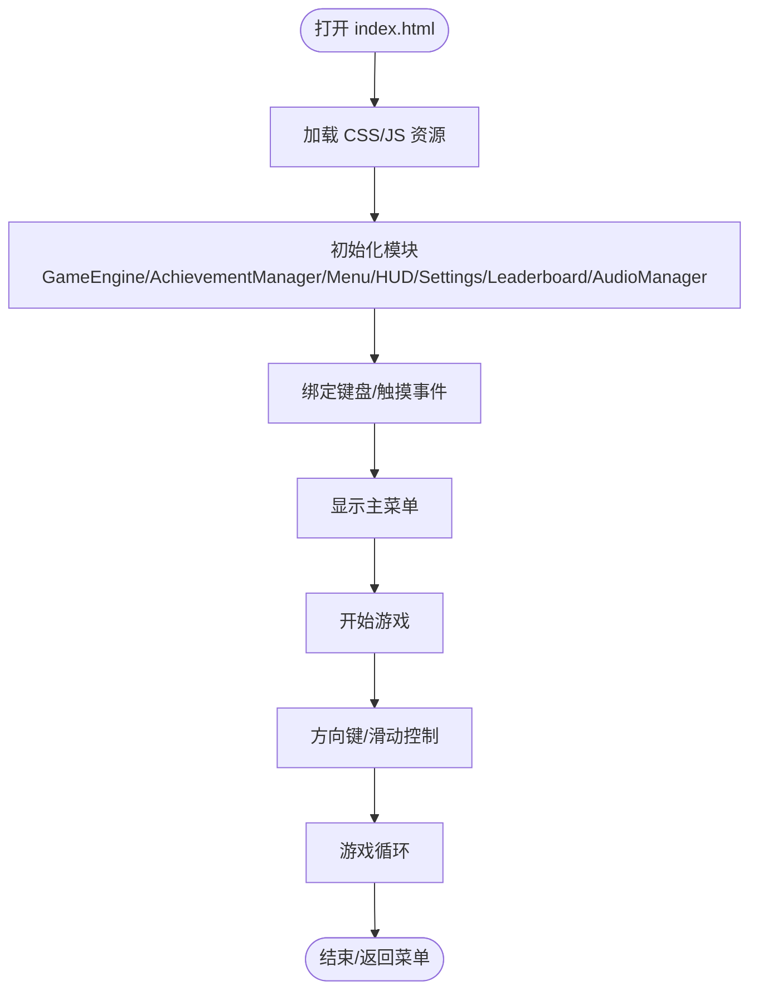
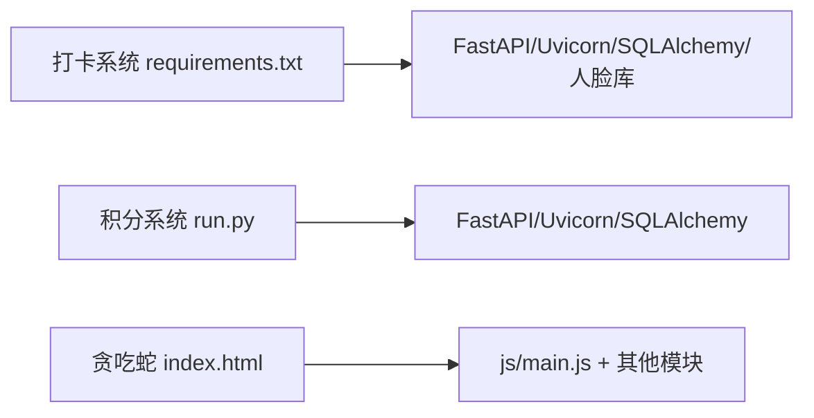

# 快速开始指南

<cite>
**本文引用的文件**
- [summer-homework-checkin/README.md](file://summer-homework-checkin/README.md)
- [summer-homework-checkin/backend/requirements.txt](file://summer-homework-checkin/backend/requirements.txt)
- [summer-homework-checkin/backend/app/config.py](file://summer-homework-checkin/backend/app/config.py)
- [summer-homework-checkin/backend/app/database.py](file://summer-homework-checkin/backend/app/database.py)
- [summer-homework-checkin/backend/app/main.py](file://summer-homework-checkin/backend/app/main.py)
- [summer-homework-checkin/backend/seed.py](file://summer-homework-checkin/backend/seed.py)
- [points-system/backend/run.py](file://points-system/backend/run.py)
- [points-system/backend/app/main.py](file://points-system/backend/app/main.py)
- [points-system/backend/app/config.py](file://points-system/backend/app/config.py)
- [points-system/backend/app/database.py](file://points-system/backend/app/database.py)
- [points-system/backend/app/models.py](file://points-system/backend/app/models.py)
- [snake-game/index.html](file://snake-game/index.html)
- [snake-game/js/main.js](file://snake-game/js/main.js)
- [snake-game/manifest.json](file://snake-game/manifest.json)
</cite>

## 目录
1. [简介](#简介)
2. [项目结构](#项目结构)
3. [核心组件](#核心组件)
4. [架构总览](#架构总览)
5. [详细组件分析](#详细组件分析)
6. [依赖关系分析](#依赖关系分析)
7. [性能与并发特性](#性能与并发特性)
8. [故障排查指南](#故障排查指南)
9. [结论](#结论)
10. [附录：默认账号与常用操作](#附录默认账号与常用操作)

## 简介
本指南面向多项目工作区，提供三个子项目的快速上手说明：暑假作业打卡系统、积分兑换系统、贪吃蛇游戏。内容涵盖环境准备、依赖安装、数据库初始化、启动命令、访问地址、默认账号与基本使用流程，以及常见问题排查建议，帮助用户在本地或服务器环境中顺利运行并体验各系统功能。

## 项目结构
工作区包含三个独立项目，各自具备前后端或纯前端实现：
- 暑假作业打卡系统（Python + FastAPI + SQLite + H5 前端）
- 积分兑换系统（Python + FastAPI + SQLite + 静态前端）
- 贪吃蛇游戏（纯前端 HTML/CSS/JS，支持 PWA）

图表来源
- [summer-homework-checkin/backend/app/main.py:1-49](file://summer-homework-checkin/backend/app/main.py#L1-L49)
- [points-system/backend/app/main.py:1-33](file://points-system/backend/app/main.py#L1-L33)
- [snake-game/index.html:1-297](file://snake-game/index.html#L1-L297)

章节来源
- [summer-homework-checkin/README.md:1-126](file://summer-homework-checkin/README.md#L1-L126)
- [points-system/backend/app/main.py:1-33](file://points-system/backend/app/main.py#L1-L33)
- [snake-game/index.html:1-297](file://snake-game/index.html#L1-L297)

## 核心组件
- 暑假作业打卡系统
  - 后端入口与路由挂载、静态资源托管、健康检查、启动建表等由主应用负责
  - 配置项包括上传目录、数据库路径、签名密钥、打卡规则、人脸识别阈值等
  - 数据库通过 SQLAlchemy 管理，使用 SQLite 持久化
  - 提供种子脚本用于初始化预设奖品与管理员账号
- 积分兑换系统
  - 后端入口使用 lifespan 钩子在启动时完成数据库初始化
  - 配置项定义积分获取、连续奖励、抽奖券兑换比例等
  - 数据库采用 SQLite，开启 WAL 模式与忙等待以提升并发安全
  - 数据模型覆盖用户、账户、流水、打卡、奖品、兑换、抽奖等
- 贪吃蛇游戏
  - 纯前端项目，HTML 页面加载 CSS/JS 资源，支持移动端触控与键盘操作
  - 通过 manifest.json 配置 PWA 图标与主题色，便于添加到桌面

章节来源
- [summer-homework-checkin/backend/app/main.py:1-49](file://summer-homework-checkin/backend/app/main.py#L1-L49)
- [summer-homework-checkin/backend/app/config.py:1-50](file://summer-homework-checkin/backend/app/config.py#L1-L50)
- [summer-homework-checkin/backend/app/database.py:1-22](file://summer-homework-checkin/backend/app/database.py#L1-L22)
- [summer-homework-checkin/backend/seed.py:1-77](file://summer-homework-checkin/backend/seed.py#L1-L77)
- [points-system/backend/app/main.py:1-33](file://points-system/backend/app/main.py#L1-L33)
- [points-system/backend/app/config.py:1-17](file://points-system/backend/app/config.py#L1-L17)
- [points-system/backend/app/database.py:1-39](file://points-system/backend/app/database.py#L1-L39)
- [points-system/backend/app/models.py:1-151](file://points-system/backend/app/models.py#L1-L151)
- [snake-game/index.html:1-297](file://snake-game/index.html#L1-L297)
- [snake-game/manifest.json:1-23](file://snake-game/manifest.json#L1-L23)

## 架构总览
下图展示三个项目的整体交互与部署形态：两个后端服务分别提供 API 与静态页面托管；贪吃蛇为纯前端，可直接在浏览器中打开或通过任意静态服务器托管。

图表来源
- [summer-homework-checkin/backend/app/main.py:1-49](file://summer-homework-checkin/backend/app/main.py#L1-L49)
- [points-system/backend/app/main.py:1-33](file://points-system/backend/app/main.py#L1-L33)
- [snake-game/index.html:1-297](file://snake-game/index.html#L1-L297)

## 详细组件分析

### 暑假作业打卡系统
- 环境要求
  - Python 环境（建议使用 venv）
  - 依赖包列表见 requirements.txt
- 依赖安装
  - 在项目 backend 目录下创建虚拟环境并安装依赖
- 数据库初始化
  - 执行种子脚本以创建表、写入预设奖品、生成管理员账号
- 启动服务
  - 使用 uvicorn 启动后端服务
- 访问地址
  - 学生端 H5：根路径
  - 后台管理：/admin
- 默认账号
  - 管理员：用户名 admin，密码 admin123（由种子脚本创建）
- 关键配置与环境变量
  - 补卡月限额、地理阈值、人脸识别相似度阈值、已采集底图后的人脸策略等均可通过环境变量覆盖
- 人脸识别说明
  - 默认使用 insightface，首次调用自动下载模型（需联网），无外网环境自动降级为安全模式

图表来源
- [summer-homework-checkin/backend/app/main.py:1-49](file://summer-homework-checkin/backend/app/main.py#L1-L49)
- [summer-homework-checkin/backend/app/database.py:1-22](file://summer-homework-checkin/backend/app/database.py#L1-L22)
- [summer-homework-checkin/backend/seed.py:1-77](file://summer-homework-checkin/backend/seed.py#L1-L77)

章节来源
- [summer-homework-checkin/README.md:53-77](file://summer-homework-checkin/README.md#L53-L77)
- [summer-homework-checkin/backend/requirements.txt:1-11](file://summer-homework-checkin/backend/requirements.txt#L1-L11)
- [summer-homework-checkin/backend/app/config.py:1-50](file://summer-homework-checkin/backend/app/config.py#L1-L50)
- [summer-homework-checkin/backend/app/main.py:1-49](file://summer-homework-checkin/backend/app/main.py#L1-L49)
- [summer-homework-checkin/backend/app/database.py:1-22](file://summer-homework-checkin/backend/app/database.py#L1-L22)
- [summer-homework-checkin/backend/seed.py:1-77](file://summer-homework-checkin/backend/seed.py#L1-L77)

### 积分兑换系统
- 环境要求
  - Python 环境（建议使用 venv）
- 依赖安装
  - 参考后端依赖清单（如存在 requirements.txt）或在当前环境安装所需包
- 数据库初始化
  - 后端启动时通过 lifespan 钩子调用 init_db 完成建表
- 启动服务
  - 使用 uvicorn 启动后端服务
- 访问地址
  - 根路径提供静态前端页面
- 关键配置
  - 每次打卡基础积分、连续奖励、抽奖券兑换比例等
- 数据模型概览
  - 用户、积分账户、流水、打卡、奖品、兑换、抽奖券流水、奖池、抽奖记录

图表来源
- [points-system/backend/app/models.py:1-151](file://points-system/backend/app/models.py#L1-L151)

章节来源
- [points-system/backend/app/main.py:1-33](file://points-system/backend/app/main.py#L1-L33)
- [points-system/backend/app/config.py:1-17](file://points-system/backend/app/config.py#L1-L17)
- [points-system/backend/app/database.py:1-39](file://points-system/backend/app/database.py#L1-L39)
- [points-system/backend/app/models.py:1-151](file://points-system/backend/app/models.py#L1-L151)

### 贪吃蛇游戏
- 环境要求
  - 现代浏览器即可运行，无需后端
- 启动方式
  - 直接在浏览器中打开 index.html，或使用任意静态服务器托管该目录
- 访问地址
  - 根路径即为游戏主页
- 主要功能
  - 菜单、设置、排行榜、成就、帮助界面
  - 键盘与移动端触控操作
  - PWA 支持（manifest.json）

图表来源
- [snake-game/index.html:1-297](file://snake-game/index.html#L1-L297)
- [snake-game/js/main.js:1-216](file://snake-game/js/main.js#L1-L216)
- [snake-game/manifest.json:1-23](file://snake-game/manifest.json#L1-L23)

章节来源
- [snake-game/index.html:1-297](file://snake-game/index.html#L1-L297)
- [snake-game/js/main.js:1-216](file://snake-game/js/main.js#L1-L216)
- [snake-game/manifest.json:1-23](file://snake-game/manifest.json#L1-L23)

## 依赖关系分析
- 暑假作业打卡系统
  - 后端依赖 FastAPI、uvicorn、SQLAlchemy、人脸识别相关库（insightface、onnxruntime、opencv-python-headless、numpy、pillow）
  - 运行时生成 SQLite 数据库文件与上传目录
- 积分兑换系统
  - 后端依赖 FastAPI、uvicorn、SQLAlchemy
  - 运行时启用 SQLite WAL 模式与忙等待提升并发能力
- 贪吃蛇游戏
  - 无后端依赖，纯前端资源加载

图表来源
- [summer-homework-checkin/backend/requirements.txt:1-11](file://summer-homework-checkin/backend/requirements.txt#L1-L11)
- [points-system/backend/run.py:1-6](file://points-system/backend/run.py#L1-L6)
- [snake-game/index.html:1-297](file://snake-game/index.html#L1-L297)

章节来源
- [summer-homework-checkin/backend/requirements.txt:1-11](file://summer-homework-checkin/backend/requirements.txt#L1-L11)
- [points-system/backend/run.py:1-6](file://points-system/backend/run.py#L1-L6)
- [snake-game/index.html:1-297](file://snake-game/index.html#L1-L297)

## 性能与并发特性
- 打卡系统
  - SQLite 单进程访问，适合演示与轻量部署；生产环境可替换为 PostgreSQL/MySQL
  - 人脸识别推理为 CPU 密集型，建议在具备外网的机器上运行以自动下载模型
- 积分系统
  - 开启 SQLite WAL 日志与 busy_timeout，降低「读-改-写」竞态窗口，提高并发稳定性
- 贪吃蛇
  - 纯前端渲染，性能取决于设备与浏览器优化；可通过减少动画复杂度或调整帧率进一步优化

[本节为通用指导，不直接分析具体文件]

## 故障排查指南
- 暑假作业打卡系统
  - 无法访问 /api/health：确认后端是否成功启动且端口未被占用
  - 人脸识别失败或模型未下载：确保机器可访问外网；若沙箱无外网，将自动降级为安全模式
  - 上传照片异常：检查 uploads 目录权限与最小体积/尺寸限制
- 积分兑换系统
  - 启动时报数据库错误：确认 app.db 所在目录可写；WAL 模式下避免外部工具同时修改数据库
  - 并发写入冲突：适当增大 busy_timeout 或迁移至更合适的数据库
- 贪吃蛇游戏
  - 资源加载失败：检查浏览器控制台网络请求，确认静态资源路径正确
  - 移动端触控无效：确认 touchstart/touchend 事件未被其他元素拦截

章节来源
- [summer-homework-checkin/backend/app/main.py:33-49](file://summer-homework-checkin/backend/app/main.py#L33-L49)
- [summer-homework-checkin/backend/app/config.py:1-50](file://summer-homework-checkin/backend/app/config.py#L1-L50)
- [points-system/backend/app/database.py:16-23](file://points-system/backend/app/database.py#L16-L23)
- [snake-game/js/main.js:78-163](file://snake-game/js/main.js#L78-L163)

## 结论
本指南提供了三个项目的完整快速上手路径：从环境准备到依赖安装、数据库初始化、服务启动与访问，再到默认账号与基本操作流程，并附带常见问题的排查建议。按照步骤操作，用户可在本地或服务器环境中顺利运行并体验各系统功能。

[本节为总结性内容，不直接分析具体文件]

## 附录：默认账号与常用操作
- 暑假作业打卡系统
  - 管理员账号：admin / admin123（由种子脚本创建）
  - 常用操作：注册学生与家长账号、家长绑定孩子、学生打卡、查看连续天数与抽奖资格、进入后台管理进行奖品与报表管理
- 积分兑换系统
  - 常用操作：注册/登录、每日打卡获得积分、积分兑换奖品或抽奖券、参与抽奖、查看流水与排行榜
- 贪吃蛇游戏
  - 常用操作：选择难度与模式、开始游戏、暂停/继续、查看排行榜与成就、调整设置

章节来源
- [summer-homework-checkin/backend/seed.py:61-71](file://summer-homework-checkin/backend/seed.py#L61-L71)
- [summer-homework-checkin/README.md:63-77](file://summer-homework-checkin/README.md#L63-L77)
- [points-system/backend/app/models.py:1-151](file://points-system/backend/app/models.py#L1-L151)
- [snake-game/index.html:1-297](file://snake-game/index.html#L1-L297)