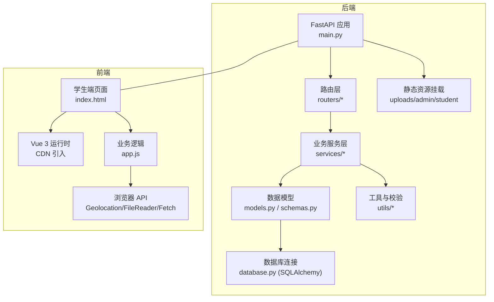
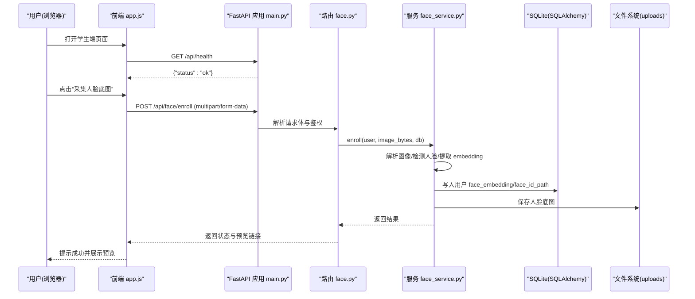
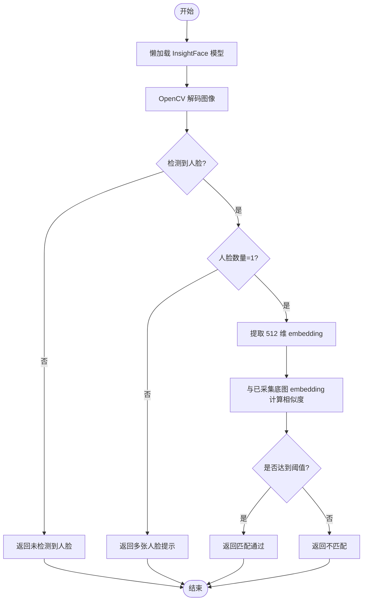

# 技术栈说明

<cite>
**本文引用的文件**   
- [backend/app/main.py](file://summer-homework-checkin/backend/app/main.py)
- [backend/requirements.txt](file://summer-homework-checkin/backend/requirements.txt)
- [backend/app/config.py](file://summer-homework-checkin/backend/app/config.py)
- [backend/app/database.py](file://summer-homework-checkin/backend/app/database.py)
- [backend/app/models.py](file://summer-homework-checkin/backend/app/models.py)
- [backend/app/schemas.py](file://summer-homework-checkin/backend/app/schemas.py)
- [backend/app/routers/face.py](file://summer-homework-checkin/backend/app/routers/face.py)
- [backend/app/services/face_service.py](file://summer-homework-checkin/backend/app/services/face_service.py)
- [backend/app/utils/image.py](file://summer-homework-checkin/backend/app/utils/image.py)
- [frontend/student/index.html](file://summer-homework-checkin/frontend/student/index.html)
- [frontend/student/app.js](file://summer-homework-checkin/frontend/student/app.js)
</cite>

## 目录
1. [简介](#简介)
2. [项目结构](#项目结构)
3. [核心组件](#核心组件)
4. [架构总览](#架构总览)
5. [详细组件分析](#详细组件分析)
6. [依赖与兼容性](#依赖与兼容性)
7. [性能考量](#性能考量)
8. [故障排查指南](#故障排查指南)
9. [结论](#结论)
10. [附录：环境配置与扩展建议](#附录：环境配置与扩展建议)

## 简介
本技术选型文档围绕“暑假作业打卡系统”的后端与前端技术栈展开，重点阐述以下方面：
- Python FastAPI 框架的优势与异步特性
- Vue.js 3 的前端架构选择与 CDN 集成方式
- SQLite 数据库的适用性与性能特点
- InsightFace 人脸识别库的集成方案
- OpenCV 图像处理能力
- 各技术组件的版本兼容性与依赖关系
- 环境配置要求、第三方服务集成方案与扩展性考虑

该文档旨在为开发者、运维人员与产品团队提供清晰的技术决策依据与落地指引。

## 项目结构
后端采用 FastAPI + SQLAlchemy（SQLite）+ 模块化路由与服务层；前端采用纯 HTML/CSS/JS + Vue.js 3（CDN 引入），由后端静态资源托管。

图表来源
- [backend/app/main.py:1-49](file://summer-homework-checkin/backend/app/main.py#L1-L49)
- [backend/app/database.py:1-22](file://summer-homework-checkin/backend/app/database.py#L1-L22)
- [frontend/student/index.html:1-349](file://summer-homework-checkin/frontend/student/index.html#L1-L349)
- [frontend/student/app.js:1-403](file://summer-homework-checkin/frontend/student/app.js#L1-L403)

章节来源
- [backend/app/main.py:1-49](file://summer-homework-checkin/backend/app/main.py#L1-L49)
- [backend/app/database.py:1-22](file://summer-homework-checkin/backend/app/database.py#L1-L22)
- [frontend/student/index.html:1-349](file://summer-homework-checkin/frontend/student/index.html#L1-L349)
- [frontend/student/app.js:1-403](file://summer-homework-checkin/frontend/student/app.js#L1-L403)

## 核心组件
- 后端框架：FastAPI（异步、高性能、自动文档）
- Web 服务器：Uvicorn（ASGI 服务器）
- ORM 与数据库：SQLAlchemy + SQLite（轻量、零配置、可持久化）
- 人脸识别：InsightFace（人脸检测+特征提取，1:1 比对）
- 图像处理：OpenCV（headless 版本，用于图像解码与推理输入）
- 前端框架：Vue.js 3（CDN 引入，响应式 UI）
- 其他：python-multipart（表单上传）、Pillow（可选，图片处理）、NumPy（向量计算）

章节来源
- [backend/requirements.txt:1-11](file://summer-homework-checkin/backend/requirements.txt#L1-L11)
- [backend/app/config.py:1-50](file://summer-homework-checkin/backend/app/config.py#L1-L50)

## 架构总览
整体采用前后端分离但静态资源统一托管的模式：后端通过 FastAPI 提供 RESTful API，并直接托管学生端与管理端静态页面；前端通过 Fetch 调用后端接口，使用浏览器原生能力完成拍照、定位与本地预览。

图表来源
- [backend/app/main.py:1-49](file://summer-homework-checkin/backend/app/main.py#L1-L49)
- [backend/app/routers/face.py:1-45](file://summer-homework-checkin/backend/app/routers/face.py#L1-L45)
- [backend/app/services/face_service.py:1-133](file://summer-homework-checkin/backend/app/services/face_service.py#L1-L133)
- [backend/app/database.py:1-22](file://summer-homework-checkin/backend/app/database.py#L1-L22)

## 详细组件分析

### 后端：FastAPI 与路由组织
- 应用初始化与中间件：启用 CORS、挂载静态资源（uploads、admin、student）。
- 启动事件：在应用启动时创建数据库表结构。
- 路由注册：按功能模块拆分路由（认证、打卡、抽奖、奖品、家长、报表、管理、人脸、兑换等）。

章节来源
- [backend/app/main.py:1-49](file://summer-homework-checkin/backend/app/main.py#L1-L49)

### 数据库：SQLite 与 SQLAlchemy
- 引擎参数：针对 SQLite 开启多线程访问（check_same_thread=False），使用 future=True 模式。
- 会话工厂：autoflush=False、autocommit=False，按需提交事务。
- 模型定义：用户、绑定关系、打卡记录、奖品、抽奖记录、兑换记录、通知、闯关任务与打卡记录等。

章节来源
- [backend/app/database.py:1-22](file://summer-homework-checkin/backend/app/database.py#L1-L22)
- [backend/app/models.py:1-212](file://summer-homework-checkin/backend/app/models.py#L1-L212)

### 配置与环境变量
- 路径与目录：上传目录、前端静态目录、数据库文件路径。
- 安全与令牌：签名密钥、Token 过期天数。
- 打卡规则：地理阈值、补卡次数限制、照片体积与尺寸门槛。
- 积分与抽奖：正常打卡/补卡积分、连续打卡解锁抽奖券阈值。
- 人脸识别：相似度阈值、检测输入尺寸、模型名称、已采集后的人脸策略（enforce/soft）。

章节来源
- [backend/app/config.py:1-50](file://summer-homework-checkin/backend/app/config.py#L1-L50)

### 人脸识别：InsightFace 集成方案
- 懒加载与线程安全：首次调用时加载 FaceAnalysis，全局缓存，避免重复初始化。
- 图像预处理：OpenCV headless 解码为 NumPy 数组，送入模型进行人脸检测与特征提取。
- 1:1 比对：将现场照与用户已采集底图的 embedding 做余弦相似度计算，超过阈值即判定为本人。
- 降级策略：若模型不可用或检测失败，返回明确错误信息，不会静默放行。
- 存储与暴露：底图保存到 uploads，返回公开 URL 供前端展示。

图表来源
- [backend/app/services/face_service.py:1-133](file://summer-homework-checkin/backend/app/services/face_service.py#L1-L133)
- [backend/app/utils/image.py:1-61](file://summer-homework-checkin/backend/app/utils/image.py#L1-L61)

章节来源
- [backend/app/routers/face.py:1-45](file://summer-homework-checkin/backend/app/routers/face.py#L1-L45)
- [backend/app/services/face_service.py:1-133](file://summer-homework-checkin/backend/app/services/face_service.py#L1-L133)
- [backend/app/utils/image.py:1-61](file://summer-homework-checkin/backend/app/utils/image.py#L1-L61)

### 图像处理与合规校验
- 轻量解析：在不依赖 Pillow 的情况下解析 JPEG/PNG 头，获取宽高与格式。
- 合规校验：基于配置的最小体积与最小边长过滤占位图与缩略图，确保真实现场照片。

章节来源
- [backend/app/utils/image.py:1-61](file://summer-homework-checkin/backend/app/utils/image.py#L1-L61)
- [backend/app/config.py:27-33](file://summer-homework-checkin/backend/app/config.py#L27-L33)

### 前端：Vue.js 3 与 CDN 集成
- 页面入口：index.html 通过 CDN 引入 Vue 3 运行时，挂载到 #app。
- 业务逻辑：app.js 实现登录/注册、家长与孩子切换、打卡流程、人脸采集、积分商城、抽奖、报告下载、闯关任务等。
- 浏览器能力：使用 Geolocation 获取位置、FileReader 预览图片、Fetch 调用后端 API。
- 静态资源：由后端统一托管，包含 CSS 与 JS。

章节来源
- [frontend/student/index.html:1-349](file://summer-homework-checkin/frontend/student/index.html#L1-L349)
- [frontend/student/app.js:1-403](file://summer-homework-checkin/frontend/student/app.js#L1-L403)

## 依赖与兼容性
- Python 包与最低版本：
  - fastapi>=0.110
  - uvicorn[standard]>=0.27
  - python-multipart>=0.0.9
  - sqlalchemy>=2.0
  - insightface>=0.7
  - onnxruntime>=1.16
  - opencv-python-headless>=4.9
  - numpy>=1.24
  - pillow>=10.0
- 前端依赖：
  - Vue.js 3（CDN 引入，无需构建）

章节来源
- [backend/requirements.txt:1-11](file://summer-homework-checkin/backend/requirements.txt#L1-L11)
- [frontend/student/index.html:8](file://summer-homework-checkin/frontend/student/index.html#L8)

## 性能考量
- 后端：
  - FastAPI 基于 ASGI，天然支持高并发；配合 Uvicorn 标准版可获得良好吞吐。
  - SQLite 适合中小规模数据与单机部署；注意并发写锁问题，可通过合理的事务粒度与索引优化提升查询性能。
  - 人脸识别模型懒加载与 CPU 运行（ctx_id=-1）降低内存占用，适合轻量部署；必要时可升级硬件或迁移至 GPU 环境。
- 前端：
  - 使用 CDN 加载 Vue 3，减少首屏构建成本；图片预览使用 FileReader 本地渲染，减轻服务端压力。
  - 定位与上传操作尽量在前端完成必要校验，减少无效请求。

## 故障排查指南
- 健康检查：
  - 使用 /api/health 确认服务可用。
- 人脸识别不可用：
  - 检查 InsightFace 模型是否可下载与缓存目录权限；查看服务日志中的模型可用性标志。
- 图像校验失败：
  - 确认照片体积与尺寸满足配置阈值；检查是否为有效 JPEG/PNG。
- 数据库连接异常：
  - 检查 SQLite 文件路径与权限；确认多线程访问参数设置正确。
- 前端无法加载：
  - 确认静态资源挂载路径与浏览器同源策略；检查 CORS 配置。

章节来源
- [backend/app/main.py:33-36](file://summer-homework-checkin/backend/app/main.py#L33-L36)
- [backend/app/services/face_service.py:128-133](file://summer-homework-checkin/backend/app/services/face_service.py#L128-L133)
- [backend/app/utils/image.py:51-61](file://summer-homework-checkin/backend/app/utils/image.py#L51-L61)
- [backend/app/database.py:6-10](file://summer-homework-checkin/backend/app/database.py#L6-L10)

## 结论
本系统以 FastAPI 为核心，结合 SQLite 与模块化路由/服务层，实现了轻量、可扩展的作业打卡平台。前端采用 Vue.js 3 并通过 CDN 集成，快速交付且易于维护。人脸识别通过 InsightFace 与 OpenCV 实现 1:1 比对，具备明确的降级策略与合规校验。整体技术栈在性能、可维护性与扩展性之间取得平衡，适合校园场景的短期与中期使用。

## 附录：环境配置与扩展建议
- 环境变量与关键配置项：
  - SUMMER_SECRET：签名密钥（生产环境务必替换）
  - GEO_THRESHOLD_METERS：地理风险阈值（米）
  - MAX_MAKEUP_PER_MONTH：单月补卡次数上限
  - CHECKIN_POINTS/MAKEUP_POINTS：打卡/补卡积分
  - FACE_MATCH_THRESHOLD：人脸相似度阈值
  - FACE_DET_SIZE：人脸检测输入尺寸
  - FACE_MODEL_NAME：InsightFace 预训练模型名
  - FACE_MODE_ON_ENROLLED：已采集后的人脸策略（enforce/soft）
- 第三方服务集成：
  - 当前无外部短信/邮件服务；如需通知扩展，可在 notify_service 中接入企业微信/钉钉/邮件网关。
- 扩展性考虑：
  - 数据库：从 SQLite 迁移至 PostgreSQL/MySQL 仅需调整 DATABASE_URL 与连接参数。
  - 人脸识别：预留 1:N 扩展点（face_embedding 字段），未来可对接人脸库检索。
  - 前端：可逐步迁移至构建型工程（Vite/Vue CLI），增强类型与打包优化。
  - 部署：容器化（Docker）+ Nginx 反向代理，结合 HTTPS 证书与静态资源 CDN。

章节来源
- [backend/app/config.py:19-50](file://summer-homework-checkin/backend/app/config.py#L19-L50)
- [backend/app/models.py:27-31](file://summer-homework-checkin/backend/app/models.py#L27-L31)