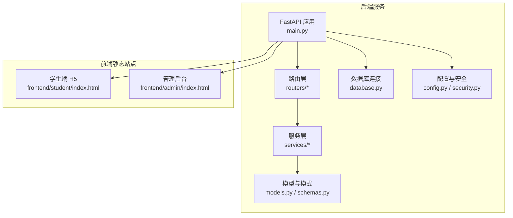
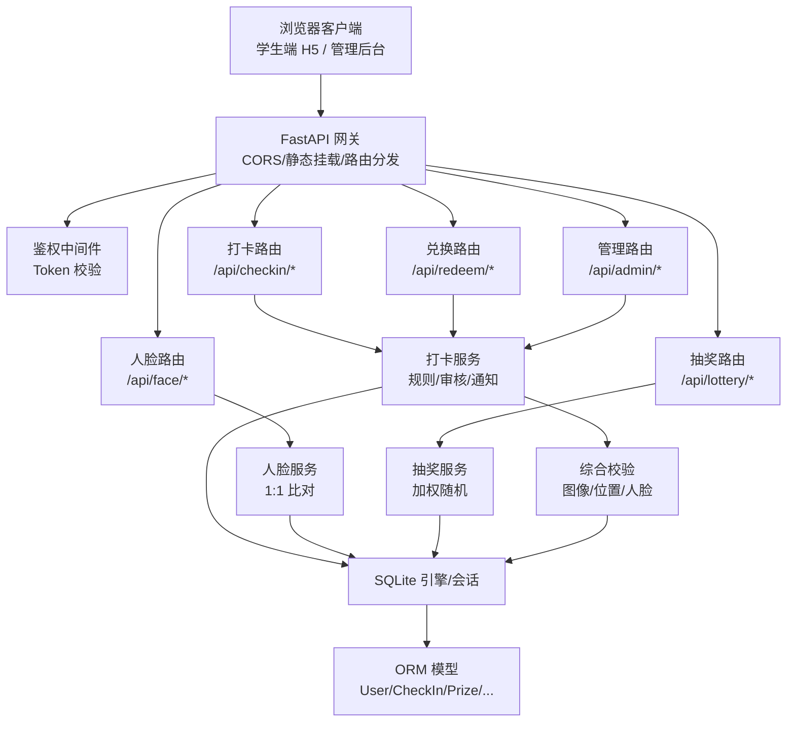
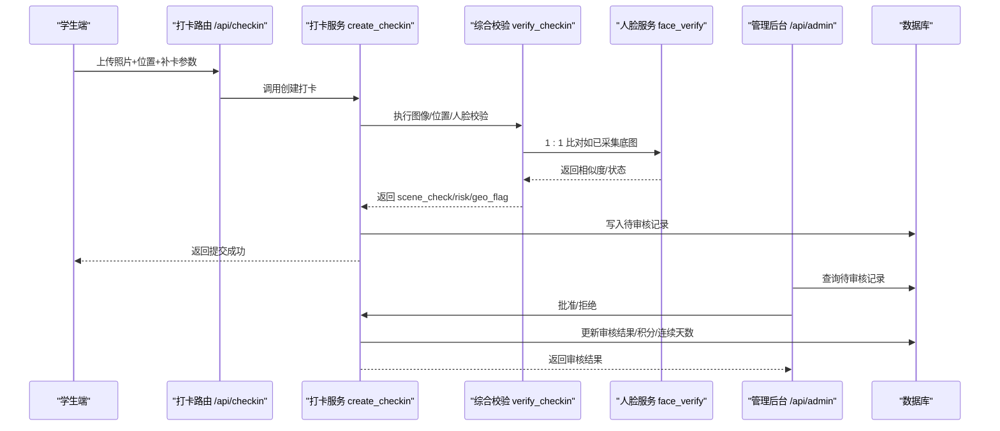
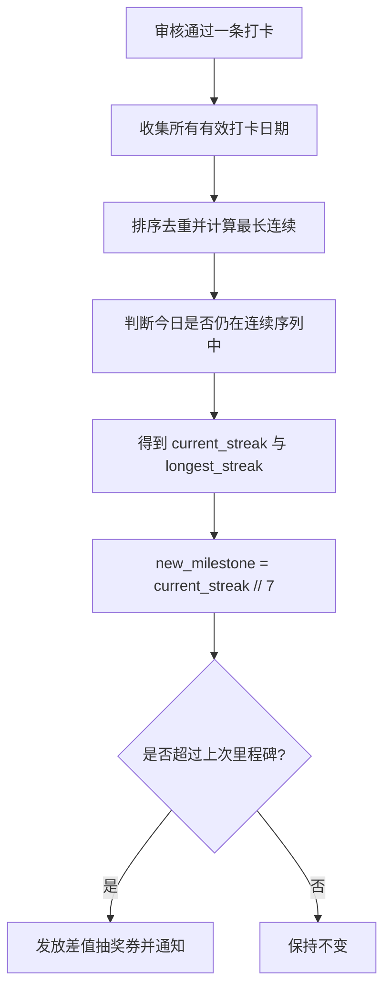
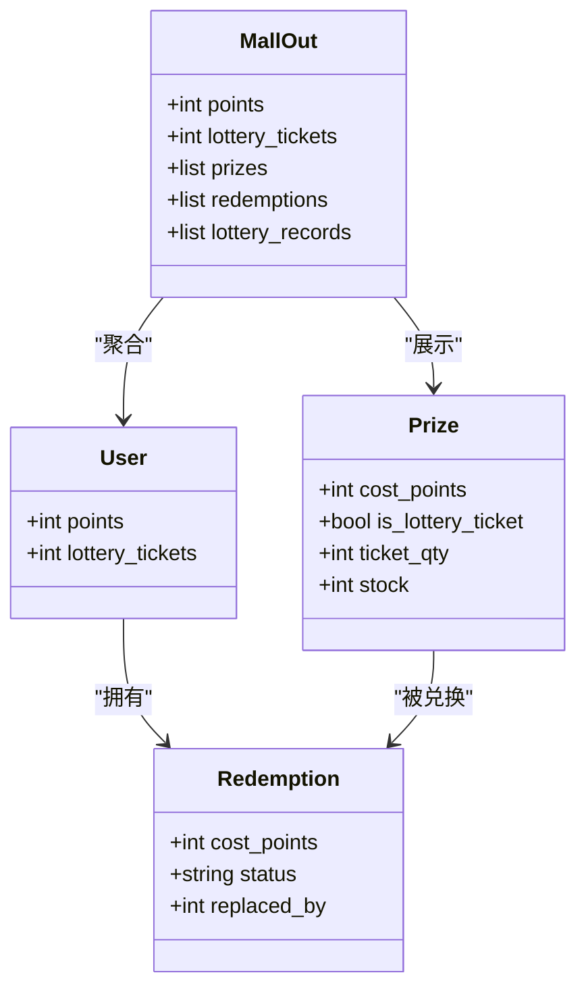
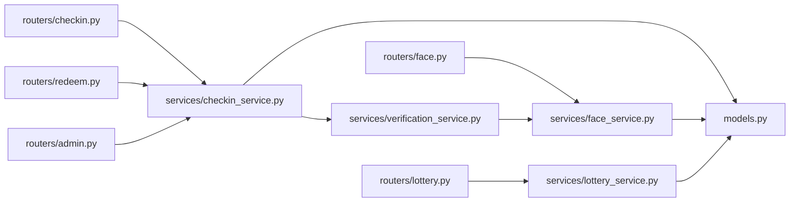

# 暑假作业打卡系统介绍

<cite>
**本文引用的文件**   
- [README.md](file://summer-homework-checkin/README.md)
- [main.py](file://summer-homework-checkin/backend/app/main.py)
- [config.py](file://summer-homework-checkin/backend/app/config.py)
- [database.py](file://summer-homework-checkin/backend/app/database.py)
- [models.py](file://summer-homework-checkin/backend/app/models.py)
- [schemas.py](file://summer-homework-checkin/backend/app/schemas.py)
- [security.py](file://summer-homework-checkin/backend/app/security.py)
- [checkin_service.py](file://summer-homework-checkin/backend/app/services/checkin_service.py)
- [face_service.py](file://summer-homework-checkin/backend/app/services/face_service.py)
- [verification_service.py](file://summer-homework-checkin/backend/app/services/verification_service.py)
- [lottery_service.py](file://summer-homework-checkin/backend/app/services/lottery_service.py)
- [checkin.py](file://summer-homework-checkin/backend/app/routers/checkin.py)
- [face.py](file://summer-homework-checkin/backend/app/routers/face.py)
- [lottery.py](file://summer-homework-checkin/backend/app/routers/lottery.py)
- [redeem.py](file://summer-homework-checkin/backend/app/routers/redeem.py)
- [admin.py](file://summer-homework-checkin/backend/app/routers/admin.py)
- [index.html（学生端）](file://summer-homework-checkin/frontend/student/index.html)
- [index.html（管理后台）](file://summer-homework-checkin/frontend/admin/index.html)
</cite>

## 目录
1. [引言](#引言)
2. [项目结构](#项目结构)
3. [核心组件](#核心组件)
4. [架构总览](#架构总览)
5. [详细组件分析](#详细组件分析)
6. [依赖关系分析](#依赖关系分析)
7. [性能与扩展性](#性能与扩展性)
8. [故障排查指南](#故障排查指南)
9. [结论](#结论)
10. [附录：API 概览](#附录api-概览)

## 引言
本系统面向三年级小学生，提供“暑假全周期学习打卡”的一站式解决方案。围绕“每日打卡、人脸识别防作弊、连续天数统计、补卡机制、积分奖励、抽奖系统、家长监督”等核心能力，构建学生端 H5 与管理后台双端体验，帮助学生在暑期保持学习习惯，同时为家长和老师提供可视化数据与审核工具。

业务价值与使用场景
- 学生端 H5：手机/平板即可操作，卡通清新界面，三步完成打卡；支持人脸底图采集与 1:1 比对，降低代打卡风险。
- 管理后台：独立页面承载，覆盖奖品全生命周期、用户与打卡审核、兑换记录处理与报表查看。
- 家长监督：通过绑定码与家长账号绑定，实时接收孩子打卡、抽奖与兑换通知。

技术栈选择与适用性
- FastAPI + Vue.js 3 + SQLite：前后端分离、轻量部署、零配置数据库，适合演示与中小规模运行；后续可平滑替换为 PostgreSQL/MySQL 并增加多 worker 与 CDN 静态资源托管。

**章节来源**
- [README.md:1-126](file://summer-homework-checkin/README.md#L1-L126)

## 项目结构
后端采用 FastAPI 模块化路由与服务分层，前端以两个独立静态站点（学生端与管理后台）由后端统一挂载。

**图表来源**
- [main.py:1-48](file://summer-homework-checkin/backend/app/main.py#L1-L48)
- [config.py:1-50](file://summer-homework-checkin/backend/app/config.py#L1-L50)
- [database.py:1-22](file://summer-homework-checkin/backend/app/database.py#L1-L22)
- [index.html（学生端）:1-271](file://summer-homework-checkin/frontend/student/index.html#L1-L271)
- [index.html（管理后台）:1-410](file://summer-homework-checkin/frontend/admin/index.html#L1-L410)

**章节来源**
- [main.py:1-48](file://summer-homework-checkin/backend/app/main.py#L1-L48)
- [config.py:1-50](file://summer-homework-checkin/backend/app/config.py#L1-L50)
- [database.py:1-22](file://summer-homework-checkin/backend/app/database.py#L1-L22)
- [index.html（学生端）:1-271](file://summer-homework-checkin/frontend/student/index.html#L1-L271)
- [index.html（管理后台）:1-410](file://summer-homework-checkin/frontend/admin/index.html#L1-L410)

## 核心组件
- 认证与鉴权：基于 HMAC 签名 Token 的无状态鉴权，角色区分 student/parent/admin。
- 打卡与审核：照片合规校验、地理位置一致性、人脸 1:1 比对、补卡限额与凭证、管理员审核生效。
- 连续天数与激励：自动重算当前/最长连续天数，每满 7 天解锁一次抽奖资格。
- 抽奖与兑换：加权随机抽取奖品；积分商城支持直接兑换或“抽奖机会”类奖品。
- 家长监督：绑定码绑定后，关键事件推送站内通知。
- 报表与可视化：按暑假窗口生成学习报告，支持下载打印。

**章节来源**
- [security.py:1-47](file://summer-homework-checkin/backend/app/security.py#L1-L47)
- [checkin_service.py:1-254](file://summer-homework-checkin/backend/app/services/checkin_service.py#L1-L254)
- [face_service.py:1-133](file://summer-homework-checkin/backend/app/services/face_service.py#L1-L133)
- [verification_service.py:1-71](file://summer-homework-checkin/backend/app/services/verification_service.py#L1-L71)
- [lottery_service.py:1-77](file://summer-homework-checkin/backend/app/services/lottery_service.py#L1-L77)
- [admin.py:1-214](file://summer-homework-checkin/backend/app/routers/admin.py#L1-L214)

## 架构总览
系统采用前后端分离架构，后端统一挂载静态站点，提供 RESTful API；数据持久化使用 SQLite，便于快速部署与演示。

**图表来源**
- [main.py:1-48](file://summer-homework-checkin/backend/app/main.py#L1-L48)
- [checkin.py:1-80](file://summer-homework-checkin/backend/app/routers/checkin.py#L1-L80)
- [face.py:1-45](file://summer-homework-checkin/backend/app/routers/face.py#L1-L45)
- [lottery.py:1-30](file://summer-homework-checkin/backend/app/routers/lottery.py#L1-L30)
- [redeem.py:1-81](file://summer-homework-checkin/backend/app/routers/redeem.py#L1-L81)
- [admin.py:1-214](file://summer-homework-checkin/backend/app/routers/admin.py#L1-L214)
- [checkin_service.py:1-254](file://summer-homework-checkin/backend/app/services/checkin_service.py#L1-L254)
- [face_service.py:1-133](file://summer-homework-checkin/backend/app/services/face_service.py#L1-L133)
- [verification_service.py:1-71](file://summer-homework-checkin/backend/app/services/verification_service.py#L1-L71)
- [lottery_service.py:1-77](file://summer-homework-checkin/backend/app/services/lottery_service.py#L1-L77)
- [database.py:1-22](file://summer-homework-checkin/backend/app/database.py#L1-L22)
- [models.py:1-176](file://summer-homework-checkin/backend/app/models.py#L1-L176)

## 详细组件分析

### 打卡与审核流程
- 入口：学生端提交现场照片、可选补卡信息与位置信息。
- 校验：图片真实性、尺寸与格式；地理位置一致性；人脸 1:1 比对（已采集底图时严格拦截）。
- 存储：写入待审核记录，标记风险等级与人脸结果。
- 审核：管理员通过后发放积分并重算连续天数与抽奖券；拒绝则记录原因。

**图表来源**
- [checkin.py:1-80](file://summer-homework-checkin/backend/app/routers/checkin.py#L1-L80)
- [checkin_service.py:64-210](file://summer-homework-checkin/backend/app/services/checkin_service.py#L64-L210)
- [verification_service.py:19-71](file://summer-homework-checkin/backend/app/services/verification_service.py#L19-L71)
- [face_service.py:99-125](file://summer-homework-checkin/backend/app/services/face_service.py#L99-L125)
- [admin.py:84-103](file://summer-homework-checkin/backend/app/routers/admin.py#L84-L103)

**章节来源**
- [checkin.py:1-80](file://summer-homework-checkin/backend/app/routers/checkin.py#L1-L80)
- [checkin_service.py:1-254](file://summer-homework-checkin/backend/app/services/checkin_service.py#L1-L254)
- [verification_service.py:1-71](file://summer-homework-checkin/backend/app/services/verification_service.py#L1-L71)
- [face_service.py:1-133](file://summer-homework-checkin/backend/app/services/face_service.py#L1-L133)
- [admin.py:1-214](file://summer-homework-checkin/backend/app/routers/admin.py#L1-L214)

### 人脸识别（1:1 本人比对）
- 采集：学生端在「我的」上传正脸照，服务端检测单脸并保存 512 维 embedding。
- 比对：每次打卡对现场照提取特征并与底图做余弦相似度比较，低于阈值拒绝打卡（可配置策略）。
- 降级：无外网或模型不可用时，已采集底图的账号将拒绝打卡以防绕过，未采集账号正常。

**图表来源**
- [face.py:14-45](file://summer-homework-checkin/backend/app/routers/face.py#L14-L45)
- [face_service.py:71-133](file://summer-homework-checkin/backend/app/services/face_service.py#L71-L133)
- [config.py:41-50](file://summer-homework-checkin/backend/app/config.py#L41-L50)

**章节来源**
- [face.py:1-45](file://summer-homework-checkin/backend/app/routers/face.py#L1-45)
- [face_service.py:1-133](file://summer-homework-checkin/backend/app/services/face_service.py#L1-L133)
- [config.py:1-50](file://summer-homework-checkin/backend/app/config.py#L1-L50)

### 连续天数与抽奖资格
- 连续天数：基于有效打卡日期排序计算当前连续与历史最长连续。
- 抽奖资格：每满 7 天自动发放一次，永久累积；中断不扣回已发放次数。
- 触发时机：管理员审核通过后触发重算与发放。

**图表来源**
- [checkin_service.py:39-61](file://summer-homework-checkin/backend/app/services/checkin_service.py#L39-L61)

**章节来源**
- [checkin_service.py:1-254](file://summer-homework-checkin/backend/app/services/checkin_service.py#L1-L254)

### 积分与兑换
- 积分获取：正常打卡与补卡分别获得不同积分（可配置）。
- 商城聚合：展示余额、可兑换奖品、我的兑换与抽奖记录。
- 兑换逻辑：普通奖品扣积分并创建兑换记录；“抽奖机会”类奖品直接增加抽奖券且不扣库存。
- 替换机制：支持对未处理的兑换记录进行替换，原记录指向新记录。

**图表来源**
- [models.py:103-161](file://summer-homework-checkin/backend/app/models.py#L103-L161)
- [schemas.py:207-213](file://summer-homework-checkin/backend/app/schemas.py#L207-L213)
- [redeem.py:24-81](file://summer-homework-checkin/backend/app/routers/redeem.py#L24-L81)

**章节来源**
- [redeem.py:1-81](file://summer-homework-checkin/backend/app/routers/redeem.py#L1-L81)
- [models.py:103-161](file://summer-homework-checkin/backend/app/models.py#L103-L161)
- [schemas.py:184-213](file://summer-homework-checkin/backend/app/schemas.py#L184-L213)

### 家长监督与通知
- 绑定：家长凭孩子绑定码建立绑定关系。
- 通知：打卡提交、审核结果、抽奖中奖等事件向家长推送站内通知。
- 视角：家长可在学生端切换多个孩子，代为查看与操作。

**章节来源**
- [models.py:57-68](file://summer-homework-checkin/backend/app/models.py#L57-L68)
- [index.html（学生端）:44-56](file://summer-homework-checkin/frontend/student/index.html#L44-L56)

## 依赖关系分析
- 路由到服务：各路由模块仅负责参数解析与响应封装，核心规则下沉至 services。
- 服务到模型：通过 SQLAlchemy ORM 读写 models，避免跨层耦合。
- 外部依赖：insightface 用于人脸特征提取与比对；cv2 用于图像解码；SQLite 作为默认存储。

**图表来源**
- [checkin.py:1-80](file://summer-homework-checkin/backend/app/routers/checkin.py#L1-L80)
- [face.py:1-45](file://summer-homework-checkin/backend/app/routers/face.py#L1-L45)
- [lottery.py:1-30](file://summer-homework-checkin/backend/app/routers/lottery.py#L1-L30)
- [redeem.py:1-81](file://summer-homework-checkin/backend/app/routers/redeem.py#L1-L81)
- [admin.py:1-214](file://summer-homework-checkin/backend/app/routers/admin.py#L1-L214)
- [checkin_service.py:1-254](file://summer-homework-checkin/backend/app/services/checkin_service.py#L1-L254)
- [face_service.py:1-133](file://summer-homework-checkin/backend/app/services/face_service.py#L1-L133)
- [lottery_service.py:1-77](file://summer-homework-checkin/backend/app/services/lottery_service.py#L1-L77)
- [verification_service.py:1-71](file://summer-homework-checkin/backend/app/services/verification_service.py#L1-L71)
- [models.py:1-176](file://summer-homework-checkin/backend/app/models.py#L1-L176)

**章节来源**
- [checkin.py:1-80](file://summer-homework-checkin/backend/app/routers/checkin.py#L1-L80)
- [face.py:1-45](file://summer-homework-checkin/backend/app/routers/face.py#L1-L45)
- [lottery.py:1-30](file://summer-homework-checkin/backend/app/routers/lottery.py#L1-L30)
- [redeem.py:1-81](file://summer-homework-checkin/backend/app/routers/redeem.py#L1-L81)
- [admin.py:1-214](file://summer-homework-checkin/backend/app/routers/admin.py#L1-L214)
- [checkin_service.py:1-254](file://summer-homework-checkin/backend/app/services/checkin_service.py#L1-L254)
- [face_service.py:1-133](file://summer-homework-checkin/backend/app/services/face_service.py#L1-L133)
- [lottery_service.py:1-77](file://summer-homework-checkin/backend/app/services/lottery_service.py#L1-L77)
- [verification_service.py:1-71](file://summer-homework-checkin/backend/app/services/verification_service.py#L1-L71)
- [models.py:1-176](file://summer-homework-checkin/backend/app/models.py#L1-L176)

## 性能与扩展性
- 并发与吞吐：参考测试报告，系统在压测下表现稳定，具备较高吞吐能力。
- 存储扩展：SQLite 适合演示；生产建议迁移至 PostgreSQL/MySQL，并启用连接池。
- 服务扩展：可通过 uvicorn 多 worker 或前置 Nginx 提升并发；静态资源可上对象存储/CDN。
- 人脸推理：本地 CPU 推理，首次按需下载模型；无外网环境自动降级，保障业务可用性。

[本节为通用指导，无需源码引用]

## 故障排查指南
- 人脸不可用：检查 insightface 安装与网络权限；确认模型缓存目录与阈值配置；必要时切换到软策略。
- 照片校验失败：确认 JPEG/PNG 格式、体积与最小边长；避免缩略图或占位图。
- 位置异常：核对常用位置设置与设备定位权限；关注 geo_flag 高亮记录。
- 审核卡顿：检查待审核计数与列表；确认管理员权限与接口可达。
- 积分/兑换异常：核对奖品 cost_points 与库存；确认兑换记录状态与替换链。

**章节来源**
- [face_service.py:28-46](file://summer-homework-checkin/backend/app/services/face_service.py#L28-L46)
- [checkin_service.py:212-223](file://summer-homework-checkin/backend/app/services/checkin_service.py#L212-L223)
- [verification_service.py:19-71](file://summer-homework-checkin/backend/app/services/verification_service.py#L19-L71)
- [admin.py:77-103](file://summer-homework-checkin/backend/app/routers/admin.py#L77-L103)
- [redeem.py:48-81](file://summer-homework-checkin/backend/app/routers/redeem.py#L48-L81)

## 结论
本系统以“真实本人打卡”为核心目标，结合四重校验与审核闭环，构建了从学生端到家长监督再到管理后台的全链路方案。技术选型简洁高效，易于部署与扩展；业务规则清晰、可扩展性强，适合在小学阶段推广使用。

[本节为总结性内容，无需源码引用]

## 附录：API 概览
- 认证：注册/登录（student/parent）
- 打卡：提交打卡、查询今日状态、连续天数与历史
- 人脸：采集/撤销底图、查询状态
- 抽奖：查询资格与记录、执行抽奖
- 兑换：积分商城聚合、兑换与替换
- 管理：概览、用户、打卡审核、兑换审核、奖品管理
- 健康检查：/api/health

**章节来源**
- [README.md:81-94](file://summer-homework-checkin/README.md#L81-L94)
- [main.py:32-34](file://summer-homework-checkin/backend/app/main.py#L32-L34)