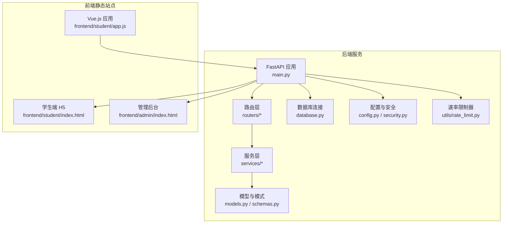
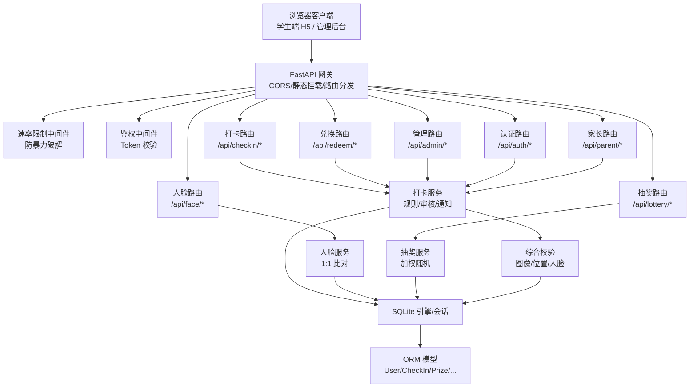
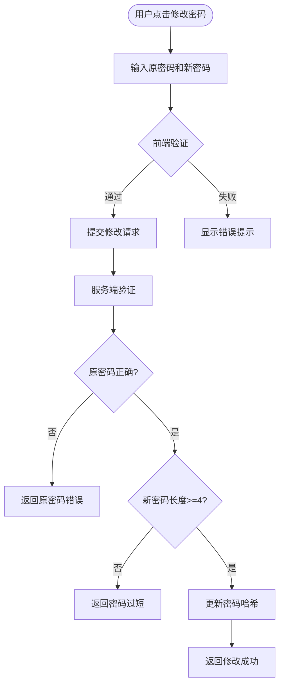
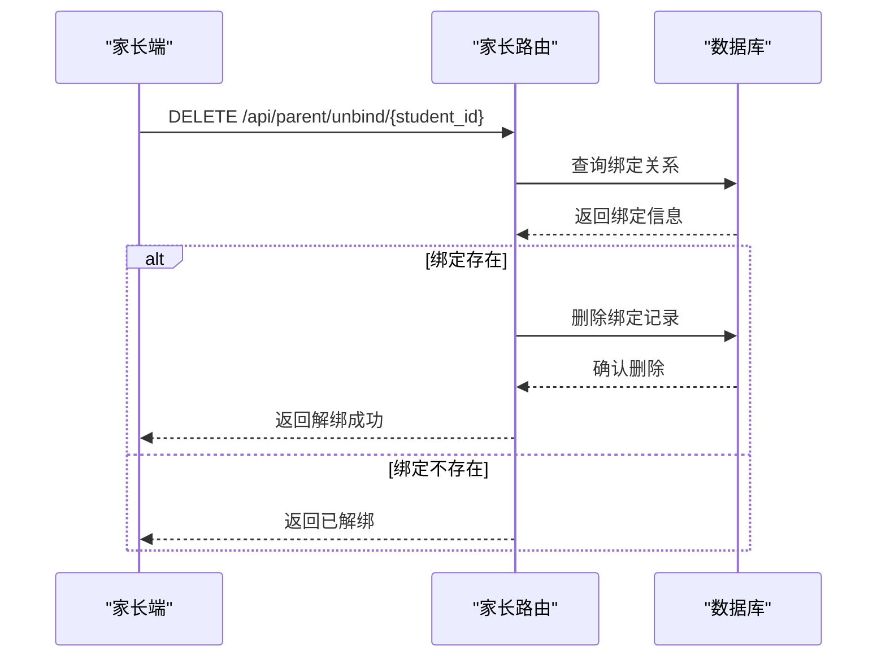
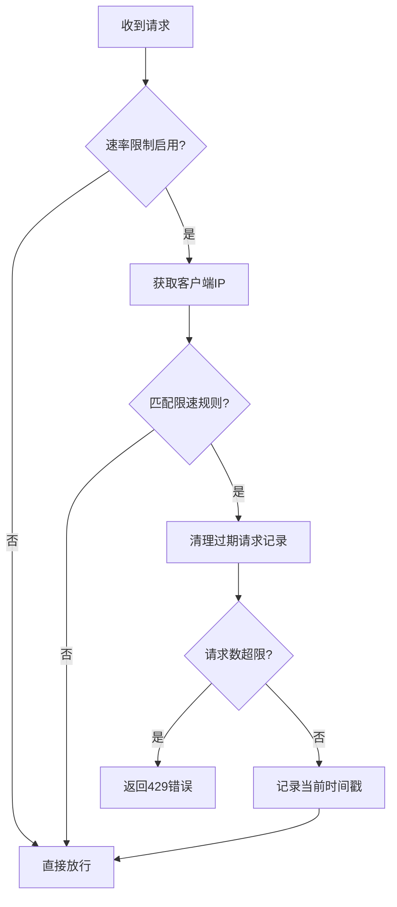
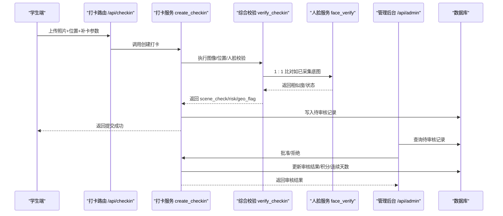
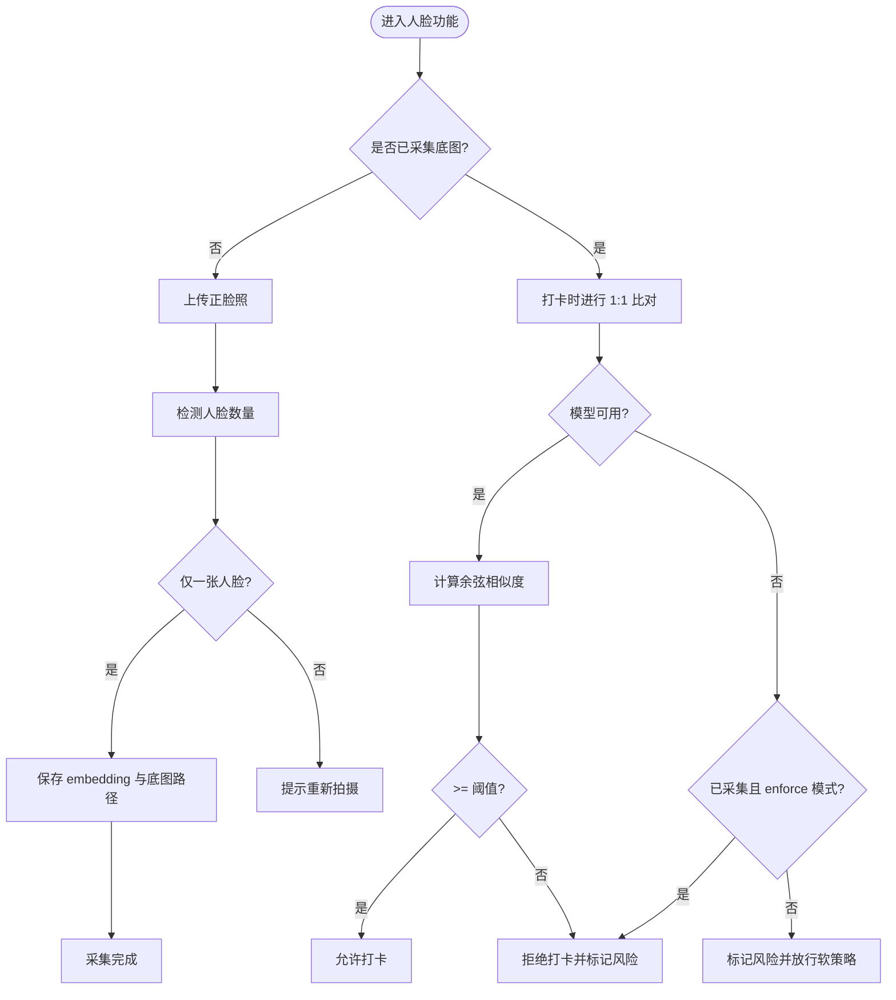
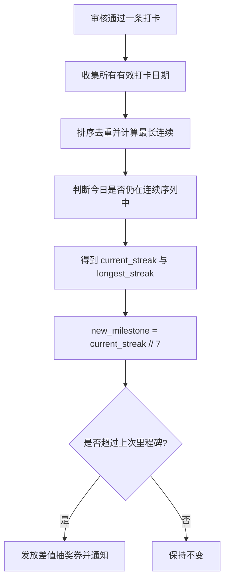
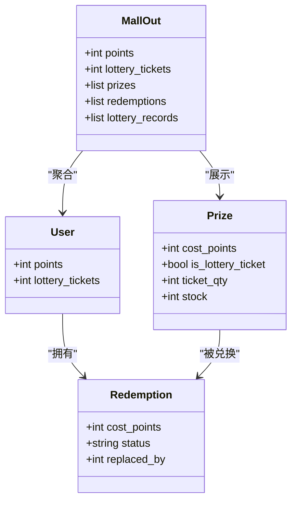
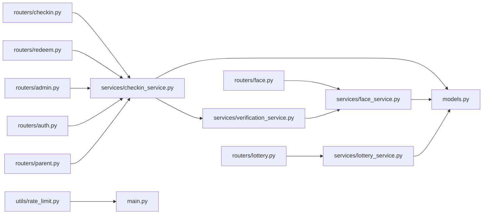

# 暑假作业打卡系统介绍

<cite>
**本文引用的文件**   
- [README.md](file://summer-homework-checkin/README.md)
- [main.py](file://summer-homework-checkin/backend/app/main.py)
- [config.py](file://summer-homework-checkin/backend/app/config.py)
- [database.py](file://summer-homework-checkin/backend/app/database.py)
- [models.py](file://summer-homework-checkin/backend/app/models.py)
- [schemas.py](file://summer-homework-checkin/backend/app/schemas.py)
- [security.py](file://summer-homework-checkin/backend/app/security.py)
- [checkin_service.py](file://summer-homework-checkin/backend/app/services/checkin_service.py)
- [face_service.py](file://summer-homework-checkin/backend/app/services/face_service.py)
- [verification_service.py](file://summer-homework-checkin/backend/app/services/verification_service.py)
- [lottery_service.py](file://summer-homework-checkin/backend/app/services/lottery_service.py)
- [checkin.py](file://summer-homework-checkin/backend/app/routers/checkin.py)
- [face.py](file://summer-homework-checkin/backend/app/routers/face.py)
- [lottery.py](file://summer-homework-checkin/backend/app/routers/lottery.py)
- [redeem.py](file://summer-homework-checkin/backend/app/routers/redeem.py)
- [admin.py](file://summer-homework-checkin/backend/app/routers/admin.py)
- [auth.py](file://summer-homework-checkin/backend/app/routers/auth.py)
- [parent.py](file://summer-homework-checkin/backend/app/routers/parent.py)
- [rate_limit.py](file://summer-homework-checkin/backend/app/utils/rate_limit.py)
- [index.html（学生端）](file://summer-homework-checkin/frontend/student/index.html)
- [index.html（管理后台）](file://summer-homework-checkin/frontend/admin/index.html)
- [app.js（学生端）](file://summer-homework-checkin/frontend/student/app.js)
</cite>

## 更新摘要
**变更内容**   
- 新增 v0.9 版本里程碑功能说明，包括密码修改、父子解绑、速率限制保护等核心特性
- 补充测试覆盖率信息，包含71个测试用例的完整覆盖
- 增强用户体验描述，支持全局回车键提交功能
- 更新安全机制章节，详细说明防暴力破解和请求频率控制

## 目录
1. [引言](#引言)
2. [项目结构](#项目结构)
3. [核心组件](#核心组件)
4. [架构总览](#架构总览)
5. [详细组件分析](#详细组件分析)
6. [依赖关系分析](#依赖关系分析)
7. [性能与扩展性](#性能与扩展性)
8. [故障排查指南](#故障排查指南)
9. [结论](#结论)
10. [附录：API 概览](#附录api-概览)

## 引言
本系统面向三年级小学生，提供"暑假全周期学习打卡"的一站式解决方案。围绕"每日打卡、人脸识别防作弊、连续天数统计、补卡机制、积分奖励、抽奖系统、家长监督"等核心能力，构建学生端 H5 与管理后台双端体验，帮助学生在暑期保持学习习惯，同时为家长和老师提供可视化数据与审核工具。

**v0.9 版本里程碑亮点**
- **密码修改功能**：用户可自主修改登录密码，支持原密码验证和新密码强度检查
- **父子解绑机制**：家长可随时解除与孩子账号的绑定关系，支持重新绑定
- **速率限制保护**：内置内存级请求频率控制，防止暴力破解和批量注册攻击
- **全面测试覆盖**：71个测试用例覆盖认证、打卡、人脸、兑换、家长管理等核心功能
- **用户体验优化**：全局回车键提交支持，提升表单操作流畅度

业务价值与使用场景
- 学生端 H5：手机/平板即可操作，卡通清新界面，三步完成打卡；支持人脸底图采集与 1:1 比对，降低代打卡风险。
- 管理后台：独立页面承载，覆盖奖品全生命周期、用户与打卡审核、兑换记录处理与报表查看。
- 家长监督：通过绑定码与家长账号绑定，实时接收孩子打卡、抽奖与兑换通知。

技术栈选择与适用性
- FastAPI + Vue.js 3 + SQLite：前后端分离、轻量部署、零配置数据库，适合演示与中小规模运行；后续可平滑替换为 PostgreSQL/MySQL 并增加多 worker 与 CDN 静态资源托管。

**章节来源**
- [README.md:1-126](file://summer-homework-checkin/README.md#L1-L126)

## 项目结构
后端采用 FastAPI 模块化路由与服务分层，前端以两个独立静态站点（学生端与管理后台）由后端统一挂载。

**图表来源**
- [main.py:1-48](file://summer-homework-checkin/backend/app/main.py#L1-L48)
- [config.py:1-50](file://summer-homework-checkin/backend/app/config.py#L1-L50)
- [database.py:1-22](file://summer-homework-checkin/backend/app/database.py#L1-L22)
- [rate_limit.py:1-54](file://summer-homework-checkin/backend/app/utils/rate_limit.py#L1-L54)
- [index.html（学生端）:1-271](file://summer-homework-checkin/frontend/student/index.html#L1-L271)
- [index.html（管理后台）:1-410](file://summer-homework-checkin/frontend/admin/index.html#L1-L410)
- [app.js（学生端）:1-458](file://summer-homework-checkin/frontend/student/app.js#L1-L458)

**章节来源**
- [main.py:1-48](file://summer-homework-checkin/backend/app/main.py#L1-L48)
- [config.py:1-50](file://summer-homework-checkin/backend/app/config.py#L1-L50)
- [database.py:1-22](file://summer-homework-checkin/backend/app/database.py#L1-L22)
- [index.html（学生端）:1-271](file://summer-homework-checkin/frontend/student/index.html#L1-L271)
- [index.html（管理后台）:1-410](file://summer-homework-checkin/frontend/admin/index.html#L1-L410)

## 核心组件
- **认证与鉴权**：基于 HMAC 签名 Token 的无状态鉴权，角色区分 student/parent/admin，支持密码修改功能。
- **打卡与审核**：照片合规校验、地理位置一致性、人脸 1:1 比对、补卡限额与凭证、管理员审核生效。
- **连续天数与激励**：自动重算当前/最长连续天数，每满 7 天解锁一次抽奖资格。
- **抽奖与兑换**：加权随机抽取奖品；积分商城支持直接兑换或"抽奖机会"类奖品。
- **家长监督**：绑定码绑定后，关键事件推送站内通知；支持父子解绑和重新绑定。
- **报表与可视化**：按暑假窗口生成学习报告，支持下载打印。
- **安全防护**：内置速率限制器，防止暴力破解和恶意请求。
- **测试保障**：71个测试用例确保核心功能稳定性。

**章节来源**
- [security.py:1-47](file://summer-homework-checkin/backend/app/security.py#L1-L47)
- [checkin_service.py:1-254](file://summer-homework-checkin/backend/app/services/checkin_service.py#L1-L254)
- [face_service.py:1-133](file://summer-homework-checkin/backend/app/services/face_service.py#L1-L133)
- [verification_service.py:1-71](file://summer-homework-checkin/backend/app/services/verification_service.py#L1-L71)
- [lottery_service.py:1-77](file://summer-homework-checkin/backend/app/services/lottery_service.py#L1-L77)
- [admin.py:1-214](file://summer-homework-checkin/backend/app/routers/admin.py#L1-L214)
- [rate_limit.py:1-54](file://summer-homework-checkin/backend/app/utils/rate_limit.py#L1-L54)

## 架构总览
系统采用前后端分离架构，后端统一挂载静态站点，提供 RESTful API；数据持久化使用 SQLite，便于快速部署与演示。v0.9 版本新增速率限制中间件和安全防护机制。

**图表来源**
- [main.py:1-48](file://summer-homework-checkin/backend/app/main.py#L1-L48)
- [rate_limit.py:31-54](file://summer-homework-checkin/backend/app/utils/rate_limit.py#L31-L54)
- [checkin.py:1-80](file://summer-homework-checkin/backend/app/routers/checkin.py#L1-L80)
- [face.py:1-45](file://summer-homework-checkin/backend/app/routers/face.py#L1-L45)
- [lottery.py:1-30](file://summer-homework-checkin/backend/app/routers/lottery.py#L1-L30)
- [redeem.py:1-81](file://summer-homework-checkin/backend/app/routers/redeem.py#L1-L81)
- [admin.py:1-214](file://summer-homework-checkin/backend/app/routers/admin.py#L1-L214)
- [auth.py:1-67](file://summer-homework-checkin/backend/app/routers/auth.py#L1-L67)
- [parent.py:1-251](file://summer-homework-checkin/backend/app/routers/parent.py#L1-L251)
- [checkin_service.py:1-254](file://summer-homework-checkin/backend/app/services/checkin_service.py#L1-L254)
- [face_service.py:1-133](file://summer-homework-checkin/backend/app/services/face_service.py#L1-L133)
- [verification_service.py:1-71](file://summer-homework-checkin/backend/app/services/verification_service.py#L1-L71)
- [lottery_service.py:1-77](file://summer-homework-checkin/backend/app/services/lottery_service.py#L1-L77)
- [database.py:1-22](file://summer-homework-checkin/backend/app/database.py#L1-L22)
- [models.py:1-176](file://summer-homework-checkin/backend/app/models.py#L1-L176)

## 详细组件分析

### 密码修改功能（v0.9 新增）
- **接口设计**：PUT /api/auth/password，需要原密码验证和新密码强度检查
- **安全验证**：原密码正确性验证、新密码最小长度检查（至少4位）、新旧密码相同性检查
- **前端交互**：在"我的"页面提供密码修改入口，支持实时验证和错误提示
- **测试覆盖**：6个测试用例覆盖正常修改、旧密码登录失败、原密码错误、密码过短、相同密码等场景

**图表来源**
- [auth.py:56-67](file://summer-homework-checkin/backend/app/routers/auth.py#L56-L67)
- [app.js（学生端）:150-167](file://summer-homework-checkin/frontend/student/app.js#L150-L167)

**章节来源**
- [auth.py:56-67](file://summer-homework-checkin/backend/app/routers/auth.py#L56-L67)
- [test_auth.py:150-208](file://summer-homework-checkin/tests/test_auth.py#L150-L208)
- [app.js（学生端）:150-167](file://summer-homework-checkin/frontend/student/app.js#L150-L167)

### 父子解绑机制（v0.9 新增）
- **解绑接口**：DELETE /api/parent/unbind/{student_id}，支持幂等操作
- **权限控制**：仅家长角色可执行解绑操作，需验证绑定关系存在
- **前端交互**：在家长端孩子列表提供解绑按钮，二次确认防止误操作
- **业务逻辑**：解绑后孩子从家长列表中移除，但保留历史数据关联

**图表来源**
- [parent.py:35-46](file://summer-homework-checkin/backend/app/routers/parent.py#L35-L46)
- [test_parent.py:169-191](file://summer-homework-checkin/tests/test_parent.py#L169-L191)

**章节来源**
- [parent.py:35-46](file://summer-homework-checkin/backend/app/routers/parent.py#L35-L46)
- [test_parent.py:169-191](file://summer-homework-checkin/tests/test_parent.py#L169-L191)
- [app.js（学生端）:137-145](file://summer-homework-checkin/frontend/student/app.js#L137-L145)

### 速率限制保护（v0.9 新增）
- **内存实现**：基于内存字典的请求计数，支持多线程安全访问
- **规则配置**：登录接口每分钟最多10次，注册接口每分钟最多5次
- **IP识别**：兼容反向代理环境，支持 X-Forwarded-For 头部提取真实 IP
- **开关控制**：通过环境变量 RATE_LIMIT_ENABLED 控制是否启用

**图表来源**
- [rate_limit.py:31-54](file://summer-homework-checkin/backend/app/utils/rate_limit.py#L31-L54)
- [main.py:34-38](file://summer-homework-checkin/backend/app/main.py#L34-L38)

**章节来源**
- [rate_limit.py:1-54](file://summer-homework-checkin/backend/app/utils/rate_limit.py#L1-L54)
- [main.py:34-38](file://summer-homework-checkin/backend/app/main.py#L34-L38)

### 打卡与审核流程
- 入口：学生端提交现场照片、可选补卡信息与位置信息。
- 校验：图片真实性、尺寸与格式；地理位置一致性；人脸 1:1 比对（已采集底图时严格拦截）。
- 存储：写入待审核记录，标记风险等级与人脸结果。
- 审核：管理员通过后发放积分并重算连续天数与抽奖券；拒绝则记录原因。

**图表来源**
- [checkin.py:1-80](file://summer-homework-checkin/backend/app/routers/checkin.py#L1-L80)
- [checkin_service.py:64-210](file://summer-homework-checkin/backend/app/services/checkin_service.py#L64-L210)
- [verification_service.py:19-71](file://summer-homework-checkin/backend/app/services/verification_service.py#L19-L71)
- [face_service.py:99-125](file://summer-homework-checkin/backend/app/services/face_service.py#L99-L125)
- [admin.py:84-103](file://summer-homework-checkin/backend/app/routers/admin.py#L84-L103)

**章节来源**
- [checkin.py:1-80](file://summer-homework-checkin/backend/app/routers/checkin.py#L1-L80)
- [checkin_service.py:1-254](file://summer-homework-checkin/backend/app/services/checkin_service.py#L1-L254)
- [verification_service.py:1-71](file://summer-homework-checkin/backend/app/services/verification_service.py#L1-L71)
- [face_service.py:1-133](file://summer-homework-checkin/backend/app/services/face_service.py#L1-L133)
- [admin.py:1-214](file://summer-homework-checkin/backend/app/routers/admin.py#L1-L214)

### 人脸识别（1:1 本人比对）
- 采集：学生端在「我的」上传正脸照，服务端检测单脸并保存 512 维 embedding。
- 比对：每次打卡对现场照提取特征并与底图做余弦相似度比较，低于阈值拒绝打卡（可配置策略）。
- 降级：无外网或模型不可用时，已采集底图的账号将拒绝打卡以防绕过，未采集账号正常。

**图表来源**
- [face.py:14-45](file://summer-homework-checkin/backend/app/routers/face.py#L14-L45)
- [face_service.py:71-133](file://summer-homework-checkin/backend/app/services/face_service.py#L71-L133)
- [config.py:41-50](file://summer-homework-checkin/backend/app/config.py#L41-L50)

**章节来源**
- [face.py:1-45](file://summer-homework-checkin/backend/app/routers/face.py#L1-45)
- [face_service.py:1-133](file://summer-homework-checkin/backend/app/services/face_service.py#L1-L133)
- [config.py:1-50](file://summer-homework-checkin/backend/app/config.py#L1-L50)

### 连续天数与抽奖资格
- 连续天数：基于有效打卡日期排序计算当前连续与历史最长连续。
- 抽奖资格：每满 7 天自动发放一次，永久累积；中断不扣回已发放次数。
- 触发时机：管理员审核通过后触发重算与发放。

**图表来源**
- [checkin_service.py:39-61](file://summer-homework-checkin/backend/app/services/checkin_service.py#L39-L61)

**章节来源**
- [checkin_service.py:1-254](file://summer-homework-checkin/backend/app/services/checkin_service.py#L1-L254)

### 积分与兑换
- 积分获取：正常打卡与补卡分别获得不同积分（可配置）。
- 商城聚合：展示余额、可兑换奖品、我的兑换与抽奖记录。
- 兑换逻辑：普通奖品扣积分并创建兑换记录；"抽奖机会"类奖品直接增加抽奖券且不扣库存。
- 替换机制：支持对未处理的兑换记录进行替换，原记录指向新记录。

**图表来源**
- [models.py:103-161](file://summer-homework-checkin/backend/app/models.py#L103-L161)
- [schemas.py:207-213](file://summer-homework-checkin/backend/app/schemas.py#L207-L213)
- [redeem.py:24-81](file://summer-homework-checkin/backend/app/routers/redeem.py#L24-L81)

**章节来源**
- [redeem.py:1-81](file://summer-homework-checkin/backend/app/routers/redeem.py#L1-L81)
- [models.py:103-161](file://summer-homework-checkin/backend/app/models.py#L103-L161)
- [schemas.py:184-213](file://summer-homework-checkin/backend/app/schemas.py#L184-L213)

### 家长监督与通知
- 绑定：家长凭孩子绑定码建立绑定关系。
- 通知：打卡提交、审核结果、抽奖中奖等事件向家长推送站内通知。
- 视角：家长可在学生端切换多个孩子，代为查看与操作。
- **v0.9 增强**：支持解绑和重新绑定操作，提供更灵活的亲子关系管理。

**章节来源**
- [models.py:57-68](file://summer-homework-checkin/backend/app/models.py#L57-68)
- [index.html（学生端）:44-56](file://summer-homework-checkin/frontend/student/index.html#L44-L56)
- [parent.py:20-46](file://summer-homework-checkin/backend/app/routers/parent.py#L20-L46)

### 测试覆盖与质量保证（v0.9 新增）
- **测试框架**：基于 pytest 的完整测试套件，覆盖核心业务逻辑
- **测试范围**：认证测试（7个用例）、打卡测试、人脸测试、兑换测试、家长管理测试、工具函数测试
- **质量指标**：71个测试用例，涵盖正常流程、异常处理、边界条件等场景
- **持续集成**：支持自动化测试执行和结果报告生成

**章节来源**
- [test_auth.py:1-208](file://summer-homework-checkin/tests/test_auth.py#L1-208)
- [test_parent.py:1-191](file://summer-homework-checkin/tests/test_parent.py#L1-191)

## 依赖关系分析
- 路由到服务：各路由模块仅负责参数解析与响应封装，核心规则下沉至 services。
- 服务到模型：通过 SQLAlchemy ORM 读写 models，避免跨层耦合。
- 外部依赖：insightface 用于人脸特征提取与比对；cv2 用于图像解码；SQLite 作为默认存储。
- **v0.9 新增**：速率限制器作为中间件层，在所有路由处理前执行安全检查。

**图表来源**
- [checkin.py:1-80](file://summer-homework-checkin/backend/app/routers/checkin.py#L1-L80)
- [face.py:1-45](file://summer-homework-checkin/backend/app/routers/face.py#L1-L45)
- [lottery.py:1-30](file://summer-homework-checkin/backend/app/routers/lottery.py#L1-L30)
- [redeem.py:1-81](file://summer-homework-checkin/backend/app/routers/redeem.py#L1-L81)
- [admin.py:1-214](file://summer-homework-checkin/backend/app/routers/admin.py#L1-L214)
- [auth.py:1-67](file://summer-homework-checkin/backend/app/routers/auth.py#L1-L67)
- [parent.py:1-251](file://summer-homework-checkin/backend/app/routers/parent.py#L1-L251)
- [checkin_service.py:1-254](file://summer-homework-checkin/backend/app/services/checkin_service.py#L1-L254)
- [face_service.py:1-133](file://summer-homework-checkin/backend/app/services/face_service.py#L1-L133)
- [lottery_service.py:1-77](file://summer-homework-checkin/backend/app/services/lottery_service.py#L1-L77)
- [verification_service.py:1-71](file://summer-homework-checkin/backend/app/services/verification_service.py#L1-L71)
- [models.py:1-176](file://summer-homework-checkin/backend/app/models.py#L1-L176)
- [rate_limit.py:1-54](file://summer-homework-checkin/backend/app/utils/rate_limit.py#L1-L54)

**章节来源**
- [checkin.py:1-80](file://summer-homework-checkin/backend/app/routers/checkin.py#L1-L80)
- [face.py:1-45](file://summer-homework-checkin/backend/app/routers/face.py#L1-L45)
- [lottery.py:1-30](file://summer-homework-checkin/backend/app/routers/lottery.py#L1-L30)
- [redeem.py:1-81](file://summer-homework-checkin/backend/app/routers/redeem.py#L1-L81)
- [admin.py:1-214](file://summer-homework-checkin/backend/app/routers/admin.py#L1-L214)
- [auth.py:1-67](file://summer-homework-checkin/backend/app/routers/auth.py#L1-L67)
- [parent.py:1-251](file://summer-homework-checkin/backend/app/routers/parent.py#L1-L251)
- [checkin_service.py:1-254](file://summer-homework-checkin/backend/app/services/checkin_service.py#L1-L254)
- [face_service.py:1-133](file://summer-homework-checkin/backend/app/services/face_service.py#L1-L133)
- [lottery_service.py:1-77](file://summer-homework-checkin/backend/app/services/lottery_service.py#L1-L77)
- [verification_service.py:1-71](file://summer-homework-checkin/backend/app/services/verification_service.py#L1-L71)
- [models.py:1-176](file://summer-homework-checkin/backend/app/models.py#L1-L176)
- [rate_limit.py:1-54](file://summer-homework-checkin/backend/app/utils/rate_limit.py#L1-L54)

## 性能与扩展性
- **并发与吞吐**：参考测试报告，系统在压测下表现稳定，具备较高吞吐能力。
- **存储扩展**：SQLite 适合演示；生产建议迁移至 PostgreSQL/MySQL，并启用连接池。
- **服务扩展**：可通过 uvicorn 多 worker 或前置 Nginx 提升并发；静态资源可上对象存储/CDN。
- **人脸推理**：本地 CPU 推理，首次按需下载模型；无外网环境自动降级，保障业务可用性。
- **安全防护**：v0.9 版本引入的速率限制器可有效防止暴力破解和恶意请求，提升系统安全性。

[本节为通用指导，无需源码引用]

## 故障排查指南
- **人脸不可用**：检查 insightface 安装与网络权限；确认模型缓存目录与阈值配置；必要时切换到软策略。
- **照片校验失败**：确认 JPEG/PNG 格式、体积与最小边长；避免缩略图或占位图。
- **位置异常**：核对常用位置设置与设备定位权限；关注 geo_flag 高亮记录。
- **审核卡顿**：检查待审核计数与列表；确认管理员权限与接口可达。
- **积分/兑换异常**：核对奖品 cost_points 与库存；确认兑换记录状态与替换链。
- **速率限制触发**：检查请求频率是否超过限制；确认 RATE_LIMIT_ENABLED 环境变量配置。
- **密码修改失败**：验证原密码正确性；检查新密码长度要求；确认两次密码输入一致。
- **父子解绑问题**：确认家长角色权限；检查绑定关系是否存在；验证学生ID有效性。

**章节来源**
- [face_service.py:28-46](file://summer-homework-checkin/backend/app/services/face_service.py#L28-L46)
- [checkin_service.py:212-223](file://summer-homework-checkin/backend/app/services/checkin_service.py#L212-L223)
- [verification_service.py:19-71](file://summer-homework-checkin/backend/app/services/verification_service.py#L19-L71)
- [admin.py:77-103](file://summer-homework-checkin/backend/app/routers/admin.py#L77-L103)
- [redeem.py:48-81](file://summer-homework-checkin/backend/app/routers/redeem.py#L48-L81)
- [rate_limit.py:31-54](file://summer-homework-checkin/backend/app/utils/rate_limit.py#L31-L54)
- [auth.py:56-67](file://summer-homework-checkin/backend/app/routers/auth.py#L56-L67)
- [parent.py:35-46](file://summer-homework-checkin/backend/app/routers/parent.py#L35-L46)

## 结论
本系统以"真实本人打卡"为核心目标，结合四重校验与审核闭环，构建了从学生端到家长监督再到管理后台的全链路方案。v0.9 版本的发布进一步增强了系统的安全性和用户体验，包括密码修改、父子解绑、速率限制保护等重要功能。技术选型简洁高效，易于部署与扩展；业务规则清晰、可扩展性强，适合在小学阶段推广使用。

**v0.9 版本核心价值**
- **安全性提升**：速率限制器有效防御暴力破解攻击
- **用户体验优化**：密码修改和父子解绑功能满足实际使用需求
- **质量保证**：71个测试用例确保核心功能稳定性
- **运维友好**：完善的错误处理和日志记录机制

[本节为总结性内容，无需源码引用]

## 附录：API 概览
- **认证**：注册/登录（student/parent）、密码修改（PUT /api/auth/password）
- **打卡**：提交打卡、查询今日状态、连续天数与历史
- **人脸**：采集/撤销底图、查询状态
- **抽奖**：查询资格与记录、执行抽奖
- **兑换**：积分商城聚合、兑换与替换
- **家长管理**：绑定/解绑孩子、代打卡、代兑换、代抽奖、查看报告
- **管理**：概览、用户、打卡审核、兑换审核、奖品管理
- **健康检查**：/api/health

**章节来源**
- [README.md:81-94](file://summer-homework-checkin/README.md#L81-L94)
- [main.py:32-34](file://summer-homework-checkin/backend/app/main.py#L32-L34)
- [auth.py:56-67](file://summer-homework-checkin/backend/app/routers/auth.py#L56-L67)
- [parent.py:35-46](file://summer-homework-checkin/backend/app/routers/parent.py#L35-L46)