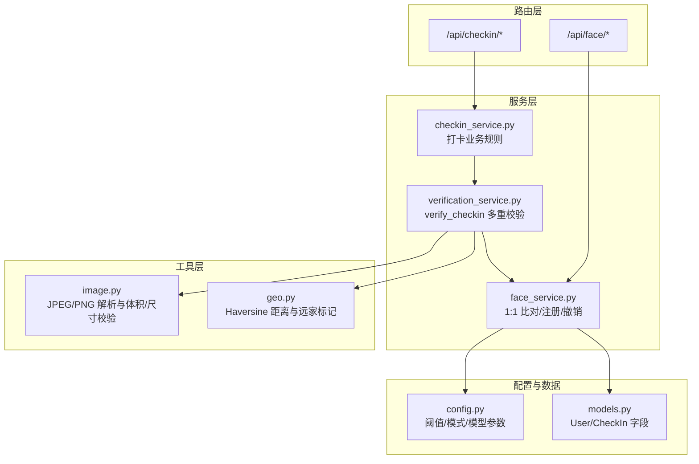
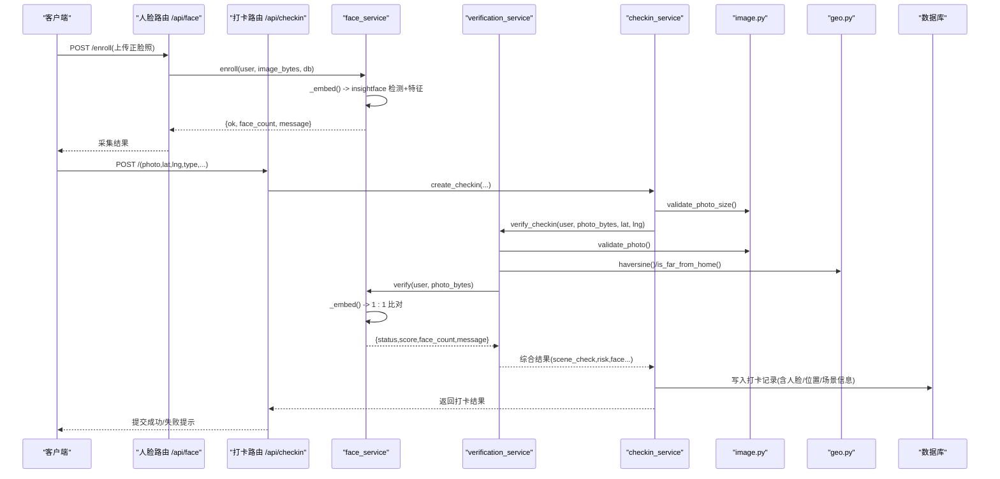
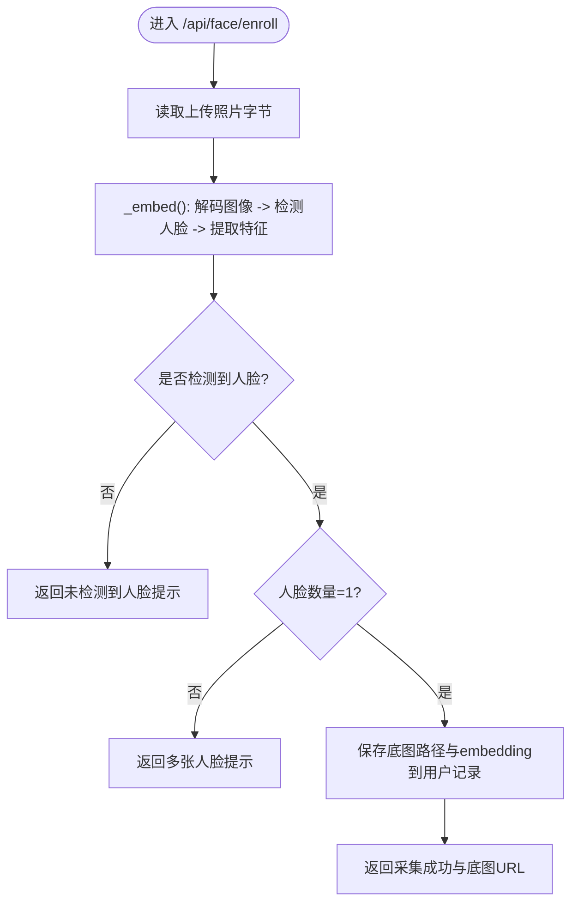
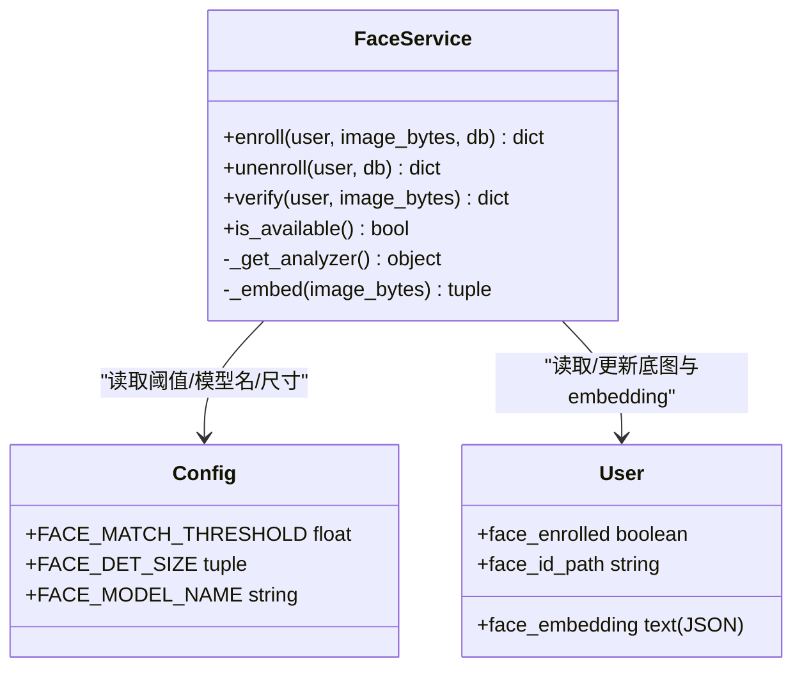
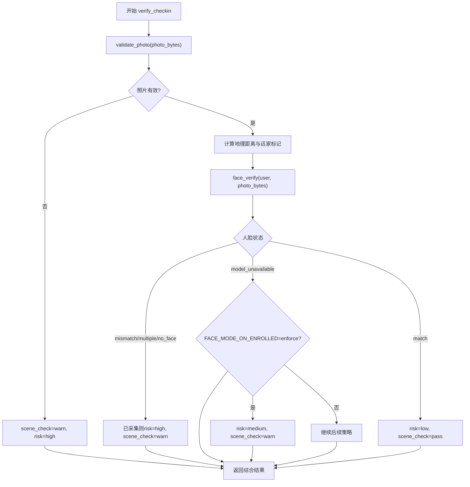
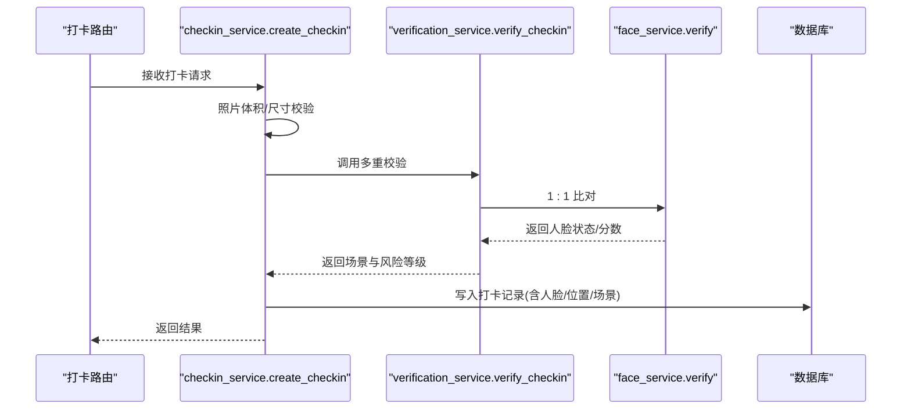
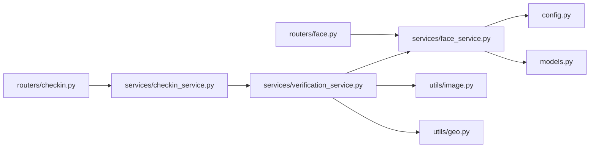

# 人脸识别验证系统

<cite>
**本文引用的文件**   
- [summer-homework-checkin/backend/app/routers/face.py](file://summer-homework-checkin/backend/app/routers/face.py)
- [summer-homework-checkin/backend/app/services/face_service.py](file://summer-homework-checkin/backend/app/services/face_service.py)
- [summer-homework-checkin/backend/app/services/verification_service.py](file://summer-homework-checkin/backend/app/services/verification_service.py)
- [summer-homework-checkin/backend/app/services/checkin_service.py](file://summer-homework-checkin/backend/app/services/checkin_service.py)
- [summer-homework-checkin/backend/app/utils/image.py](file://summer-homework-checkin/backend/app/utils/image.py)
- [summer-homework-checkin/backend/app/utils/geo.py](file://summer-homework-checkin/backend/app/utils/geo.py)
- [summer-homework-checkin/backend/app/config.py](file://summer-homework-checkin/backend/app/config.py)
- [summer-homework-checkin/backend/app/models.py](file://summer-homework-checkin/backend/app/models.py)
- [summer-homework-checkin/README.md](file://summer-homework-checkin/README.md)
</cite>

## 目录
1. [简介](#简介)
2. [项目结构](#项目结构)
3. [核心组件](#核心组件)
4. [架构总览](#架构总览)
5. [详细组件分析](#详细组件分析)
6. [依赖关系分析](#依赖关系分析)
7. [性能与优化](#性能与优化)
8. [故障排查指南](#故障排查指南)
9. [安全与合规](#安全与合规)
10. [结论](#结论)

## 简介
本技术文档围绕“暑假作业打卡登记系统”中的人脸识别验证能力，系统性说明基于 InsightFace 的 1:1 本人比对集成方式、人脸底图采集流程、多人脸检测与无人脸检测处理策略、以及 verify_checkin 的多重校验逻辑。文档同时覆盖阈值配置、模型加载与降级、注册状态管理、失败处理与服务降级方案、性能优化技巧、采集最佳实践、常见问题与安全考量，帮助读者快速理解并落地生产环境。

## 项目结构
本项目采用前后端分离架构，后端使用 FastAPI + SQLAlchemy + SQLite，前端为 H5 学生端与独立后台管理页。人脸识别相关代码集中在 backend/app 下的 routers、services、utils 与 config 模块中：
- 路由层：提供人脸采集、状态查询、撤销等接口
- 服务层：实现 1:1 比对、综合校验（照片真实性、地理位置一致性、场景判定）
- 工具层：图像解析、地理距离计算
- 配置层：相似度阈值、检测尺寸、模型名称、已采集后的人脸策略等

图表来源
- [summer-homework-checkin/backend/app/routers/face.py:1-45](file://summer-homework-checkin/backend/app/routers/face.py#L1-L45)
- [summer-homework-checkin/backend/app/services/face_service.py:1-133](file://summer-homework-checkin/backend/app/services/face_service.py#L1-L133)
- [summer-homework-checkin/backend/app/services/verification_service.py:1-71](file://summer-homework-checkin/backend/app/services/verification_service.py#L1-L71)
- [summer-homework-checkin/backend/app/services/checkin_service.py:1-254](file://summer-homework-checkin/backend/app/services/checkin_service.py#L1-L254)
- [summer-homework-checkin/backend/app/utils/image.py:1-61](file://summer-homework-checkin/backend/app/utils/image.py#L1-L61)
- [summer-homework-checkin/backend/app/utils/geo.py:1-24](file://summer-homework-checkin/backend/app/utils/geo.py#L1-L24)
- [summer-homework-checkin/backend/app/config.py:1-50](file://summer-homework-checkin/backend/app/config.py#L1-L50)
- [summer-homework-checkin/backend/app/models.py:1-212](file://summer-homework-checkin/backend/app/models.py#L1-L212)

章节来源
- [summer-homework-checkin/README.md:1-126](file://summer-homework-checkin/README.md#L1-L126)

## 核心组件
- 人脸采集与状态管理
  - 采集接口要求检测到且仅检测到一张人脸，作为 1:1 比对的基准；支持查询与撤销。
- 1:1 身份比对
  - 使用 InsightFace 预训练模型进行人脸检测与特征提取，现场照与底图做余弦相似度比对，超过阈值即通过。
- 多重校验（verify_checkin）
  - 照片真实性校验（体积/格式/尺寸）、地理位置一致性、人脸 1:1 比对、场景合规综合判定。
- 服务降级与失败处理
  - 无外网或模型不可用时自动降级为安全模式，已采集用户拒绝打卡防绕过，未采集用户正常；可配置 enforce/soft 策略。

章节来源
- [summer-homework-checkin/backend/app/routers/face.py:14-44](file://summer-homework-checkin/backend/app/routers/face.py#L14-L44)
- [summer-homework-checkin/backend/app/services/face_service.py:71-133](file://summer-homework-checkin/backend/app/services/face_service.py#L71-L133)
- [summer-homework-checkin/backend/app/services/verification_service.py:19-71](file://summer-homework-checkin/backend/app/services/verification_service.py#L19-L71)
- [summer-homework-checkin/backend/app/config.py:41-50](file://summer-homework-checkin/backend/app/config.py#L41-L50)

## 架构总览
下图展示从客户端到后端各层的调用链路与关键决策点，包括人脸采集、打卡提交、多重校验与结果落库。

图表来源
- [summer-homework-checkin/backend/app/routers/face.py:14-44](file://summer-homework-checkin/backend/app/routers/face.py#L14-L44)
- [summer-homework-checkin/backend/app/routers/checkin.py:17-37](file://summer-homework-checkin/backend/app/routers/checkin.py#L17-L37)
- [summer-homework-checkin/backend/app/services/face_service.py:71-133](file://summer-homework-checkin/backend/app/services/face_service.py#L71-L133)
- [summer-homework-checkin/backend/app/services/verification_service.py:19-71](file://summer-homework-checkin/backend/app/services/verification_service.py#L19-L71)
- [summer-homework-checkin/backend/app/services/checkin_service.py:64-163](file://summer-homework-checkin/backend/app/services/checkin_service.py#L64-L163)
- [summer-homework-checkin/backend/app/utils/image.py:51-61](file://summer-homework-checkin/backend/app/utils/image.py#L51-L61)
- [summer-homework-checkin/backend/app/utils/geo.py:6-24](file://summer-homework-checkin/backend/app/utils/geo.py#L6-L24)

## 详细组件分析

### 人脸采集与状态管理（/api/face）
- 采集接口
  - 要求检测到且仅检测到一张人脸；保存原始图片路径与 512 维 embedding（JSON），标记已采集。
- 状态查询
  - 返回是否已采集、底图 URL 与提示信息。
- 撤销采集
  - 清除已采集标志与 embedding、路径，保留历史文件供审计。

图表来源
- [summer-homework-checkin/backend/app/routers/face.py:14-26](file://summer-homework-checkin/backend/app/routers/face.py#L14-L26)
- [summer-homework-checkin/backend/app/services/face_service.py:71-88](file://summer-homework-checkin/backend/app/services/face_service.py#L71-L88)

章节来源
- [summer-homework-checkin/backend/app/routers/face.py:14-44](file://summer-homework-checkin/backend/app/routers/face.py#L14-L44)
- [summer-homework-checkin/backend/app/services/face_service.py:71-96](file://summer-homework-checkin/backend/app/services/face_service.py#L71-L96)
- [summer-homework-checkin/backend/app/models.py:27-31](file://summer-homework-checkin/backend/app/models.py#L27-L31)

### 1:1 身份比对算法（face_service.verify）
- 模型加载
  - 懒加载 InsightFace FaceAnalysis（buffalo_l），首次运行按需下载至本地缓存目录；强制 CPU 推理，避免 GPU 依赖。
- 特征提取
  - 对输入图像解码后进行人脸检测，选择最大人脸区域，输出 512 维 embedding。
- 相似度计算
  - 将现场照 embedding 与用户底图 embedding 做余弦相似度，与阈值比较得出匹配结果。
- 无人脸/多人脸处理
  - 无人脸：返回 no_face；多人脸：返回 multiple_faces；均视为不通过。

图表来源
- [summer-homework-checkin/backend/app/services/face_service.py:28-68](file://summer-homework-checkin/backend/app/services/face_service.py#L28-L68)
- [summer-homework-checkin/backend/app/config.py:41-44](file://summer-homework-checkin/backend/app/config.py#L41-L44)
- [summer-homework-checkin/backend/app/models.py:27-31](file://summer-homework-checkin/backend/app/models.py#L27-L31)

章节来源
- [summer-homework-checkin/backend/app/services/face_service.py:1-133](file://summer-homework-checkin/backend/app/services/face_service.py#L1-L133)
- [summer-homework-checkin/backend/app/config.py:41-44](file://summer-homework-checkin/backend/app/config.py#L41-L44)
- [summer-homework-checkin/backend/app/models.py:27-31](file://summer-homework-checkin/backend/app/models.py#L27-L31)

### verify_checkin 多重验证逻辑
- 照片真实性校验
  - 检查是否为合法 JPEG/PNG、体积范围、最小边长门槛，过滤占位图/缩略图。
- 地理位置一致性
  - 计算设备经纬度与常用位置的距离，超出阈值则标记 geo_flag。
- 人脸 1:1 比对
  - 调用 face_service.verify，返回 status/score/face_count/message。
- 风险等级与场景判定
  - 根据照片、位置、人脸结果综合判定 scene_check 与 risk；若已采集但人脸不通过，标记高风险；模型不可用时按策略降级。

图表来源
- [summer-homework-checkin/backend/app/services/verification_service.py:19-71](file://summer-homework-checkin/backend/app/services/verification_service.py#L19-L71)
- [summer-homework-checkin/backend/app/utils/image.py:51-61](file://summer-homework-checkin/backend/app/utils/image.py#L51-L61)
- [summer-homework-checkin/backend/app/utils/geo.py:6-24](file://summer-homework-checkin/backend/app/utils/geo.py#L6-L24)
- [summer-homework-checkin/backend/app/config.py:47-50](file://summer-homework-checkin/backend/app/config.py#L47-L50)

章节来源
- [summer-homework-checkin/backend/app/services/verification_service.py:19-71](file://summer-homework-checkin/backend/app/services/verification_service.py#L19-L71)
- [summer-homework-checkin/backend/app/utils/image.py:1-61](file://summer-homework-checkin/backend/app/utils/image.py#L1-L61)
- [summer-homework-checkin/backend/app/utils/geo.py:1-24](file://summer-homework-checkin/backend/app/utils/geo.py#L1-L24)
- [summer-homework-checkin/backend/app/config.py:27-50](file://summer-homework-checkin/backend/app/config.py#L27-L50)

### 打卡流程与人脸策略
- 创建打卡记录
  - 先进行照片体积/尺寸校验，再调用 verify_checkin 获取综合结果。
- 人脸策略执行
  - 若已采集且人脸不通过（mismatch/multiple/no_face），直接拒绝打卡。
  - 若已采集且模型不可用，且 FACE_MODE_ON_ENROLLED=enforce，返回 503 服务不可用。
- 记录持久化
  - 写入打卡记录，包含人脸状态、相似度分数、地理距离与场景判定等信息，等待管理员审核。

图表来源
- [summer-homework-checkin/backend/app/routers/checkin.py:17-37](file://summer-homework-checkin/backend/app/routers/checkin.py#L17-L37)
- [summer-homework-checkin/backend/app/services/checkin_service.py:64-163](file://summer-homework-checkin/backend/app/services/checkin_service.py#L64-L163)
- [summer-homework-checkin/backend/app/services/verification_service.py:19-71](file://summer-homework-checkin/backend/app/services/verification_service.py#L19-L71)
- [summer-homework-checkin/backend/app/services/face_service.py:99-125](file://summer-homework-checkin/backend/app/services/face_service.py#L99-L125)

章节来源
- [summer-homework-checkin/backend/app/services/checkin_service.py:64-163](file://summer-homework-checkin/backend/app/services/checkin_service.py#L64-L163)
- [summer-homework-checkin/backend/app/routers/checkin.py:17-37](file://summer-homework-checkin/backend/app/routers/checkin.py#L17-L37)

## 依赖关系分析
- 模块耦合
  - 路由层依赖服务层；服务层依赖工具层与配置；人脸服务依赖 InsightFace 运行时。
- 外部依赖
  - InsightFace 模型首次运行自动下载；OpenCV 用于图像解码；SQLite 用于数据存储。
- 潜在循环依赖
  - 当前未发现循环导入；各层职责清晰。

图表来源
- [summer-homework-checkin/backend/app/routers/face.py:1-45](file://summer-homework-checkin/backend/app/routers/face.py#L1-L45)
- [summer-homework-checkin/backend/app/routers/checkin.py:1-80](file://summer-homework-checkin/backend/app/routers/checkin.py#L1-L80)
- [summer-homework-checkin/backend/app/services/face_service.py:1-133](file://summer-homework-checkin/backend/app/services/face_service.py#L1-L133)
- [summer-homework-checkin/backend/app/services/verification_service.py:1-71](file://summer-homework-checkin/backend/app/services/verification_service.py#L1-L71)
- [summer-homework-checkin/backend/app/services/checkin_service.py:1-254](file://summer-homework-checkin/backend/app/services/checkin_service.py#L1-L254)
- [summer-homework-checkin/backend/app/utils/image.py:1-61](file://summer-homework-checkin/backend/app/utils/image.py#L1-L61)
- [summer-homework-checkin/backend/app/utils/geo.py:1-24](file://summer-homework-checkin/backend/app/utils/geo.py#L1-L24)
- [summer-homework-checkin/backend/app/config.py:1-50](file://summer-homework-checkin/backend/app/config.py#L1-L50)
- [summer-homework-checkin/backend/app/models.py:1-212](file://summer-homework-checkin/backend/app/models.py#L1-L212)

章节来源
- [summer-homework-checkin/backend/app/config.py:1-50](file://summer-homework-checkin/backend/app/config.py#L1-L50)
- [summer-homework-checkin/backend/app/models.py:1-212](file://summer-homework-checkin/backend/app/models.py#L1-L212)

## 性能与优化
- 模型懒加载与线程安全
  - 使用全局锁确保 InsightFace 分析器仅初始化一次，避免重复加载开销。
- 检测尺寸权衡
  - FACE_DET_SIZE 越小推理越快，但漏检率可能上升；建议根据设备性能与准确率需求调优。
- 特征存储与比对
  - 512 维向量以 JSON 文本存储，比对时转为 numpy 数组进行余弦相似度计算，复杂度 O(d)。
- 并发与部署
  - 多 worker 部署提升吞吐；静态资源与上传文件可迁移至对象存储/CDN 降低 IO 压力。
- 降级与容错
  - 模型不可用时返回明确错误码与消息，避免静默放行；在 enforce 模式下直接拒绝打卡，保障安全性。

[本节为通用性能讨论，无需特定文件引用]

## 故障排查指南
- 无人脸检测
  - 现象：返回 no_face 或未检测到人脸提示。
  - 排查：确认拍摄光线充足、正脸朝向镜头、背景简洁；调整相机对焦与距离。
- 多人脸检测
  - 现象：返回 multiple_faces 提示。
  - 排查：确保画面中仅有目标人物，移除他人入镜；必要时裁剪或重新拍摄。
- 模型不可用
  - 现象：返回 model_unavailable 或 503。
  - 排查：检查网络连通性（首次需下载模型）；确认 ~/.insightface 目录权限；在无外网环境启用安全模式。
- 相似度阈值过严
  - 现象：频繁 mismatch。
  - 排查：适当降低 FACE_MATCH_THRESHOLD；或在 soft 模式下允许记录待复核。
- 地理位置异常
  - 现象：geo_flag 为真，场景标记 warn。
  - 排查：校准设备定位；确认 home_lat/home_lng 设置正确；考虑移动场景合理放宽阈值。

章节来源
- [summer-homework-checkin/backend/app/services/face_service.py:49-68](file://summer-homework-checkin/backend/app/services/face_service.py#L49-L68)
- [summer-homework-checkin/backend/app/services/verification_service.py:40-71](file://summer-homework-checkin/backend/app/services/verification_service.py#L40-L71)
- [summer-homework-checkin/backend/app/config.py:41-50](file://summer-homework-checkin/backend/app/config.py#L41-L50)

## 安全与合规
- 隐私保护
  - 人脸底图与 embedding 属于敏感个人信息，应加密存储、限制访问、定期审计。
- 最小化采集
  - 仅采集必要的人脸底图，不额外收集无关生物特征。
- 访问控制
  - 采集与状态接口仅限学生角色；管理员操作需鉴权与审计日志。
- 数据安全
  - 上传文件存放于受控目录，禁止直接执行；对外暴露 URL 需鉴权或临时令牌。
- 合规策略
  - 在 enforce 模式下严格拦截代打卡；在 soft 模式下保留证据供人工复核。

[本节为通用安全讨论，无需特定文件引用]

## 结论
本系统以 InsightFace 为核心，实现了稳定可靠的人脸 1:1 比对与多重防代打卡机制。通过照片真实性、地理位置一致性与人脸相似度三重校验，结合可配置的阈值与策略，既保证了安全性又兼顾了可用性。在生产环境中，建议根据实际设备与业务需求调优检测尺寸与相似度阈值，完善监控与告警，并遵循隐私与合规要求，确保系统长期稳定运行。