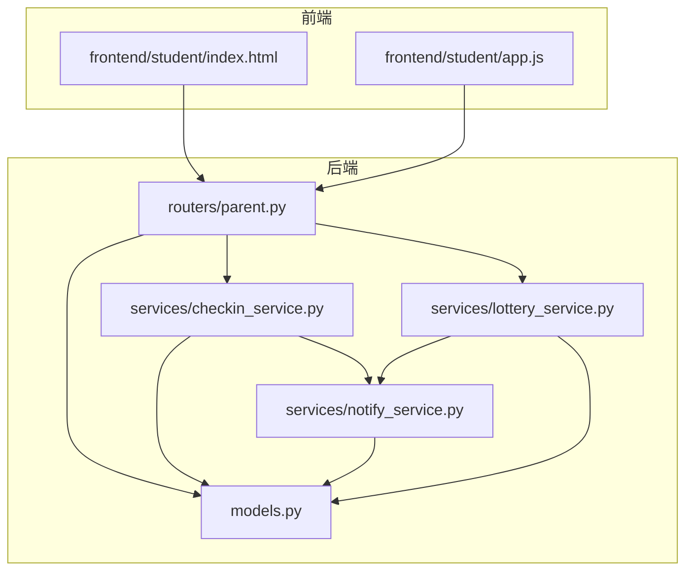
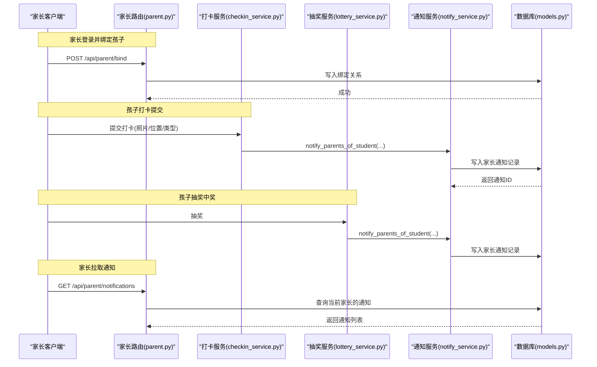
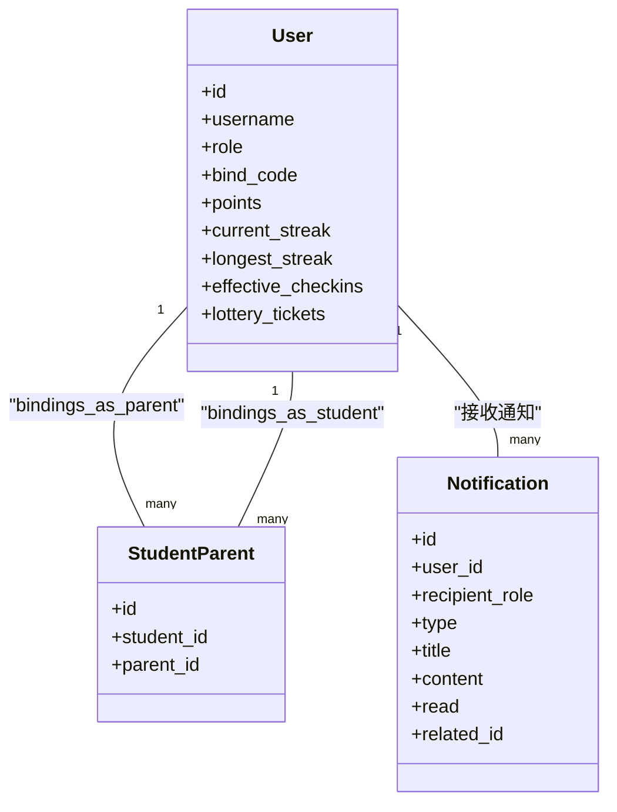
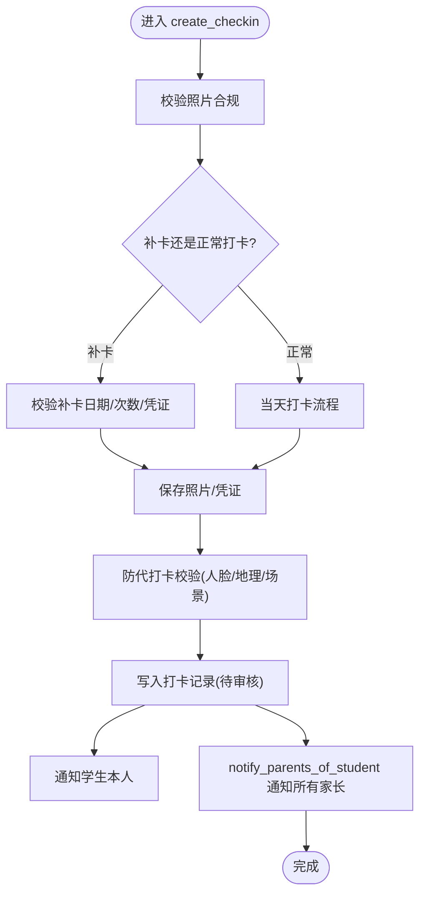
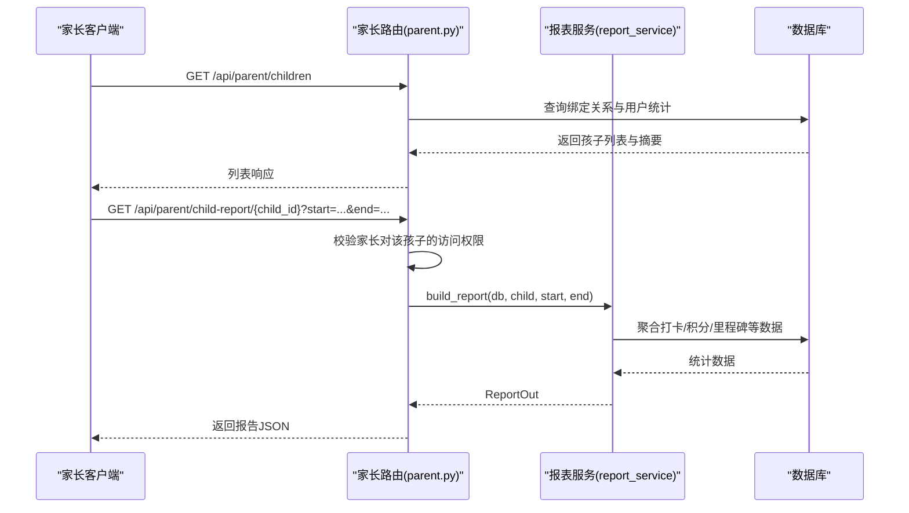
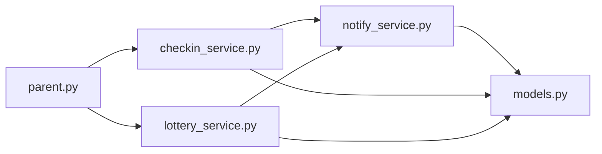

# 家长监督功能

<cite>
**本文引用的文件列表**
- [summer-homework-checkin/backend/app/routers/parent.py](file://summer-homework-checkin/backend/app/routers/parent.py)
- [summer-homework-checkin/backend/app/services/checkin_service.py](file://summer-homework-checkin/backend/app/services/checkin_service.py)
- [summer-homework-checkin/backend/app/services/notify_service.py](file://summer-homework-checkin/backend/app/services/notify_service.py)
- [summer-homework-checkin/backend/app/services/lottery_service.py](file://summer-homework-checkin/backend/app/services/lottery_service.py)
- [summer-homework-checkin/backend/app/models.py](file://summer-homework-checkin/backend/app/models.py)
- [summer-homework-checkin/frontend/student/index.html](file://summer-homework-checkin/frontend/student/index.html)
- [summer-homework-checkin/frontend/student/app.js](file://summer-homework-checkin/frontend/student/app.js)
</cite>

## 目录
1. [简介](#简介)
2. [项目结构](#项目结构)
3. [核心组件](#核心组件)
4. [架构总览](#架构总览)
5. [详细组件分析](#详细组件分析)
6. [依赖关系分析](#依赖关系分析)
7. [性能与可扩展性](#性能与可扩展性)
8. [故障排查指南](#故障排查指南)
9. [结论](#结论)
10. [附录：API 与数据模型速查](#附录api-与数据模型速查)

## 简介
本文件面向“家长监督”能力，系统性说明以下要点：
- 家长账号绑定机制与孩子账号关联关系
- 实时通知推送系统（站内通知）与扩展点
- notify_parents_of_student 的通知逻辑与触发场景（打卡提交、审核结果、异常行为提醒等）
- 家长查看孩子学习进度的数据接口、权限控制与隐私保护
- 通知渠道配置管理、消息模板定制、送达状态跟踪的现有实现与演进建议
- 家长端界面交互设计与用户体验优化建议

## 项目结构
与家长监督相关的关键代码位于后端路由与服务层，以及前端学生端页面中用于展示家长视图的部分。

图表来源
- [summer-homework-checkin/backend/app/routers/parent.py:1-237](file://summer-homework-checkin/backend/app/routers/parent.py#L1-L237)
- [summer-homework-checkin/backend/app/services/checkin_service.py:1-254](file://summer-homework-checkin/backend/app/services/checkin_service.py#L1-L254)
- [summer-homework-checkin/backend/app/services/notify_service.py:1-20](file://summer-homework-checkin/backend/app/services/notify_service.py#L1-L20)
- [summer-homework-checkin/backend/app/services/lottery_service.py:1-77](file://summer-homework-checkin/backend/app/services/lottery_service.py#L1-L77)
- [summer-homework-checkin/backend/app/models.py:1-212](file://summer-homework-checkin/backend/app/models.py#L1-L212)
- [summer-homework-checkin/frontend/student/index.html:37-71](file://summer-homework-checkin/frontend/student/index.html#L37-L71)
- [summer-homework-checkin/frontend/student/app.js:44-84](file://summer-homework-checkin/frontend/student/app.js#L44-L84)

章节来源
- [summer-homework-checkin/backend/app/routers/parent.py:1-237](file://summer-homework-checkin/backend/app/routers/parent.py#L1-L237)
- [summer-homework-checkin/backend/app/services/checkin_service.py:1-254](file://summer-homework-checkin/backend/app/services/checkin_service.py#L1-L254)
- [summer-homework-checkin/backend/app/services/notify_service.py:1-20](file://summer-homework-checkin/backend/app/services/notify_service.py#L1-L20)
- [summer-homework-checkin/backend/app/services/lottery_service.py:1-77](file://summer-homework-checkin/backend/app/services/lottery_service.py#L1-L77)
- [summer-homework-checkin/backend/app/models.py:1-212](file://summer-homework-checkin/backend/app/models.py#L1-L212)
- [summer-homework-checkin/frontend/student/index.html:37-71](file://summer-homework-checkin/frontend/student/index.html#L37-L71)
- [summer-homework-checkin/frontend/student/app.js:44-84](file://summer-homework-checkin/frontend/student/app.js#L44-L84)

## 核心组件
- 家长-孩子绑定与访问控制
  - 通过绑定码将家长与特定孩子建立多对多关系，所有涉及子资源的接口均校验该关系。
- 通知服务
  - 提供通用通知写入与“向某孩子的所有家长发送通知”的便捷方法。
- 打卡流程中的通知
  - 在打卡提交、审核通过/拒绝、连续天数里程碑解锁、抽奖中奖等关键节点生成通知。
- 家长端数据接口
  - 提供孩子列表、今日状态、学习报告、代打卡、兑换与抽奖等能力。
- 前端家长视图
  - 支持家长登录后切换不同孩子、查看进度、打开可视化报告。

章节来源
- [summer-homework-checkin/backend/app/routers/parent.py:20-64](file://summer-homework-checkin/backend/app/routers/parent.py#L20-L64)
- [summer-homework-checkin/backend/app/services/notify_service.py:1-20](file://summer-homework-checkin/backend/app/services/notify_service.py#L1-L20)
- [summer-homework-checkin/backend/app/services/checkin_service.py:148-163](file://summer-homework-checkin/backend/app/services/checkin_service.py#L148-L163)
- [summer-homework-checkin/backend/app/services/lottery_service.py:59-68](file://summer-homework-checkin/backend/app/services/lottery_service.py#L59-L68)
- [summer-homework-checkin/frontend/student/index.html:37-71](file://summer-homework-checkin/frontend/student/index.html#L37-L71)

## 架构总览
下图展示了家长监督的核心调用链：家长操作或孩子事件触发后，服务层写入站内通知；家长端通过 API 拉取通知与数据。

图表来源
- [summer-homework-checkin/backend/app/routers/parent.py:20-32](file://summer-homework-checkin/backend/app/routers/parent.py#L20-L32)
- [summer-homework-checkin/backend/app/services/checkin_service.py:148-163](file://summer-homework-checkin/backend/app/services/checkin_service.py#L148-L163)
- [summer-homework-checkin/backend/app/services/lottery_service.py:59-68](file://summer-homework-checkin/backend/app/services/lottery_service.py#L59-L68)
- [summer-homework-checkin/backend/app/services/notify_service.py:15-20](file://summer-homework-checkin/backend/app/services/notify_service.py#L15-L20)
- [summer-homework-checkin/backend/app/models.py:163-176](file://summer-homework-checkin/backend/app/models.py#L163-L176)

## 详细组件分析

### 家长账号绑定与关联关系
- 绑定流程
  - 家长使用孩子用户名与绑定码进行绑定，服务端校验角色与绑定码一致性，避免重复绑定。
- 关联关系
  - 通过 StudentParent 表维护家长与孩子的多对多关系，后续所有“以孩子为维度”的接口均需校验该关系。
- 访问控制
  - 统一通过 _resolve_child/_check_child_access 校验家长是否有权操作指定孩子，未绑定则返回无权限错误。

图表来源
- [summer-homework-checkin/backend/app/models.py:11-68](file://summer-homework-checkin/backend/app/models.py#L11-L68)
- [summer-homework-checkin/backend/app/models.py:163-176](file://summer-homework-checkin/backend/app/models.py#L163-L176)

章节来源
- [summer-homework-checkin/backend/app/routers/parent.py:20-32](file://summer-homework-checkin/backend/app/routers/parent.py#L20-L32)
- [summer-homework-checkin/backend/app/routers/parent.py:54-64](file://summer-homework-checkin/backend/app/routers/parent.py#L54-L64)
- [summer-homework-checkin/backend/app/models.py:57-68](file://summer-homework-checkin/backend/app/models.py#L57-L68)

### 通知服务与 notify_parents_of_student 逻辑
- 通知写入
  - notify 负责将一条通知持久化到数据库，包含接收者、角色、类型、标题、内容、关联 ID 等。
- 批量发送给家长
  - notify_parents_of_student 根据 student.id 查询所有绑定的家长，逐条写入通知。
- 触发场景
  - 打卡提交：创建打卡记录后，立即向学生本人及其所有家长发送“已提交，等待审核”的通知，并在存在地理风险时附加提示。
  - 审核通过/拒绝：审核动作会向学生本人发送结果通知（当前实现未直接调用 notify_parents_of_student）。
  - 连续天数里程碑：每满 7 天自动发放抽奖资格并向学生本人发送通知。
  - 抽奖中奖：当抽奖结果为中奖时，同时向学生与家长发送中奖通知。

图表来源
- [summer-homework-checkin/backend/app/services/checkin_service.py:64-163](file://summer-homework-checkin/backend/app/services/checkin_service.py#L64-L163)
- [summer-homework-checkin/backend/app/services/notify_service.py:15-20](file://summer-homework-checkin/backend/app/services/notify_service.py#L15-L20)

章节来源
- [summer-homework-checkin/backend/app/services/notify_service.py:1-20](file://summer-homework-checkin/backend/app/services/notify_service.py#L1-L20)
- [summer-homework-checkin/backend/app/services/checkin_service.py:148-163](file://summer-homework-checkin/backend/app/services/checkin_service.py#L148-L163)
- [summer-homework-checkin/backend/app/services/lottery_service.py:59-68](file://summer-homework-checkin/backend/app/services/lottery_service.py#L59-L68)

### 家长查看学习进度与数据接口
- 孩子列表与今日状态
  - 获取家长绑定的所有孩子，并附带连续天数、累计有效打卡、积分、今日是否已打卡/待审核等信息。
- 单孩子详情
  - 按 child_id 返回该孩子的概览信息，含今日状态。
- 学习报告
  - 提供 JSON 与 HTML 两种格式的报告接口，HTML 可直接在新窗口打开打印/下载。
- 权限控制
  - 所有涉及具体孩子的接口均先校验家长是否绑定该孩子，未绑定则拒绝访问。

图表来源
- [summer-homework-checkin/backend/app/routers/parent.py:35-51](file://summer-homework-checkin/backend/app/routers/parent.py#L35-L51)
- [summer-homework-checkin/backend/app/routers/parent.py:217-224](file://summer-homework-checkin/backend/app/routers/parent.py#L217-L224)

章节来源
- [summer-homework-checkin/backend/app/routers/parent.py:35-51](file://summer-homework-checkin/backend/app/routers/parent.py#L35-L51)
- [summer-homework-checkin/backend/app/routers/parent.py:217-224](file://summer-homework-checkin/backend/app/routers/parent.py#L217-L224)

### 通知渠道、消息模板与送达状态
- 现状
  - 当前采用站内通知（Notification 表），由家长端轮询或主动拉取。
  - 通知类型包括 checkin、lottery、system 等，标题与内容由业务侧拼接。
- 可扩展点
  - 可在 notify_service.notify 基础上增加外部渠道（短信、微信模板消息等）的异步投递，保持主流程不变。
- 送达状态
  - 当前仅记录 read 标记，未区分“已投递/已读/失败重试”。如需完善，可新增 delivered/read_at 等字段与重试队列。

章节来源
- [summer-homework-checkin/backend/app/models.py:163-176](file://summer-homework-checkin/backend/app/models.py#L163-L176)
- [summer-homework-checkin/backend/app/services/notify_service.py:5-13](file://summer-homework-checkin/backend/app/services/notify_service.py#L5-L13)

### 家长端界面交互与体验优化
- 现有交互
  - 家长登录后显示“当前孩子”切换栏，支持在多孩子间快速切换。
  - 首页展示连续打卡、最长连续、累计次数、积分与下一次解锁抽奖所需天数。
  - 支持一键打开可视化报告（HTML），便于打印/分享。
- 优化建议
  - 通知中心：新增独立通知页，支持按类型筛选、未读计数、点击跳转至对应记录。
  - 异常提醒高亮：对地理风险、人脸不匹配等高风险打卡在家长端显著提示，并提供快捷入口查看详情。
  - 进度看板：增加周/月趋势图、完成率、补卡使用次数等指标。
  - 无障碍与可读性：确保按钮触控尺寸、字号与对比度符合移动端规范。

章节来源
- [summer-homework-checkin/frontend/student/index.html:37-71](file://summer-homework-checkin/frontend/student/index.html#L37-L71)
- [summer-homework-checkin/frontend/student/app.js:44-84](file://summer-homework-checkin/frontend/student/app.js#L44-L84)

## 依赖关系分析
- 耦合与内聚
  - parent 路由主要承担鉴权与参数校验，业务逻辑下沉至 services 层，职责清晰。
  - notify_service 被多个业务模块复用，降低耦合。
- 外部依赖
  - 人脸识别与地理位置校验在打卡流程中引入，属于可选增强能力；无外网环境可降级运行。
- 潜在循环依赖
  - 当前未发现循环导入；各服务通过 models 与 database 解耦。

图表来源
- [summer-homework-checkin/backend/app/routers/parent.py:1-237](file://summer-homework-checkin/backend/app/routers/parent.py#L1-L237)
- [summer-homework-checkin/backend/app/services/checkin_service.py:1-254](file://summer-homework-checkin/backend/app/services/checkin_service.py#L1-L254)
- [summer-homework-checkin/backend/app/services/lottery_service.py:1-77](file://summer-homework-checkin/backend/app/services/lottery_service.py#L1-L77)
- [summer-homework-checkin/backend/app/services/notify_service.py:1-20](file://summer-homework-checkin/backend/app/services/notify_service.py#L1-L20)
- [summer-homework-checkin/backend/app/models.py:1-212](file://summer-homework-checkin/backend/app/models.py#L1-L212)

## 性能与可扩展性
- 通知写入
  - 当前同步写入数据库，适合中小规模；若并发较高，可引入消息队列异步落库与重试。
- 打卡流程
  - 人脸比对与图片处理可能成为瓶颈，建议缓存常用位置、并行化非阻塞步骤、限制图片最大尺寸。
- 报告生成
  - 复杂聚合建议在后台定时任务预计算，前端按需拉取。

[本节为通用指导，无需源码引用]

## 故障排查指南
- 家长无法看到孩子数据
  - 检查是否已完成绑定；确认请求携带了正确的 child_id 且家长角色为 parent。
- 通知未收到
  - 确认 notify_parents_of_student 是否被调用；检查 Notification 表中是否存在对应记录；确认家长端是否正确拉取 /api/parent/notifications。
- 打卡被拒
  - 关注人脸不匹配、多人脸、无人脸或模型不可用等错误；检查地理阈值与模式配置。

章节来源
- [summer-homework-checkin/backend/app/routers/parent.py:208-214](file://summer-homework-checkin/backend/app/routers/parent.py#L208-L214)
- [summer-homework-checkin/backend/app/services/checkin_service.py:116-123](file://summer-homework-checkin/backend/app/services/checkin_service.py#L116-L123)
- [summer-homework-checkin/backend/app/services/notify_service.py:15-20](file://summer-homework-checkin/backend/app/services/notify_service.py#L15-L20)

## 结论
家长监督功能围绕“绑定—通知—数据—界面”形成闭环：通过绑定码建立信任关系，依托站内通知及时触达家长，配合严格的权限校验保障隐私安全。当前通知为站内形式，具备良好扩展性，可按需接入短信/微信等渠道。建议在通知中心、异常提醒与进度看板方面持续优化，提升家长端的可用性与体验。

[本节为总结，无需源码引用]

## 附录：API 与数据模型速查
- 家长相关 API
  - POST /api/parent/bind：绑定孩子
  - GET /api/parent/children：获取孩子列表与摘要
  - GET /api/parent/child-streak/{child_id}：单孩子概览
  - POST /api/parent/checkin：家长代孩子打卡
  - GET /api/parent/mall/{child_id}：孩子商城与兑换记录
  - POST /api/parent/redeem：兑换奖品
  - POST /api/parent/redeem/{rid}/replace：替换兑换
  - GET /api/parent/lottery/{child_id}：抽奖记录
  - POST /api/parent/lottery/{child_id}/draw：抽奖
  - GET /api/parent/notifications：家长通知列表
  - PATCH /api/parent/notifications/{nid}/read：标记已读
  - GET /api/parent/child-report/{child_id}：学习报告(JSON)
  - GET /api/parent/child-report/{child_id}/html：学习报告(HTML)

- 通知数据模型关键字段
  - user_id、recipient_role、type、title、content、read、related_id、created_at

章节来源
- [summer-homework-checkin/backend/app/routers/parent.py:20-237](file://summer-homework-checkin/backend/app/routers/parent.py#L20-L237)
- [summer-homework-checkin/backend/app/models.py:163-176](file://summer-homework-checkin/backend/app/models.py#L163-L176)