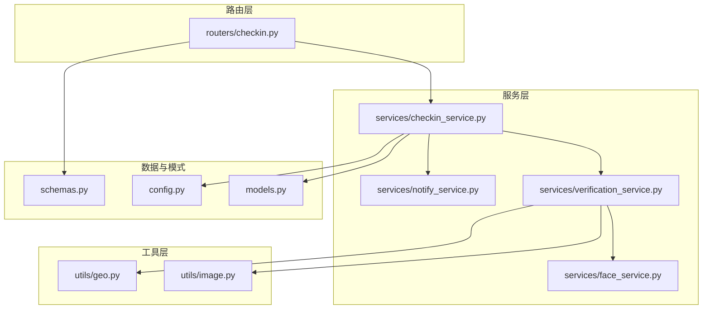
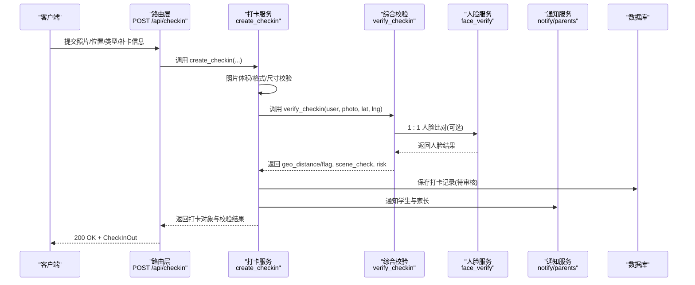
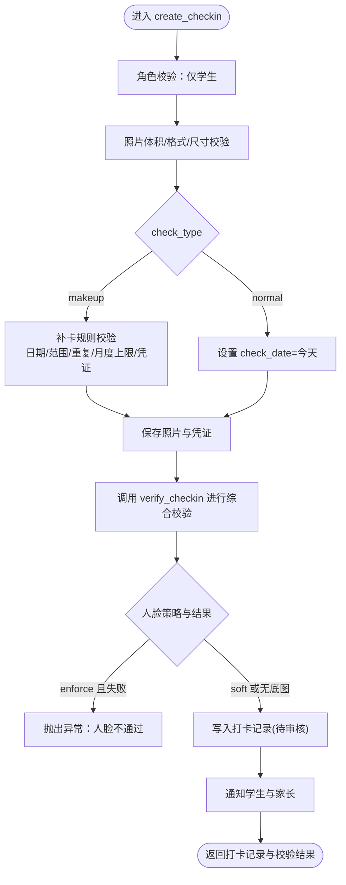
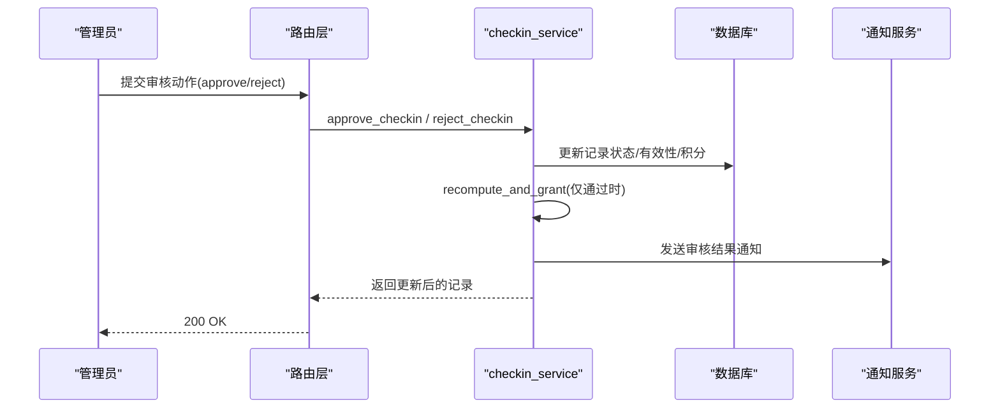
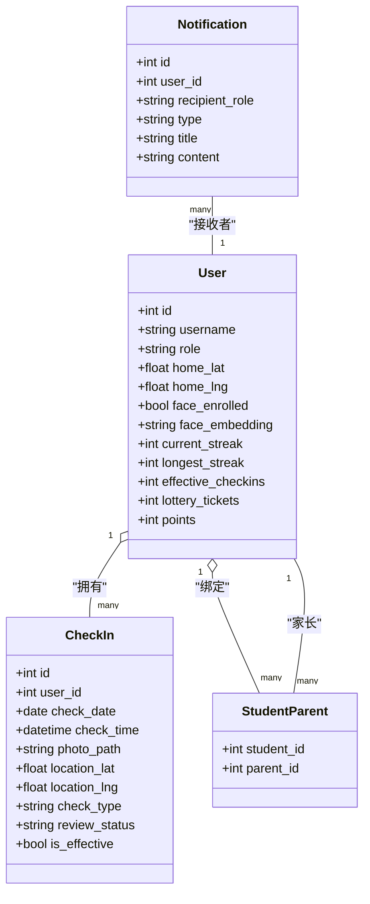

# 打卡管理系统

<cite>
**本文引用的文件**   
- [checkin.py](file://summer-homework-checkin/backend/app/routers/checkin.py)
- [checkin_service.py](file://summer-homework-checkin/backend/app/services/checkin_service.py)
- [verification_service.py](file://summer-homework-checkin/backend/app/services/verification_service.py)
- [face_service.py](file://summer-homework-checkin/backend/app/services/face_service.py)
- [notify_service.py](file://summer-homework-checkin/backend/app/services/notify_service.py)
- [image.py](file://summer-homework-checkin/backend/app/utils/image.py)
- [geo.py](file://summer-homework-checkin/backend/app/utils/geo.py)
- [models.py](file://summer-homework-checkin/backend/app/models.py)
- [schemas.py](file://summer-homework-checkin/backend/app/schemas.py)
- [config.py](file://summer-homework-checkin/backend/app/config.py)
</cite>

## 目录
1. [简介](#简介)
2. [项目结构](#项目结构)
3. [核心组件](#核心组件)
4. [架构总览](#架构总览)
5. [详细组件分析](#详细组件分析)
6. [依赖关系分析](#依赖关系分析)
7. [性能与可扩展性](#性能与可扩展性)
8. [故障排查指南](#故障排查指南)
9. [结论](#结论)
10. [附录：API 参考与示例](#附录api-参考与示例)

## 简介
本系统为“暑假作业打卡”场景提供完整的后端能力，涵盖学生端每日正常打卡、补卡申请、管理员审核、照片上传与合规校验、地理位置校验、人脸识别（1:1 本人比对）、通知推送、连续打卡统计与抽奖资格发放等。文档聚焦以下关键流程与函数：
- create_checkin：完整打卡创建流程（含照片合规、补卡规则、防作弊、通知）
- approve_checkin / reject_checkin：审核通过/拒绝的业务处理
- get_today_status：今日状态查询机制
- 照片上传验证、地理位置校验、人脸识别策略

## 项目结构
后端采用 FastAPI 路由 + 服务层 + 工具层的分层设计，数据模型与 Pydantic 模式分离，配置集中管理。

图表来源
- [checkin.py:1-80](file://summer-homework-checkin/backend/app/routers/checkin.py#L1-L80)
- [checkin_service.py:1-254](file://summer-homework-checkin/backend/app/services/checkin_service.py#L1-L254)
- [verification_service.py:1-71](file://summer-homework-checkin/backend/app/services/verification_service.py#L1-L71)
- [face_service.py:1-133](file://summer-homework-checkin/backend/app/services/face_service.py#L1-L133)
- [notify_service.py:1-20](file://summer-homework-checkin/backend/app/services/notify_service.py#L1-L20)
- [image.py:1-61](file://summer-homework-checkin/backend/app/utils/image.py#L1-L61)
- [geo.py:1-24](file://summer-homework-checkin/backend/app/utils/geo.py#L1-L24)
- [models.py:1-212](file://summer-homework-checkin/backend/app/models.py#L1-L212)
- [schemas.py:1-322](file://summer-homework-checkin/backend/app/schemas.py#L1-L322)
- [config.py:1-50](file://summer-homework-checkin/backend/app/config.py#L1-L50)

章节来源
- [checkin.py:1-80](file://summer-homework-checkin/backend/app/routers/checkin.py#L1-L80)
- [checkin_service.py:1-254](file://summer-homework-checkin/backend/app/services/checkin_service.py#L1-L254)
- [models.py:1-212](file://summer-homework-checkin/backend/app/models.py#L1-L212)
- [schemas.py:1-322](file://summer-homework-checkin/backend/app/schemas.py#L1-L322)
- [config.py:1-50](file://summer-homework-checkin/backend/app/config.py#L1-L50)

## 核心组件
- 路由层：暴露打卡相关 API，负责参数解析、鉴权、调用服务层并返回响应。
- 服务层：封装业务规则与跨模块协作（照片校验、地理校验、人脸比对、通知、积分与连续天数重算）。
- 工具层：图片格式与尺寸解析、经纬度距离计算。
- 数据层：SQLAlchemy 模型定义与 Pydantic 输入输出模式。
- 配置层：阈值、开关、路径等可配置项。

章节来源
- [checkin.py:1-80](file://summer-homework-checkin/backend/app/routers/checkin.py#L1-L80)
- [checkin_service.py:1-254](file://summer-homework-checkin/backend/app/services/checkin_service.py#L1-L254)
- [models.py:1-212](file://summer-homework-checkin/backend/app/models.py#L1-L212)
- [schemas.py:1-322](file://summer-homework-checkin/backend/app/schemas.py#L1-L322)
- [config.py:1-50](file://summer-homework-checkin/backend/app/config.py#L1-L50)

## 架构总览
下图展示一次“正常打卡”的端到端调用链：从客户端发起请求到数据库落库、通知发送与风险标记。

图表来源
- [checkin.py:17-37](file://summer-homework-checkin/backend/app/routers/checkin.py#L17-L37)
- [checkin_service.py:64-163](file://summer-homework-checkin/backend/app/services/checkin_service.py#L64-L163)
- [verification_service.py:19-71](file://summer-homework-checkin/backend/app/services/verification_service.py#L19-L71)
- [face_service.py:99-125](file://summer-homework-checkin/backend/app/services/face_service.py#L99-L125)
- [notify_service.py:5-20](file://summer-homework-checkin/backend/app/services/notify_service.py#L5-L20)

## 详细组件分析

### 每日正常打卡流程（create_checkin）
- 角色校验：仅学生可打卡。
- 照片合规检查：体积范围、有效图像格式、最小边长限制。
- 补卡规则验证：
  - 指定目标日期且为过去日期；
  - 在暑假统计范围内；
  - 该日期不存在已生效打卡；
  - 单月补卡次数上限；
  - 补卡需上传补充凭证。
- 照片与凭证保存：统一存储至上传目录。
- 防作弊验证：
  - 地理位置一致性（距常用位置距离与阈值判定）；
  - 人脸 1:1 比对（若已采集底图，按策略拦截或降级）；
  - 场景风险等级与标记。
- 记录落库：初始状态为“待审核”，是否有效默认未生效。
- 通知发送：向学生与家长分别推送“已提交等待审核”的通知。
- 返回值：打卡记录与校验结果。

图表来源
- [checkin_service.py:64-163](file://summer-homework-checkin/backend/app/services/checkin_service.py#L64-L163)
- [verification_service.py:19-71](file://summer-homework-checkin/backend/app/services/verification_service.py#L19-L71)
- [face_service.py:99-125](file://summer-homework-checkin/backend/app/services/face_service.py#L99-L125)
- [notify_service.py:5-20](file://summer-homework-checkin/backend/app/services/notify_service.py#L5-L20)

章节来源
- [checkin_service.py:64-163](file://summer-homework-checkin/backend/app/services/checkin_service.py#L64-L163)
- [checkin.py:17-37](file://summer-homework-checkin/backend/app/routers/checkin.py#L17-L37)
- [config.py:27-50](file://summer-homework-checkin/backend/app/config.py#L27-L50)

### 补卡申请机制
- 触发条件：check_type=makeup，需提供 makeup_for_date、reason 与 proof。
- 规则要点：
  - 目标日期必须早于今天且在暑假统计区间内；
  - 目标日期不可重复生效；
  - 单自然月补卡次数受 MAX_MAKEUP_PER_MONTH 限制；
  - 补卡通过后获得 MAKEUP_POINTS 积分（低于正常打卡）。
- 审核流程：与普通打卡一致，经管理员审核后计入有效打卡并更新连续天数与抽奖资格。

章节来源
- [checkin_service.py:72-103](file://summer-homework-checkin/backend/app/services/checkin_service.py#L72-L103)
- [checkin_service.py:166-191](file://summer-homework-checkin/backend/app/services/checkin_service.py#L166-L191)
- [config.py:27-39](file://summer-homework-checkin/backend/app/config.py#L27-L39)

### 打卡记录审核流程（approve/reject）
- approve_checkin：
  - 幂等保护：已通过则拒绝重复操作；
  - 根据打卡类型发放对应积分；
  - 标记 is_effective=True，重算连续天数与抽奖资格；
  - 通知学生“审核通过并获得积分”。
- reject_checkin：
  - 幂等保护：已拒绝则拒绝重复操作；
  - 标记 review_status=rejected，is_effective=False；
  - 通知学生“审核未通过并可附原因”。

图表来源
- [checkin_service.py:166-209](file://summer-homework-checkin/backend/app/services/checkin_service.py#L166-L209)
- [notify_service.py:5-20](file://summer-homework-checkin/backend/app/services/notify_service.py#L5-L20)

章节来源
- [checkin_service.py:166-209](file://summer-homework-checkin/backend/app/services/checkin_service.py#L166-L209)

### 今日状态查询（get_today_status）
- 查询当天所有“正常打卡”记录（包含 pending 与 approved）；
- 汇总 today_checked、today_pending、today_count、approved_count、pending_count；
- 计算本月剩余可补卡次数 can_makeup_this_month（基于已生效补卡计数与上限）。

章节来源
- [checkin_service.py:225-253](file://summer-homework-checkin/backend/app/services/checkin_service.py#L225-L253)
- [checkin.py:56-59](file://summer-homework-checkin/backend/app/routers/checkin.py#L56-L59)

### 照片上传验证
- 通用上传接口：用于前端图片查看器上传，返回可访问 URL。
- 校验逻辑：
  - 体积范围与格式合法性；
  - 最小边长限制，防止缩略图/占位图；
  - 支持 JPEG/PNG 解析，无需重型依赖。

章节来源
- [checkin.py:40-52](file://summer-homework-checkin/backend/app/routers/checkin.py#L40-L52)
- [image.py:34-61](file://summer-homework-checkin/backend/app/utils/image.py#L34-L61)

### 地理位置校验
- 使用 Haversine 公式计算两点间距离；
- 与 GEO_THRESHOLD_METERS 比较，超过阈值则标记代打卡风险；
- 当用户未设置常用位置或客户端未传坐标时，不进行距离判断。

章节来源
- [geo.py:1-24](file://summer-homework-checkin/backend/app/utils/geo.py#L1-L24)
- [verification_service.py:34-38](file://summer-homework-checkin/backend/app/services/verification_service.py#L34-L38)
- [config.py:27-28](file://summer-homework-checkin/backend/app/config.py#L27-L28)

### 人脸识别（1:1 本人比对）
- 注册采集：要求检测到且仅一张人脸，生成 512 维 embedding 并持久化；
- 打卡比对：现场照与底图余弦相似度对比，超过阈值即通过；
- 策略控制：
  - enforce：已采集但比对失败直接拒绝打卡；
  - soft：仅标记高风险但仍允许记录，交由人工复核；
- 降级策略：模型不可用时返回明确提示，不会静默放行。

章节来源
- [face_service.py:71-125](file://summer-homework-checkin/backend/app/services/face_service.py#L71-L125)
- [checkin_service.py:116-123](file://summer-homework-checkin/backend/app/services/checkin_service.py#L116-L123)
- [config.py:41-49](file://summer-homework-checkin/backend/app/config.py#L41-L49)

## 依赖关系分析
- 路由层依赖服务层与模式层，服务层依赖工具层与配置层。
- 防作弊链路：checkin_service -> verification_service -> face_service + image + geo。
- 通知链路：checkin_service -> notify_service -> Notification 表。
- 数据模型：User、CheckIn、StudentParent、Notification 等由 models.py 定义。

图表来源
- [models.py:11-96](file://summer-homework-checkin/backend/app/models.py#L11-L96)
- [models.py:163-176](file://summer-homework-checkin/backend/app/models.py#L163-L176)

章节来源
- [models.py:11-96](file://summer-homework-checkin/backend/app/models.py#L11-L96)
- [models.py:163-176](file://summer-homework-checkin/backend/app/models.py#L163-L176)

## 性能与可扩展性
- 图片解析轻量实现，避免引入重型图像处理库，降低内存与启动开销。
- 人脸识别服务懒加载与线程锁保护，首次按需下载模型，后续复用实例。
- 地理位置计算为纯数学运算，复杂度 O(1)。
- 建议：
  - 生产环境启用缓存（如 Redis）以加速热门查询（如 streak、today status）；
  - 对人脸模型推理进行异步化或批量化以提升吞吐；
  - 大文件上传增加分片与断点续传能力。

[本节为通用指导，不涉及具体文件分析]

## 故障排查指南
- 照片上传失败：
  - 检查体积是否在 MIN_PHOTO_BYTES ~ PHOTO_MAX_BYTES 之间；
  - 确认文件格式为 JPEG/PNG 且边长不小于 MIN_PHOTO_DIM。
- 人脸校验失败：
  - 确认是否已完成人脸底图采集；
  - 检查 FACE_MODE_ON_ENROLLED 策略是否为 enforce；
  - 观察 face_status 与 face_score，必要时重新采集。
- 地理位置风险：
  - 核对用户常用位置是否正确设置；
  - 调整 GEO_THRESHOLD_METERS 阈值以适应实际场景。
- 补卡被拒：
  - 检查目标日期是否为过去日期且在暑假统计区间；
  - 确认当月补卡次数未达 MAX_MAKEUP_PER_MONTH；
  - 确保上传了补卡凭证。
- 审核问题：
  - 幂等保护导致重复审核报错，需先查询当前 review_status；
  - 拒绝后无法再次通过，需新建记录或走申诉流程。

章节来源
- [image.py:51-61](file://summer-homework-checkin/backend/app/utils/image.py#L51-L61)
- [face_service.py:99-125](file://summer-homework-checkin/backend/app/services/face_service.py#L99-L125)
- [geo.py:19-24](file://summer-homework-checkin/backend/app/utils/geo.py#L19-L24)
- [checkin_service.py:72-103](file://summer-homework-checkin/backend/app/services/checkin_service.py#L72-L103)
- [checkin_service.py:166-209](file://summer-homework-checkin/backend/app/services/checkin_service.py#L166-L209)

## 结论
本打卡管理系统围绕“真实、可控、可追溯”的目标构建，通过照片合规、地理位置校验与人脸识别三重防线降低代打卡风险；同时提供灵活的补卡机制与完善的审核闭环，结合连续打卡激励与积分兑换体系提升学生参与度。系统具备良好的扩展性与容错能力，适合在暑期作业场景中规模化部署。

[本节为总结性内容，不涉及具体文件分析]

## 附录：API 参考与示例

### 打卡提交
- 方法：POST
- 路径：/api/checkin
- 表单字段：
  - photo: 必填，主打卡照片
  - proof: 选填，补卡凭证
  - location_lat: 选填，纬度
  - location_lng: 选填，经度
  - check_type: 选填，默认 normal，可选 makeup
  - makeup_reason: 选填，补卡原因
  - makeup_for_date: 选填，补卡目标日期（YYYY-MM-DD）
- 成功响应：CheckInOut 对象
- 错误处理：
  - 400：照片不合规、补卡规则不满足、人脸不通过（enforce 模式）
  - 403：非学生角色
  - 503：人脸识别服务暂不可用（enforce 模式）

章节来源
- [checkin.py:17-37](file://summer-homework-checkin/backend/app/routers/checkin.py#L17-L37)
- [checkin_service.py:64-163](file://summer-homework-checkin/backend/app/services/checkin_service.py#L64-L163)
- [schemas.py:54-76](file://summer-homework-checkin/backend/app/schemas.py#L54-L76)

### 通用图片上传
- 方法：POST
- 路径：/api/checkin/upload
- 表单字段：photo
- 成功响应：{ photo_path, photo_url }
- 错误处理：400 照片不合规

章节来源
- [checkin.py:40-52](file://summer-homework-checkin/backend/app/routers/checkin.py#L40-L52)
- [image.py:51-61](file://summer-homework-checkin/backend/app/utils/image.py#L51-L61)

### 今日状态查询
- 方法：GET
- 路径：/api/checkin/today
- 成功响应：包含 today_checked、today_pending、today_count、approved_count、pending_count、can_makeup_this_month

章节来源
- [checkin.py:56-59](file://summer-homework-checkin/backend/app/routers/checkin.py#L56-L59)
- [checkin_service.py:225-253](file://summer-homework-checkin/backend/app/services/checkin_service.py#L225-L253)

### 连续打卡与概览
- 方法：GET
- 路径：/api/checkin/streak
- 成功响应：StreakOut（current_streak、longest_streak、effective_checkins、lottery_tickets、today_checked、today_pending、can_makeup_this_month）

章节来源
- [checkin.py:62-73](file://summer-homework-checkin/backend/app/routers/checkin.py#L62-L73)
- [schemas.py:88-96](file://summer-homework-checkin/backend/app/schemas.py#L88-L96)

### 历史记录
- 方法：GET
- 路径：/api/checkin/history
- 成功响应：CheckInOut 列表（按时间倒序）

章节来源
- [checkin.py:76-79](file://summer-homework-checkin/backend/app/routers/checkin.py#L76-L79)
- [schemas.py:54-76](file://summer-homework-checkin/backend/app/schemas.py#L54-L76)

### 审核接口（概念说明）
- 通常提供两个端点：
  - 审核通过：传入记录 ID 与备注，内部调用 approve_checkin
  - 审核拒绝：传入记录 ID 与备注，内部调用 reject_checkin
- 行为：
  - 通过：标记有效、发放积分、重算连续天数与抽奖资格、通知学生
  - 拒绝：标记无效、通知学生并可附原因

章节来源
- [checkin_service.py:166-209](file://summer-homework-checkin/backend/app/services/checkin_service.py#L166-L209)