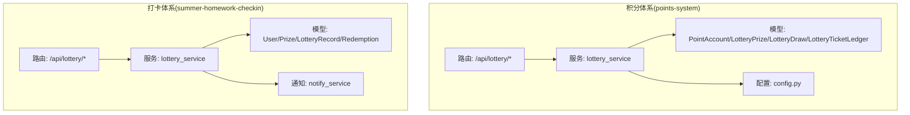
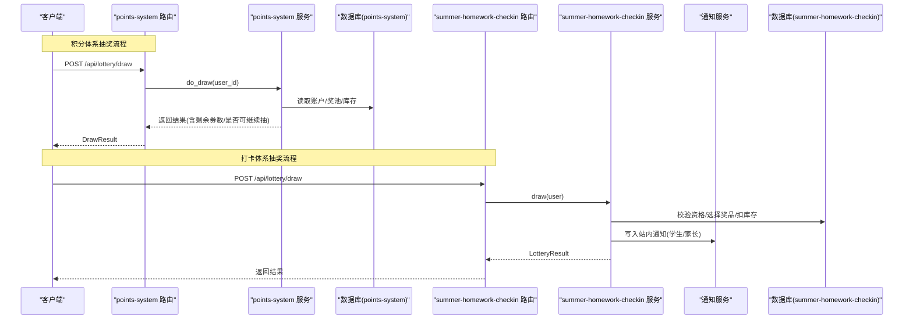
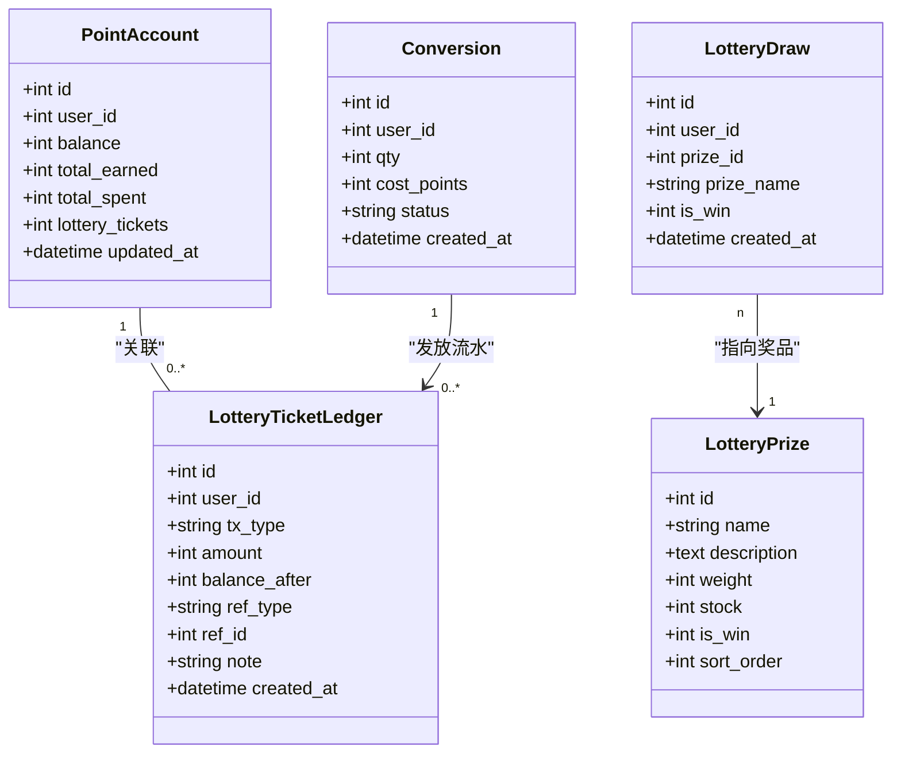
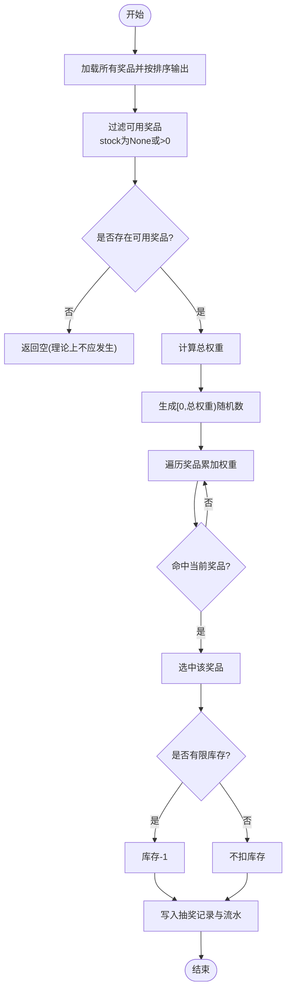
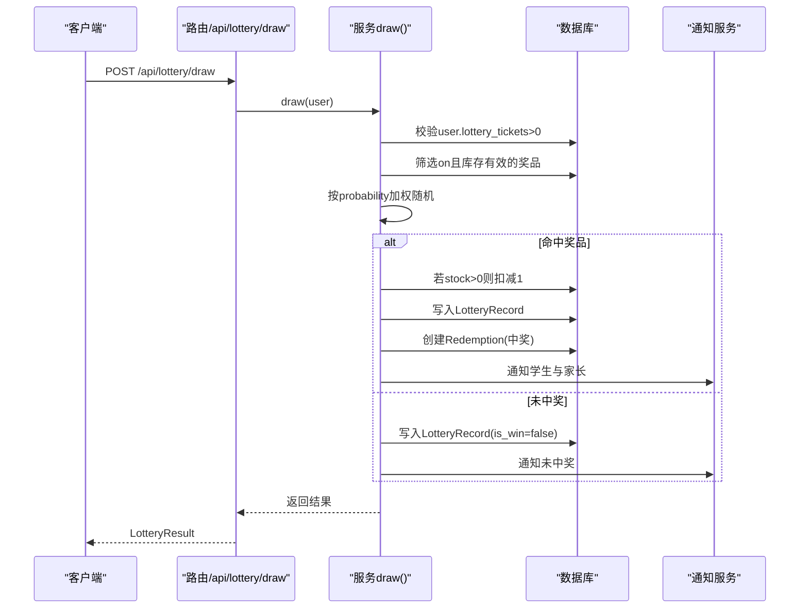
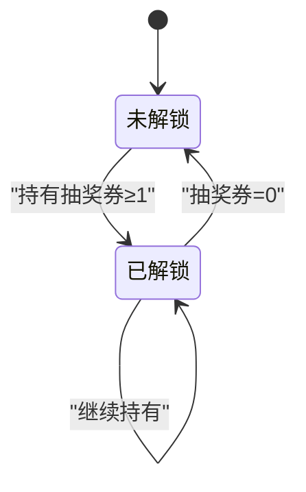
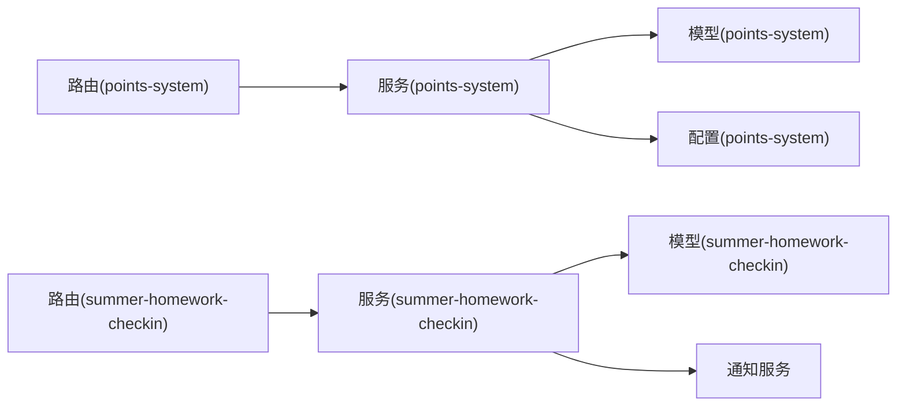

# 抽奖系统

<cite>
**本文引用的文件**   
- [points-system/backend/app/routers/lottery.py](file://points-system/backend/app/routers/lottery.py)
- [points-system/backend/app/services/lottery_service.py](file://points-system/backend/app/services/lottery_service.py)
- [points-system/backend/app/models.py](file://points-system/backend/app/models.py)
- [points-system/backend/app/schemas.py](file://points-system/backend/app/schemas.py)
- [points-system/backend/app/config.py](file://points-system/backend/app/config.py)
- [points-system/backend/seed.py](file://points-system/backend/seed.py)
- [summer-homework-checkin/backend/app/routers/lottery.py](file://summer-homework-checkin/backend/app/routers/lottery.py)
- [summer-homework-checkin/backend/app/services/lottery_service.py](file://summer-homework-checkin/backend/app/services/lottery_service.py)
- [summer-homework-checkin/backend/app/models.py](file://summer-homework-checkin/backend/app/models.py)
- [summer-homework-checkin/backend/app/schemas.py](file://summer-homework-checkin/backend/app/schemas.py)
- [summer-homework-checkin/backend/app/services/notify_service.py](file://summer-homework-checkin/backend/app/services/notify_service.py)
</cite>

## 目录
1. [简介](#简介)
2. [项目结构](#项目结构)
3. [核心组件](#核心组件)
4. [架构总览](#架构总览)
5. [详细组件分析](#详细组件分析)
6. [依赖关系分析](#依赖关系分析)
7. [性能与扩展性](#性能与扩展性)
8. [故障排查指南](#故障排查指南)
9. [结论](#结论)
10. [附录：API 调用示例与集成指南](#附录api-调用示例与集成指南)

## 简介
本文件为“抽奖系统”的完整功能文档，覆盖两个子系统的实现：  
- 积分兑换抽奖券与加权随机抽奖（points-system）  
- 打卡活动中的抽奖机会与通知联动（summer-homework-checkin）  

重点说明：
- 抽奖资格获取机制（积分兑换、打卡奖励、特殊奖品兑换）
- 加权随机算法实现与库存扣减逻辑
- 奖品分类管理、概率配置、库存策略
- 抽奖结果记录、查询与统计分析
- 并发安全、防刷策略、异常处理
- 扩展性与性能优化方案
- API 调用示例与前端集成要点

## 项目结构
本仓库包含两套后端服务，均提供抽奖能力：
- points-system：以“积分账户 + 抽奖券”为核心，支持积分兑换抽奖券、按权重随机抽奖、库存扣减与流水对账。
- summer-homework-checkin：面向学生打卡场景，通过用户字段 lottery_tickets 控制抽奖资格，结合奖品表 probability 进行加权随机，并联动站内通知与家长通知。

图表来源
- [points-system/backend/app/routers/lottery.py:1-55](file://points-system/backend/app/routers/lottery.py#L1-L55)
- [points-system/backend/app/services/lottery_service.py:1-174](file://points-system/backend/app/services/lottery_service.py#L1-L174)
- [summer-homework-checkin/backend/app/routers/lottery.py:1-30](file://summer-homework-checkin/backend/app/routers/lottery.py#L1-L30)
- [summer-homework-checkin/backend/app/services/lottery_service.py:1-77](file://summer-homework-checkin/backend/app/services/lottery_service.py#L1-L77)
- [summer-homework-checkin/backend/app/services/notify_service.py:1-20](file://summer-homework-checkin/backend/app/services/notify_service.py#L1-L20)

章节来源
- [points-system/backend/app/routers/lottery.py:1-55](file://points-system/backend/app/routers/lottery.py#L1-L55)
- [summer-homework-checkin/backend/app/routers/lottery.py:1-30](file://summer-homework-checkin/backend/app/routers/lottery.py#L1-L30)

## 核心组件
- 路由层
  - points-system：提供奖池展示、抽奖、抽奖历史等接口。
  - summer-homework-checkin：提供抽奖次数与记录查询、抽奖入口。
- 服务层
  - points-system：负责积分兑换抽奖券、加权随机抽奖、库存扣减、事务一致性保障。
  - summer-homework-checkin：负责消耗抽奖资格、按概率随机、库存扣减、创建中奖兑换单、发送通知。
- 数据模型
  - points-system：PointAccount、LotteryPrize、LotteryDraw、LotteryTicketLedger、Conversion 等。
  - summer-homework-checkin：User.lottery_tickets、Prize.probability/stock/status、LotteryRecord、Redemption 等。
- 配置
  - points-system：POINTS_PER_TICKET、TICKETS_PER_DRAW 等规则集中配置。
- 通知
  - summer-homework-checkin：中奖时向学生与家长推送站内通知。

章节来源
- [points-system/backend/app/services/lottery_service.py:1-174](file://points-system/backend/app/services/lottery_service.py#L1-L174)
- [summer-homework-checkin/backend/app/services/lottery_service.py:1-77](file://summer-homework-checkin/backend/app/services/lottery_service.py#L1-L77)
- [points-system/backend/app/models.py:1-151](file://points-system/backend/app/models.py#L1-L151)
- [summer-homework-checkin/backend/app/models.py:1-212](file://summer-homework-checkin/backend/app/models.py#L1-L212)
- [points-system/backend/app/config.py:1-17](file://points-system/backend/app/config.py#L1-L17)
- [summer-homework-checkin/backend/app/services/notify_service.py:1-20](file://summer-homework-checkin/backend/app/services/notify_service.py#L1-L20)

## 架构总览
两套系统均采用“路由 -> 服务 -> 模型/配置”的分层设计，保证职责清晰、易于扩展。

图表来源
- [points-system/backend/app/routers/lottery.py:24-37](file://points-system/backend/app/routers/lottery.py#L24-L37)
- [points-system/backend/app/services/lottery_service.py:117-174](file://points-system/backend/app/services/lottery_service.py#L117-L174)
- [summer-homework-checkin/backend/app/routers/lottery.py:25-29](file://summer-homework-checkin/backend/app/routers/lottery.py#L25-L29)
- [summer-homework-checkin/backend/app/services/lottery_service.py:9-77](file://summer-homework-checkin/backend/app/services/lottery_service.py#L9-L77)
- [summer-homework-checkin/backend/app/services/notify_service.py:5-13](file://summer-homework-checkin/backend/app/services/notify_service.py#L5-L13)

## 详细组件分析

### 积分体系(points-system)
- 抽奖资格获取
  - 通过积分兑换抽奖券：按 POINTS_PER_TICKET 比例兑换，批量兑换需满足最低门槛与余额校验。
  - 抽奖权限由账户字段 lottery_tickets ≥ TICKETS_PER_DRAW 派生，无需额外状态位。
- 加权随机算法
  - 仅考虑 stock 为 None 或 >0 的奖品；计算总权重后在区间内随机取值，累加命中目标奖品。
- 库存管理与扣减
  - 有限库存奖品在选中后扣减 1；不限量奖品(stock=None)不扣库存。
- 事务与并发
  - 使用进程内锁 _account_lock 串行化同一账户的读改写，避免 SQLite 下丢失更新；多实例部署建议改用数据库悲观锁。
- 记录与对账
  - 积分支出流水(PointLedger)、抽奖券发放/消耗流水(LotteryTicketLedger)、抽奖记录(LotteryDraw)全量落库，便于审计与统计。

图表来源
- [points-system/backend/app/models.py:20-33](file://points-system/backend/app/models.py#L20-L33)
- [points-system/backend/app/models.py:125-137](file://points-system/backend/app/models.py#L125-L137)
- [points-system/backend/app/models.py:139-151](file://points-system/backend/app/models.py#L139-L151)
- [points-system/backend/app/models.py:110-123](file://points-system/backend/app/models.py#L110-L123)
- [points-system/backend/app/models.py:96-108](file://points-system/backend/app/models.py#L96-L108)

#### 加权随机流程图

图表来源
- [points-system/backend/app/services/lottery_service.py:101-114](file://points-system/backend/app/services/lottery_service.py#L101-L114)
- [points-system/backend/app/services/lottery_service.py:137-160](file://points-system/backend/app/services/lottery_service.py#L137-L160)

章节来源
- [points-system/backend/app/services/lottery_service.py:30-98](file://points-system/backend/app/services/lottery_service.py#L30-L98)
- [points-system/backend/app/services/lottery_service.py:117-174](file://points-system/backend/app/services/lottery_service.py#L117-L174)
- [points-system/backend/app/config.py:12-17](file://points-system/backend/app/config.py#L12-L17)
- [points-system/backend/seed.py:19-35](file://points-system/backend/seed.py#L19-L35)

### 打卡体系(summer-homework-checkin)
- 抽奖资格获取
  - 用户字段 lottery_tickets 表示可用抽奖次数；当 >0 时可参与抽奖。
  - 可通过“积分兑换抽奖机会”的特殊奖品增加抽奖次数（is_lottery_ticket=True）。
- 加权随机算法
  - 从状态为 on 且库存有效(stock=-1或>0)的奖品中筛选候选集；按 probability 权重随机选择。
- 库存管理与扣减
  - 仅对 stock>0 的奖品扣减 1；stock=-1 视为不限量。
- 中奖联动
  - 中奖时自动创建 Redemption 记录，并在学生端与管理端可见；同时向学生与家长发送站内通知。
- 权限控制
  - 路由层限制仅学生角色可抽奖。

图表来源
- [summer-homework-checkin/backend/app/routers/lottery.py:25-29](file://summer-homework-checkin/backend/app/routers/lottery.py#L25-L29)
- [summer-homework-checkin/backend/app/services/lottery_service.py:9-77](file://summer-homework-checkin/backend/app/services/lottery_service.py#L9-L77)
- [summer-homework-checkin/backend/app/services/notify_service.py:5-13](file://summer-homework-checkin/backend/app/services/notify_service.py#L5-L13)

章节来源
- [summer-homework-checkin/backend/app/routers/lottery.py:13-29](file://summer-homework-checkin/backend/app/routers/lottery.py#L13-L29)
- [summer-homework-checkin/backend/app/services/lottery_service.py:9-77](file://summer-homework-checkin/backend/app/services/lottery_service.py#L9-L77)
- [summer-homework-checkin/backend/app/models.py:103-139](file://summer-homework-checkin/backend/app/models.py#L103-L139)
- [summer-homework-checkin/backend/app/schemas.py:140-154](file://summer-homework-checkin/backend/app/schemas.py#L140-L154)

### 概念总览
- 抽奖券生命周期：获得（积分兑换/特殊奖品）→ 持有 → 消耗（抽奖）→ 清零即锁定。
- 奖品生命周期：创建（含分类、概率、库存、状态）→ 上架(on) → 被抽取 → 库存耗尽(off)。
- 记录与对账：每次变动均有流水或记录，确保可追溯、可审计。

（此图为概念示意，不对应具体源码文件）

## 依赖关系分析
- 模块耦合
  - 路由层仅依赖服务层与模型/配置，保持低耦合。
  - 服务层集中业务逻辑，统一事务边界与错误处理。
- 外部依赖
  - 数据库：SQLite 演示环境，生产建议 PostgreSQL/MySQL。
  - 通知：站内通知可扩展短信/微信模板消息。
- 潜在循环依赖
  - 当前未发现循环导入；服务层通过显式 import models/config。

图表来源
- [points-system/backend/app/routers/lottery.py:1-55](file://points-system/backend/app/routers/lottery.py#L1-L55)
- [points-system/backend/app/services/lottery_service.py:1-174](file://points-system/backend/app/services/lottery_service.py#L1-L174)
- [summer-homework-checkin/backend/app/routers/lottery.py:1-30](file://summer-homework-checkin/backend/app/routers/lottery.py#L1-L30)
- [summer-homework-checkin/backend/app/services/lottery_service.py:1-77](file://summer-homework-checkin/backend/app/services/lottery_service.py#L1-L77)
- [summer-homework-checkin/backend/app/services/notify_service.py:1-20](file://summer-homework-checkin/backend/app/services/notify_service.py#L1-L20)

章节来源
- [points-system/backend/app/models.py:1-151](file://points-system/backend/app/models.py#L1-L151)
- [summer-homework-checkin/backend/app/models.py:1-212](file://summer-homework-checkin/backend/app/models.py#L1-L212)

## 性能与扩展性
- 并发与一致性
  - points-system 使用进程内锁串行化账户级操作，避免 SQLite 丢失更新；多实例部署建议采用数据库行级锁（如 with_for_update）。
  - 所有读改写在同一事务内完成，失败统一回滚，保证原子性。
- 随机算法复杂度
  - 加权随机时间复杂度 O(n)，n 为可用奖品数量；奖品规模较小时开销可忽略。
- 库存扣减
  - 仅在命中且有限库存时扣减，减少不必要的写放大。
- 扩展点
  - 新增奖品类型：在模型与路由响应中扩展字段即可。
  - 多渠道通知：在 notify_service 中增加渠道适配。
  - 高并发：引入数据库悲观锁、分片/分区索引、读写分离。
- 缓存与预热
  - 奖池/概率可缓存至内存或 Redis，降低热点读压力。
- 监控与告警
  - 对抽奖成功率、库存异常、超时率进行埋点与告警。

（本节为通用指导，不直接分析具体文件）

## 故障排查指南
- 常见错误码与原因
  - 400：参数非法或条件不满足（如兑换数量<1、积分不足、无抽奖资格）。
  - 403：权限不足（非学生角色尝试抽奖）。
  - 404：用户不存在。
  - 409：并发冲突（兑换/抽奖处理冲突，请重试）。
  - 500：内部错误（如奖池无可发放奖品）。
- 定位步骤
  - 检查请求参数与用户状态（积分、抽奖券、角色）。
  - 查看对应流水/记录表确认是否成功落库。
  - 核对奖池配置（stock、weight/probability、status）。
  - 观察通知是否发出（学生与家长）。
- 日志与追踪
  - 结合 ref_type/ref_id 将流水与业务主键关联，快速回溯。

章节来源
- [points-system/backend/app/services/lottery_service.py:30-98](file://points-system/backend/app/services/lottery_service.py#L30-L98)
- [points-system/backend/app/services/lottery_service.py:117-174](file://points-system/backend/app/services/lottery_service.py#L117-L174)
- [summer-homework-checkin/backend/app/routers/lottery.py:25-29](file://summer-homework-checkin/backend/app/routers/lottery.py#L25-L29)

## 结论
两套抽奖系统在职责划分、事务一致性与可追溯性方面表现良好：  
- points-system 强调“积分-券-奖”闭环与严格对账；  
- summer-homework-checkin 强调“打卡-资格-奖品-通知”联动体验。  
在生产环境中，建议引入数据库悲观锁、缓存与监控，进一步提升稳定性与性能。

## 附录：API 调用示例与集成指南

### 积分体系(points-system)
- 获取奖池
  - 方法：GET
  - 路径：/api/lottery/pool
  - 说明：返回奖池配置（名称、描述、权重、库存、是否中奖），供前端渲染转盘。
- 发起抽奖
  - 方法：POST
  - 路径：/api/lottery/draw
  - 请求体：{ "user_id": <整数> }
  - 返回：包含抽奖结果、剩余抽奖券数、是否仍可继续抽奖。
- 查询抽奖历史
  - 方法：GET
  - 路径：/api/lottery/draws?user_id=<整数>
  - 返回：用户的抽奖记录列表（按时间倒序）。

章节来源
- [points-system/backend/app/routers/lottery.py:11-21](file://points-system/backend/app/routers/lottery.py#L11-L21)
- [points-system/backend/app/routers/lottery.py:24-37](file://points-system/backend/app/routers/lottery.py#L24-L37)
- [points-system/backend/app/routers/lottery.py:40-54](file://points-system/backend/app/routers/lottery.py#L40-L54)

### 打卡体系(summer-homework-checkin)
- 查询抽奖次数与记录
  - 方法：GET
  - 路径：/api/lottery/tickets
  - 认证：需要登录态（学生角色）
  - 返回：当前抽奖次数与历史记录。
- 发起抽奖
  - 方法：POST
  - 路径：/api/lottery/draw
  - 认证：需要登录态（学生角色）
  - 返回：是否中奖、奖品信息、剩余次数与提示消息。

章节来源
- [summer-homework-checkin/backend/app/routers/lottery.py:13-22](file://summer-homework-checkin/backend/app/routers/lottery.py#L13-L22)
- [summer-homework-checkin/backend/app/routers/lottery.py:25-29](file://summer-homework-checkin/backend/app/routers/lottery.py#L25-L29)

### 前端集成要点
- 奖池展示
  - 使用奖池接口数据初始化转盘扇区；注意区分中奖与未中奖项。
- 兑换与抽奖按钮状态
  - 根据返回的 can_lottery 与剩余券数动态启用/禁用按钮，并显示提示信息。
- 结果反馈
  - 中奖时展示奖品详情与领取方式；未中奖时给出鼓励文案与引导。

章节来源
- [points-system/frontend/app.js:342-377](file://points-system/frontend/app.js#L342-L377)
- [points-system/frontend/index.html:41-53](file://points-system/frontend/index.html#L41-L53)