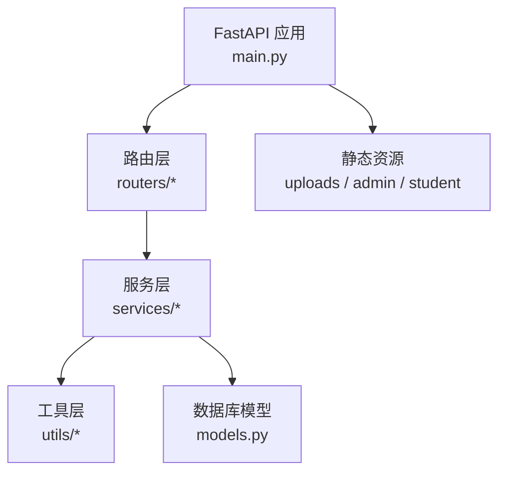
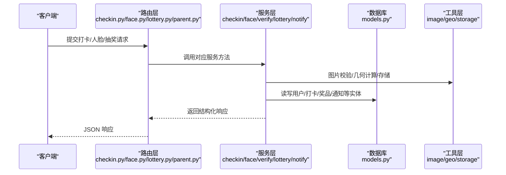
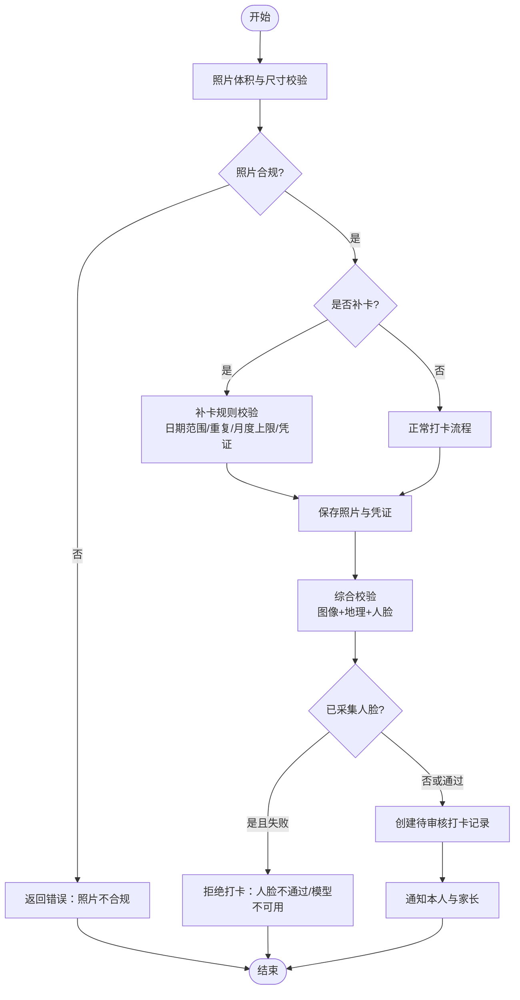
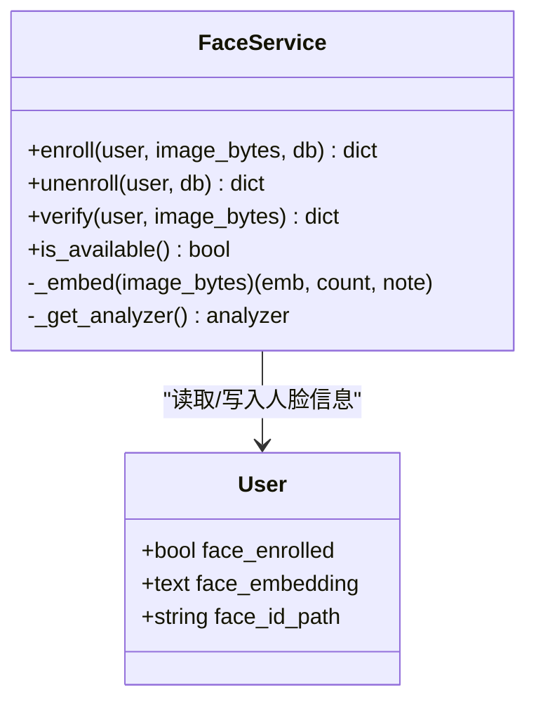
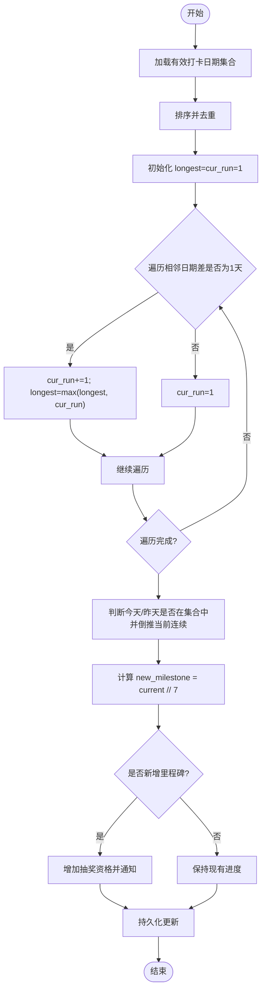
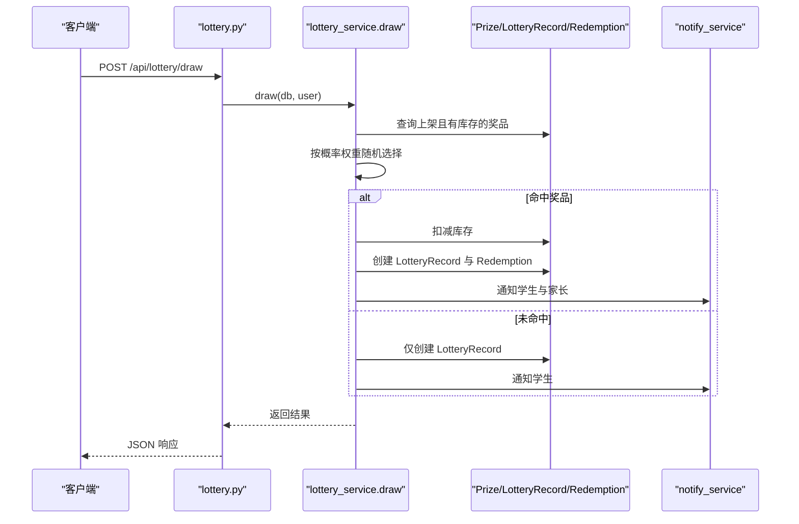
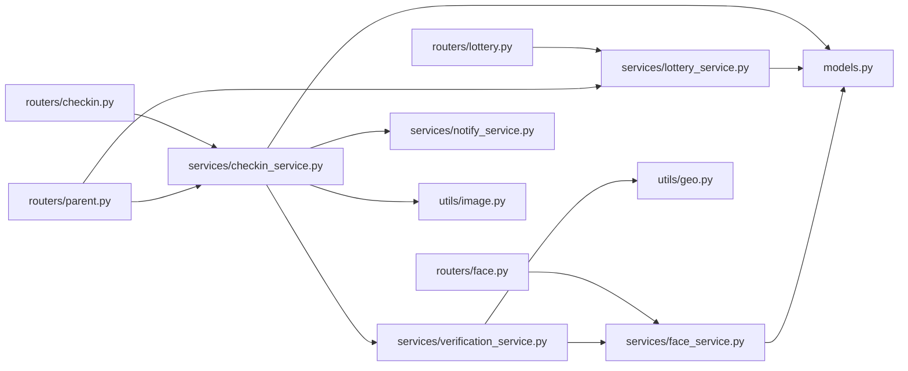

# 核心功能特性

<cite>
**本文引用的文件**   
- [README.md](file://summer-homework-checkin/README.md)
- [main.py](file://summer-homework-checkin/backend/app/main.py)
- [models.py](file://summer-homework-checkin/backend/app/models.py)
- [schemas.py](file://summer-homework-checkin/backend/app/schemas.py)
- [config.py](file://summer-homework-checkin/backend/app/config.py)
- [checkin_service.py](file://summer-homework-checkin/backend/app/services/checkin_service.py)
- [face_service.py](file://summer-homework-checkin/backend/app/services/face_service.py)
- [verification_service.py](file://summer-homework-checkin/backend/app/services/verification_service.py)
- [lottery_service.py](file://summer-homework-checkin/backend/app/services/lottery_service.py)
- [notify_service.py](file://summer-homework-checkin/backend/app/services/notify_service.py)
- [image.py](file://summer-homework-checkin/backend/app/utils/image.py)
- [geo.py](file://summer-homework-checkin/backend/app/utils/geo.py)
- [routers/checkin.py](file://summer-homework-checkin/backend/app/routers/checkin.py)
- [routers/face.py](file://summer-homework-checkin/backend/app/routers/face.py)
- [routers/lottery.py](file://summer-homework-checkin/backend/app/routers/lottery.py)
- [routers/parent.py](file://summer-homework-checkin/backend/app/routers/parent.py)
</cite>

## 目录
1. [简介](#简介)
2. [项目结构](#项目结构)
3. [核心组件](#核心组件)
4. [架构总览](#架构总览)
5. [详细组件分析](#详细组件分析)
6. [依赖关系分析](#依赖关系分析)
7. [性能与扩展性](#性能与扩展性)
8. [故障排查指南](#故障排查指南)
9. [结论](#结论)
10. [附录：API 与数据模型速查](#附录api-与数据模型速查)

## 简介
本文件面向「暑假作业打卡系统」的核心业务，系统性梳理每日打卡、人脸识别防作弊、连续天数统计、补卡管理、积分奖励、抽奖系统与家长监督通知等关键能力。文档从业务流程、输入输出参数、异常处理策略入手，并结合代码级图示展示模块协作与数据流转，帮助读者快速理解并正确使用各功能。

## 项目结构
系统采用前后端分离架构，后端基于 FastAPI，提供 REST API；前端包含学生 H5 与独立后台管理页。后端按路由层（routers）、服务层（services）、工具层（utils）分层组织，数据库使用 SQLite，静态资源通过挂载方式提供。

图表来源
- [main.py:1-49](file://summer-homework-checkin/backend/app/main.py#L1-L49)

章节来源
- [README.md:26-49](file://summer-homework-checkin/README.md#L26-L49)
- [main.py:1-49](file://summer-homework-checkin/backend/app/main.py#L1-L49)

## 核心组件
- 打卡服务：负责照片校验、地理位置一致性检查、人脸 1:1 比对、补卡规则、审核通过后积分发放与连续天数重算、通知推送。
- 人脸识别服务：采集人脸底图、撤销底图、现场照与底图 1:1 比对，支持模型不可用降级策略。
- 验证服务：整合图像真实性、地理距离、人脸比对结果，输出场景合规与风险等级。
- 抽奖服务：消耗抽奖资格，按概率与库存加权随机抽取，记录中奖与兑换信息。
- 通知服务：站内通知持久化，支持向家长批量推送孩子相关事件。
- 配置与工具：阈值与限额、图片解析、经纬度距离计算、上传存储。

章节来源
- [checkin_service.py:1-254](file://summer-homework-checkin/backend/app/services/checkin_service.py#L1-L254)
- [face_service.py:1-133](file://summer-homework-checkin/backend/app/services/face_service.py#L1-L133)
- [verification_service.py:1-71](file://summer-homework-checkin/backend/app/services/verification_service.py#L1-L71)
- [lottery_service.py:1-77](file://summer-homework-checkin/backend/app/services/lottery_service.py#L1-L77)
- [notify_service.py:1-20](file://summer-homework-checkin/backend/app/services/notify_service.py#L1-L20)
- [config.py:1-50](file://summer-homework-checkin/backend/app/config.py#L1-L50)
- [image.py:1-61](file://summer-homework-checkin/backend/app/utils/image.py#L1-L61)
- [geo.py:1-24](file://summer-homework-checkin/backend/app/utils/geo.py#L1-L24)

## 架构总览
下图展示了从客户端到后端核心服务的调用链路与数据流向，涵盖打卡、人脸、验证、通知与数据库交互。

图表来源
- [main.py:1-49](file://summer-homework-checkin/backend/app/main.py#L1-L49)
- [routers/checkin.py:1-80](file://summer-homework-checkin/backend/app/routers/checkin.py#L1-L80)
- [routers/face.py:1-45](file://summer-homework-checkin/backend/app/routers/face.py#L1-L45)
- [routers/lottery.py:1-30](file://summer-homework-checkin/backend/app/routers/lottery.py#L1-L30)
- [routers/parent.py:1-237](file://summer-homework-checkin/backend/app/routers/parent.py#L1-L237)
- [checkin_service.py:1-254](file://summer-homework-checkin/backend/app/services/checkin_service.py#L1-L254)
- [face_service.py:1-133](file://summer-homework-checkin/backend/app/services/face_service.py#L1-L133)
- [verification_service.py:1-71](file://summer-homework-checkin/backend/app/services/verification_service.py#L1-L71)
- [lottery_service.py:1-77](file://summer-homework-checkin/backend/app/services/lottery_service.py#L1-L77)
- [notify_service.py:1-20](file://summer-homework-checkin/backend/app/services/notify_service.py#L1-L20)
- [models.py:1-212](file://summer-homework-checkin/backend/app/models.py#L1-L212)
- [image.py:1-61](file://summer-homework-checkin/backend/app/utils/image.py#L1-L61)
- [geo.py:1-24](file://summer-homework-checkin/backend/app/utils/geo.py#L1-L24)

## 详细组件分析

### 每日打卡机制
- 业务流程
  - 接收照片、位置、类型（正常/补卡）及补卡目标日期与凭证。
  - 执行照片体积与尺寸校验、补卡规则校验（日期范围、重复打卡、月度上限）。
  - 保存照片与凭证，进行综合防代打卡校验（图像真实性、地理位置一致性、人脸 1:1 比对）。
  - 若已采集人脸且比对失败或模型不可用且策略为严格模式，直接拒绝。
  - 创建待审核打卡记录，推送通知给本人及家长。
  - 管理员审核后标记有效，发放积分，重算连续天数与抽奖资格。
- 输入参数
  - 表单字段：location_lat, location_lng, check_type(normal/makeup), makeup_reason, makeup_for_date(YYYY-MM-DD)。
  - 文件字段：photo(必填), proof(补卡时必填)。
- 输出参数
  - 返回打卡记录对象，含 photo_url、geo_distance、scene_check、face_status、face_score、review_status 等。
- 异常处理
  - 照片不合规、补卡日期无效或超出暑假范围、重复补卡、月度补卡次数超限、人脸不通过或模型不可用（严格模式）均返回明确错误。
- 关键实现路径
  - 路由：POST /api/checkin
  - 服务：create_checkin、approve_checkin、reject_checkin、get_today_status
  - 工具：validate_photo、haversine、save_upload

图表来源
- [routers/checkin.py:17-37](file://summer-homework-checkin/backend/app/routers/checkin.py#L17-L37)
- [checkin_service.py:64-163](file://summer-homework-checkin/backend/app/services/checkin_service.py#L64-L163)
- [verification_service.py:19-71](file://summer-homework-checkin/backend/app/services/verification_service.py#L19-L71)
- [image.py:51-61](file://summer-homework-checkin/backend/app/utils/image.py#L51-L61)
- [geo.py:19-24](file://summer-homework-checkin/backend/app/utils/geo.py#L19-L24)

章节来源
- [routers/checkin.py:1-80](file://summer-homework-checkin/backend/app/routers/checkin.py#L1-L80)
- [checkin_service.py:1-254](file://summer-homework-checkin/backend/app/services/checkin_service.py#L1-L254)
- [verification_service.py:1-71](file://summer-homework-checkin/backend/app/services/verification_service.py#L1-L71)
- [image.py:1-61](file://summer-homework-checkin/backend/app/utils/image.py#L1-L61)
- [geo.py:1-24](file://summer-homework-checkin/backend/app/utils/geo.py#L1-L24)

### 人脸识别防作弊系统
- 业务流程
  - 采集：要求仅检测到一张人脸，生成 512 维特征向量并持久化。
  - 状态：查询是否已采集，返回底图 URL。
  - 撤销：清除底图与特征，保留历史审计。
  - 比对：现场照提取特征后与底图做余弦相似度，低于阈值判定不通过；未检测或多脸返回相应状态；模型不可用时返回降级提示。
- 输入参数
  - 采集/撤销：UploadFile(photo)。
  - 状态：无需额外参数。
- 输出参数
  - 采集：ok、has_face、face_count、face_id_url、message。
  - 状态：face_enrolled、face_id_url、message。
  - 比对：status(match/mismatch/no_face/multiple_faces/not_enrolled/model_unavailable)、score、message。
- 异常处理
  - 多脸或未检测到人脸、模型不可用、未采集底图等均有明确提示；在打卡流程中，已采集且比对失败会拒绝打卡。
- 关键实现路径
  - 路由：POST/GET/DELETE /api/face/enroll、GET /api/face/status
  - 服务：enroll、unenroll、verify、is_available

图表来源
- [face_service.py:71-133](file://summer-homework-checkin/backend/app/services/face_service.py#L71-L133)
- [models.py:27-31](file://summer-homework-checkin/backend/app/models.py#L27-L31)
- [routers/face.py:14-45](file://summer-homework-checkin/backend/app/routers/face.py#L14-L45)

章节来源
- [face_service.py:1-133](file://summer-homework-checkin/backend/app/services/face_service.py#L1-L133)
- [routers/face.py:1-45](file://summer-homework-checkin/backend/app/routers/face.py#L1-L45)
- [models.py:1-212](file://summer-homework-checkin/backend/app/models.py#L1-L212)

### 连续天数统计算法
- 算法说明
  - 输入：用户所有有效打卡日期集合。
  - 计算当前连续天数：从最近有效日倒推连续递增的自然日。
  - 计算历史最长连续天数：遍历排序后的日期序列，累计连续段的最大长度。
  - 每满 7 天解锁一次抽奖资格，累积不可折现。
- 复杂度
  - 时间 O(n log n)（排序），空间 O(n)（去重与遍历）。
- 触发时机
  - 每次审核通过打卡后重新计算并发放抽奖资格。
- 关键实现路径
  - 服务：recompute_and_grant、_streaks

图表来源
- [checkin_service.py:12-61](file://summer-homework-checkin/backend/app/services/checkin_service.py#L12-L61)

章节来源
- [checkin_service.py:1-254](file://summer-homework-checkin/backend/app/services/checkin_service.py#L1-L254)

### 补卡管理流程
- 规则要点
  - 仅能补过去日期，且在暑假统计范围内。
  - 同一自然日不允许重复有效打卡。
  - 单自然月补卡次数受上限控制（可环境变量覆盖）。
  - 需上传补充作业完成凭证。
- 输入参数
  - check_type=makeup、makeup_for_date(YYYY-MM-DD)、proof(凭证图片)。
- 输出参数
  - 同打卡记录对象，check_type=makeup，含 makeup_proof_path。
- 异常处理
  - 日期格式错误、非过去日期、不在暑假范围、已有有效打卡、超过月度上限、缺少凭证均返回错误。
- 关键实现路径
  - 服务：create_checkin（补卡分支）

章节来源
- [checkin_service.py:64-163](file://summer-homework-checkin/backend/app/services/checkin_service.py#L64-L163)
- [config.py:27-39](file://summer-homework-checkin/backend/app/config.py#L27-L39)

### 积分奖励规则
- 规则说明
  - 正常打卡审核通过后获得固定积分（可配置）。
  - 补卡审核通过后获得较少积分（鼓励当日完成）。
  - 积分用于商城兑换奖品或兑换抽奖机会。
- 触发时机
  - 管理员审核通过打卡记录后发放积分。
- 关键实现路径
  - 服务：approve_checkin

章节来源
- [checkin_service.py:166-191](file://summer-homework-checkin/backend/app/services/checkin_service.py#L166-L191)
- [config.py:37-39](file://summer-homework-checkin/backend/app/config.py#L37-L39)

### 抽奖系统逻辑
- 规则说明
  - 消耗 1 次抽奖资格，按奖品概率权重与库存进行加权随机抽取。
  - 无候选奖品或未命中则视为未中奖。
  - 中奖时扣减库存并创建兑换记录，同时推送通知给学生与家长。
- 输入参数
  - 无需额外参数（资格由用户余额决定）。
- 输出参数
  - is_win、prize_name、prize_id、tickets_left、message。
- 异常处理
  - 无可用抽奖资格时返回错误。
- 关键实现路径
  - 路由：POST /api/lottery/draw、GET /api/lottery/tickets
  - 服务：draw

图表来源
- [routers/lottery.py:25-30](file://summer-homework-checkin/backend/app/routers/lottery.py#L25-L30)
- [lottery_service.py:9-77](file://summer-homework-checkin/backend/app/services/lottery_service.py#L9-L77)
- [notify_service.py:1-20](file://summer-homework-checkin/backend/app/services/notify_service.py#L1-L20)
- [models.py:126-161](file://summer-homework-checkin/backend/app/models.py#L126-L161)

章节来源
- [routers/lottery.py:1-30](file://summer-homework-checkin/backend/app/routers/lottery.py#L1-L30)
- [lottery_service.py:1-77](file://summer-homework-checkin/backend/app/services/lottery_service.py#L1-L77)
- [notify_service.py:1-20](file://summer-homework-checkin/backend/app/services/notify_service.py#L1-L20)
- [models.py:103-161](file://summer-homework-checkin/backend/app/models.py#L103-L161)

### 家长监督通知
- 功能说明
  - 家长绑定孩子账号后，可接收孩子打卡、抽奖、兑换等事件通知。
  - 支持查看孩子概览、代打卡、代抽奖、查看报告与通知列表。
- 输入参数
  - 绑定：child_username、bind_code。
  - 代操作：child_id 作为上下文。
- 输出参数
  - 绑定成功/失败消息；孩子概览（连续天数、积分、今日状态等）；通知列表。
- 关键实现路径
  - 路由：/api/parent/bind、/api/parent/children、/api/parent/checkin、/api/parent/notifications 等
  - 服务：notify_parents_of_student

章节来源
- [routers/parent.py:1-237](file://summer-homework-checkin/backend/app/routers/parent.py#L1-L237)
- [notify_service.py:1-20](file://summer-homework-checkin/backend/app/services/notify_service.py#L1-L20)

## 依赖关系分析
- 组件耦合
  - 路由层依赖服务层，服务层依赖工具层与数据库模型。
  - 打卡服务强依赖验证服务与通知服务；验证服务组合图像、地理与人脸服务。
- 外部依赖
  - insightface 模型按需下载与 CPU 推理；OpenCV 解码图像；SQLite 持久化。
- 潜在循环依赖
  - 当前分层清晰，未见循环导入；注意 utils 不应反向依赖 services。

图表来源
- [routers/checkin.py:1-80](file://summer-homework-checkin/backend/app/routers/checkin.py#L1-L80)
- [routers/face.py:1-45](file://summer-homework-checkin/backend/app/routers/face.py#L1-L45)
- [routers/lottery.py:1-30](file://summer-homework-checkin/backend/app/routers/lottery.py#L1-L30)
- [routers/parent.py:1-237](file://summer-homework-checkin/backend/app/routers/parent.py#L1-L237)
- [checkin_service.py:1-254](file://summer-homework-checkin/backend/app/services/checkin_service.py#L1-L254)
- [verification_service.py:1-71](file://summer-homework-checkin/backend/app/services/verification_service.py#L1-L71)
- [face_service.py:1-133](file://summer-homework-checkin/backend/app/services/face_service.py#L1-L133)
- [lottery_service.py:1-77](file://summer-homework-checkin/backend/app/services/lottery_service.py#L1-L77)
- [notify_service.py:1-20](file://summer-homework-checkin/backend/app/services/notify_service.py#L1-L20)
- [image.py:1-61](file://summer-homework-checkin/backend/app/utils/image.py#L1-L61)
- [geo.py:1-24](file://summer-homework-checkin/backend/app/utils/geo.py#L1-L24)
- [models.py:1-212](file://summer-homework-checkin/backend/app/models.py#L1-L212)

章节来源
- [main.py:1-49](file://summer-homework-checkin/backend/app/main.py#L1-L49)
- [models.py:1-212](file://summer-homework-checkin/backend/app/models.py#L1-L212)

## 性能与扩展性
- 性能特点
  - 轻量图片解析避免重型依赖；人脸检测与识别默认 CPU 推理，首次运行自动下载模型。
  - 连续天数计算对日期集合排序，适合中小规模数据；生产环境可考虑缓存或增量维护。
- 扩展建议
  - 将通知服务抽象为多渠道（短信/微信模板消息）。
  - 数据库替换为 PostgreSQL/MySQL 并配置连接池。
  - 人脸服务可扩展为 1:N 检索（预留 embedding 字段）。

[本节为通用指导，不直接分析具体文件]

## 故障排查指南
- 常见问题
  - 照片不合规：检查体积与尺寸门槛，确保真实 JPEG/PNG。
  - 补卡失败：确认日期格式、暑假范围、月度上限与凭证上传。
  - 人脸不通过：检查是否已采集底图、光线与正脸角度；模型不可用时确认网络或预置模型。
  - 抽奖失败：确认抽奖资格余额与奖品库存/上下架状态。
- 定位路径
  - 路由层错误：HTTPException 抛出明确 detail。
  - 服务层错误：校验失败与业务规则拦截。
  - 工具层错误：图片解析失败、坐标为空导致距离计算为 None。

章节来源
- [checkin_service.py:64-163](file://summer-homework-checkin/backend/app/services/checkin_service.py#L64-L163)
- [verification_service.py:19-71](file://summer-homework-checkin/backend/app/services/verification_service.py#L19-L71)
- [face_service.py:99-133](file://summer-homework-checkin/backend/app/services/face_service.py#L99-L133)
- [lottery_service.py:9-77](file://summer-homework-checkin/backend/app/services/lottery_service.py#L9-L77)
- [image.py:51-61](file://summer-homework-checkin/backend/app/utils/image.py#L51-L61)
- [geo.py:6-24](file://summer-homework-checkin/backend/app/utils/geo.py#L6-L24)

## 结论
本系统围绕“真实本人打卡”的目标，构建了四重校验体系与完善的业务闭环：打卡提交—审核—积分—连续天数—抽奖资格—通知。通过模块化设计与清晰的接口契约，系统在易用性与安全性之间取得平衡，并为后续扩展（多渠道通知、1:N 人脸检索、高性能数据库）预留了良好基础。

[本节为总结性内容，不直接分析具体文件]

## 附录：API 与数据模型速查
- 核心 API
  - 认证：POST /api/auth/register、/api/auth/login
  - 打卡：POST /api/checkin、GET /api/checkin/streak、GET /api/checkin/history、GET /api/checkin/today
  - 人脸：POST /api/face/enroll、GET /api/face/status、DELETE /api/face/enroll
  - 抽奖：POST /api/lottery/draw、GET /api/lottery/tickets
  - 家长：POST /api/parent/bind、GET /api/parent/children、POST /api/parent/checkin、GET /api/parent/notifications
  - 报表：GET /api/report/me/html、GET /api/parent/child-report/{id}/html
- 数据模型
  - 用户：统一用户表，角色区分学生/家长/管理员，含人脸与统计冗余字段。
  - 打卡记录：含照片、位置、人脸与审核状态、有效性标记。
  - 奖品与抽奖记录：支持概率权重、库存、抽奖机会奖品。
  - 兑换记录：支持替换与审核备注。
  - 通知：站内通知，支持类型与关联 ID。
  - 家长-孩子绑定：多对多关系。

章节来源
- [README.md:81-94](file://summer-homework-checkin/README.md#L81-L94)
- [models.py:11-212](file://summer-homework-checkin/backend/app/models.py#L11-L212)
- [schemas.py:46-231](file://summer-homework-checkin/backend/app/schemas.py#L46-L231)