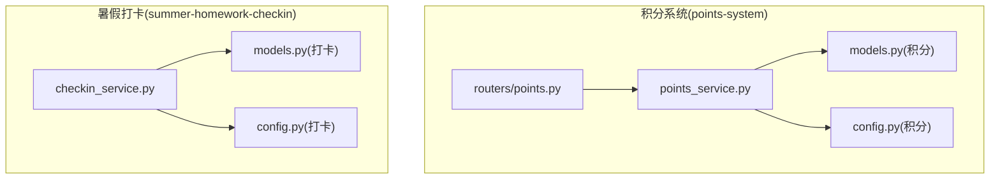
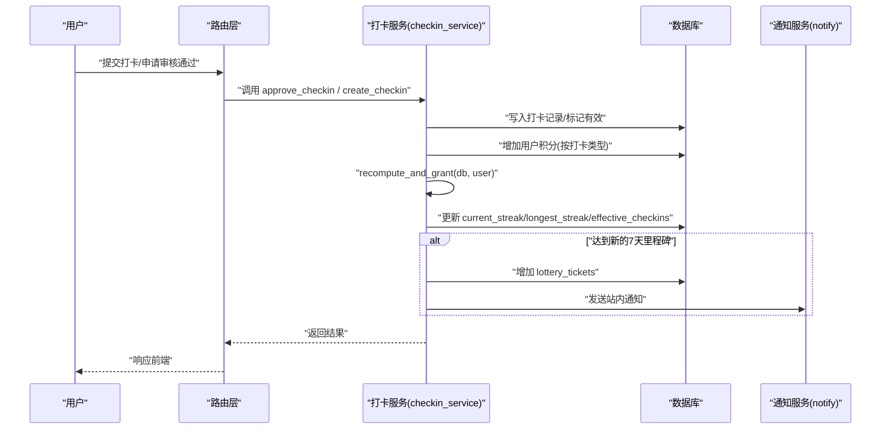
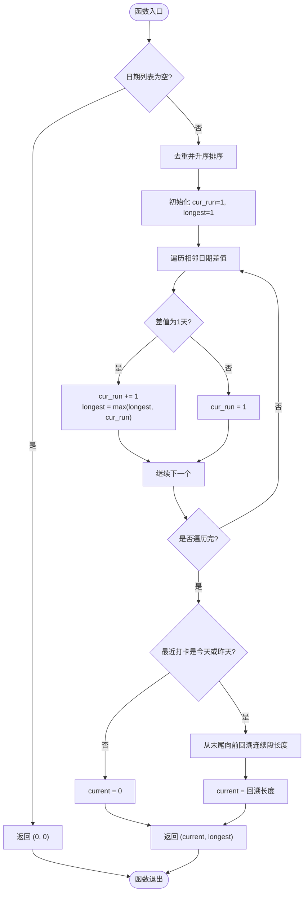
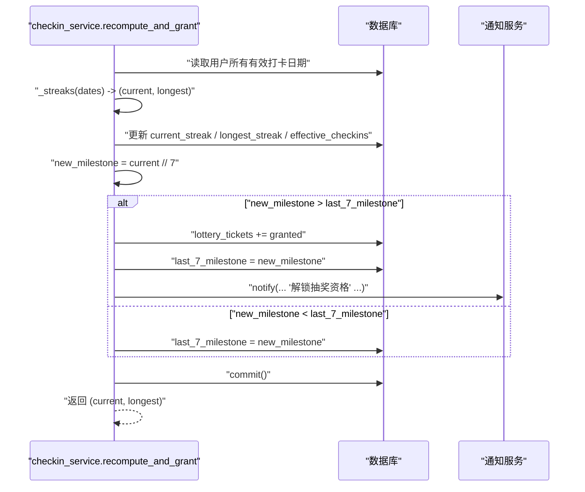
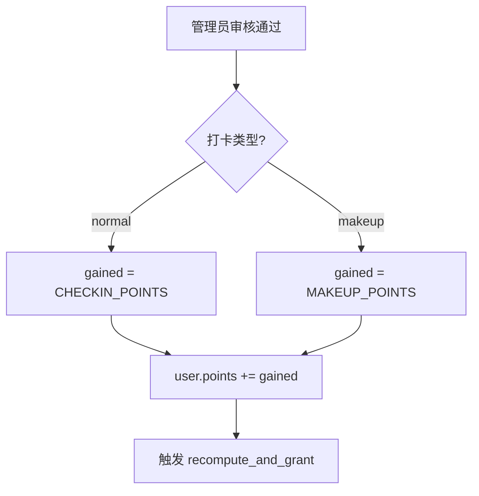
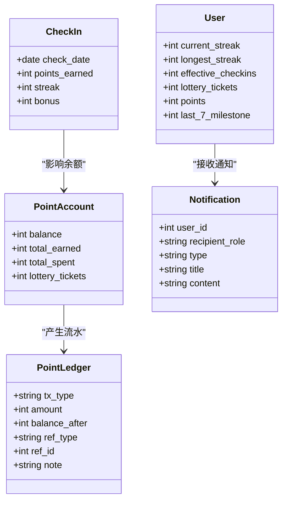
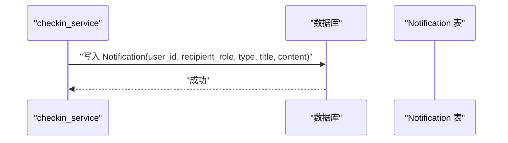
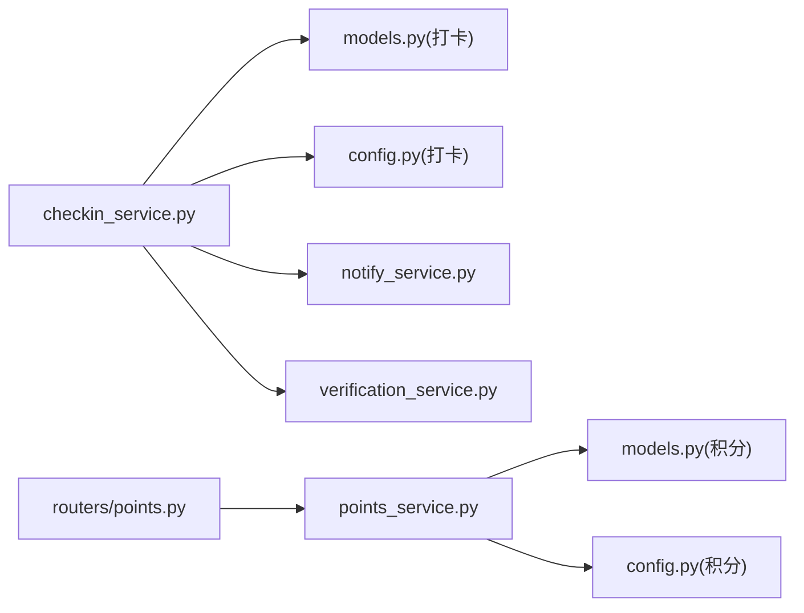

# 积分奖励系统

<cite>
**本文引用的文件**
- [points_service.py](file://points-system/backend/app/services/points_service.py)
- [models.py（积分系统）](file://points-system/backend/app/models.py)
- [config.py（积分系统）](file://points-system/backend/app/config.py)
- [points.py（路由）](file://points-system/backend/app/routers/points.py)
- [checkin_service.py（暑假打卡服务）](file://summer-homework-checkin/backend/app/services/checkin_service.py)
- [models.py（暑假打卡模型）](file://summer-homework-checkin/backend/app/models.py)
- [config.py（暑假打卡配置）](file://summer-homework-checkin/backend/app/config.py)
</cite>

## 目录
1. [简介](#简介)
2. [项目结构](#项目结构)
3. [核心组件](#核心组件)
4. [架构总览](#架构总览)
5. [详细组件分析](#详细组件分析)
6. [依赖关系分析](#依赖关系分析)
7. [性能考虑](#性能考虑)
8. [故障排查指南](#故障排查指南)
9. [结论](#结论)

## 简介
本业务文档聚焦“积分奖励系统”，围绕以下目标展开：
- 连续天数统计算法 streaks 的实现逻辑，包括当前连续天数与历史最长连续天数的计算方法。
- recompute_and_grant 函数的积分发放机制：7 天里程碑解锁规则、抽奖资格自动发放逻辑、积分累加计算。
- 不同打卡类型的积分规则（正常打卡 vs 补卡）。
- 积分账户的数据结构设计。
- 积分变更的通知机制。
- 积分统计的性能优化策略与数据一致性保证方案。

说明：仓库包含两套相关实现：
- points-system：独立的积分商城体系（含打卡得积分、兑换奖品、抽奖券等）。
- summer-homework-checkin：暑假作业打卡体系（含打卡审核、连续天数重算、按 7 天里程碑发放抽奖资格）。

为完整覆盖需求，本文同时引用两套代码中的关键实现。

## 项目结构
- points-system/backend/app
  - services/points_service.py：积分与兑换核心逻辑（打卡、积分流水、兑换）。
  - models.py：积分账户、流水、打卡记录、奖品、兑换、抽奖券等模型。
  - config.py：积分规则常量（基础积分、连续奖励、兑换比例等）。
  - routers/points.py：查询积分账户与流水的 API。
- summer-homework-checkin/backend/app
  - services/checkin_service.py：打卡创建、审核通过、连续天数重算与抽奖资格发放。
  - models.py：用户、打卡记录、通知等模型（含冗余统计字段）。
  - config.py：打卡与人脸识别、补卡上限、积分规则等配置。

图表来源
- [points_service.py:1-146](file://points-system/backend/app/services/points_service.py#L1-L146)
- [models.py（积分系统）:1-151](file://points-system/backend/app/models.py#L1-L151)
- [config.py（积分系统）:1-17](file://points-system/backend/app/config.py#L1-L17)
- [points.py（路由）:1-28](file://points-system/backend/app/routers/points.py#L1-L28)
- [checkin_service.py:1-254](file://summer-homework-checkin/backend/app/services/checkin_service.py#L1-L254)
- [models.py（暑假打卡模型）:1-212](file://summer-homework-checkin/backend/app/models.py#L1-L212)
- [config.py（暑假打卡配置）:1-50](file://summer-homework-checkin/backend/app/config.py#L1-L50)

章节来源
- [points_service.py:1-146](file://points-system/backend/app/services/points_service.py#L1-L146)
- [models.py（积分系统）:1-151](file://points-system/backend/app/models.py#L1-L151)
- [config.py（积分系统）:1-17](file://points-system/backend/app/config.py#L1-L17)
- [points.py（路由）:1-28](file://points-system/backend/app/routers/points.py#L1-L28)
- [checkin_service.py:1-254](file://summer-homework-checkin/backend/app/services/checkin_service.py#L1-L254)
- [models.py（暑假打卡模型）:1-212](file://summer-homework-checkin/backend/app/models.py#L1-L212)
- [config.py（暑假打卡配置）:1-50](file://summer-homework-checkin/backend/app/config.py#L1-L50)

## 核心组件
- 连续天数统计算法 _streaks
  - 输入：有效打卡日期集合。
  - 输出：(当前连续天数, 历史最长连续天数)。
  - 关键点：仅当最近一次打卡是今天或昨天时，才计算“当前连续”；否则为 0。
- 打卡与积分发放
  - points-system：do_checkin 在事务内完成打卡、积分账户余额更新、积分流水落库。
  - summer-homework-checkin：approve_checkin 在审核通过后根据打卡类型发放积分，并触发连续天数重算与抽奖资格发放。
- 连续天数重算与抽奖资格发放
  - recompute_and_grant：基于有效打卡日期重新计算 current_streak 与 longest_streak，并按 7 天里程碑增量发放抽奖资格，发送站内通知。
- 积分账户与流水
  - PointAccount：余额、累计获得、累计支出、抽奖券数量。
  - PointLedger：每笔积分变动明细，用于对账与审计。
- 通知机制
  - summer-homework-checkin：notify 写入 Notification 表，支持学生与家长双端接收。

章节来源
- [checkin_service.py:12-61](file://summer-homework-checkin/backend/app/services/checkin_service.py#L12-L61)
- [points_service.py:27-91](file://points-system/backend/app/services/points_service.py#L27-L91)
- [models.py（积分系统）:20-48](file://points-system/backend/app/models.py#L20-L48)
- [models.py（暑假打卡模型）:163-176](file://summer-homework-checkin/backend/app/models.py#L163-L176)

## 架构总览
下图展示了从打卡到积分发放、连续天数重算与抽奖资格发放的整体流程。

图表来源
- [checkin_service.py:166-191](file://summer-homework-checkin/backend/app/services/checkin_service.py#L166-L191)
- [checkin_service.py:39-61](file://summer-homework-checkin/backend/app/services/checkin_service.py#L39-L61)
- [models.py（暑假打卡模型）:163-176](file://summer-homework-checkin/backend/app/models.py#L163-L176)

## 详细组件分析

### 连续天数统计算法 _streaks
算法要点：
- 去重排序后线性扫描，维护当前连续长度 cur_run 与历史最长 longest。
- 若最近一次打卡不是今天或昨天，则当前连续为 0。
- 否则从末尾向前回溯，统计连续段长度作为 current。

复杂度：
- 时间 O(n log n)（排序），空间 O(n)（去重后的日期列表）。

图表来源
- [checkin_service.py:12-36](file://summer-homework-checkin/backend/app/services/checkin_service.py#L12-L36)

章节来源
- [checkin_service.py:12-36](file://summer-homework-checkin/backend/app/services/checkin_service.py#L12-L36)

### recompute_and_grant 函数：7 天里程碑与抽奖资格发放
职责：
- 基于有效打卡日期重新计算 current_streak 与 longest_streak。
- 更新 effective_checkins 计数。
- 按 7 天里程碑（current // 7）比较 last_7_milestone，差额即为本次应发放的抽奖次数。
- 发放后发送站内通知。

图表来源
- [checkin_service.py:39-61](file://summer-homework-checkin/backend/app/services/checkin_service.py#L39-L61)
- [models.py（暑假打卡模型）:35-41](file://summer-homework-checkin/backend/app/models.py#L35-L41)
- [models.py（暑假打卡模型）:163-176](file://summer-homework-checkin/backend/app/models.py#L163-L176)

章节来源
- [checkin_service.py:39-61](file://summer-homework-checkin/backend/app/services/checkin_service.py#L39-L61)
- [models.py（暑假打卡模型）:35-41](file://summer-homework-checkin/backend/app/models.py#L35-L41)

### 打卡类型与积分规则（正常打卡 vs 补卡）
- 正常打卡：CHECKIN_POINTS（默认 10）。
- 补卡：MAKEUP_POINTS（默认 5），低于正常打卡以鼓励当日完成。
- 审核通过后才计入有效打卡与积分。

图表来源
- [checkin_service.py:166-191](file://summer-homework-checkin/backend/app/services/checkin_service.py#L166-L191)
- [config.py（暑假打卡配置）:37-39](file://summer-homework-checkin/backend/app/config.py#L37-L39)

章节来源
- [checkin_service.py:166-191](file://summer-homework-checkin/backend/app/services/checkin_service.py#L166-L191)
- [config.py（暑假打卡配置）:37-39](file://summer-homework-checkin/backend/app/config.py#L37-L39)

### 积分账户数据结构设计
- 积分账户（points-system）
  - PointAccount：balance、total_earned、total_spent、lottery_tickets。
  - PointLedger：tx_type、amount、balance_after、ref_type、ref_id、note。
  - CheckIn：points_earned、streak、bonus。
- 用户统计（summer-homework-checkin）
  - User.current_streak、User.longest_streak、User.effective_checkins、User.lottery_tickets、User.points、User.last_7_milestone。

图表来源
- [models.py（积分系统）:20-48](file://points-system/backend/app/models.py#L20-L48)
- [models.py（暑假打卡模型）:35-41](file://summer-homework-checkin/backend/app/models.py#L35-L41)
- [models.py（暑假打卡模型）:163-176](file://summer-homework-checkin/backend/app/models.py#L163-L176)

章节来源
- [models.py（积分系统）:20-48](file://points-system/backend/app/models.py#L20-L48)
- [models.py（暑假打卡模型）:35-41](file://summer-homework-checkin/backend/app/models.py#L35-L41)
- [models.py（暑假打卡模型）:163-176](file://summer-homework-checkin/backend/app/models.py#L163-L176)

### 积分变更的通知机制
- 暑假打卡体系：recompute_and_grant 中调用 notify 写入 Notification 表，标题与内容包含解锁次数与提示语。
- 积分系统：提供 get_ledger 接口供前端拉取流水，便于展示与对账。

图表来源
- [checkin_service.py:52-56](file://summer-homework-checkin/backend/app/services/checkin_service.py#L52-L56)
- [models.py（暑假打卡模型）:163-176](file://summer-homework-checkin/backend/app/models.py#L163-L176)
- [points.py（路由）:18-27](file://points-system/backend/app/routers/points.py#L18-L27)

章节来源
- [checkin_service.py:52-56](file://summer-homework-checkin/backend/app/services/checkin_service.py#L52-L56)
- [models.py（暑假打卡模型）:163-176](file://summer-homework-checkin/backend/app/models.py#L163-L176)
- [points.py（路由）:18-27](file://points-system/backend/app/routers/points.py#L18-L27)

## 依赖关系分析
- 模块耦合
  - checkin_service 依赖 models、config、notify_service、verification_service。
  - points_service 依赖 models、config、FastAPI HTTPException。
- 外部依赖
  - SQLAlchemy ORM 与 SQLite（轻量部署）。
  - FastAPI 路由与异常处理。

图表来源
- [checkin_service.py:1-10](file://summer-homework-checkin/backend/app/services/checkin_service.py#L1-L10)
- [points_service.py:1-16](file://points-system/backend/app/services/points_service.py#L1-L16)
- [points.py（路由）:1-6](file://points-system/backend/app/routers/points.py#L1-L6)

章节来源
- [checkin_service.py:1-10](file://summer-homework-checkin/backend/app/services/checkin_service.py#L1-L10)
- [points_service.py:1-16](file://points-system/backend/app/services/points_service.py#L1-L16)
- [points.py（路由）:1-6](file://points-system/backend/app/routers/points.py#L1-L6)

## 性能考虑
- 连续天数计算
  - 使用去重+排序+单次扫描，避免嵌套循环；适合中等规模打卡量。
  - 可考虑缓存最近若干天的打卡日期，减少全量扫描。
- 事务与原子性
  - points-system 的 do_checkin 与 do_redeem 将读改写置于同一事务，确保余额与流水一致。
  - summer-homework-checkin 在审核通过与重算过程中多次 commit，建议在高并发场景下合并为单事务或使用行级锁（如 PostgreSQL with_for_update）。
- 索引与查询
  - CheckIn.check_date、PointLedger.created_at 已建索引，利于范围查询与分页。
  - 报表类查询可按月份/季度聚合，避免全表扫描。
- 批量重算
  - 对于历史数据修复，可分批处理用户，控制内存占用与锁持有时间。

[本节为通用性能建议，不直接分析具体文件]

## 故障排查指南
- 重复打卡冲突
  - points-system 使用唯一约束 (user_id, check_date) 兜底，捕获 IntegrityError 返回 409。
- 积分不足/库存不足
  - do_redeem 前置校验余额与库存，失败即抛出相应错误码。
- 打卡审核状态
  - approve_checkin 会检查 review_status，防止重复审核通过。
- 通知未送达
  - 检查 notify 调用参数与 Notification 表写入情况，确认 recipient_role 与 type 是否正确。

章节来源
- [points_service.py:77-82](file://points-system/backend/app/services/points_service.py#L77-L82)
- [points_service.py:94-116](file://points-system/backend/app/services/points_service.py#L94-L116)
- [checkin_service.py:166-170](file://summer-homework-checkin/backend/app/services/checkin_service.py#L166-L170)

## 结论
- 连续天数统计算法简洁高效，兼顾当前与历史最长连续。
- recompute_and_grant 实现了按 7 天里程碑自动发放抽奖资格与通知，形成闭环激励。
- 打卡类型差异化积分规则清晰，鼓励当日完成。
- 积分账户与流水设计完善，具备对账能力。
- 建议在更高并发场景下引入行级锁与事务合并，进一步提升一致性与吞吐。