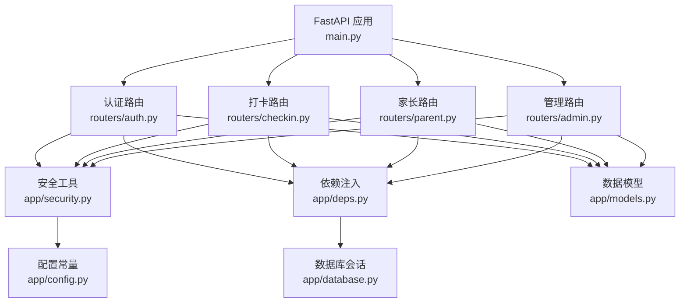
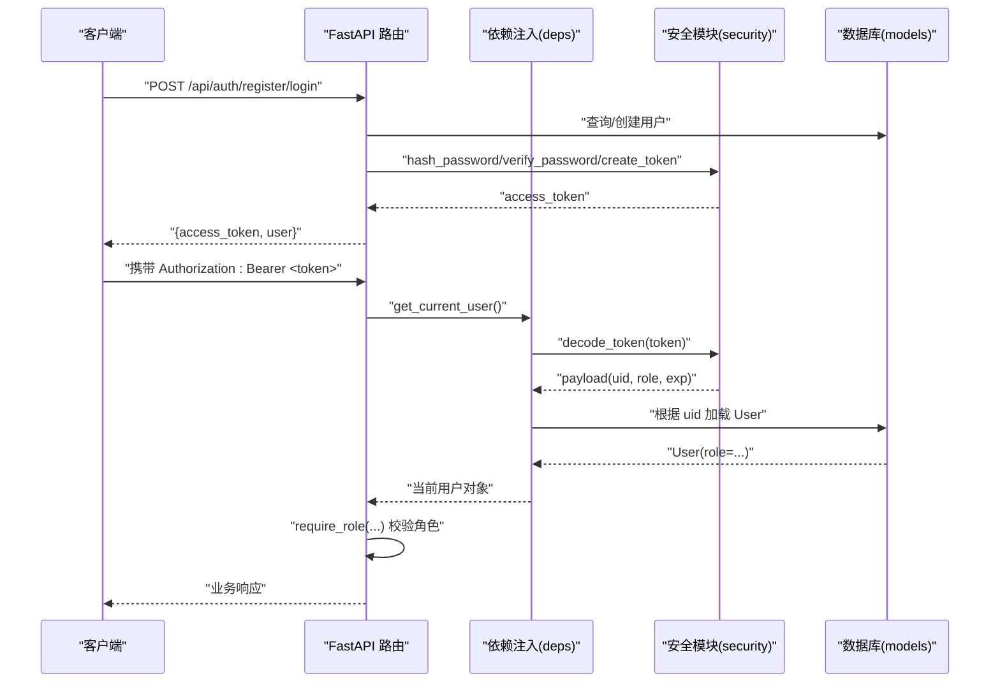
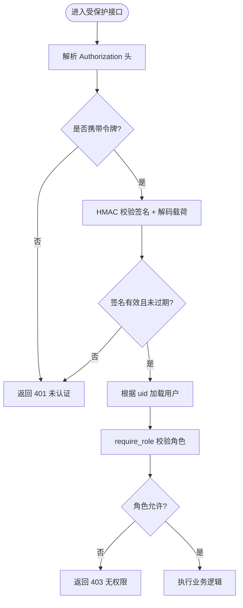
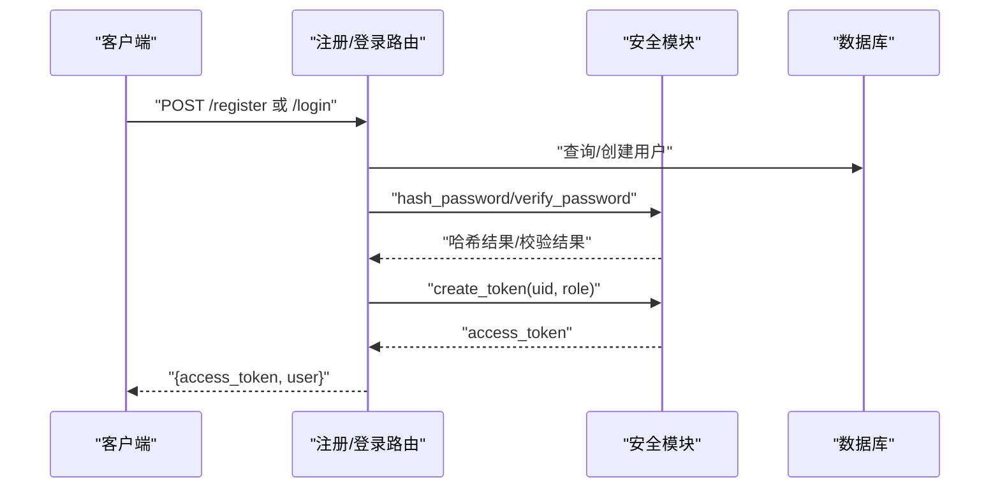
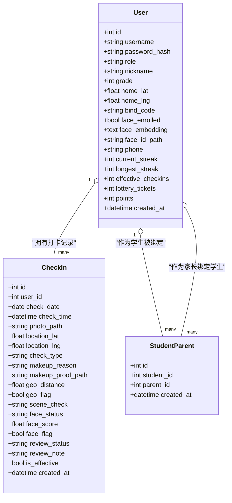
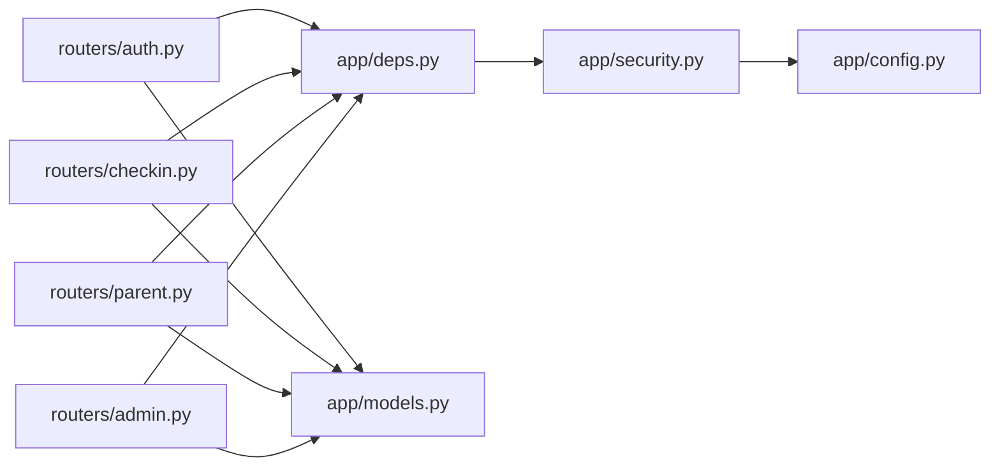

# 用户角色与权限

<cite>
**本文引用的文件**   
- [main.py](file://summer-homework-checkin/backend/app/main.py)
- [security.py](file://summer-homework-checkin/backend/app/security.py)
- [deps.py](file://summer-homework-checkin/backend/app/deps.py)
- [models.py](file://summer-homework-checkin/backend/app/models.py)
- [schemas.py](file://summer-homework-checkin/backend/app/schemas.py)
- [config.py](file://summer-homework-checkin/backend/app/config.py)
- [auth.py](file://summer-homework-checkin/backend/app/routers/auth.py)
- [checkin.py](file://summer-homework-checkin/backend/app/routers/checkin.py)
- [parent.py](file://summer-homework-checkin/backend/app/routers/parent.py)
- [admin.py](file://summer-homework-checkin/backend/app/routers/admin.py)
</cite>

## 目录
1. [简介](#简介)
2. [项目结构](#项目结构)
3. [核心组件](#核心组件)
4. [架构总览](#架构总览)
5. [详细组件分析](#详细组件分析)
6. [依赖关系分析](#依赖关系分析)
7. [性能与安全考量](#性能与安全考量)
8. [故障排查指南](#故障排查指南)
9. [结论](#结论)

## 简介
本文件面向“暑假作业打卡系统”的用户角色与权限控制，聚焦以下目标：
- 明确学生、家长、管理员三类角色的职责与权限边界
- 说明基于 JWT 的无状态认证机制、密码哈希存储与会话管理策略
- 阐述基于角色的访问控制（RBAC）在接口级别的实现方式
- 给出数据隔离策略与最佳实践建议
- 提供注册登录流程、权限校验中间件与常见问题的排障指引

## 项目结构
后端采用 FastAPI 分层组织：路由层按业务域拆分（认证、打卡、家长端、管理端等），安全能力集中在 security 与 deps 模块，模型与配置位于 models 与 config。

图表来源
- [main.py:1-49](file://summer-homework-checkin/backend/app/main.py#L1-L49)
- [auth.py:1-52](file://summer-homework-checkin/backend/app/routers/auth.py#L1-L52)
- [checkin.py:1-80](file://summer-homework-checkin/backend/app/routers/checkin.py#L1-L80)
- [parent.py:1-237](file://summer-homework-checkin/backend/app/routers/parent.py#L1-L237)
- [admin.py:1-214](file://summer-homework-checkin/backend/app/routers/admin.py#L1-L214)
- [security.py:1-47](file://summer-homework-checkin/backend/app/security.py#L1-L47)
- [deps.py:1-34](file://summer-homework-checkin/backend/app/deps.py#L1-L34)
- [models.py:1-212](file://summer-homework-checkin/backend/app/models.py#L1-L212)
- [config.py:1-50](file://summer-homework-checkin/backend/app/config.py#L1-L50)

章节来源
- [main.py:1-49](file://summer-homework-checkin/backend/app/main.py#L1-L49)

## 核心组件
- 统一用户模型与角色字段：User.role 用于区分 student、parent、admin
- 安全模块：密码哈希、令牌签发与校验
- 依赖注入：从请求头解析并校验令牌，返回当前用户；按角色进行授权检查
- 路由层：各业务路由通过依赖注入获取当前用户并进行 RBAC 校验

章节来源
- [models.py:11-55](file://summer-homework-checkin/backend/app/models.py#L11-L55)
- [security.py:10-47](file://summer-homework-checkin/backend/app/security.py#L10-L47)
- [deps.py:13-34](file://summer-homework-checkin/backend/app/deps.py#L13-L34)

## 架构总览
下图展示认证与授权在请求处理中的位置与交互。

图表来源
- [auth.py:13-52](file://summer-homework-checkin/backend/app/routers/auth.py#L13-L52)
- [deps.py:13-34](file://summer-homework-checkin/backend/app/deps.py#L13-L34)
- [security.py:20-47](file://summer-homework-checkin/backend/app/security.py#L20-L47)
- [models.py:11-55](file://summer-homework-checkin/backend/app/models.py#L11-L55)

## 详细组件分析

### 角色与权限设计（RBAC）
- 角色定义
  - student：学生本人使用，可提交打卡、查看个人记录、参与抽奖与兑换
  - parent：家长绑定孩子后，可代孩子打卡、查看孩子统计与报告、代操作兑换与抽奖
  - admin：后台管理，审核打卡与兑换、查看全局统计、管理奖品与任务
- 权限校验
  - 所有受保护接口均通过 get_current_user 解析令牌并加载用户
  - 通过 require_role("student"/"parent"/"admin") 进行角色白名单校验
  - 家长对子账号的操作需额外校验绑定关系，确保数据隔离
- 典型接口与角色要求
  - 学生端打卡：仅 student
  - 家长端绑定与代打卡：仅 parent，且需绑定关系
  - 管理端审核与统计：仅 admin

章节来源
- [deps.py:28-34](file://summer-homework-checkin/backend/app/deps.py#L28-L34)
- [checkin.py:29-31](file://summer-homework-checkin/backend/app/routers/checkin.py#L29-L31)
- [parent.py:21-32](file://summer-homework-checkin/backend/app/routers/parent.py#L21-L32)
- [admin.py:16-35](file://summer-homework-checkin/backend/app/routers/admin.py#L16-L35)

### 认证机制（JWT 风格令牌）
- 令牌结构
  - 载荷包含用户标识、角色与过期时间
  - 签名基于 HMAC-SHA256，密钥来自配置
- 签发与校验
  - 注册/登录后签发令牌
  - 后续请求需在 Authorization 头携带 Bearer token
  - 依赖注入中解码并校验签名与过期时间，再加载用户
- 会话管理
  - 无状态设计：服务端不保存会话，仅校验签名与过期时间
  - 令牌有效期由配置控制

图表来源
- [deps.py:13-26](file://summer-homework-checkin/backend/app/deps.py#L13-L26)
- [security.py:20-47](file://summer-homework-checkin/backend/app/security.py#L20-L47)

章节来源
- [security.py:10-47](file://summer-homework-checkin/backend/app/security.py#L10-L47)
- [deps.py:13-34](file://summer-homework-checkin/backend/app/deps.py#L13-L34)
- [config.py:19-21](file://summer-homework-checkin/backend/app/config.py#L19-L21)

### 密码哈希存储
- 算法：PBKDF2-HMAC-SHA256，固定盐（演示用），迭代次数较高以提升安全性
- 验证：侧信道安全的比较函数避免时序攻击
- 注意：生产环境应使用随机盐与唯一化存储

章节来源
- [security.py:10-18](file://summer-homework-checkin/backend/app/security.py#L10-L18)

### 注册与登录流程
- 注册
  - 校验角色仅支持 student/parent
  - 用户名唯一性检查
  - 密码哈希后入库
  - 学生生成绑定码，便于家长绑定
  - 签发令牌并返回用户信息
- 登录
  - 按用户名查找用户
  - 校验密码哈希
  - 签发令牌并返回用户信息

图表来源
- [auth.py:13-52](file://summer-homework-checkin/backend/app/routers/auth.py#L13-L52)
- [security.py:20-47](file://summer-homework-checkin/backend/app/security.py#L20-L47)

章节来源
- [auth.py:13-52](file://summer-homework-checkin/backend/app/routers/auth.py#L13-L52)

### 数据隔离策略
- 学生端
  - 仅能访问自身数据（打卡历史、今日状态、连续天数等）
- 家长端
  - 先校验绑定关系，再代理操作对应学生数据
  - 绑定关系表维护多对多关联，限制跨家庭访问
- 管理端
  - 具备全局视角，但需严格限制为 admin 角色
  - 审核操作会更新记录状态并回写积分等

章节来源
- [models.py:57-68](file://summer-homework-checkin/backend/app/models.py#L57-L68)
- [parent.py:54-64](file://summer-homework-checkin/backend/app/routers/parent.py#L54-L64)
- [admin.py:84-103](file://summer-homework-checkin/backend/app/routers/admin.py#L84-L103)

### 接口级权限校验示例
- 学生打卡接口：仅 student
- 家长绑定/代打卡：仅 parent，且需绑定校验
- 管理端审核/统计：仅 admin

章节来源
- [checkin.py:29-31](file://summer-homework-checkin/backend/app/routers/checkin.py#L29-L31)
- [parent.py:21-32](file://summer-homework-checkin/backend/app/routers/parent.py#L21-L32)
- [admin.py:16-35](file://summer-homework-checkin/backend/app/routers/admin.py#L16-L35)

### 类图（关键实体与关系）

图表来源
- [models.py:11-96](file://summer-homework-checkin/backend/app/models.py#L11-L96)

## 依赖关系分析
- 路由层依赖依赖注入层完成认证与授权
- 依赖注入层依赖安全模块完成令牌解码与用户加载
- 安全模块依赖配置模块获取密钥与过期时间
- 路由层依赖模型层进行数据读写

图表来源
- [auth.py:1-52](file://summer-homework-checkin/backend/app/routers/auth.py#L1-L52)
- [checkin.py:1-80](file://summer-homework-checkin/backend/app/routers/checkin.py#L1-L80)
- [parent.py:1-237](file://summer-homework-checkin/backend/app/routers/parent.py#L1-L237)
- [admin.py:1-214](file://summer-homework-checkin/backend/app/routers/admin.py#L1-L214)
- [deps.py:1-34](file://summer-homework-checkin/backend/app/deps.py#L1-L34)
- [security.py:1-47](file://summer-homework-checkin/backend/app/security.py#L1-L47)
- [config.py:1-50](file://summer-homework-checkin/backend/app/config.py#L1-L50)
- [models.py:1-212](file://summer-homework-checkin/backend/app/models.py#L1-L212)

## 性能与安全考量
- 令牌校验开销低：无状态、纯 CPU 计算，适合高并发
- 密码哈希强度：PBKDF2 迭代次数较高，兼顾安全与性能
- 数据隔离：家长端通过绑定关系强制隔离，避免越权访问
- 风险标记：打卡时地理与人脸风险标记辅助审核，降低代打卡风险
- 静态资源与上传：上传目录独立挂载，注意访问控制与大小限制

章节来源
- [config.py:27-50](file://summer-homework-checkin/backend/app/config.py#L27-L50)
- [parent.py:54-64](file://summer-homework-checkin/backend/app/routers/parent.py#L54-L64)

## 故障排查指南
- 401 未认证
  - 检查 Authorization 头是否携带 Bearer token
  - 确认 token 未被篡改且未过期
- 403 无权限
  - 检查当前用户角色是否符合接口要求
  - 家长端操作前是否已完成绑定校验
- 400 参数错误
  - 注册时角色仅支持 student/parent
  - 绑定码或孩子账号不正确
- 404 资源不存在
  - 打卡/兑换记录 ID 无效
  - 用户或奖品不存在

章节来源
- [deps.py:17-25](file://summer-homework-checkin/backend/app/deps.py#L17-L25)
- [auth.py:14-18](file://summer-homework-checkin/backend/app/routers/auth.py#L14-L18)
- [parent.py:24-26](file://summer-homework-checkin/backend/app/routers/parent.py#L24-L26)
- [admin.py:92-96](file://summer-homework-checkin/backend/app/routers/admin.py#L92-L96)

## 结论
本系统通过统一的 User.role 字段与依赖注入实现的 RBAC，结合无状态 JWT 风格令牌与 PBKDF2 密码哈希，构建了清晰的角色权限边界与数据安全隔离。家长端通过绑定关系实现对子账号的受限代理操作，管理端则集中负责审核与全局统计。建议在后续迭代中引入随机盐与更严格的密钥管理，并完善前端鉴权提示与错误码规范，以进一步提升用户体验与安全性。