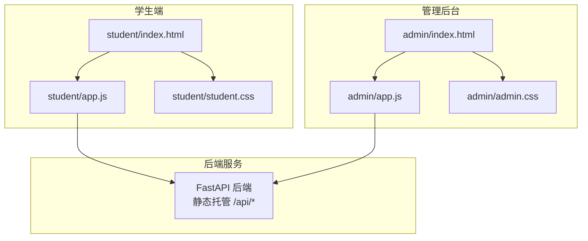
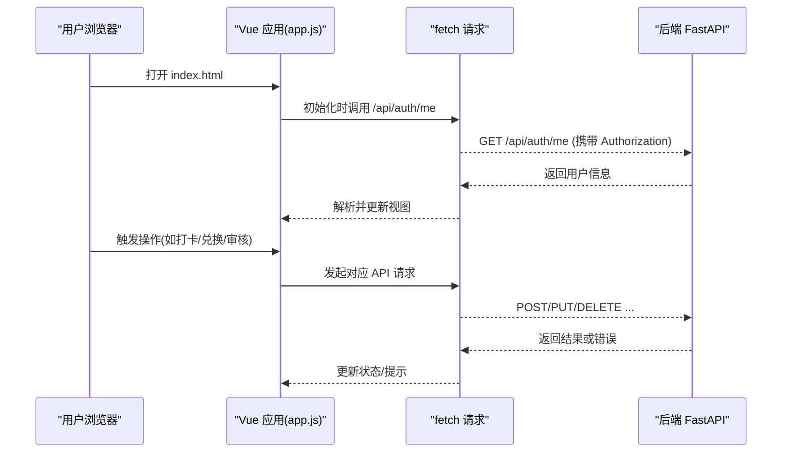
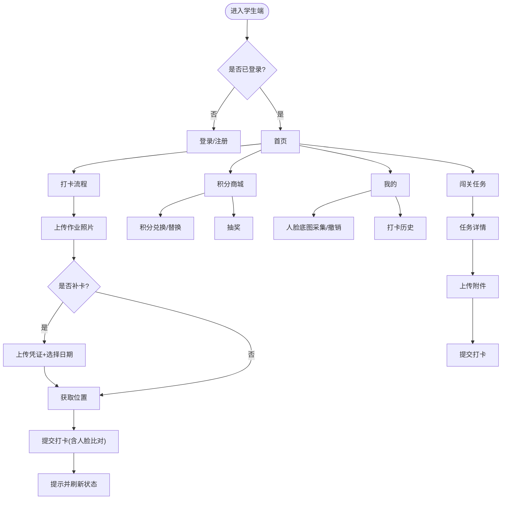
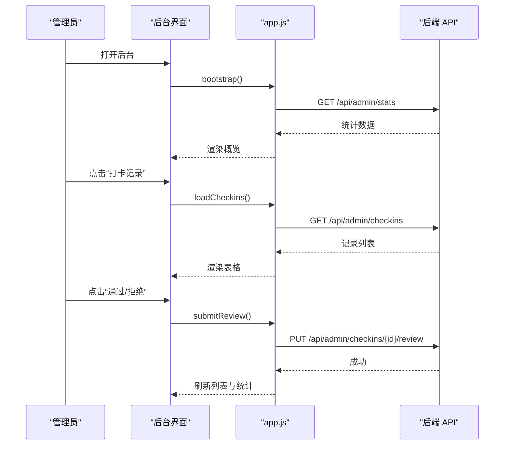
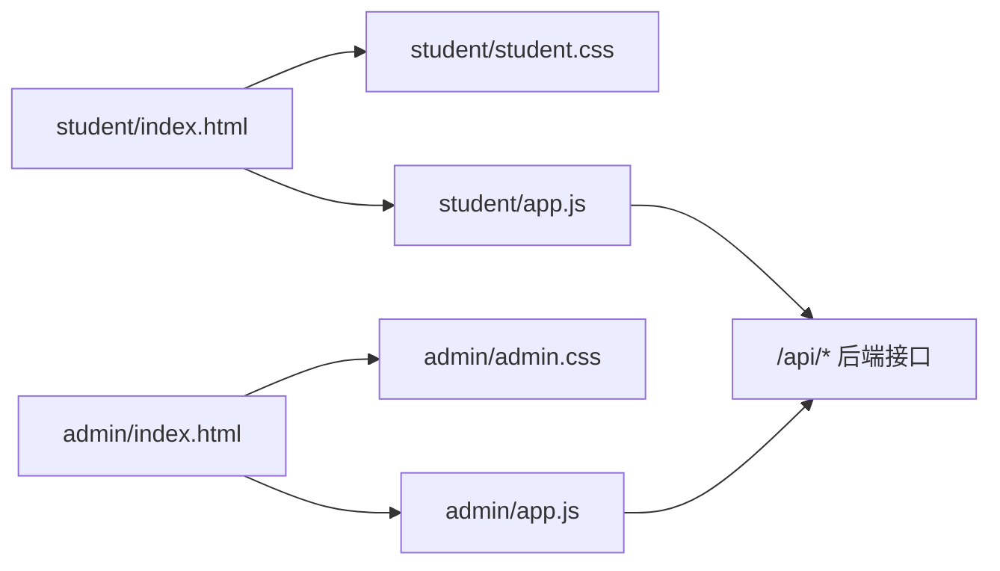

# 前端架构设计

<cite>
**本文引用的文件列表**
- [summer-homework-checkin/frontend/student/index.html](file://summer-homework-checkin/frontend/student/index.html)
- [summer-homework-checkin/frontend/student/app.js](file://summer-homework-checkin/frontend/student/app.js)
- [summer-homework-checkin/frontend/student/student.css](file://summer-homework-checkin/frontend/student/student.css)
- [summer-homework-checkin/frontend/admin/index.html](file://summer-homework-checkin/frontend/admin/index.html)
- [summer-homework-checkin/frontend/admin/app.js](file://summer-homework-checkin/frontend/admin/app.js)
- [summer-homework-checkin/frontend/admin/admin.css](file://summer-homework-checkin/frontend/admin/admin.css)
- [summer-homework-checkin/README.md](file://summer-homework-checkin/README.md)
</cite>

## 目录
1. [简介](#简介)
2. [项目结构](#项目结构)
3. [核心组件](#核心组件)
4. [架构总览](#架构总览)
5. [详细组件分析](#详细组件分析)
6. [依赖关系分析](#依赖关系分析)
7. [性能与体验优化建议](#性能与体验优化建议)
8. [故障排查指南](#故障排查指南)
9. [结论](#结论)
10. [附录：API 集成层与路由约定](#附录api-集成层与路由约定)

## 简介
本技术文档聚焦于“暑假作业打卡系统”的前端架构，围绕基于 Vue.js 3 的单页应用（SPA）实现，涵盖学生端 H5 与管理后台双端分离的设计。重点说明：
- 组件化开发模式与页面组织方式
- 状态管理方案（轻量级、无第三方库）
- API 集成层设计与鉴权策略
- 静态资源组织与样式体系
- 用户交互流程与导航模型
- 面向单页应用的工程实践与可维护性建议

## 项目结构
前端采用“免构建 + CDN 引入 Vue 3”的极简 SPA 形态，按角色拆分为两个独立入口：
- 学生端：移动端优先，底部 Tab 导航，H5 适配手机/平板
- 管理后台：桌面端优先，侧边栏导航，支持图片查看器与审核工作流

图表来源
- [summer-homework-checkin/frontend/student/index.html:1-349](file://summer-homework-checkin/frontend/student/index.html#L1-L349)
- [summer-homework-checkin/frontend/student/app.js:1-403](file://summer-homework-checkin/frontend/student/app.js#L1-L403)
- [summer-homework-checkin/frontend/student/student.css:1-202](file://summer-homework-checkin/frontend/student/student.css#L1-L202)
- [summer-homework-checkin/frontend/admin/index.html:1-533](file://summer-homework-checkin/frontend/admin/index.html#L1-L533)
- [summer-homework-checkin/frontend/admin/app.js:1-641](file://summer-homework-checkin/frontend/admin/app.js#L1-L641)
- [summer-homework-checkin/frontend/admin/admin.css:1-335](file://summer-homework-checkin/frontend/admin/admin.css#L1-L335)

章节来源
- [summer-homework-checkin/README.md:26-49](file://summer-homework-checkin/README.md#L26-L49)

## 核心组件
- 学生端应用
  - 入口模板：包含登录/注册、首页、打卡、积分商城、我的、闯关任务等视图片段，通过 v-if 控制显示
  - 应用逻辑：统一封装 api 方法处理鉴权与错误；提供数据加载、表单提交、文件上传、定位获取、抽奖与兑换等能力
  - 样式：移动端友好的卡片式布局、底部 Tab 导航、弹窗与 Toast 提示
- 管理后台应用
  - 入口模板：左侧菜单 + 主内容区，包含概览、奖品管理、用户管理、打卡记录审核、兑换记录审核、闯关任务管理等模块
  - 应用逻辑：统一的 admin api 封装；内置图片查看器（缩放、旋转、翻页、上传），以及审核工作流
  - 样式：桌面端表格为主，响应式适配移动端卡片展示

章节来源
- [summer-homework-checkin/frontend/student/index.html:1-349](file://summer-homework-checkin/frontend/student/index.html#L1-L349)
- [summer-homework-checkin/frontend/student/app.js:1-403](file://summer-homework-checkin/frontend/student/app.js#L1-L403)
- [summer-homework-checkin/frontend/student/student.css:1-202](file://summer-homework-checkin/frontend/student/student.css#L1-L202)
- [summer-homework-checkin/frontend/admin/index.html:1-533](file://summer-homework-checkin/frontend/admin/index.html#L1-L533)
- [summer-homework-checkin/frontend/admin/app.js:1-641](file://summer-homework-checkin/frontend/admin/app.js#L1-L641)
- [summer-homework-checkin/frontend/admin/admin.css:1-335](file://summer-homework-checkin/frontend/admin/admin.css#L1-L335)

## 架构总览
整体为前后端分离的 SPA 架构，浏览器直接访问 HTML，通过 CDN 引入 Vue 3 运行时，所有业务逻辑在 app.js 中实现。学生端与管理后台各自独立运行，共享同一套后端 API。

图表来源
- [summer-homework-checkin/frontend/student/app.js:58-66](file://summer-homework-checkin/frontend/student/app.js#L58-L66)
- [summer-homework-checkin/frontend/admin/app.js:56-64](file://summer-homework-checkin/frontend/admin/app.js#L56-L64)

## 详细组件分析

### 学生端应用（H5）
- 视图组织
  - 登录/注册：支持学生与家长两种角色选择，登录后根据角色进入不同流程
  - 首页：展示连续打卡、累计次数、积分、解锁抽奖进度，快捷入口跳转至商城、报告、我的
  - 打卡：三步流程（上传照片 → 可选补卡 → 获取位置并提交），家长可代孩子打卡
  - 积分商城：展示可用积分与奖品列表，支持积分兑换与替换，同时支持抽奖
  - 我的：人脸底图采集/撤销、账号信息、打卡历史、学习报告下载
  - 闯关任务：任务列表、详情弹窗、附件上传与提交、审核状态展示
- 状态管理
  - 使用 Vue 3 data/computed 集中管理 token、用户信息、打卡状态、商城数据、历史记录、人脸状态、闯关任务等
  - 通过 computed 派生当前主体（学生本人或家长选中的孩子）
- API 集成层
  - 统一 api(path, opts) 封装：自动注入 Authorization 头、处理 401 退出登录、统一错误提示
  - 文件上传：使用 FormData 提交照片与凭证，支持 FileReader 预览
  - 定位：navigator.geolocation 获取经纬度，失败不影响提交但会标记风险
- 用户交互
  - 底部 Tab 切换视图，局部刷新数据
  - 弹窗用于任务详情、替换奖品等操作
  - Toast 提示反馈操作结果

图表来源
- [summer-homework-checkin/frontend/student/index.html:98-133](file://summer-homework-checkin/frontend/student/index.html#L98-L133)
- [summer-homework-checkin/frontend/student/app.js:211-241](file://summer-homework-checkin/frontend/student/app.js#L211-L241)
- [summer-homework-checkin/frontend/student/app.js:244-302](file://summer-homework-checkin/frontend/student/app.js#L244-L302)
- [summer-homework-checkin/frontend/student/app.js:305-317](file://summer-homework-checkin/frontend/student/app.js#L305-L317)
- [summer-homework-checkin/frontend/student/app.js:337-400](file://summer-homework-checkin/frontend/student/app.js#L337-L400)

章节来源
- [summer-homework-checkin/frontend/student/index.html:1-349](file://summer-homework-checkin/frontend/student/index.html#L1-L349)
- [summer-homework-checkin/frontend/student/app.js:1-403](file://summer-homework-checkin/frontend/student/app.js#L1-L403)
- [summer-homework-checkin/frontend/student/student.css:1-202](file://summer-homework-checkin/frontend/student/student.css#L1-L202)

### 管理后台应用（桌面端）
- 视图组织
  - 登录：管理员专用，校验角色
  - 数据概览：统计学生数、家长数、有效打卡、绑定关系、位置异常打卡等
  - 奖品管理：新增/编辑/删除，支持上架下架、概率库存、积分兑换价、抽奖券类型
  - 用户管理：展示用户基础信息与连续打卡、积分、抽奖券等
  - 打卡记录：待审核/全部筛选，查看照片，通过/拒绝审核
  - 兑换记录：待核实/已兑现/已拒绝筛选，兑现/拒绝审核
  - 闯关任务：新增/编辑/开放/删除任务，查看任务打卡记录与审核
- 图片查看器
  - 支持多图浏览、缩放、旋转、键盘与触摸滑动、上传新图并追加到当前组
  - 从打卡记录中提取同用户照片作为多图列表，定位到当前行图片
- 审核工作流
  - 打卡与兑换均支持备注与时间戳，状态变更即时刷新列表与统计

图表来源
- [summer-homework-checkin/frontend/admin/app.js:82-88](file://summer-homework-checkin/frontend/admin/app.js#L82-L88)
- [summer-homework-checkin/frontend/admin/app.js:95-105](file://summer-homework-checkin/frontend/admin/app.js#L95-L105)
- [summer-homework-checkin/frontend/admin/app.js:169-187](file://summer-homework-checkin/frontend/admin/app.js#L169-L187)

章节来源
- [summer-homework-checkin/frontend/admin/index.html:1-533](file://summer-homework-checkin/frontend/admin/index.html#L1-L533)
- [summer-homework-checkin/frontend/admin/app.js:1-641](file://summer-homework-checkin/frontend/admin/app.js#L1-L641)
- [summer-homework-checkin/frontend/admin/admin.css:1-335](file://summer-homework-checkin/frontend/admin/admin.css#L1-L335)

## 依赖关系分析
- 运行时依赖
  - Vue 3 通过 CDN 引入，无需构建工具
- 内部依赖
  - 学生端：index.html 引入 student.css 与 app.js
  - 管理后台：index.html 引入 admin.css 与 app.js
- 外部依赖
  - 后端 API：/api/* 系列接口，包括认证、打卡、人脸、抽奖、兑换、报表、管理后台等
  - 浏览器 API：FileReader、Geolocation、localStorage

图表来源
- [summer-homework-checkin/frontend/student/index.html:1-349](file://summer-homework-checkin/frontend/student/index.html#L1-L349)
- [summer-homework-checkin/frontend/admin/index.html:1-533](file://summer-homework-checkin/frontend/admin/index.html#L1-L533)

章节来源
- [summer-homework-checkin/frontend/student/index.html:1-349](file://summer-homework-checkin/frontend/student/index.html#L1-L349)
- [summer-homework-checkin/frontend/admin/index.html:1-533](file://summer-homework-checkin/frontend/admin/index.html#L1-L533)

## 性能与体验优化建议
- 网络与缓存
  - 对频繁读取的数据（如奖品列表、任务列表）增加本地缓存与失效策略，减少重复请求
  - 图片资源启用服务端压缩与 CDN 加速，避免大图直传导致卡顿
- 渲染与内存
  - 长列表使用虚拟滚动或分页加载，避免一次性渲染过多 DOM
  - 图片查看器在切换图片时重置 transform，避免累积变换导致的重排
- 用户体验
  - 统一错误码映射与友好提示，避免直接抛出原始错误消息
  - 弱网环境下提供重试机制与离线提示
- 安全与合规
  - 严格校验上传文件格式与大小，防止恶意文件
  - 人脸比对阈值与策略由后端配置，前端仅做必要提示

[本节为通用指导，不直接分析具体文件]

## 故障排查指南
- 登录失效
  - 现象：401 后自动退出登录
  - 排查：检查 localStorage 中的 token 是否正确注入 Authorization 头
  - 参考路径
    - [summer-homework-checkin/frontend/student/app.js:58-66](file://summer-homework-checkin/frontend/student/app.js#L58-L66)
    - [summer-homework-checkin/frontend/admin/app.js:56-64](file://summer-homework-checkin/frontend/admin/app.js#L56-L64)
- 定位失败
  - 现象：无法获取经纬度，仍可提交但可能标记风险
  - 排查：确认浏览器权限与 HTTPS 环境
  - 参考路径
    - [summer-homework-checkin/frontend/student/app.js:204-210](file://summer-homework-checkin/frontend/student/app.js#L204-L210)
- 图片查看器异常
  - 现象：图片加载失败或无法翻页
  - 排查：检查 fixUrl 相对路径补全逻辑与 normalizeImg 标准化
  - 参考路径
    - [summer-homework-checkin/frontend/admin/app.js:615-633](file://summer-homework-checkin/frontend/admin/app.js#L615-L633)
- 审核操作失败
  - 现象：通过/拒绝后未刷新或报错
  - 排查：检查请求体字段与后端期望一致，确认状态码与错误消息处理
  - 参考路径
    - [summer-homework-checkin/frontend/admin/app.js:169-187](file://summer-homework-checkin/frontend/admin/app.js#L169-L187)
    - [summer-homework-checkin/frontend/admin/app.js:120-136](file://summer-homework-checkin/frontend/admin/app.js#L120-L136)

章节来源
- [summer-homework-checkin/frontend/student/app.js:58-66](file://summer-homework-checkin/frontend/student/app.js#L58-L66)
- [summer-homework-checkin/frontend/admin/app.js:56-64](file://summer-homework-checkin/frontend/admin/app.js#L56-L64)
- [summer-homework-checkin/frontend/student/app.js:204-210](file://summer-homework-checkin/frontend/student/app.js#L204-L210)
- [summer-homework-checkin/frontend/admin/app.js:615-633](file://summer-homework-checkin/frontend/admin/app.js#L615-L633)
- [summer-homework-checkin/frontend/admin/app.js:169-187](file://summer-homework-checkin/frontend/admin/app.js#L169-L187)
- [summer-homework-checkin/frontend/admin/app.js:120-136](file://summer-homework-checkin/frontend/admin/app.js#L120-L136)

## 结论
该前端架构以“免构建 + CDN”的方式快速落地，学生端与管理后台双端分离，职责清晰、耦合度低。通过统一的 API 集成层与轻量状态管理，实现了稳定的用户交互与审核工作流。后续可在缓存、虚拟化、错误处理与监控方面进一步演进，以提升性能与可维护性。

[本节为总结，不直接分析具体文件]

## 附录：API 集成层与路由约定
- 学生端主要 API
  - 认证：/api/auth/login、/api/auth/register、/api/auth/me
  - 打卡：/api/checkin、/api/checkin/streak、/api/checkin/today、/api/checkin/history
  - 人脸：/api/face/enroll、/api/face/status
  - 家长：/api/parent/bind、/api/parent/children、/api/parent/checkin、/api/parent/mall/{child_id}、/api/parent/redeem?child_id=...、/api/parent/lottery/{child_id}/draw、/api/parent/child-report/{id}/html
  - 商城与抽奖：/api/mall、/api/redeem、/api/redeem/{id}/replace、/api/lottery/draw
  - 闯关任务：/api/challenge/tasks、/api/challenge/my-checkins、/api/challenge/upload、/api/challenge/tasks/{id}/checkin-with-content
  - 报表：/api/report/me/html
- 管理后台主要 API
  - 概览：/api/admin/stats
  - 奖品：/api/admin/prizes、/api/admin/prizes/{id}
  - 用户：/api/admin/users
  - 打卡审核：/api/admin/checkins、/api/admin/checkins/pending-count、/api/admin/checkins/{id}/review
  - 兑换审核：/api/admin/redemptions、/api/admin/redemptions/{id}/review
  - 闯关任务：/api/challenge/admin/tasks、/api/challenge/admin/tasks/{id}、/api/challenge/admin/tasks/{id}/unlock、/api/challenge/admin/checkins?task_id=...&status=...、/api/challenge/admin/checkins/{id}/review
- 鉴权与错误处理
  - 统一在 api 方法中注入 Authorization 头，401 自动退出登录
  - 非 2xx 响应统一抛错，前端捕获并提示

章节来源
- [summer-homework-checkin/README.md:81-94](file://summer-homework-checkin/README.md#L81-L94)
- [summer-homework-checkin/frontend/student/app.js:58-66](file://summer-homework-checkin/frontend/student/app.js#L58-L66)
- [summer-homework-checkin/frontend/admin/app.js:56-64](file://summer-homework-checkin/frontend/admin/app.js#L56-L64)