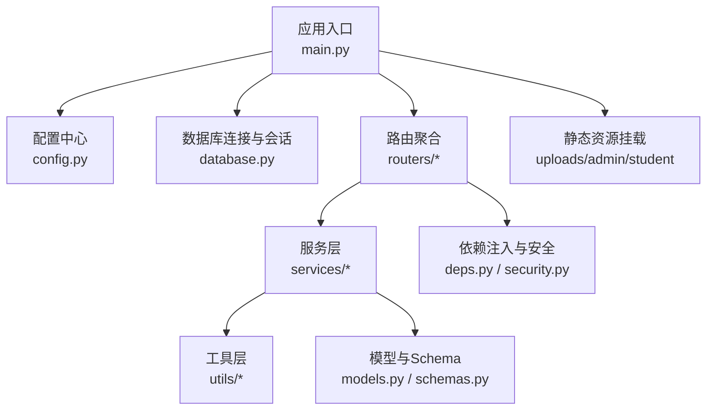
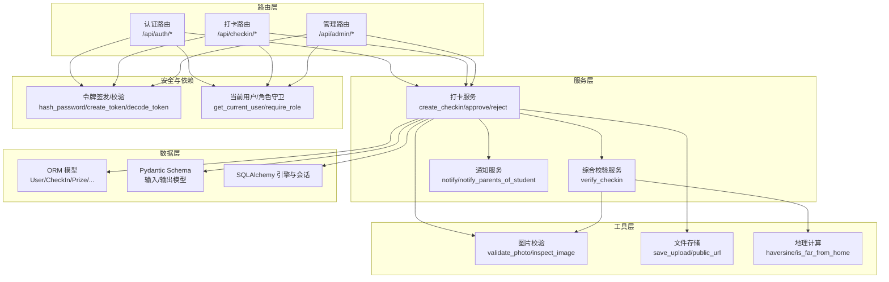
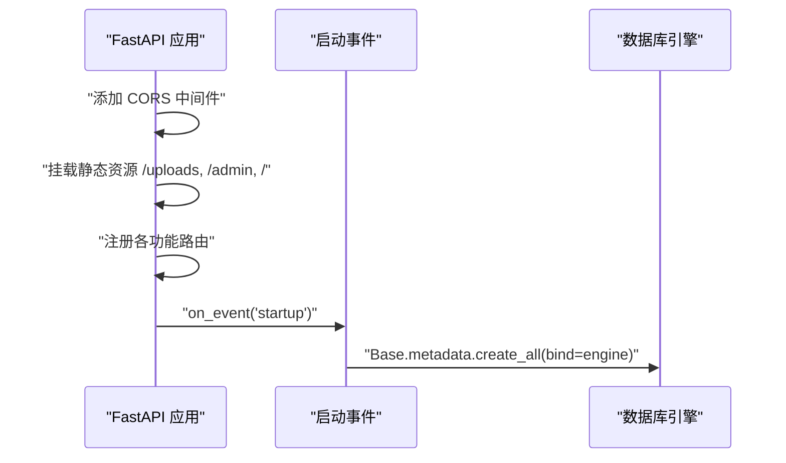
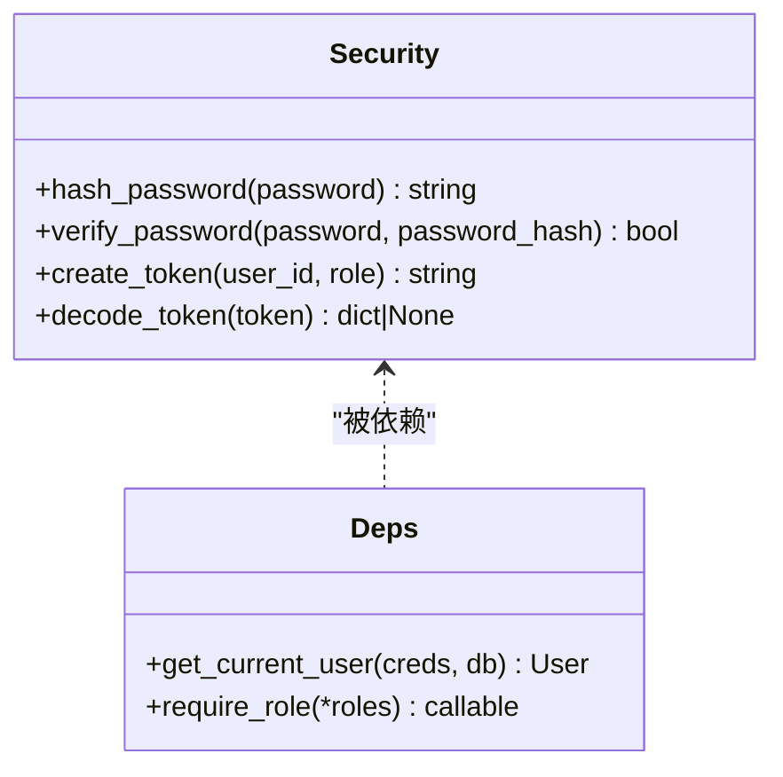
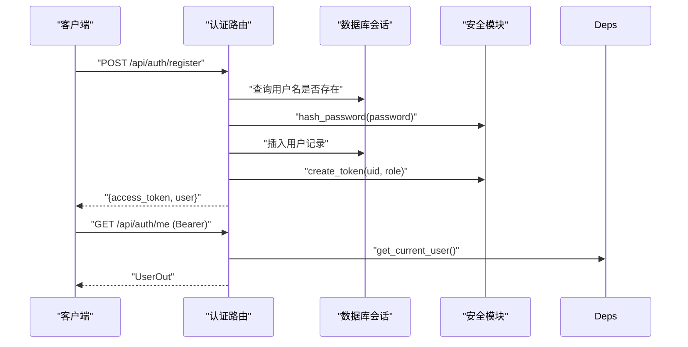
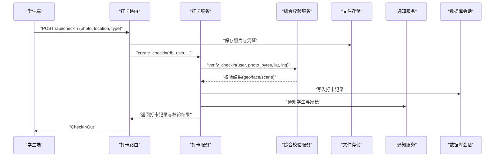
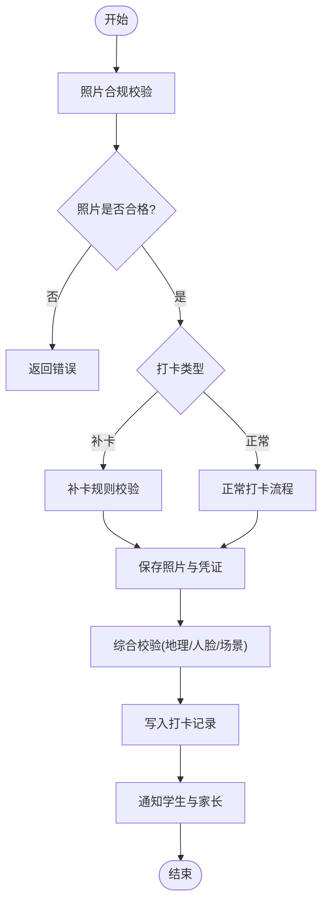
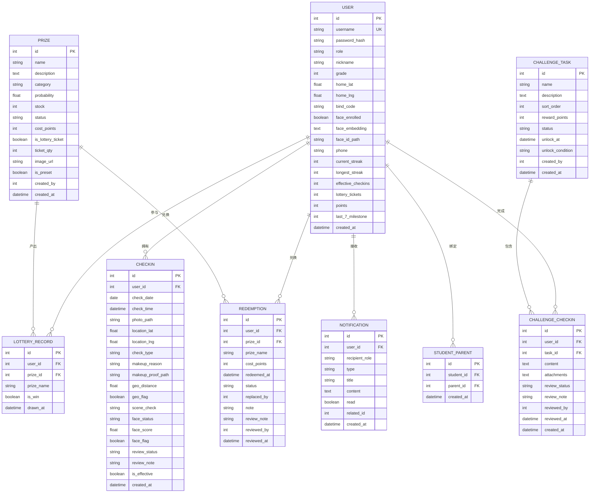
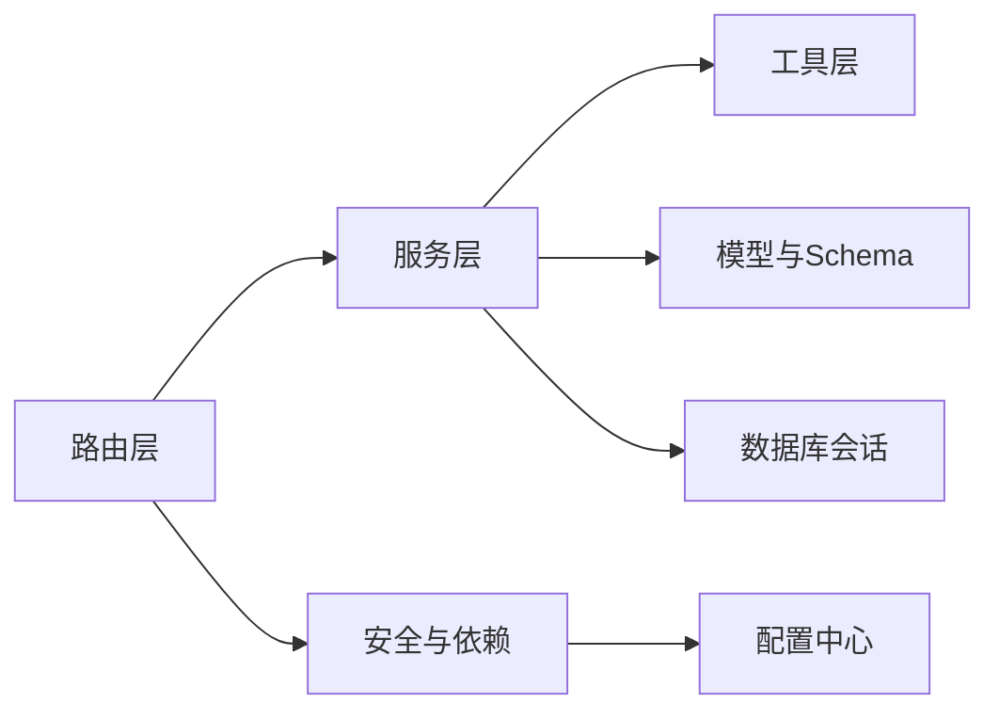

# 后端架构设计

<cite>
**本文引用的文件**   
- [main.py](file://summer-homework-checkin/backend/app/main.py)
- [config.py](file://summer-homework-checkin/backend/app/config.py)
- [database.py](file://summer-homework-checkin/backend/app/database.py)
- [deps.py](file://summer-homework-checkin/backend/app/deps.py)
- [security.py](file://summer-homework-checkin/backend/app/security.py)
- [models.py](file://summer-homework-checkin/backend/app/models.py)
- [schemas.py](file://summer-homework-checkin/backend/app/schemas.py)
- [auth.py](file://summer-homework-checkin/backend/app/routers/auth.py)
- [checkin.py](file://summer-homework-checkin/backend/app/routers/checkin.py)
- [admin.py](file://summer-homework-checkin/backend/app/routers/admin.py)
- [checkin_service.py](file://summer-homework-checkin/backend/app/services/checkin_service.py)
- [verification_service.py](file://summer-homework-checkin/backend/app/services/verification_service.py)
- [storage.py](file://summer-homework-checkin/backend/app/utils/storage.py)
- [image.py](file://summer-homework-checkin/backend/app/utils/image.py)
</cite>

## 目录
1. [引言](#引言)
2. [项目结构](#项目结构)
3. [核心组件](#核心组件)
4. [架构总览](#架构总览)
5. [详细组件分析](#详细组件分析)
6. [依赖关系分析](#依赖关系分析)
7. [性能考量](#性能考量)
8. [故障排查指南](#故障排查指南)
9. [结论](#结论)
10. [附录](#附录)

## 引言
本技术文档面向“暑假作业打卡系统”的后端，聚焦 FastAPI 应用的整体架构与最佳实践。文档从应用初始化、中间件配置、路由注册机制入手，深入阐述分层架构模式：路由层（routers）负责 HTTP 请求处理，服务层（services）封装业务逻辑，数据访问层（models/schemas）管理数据库操作。同时说明依赖注入系统、静态文件托管、CORS 跨域配置等关键特性，并提供架构图与模块间调用关系图，帮助开发者快速理解并扩展系统。

## 项目结构
后端采用清晰的分层组织方式：
- 应用入口与全局配置：应用启动、中间件、静态资源挂载、路由聚合、数据库表初始化
- 配置中心：路径、阈值、策略、密钥等集中管理
- 数据层：SQLAlchemy 引擎与会话工厂、ORM 模型定义、Pydantic 请求/响应 Schema
- 安全与鉴权：令牌签发与校验、当前用户解析、角色权限守卫
- 路由层：按领域划分 API 路由（认证、打卡、抽奖、奖品、家长、报表、人脸、兑换、闯关等）
- 服务层：复杂业务编排（打卡流程、审核、通知、防代打卡校验等）
- 工具层：图片校验、地理位置计算、文件存储与 URL 生成

图表来源
- [main.py:1-49](file://summer-homework-checkin/backend/app/main.py#L1-L49)
- [config.py:1-50](file://summer-homework-checkin/backend/app/config.py#L1-L50)
- [database.py:1-22](file://summer-homework-checkin/backend/app/database.py#L1-L22)

章节来源
- [main.py:1-49](file://summer-homework-checkin/backend/app/main.py#L1-L49)
- [config.py:1-50](file://summer-homework-checkin/backend/app/config.py#L1-L50)
- [database.py:1-22](file://summer-homework-checkin/backend/app/database.py#L1-L22)

## 核心组件
- 应用初始化与生命周期
  - 创建 FastAPI 实例，注册 CORS 中间件，挂载静态资源目录，聚合各功能路由
  - 在应用启动时自动创建数据库表（基于 SQLAlchemy Base）
- 配置中心
  - 统一维护上传目录、前端静态目录、SQLite 数据库路径、签名密钥、打卡规则、人脸识别参数等
- 数据库与会话
  - 使用 SQLAlchemy 创建引擎与 SessionLocal，提供 get_db 依赖用于依赖注入
- 安全与鉴权
  - 密码哈希与验证、无状态 HMAC 令牌签发与校验、HTTPBearer 方案解析、当前用户获取、角色守卫
- 路由层
  - 按领域拆分路由模块，统一前缀与标签，结合依赖注入获取当前用户与数据库会话
- 服务层
  - 将复杂业务逻辑下沉至服务函数，如打卡创建、审核通过/拒绝、连续天数重算、通知发送、综合校验等
- 工具层
  - 图片格式与尺寸校验、地理位置距离计算、文件落盘与公开 URL 生成

章节来源
- [main.py:1-49](file://summer-homework-checkin/backend/app/main.py#L1-L49)
- [config.py:1-50](file://summer-homework-checkin/backend/app/config.py#L1-L50)
- [database.py:1-22](file://summer-homework-checkin/backend/app/database.py#L1-L22)
- [deps.py:1-34](file://summer-homework-checkin/backend/app/deps.py#L1-L34)
- [security.py:1-47](file://summer-homework-checkin/backend/app/security.py#L1-L47)
- [models.py:1-212](file://summer-homework-checkin/backend/app/models.py#L1-L212)
- [schemas.py:1-322](file://summer-homework-checkin/backend/app/schemas.py#L1-L322)

## 架构总览
整体采用“路由层 → 服务层 → 数据层 + 工具层”的分层架构，配合 FastAPI 的依赖注入实现松耦合与高内聚。

图表来源
- [main.py:1-49](file://summer-homework-checkin/backend/app/main.py#L1-L49)
- [auth.py:1-52](file://summer-homework-checkin/backend/app/routers/auth.py#L1-L52)
- [checkin.py:1-80](file://summer-homework-checkin/backend/app/routers/checkin.py#L1-L80)
- [admin.py:1-214](file://summer-homework-checkin/backend/app/routers/admin.py#L1-L214)
- [checkin_service.py:1-254](file://summer-homework-checkin/backend/app/services/checkin_service.py#L1-L254)
- [verification_service.py:1-71](file://summer-homework-checkin/backend/app/services/verification_service.py#L1-L71)
- [models.py:1-212](file://summer-homework-checkin/backend/app/models.py#L1-L212)
- [schemas.py:1-322](file://summer-homework-checkin/backend/app/schemas.py#L1-L322)
- [security.py:1-47](file://summer-homework-checkin/backend/app/security.py#L1-L47)
- [deps.py:1-34](file://summer-homework-checkin/backend/app/deps.py#L1-L34)
- [storage.py:1-24](file://summer-homework-checkin/backend/app/utils/storage.py#L1-L24)
- [image.py:1-61](file://summer-homework-checkin/backend/app/utils/image.py#L1-L61)

## 详细组件分析

### 应用初始化与中间件
- 应用实例化与版本信息
- 添加 CORS 中间件，允许所有来源、方法、头部，支持携带凭证
- 挂载静态资源：
  - /uploads 指向用户上传目录
  - /admin 指向后台管理静态页面
  - / 指向学生端 H5 静态页面
- 启动事件：根据 ORM Base 与 engine 自动建表

图表来源
- [main.py:1-49](file://summer-homework-checkin/backend/app/main.py#L1-L49)

章节来源
- [main.py:1-49](file://summer-homework-checkin/backend/app/main.py#L1-L49)

### 配置中心
- 路径与目录：上传目录、学生端与后台静态目录
- 数据库：SQLite 路径与连接字符串
- 安全：签名密钥、令牌过期天数
- 业务规则：补卡上限、照片体积与尺寸门槛、积分规则、抽奖解锁阈值
- 人脸识别：相似度阈值、检测尺寸、模型名称、已采集底图后的人脸策略

章节来源
- [config.py:1-50](file://summer-homework-checkin/backend/app/config.py#L1-L50)

### 数据库与会话
- 使用 create_engine 创建 SQLite 引擎，设置线程安全参数
- 构建 sessionmaker 作为会话工厂
- declarative_base 作为模型基类
- 提供 get_db 依赖，确保每次请求获得独立会话并在结束后关闭

章节来源
- [database.py:1-22](file://summer-homework-checkin/backend/app/database.py#L1-L22)

### 安全与鉴权
- 密码哈希与验证：PBKDF2 单向哈希与常量时间比较
- 令牌签发与校验：HMAC 签名、Base64 编码 body、过期时间校验
- 依赖注入：
  - get_current_user：从请求头解析 Bearer Token，解码并加载用户对象
  - require_role：基于角色的访问控制装饰器

图表来源
- [security.py:1-47](file://summer-homework-checkin/backend/app/security.py#L1-L47)
- [deps.py:1-34](file://summer-homework-checkin/backend/app/deps.py#L1-L34)

章节来源
- [security.py:1-47](file://summer-homework-checkin/backend/app/security.py#L1-L47)
- [deps.py:1-34](file://summer-homework-checkin/backend/app/deps.py#L1-L34)

### 路由层：认证
- 注册与登录：用户名唯一性检查、密码哈希、返回令牌与用户信息
- 当前用户信息：受保护接口，需携带有效令牌

图表来源
- [auth.py:1-52](file://summer-homework-checkin/backend/app/routers/auth.py#L1-L52)
- [security.py:1-47](file://summer-homework-checkin/backend/app/security.py#L1-L47)
- [deps.py:1-34](file://summer-homework-checkin/backend/app/deps.py#L1-L34)

章节来源
- [auth.py:1-52](file://summer-homework-checkin/backend/app/routers/auth.py#L1-L52)

### 路由层：打卡
- 提交打卡：接收图片与位置信息，委托服务层进行业务规则校验与持久化
- 今日状态与连续打卡统计：读取用户累计与今日待审/已通过情况
- 历史记录：按时间倒序返回打卡详情

图表来源
- [checkin.py:1-80](file://summer-homework-checkin/backend/app/routers/checkin.py#L1-L80)
- [checkin_service.py:1-254](file://summer-homework-checkin/backend/app/services/checkin_service.py#L1-L254)
- [verification_service.py:1-71](file://summer-homework-checkin/backend/app/services/verification_service.py#L1-L71)
- [storage.py:1-24](file://summer-homework-checkin/backend/app/utils/storage.py#L1-L24)

章节来源
- [checkin.py:1-80](file://summer-homework-checkin/backend/app/routers/checkin.py#L1-L80)

### 路由层：管理端
- 统计概览：学生/家长数量、有效打卡数、绑定关系、风险打卡、兑换状态
- 用户列表与打卡记录：分页限制与字段映射
- 打卡审核：批准或拒绝，批准后发放积分并重算连续天数
- 兑换记录管理：筛选、详情、审核兑现或拒绝（含积分退还）

章节来源
- [admin.py:1-214](file://summer-homework-checkin/backend/app/routers/admin.py#L1-L214)

### 服务层：打卡业务
- 创建打卡：
  - 照片合规校验（体积与尺寸）
  - 补卡规则（目标日期、范围、重复检查、月度上限、凭证要求）
  - 保存照片与凭证
  - 防代打卡校验（地理位置一致性、人脸 1:1 比对、场景合规）
  - 写入记录并触发通知
- 审核通过：
  - 标记有效、发放积分、重算连续天数与抽奖资格、通知
- 审核拒绝：
  - 标记拒绝、通知
- 连续天数与里程碑：
  - 基于有效打卡日期计算当前与历史最长连续天数
  - 每 7 天里程碑发放抽奖券并通知

图表来源
- [checkin_service.py:1-254](file://summer-homework-checkin/backend/app/services/checkin_service.py#L1-L254)
- [verification_service.py:1-71](file://summer-homework-checkin/backend/app/services/verification_service.py#L1-L71)
- [image.py:1-61](file://summer-homework-checkin/backend/app/utils/image.py#L1-L61)
- [storage.py:1-24](file://summer-homework-checkin/backend/app/utils/storage.py#L1-L24)

章节来源
- [checkin_service.py:1-254](file://summer-homework-checkin/backend/app/services/checkin_service.py#L1-L254)

### 数据模型与 Schema
- ORM 模型：用户、家长-孩子绑定、打卡记录、奖品、抽奖记录、兑换记录、通知、闯关任务与打卡
- Pydantic Schema：统一的输入/输出模型，便于请求校验与响应序列化

图表来源
- [models.py:1-212](file://summer-homework-checkin/backend/app/models.py#L1-L212)

章节来源
- [models.py:1-212](file://summer-homework-checkin/backend/app/models.py#L1-L212)
- [schemas.py:1-322](file://summer-homework-checkin/backend/app/schemas.py#L1-L322)

### 工具层：图片与存储
- 图片校验：不依赖第三方库，直接解析 JPEG/PNG 头提取尺寸，校验体积与最小边长
- 文件存储：按用户 ID 分目录，随机文件名，返回相对路径；生成可访问的公开 URL

章节来源
- [image.py:1-61](file://summer-homework-checkin/backend/app/utils/image.py#L1-L61)
- [storage.py:1-24](file://summer-homework-checkin/backend/app/utils/storage.py#L1-L24)

## 依赖关系分析
- 低耦合：路由仅做参数解析与响应组装，业务逻辑集中在服务层
- 高内聚：服务层聚合校验、通知、存储、数据库更新等步骤
- 依赖注入：通过 Depends 注入当前用户与会话，避免全局状态
- 外部集成点：
  - 文件系统：上传目录与静态资源
  - 数据库：SQLite（开发/轻量部署）
  - 可选：人脸识别服务（预留接口，当前以骨架实现）

图表来源
- [main.py:1-49](file://summer-homework-checkin/backend/app/main.py#L1-L49)
- [checkin.py:1-80](file://summer-homework-checkin/backend/app/routers/checkin.py#L1-L80)
- [checkin_service.py:1-254](file://summer-homework-checkin/backend/app/services/checkin_service.py#L1-L254)
- [deps.py:1-34](file://summer-homework-checkin/backend/app/deps.py#L1-L34)
- [security.py:1-47](file://summer-homework-checkin/backend/app/security.py#L1-L47)
- [config.py:1-50](file://summer-homework-checkin/backend/app/config.py#L1-L50)

章节来源
- [main.py:1-49](file://summer-homework-checkin/backend/app/main.py#L1-L49)
- [checkin.py:1-80](file://summer-homework-checkin/backend/app/routers/checkin.py#L1-L80)
- [checkin_service.py:1-254](file://summer-homework-checkin/backend/app/services/checkin_service.py#L1-L254)
- [deps.py:1-34](file://summer-homework-checkin/backend/app/deps.py#L1-L34)
- [security.py:1-47](file://summer-homework-checkin/backend/app/security.py#L1-L47)
- [config.py:1-50](file://summer-homework-checkin/backend/app/config.py#L1-L50)

## 性能考量
- 数据库
  - SQLite 适合轻量场景，注意并发写锁；生产环境建议迁移到 PostgreSQL/MySQL
  - 为常用查询字段建立索引（如 users.username、checkins.check_date、checkins.user_id）
- 文件存储
  - 大文件上传应启用异步流式处理与大小限制
  - 考虑对象存储（S3/OSS）替代本地磁盘，提升可扩展性与可用性
- 图片校验
  - 解析 JPEG/PNG 头开销较低，但应避免对超大图片进行额外处理
- 人脸识别
  - 模型不可用时应降级策略，避免阻塞主流程
- 缓存
  - 热点数据（如用户统计、奖品列表）可引入内存缓存或 Redis

[本节为通用指导，无需特定文件引用]

## 故障排查指南
- 认证失败
  - 检查 Bearer Token 是否正确携带，确认签名密钥一致且未过期
  - 确认用户存在且未被删除
- 打卡失败
  - 照片体积或尺寸不符合要求，检查 MIN_PHOTO_BYTES/MIN_PHOTO_DIM/PHOTO_MAX_BYTES
  - 补卡日期不在暑假统计范围内或已达月度上限
  - 人脸校验失败或模型不可用，查看 FACE_MODE_ON_ENROLLED 策略
- 静态资源无法访问
  - 确认 /uploads、/admin、/ 挂载目录存在且可读
- 数据库问题
  - 启动时未自动建表，检查 on_event("startup") 是否执行
  - 连接参数与线程安全设置是否正确

章节来源
- [security.py:1-47](file://summer-homework-checkin/backend/app/security.py#L1-L47)
- [deps.py:1-34](file://summer-homework-checkin/backend/app/deps.py#L1-L34)
- [checkin_service.py:1-254](file://summer-homework-checkin/backend/app/services/checkin_service.py#L1-L254)
- [config.py:1-50](file://summer-homework-checkin/backend/app/config.py#L1-L50)
- [main.py:1-49](file://summer-homework-checkin/backend/app/main.py#L1-L49)

## 结论
本后端采用 FastAPI 的分层架构与依赖注入，实现了清晰的职责分离与良好的可扩展性。通过集中配置、严格的数据校验与完善的鉴权机制，系统在保障安全性的同时提供了友好的用户体验。建议在后续迭代中引入对象存储、数据库迁移与更完善的人脸识别服务，以提升稳定性与性能。

[本节为总结性内容，无需特定文件引用]

## 附录
- 环境变量与配置项参考
  - SUMMER_SECRET：令牌签名密钥
  - GEO_THRESHOLD_METERS：地理位置阈值（米）
  - MAX_MAKEUP_PER_MONTH：单月补卡上限
  - CHECKIN_POINTS / MAKEUP_POINTS：打卡与补卡积分
  - FACE_MATCH_THRESHOLD / FACE_DET_SIZE / FACE_MODEL_NAME / FACE_MODE_ON_ENROLLED：人脸识别相关参数

章节来源
- [config.py:1-50](file://summer-homework-checkin/backend/app/config.py#L1-L50)