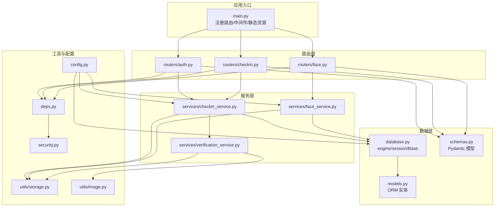
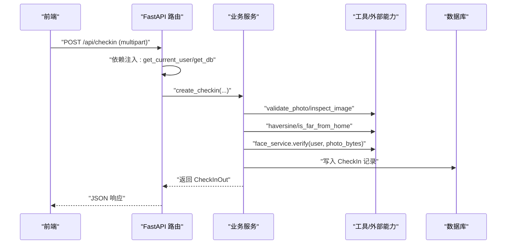
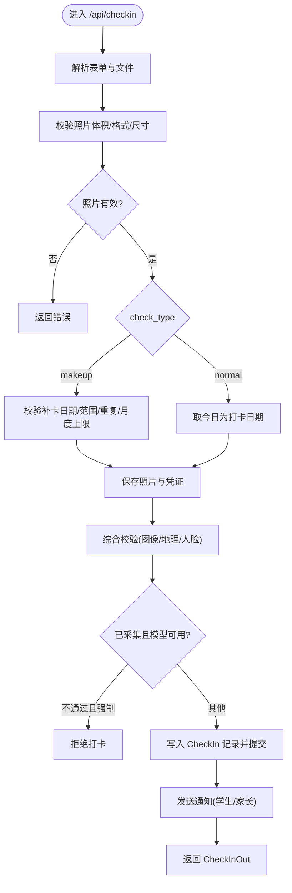
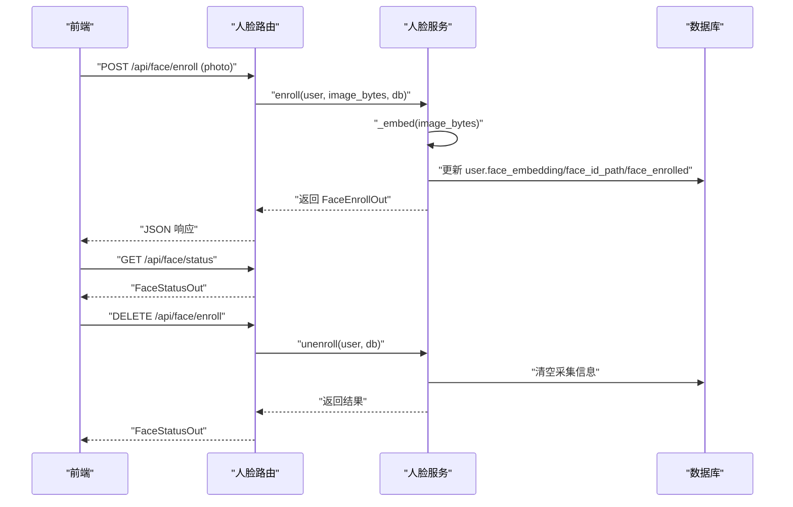
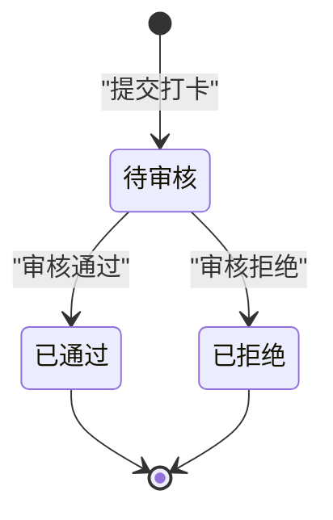
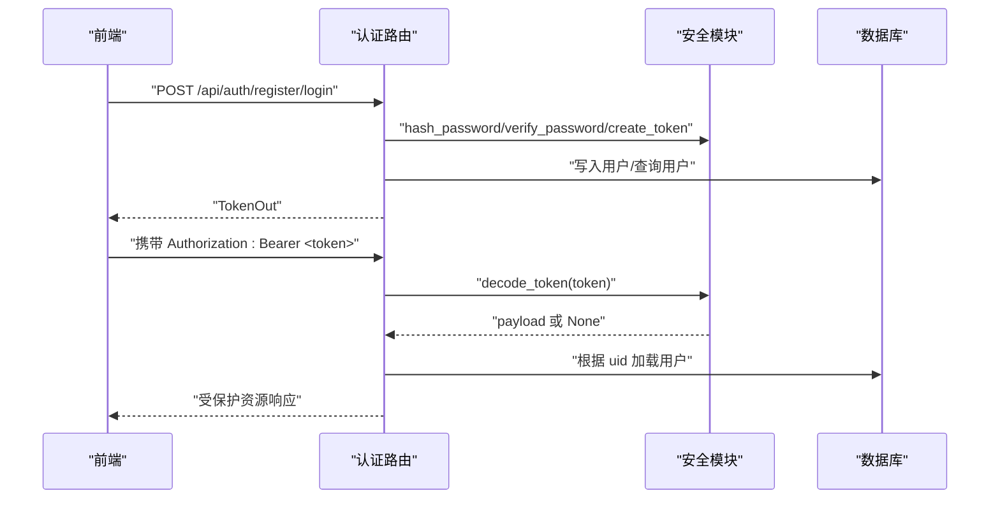
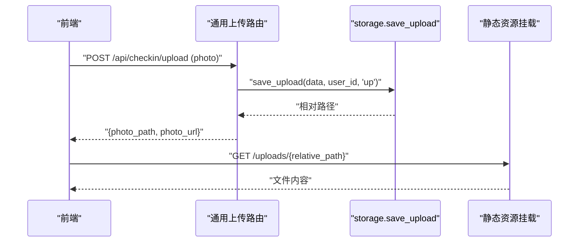
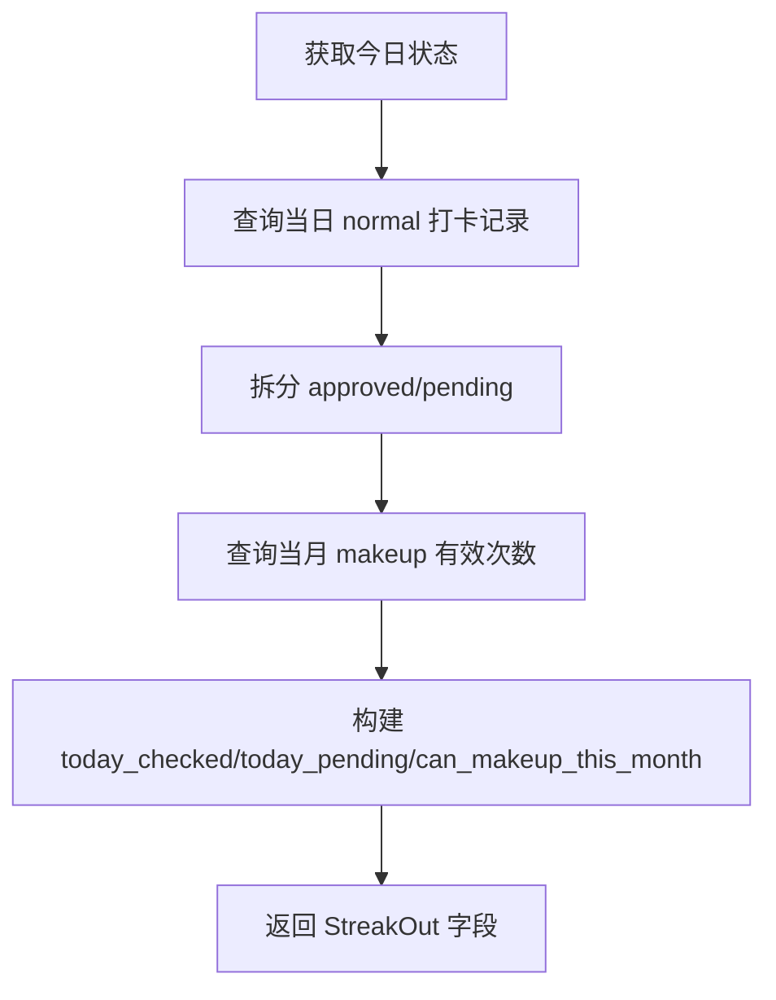
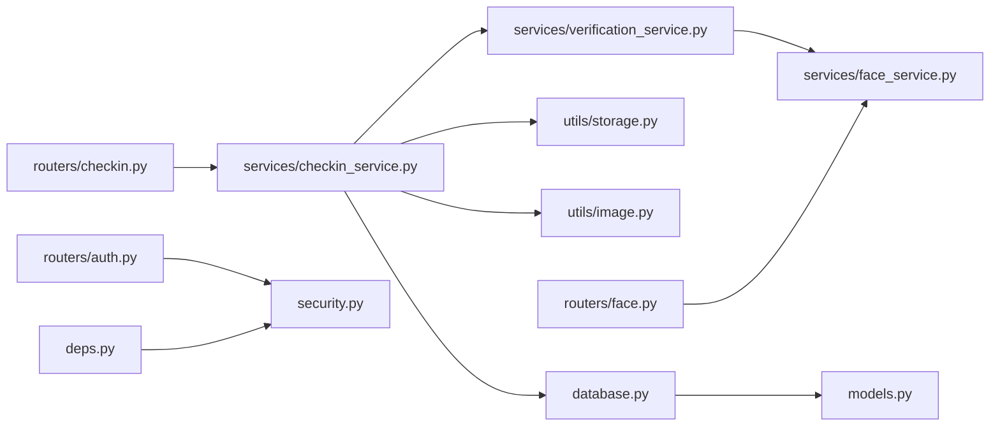
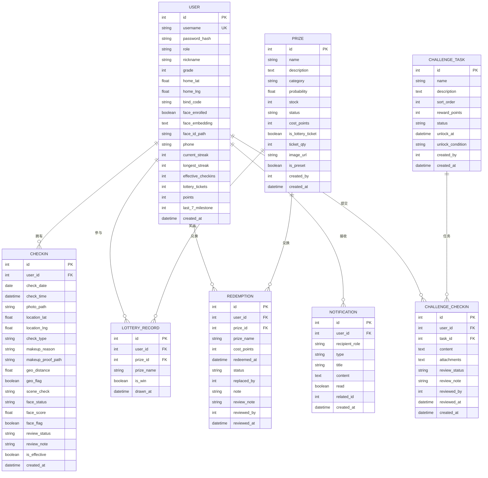

# 数据流设计

<cite>
**本文引用的文件**
- [backend/app/main.py](file://summer-homework-checkin/backend/app/main.py)
- [backend/app/database.py](file://summer-homework-checkin/backend/app/database.py)
- [backend/app/models.py](file://summer-homework-checkin/backend/app/models.py)
- [backend/app/schemas.py](file://summer-homework-checkin/backend/app/schemas.py)
- [backend/app/routers/checkin.py](file://summer-homework-checkin/backend/app/routers/checkin.py)
- [backend/app/services/checkin_service.py](file://summer-homework-checkin/backend/app/services/checkin_service.py)
- [backend/app/routers/face.py](file://summer-homework-checkin/backend/app/routers/face.py)
- [backend/app/services/face_service.py](file://summer-homework-checkin/backend/app/services/face_service.py)
- [backend/app/services/verification_service.py](file://summer-homework-checkin/backend/app/services/verification_service.py)
- [backend/app/utils/storage.py](file://summer-homework-checkin/backend/app/utils/storage.py)
- [backend/app/config.py](file://summer-homework-checkin/backend/app/config.py)
- [backend/app/deps.py](file://summer-homework-checkin/backend/app/deps.py)
- [backend/app/security.py](file://summer-homework-checkin/backend/app/security.py)
- [backend/app/routers/auth.py](file://summer-homework-checkin/backend/app/routers/auth.py)
- [backend/app/utils/image.py](file://summer-homework-checkin/backend/app/utils/image.py)
</cite>

## 目录
1. [引言](#引言)
2. [项目结构](#项目结构)
3. [核心组件](#核心组件)
4. [架构总览](#架构总览)
5. [详细组件分析](#详细组件分析)
6. [依赖关系分析](#依赖关系分析)
7. [性能考量](#性能考量)
8. [故障排查指南](#故障排查指南)
9. [结论](#结论)
10. [附录](#附录)

## 引言
本技术文档聚焦“暑假作业打卡系统”的数据流设计，覆盖从前端请求到数据库存储的完整链路：HTTP 请求处理、业务逻辑编排、数据验证与转换、持久化存储、文件上传、人脸识别数据流以及实时状态更新。文档通过类图、时序图、流程图和状态图，帮助开发者理解各层间数据的传递与处理方式，并给出关键优化建议与排障指引。

## 项目结构
后端采用 FastAPI + SQLAlchemy ORM + Pydantic 校验的分层架构：
- 路由层（routers）：定义 HTTP 接口，参数解析与响应序列化
- 服务层（services）：承载业务规则与流程编排
- 模型层（models）：SQLAlchemy ORM 实体映射
- 模式层（schemas）：Pydantic 输入输出模型
- 基础设施：数据库连接、静态资源挂载、配置、安全与工具模块

图表来源
- [backend/app/main.py:1-49](file://summer-homework-checkin/backend/app/main.py#L1-L49)
- [backend/app/routers/auth.py:1-52](file://summer-homework-checkin/backend/app/routers/auth.py#L1-L52)
- [backend/app/routers/checkin.py:1-80](file://summer-homework-checkin/backend/app/routers/checkin.py#L1-L80)
- [backend/app/routers/face.py:1-45](file://summer-homework-checkin/backend/app/routers/face.py#L1-L45)
- [backend/app/services/checkin_service.py:1-254](file://summer-homework-checkin/backend/app/services/checkin_service.py#L1-L254)
- [backend/app/services/face_service.py:1-133](file://summer-homework-checkin/backend/app/services/face_service.py#L1-L133)
- [backend/app/services/verification_service.py:1-71](file://summer-homework-checkin/backend/app/services/verification_service.py#L1-L71)
- [backend/app/database.py:1-22](file://summer-homework-checkin/backend/app/database.py#L1-L22)
- [backend/app/models.py:1-212](file://summer-homework-checkin/backend/app/models.py#L1-L212)
- [backend/app/schemas.py:1-322](file://summer-homework-checkin/backend/app/schemas.py#L1-L322)
- [backend/app/config.py:1-50](file://summer-homework-checkin/backend/app/config.py#L1-L50)
- [backend/app/utils/storage.py:1-24](file://summer-homework-checkin/backend/app/utils/storage.py#L1-L24)
- [backend/app/utils/image.py:1-61](file://summer-homework-checkin/backend/app/utils/image.py#L1-L61)
- [backend/app/deps.py:1-34](file://summer-homework-checkin/backend/app/deps.py#L1-L34)
- [backend/app/security.py:1-47](file://summer-homework-checkin/backend/app/security.py#L1-L47)

章节来源
- [backend/app/main.py:1-49](file://summer-homework-checkin/backend/app/main.py#L1-L49)
- [backend/app/config.py:1-50](file://summer-homework-checkin/backend/app/config.py#L1-L50)

## 核心组件
- 应用入口与中间件
  - 注册 CORS、静态资源挂载（uploads/admin/student）、启动时创建表结构
- 认证与安全
  - 基于 HMAC 签名的无状态 Token；依赖注入获取当前用户
- 数据模型与模式
  - ORM 实体（User/CheckIn/Prize/LotteryRecord/Redemption/Notification/Challenge*）
  - Pydantic 输入输出模型（UserRegister/UserLogin/TokenOut/CheckInCreate/CheckInOut/StreakOut 等）
- 数据库与事务
  - SQLite engine、sessionmaker、Base；get_db 提供会话生命周期管理
- 业务服务
  - 打卡服务：照片校验、补卡规则、防代打卡、通知、积分与连续天数重算
  - 人脸服务：底图采集、撤销、1:1 比对（insightface）
  - 综合校验服务：图像真实性、地理位置一致性、人脸 1:1 比对、风险判定
- 工具与配置
  - 文件存储（相对路径+静态挂载）、图片解析（JPEG/PNG 尺寸提取）、地理距离计算、阈值与策略配置

章节来源
- [backend/app/main.py:1-49](file://summer-homework-checkin/backend/app/main.py#L1-L49)
- [backend/app/deps.py:1-34](file://summer-homework-checkin/backend/app/deps.py#L1-L34)
- [backend/app/security.py:1-47](file://summer-homework-checkin/backend/app/security.py#L1-L47)
- [backend/app/database.py:1-22](file://summer-homework-checkin/backend/app/database.py#L1-L22)
- [backend/app/models.py:1-212](file://summer-homework-checkin/backend/app/models.py#L1-L212)
- [backend/app/schemas.py:1-322](file://summer-homework-checkin/backend/app/schemas.py#L1-L322)
- [backend/app/services/checkin_service.py:1-254](file://summer-homework-checkin/backend/app/services/checkin_service.py#L1-L254)
- [backend/app/services/face_service.py:1-133](file://summer-homework-checkin/backend/app/services/face_service.py#L1-L133)
- [backend/app/services/verification_service.py:1-71](file://summer-homework-checkin/backend/app/services/verification_service.py#L1-L71)
- [backend/app/utils/storage.py:1-24](file://summer-homework-checkin/backend/app/utils/storage.py#L1-L24)
- [backend/app/utils/image.py:1-61](file://summer-homework-checkin/backend/app/utils/image.py#L1-L61)
- [backend/app/config.py:1-50](file://summer-homework-checkin/backend/app/config.py#L1-L50)

## 架构总览
整体数据流遵循“路由 -> 服务 -> 工具/外部能力 -> 数据库”的单向调用链，结合 Pydantic 在边界进行强类型校验与转换，确保数据一致性与可追溯性。

图表来源
- [backend/app/routers/checkin.py:17-37](file://summer-homework-checkin/backend/app/routers/checkin.py#L17-L37)
- [backend/app/services/checkin_service.py:64-163](file://summer-homework-checkin/backend/app/services/checkin_service.py#L64-L163)
- [backend/app/services/verification_service.py:19-71](file://summer-homework-checkin/backend/app/services/verification_service.py#L19-L71)
- [backend/app/services/face_service.py:99-125](file://summer-homework-checkin/backend/app/services/face_service.py#L99-L125)
- [backend/app/utils/image.py:51-61](file://summer-homework-checkin/backend/app/utils/image.py#L51-L61)

## 详细组件分析

### 打卡数据流（正常/补卡）
- 入口与参数
  - 路由接收 multipart/form-data：photo、proof、location_lat/lng、check_type、makeup_reason、makeup_for_date
  - 依赖注入当前用户与会话
- 业务规则
  - 照片体积/格式/尺寸校验
  - 补卡目标日期合法性、范围、重复与月度上限检查
  - 保存照片与凭证至本地存储，生成相对路径
  - 防代打卡校验：图像真实性、地理位置一致性、人脸 1:1 比对
  - 根据策略拒绝或标记高风险
  - 写入 CheckIn 记录，提交事务
  - 发送站内通知（学生与家长）
- 响应
  - 使用 Pydantic 将 ORM 对象转换为 CheckInOut 返回

图表来源
- [backend/app/routers/checkin.py:17-37](file://summer-homework-checkin/backend/app/routers/checkin.py#L17-L37)
- [backend/app/services/checkin_service.py:64-163](file://summer-homework-checkin/backend/app/services/checkin_service.py#L64-L163)
- [backend/app/services/verification_service.py:19-71](file://summer-homework-checkin/backend/app/services/verification_service.py#L19-L71)
- [backend/app/utils/image.py:51-61](file://summer-homework-checkin/backend/app/utils/image.py#L51-L61)
- [backend/app/utils/storage.py:7-16](file://summer-homework-checkin/backend/app/utils/storage.py#L7-L16)

章节来源
- [backend/app/routers/checkin.py:17-80](file://summer-homework-checkin/backend/app/routers/checkin.py#L17-L80)
- [backend/app/services/checkin_service.py:64-254](file://summer-homework-checkin/backend/app/services/checkin_service.py#L64-L254)
- [backend/app/utils/storage.py:7-24](file://summer-homework-checkin/backend/app/utils/storage.py#L7-L24)
- [backend/app/utils/image.py:34-61](file://summer-homework-checkin/backend/app/utils/image.py#L34-L61)

### 人脸识别数据流（采集/状态/撤销/比对）
- 采集
  - 路由接收人脸底图，服务检测单脸、提取 512 维 embedding，持久化到 User.face_embedding 与 face_id_path
- 状态查询
  - 返回是否已采集及可访问 URL
- 撤销
  - 清空采集信息，保留历史文件供审计
- 比对
  - 现场照与底图做余弦相似度，按阈值判定 match/mismatch，未采集或模型不可用则返回相应状态

图表来源
- [backend/app/routers/face.py:14-44](file://summer-homework-checkin/backend/app/routers/face.py#L14-L44)
- [backend/app/services/face_service.py:71-96](file://summer-homework-checkin/backend/app/services/face_service.py#L71-L96)
- [backend/app/services/face_service.py:99-125](file://summer-homework-checkin/backend/app/services/face_service.py#L99-L125)

章节来源
- [backend/app/routers/face.py:14-44](file://summer-homework-checkin/backend/app/routers/face.py#L14-L44)
- [backend/app/services/face_service.py:71-133](file://summer-homework-checkin/backend/app/services/face_service.py#L71-L133)

### 审核与状态流转（打卡记录）
- 管理员审核通过
  - 标记 review_status=approved、is_effective=True，发放积分，重算连续天数与抽奖资格，发送通知
- 管理员拒绝
  - 标记 review_status=rejected、is_effective=False，发送通知

图表来源
- [backend/app/services/checkin_service.py:166-209](file://summer-homework-checkin/backend/app/services/checkin_service.py#L166-L209)

章节来源
- [backend/app/services/checkin_service.py:166-209](file://summer-homework-checkin/backend/app/services/checkin_service.py#L166-L209)

### 认证与令牌数据流
- 注册/登录
  - 密码哈希与校验，生成 HMAC 签名 Token，返回 TokenOut
- 鉴权
  - 依赖注入解析 Bearer Token，校验签名与过期时间，加载用户上下文

图表来源
- [backend/app/routers/auth.py:13-52](file://summer-homework-checkin/backend/app/routers/auth.py#L13-L52)
- [backend/app/security.py:10-47](file://summer-homework-checkin/backend/app/security.py#L10-L47)
- [backend/app/deps.py:13-25](file://summer-homework-checkin/backend/app/deps.py#L13-L25)

章节来源
- [backend/app/routers/auth.py:13-52](file://summer-homework-checkin/backend/app/routers/auth.py#L13-L52)
- [backend/app/security.py:10-47](file://summer-homework-checkin/backend/app/security.py#L10-L47)
- [backend/app/deps.py:13-25](file://summer-homework-checkin/backend/app/deps.py#L13-L25)

### 文件上传与公开访问
- 上传
  - 路由接收 UploadFile，读取字节，校验图片，保存到 uploads/{user_id}/...，返回相对路径与公开 URL
- 静态挂载
  - 应用启动时将 /uploads 挂载为静态目录，浏览器可直接访问

图表来源
- [backend/app/routers/checkin.py:40-52](file://summer-homework-checkin/backend/app/routers/checkin.py#L40-L52)
- [backend/app/utils/storage.py:7-24](file://summer-homework-checkin/backend/app/utils/storage.py#L7-L24)
- [backend/app/main.py:43-48](file://summer-homework-checkin/backend/app/main.py#L43-L48)

章节来源
- [backend/app/routers/checkin.py:40-52](file://summer-homework-checkin/backend/app/routers/checkin.py#L40-L52)
- [backend/app/utils/storage.py:7-24](file://summer-homework-checkin/backend/app/utils/storage.py#L7-L24)
- [backend/app/main.py:43-48](file://summer-homework-checkin/backend/app/main.py#L43-L48)

### 实时状态更新（今日打卡/连续天数）
- 今日状态
  - 查询当天所有打卡记录，区分已批准与待审核，统计本月剩余补卡次数
- 连续天数与里程碑
  - 基于有效打卡日期列表计算当前连续与历史最长连续，达到每 7 天里程碑自动发放抽奖券并发通知

图表来源
- [backend/app/services/checkin_service.py:225-254](file://summer-homework-checkin/backend/app/services/checkin_service.py#L225-L254)
- [backend/app/services/checkin_service.py:39-61](file://summer-homework-checkin/backend/app/services/checkin_service.py#L39-L61)
- [backend/app/routers/checkin.py:62-73](file://summer-homework-checkin/backend/app/routers/checkin.py#L62-L73)

章节来源
- [backend/app/services/checkin_service.py:39-61](file://summer-homework-checkin/backend/app/services/checkin_service.py#L39-L61)
- [backend/app/services/checkin_service.py:225-254](file://summer-homework-checkin/backend/app/services/checkin_service.py#L225-L254)
- [backend/app/routers/checkin.py:62-73](file://summer-homework-checkin/backend/app/routers/checkin.py#L62-L73)

## 依赖关系分析
- 组件耦合
  - 路由层仅负责参数绑定与响应序列化，业务集中在服务层，降低耦合度
  - 服务层依赖工具与外部能力（人脸、图像解析、地理计算），通过统一接口隔离变化
- 外部依赖
  - insightface 模型懒加载与线程锁保护，失败降级为“模型不可用”，不影响主流程
- 循环依赖
  - 未发现直接循环导入；按需 import 避免启动期开销

图表来源
- [backend/app/routers/checkin.py:1-80](file://summer-homework-checkin/backend/app/routers/checkin.py#L1-L80)
- [backend/app/services/checkin_service.py:1-254](file://summer-homework-checkin/backend/app/services/checkin_service.py#L1-L254)
- [backend/app/services/verification_service.py:1-71](file://summer-homework-checkin/backend/app/services/verification_service.py#L1-L71)
- [backend/app/services/face_service.py:1-133](file://summer-homework-checkin/backend/app/services/face_service.py#L1-L133)
- [backend/app/utils/storage.py:1-24](file://summer-homework-checkin/backend/app/utils/storage.py#L1-L24)
- [backend/app/utils/image.py:1-61](file://summer-homework-checkin/backend/app/utils/image.py#L1-L61)
- [backend/app/database.py:1-22](file://summer-homework-checkin/backend/app/database.py#L1-L22)
- [backend/app/models.py:1-212](file://summer-homework-checkin/backend/app/models.py#L1-L212)
- [backend/app/routers/face.py:1-45](file://summer-homework-checkin/backend/app/routers/face.py#L1-L45)
- [backend/app/routers/auth.py:1-52](file://summer-homework-checkin/backend/app/routers/auth.py#L1-L52)
- [backend/app/security.py:1-47](file://summer-homework-checkin/backend/app/security.py#L1-L47)
- [backend/app/deps.py:1-34](file://summer-homework-checkin/backend/app/deps.py#L1-L34)

章节来源
- [backend/app/routers/checkin.py:1-80](file://summer-homework-checkin/backend/app/routers/checkin.py#L1-L80)
- [backend/app/services/checkin_service.py:1-254](file://summer-homework-checkin/backend/app/services/checkin_service.py#L1-L254)
- [backend/app/services/verification_service.py:1-71](file://summer-homework-checkin/backend/app/services/verification_service.py#L1-L71)
- [backend/app/services/face_service.py:1-133](file://summer-homework-checkin/backend/app/services/face_service.py#L1-L133)
- [backend/app/utils/storage.py:1-24](file://summer-homework-checkin/backend/app/utils/storage.py#L1-L24)
- [backend/app/utils/image.py:1-61](file://summer-homework-checkin/backend/app/utils/image.py#L1-L61)
- [backend/app/database.py:1-22](file://summer-homework-checkin/backend/app/database.py#L1-L22)
- [backend/app/models.py:1-212](file://summer-homework-checkin/backend/app/models.py#L1-L212)
- [backend/app/routers/face.py:1-45](file://summer-homework-checkin/backend/app/routers/face.py#L1-L45)
- [backend/app/routers/auth.py:1-52](file://summer-homework-checkin/backend/app/routers/auth.py#L1-L52)
- [backend/app/security.py:1-47](file://summer-homework-checkin/backend/app/security.py#L1-L47)
- [backend/app/deps.py:1-34](file://summer-homework-checkin/backend/app/deps.py#L1-L34)

## 性能考量
- 人脸模型懒加载与全局锁
  - 首次调用才初始化 insightface 分析器，减少冷启动开销；多线程安全保证
- 轻量图像解析
  - 直接解析 JPEG/PNG 头部获取尺寸，避免引入重型图像处理库
- 数据库
  - SQLite 适合轻量场景；生产环境可替换为高并发数据库并调整连接池参数
- 静态资源
  - 大文件建议走 CDN 或对象存储，减少后端 I/O 压力

[本节为通用指导，无需列出具体文件来源]

## 故障排查指南
- 人脸模型不可用
  - 现象：打卡提示“人脸识别服务暂不可用”
  - 排查：确认 insightface 安装与模型下载；查看 is_available 健康检查
- 照片校验失败
  - 现象：体积/格式/尺寸不符合要求
  - 排查：检查 MIN_PHOTO_BYTES/MIN_PHOTO_DIM/PHOTO_MAX_BYTES 配置；确认前端压缩策略
- 补卡规则报错
  - 现象：日期不在暑假范围内/已达月度上限/重复补卡
  - 排查：核对 MAX_MAKEUP_PER_MONTH、SUMMER_START/SUMMER_END 配置与业务日期
- 位置异常
  - 现象：geo_flag 标记为远端
  - 排查：检查 home_lat/home_lng 设置与 GEO_THRESHOLD_METERS 阈值
- 权限问题
  - 现象：401/403
  - 排查：确认 Token 是否有效、角色是否正确

章节来源
- [backend/app/services/face_service.py:128-133](file://summer-homework-checkin/backend/app/services/face_service.py#L128-L133)
- [backend/app/utils/image.py:51-61](file://summer-homework-checkin/backend/app/utils/image.py#L51-L61)
- [backend/app/config.py:27-50](file://summer-homework-checkin/backend/app/config.py#L27-L50)
- [backend/app/deps.py:13-33](file://summer-homework-checkin/backend/app/deps.py#L13-L33)

## 结论
本数据流设计以清晰的层次划分与严格的边界校验为核心，结合人脸 1:1 比对与地理位置一致性校验，有效降低代打卡风险。通过 Pydantic 强类型约束与 SQLAlchemy ORM 的事务管理，保障数据一致性与可维护性。后续可在存储与模型推理层面进一步优化性能与可扩展性。

[本节为总结性内容，无需列出具体文件来源]

## 附录

### 数据模型概览（ER 关系）

图表来源
- [backend/app/models.py:11-212](file://summer-homework-checkin/backend/app/models.py#L11-L212)