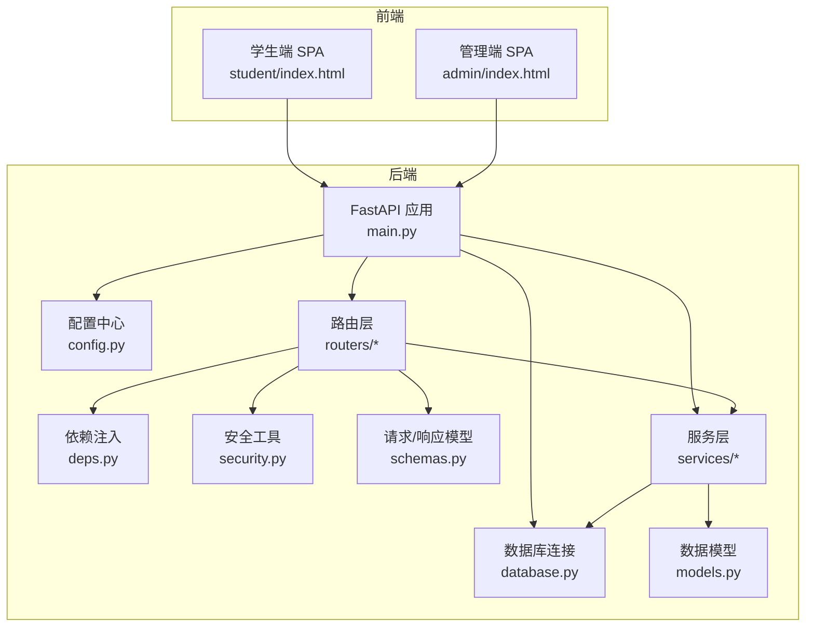
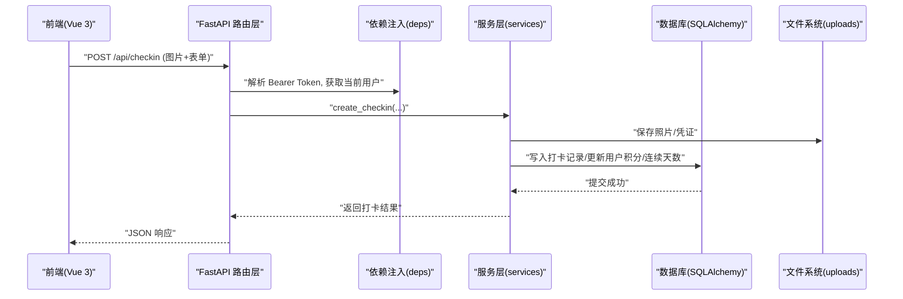
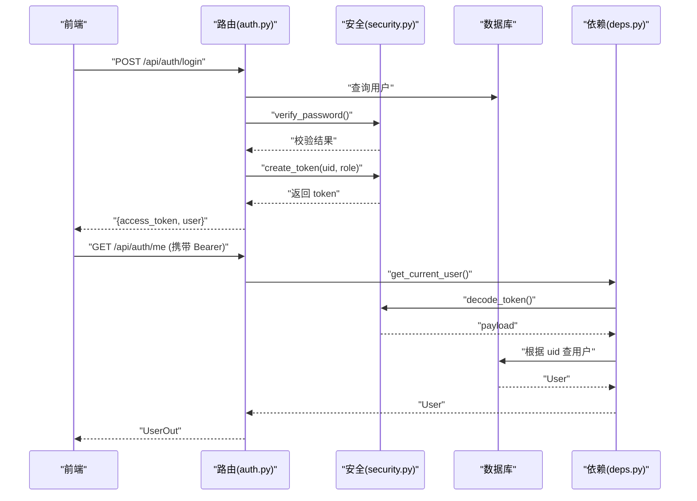
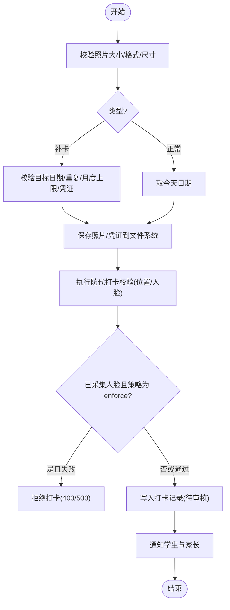
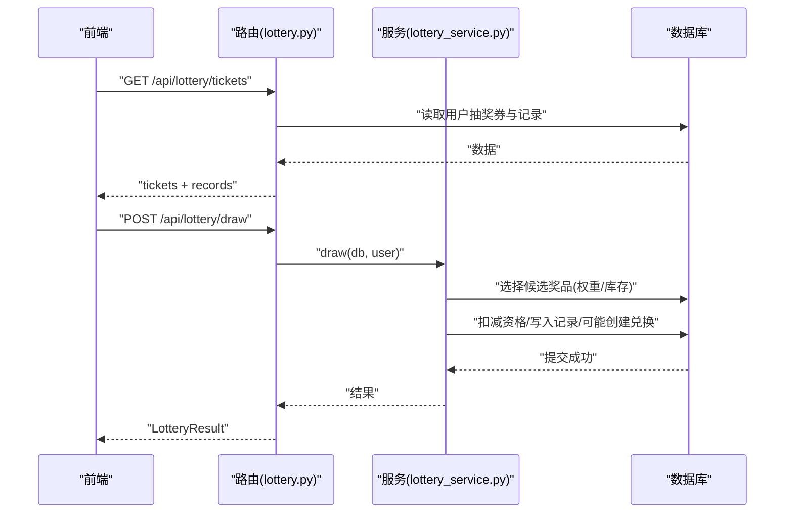
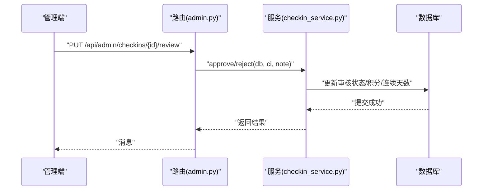
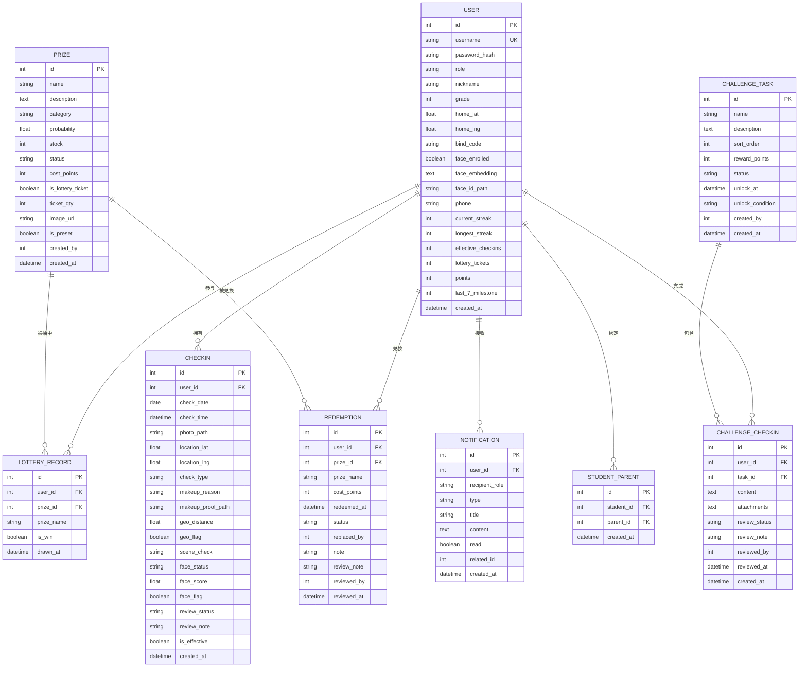
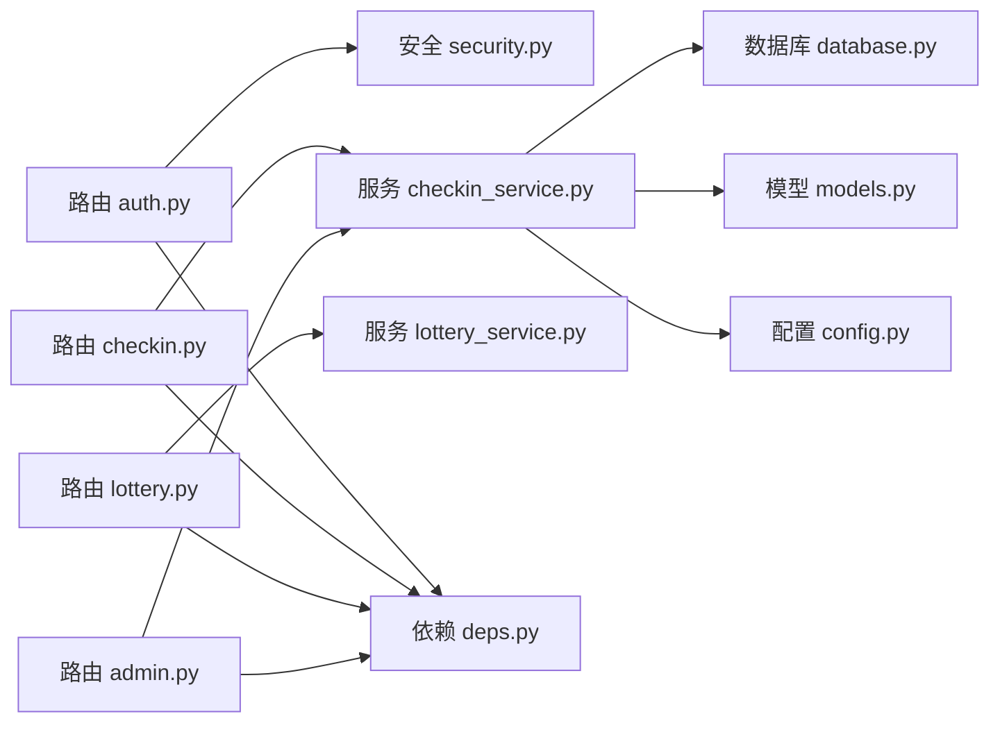

# 系统架构设计

<cite>
**本文引用的文件**   
- [backend/app/main.py](file://summer-homework-checkin/backend/app/main.py)
- [backend/app/config.py](file://summer-homework-checkin/backend/app/config.py)
- [backend/app/database.py](file://summer-homework-checkin/backend/app/database.py)
- [backend/app/deps.py](file://summer-homework-checkin/backend/app/deps.py)
- [backend/app/security.py](file://summer-homework-checkin/backend/app/security.py)
- [backend/app/models.py](file://summer-homework-checkin/backend/app/models.py)
- [backend/app/schemas.py](file://summer-homework-checkin/backend/app/schemas.py)
- [backend/app/routers/auth.py](file://summer-homework-checkin/backend/app/routers/auth.py)
- [backend/app/routers/checkin.py](file://summer-homework-checkin/backend/app/routers/checkin.py)
- [backend/app/routers/admin.py](file://summer-homework-checkin/backend/app/routers/admin.py)
- [backend/app/routers/lottery.py](file://summer-homework-checkin/backend/app/routers/lottery.py)
- [backend/app/services/checkin_service.py](file://summer-homework-checkin/backend/app/services/checkin_service.py)
- [backend/app/services/lottery_service.py](file://summer-homework-checkin/backend/app/services/lottery_service.py)
- [frontend/student/index.html](file://summer-homework-checkin/frontend/student/index.html)
- [frontend/admin/index.html](file://summer-homework-checkin/frontend/admin/index.html)
</cite>

## 目录
1. [引言](#引言)
2. [项目结构](#项目结构)
3. [核心组件](#核心组件)
4. [架构总览](#架构总览)
5. [详细组件分析](#详细组件分析)
6. [依赖关系分析](#依赖关系分析)
7. [性能与可扩展性](#性能与可扩展性)
8. [故障排查指南](#故障排查指南)
9. [结论](#结论)
10. [附录：API 与数据模型速览](#附录api-与数据模型速览)

## 引言
本技术文档面向“暑假作业打卡系统”的架构设计与实现，聚焦前后端分离的整体方案：后端采用 FastAPI + SQLAlchemy + SQLite，前端为基于 Vue.js 3 的单页应用（学生端与管理端），通过 RESTful API 交互。文档重点阐述分层架构（路由层、服务层、数据访问层）的职责划分与调用关系，说明依赖注入、中间件配置、静态资源托管等关键特性，并提供系统架构图与各模块通信流程图，帮助开发者快速理解整体技术选型与设计决策。

## 项目结构
后端采用按功能域划分的模块化组织方式：
- app/main.py：应用入口，注册中间件、路由、静态资源挂载、数据库初始化
- app/config.py：全局配置（路径、数据库、安全密钥、业务阈值等）
- app/database.py：SQLAlchemy 引擎与会话工厂，提供 get_db 依赖
- app/deps.py：认证与权限依赖（Bearer Token、角色校验）
- app/security.py：密码哈希、Token 签发与校验
- app/models.py：ORM 模型定义（用户、打卡、奖品、兑换、通知、闯关任务等）
- app/schemas.py：Pydantic 请求/响应模型
- app/routers/*：各功能域路由（auth、checkin、admin、lottery 等）
- app/services/*：领域服务（打卡、抽奖、通知、人脸验证等）
- frontend/student/index.html：学生端页面（Vue 3）
- frontend/admin/index.html：管理端页面（Vue 3）

图表来源
- [backend/app/main.py:1-49](file://summer-homework-checkin/backend/app/main.py#L1-L49)
- [backend/app/config.py:1-50](file://summer-homework-checkin/backend/app/config.py#L1-L50)
- [backend/app/database.py:1-22](file://summer-homework-checkin/backend/app/database.py#L1-L22)
- [backend/app/deps.py:1-34](file://summer-homework-checkin/backend/app/deps.py#L1-L34)
- [backend/app/security.py:1-47](file://summer-homework-checkin/backend/app/security.py#L1-L47)
- [backend/app/models.py:1-212](file://summer-homework-checkin/backend/app/models.py#L1-L212)
- [backend/app/schemas.py:1-322](file://summer-homework-checkin/backend/app/schemas.py#L1-L322)
- [frontend/student/index.html:1-349](file://summer-homework-checkin/frontend/student/index.html#L1-L349)
- [frontend/admin/index.html:1-533](file://summer-homework-checkin/frontend/admin/index.html#L1-L533)

章节来源
- [backend/app/main.py:1-49](file://summer-homework-checkin/backend/app/main.py#L1-L49)
- [backend/app/config.py:1-50](file://summer-homework-checkin/backend/app/config.py#L1-L50)
- [backend/app/database.py:1-22](file://summer-homework-checkin/backend/app/database.py#L1-L22)
- [backend/app/deps.py:1-34](file://summer-homework-checkin/backend/app/deps.py#L1-L34)
- [backend/app/security.py:1-47](file://summer-homework-checkin/backend/app/security.py#L1-L47)
- [backend/app/models.py:1-212](file://summer-homework-checkin/backend/app/models.py#L1-L212)
- [backend/app/schemas.py:1-322](file://summer-homework-checkin/backend/app/schemas.py#L1-L322)
- [frontend/student/index.html:1-349](file://summer-homework-checkin/frontend/student/index.html#L1-L349)
- [frontend/admin/index.html:1-533](file://summer-homework-checkin/frontend/admin/index.html#L1-L533)

## 核心组件
- 应用启动与中间件
  - 注册 CORS 中间件，允许跨域访问
  - 挂载静态资源：上传目录 /uploads、管理端 /admin、学生端根路径 /
  - 启动时创建数据库表结构
- 配置中心
  - 统一维护路径、数据库 URL、令牌过期时间、暑期统计窗口、打卡规则、人脸识别参数等
- 数据库与依赖注入
  - 使用 SQLAlchemy 创建引擎与会话工厂，提供 get_db 作为依赖注入
- 安全与鉴权
  - 密码哈希与校验、无状态 Token 签发与校验
  - HTTPBearer 依赖解析当前用户，require_role 进行角色校验
- 数据模型与模式
  - models.py 定义 ORM 实体及关系
  - schemas.py 定义 Pydantic 输入输出模型，保证接口契约
- 路由与服务
  - routers 负责请求解析、参数校验、调用服务、组装响应
  - services 封装业务规则（打卡、抽奖、通知、人脸验证等）

章节来源
- [backend/app/main.py:1-49](file://summer-homework-checkin/backend/app/main.py#L1-L49)
- [backend/app/config.py:1-50](file://summer-homework-checkin/backend/app/config.py#L1-L50)
- [backend/app/database.py:1-22](file://summer-homework-checkin/backend/app/database.py#L1-L22)
- [backend/app/deps.py:1-34](file://summer-homework-checkin/backend/app/deps.py#L1-L34)
- [backend/app/security.py:1-47](file://summer-homework-checkin/backend/app/security.py#L1-L47)
- [backend/app/models.py:1-212](file://summer-homework-checkin/backend/app/models.py#L1-L212)
- [backend/app/schemas.py:1-322](file://summer-homework-checkin/backend/app/schemas.py#L1-L322)

## 架构总览
系统采用前后端分离的分层架构：
- 前端（Vue 3 SPA）：学生端与管理端分别由独立 HTML 引入 Vue 3 运行，通过浏览器发起 HTTP 请求
- 后端（FastAPI）：路由层接收请求，依赖注入获取当前用户与数据库会话，调用服务层执行业务逻辑，返回 JSON 响应
- 数据层（SQLite + SQLAlchemy）：持久化存储，支持事务与关系映射
- 静态资源：通过 StaticFiles 托管上传照片与前端页面

图表来源
- [backend/app/routers/checkin.py:1-80](file://summer-homework-checkin/backend/app/routers/checkin.py#L1-L80)
- [backend/app/services/checkin_service.py:1-254](file://summer-homework-checkin/backend/app/services/checkin_service.py#L1-L254)
- [backend/app/deps.py:1-34](file://summer-homework-checkin/backend/app/deps.py#L1-L34)
- [backend/app/database.py:1-22](file://summer-homework-checkin/backend/app/database.py#L1-L22)
- [backend/app/main.py:43-49](file://summer-homework-checkin/backend/app/main.py#L43-L49)

## 详细组件分析

### 认证与授权流程
- 登录/注册：生成并返回 Bearer Token；注册时为学生分配绑定码
- 鉴权：所有受保护接口通过 get_current_user 解析 Token，校验签名与过期时间，查询用户对象
- 授权：require_role("admin") 限制管理员操作

图表来源
- [backend/app/routers/auth.py:1-52](file://summer-homework-checkin/backend/app/routers/auth.py#L1-L52)
- [backend/app/security.py:1-47](file://summer-homework-checkin/backend/app/security.py#L1-L47)
- [backend/app/deps.py:1-34](file://summer-homework-checkin/backend/app/deps.py#L1-L34)

章节来源
- [backend/app/routers/auth.py:1-52](file://summer-homework-checkin/backend/app/routers/auth.py#L1-L52)
- [backend/app/security.py:1-47](file://summer-homework-checkin/backend/app/security.py#L1-L47)
- [backend/app/deps.py:1-34](file://summer-homework-checkin/backend/app/deps.py#L1-L34)

### 打卡业务流程
- 正常打卡：当天提交，需审核通过后计入有效打卡并发放积分
- 补卡：指定过去日期，需凭证，受月度上限约束
- 防代打卡：位置风险标记、人脸 1:1 比对策略（enforce/soft）
- 连续天数与里程碑：每 7 天解锁一次抽奖资格

图表来源
- [backend/app/routers/checkin.py:1-80](file://summer-homework-checkin/backend/app/routers/checkin.py#L1-L80)
- [backend/app/services/checkin_service.py:1-254](file://summer-homework-checkin/backend/app/services/checkin_service.py#L1-L254)
- [backend/app/config.py:27-50](file://summer-homework-checkin/backend/app/config.py#L27-L50)

章节来源
- [backend/app/routers/checkin.py:1-80](file://summer-homework-checkin/backend/app/routers/checkin.py#L1-L80)
- [backend/app/services/checkin_service.py:1-254](file://summer-homework-checkin/backend/app/services/checkin_service.py#L1-L254)
- [backend/app/config.py:27-50](file://summer-homework-checkin/backend/app/config.py#L27-L50)

### 抽奖与积分商城
- 抽奖：消耗 1 次资格，按概率与库存加权随机抽取；中奖自动创建兑换记录
- 积分商城：使用打卡获得的积分兑换奖品；支持替换未完成的兑换

图表来源
- [backend/app/routers/lottery.py:1-30](file://summer-homework-checkin/backend/app/routers/lottery.py#L1-L30)
- [backend/app/services/lottery_service.py:1-77](file://summer-homework-checkin/backend/app/services/lottery_service.py#L1-L77)

章节来源
- [backend/app/routers/lottery.py:1-30](file://summer-homework-checkin/backend/app/routers/lottery.py#L1-L30)
- [backend/app/services/lottery_service.py:1-77](file://summer-homework-checkin/backend/app/services/lottery_service.py#L1-L77)

### 管理端审核与统计
- 打卡审核：批准发放积分并重算连续天数；拒绝则不生效
- 兑换审核：兑现或拒绝（拒绝退还积分）
- 统计概览：学生/家长数量、有效打卡、绑定关系、位置异常、兑换状态

图表来源
- [backend/app/routers/admin.py:1-214](file://summer-homework-checkin/backend/app/routers/admin.py#L1-L214)
- [backend/app/services/checkin_service.py:166-209](file://summer-homework-checkin/backend/app/services/checkin_service.py#L166-L209)

章节来源
- [backend/app/routers/admin.py:1-214](file://summer-homework-checkin/backend/app/routers/admin.py#L1-L214)
- [backend/app/services/checkin_service.py:166-209](file://summer-homework-checkin/backend/app/services/checkin_service.py#L166-L209)

### 数据模型与关系

图表来源
- [backend/app/models.py:1-212](file://summer-homework-checkin/backend/app/models.py#L1-L212)

章节来源
- [backend/app/models.py:1-212](file://summer-homework-checkin/backend/app/models.py#L1-L212)

### 前端与后端交互要点
- 学生端
  - 登录/注册后在本地保存 access_token，后续请求携带 Bearer
  - 首页展示连续打卡、累计次数、积分与抽奖券
  - 打卡流程：拍照→可选补卡→获取位置→提交
  - 商城：积分兑换、替换、抽奖
  - 人脸采集：上传正脸照，后台进行 1:1 比对
- 管理端
  - 管理员登录，查看数据概览、用户列表、打卡记录与审核、兑换记录与审核、闯关任务管理
  - 图片查看器支持缩放、旋转、多图浏览与上传

章节来源
- [frontend/student/index.html:1-349](file://summer-homework-checkin/frontend/student/index.html#L1-L349)
- [frontend/admin/index.html:1-533](file://summer-homework-checkin/frontend/admin/index.html#L1-L533)

## 依赖关系分析
- 组件耦合与内聚
  - 路由层仅做协议处理与编排，业务集中在服务层，提升内聚度
  - 依赖注入解耦数据库与会话生命周期
- 直接/间接依赖
  - 路由 → 服务 → 模型/数据库
  - 服务 → 配置/工具（存储、图像、地理、通知）
- 外部集成点
  - 文件系统（uploads）
  - 人脸识别（预留 insightface 模型与阈值）
  - 短信/站内通知（notify 服务扩展点）

图表来源
- [backend/app/routers/auth.py:1-52](file://summer-homework-checkin/backend/app/routers/auth.py#L1-L52)
- [backend/app/routers/checkin.py:1-80](file://summer-homework-checkin/backend/app/routers/checkin.py#L1-L80)
- [backend/app/routers/lottery.py:1-30](file://summer-homework-checkin/backend/app/routers/lottery.py#L1-L30)
- [backend/app/routers/admin.py:1-214](file://summer-homework-checkin/backend/app/routers/admin.py#L1-L214)
- [backend/app/services/checkin_service.py:1-254](file://summer-homework-checkin/backend/app/services/checkin_service.py#L1-L254)
- [backend/app/services/lottery_service.py:1-77](file://summer-homework-checkin/backend/app/services/lottery_service.py#L1-L77)
- [backend/app/database.py:1-22](file://summer-homework-checkin/backend/app/database.py#L1-L22)
- [backend/app/models.py:1-212](file://summer-homework-checkin/backend/app/models.py#L1-L212)
- [backend/app/config.py:1-50](file://summer-homework-checkin/backend/app/config.py#L1-L50)
- [backend/app/deps.py:1-34](file://summer-homework-checkin/backend/app/deps.py#L1-L34)
- [backend/app/security.py:1-47](file://summer-homework-checkin/backend/app/security.py#L1-L47)

章节来源
- [backend/app/routers/auth.py:1-52](file://summer-homework-checkin/backend/app/routers/auth.py#L1-L52)
- [backend/app/routers/checkin.py:1-80](file://summer-homework-checkin/backend/app/routers/checkin.py#L1-L80)
- [backend/app/routers/lottery.py:1-30](file://summer-homework-checkin/backend/app/routers/lottery.py#L1-L30)
- [backend/app/routers/admin.py:1-214](file://summer-homework-checkin/backend/app/routers/admin.py#L1-L214)
- [backend/app/services/checkin_service.py:1-254](file://summer-homework-checkin/backend/app/services/checkin_service.py#L1-L254)
- [backend/app/services/lottery_service.py:1-77](file://summer-homework-checkin/backend/app/services/lottery_service.py#L1-L77)
- [backend/app/database.py:1-22](file://summer-homework-checkin/backend/app/database.py#L1-L22)
- [backend/app/models.py:1-212](file://summer-homework-checkin/backend/app/models.py#L1-L212)
- [backend/app/config.py:1-50](file://summer-homework-checkin/backend/app/config.py#L1-L50)
- [backend/app/deps.py:1-34](file://summer-homework-checkin/backend/app/deps.py#L1-L34)
- [backend/app/security.py:1-47](file://summer-homework-checkin/backend/app/security.py#L1-L47)

## 性能与可扩展性
- 数据库
  - SQLite 轻量便捷，适合小规模部署；高并发场景建议迁移至 PostgreSQL/MySQL
  - 合理索引（如 users.username、checkins.check_date、checkins.user_id）可显著提升查询性能
- 文件存储
  - 上传文件落盘，生产环境建议接入对象存储（如 OSS/S3）并启用 CDN
- 服务层优化
  - 批量重算连续天数与积分时注意事务边界与锁粒度
  - 人脸识别服务异步化或降级策略（软模式）避免阻塞主流程
- 前端优化
  - 图片压缩与分片上传，减少带宽占用
  - 懒加载与分页，降低首屏压力

[本节为通用指导，无需代码来源]

## 故障排查指南
- 认证失败
  - 检查 Token 是否过期或签名不一致；确认 SECRET 环境变量一致
- 打卡被拒
  - 照片体积/尺寸不符合要求；人脸策略 enforce 模式下未通过；位置超出阈值
- 补卡失败
  - 目标日期无效或不在暑期范围；当月补卡次数已达上限；缺少凭证
- 审核异常
  - 重复审核同一记录；管理员权限不足
- 静态资源无法访问
  - 确认 /uploads、/admin、/ 静态目录挂载正确，目录存在且有读权限

章节来源
- [backend/app/security.py:1-47](file://summer-homework-checkin/backend/app/security.py#L1-L47)
- [backend/app/routers/checkin.py:1-80](file://summer-homework-checkin/backend/app/routers/checkin.py#L1-L80)
- [backend/app/services/checkin_service.py:1-254](file://summer-homework-checkin/backend/app/services/checkin_service.py#L1-L254)
- [backend/app/routers/admin.py:1-214](file://summer-homework-checkin/backend/app/routers/admin.py#L1-L214)
- [backend/app/main.py:43-49](file://summer-homework-checkin/backend/app/main.py#L43-L49)

## 结论
本系统以 FastAPI 为核心构建前后端分离的打卡平台，采用清晰的分层架构与依赖注入机制，结合 Pydantic 契约与 SQLAlchemy 模型，实现了打卡、审核、抽奖、积分商城与闯关任务等完整业务闭环。通过配置化阈值与人脸策略，兼顾了防代打卡与用户体验。未来可在数据库迁移、对象存储、异步服务与前端工程化方面持续演进，以提升稳定性与可维护性。

[本节为总结，无需代码来源]

## 附录：API 与数据模型速览
- 认证
  - POST /api/auth/register
  - POST /api/auth/login
  - GET /api/auth/me
- 打卡
  - POST /api/checkin
  - POST /api/checkin/upload
  - GET /api/checkin/today
  - GET /api/checkin/streak
  - GET /api/checkin/history
- 抽奖
  - GET /api/lottery/tickets
  - POST /api/lottery/draw
- 管理
  - GET /api/admin/stats
  - GET /api/admin/users
  - GET /api/admin/checkins
  - PUT /api/admin/checkins/{id}/review
  - GET /api/admin/redemptions
  - PUT /api/admin/redemptions/{id}/review

数据模型
- User、CheckIn、Prize、LotteryRecord、Redemption、Notification、ChallengeTask、ChallengeCheckIn、StudentParent

章节来源
- [backend/app/routers/auth.py:1-52](file://summer-homework-checkin/backend/app/routers/auth.py#L1-L52)
- [backend/app/routers/checkin.py:1-80](file://summer-homework-checkin/backend/app/routers/checkin.py#L1-L80)
- [backend/app/routers/lottery.py:1-30](file://summer-homework-checkin/backend/app/routers/lottery.py#L1-L30)
- [backend/app/routers/admin.py:1-214](file://summer-homework-checkin/backend/app/routers/admin.py#L1-L214)
- [backend/app/models.py:1-212](file://summer-homework-checkin/backend/app/models.py#L1-L212)