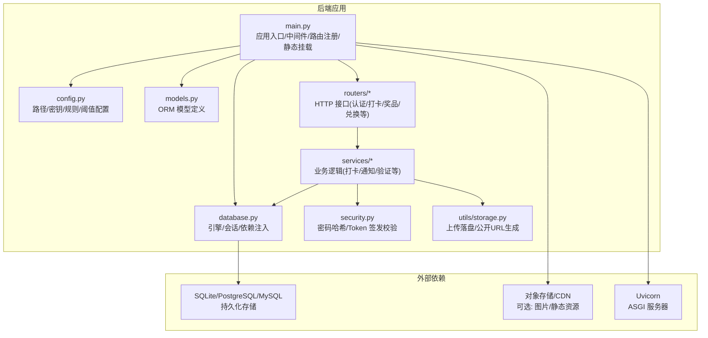
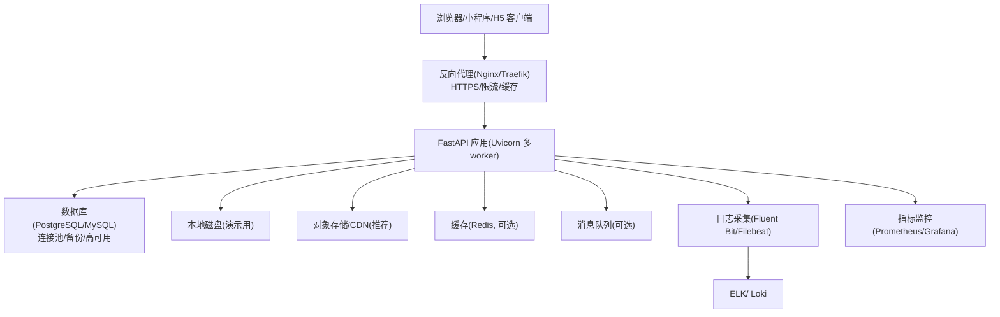
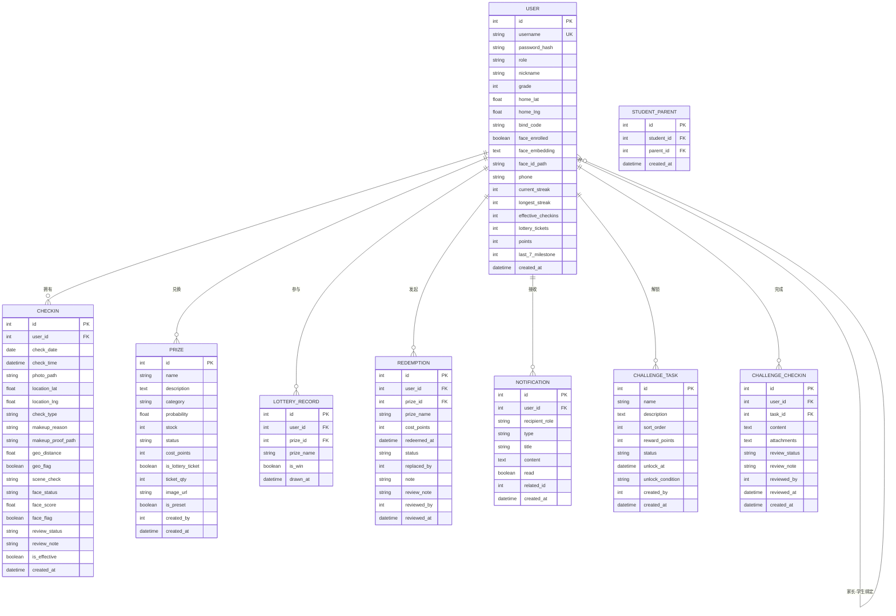
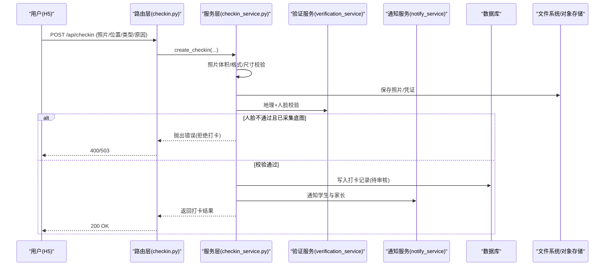
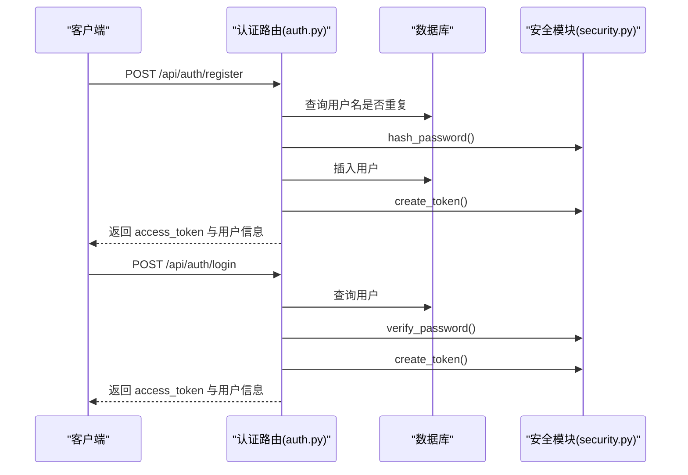
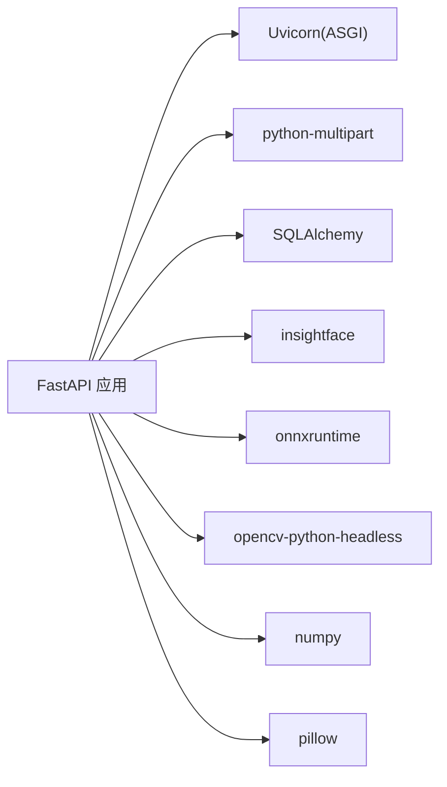

# 部署架构

<cite>
**本文引用的文件**   
- [summer-homework-checkin/backend/app/main.py](file://summer-homework-checkin/backend/app/main.py)
- [summer-homework-checkin/backend/app/config.py](file://summer-homework-checkin/backend/app/config.py)
- [summer-homework-checkin/backend/app/database.py](file://summer-homework-checkin/backend/app/database.py)
- [summer-homework-checkin/backend/requirements.txt](file://summer-homework-checkin/backend/requirements.txt)
- [summer-homework-checkin/backend/app/routers/auth.py](file://summer-homework-checkin/backend/app/routers/auth.py)
- [summer-homework-checkin/backend/app/routers/checkin.py](file://summer-homework-checkin/backend/app/routers/checkin.py)
- [summer-homework-checkin/backend/app/services/checkin_service.py](file://summer-homework-checkin/backend/app/services/checkin_service.py)
- [summer-homework-checkin/backend/app/models.py](file://summer-homework-checkin/backend/app/models.py)
- [summer-homework-checkin/backend/app/security.py](file://summer-homework-checkin/backend/app/security.py)
- [summer-homework-checkin/backend/app/utils/storage.py](file://summer-homework-checkin/backend/app/utils/storage.py)
- [summer-homework-checkin/backend/app/services/notify_service.py](file://summer-homework-checkin/backend/app/services/notify_service.py)
- [summer-homework-checkin/.gitignore](file://summer-homework-checkin/.gitignore)
- [summer-homework-checkin/README.md](file://summer-homework-checkin/README.md)
</cite>

## 目录
1. [简介](#简介)
2. [项目结构](#项目结构)
3. [核心组件](#核心组件)
4. [架构总览](#架构总览)
5. [详细组件分析](#详细组件分析)
6. [依赖分析](#依赖分析)
7. [性能考虑](#性能考虑)
8. [故障排查指南](#故障排查指南)
9. [结论](#结论)
10. [附录](#附录)

## 简介
本技术文档面向生产环境运维与交付，围绕“暑假作业打卡系统”的后端服务（FastAPI + SQLAlchemy）进行系统化说明。内容覆盖：Python 虚拟环境与依赖管理、数据库初始化与迁移策略、静态资源与上传文件托管、反向代理与 HTTPS、容器化部署方案、监控日志收集、性能优化与安全加固等关键实践，并提供部署架构图与环境配置清单，帮助快速搭建与维护生产环境。

## 项目结构
后端采用 FastAPI 应用组织方式，路由、服务、模型、工具与配置分层清晰；前端静态资源通过挂载方式由后端统一提供，便于单进程演示与简化部署。

图示来源
- [summer-homework-checkin/backend/app/main.py:1-49](file://summer-homework-checkin/backend/app/main.py#L1-L49)
- [summer-homework-checkin/backend/app/config.py:1-50](file://summer-homework-checkin/backend/app/config.py#L1-L50)
- [summer-homework-checkin/backend/app/database.py:1-22](file://summer-homework-checkin/backend/app/database.py#L1-L22)
- [summer-homework-checkin/backend/app/models.py:1-212](file://summer-homework-checkin/backend/app/models.py#L1-L212)
- [summer-homework-checkin/backend/app/security.py:1-47](file://summer-homework-checkin/backend/app/security.py#L1-L47)
- [summer-homework-checkin/backend/app/utils/storage.py:1-24](file://summer-homework-checkin/backend/app/utils/storage.py#L1-L24)
- [summer-homework-checkin/backend/app/services/checkin_service.py:1-254](file://summer-homework-checkin/backend/app/services/checkin_service.py#L1-L254)
- [summer-homework-checkin/backend/app/routers/auth.py:1-52](file://summer-homework-checkin/backend/app/routers/auth.py#L1-L52)
- [summer-homework-checkin/backend/app/routers/checkin.py:1-80](file://summer-homework-checkin/backend/app/routers/checkin.py#L1-L80)

章节来源
- [summer-homework-checkin/backend/app/main.py:1-49](file://summer-homework-checkin/backend/app/main.py#L1-L49)
- [summer-homework-checkin/backend/app/config.py:1-50](file://summer-homework-checkin/backend/app/config.py#L1-L50)
- [summer-homework-checkin/backend/app/database.py:1-22](file://summer-homework-checkin/backend/app/database.py#L1-L22)
- [summer-homework-checkin/backend/app/models.py:1-212](file://summer-homework-checkin/backend/app/models.py#L1-L212)
- [summer-homework-checkin/backend/app/security.py:1-47](file://summer-homework-checkin/backend/app/security.py#L1-L47)
- [summer-homework-checkin/backend/app/utils/storage.py:1-24](file://summer-homework-checkin/backend/app/utils/storage.py#L1-L24)
- [summer-homework-checkin/backend/app/services/checkin_service.py:1-254](file://summer-homework-checkin/backend/app/services/checkin_service.py#L1-L254)
- [summer-homework-checkin/backend/app/routers/auth.py:1-52](file://summer-homework-checkin/backend/app/routers/auth.py#L1-L52)
- [summer-homework-checkin/backend/app/routers/checkin.py:1-80](file://summer-homework-checkin/backend/app/routers/checkin.py#L1-L80)

## 核心组件
- 应用入口与中间件
  - 注册 CORS 中间件、挂载静态目录（学生端、管理后台、上传目录）、启动时创建表结构、暴露健康检查端点。
- 配置中心
  - 集中管理路径、密钥、阈值、人脸策略、积分与抽奖规则等，支持环境变量覆盖。
- 数据访问层
  - 基于 SQLAlchemy 的引擎与会话工厂，提供依赖注入 get_db。
- 安全模块
  - 密码哈希与 HMAC Token 签发/校验，签名密钥来自环境变量。
- 存储工具
  - 上传文件按用户分目录落盘，并生成可访问的相对 URL。
- 业务服务
  - 打卡流程（照片校验、补卡规则、地理与人脸校验、审核与积分发放、连续天数重算与抽奖资格发放）。
  - 站内通知服务（学生与家长绑定关系推送）。
- 路由层
  - 认证（注册/登录/获取当前用户）、打卡（提交/今日状态/连续天数/历史）、以及其它功能路由。

章节来源
- [summer-homework-checkin/backend/app/main.py:1-49](file://summer-homework-checkin/backend/app/main.py#L1-L49)
- [summer-homework-checkin/backend/app/config.py:1-50](file://summer-homework-checkin/backend/app/config.py#L1-L50)
- [summer-homework-checkin/backend/app/database.py:1-22](file://summer-homework-checkin/backend/app/database.py#L1-L22)
- [summer-homework-checkin/backend/app/security.py:1-47](file://summer-homework-checkin/backend/app/security.py#L1-L47)
- [summer-homework-checkin/backend/app/utils/storage.py:1-24](file://summer-homework-checkin/backend/app/utils/storage.py#L1-L24)
- [summer-homework-checkin/backend/app/services/checkin_service.py:1-254](file://summer-homework-checkin/backend/app/services/checkin_service.py#L1-L254)
- [summer-homework-checkin/backend/app/services/notify_service.py:1-20](file://summer-homework-checkin/backend/app/services/notify_service.py#L1-L20)
- [summer-homework-checkin/backend/app/routers/auth.py:1-52](file://summer-homework-checkin/backend/app/routers/auth.py#L1-L52)
- [summer-homework-checkin/backend/app/routers/checkin.py:1-80](file://summer-homework-checkin/backend/app/routers/checkin.py#L1-L80)

## 架构总览
下图展示生产环境的典型部署拓扑：客户端经反向代理访问后端 API 与静态资源，数据库独立部署，上传文件建议接入对象存储或 CDN，Uvicorn 多 worker 提升并发能力。

图示来源
- [summer-homework-checkin/backend/app/main.py:1-49](file://summer-homework-checkin/backend/app/main.py#L1-L49)
- [summer-homework-checkin/backend/app/config.py:1-50](file://summer-homework-checkin/backend/app/config.py#L1-L50)
- [summer-homework-checkin/backend/app/database.py:1-22](file://summer-homework-checkin/backend/app/database.py#L1-L22)
- [summer-homework-checkin/backend/app/utils/storage.py:1-24](file://summer-homework-checkin/backend/app/utils/storage.py#L1-L24)
- [summer-homework-checkin/README.md:120-126](file://summer-homework-checkin/README.md#L120-L126)

## 详细组件分析

### 应用入口与静态资源挂载
- 启动时自动创建数据库表结构，确保首次运行无需手动建库。
- 挂载三个静态目录：
  - /uploads：用户上传的图片与凭证
  - /admin：管理后台页面
  - /：学生端 H5 页面
- 提供 /api/health 健康检查端点，供负载均衡与健康探针使用。

章节来源
- [summer-homework-checkin/backend/app/main.py:1-49](file://summer-homework-checkin/backend/app/main.py#L1-L49)

### 配置与环境变量
- 关键路径与目录：
  - 上传目录、学生端与管理端静态目录均基于 BASE_DIR 计算。
- 数据库：
  - 默认 SQLite，适合演示；生产建议替换为 PostgreSQL/MySQL。
- 安全与策略：
  - 签名密钥 SECRET 必须通过环境变量注入。
  - 打卡阈值、补卡上限、照片尺寸限制、人脸识别阈值与模式均可通过环境变量覆盖。
- 业务参数：
  - 暑假周期、积分规则、抽奖解锁阈值等。

章节来源
- [summer-homework-checkin/backend/app/config.py:1-50](file://summer-homework-checkin/backend/app/config.py#L1-L50)

### 数据库与初始化
- 引擎与会话：
  - 使用 create_engine 与 sessionmaker 构建连接与会话工厂，提供 get_db 依赖注入。
- 表结构：
  - 在应用启动时根据 ORM 模型自动创建所有表。
- 模型概览：
  - 用户、家长-孩子绑定、打卡记录、奖品、抽奖记录、兑换记录、通知、闯关任务与打卡记录等。

图示来源
- [summer-homework-checkin/backend/app/models.py:1-212](file://summer-homework-checkin/backend/app/models.py#L1-L212)
- [summer-homework-checkin/backend/app/database.py:1-22](file://summer-homework-checkin/backend/app/database.py#L1-L22)
- [summer-homework-checkin/backend/app/main.py:38-41](file://summer-homework-checkin/backend/app/main.py#L38-L41)

章节来源
- [summer-homework-checkin/backend/app/database.py:1-22](file://summer-homework-checkin/backend/app/database.py#L1-L22)
- [summer-homework-checkin/backend/app/models.py:1-212](file://summer-homework-checkin/backend/app/models.py#L1-L212)
- [summer-homework-checkin/backend/app/main.py:38-41](file://summer-homework-checkin/backend/app/main.py#L38-L41)

### 安全与鉴权
- 密码哈希：PBKDF2-SHA256，固定盐（演示用途），生产建议引入随机盐与更严格策略。
- Token 机制：HMAC 签名无状态令牌，包含用户 ID、角色与过期时间，密钥来自环境变量。
- 依赖注入：通过自定义依赖获取当前用户，用于受保护路由。

章节来源
- [summer-homework-checkin/backend/app/security.py:1-47](file://summer-homework-checkin/backend/app/security.py#L1-L47)
- [summer-homework-checkin/backend/app/routers/auth.py:1-52](file://summer-homework-checkin/backend/app/routers/auth.py#L1-L52)

### 上传与静态资源
- 上传落盘：按用户分目录保存，返回相对路径；对外通过 /uploads 前缀暴露。
- 静态资源：学生端与管理端分别挂载到 / 与 /admin，HTML 直出。
- 生产建议：将 /uploads 与静态资源迁移至对象存储/CDN，后端仅保留 API。

章节来源
- [summer-homework-checkin/backend/app/utils/storage.py:1-24](file://summer-homework-checkin/backend/app/utils/storage.py#L1-L24)
- [summer-homework-checkin/backend/app/main.py:43-48](file://summer-homework-checkin/backend/app/main.py#L43-L48)

### 打卡业务流程（含人脸与地理校验）

图示来源
- [summer-homework-checkin/backend/app/routers/checkin.py:1-80](file://summer-homework-checkin/backend/app/routers/checkin.py#L1-L80)
- [summer-homework-checkin/backend/app/services/checkin_service.py:1-254](file://summer-homework-checkin/backend/app/services/checkin_service.py#L1-L254)
- [summer-homework-checkin/backend/app/services/notify_service.py:1-20](file://summer-homework-checkin/backend/app/services/notify_service.py#L1-L20)
- [summer-homework-checkin/backend/app/utils/storage.py:1-24](file://summer-homework-checkin/backend/app/utils/storage.py#L1-L24)

章节来源
- [summer-homework-checkin/backend/app/routers/checkin.py:1-80](file://summer-homework-checkin/backend/app/routers/checkin.py#L1-L80)
- [summer-homework-checkin/backend/app/services/checkin_service.py:1-254](file://summer-homework-checkin/backend/app/services/checkin_service.py#L1-L254)
- [summer-homework-checkin/backend/app/services/notify_service.py:1-20](file://summer-homework-checkin/backend/app/services/notify_service.py#L1-L20)

### 认证流程

图示来源
- [summer-homework-checkin/backend/app/routers/auth.py:1-52](file://summer-homework-checkin/backend/app/routers/auth.py#L1-L52)
- [summer-homework-checkin/backend/app/security.py:1-47](file://summer-homework-checkin/backend/app/security.py#L1-L47)

章节来源
- [summer-homework-checkin/backend/app/routers/auth.py:1-52](file://summer-homework-checkin/backend/app/routers/auth.py#L1-L52)
- [summer-homework-checkin/backend/app/security.py:1-47](file://summer-homework-checkin/backend/app/security.py#L1-L47)

## 依赖分析
- Python 包依赖
  - Web 框架与 ASGI：fastapi、uvicorn[standard]
  - 表单解析：python-multipart
  - ORM：SQLAlchemy>=2.0
  - 人脸识别推理：insightface、onnxruntime、opencv-python-headless、numpy、pillow
- 运行时依赖
  - 操作系统库（OpenCV/ONNXRuntime 需要底层依赖）
  - 外网访问（首次下载人脸模型）

图示来源
- [summer-homework-checkin/backend/requirements.txt:1-11](file://summer-homework-checkin/backend/requirements.txt#L1-L11)

章节来源
- [summer-homework-checkin/backend/requirements.txt:1-11](file://summer-homework-checkin/backend/requirements.txt#L1-L11)

## 性能考虑
- 服务层
  - 使用 Uvicorn 多 worker 提升并发处理能力。
  - 对 CPU 密集的人脸识别推理，建议单独部署推理服务或使用 GPU 加速（视硬件条件）。
- 存储层
  - 生产环境建议切换至 PostgreSQL/MySQL，并启用连接池与读写分离（读多写少场景）。
  - 上传文件迁移至对象存储/CDN，减少后端 IO 压力。
- 缓存与异步
  - 热点数据（如排行榜、统计报表）可引入 Redis 缓存。
  - 通知与报表导出等耗时任务可异步化（消息队列）。
- 前端静态资源
  - 开启压缩与缓存头，配合 CDN 分发。

章节来源
- [summer-homework-checkin/README.md:120-126](file://summer-homework-checkin/README.md#L120-L126)

## 故障排查指南
- 常见问题定位
  - 人脸模型缺失导致服务不可用：确认网络可达或预置模型；参考 README 中关于降级策略的说明。
  - 上传失败：检查 uploads 目录权限与磁盘空间；若迁移至对象存储，核对凭据与桶策略。
  - 数据库锁/并发异常：SQLite 在高并发下易出现锁竞争，应切换至 PG/MySQL。
  - 跨域问题：确认 CORS 配置在生产环境按需收紧。
- 健康检查
  - 使用 /api/health 探测服务存活。
- 日志与告警
  - 收集应用日志与错误堆栈，结合反向代理访问日志统一上送日志平台。
  - 设置关键指标（QPS、延迟、错误率、CPU/内存、磁盘 IO）告警。

章节来源
- [summer-homework-checkin/backend/app/main.py:33-36](file://summer-homework-checkin/backend/app/main.py#L33-L36)
- [summer-homework-checkin/README.md:105-126](file://summer-homework-checkin/README.md#L105-L126)

## 结论
本系统以 FastAPI 为核心，具备清晰的模块化结构与可扩展的业务能力。生产环境建议采用“反向代理 + Uvicorn 多 worker + 外部数据库 + 对象存储/CDN + 日志监控”的标准架构，并通过环境变量实现灵活配置与最小化侵入式改造。在此基础上，可平滑扩展通知渠道、人脸识别精度与横向扩容能力。

## 附录

### 生产环境部署清单（示例）
- 基础环境
  - OS：Linux（Ubuntu/CentOS/Alpine 等）
  - Python：3.10+（建议使用 pyenv 或系统包管理器安装）
  - 虚拟环境：venv 或 conda
  - 进程管理：systemd 或 supervisor
- 依赖安装
  - pip install -r backend/requirements.txt
  - 确保系统级依赖满足 OpenCV/ONNXRuntime 要求
- 环境变量（至少）
  - SUMMER_SECRET：强随机字符串
  - DATABASE_URL：生产数据库连接串（PG/MySQL）
  - GEO_THRESHOLD_METERS、MAX_MAKEUP_PER_MONTH、CHECKIN_POINTS、MAKEUP_POINTS、FACE_MATCH_THRESHOLD、FACE_MODE_ON_ENROLLED 等
- 数据库初始化
  - 切换 DATABASE_URL 后重启服务，应用启动时将自动建表
- 静态资源与上传
  - 开发：使用后端挂载 /uploads、/admin、/
  - 生产：将 /uploads 与静态资源迁移至对象存储/CDN，并在反向代理层配置域名与缓存策略
- 反向代理与 HTTPS
  - 配置域名、SSL 证书、Gzip/Brotli 压缩、缓存控制、限流与访问白名单
- 容器化（Docker）
  - 构建镜像：基于 python:slim 或官方 uvicorn 镜像，复制代码与 requirements，安装依赖，暴露端口
  - 编排：docker-compose 或 Kubernetes Deployment/Service/Ingress
  - 数据卷：持久化数据库文件（如仍使用 SQLite）或挂载外部数据库
- 监控与日志
  - 应用日志：结构化输出（JSON），统一采集
  - 指标：Prometheus 抓取（可通过中间件或 SDK 暴露）
  - 告警：Grafana 面板与告警规则
- 安全加固
  - 最小权限原则（文件系统、数据库账号）
  - 输入校验与大小限制（照片体积/尺寸）
  - 收紧 CORS 与请求源
  - 定期轮换密钥与令牌有效期

章节来源
- [summer-homework-checkin/backend/requirements.txt:1-11](file://summer-homework-checkin/backend/requirements.txt#L1-L11)
- [summer-homework-checkin/backend/app/config.py:1-50](file://summer-homework-checkin/backend/app/config.py#L1-L50)
- [summer-homework-checkin/backend/app/main.py:1-49](file://summer-homework-checkin/backend/app/main.py#L1-L49)
- [summer-homework-checkin/backend/app/database.py:1-22](file://summer-homework-checkin/backend/app/database.py#L1-L22)
- [summer-homework-checkin/backend/app/utils/storage.py:1-24](file://summer-homework-checkin/backend/app/utils/storage.py#L1-L24)
- [summer-homework-checkin/README.md:120-126](file://summer-homework-checkin/README.md#L120-L126)