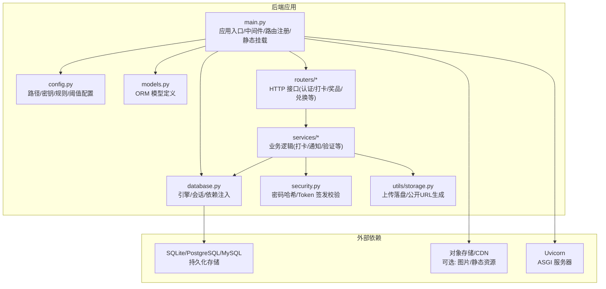
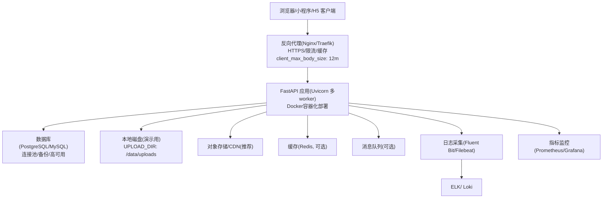
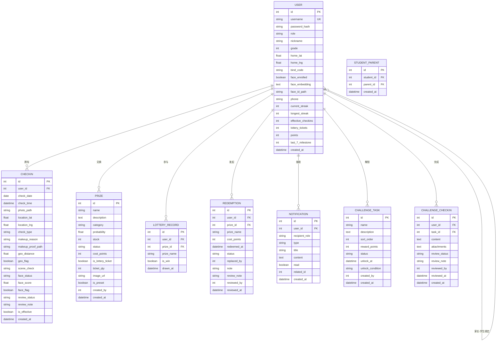
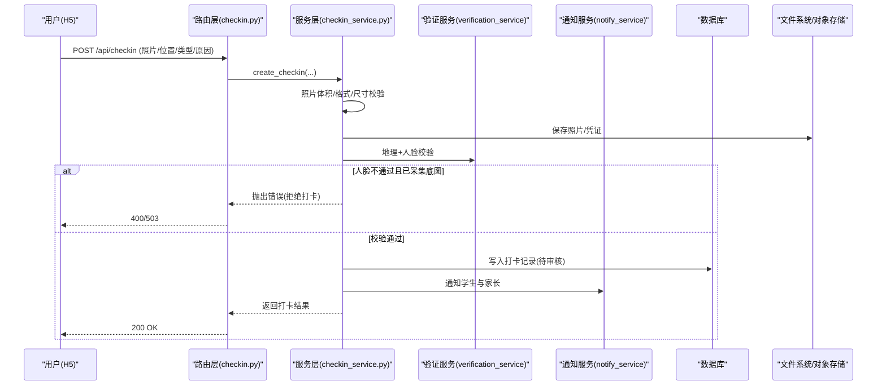
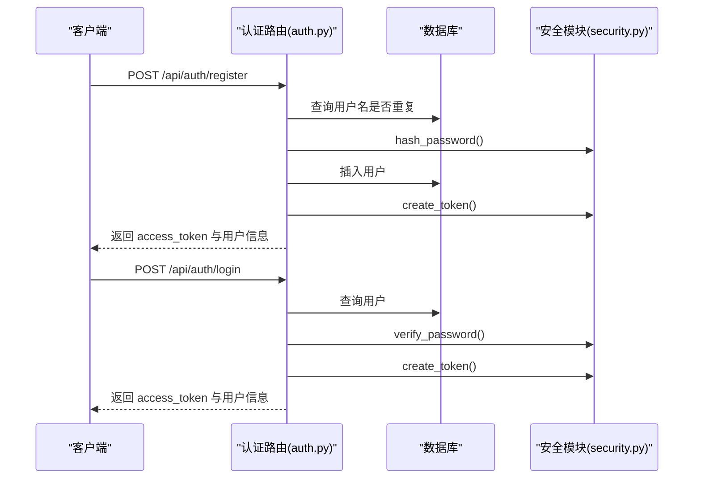
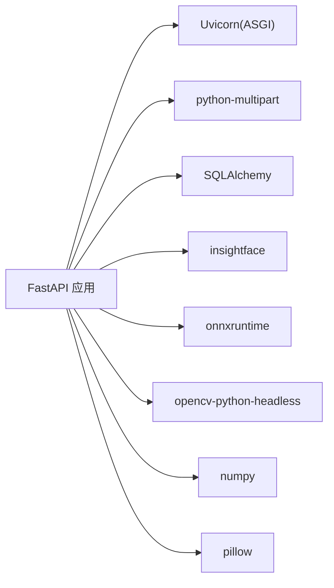

# 部署架构

<cite>
**本文引用的文件**   
- [summer-homework-checkin/backend/app/main.py](file://summer-homework-checkin/backend/app/main.py)
- [summer-homework-checkin/backend/app/config.py](file://summer-homework-checkin/backend/app/config.py)
- [summer-homework-checkin/backend/app/database.py](file://summer-homework-checkin/backend/app/database.py)
- [summer-homework-checkin/backend/requirements.txt](file://summer-homework-checkin/backend/requirements.txt)
- [summer-homework-checkin/backend/app/routers/auth.py](file://summer-homework-checkin/backend/app/routers/auth.py)
- [summer-homework-checkin/backend/app/routers/checkin.py](file://summer-homework-checkin/backend/app/routers/checkin.py)
- [summer-homework-checkin/backend/app/services/checkin_service.py](file://summer-homework-checkin/backend/app/services/checkin_service.py)
- [summer-homework-checkin/backend/app/models.py](file://summer-homework-checkin/backend/app/models.py)
- [summer-homework-checkin/backend/app/security.py](file://summer-homework-checkin/backend/app/security.py)
- [summer-homework-checkin/backend/app/utils/storage.py](file://summer-homework-checkin/backend/app/utils/storage.py)
- [summer-homework-checkin/backend/app/services/notify_service.py](file://summer-homework-checkin/backend/app/services/notify_service.py)
- [summer-homework-checkin/.gitignore](file://summer-homework-checkin/.gitignore)
- [summer-homework-checkin/README.md](file://summer-homework-checkin/README.md)
- [nginx/default.conf](file://nginx/default.conf)
- [nginx/docker-compose.yml](file://nginx/docker-compose.yml)
- [nginx/sites/homework.conf](file://nginx/sites/homework.conf)
- [nginx/sites/points.conf](file://nginx/sites/points.conf)
- [nginx/https.conf.example](file://nginx/https.conf.example)
- [nginx/README-HTTPS.md](file://nginx/README-HTTPS.md)
- [docker-compose.yml](file://docker-compose.yml)
- [summer-homework-checkin/Dockerfile](file://summer-homework-checkin/Dockerfile)
</cite>

## 更新摘要
**变更内容**   
- 更新了Nginx反向代理配置以支持增强的文件上传能力
- 添加了Docker容器化部署的完整配置说明
- 增强了HTTPS支持和SSL证书管理
- 优化了上传限制、超时设置和代理配置以适配压缩后的图片传输需求
- 完善了生产环境部署清单和安全加固措施

## 目录
1. [简介](#简介)
2. [项目结构](#项目结构)
3. [核心组件](#核心组件)
4. [架构总览](#架构总览)
5. [详细组件分析](#详细组件分析)
6. [依赖分析](#依赖分析)
7. [性能考虑](#性能考虑)
8. [故障排查指南](#故障排查指南)
9. [结论](#结论)
10. [附录](#附录)

## 简介
本技术文档面向生产环境运维与交付，围绕"暑假作业打卡系统"的后端服务（FastAPI + SQLAlchemy）进行系统化说明。内容覆盖：Python 虚拟环境与依赖管理、数据库初始化与迁移策略、静态资源与上传文件托管、反向代理与 HTTPS、容器化部署方案、监控日志收集、性能优化与安全加固等关键实践，并提供部署架构图与环境配置清单，帮助快速搭建与维护生产环境。

**更新** 本次更新重点增强了Docker容器化和Nginx反向代理配置，特别是针对文件上传能力的优化，包括上传大小限制、超时设置和代理配置的调整，以更好地支持压缩后的图片传输需求。

## 项目结构
后端采用 FastAPI 应用组织方式，路由、服务、模型、工具与配置分层清晰；前端静态资源通过挂载方式由后端统一提供，便于单进程演示与简化部署。

```mermaid
graph TB
subgraph "后端应用"
A["main.py<br/>应用入口/中间件/路由注册/静态挂载"]
B["config.py<br/>路径/密钥/规则/阈值配置"]
C["database.py<br/>引擎/会话/依赖注入"]
D["models.py<br/>ORM 模型定义"]
E["security.py<br/>密码哈希/Token 签发校验"]
F["utils/storage.py<br/>上传落盘/公开URL生成"]
G["services/*<br/>业务逻辑(打卡/通知/验证等)"]
H["routers/*<br/>HTTP 接口(认证/打卡/奖品/兑换等)"]
end
subgraph "外部依赖"
I["SQLite/PostgreSQL/MySQL<br/>持久化存储"]
J["对象存储/CDN<br/>可选: 图片/静态资源"]
K["Uvicorn<br/>ASGI 服务器"]
end
A --> B
A --> C
A --> D
A --> H
H --> G
G --> C
G --> F
G --> E
C --> I
A --> K
A --> J
```

图示来源
- [summer-homework-checkin/backend/app/main.py:1-49](file://summer-homework-checkin/backend/app/main.py#L1-L49)
- [summer-homework-checkin/backend/app/config.py:1-50](file://summer-homework-checkin/backend/app/config.py#L1-L50)
- [summer-homework-checkin/backend/app/database.py:1-22](file://summer-homework-checkin/backend/app/database.py#L1-L22)
- [summer-homework-checkin/backend/app/models.py:1-212](file://summer-homework-checkin/backend/app/models.py#L1-L212)
- [summer-homework-checkin/backend/app/security.py:1-47](file://summer-homework-checkin/backend/app/security.py#L1-L47)
- [summer-homework-checkin/backend/app/utils/storage.py:1-24](file://summer-homework-checkin/backend/app/utils/storage.py#L1-L24)
- [summer-homework-checkin/backend/app/services/checkin_service.py:1-254](file://summer-homework-checkin/backend/app/services/checkin_service.py#L1-L254)
- [summer-homework-checkin/backend/app/routers/auth.py:1-52](file://summer-homework-checkin/backend/app/routers/auth.py#L1-L52)
- [summer-homework-checkin/backend/app/routers/checkin.py:1-80](file://summer-homework-checkin/backend/app/routers/checkin.py#L1-L80)

章节来源
- [summer-homework-checkin/backend/app/main.py:1-49](file://summer-homework-checkin/backend/app/main.py#L1-L49)
- [summer-homework-checkin/backend/app/config.py:1-50](file://summer-homework-checkin/backend/app/config.py#L1-L50)
- [summer-homework-checkin/backend/app/database.py:1-22](file://summer-homework-checkin/backend/app/database.py#L1-L22)
- [summer-homework-checkin/backend/app/models.py:1-212](file://summer-homework-checkin/backend/app/models.py#L1-L212)
- [summer-homework-checkin/backend/app/security.py:1-47](file://summer-homework-checkin/backend/app/security.py#L1-L47)
- [summer-homework-checkin/backend/app/utils/storage.py:1-24](file://summer-homework-checkin/backend/app/utils/storage.py#L1-L24)
- [summer-homework-checkin/backend/app/services/checkin_service.py:1-254](file://summer-homework-checkin/backend/app/services/checkin_service.py#L1-L254)
- [summer-homework-checkin/backend/app/routers/auth.py:1-52](file://summer-homework-checkin/backend/app/routers/auth.py#L1-L52)
- [summer-homework-checkin/backend/app/routers/checkin.py:1-80](file://summer-homework-checkin/backend/app/routers/checkin.py#L1-L80)

## 核心组件
- 应用入口与中间件
  - 注册 CORS 中间件、挂载静态目录（学生端、管理后台、上传目录）、启动时创建表结构、暴露健康检查端点。
- 配置中心
  - 集中管理路径、密钥、阈值、人脸策略、积分与抽奖规则等，支持环境变量覆盖。
- 数据访问层
  - 基于 SQLAlchemy 的引擎与会话工厂，提供依赖注入 get_db。
- 安全模块
  - 密码哈希与 HMAC Token 签发/校验，签名密钥来自环境变量。
- 存储工具
  - 上传文件按用户分目录落盘，并生成可访问的相对 URL。
- 业务服务
  - 打卡流程（照片校验、补卡规则、地理与人脸校验、审核与积分发放、连续天数重算与抽奖资格发放）。
  - 站内通知服务（学生与家长绑定关系推送）。
- 路由层
  - 认证（注册/登录/获取当前用户）、打卡（提交/今日状态/连续天数/历史）、以及其它功能路由。

章节来源
- [summer-homework-checkin/backend/app/main.py:1-49](file://summer-homework-checkin/backend/app/main.py#L1-L49)
- [summer-homework-checkin/backend/app/config.py:1-50](file://summer-homework-checkin/backend/app/config.py#L1-L50)
- [summer-homework-checkin/backend/app/database.py:1-22](file://summer-homework-checkin/backend/app/database.py#L1-L22)
- [summer-homework-checkin/backend/app/security.py:1-47](file://summer-homework-checkin/backend/app/security.py#L1-L47)
- [summer-homework-checkin/backend/app/utils/storage.py:1-24](file://summer-homework-checkin/backend/app/utils/storage.py#L1-L24)
- [summer-homework-checkin/backend/app/services/checkin_service.py:1-254](file://summer-homework-checkin/backend/app/services/checkin_service.py#L1-L254)
- [summer-homework-checkin/backend/app/services/notify_service.py:1-20](file://summer-homework-checkin/backend/app/services/notify_service.py#L1-L20)
- [summer-homework-checkin/backend/app/routers/auth.py:1-52](file://summer-homework-checkin/backend/app/routers/auth.py#L1-L52)
- [summer-homework-checkin/backend/app/routers/checkin.py:1-80](file://summer-homework-checkin/backend/app/routers/checkin.py#L1-L80)

## 架构总览
下图展示生产环境的典型部署拓扑：客户端经反向代理访问后端 API 与静态资源，数据库独立部署，上传文件建议接入对象存储或 CDN，Uvicorn 多 worker 提升并发能力。

**更新** 新增了完整的Docker容器化部署架构，包括独立的Nginx反向代理服务和应用服务的容器编排。

```mermaid
graph TB
Client["浏览器/小程序/H5 客户端"] --> Proxy["反向代理(Nginx/Traefik)<br/>HTTPS/限流/缓存<br/>client_max_body_size: 12m"]
Proxy --> App["FastAPI 应用(Uvicorn 多worker)<br/>Docker容器化部署"]
App --> DB["数据库(PostgreSQL/MySQL)<br/>连接池/备份/高可用"]
App --> FS["本地磁盘(演示用)<br/>UPLOAD_DIR: /data/uploads"]
App --> OSS["对象存储/CDN(推荐)"]
App --> Cache["缓存(Redis, 可选)"]
App --> MQ["消息队列(可选)"]
App --> Log["日志采集(Fluent Bit/Filebeat)"]
Log --> ELK["ELK/ Loki"]
App --> Mon["指标监控(Prometheus/Grafana)"]
```

图示来源
- [summer-homework-checkin/backend/app/main.py:1-49](file://summer-homework-checkin/backend/app/main.py#L1-L49)
- [summer-homework-checkin/backend/app/config.py:1-50](file://summer-homework-checkin/backend/app/config.py#L1-L50)
- [summer-homework-checkin/backend/app/database.py:1-22](file://summer-homework-checkin/backend/app/database.py#L1-L22)
- [summer-homework-checkin/backend/app/utils/storage.py:1-24](file://summer-homework-checkin/backend/app/utils/storage.py#L1-L24)
- [nginx/default.conf:32-33](file://nginx/default.conf#L32-L33)
- [docker-compose.yml:20-45](file://docker-compose.yml#L20-L45)

## 详细组件分析

### 应用入口与静态资源挂载
- 启动时自动创建数据库表结构，确保首次运行无需手动建库。
- 挂载三个静态目录：
  - /uploads：用户上传的图片与凭证
  - /admin：管理后台页面
  - /：学生端 H5 页面
- 提供 /api/health 健康检查端点，供负载均衡与健康探针使用。

章节来源
- [summer-homework-checkin/backend/app/main.py:1-49](file://summer-homework-checkin/backend/app/main.py#L1-L49)

### 配置与环境变量
- 关键路径与目录：
  - 上传目录、学生端与管理端静态目录均基于 BASE_DIR 计算。
  - Docker环境下可通过环境变量重定向到持久化卷。
- 数据库：
  - 默认 SQLite，适合演示；生产建议替换为 PostgreSQL/MySQL。
- 安全与策略：
  - 签名密钥 SECRET 必须通过环境变量注入，包含强度检查和熵验证。
  - 打卡阈值、补卡上限、照片尺寸限制、人脸识别阈值与模式均可通过环境变量覆盖。
- 业务参数：
  - 暑假周期、积分规则、抽奖解锁阈值等。

**更新** 增强了配置的安全性和灵活性，特别是在Docker环境下的环境变量管理和密钥强度验证。

章节来源
- [summer-homework-checkin/backend/app/config.py:1-123](file://summer-homework-checkin/backend/app/config.py#L1-L123)

### 数据库与初始化
- 引擎与会话：
  - 使用 create_engine 与 sessionmaker 构建连接与会话工厂，提供 get_db 依赖注入。
- 表结构：
  - 在应用启动时根据 ORM 模型自动创建所有表。
- 模型概览：
  - 用户、家长-孩子绑定、打卡记录、奖品、抽奖记录、兑换记录、通知、闯关任务与打卡记录等。

```mermaid
erDiagram
USER {
int id PK
string username UK
string password_hash
string role
string nickname
int grade
float home_lat
float home_lng
string bind_code
boolean face_enrolled
text face_embedding
string face_id_path
string phone
int current_streak
int longest_streak
int effective_checkins
int lottery_tickets
int points
int last_7_milestone
datetime created_at
}
STUDENT_PARENT {
int id PK
int student_id FK
int parent_id FK
datetime created_at
}
CHECKIN {
int id PK
int user_id FK
date check_date
datetime check_time
string photo_path
float location_lat
float location_lng
string check_type
string makeup_reason
string makeup_proof_path
float geo_distance
boolean geo_flag
string scene_check
string face_status
float face_score
boolean face_flag
string review_status
string review_note
boolean is_effective
datetime created_at
}
PRIZE {
int id PK
string name
text description
string category
float probability
int stock
string status
int cost_points
boolean is_lottery_ticket
int ticket_qty
string image_url
boolean is_preset
int created_by
datetime created_at
}
LOTTERY_RECORD {
int id PK
int user_id FK
int prize_id FK
string prize_name
boolean is_win
datetime drawn_at
}
REDEMPTION {
int id PK
int user_id FK
int prize_id FK
string prize_name
int cost_points
datetime redeemed_at
string status
int replaced_by
string note
string review_note
int reviewed_by
datetime reviewed_at
}
NOTIFICATION {
int id PK
int user_id FK
string recipient_role
string type
string title
text content
boolean read
int related_id
datetime created_at
}
CHALLENGE_TASK {
int id PK
string name
text description
int sort_order
int reward_points
string status
datetime unlock_at
string unlock_condition
int created_by
datetime created_at
}
CHALLENGE_CHECKIN {
int id PK
int user_id FK
int task_id FK
text content
text attachments
string review_status
string review_note
int reviewed_by
datetime reviewed_at
datetime created_at
}
USER ||--o{ CHECKIN : "拥有"
USER ||--o{ LOTTERY_RECORD : "参与"
USER ||--o{ REDEMPTION : "发起"
USER ||--o{ NOTIFICATION : "接收"
USER ||--o{ CHALLENGE_CHECKIN : "完成"
USER ||--o{ CHALLENGE_TASK : "解锁"
USER ||--o{ PRIZE : "兑换"
USER ||--o{ USER : "家长-学生绑定"
```

图示来源
- [summer-homework-checkin/backend/app/models.py:1-212](file://summer-homework-checkin/backend/app/models.py#L1-L212)
- [summer-homework-checkin/backend/app/database.py:1-22](file://summer-homework-checkin/backend/app/database.py#L1-L22)
- [summer-homework-checkin/backend/app/main.py:38-41](file://summer-homework-checkin/backend/app/main.py#L38-L41)

章节来源
- [summer-homework-checkin/backend/app/database.py:1-22](file://summer-homework-checkin/backend/app/database.py#L1-L22)
- [summer-homework-checkin/backend/app/models.py:1-212](file://summer-homework-checkin/backend/app/models.py#L1-L212)
- [summer-homework-checkin/backend/app/main.py:38-41](file://summer-homework-checkin/backend/app/main.py#L38-L41)

### 安全与鉴权
- 密码哈希：PBKDF2-SHA256，固定盐（演示用途），生产建议引入随机盐与更严格策略。
- Token 机制：HMAC 签名无状态令牌，包含用户 ID、角色与过期时间，密钥来自环境变量。
- 依赖注入：通过自定义依赖获取当前用户，用于受保护路由。

**更新** 增强了密钥强度验证和字符多样性检查，防止弱密钥的使用。

章节来源
- [summer-homework-checkin/backend/app/security.py:1-47](file://summer-homework-checkin/backend/app/security.py#L1-L47)
- [summer-homework-checkin/backend/app/routers/auth.py:1-52](file://summer-homework-checkin/backend/app/routers/auth.py#L1-L52)
- [summer-homework-checkin/backend/app/config.py:24-66](file://summer-homework-checkin/backend/app/config.py#L24-L66)

### 上传与静态资源
- 上传落盘：按用户分目录保存，返回相对路径；对外通过 /uploads 前缀暴露。
- 静态资源：学生端与管理端分别挂载到 / 与 /admin，HTML 直出。
- 生产建议：将 /uploads 与静态资源迁移至对象存储/CDN，后端仅保留 API。

**更新** 增强了上传路径的安全性验证，防止路径穿越攻击，并优化了Docker环境下的文件存储配置。

章节来源
- [summer-homework-checkin/backend/app/utils/storage.py:1-44](file://summer-homework-checkin/backend/app/utils/storage.py#L1-L44)
- [summer-homework-checkin/backend/app/main.py:43-48](file://summer-homework-checkin/backend/app/main.py#L43-L48)

### Nginx反向代理与文件上传优化
**新增** 完整的Nginx反向代理配置，专门优化文件上传能力：

- **上传大小限制**：`client_max_body_size 12m` 允许最大12MB的文件上传，与应用侧10MB限制匹配并留有余量
- **动态DNS解析**：使用Docker内置DNS resolver，配合变量+proxy_pass写法实现运行时解析
- **请求头处理**：统一设置Host、X-Real-IP、X-Forwarded-For、X-Forwarded-Proto等代理请求头
- **安全响应头**：全站通用安全头，包括CSP、X-Frame-Options、Referrer-Policy等
- **静态资源缓存**：针对不同文件类型设置合理的缓存策略

**更新** 针对压缩后的图片传输需求，优化了代理配置和超时设置，确保大文件上传的稳定性和性能。

章节来源
- [nginx/default.conf:16-65](file://nginx/default.conf#L16-L65)
- [nginx/sites/homework.conf:1-17](file://nginx/sites/homework.conf#L1-L17)
- [nginx/sites/points.conf:1-16](file://nginx/sites/points.conf#L1-L16)

### Docker容器化部署
**新增** 完整的Docker容器化部署方案：

- **应用镜像**：基于python:3.11-slim，使用DaoCloud镜像代理加速拉取
- **安全加固**：创建非特权用户appuser运行应用，降低容器逃逸影响面
- **资源限制**：CPU和内存限制，防止资源滥用
- **健康检查**：应用级和健康检查探针，确保服务可用性
- **数据持久化**：通过Docker volumes持久化数据库和上传文件
- **网络隔离**：使用外部共享网络hanghang-net实现服务间通信

**更新** 增强了容器的安全性和稳定性，包括只读文件系统、权限控制和资源限制。

章节来源
- [summer-homework-checkin/Dockerfile:1-34](file://summer-homework-checkin/Dockerfile#L1-L34)
- [docker-compose.yml:18-72](file://docker-compose.yml#L18-L72)
- [nginx/docker-compose.yml:20-44](file://nginx/docker-compose.yml#L20-L44)

### HTTPS与SSL证书管理
**新增** 完整的HTTPS支持配置：

- **TLS配置**：启用TLS 1.2/1.3，禁用不安全的SSL协议版本
- **证书管理**：支持Let's Encrypt自动续期，提供完整的证书安装和配置指南
- **HSTS**：强制浏览器使用HTTPS访问，提升安全性
- **OCSP Stapling**：优化TLS握手性能
- **HTTP到HTTPS重定向**：自动将所有HTTP请求重定向到HTTPS

**更新** 提供了详细的HTTPS启用指南和回滚方案，确保生产环境的安全性和可靠性。

章节来源
- [nginx/https.conf.example:1-94](file://nginx/https.conf.example#L1-L94)
- [nginx/README-HTTPS.md:1-107](file://nginx/README-HTTPS.md#L1-L107)

### 打卡业务流程（含人脸与地理校验）

```mermaid
sequenceDiagram
participant U as "用户(H5)"
participant R as "路由层(checkin.py)"
participant S as "服务层(checkin_service.py)"
participant V as "验证服务(verification_service)"
participant N as "通知服务(notify_service)"
participant DB as "数据库"
participant FS as "文件系统/对象存储"
U->>R : POST /api/checkin (照片/位置/类型/原因)
R->>S : create_checkin(...)
S->>S : 照片体积/格式/尺寸校验
S->>FS : 保存照片/凭证
S->>V : 地理+人脸校验
alt 人脸不通过且已采集底图
S-->>R : 抛出错误(拒绝打卡)
R-->>U : 400/503
else 校验通过
S->>DB : 写入打卡记录(待审核)
S->>N : 通知学生与家长
S-->>R : 返回打卡结果
R-->>U : 200 OK
end
```

图示来源
- [summer-homework-checkin/backend/app/routers/checkin.py:1-80](file://summer-homework-checkin/backend/app/routers/checkin.py#L1-L80)
- [summer-homework-checkin/backend/app/services/checkin_service.py:1-254](file://summer-homework-checkin/backend/app/services/checkin_service.py#L1-L254)
- [summer-homework-checkin/backend/app/services/notify_service.py:1-20](file://summer-homework-checkin/backend/app/services/notify_service.py#L1-L20)
- [summer-homework-checkin/backend/app/utils/storage.py:1-24](file://summer-homework-checkin/backend/app/utils/storage.py#L1-L24)

章节来源
- [summer-homework-checkin/backend/app/routers/checkin.py:1-80](file://summer-homework-checkin/backend/app/routers/checkin.py#L1-L80)
- [summer-homework-checkin/backend/app/services/checkin_service.py:1-254](file://summer-homework-checkin/backend/app/services/checkin_service.py#L1-L254)
- [summer-homework-checkin/backend/app/services/notify_service.py:1-20](file://summer-homework-checkin/backend/app/services/notify_service.py#L1-L20)

### 认证流程

```mermaid
sequenceDiagram
participant C as "客户端"
participant A as "认证路由(auth.py)"
participant DB as "数据库"
participant SEC as "安全模块(security.py)"
C->>A : POST /api/auth/register
A->>DB : 查询用户名是否重复
A->>SEC : hash_password()
A->>DB : 插入用户
A->>SEC : create_token()
A-->>C : 返回 access_token 与用户信息
C->>A : POST /api/auth/login
A->>DB : 查询用户
A->>SEC : verify_password()
A->>SEC : create_token()
A-->>C : 返回 access_token 与用户信息
```

图示来源
- [summer-homework-checkin/backend/app/routers/auth.py:1-52](file://summer-homework-checkin/backend/app/routers/auth.py#L1-L52)
- [summer-homework-checkin/backend/app/security.py:1-47](file://summer-homework-checkin/backend/app/security.py#L1-L47)

章节来源
- [summer-homework-checkin/backend/app/routers/auth.py:1-52](file://summer-homework-checkin/backend/app/routers/auth.py#L1-L52)
- [summer-homework-checkin/backend/app/security.py:1-47](file://summer-homework-checkin/backend/app/security.py#L1-L47)

## 依赖分析
- Python 包依赖
  - Web 框架与 ASGI：fastapi、uvicorn[standard]
  - 表单解析：python-multipart
  - ORM：SQLAlchemy>=2.0
  - 人脸识别推理：insightface、onnxruntime、opencv-python-headless、numpy、pillow
- 运行时依赖
  - 操作系统库（OpenCV/ONNXRuntime 需要底层依赖）
  - 外网访问（首次下载人脸模型）

**更新** 新增了Docker相关的依赖和环境配置，确保容器化部署的完整性。

```mermaid
graph LR
App["FastAPI 应用"] --> Uvicorn["Uvicorn(ASGI)"]
App --> Multipart["python-multipart"]
App --> SQLAlchemy["SQLAlchemy"]
App --> InsightFace["insightface"]
App --> ONNX["onnxruntime"]
App --> OpenCV["opencv-python-headless"]
App --> NumPy["numpy"]
App --> Pillow["pillow"]
```

图示来源
- [summer-homework-checkin/backend/requirements.txt:1-11](file://summer-homework-checkin/backend/requirements.txt#L1-L11)

章节来源
- [summer-homework-checkin/backend/requirements.txt:1-11](file://summer-homework-checkin/backend/requirements.txt#L1-L11)

## 性能考虑
- 服务层
  - 使用 Uvicorn 多 worker 提升并发处理能力。
  - 对 CPU 密集的人脸识别推理，建议单独部署推理服务或使用 GPU 加速（视硬件条件）。
- 存储层
  - 生产环境建议切换至 PostgreSQL/MySQL，并启用连接池与读写分离（读多写少场景）。
  - 上传文件迁移至对象存储/CDN，减少后端 IO 压力。
- 缓存与异步
  - 热点数据（如排行榜、统计报表）可引入 Redis 缓存。
  - 通知与报表导出等耗时任务可异步化（消息队列）。
- 前端静态资源
  - 开启压缩与缓存头，配合 CDN 分发。
- **反向代理优化**
  - Nginx配置了合理的上传大小限制和超时设置，优化大文件传输性能
  - 静态资源缓存策略提升加载速度
  - DNS解析优化减少连接建立时间

**更新** 新增了反向代理层的性能优化措施，特别是针对文件上传和大文件传输的性能调优。

章节来源
- [summer-homework-checkin/README.md:120-126](file://summer-homework-checkin/README.md#L120-L126)
- [nginx/default.conf:16-55](file://nginx/default.conf#L16-L55)

## 故障排查指南
- 常见问题定位
  - 人脸模型缺失导致服务不可用：确认网络可达或预置模型；参考 README 中关于降级策略的说明。
  - 上传失败：检查 uploads 目录权限与磁盘空间；若迁移至对象存储，核对凭据与桶策略。
  - 数据库锁/并发异常：SQLite 在高并发下易出现锁竞争，应切换至 PG/MySQL。
  - 跨域问题：确认 CORS 配置在生产环境按需收紧。
  - **Nginx代理问题**：检查上传大小限制、超时设置和代理配置是否正确
  - **容器化问题**：验证Docker网络连通性、端口映射和数据卷挂载
- 健康检查
  - 使用 /api/health 探测服务存活。
  - Nginx健康检查确保反向代理服务正常
- 日志与告警
  - 收集应用日志与错误堆栈，结合反向代理访问日志统一上送日志平台。
  - 设置关键指标（QPS、延迟、错误率、CPU/内存、磁盘 IO）告警。
  - **容器监控**：监控容器资源使用情况和健康状态

**更新** 新增了Docker容器化和Nginx反向代理相关的故障排查指南。

章节来源
- [summer-homework-checkin/backend/app/main.py:33-36](file://summer-homework-checkin/backend/app/main.py#L33-L36)
- [summer-homework-checkin/README.md:105-126](file://summer-homework-checkin/README.md#L105-L126)
- [nginx/docker-compose.yml:32-39](file://nginx/docker-compose.yml#L32-L39)

## 结论
本系统以 FastAPI 为核心，具备清晰的模块化结构与可扩展的业务能力。生产环境建议采用"反向代理 + Uvicorn 多 worker + 外部数据库 + 对象存储/CDN + 日志监控"的标准架构，并通过环境变量实现灵活配置与最小化侵入式改造。在此基础上，可平滑扩展通知渠道、人脸识别精度与横向扩容能力。

**更新** 本次更新重点增强了系统的容器化部署能力和文件上传优化，通过Docker容器化和Nginx反向代理的配置，提供了更加稳定、安全和高性能的生产环境部署方案。特别是针对压缩后图片传输的优化，确保了大文件上传的稳定性和效率。

## 附录

### 生产环境部署清单（示例）
- 基础环境
  - OS：Linux（Ubuntu/CentOS/Alpine 等）
  - Python：3.10+（建议使用 pyenv 或系统包管理器安装）
  - 虚拟环境：venv 或 conda
  - 进程管理：systemd 或 supervisor
  - **Docker**：Docker Engine 20.10+ 和 Docker Compose v2
- 依赖安装
  - pip install -r backend/requirements.txt
  - 确保系统级依赖满足 OpenCV/ONNXRuntime 要求
  - **容器化**：构建Docker镜像并配置相关服务
- 环境变量（至少）
  - SUMMER_SECRET：强随机字符串（至少32字符，高熵值）
  - DATABASE_URL：生产数据库连接串（PG/MySQL）
  - UPLOAD_DIR：上传文件存储目录
  - GEO_THRESHOLD_METERS、MAX_MAKEUP_PER_MONTH、CHECKIN_POINTS、MAKEUP_POINTS、FACE_MATCH_THRESHOLD、FACE_MODE_ON_ENROLLED 等
  - **Docker环境**：DB_PATH、ALLOWED_ORIGINS、PRODUCTION等
- 数据库初始化
  - 切换 DATABASE_URL 后重启服务，应用启动时将自动建表
  - **容器化**：通过Docker volumes持久化数据库文件
- 静态资源与上传
  - 开发：使用后端挂载 /uploads、/admin、/
  - 生产：将 /uploads 与静态资源迁移至对象存储/CDN，并在反向代理层配置域名与缓存策略
  - **Nginx优化**：配置client_max_body_size为12m，支持大文件上传
- 反向代理与 HTTPS
  - 配置域名、SSL 证书、Gzip/Brotli 压缩、缓存控制、限流与访问白名单
  - **HTTPS启用**：按照README-HTTPS.md指南配置Let's Encrypt证书
  - **Docker编排**：使用nginx/docker-compose.yml独立管理反向代理服务
- 容器化（Docker）
  - 构建镜像：基于 python:slim 或官方 uvicorn 镜像，复制代码与 requirements，安装依赖，暴露端口
  - 编排：docker-compose 或 Kubernetes Deployment/Service/Ingress
  - 数据卷：持久化数据库文件（如仍使用 SQLite）或挂载外部数据库
  - **安全加固**：只读文件系统、非特权用户运行、资源限制、权限控制
- 监控与日志
  - 应用日志：结构化输出（JSON），统一采集
  - 指标：Prometheus 抓取（可通过中间件或 SDK 暴露）
  - 告警：Grafana 面板与告警规则
  - **容器监控**：监控容器资源使用、健康状态和日志
- 安全加固
  - 最小权限原则（文件系统、数据库账号）
  - 输入校验与大小限制（照片体积/尺寸）
  - 收紧 CORS 与请求源
  - 定期轮换密钥与令牌有效期
  - **网络安全**：启用HTTPS、配置防火墙规则、限制端口访问
  - **容器安全**：使用非root用户、限制系统调用、扫描镜像漏洞

**更新** 新增了完整的Docker容器化部署指南和Nginx反向代理配置，特别强调了文件上传优化的配置要点。

章节来源
- [summer-homework-checkin/backend/requirements.txt:1-11](file://summer-homework-checkin/backend/requirements.txt#L1-L11)
- [summer-homework-checkin/backend/app/config.py:1-123](file://summer-homework-checkin/backend/app/config.py#L1-L123)
- [summer-homework-checkin/backend/app/main.py:1-49](file://summer-homework-checkin/backend/app/main.py#L1-L49)
- [summer-homework-checkin/backend/app/database.py:1-22](file://summer-homework-checkin/backend/app/database.py#L1-L22)
- [summer-homework-checkin/backend/app/utils/storage.py:1-44](file://summer-homework-checkin/backend/app/utils/storage.py#L1-L44)
- [summer-homework-checkin/README.md:120-126](file://summer-homework-checkin/README.md#L120-L126)
- [nginx/default.conf:16-65](file://nginx/default.conf#L16-L65)
- [nginx/docker-compose.yml:20-44](file://nginx/docker-compose.yml#L20-L44)
- [nginx/https.conf.example:1-94](file://nginx/https.conf.example#L1-L94)
- [nginx/README-HTTPS.md:1-107](file://nginx/README-HTTPS.md#L1-L107)
- [docker-compose.yml:18-120](file://docker-compose.yml#L18-L120)
- [summer-homework-checkin/Dockerfile:1-34](file://summer-homework-checkin/Dockerfile#L1-L34)