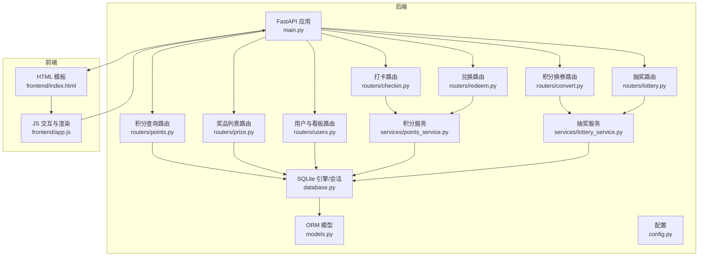
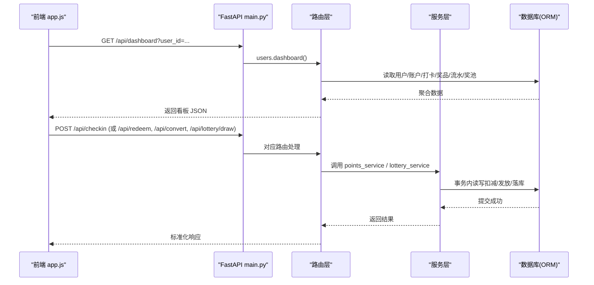
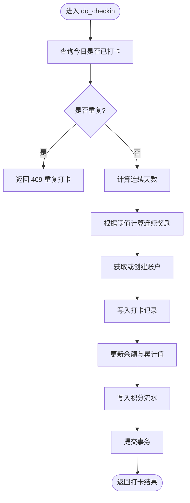
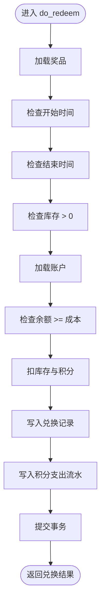
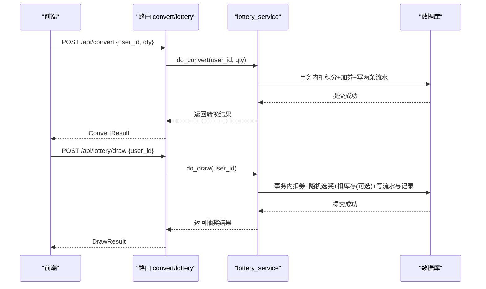
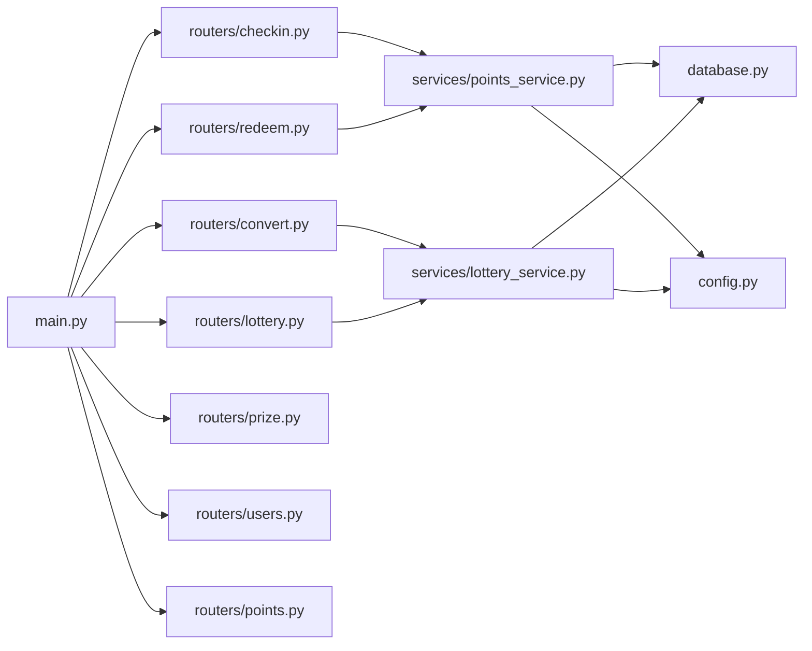

# 积分兑换系统介绍

<cite>
**本文引用的文件**   
- [main.py](file://points-system/backend/app/main.py)
- [config.py](file://points-system/backend/app/config.py)
- [database.py](file://points-system/backend/app/database.py)
- [models.py](file://points-system/backend/app/models.py)
- [schemas.py](file://points-system/backend/app/schemas.py)
- [run.py](file://points-system/backend/run.py)
- [checkin.py](file://points-system/backend/app/routers/checkin.py)
- [points.py](file://points-system/backend/app/routers/points.py)
- [redeem.py](file://points-system/backend/app/routers/redeem.py)
- [convert.py](file://points-system/backend/app/routers/convert.py)
- [lottery.py](file://points-system/backend/app/routers/lottery.py)
- [prize.py](file://points-system/backend/app/routers/prize.py)
- [users.py](file://points-system/backend/app/routers/users.py)
- [points_service.py](file://points-system/backend/app/services/points_service.py)
- [lottery_service.py](file://points-system/backend/app/services/lottery_service.py)
- [index.html](file://points-system/frontend/index.html)
- [app.js](file://points-system/frontend/app.js)
</cite>

## 目录
1. [简介](#简介)
2. [项目结构](#项目结构)
3. [核心组件](#核心组件)
4. [架构总览](#架构总览)
5. [详细组件分析](#详细组件分析)
6. [依赖关系分析](#依赖关系分析)
7. [性能与并发特性](#性能与并发特性)
8. [API 接口概览](#api-接口概览)
9. [前端页面功能说明](#前端页面功能说明)
10. [与主打卡系统的集成方式](#与主打卡系统的集成方式)
11. [故障排查指南](#故障排查指南)
12. [结论](#结论)

## 简介
本服务是一个独立的“积分兑换系统”后端，围绕用户积分账户、打卡奖励、积分兑换奖品、积分兑换抽奖券以及加权随机抽奖等核心业务构建。系统采用 FastAPI + SQLAlchemy（SQLite）技术栈，提供 RESTful API 与静态前端页面，支持多用户切换的看板体验。通过流水表记录每一笔积分与抽奖券变动，确保可追溯、可对账；通过事务与并发控制保证余额与库存的一致性。

## 项目结构
- 后端：FastAPI 应用，按路由分层组织，业务逻辑下沉至 services 层，数据模型与 Pydantic 模式分别位于 models.py 与 schemas.py。
- 数据库：SQLite，开启 WAL 与 busy_timeout，配合 Session 事务保障并发安全。
- 前端：单页 HTML + JS + CSS，由后端静态挂载，提供用户切换、打卡、积分兑换、抽奖转盘、奖品兑换与各类流水展示。



图表来源
- [main.py:1-33](file://points-system/backend/app/main.py#L1-L33)
- [database.py:1-39](file://points-system/backend/app/database.py#L1-L39)
- [models.py:1-151](file://points-system/backend/app/models.py#L1-L151)
- [config.py:1-17](file://points-system/backend/app/config.py#L1-L17)
- [checkin.py:1-16](file://points-system/backend/app/routers/checkin.py#L1-L16)
- [points.py:1-28](file://points-system/backend/app/routers/points.py#L1-L28)
- [redeem.py:1-52](file://points-system/backend/app/routers/redeem.py#L1-L52)
- [convert.py:1-64](file://points-system/backend/app/routers/convert.py#L1-L64)
- [lottery.py:1-55](file://points-system/backend/app/routers/lottery.py#L1-L55)
- [prize.py:1-42](file://points-system/backend/app/routers/prize.py#L1-L42)
- [users.py:1-192](file://points-system/backend/app/routers/users.py#L1-L192)
- [points_service.py:1-146](file://points-system/backend/app/services/points_service.py#L1-L146)
- [lottery_service.py:1-174](file://points-system/backend/app/services/lottery_service.py#L1-L174)
- [index.html:1-111](file://points-system/frontend/index.html#L1-L111)
- [app.js:1-598](file://points-system/frontend/app.js#L1-L598)

章节来源
- [main.py:1-33](file://points-system/backend/app/main.py#L1-L33)
- [run.py:1-6](file://points-system/backend/run.py#L1-L6)

## 核心组件
- 路由层：按业务域划分（打卡、积分、兑换、抽奖、奖品、用户），统一前缀 /api，标签化分组。
- 服务层：封装复杂业务规则与一致性约束（事务、并发锁、防重）。
- 数据层：SQLAlchemy ORM 模型定义，结合 SQLite 引擎与会话管理。
- 配置层：集中管理打卡奖励、连续奖励阈值、积分换券比例、单次抽奖消耗等策略。
- 前端：单页应用，通过 dashboard 聚合接口一次性加载所需数据，减少请求次数。

章节来源
- [schemas.py:1-147](file://points-system/backend/app/schemas.py#L1-L147)
- [config.py:1-17](file://points-system/backend/app/config.py#L1-L17)

## 架构总览
系统采用经典三层架构：路由层负责参数校验与响应组装，服务层实现领域逻辑与一致性保障，数据层通过 ORM 访问 SQLite。前端以静态资源形式由后端托管，通过 dashboard 聚合接口获取全量视图数据，提升用户体验。



图表来源
- [main.py:1-33](file://points-system/backend/app/main.py#L1-L33)
- [users.py:30-192](file://points-system/backend/app/routers/users.py#L30-L192)
- [checkin.py:11-16](file://points-system/backend/app/routers/checkin.py#L11-L16)
- [redeem.py:11-28](file://points-system/backend/app/routers/redeem.py#L11-L28)
- [convert.py:11-28](file://points-system/backend/app/routers/convert.py#L11-L28)
- [lottery.py:24-37](file://points-system/backend/app/routers/lottery.py#L24-L37)
- [points_service.py:41-91](file://points-system/backend/app/services/points_service.py#L41-L91)
- [lottery_service.py:117-174](file://points-system/backend/app/services/lottery_service.py#L117-L174)

## 详细组件分析

### 数据模型与关系
- 用户与账户：User 与 PointAccount 一对一，PointAccount 维护 balance、total_earned、total_spent、lottery_tickets。
- 流水：PointLedger 记录积分收支，LotteryTicketLedger 记录抽奖券发放与消耗。
- 打卡：CheckIn 唯一约束 (user_id, check_date) 防止重复打卡，并记录 streak 与 bonus。
- 奖品与兑换：Prize 与 Redemption 一对多，Redemption 快照 cost_points。
- 抽奖：LotteryPrize 定义权重与库存，LotteryDraw 记录每次抽奖结果。

```mermaid
erDiagram
USER {
int id PK
string username UK
string display_name
datetime created_at
}
POINT_ACCOUNT {
int id PK
int user_id FK UK
int balance
int total_earned
int total_spent
int lottery_tickets
datetime updated_at
}
POINT_LEDGER {
int id PK
int user_id FK
string tx_type
int amount
int balance_after
string ref_type
int ref_id
string note
datetime created_at
}
CHECKIN {
int id PK
int user_id FK
date check_date
int points_earned
int streak
int bonus
datetime created_at
}
PRIZE {
int id PK
string name
text description
int cost_points
int stock
datetime valid_from
datetime valid_to
datetime created_at
}
REDEMPTION {
int id PK
int user_id FK
int prize_id FK
int cost_points
string status
datetime created_at
}
CONVERSION {
int id PK
int user_id FK
int qty
int cost_points
string status
datetime created_at
}
LOTTERY_TICKET_LEDGER {
int id PK
int user_id FK
string tx_type
int amount
int balance_after
string ref_type
int ref_id
string note
datetime created_at
}
LOTTERY_PRIZE {
int id PK
string name
text description
int weight
int stock
int is_win
int sort_order
datetime created_at
}
LOTTERY_DRAW {
int id PK
int user_id FK
int prize_id FK
string prize_name
int is_win
datetime created_at
}
USER ||--o| POINT_ACCOUNT : "拥有"
USER ||--o{ POINT_LEDGER : "产生"
USER ||--o{ CHECKIN : "打卡"
USER ||--o{ REDEMPTION : "兑换"
USER ||--o{ CONVERSION : "兑换券"
USER ||--o{ LOTTERY_TICKET_LEDGER : "券流水"
USER ||--o{ LOTTERY_DRAW : "抽奖记录"
PRIZE ||--o{ REDEMPTION : "被兑换"
LOTTERY_PRIZE ||--o{ LOTTERY_DRAW : "作为奖品"
```

图表来源
- [models.py:10-151](file://points-system/backend/app/models.py#L10-L151)

章节来源
- [models.py:10-151](file://points-system/backend/app/models.py#L10-L151)

### 打卡与积分服务
- 打卡流程：计算连续天数、判断是否触发连续奖励、写入打卡记录、更新账户余额与累计值、写积分支出流水。
- 防重机制：先查后写 + 唯一约束兜底，异常捕获后回滚并返回冲突提示。
- 事务一致性：所有读改写在同一 Session 事务中完成，失败自动回滚。



图表来源
- [points_service.py:41-91](file://points-system/backend/app/services/points_service.py#L41-L91)
- [checkin.py:11-16](file://points-system/backend/app/routers/checkin.py#L11-L16)

章节来源
- [points_service.py:41-91](file://points-system/backend/app/services/points_service.py#L41-L91)
- [checkin.py:11-16](file://points-system/backend/app/routers/checkin.py#L11-L16)

### 积分兑换奖品服务
- 校验顺序：奖品存在性 → 有效期 → 库存 → 账户存在性与余额充足。
- 原子操作：在同一事务内扣减库存与积分，写入兑换记录与积分支出流水。
- 错误处理：各阶段失败均返回明确状态码与消息。



图表来源
- [points_service.py:94-146](file://points-system/backend/app/services/points_service.py#L94-L146)
- [redeem.py:11-28](file://points-system/backend/app/routers/redeem.py#L11-L28)

章节来源
- [points_service.py:94-146](file://points-system/backend/app/services/points_service.py#L94-L146)
- [redeem.py:11-28](file://points-system/backend/app/routers/redeem.py#L11-L28)

### 积分兑换抽奖券与抽奖服务
- 兑换抽奖券：校验最低门槛与本次需求，同事务内扣积分、加券，写入积分支出与券发放流水。
- 抽奖：动态校验券数 ≥ 1，同事务内扣券、按权重随机选奖、有限库存扣库存、写券消耗流水与抽奖记录。
- 并发控制：进程内线程锁串行化「读-改-写」，避免 SQLite 下丢失更新。



图表来源
- [convert.py:11-28](file://points-system/backend/app/routers/convert.py#L11-L28)
- [lottery.py:24-37](file://points-system/backend/app/routers/lottery.py#L24-L37)
- [lottery_service.py:30-98](file://points-system/backend/app/services/lottery_service.py#L30-L98)
- [lottery_service.py:117-174](file://points-system/backend/app/services/lottery_service.py#L117-L174)

章节来源
- [lottery_service.py:30-98](file://points-system/backend/app/services/lottery_service.py#L30-L98)
- [lottery_service.py:117-174](file://points-system/backend/app/services/lottery_service.py#L117-L174)
- [convert.py:11-28](file://points-system/backend/app/routers/convert.py#L11-L28)
- [lottery.py:24-37](file://points-system/backend/app/routers/lottery.py#L24-L37)

### 用户与看板聚合
- 注册即开通积分账户，便于后续打卡与兑换。
- 看板接口一次性返回用户信息、账户余额、连续天数、奖品列表（含 can_redeem）、抽奖奖池、各类流水与记录，降低前端多次请求开销。

章节来源
- [users.py:11-22](file://points-system/backend/app/routers/users.py#L11-L22)
- [users.py:30-192](file://points-system/backend/app/routers/users.py#L30-L192)

## 依赖关系分析
- 路由到服务：checkin/redeem 依赖 points_service；convert/lottery 依赖 lottery_service。
- 服务到数据：所有服务通过 get_db 注入的 Session 访问 ORM 模型。
- 配置依赖：points_service 与 lottery_service 使用 config 中的策略常量。
- 启动装配：main.py 在 lifespan 中初始化数据库，注册路由并挂载静态前端。



图表来源
- [main.py:20-32](file://points-system/backend/app/main.py#L20-L32)
- [checkin.py:1-16](file://points-system/backend/app/routers/checkin.py#L1-16)
- [redeem.py:1-52](file://points-system/backend/app/routers/redeem.py#L1-52)
- [convert.py:1-64](file://points-system/backend/app/routers/convert.py#L1-64)
- [lottery.py:1-55](file://points-system/backend/app/routers/lottery.py#L1-55)
- [points_service.py:1-146](file://points-system/backend/app/services/points_service.py#L1-L146)
- [lottery_service.py:1-174](file://points-system/backend/app/services/lottery_service.py#L1-L174)
- [database.py:1-39](file://points-system/backend/app/database.py#L1-L39)
- [config.py:1-17](file://points-system/backend/app/config.py#L1-L17)

章节来源
- [main.py:20-32](file://points-system/backend/app/main.py#L20-L32)

## 性能与并发特性
- SQLite 优化：启用 WAL 日志与 busy_timeout，缩短竞态窗口，提高并发读能力。
- 事务一致性：所有关键路径在同一 Session 事务内执行，失败自动回滚。
- 进程内并发控制：抽奖与兑换券使用线程锁串行化「读-改-写」，避免 SQLite 下的丢失更新。
- 索引设计：对常用查询字段（如 user_id、created_at、check_date）建立索引，提升列表与统计查询性能。
- 前端聚合：dashboard 接口聚合多表数据，减少往返次数，改善首屏加载体验。

章节来源
- [database.py:16-23](file://points-system/backend/app/database.py#L16-L23)
- [lottery_service.py:23-27](file://points-system/backend/app/services/lottery_service.py#L23-L27)
- [users.py:30-192](file://points-system/backend/app/routers/users.py#L30-L192)

## API 接口概览
以下列出主要接口与其职责（完整请求/响应结构参见 schemas.py）：
- 用户与看板
  - POST /api/register：注册用户并自动创建积分账户
  - GET /api/users：列出用户
  - GET /api/dashboard?user_id=...：聚合看板数据
- 打卡与积分
  - POST /api/checkin：打卡获得积分（含连续奖励）
  - GET /api/points?user_id=...：查询积分账户
  - GET /api/ledger?user_id=...&limit=...：查询积分流水
- 奖品与兑换
  - GET /api/prizes?user_id=...：奖品列表（可附带 can_redeem）
  - POST /api/redeem：积分兑换奖品
  - GET /api/redemptions?user_id=...：兑换记录
- 积分换券与抽奖
  - POST /api/convert：积分兑换抽奖券
  - GET /api/conversions?user_id=...：兑换券记录
  - GET /api/ticket-ledger?user_id=...：抽奖券流水
  - GET /api/lottery/pool：奖池配置
  - POST /api/lottery/draw：发起一次抽奖
  - GET /api/lottery/draws?user_id=...：抽奖记录

章节来源
- [schemas.py:1-147](file://points-system/backend/app/schemas.py#L1-L147)
- [users.py:11-22](file://points-system/backend/app/routers/users.py#L11-L22)
- [users.py:30-192](file://points-system/backend/app/routers/users.py#L30-L192)
- [checkin.py:11-16](file://points-system/backend/app/routers/checkin.py#L11-L16)
- [points.py:10-27](file://points-system/backend/app/routers/points.py#L10-L27)
- [prize.py:11-41](file://points-system/backend/app/routers/prize.py#L11-L41)
- [redeem.py:11-51](file://points-system/backend/app/routers/redeem.py#L11-L51)
- [convert.py:11-63](file://points-system/backend/app/routers/convert.py#L11-L63)
- [lottery.py:11-54](file://points-system/backend/app/routers/lottery.py#L11-L54)

## 前端页面功能说明
- 顶部栏：品牌标识与当前用户切换下拉框。
- 卡片区：显示当前积分、累计获得/支出、抽奖券数量与解锁状态、连续打卡天数与打卡按钮。
- 积分兑换抽奖券：输入数量，实时计算所需积分与剩余积分，点击立即兑换。
- 幸运抽奖：Canvas 转盘动画，基于后端真实结果旋转并弹窗展示中奖结果。
- 奖品兑换：展示奖品名称、描述、成本与库存，可一键兑换。
- 记录面板：我的兑换记录、抽奖券流水、我的抽奖记录、积分流水。

章节来源
- [index.html:1-111](file://points-system/frontend/index.html#L1-L111)
- [app.js:272-299](file://points-system/frontend/app.js#L272-L299)
- [app.js:301-332](file://points-system/frontend/app.js#L301-L332)
- [app.js:334-353](file://points-system/frontend/app.js#L334-L353)
- [app.js:358-377](file://points-system/frontend/app.js#L358-L377)
- [app.js:386-412](file://points-system/frontend/app.js#L386-L412)
- [app.js:449-466](file://points-system/frontend/app.js#L449-L466)
- [app.js:470-481](file://points-system/frontend/app.js#L470-L481)
- [app.js:485-521](file://points-system/frontend/app.js#L485-L521)
- [app.js:525-579](file://points-system/frontend/app.js#L525-L579)

## 与主打卡系统的集成方式
- 独立部署：本服务为独立后端，通过 REST API 暴露能力，不直接耦合主打卡系统。
- 数据同步建议：
  - 若主打卡系统需要为本服务新增用户，可通过 /api/register 接口创建用户与账户。
  - 若主打卡系统需触发积分入账，可直接调用 /api/checkin 或由本服务定时任务拉取打卡事件。
  - 如需双向同步（例如主系统展示积分），可由主系统定期调用 /api/dashboard 或 /api/points 获取最新状态。
- 幂等与一致性：本服务已在打卡与兑换路径实现幂等保护与事务一致性，外部系统无需额外补偿逻辑。

[本节为概念性说明，未直接分析具体文件]

## 故障排查指南
- 重复打卡：返回 409，检查是否当日已打卡或并发冲突；确认唯一约束生效。
- 奖品不可兑换：检查有效期、库存与余额；查看 /api/prizes 返回的 can_redeem。
- 积分不足：兑换或换券时返回 400，核对账户余额与兑换数量。
- 抽奖券不足：抽奖返回 409，确认已通过 /api/convert 兑换足够券。
- 数据库并发问题：确认 SQLite 已启用 WAL 与 busy_timeout；必要时迁移至 PostgreSQL 并使用悲观锁。
- 前端报错：检查浏览器控制台与网络请求，确认 API 路径与 Content-Type 设置正确。

章节来源
- [points_service.py:77-83](file://points-system/backend/app/services/points_service.py#L77-L83)
- [points_service.py:94-146](file://points-system/backend/app/services/points_service.py#L94-L146)
- [lottery_service.py:87-98](file://points-system/backend/app/services/lottery_service.py#L87-L98)
- [lottery_service.py:161-166](file://points-system/backend/app/services/lottery_service.py#L161-L166)
- [database.py:16-23](file://points-system/backend/app/database.py#L16-L23)

## 结论
本积分兑换系统以清晰的分层架构与严谨的事务一致性保障，实现了打卡奖励、积分账户、奖品兑换、积分换券与加权抽奖等核心业务。通过流水表与看板聚合接口，既满足审计与对账需求，又提升了前端体验。未来可在高并发场景下引入数据库级悲观锁与更完善的监控告警，进一步增强稳定性与可观测性。