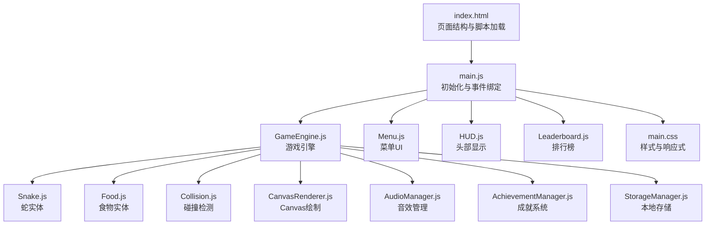
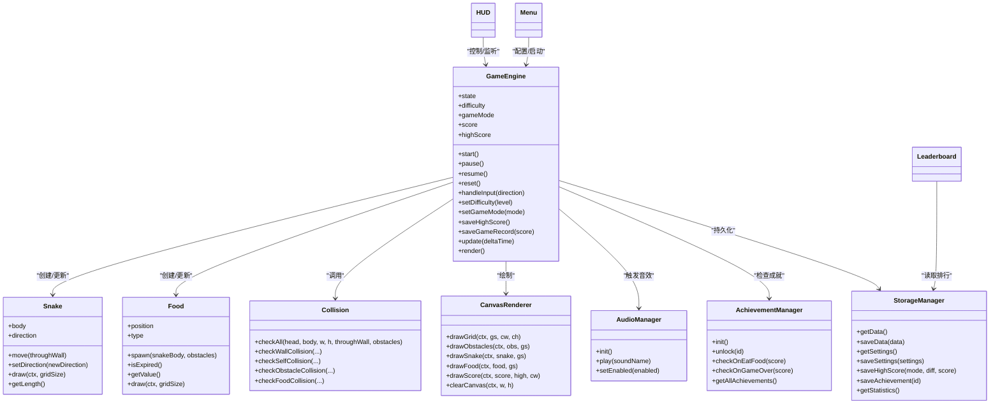
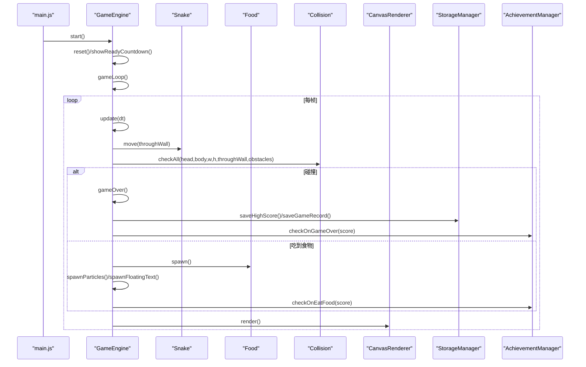
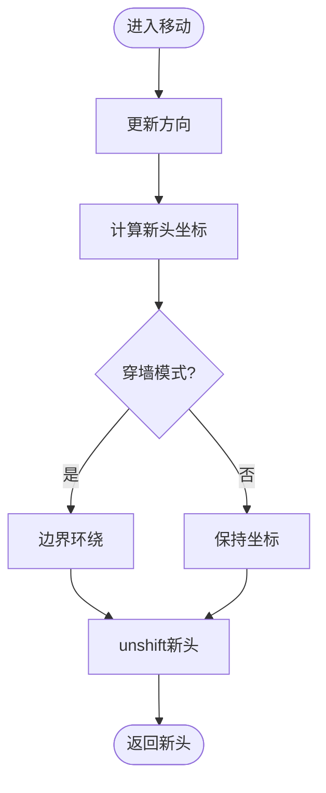
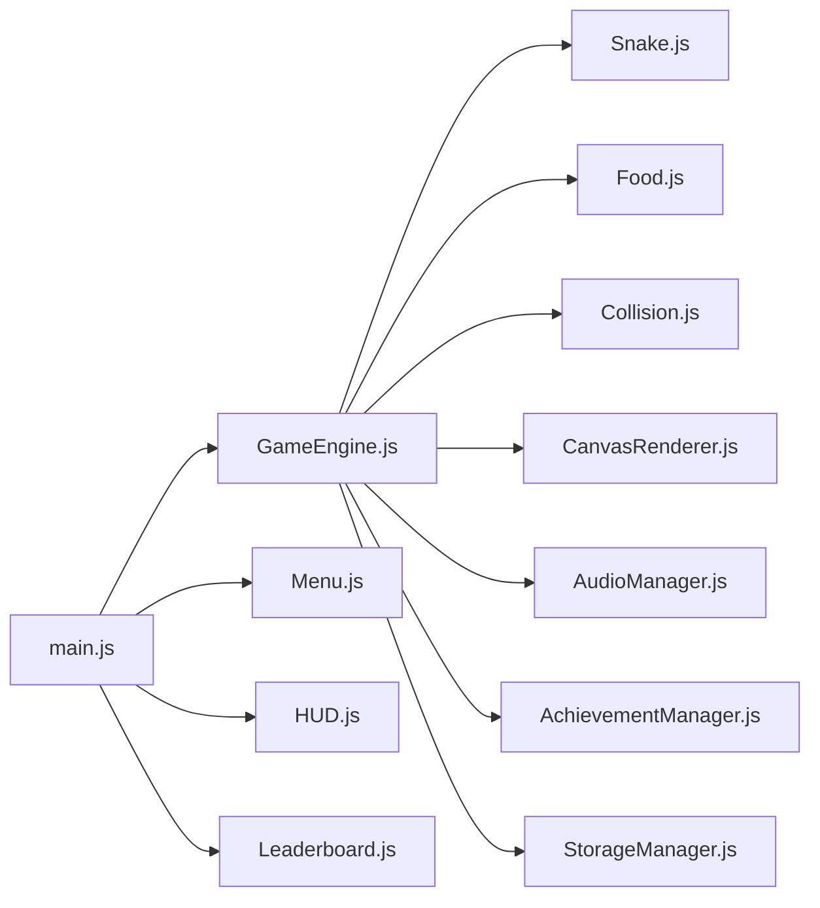

# 贪吃蛇游戏介绍

<cite>
**本文引用的文件**   
- [index.html](file://snake-game/index.html)
- [main.js](file://snake-game/js/main.js)
- [GameEngine.js](file://snake-game/js/core/GameEngine.js)
- [CanvasRenderer.js](file://snake-game/js/render/CanvasRenderer.js)
- [AudioManager.js](file://snake-game/js/audio/AudioManager.js)
- [Snake.js](file://snake-game/js/core/Snake.js)
- [Food.js](file://snake-game/js/core/Food.js)
- [Collision.js](file://snake-game/js/core/Collision.js)
- [AchievementManager.js](file://snake-game/js/data/AchievementManager.js)
- [StorageManager.js](file://snake-game/js/data/StorageManager.js)
- [Menu.js](file://snake-game/js/ui/Menu.js)
- [HUD.js](file://snake-game/js/ui/HUD.js)
- [Leaderboard.js](file://snake-game/js/ui/Leaderboard.js)
- [Constants.js](file://snake-game/js/utils/Constants.js)
- [main.css](file://snake-game/css/main.css)
</cite>

## 目录
1. [简介](#简介)
2. [项目结构](#项目结构)
3. [核心组件](#核心组件)
4. [架构总览](#架构总览)
5. [详细组件分析](#详细组件分析)
6. [依赖关系分析](#依赖关系分析)
7. [性能考量](#性能考量)
8. [故障排查指南](#故障排查指南)
9. [结论](#结论)
10. [附录：配置与扩展开发指南](#附录配置与扩展开发指南)

## 简介
本项目是一款基于HTML5的网页版“贪吃蛇”游戏，采用模块化与组件化设计，具备多模式、成就系统、音效管理、排行榜等完整功能。游戏通过Canvas进行渲染，使用事件总线解耦模块通信，支持键盘、触屏滑动与虚拟方向键等多种输入方式，并提供难度选择、限时模式、障碍模式等玩法。

## 项目结构
- 入口与页面
  - index.html：主页面，包含菜单、游戏、设置、排行榜、成就、帮助等界面元素，并按顺序引入各JS模块。
  - main.css：全局样式与响应式布局，定义主题变量、按钮、面板、移动端控件等。
- 核心逻辑
  - js/core/GameEngine.js：游戏引擎，负责状态机、循环、更新、渲染调度、数据持久化、特效管理等。
  - js/core/Snake.js：蛇实体，维护身体、方向、移动与绘制。
  - js/core/Food.js：食物实体，管理生成、类型、过期与绘制。
  - js/core/Collision.js：碰撞检测，封装墙、自身、障碍物、食物的判定。
- 渲染层
  - js/render/CanvasRenderer.js：Canvas绘图工具集（网格、障碍物、蛇、食物、分数等）。
- UI与交互
  - js/ui/Menu.js：主菜单、难度/模式选择、限时时间选择。
  - js/ui/HUD.js：顶部信息栏、暂停/继续、结束界面切换、计时器与分数动画。
  - js/ui/Leaderboard.js：本地/全球排行榜展示与排序。
  - js/ui/Settings.js：设置项（在HTML中提供控件，由引擎加载保存）。
- 数据与成就
  - js/data/StorageManager.js：localStorage读写封装（设置、最高分、统计、成就等）。
  - js/data/AchievementManager.js：成就定义、解锁条件、通知与持久化。
- 音频
  - js/audio/AudioManager.js：Web Audio API合成音效（吃食物、游戏结束等）。
- 工具与常量
  - js/utils/Constants.js：网格尺寸、方向、状态、难度、模式、食物类型、皮肤颜色、默认设置等。
  - js/utils/EventBus.js：全局事件总线（在HTML中引入）。
  - js/utils/Helpers.js：通用辅助函数（如随机数、去抖等）。

图表来源
- [index.html:279-294](file://snake-game/index.html#L279-L294)
- [main.js:1-20](file://snake-game/js/main.js#L1-L20)
- [GameEngine.js:1-47](file://snake-game/js/core/GameEngine.js#L1-L47)
- [CanvasRenderer.js:1-30](file://snake-game/js/render/CanvasRenderer.js#L1-L30)
- [AudioManager.js:1-20](file://snake-game/js/audio/AudioManager.js#L1-L20)
- [AchievementManager.js:1-20](file://snake-game/js/data/AchievementManager.js#L1-L20)
- [StorageManager.js:1-20](file://snake-game/js/data/StorageManager.js#L1-L20)
- [Menu.js:1-20](file://snake-game/js/ui/Menu.js#L1-L20)
- [HUD.js:1-20](file://snake-game/js/ui/HUD.js#L1-L20)
- [Leaderboard.js:1-20](file://snake-game/js/ui/Leaderboard.js#L1-L20)
- [main.css:1-25](file://snake-game/css/main.css#L1-L25)

章节来源
- [index.html:1-297](file://snake-game/index.html#L1-L297)
- [main.css:1-800](file://snake-game/css/main.css#L1-L800)

## 核心组件
- 游戏引擎（GameEngine）
  - 职责：生命周期管理（准备/进行中/暂停/结束）、固定步长更新循环、输入分发、得分与记录、粒子与飘字特效、死亡闪烁动画、设置与最高分持久化、模式与难度切换、障碍物生成。
  - 关键流程：start → showReadyCountdown → gameLoop(update+render) → gameOver → saveHighScore/saveGameRecord/updateStatistics。
- 蛇（Snake）
  - 职责：初始位置、方向控制（防180度转向）、移动（含穿墙）、增长语义方法、绘制（头/身/眼）、长度查询、位置判断。
- 食物（Food）
  - 职责：随机生成（避开蛇与障碍）、类型与分值、过期机制、绘制（普通/金色/彩虹闪烁）。
- 碰撞（Collision）
  - 职责：墙、自身、障碍物、食物四类碰撞检测，统一返回结果对象。
- 渲染（CanvasRenderer）
  - 职责：网格、障碍物、蛇、食物、分数等绘制工具；支持特殊效果（高光、脉冲）。
- 音频（AudioManager）
  - 职责：基于Web Audio API合成音效，按开关控制播放，避免自动播放策略限制。
- 成就（AchievementManager）
  - 职责：成就定义、解锁检查（吃食/结束）、通知弹窗、持久化、进度统计。
- 存储（StorageManager）
  - 职责：设置、最高分、统计、成就、游戏记录的存取与容错处理。
- UI模块（Menu/HUD/Leaderboard）
  - 职责：界面切换、事件绑定、数据刷新、排行榜渲染与排序。

章节来源
- [GameEngine.js:1-800](file://snake-game/js/core/GameEngine.js#L1-L800)
- [Snake.js:1-214](file://snake-game/js/core/Snake.js#L1-L214)
- [Food.js:1-168](file://snake-game/js/core/Food.js#L1-L168)
- [Collision.js:1-73](file://snake-game/js/core/Collision.js#L1-L73)
- [CanvasRenderer.js:1-188](file://snake-game/js/render/CanvasRenderer.js#L1-L188)
- [AudioManager.js:1-172](file://snake-game/js/audio/AudioManager.js#L1-L172)
- [AchievementManager.js:1-252](file://snake-game/js/data/AchievementManager.js#L1-L252)
- [StorageManager.js:1-175](file://snake-game/js/data/StorageManager.js#L1-L175)
- [Menu.js:1-183](file://snake-game/js/ui/Menu.js#L1-L183)
- [HUD.js:1-178](file://snake-game/js/ui/HUD.js#L1-L178)
- [Leaderboard.js:1-234](file://snake-game/js/ui/Leaderboard.js#L1-L234)

## 架构总览
本项目的架构遵循“引擎驱动 + 组件协作 + 事件总线”的模式：
- 引擎作为中心协调者，持有游戏状态、实体与资源，驱动每帧更新与渲染。
- 实体（蛇、食物）与工具（碰撞、渲染）保持低耦合，通过接口或参数传递数据。
- UI模块仅负责视图与用户交互，通过事件总线与引擎通信，避免直接紧耦合。
- 数据层（存储、成就）独立于渲染与逻辑，便于替换为云端方案。

图表来源
- [GameEngine.js:1-800](file://snake-game/js/core/GameEngine.js#L1-L800)
- [Snake.js:1-214](file://snake-game/js/core/Snake.js#L1-L214)
- [Food.js:1-168](file://snake-game/js/core/Food.js#L1-L168)
- [Collision.js:1-73](file://snake-game/js/core/Collision.js#L1-L73)
- [CanvasRenderer.js:1-188](file://snake-game/js/render/CanvasRenderer.js#L1-L188)
- [AudioManager.js:1-172](file://snake-game/js/audio/AudioManager.js#L1-L172)
- [AchievementManager.js:1-252](file://snake-game/js/data/AchievementManager.js#L1-L252)
- [StorageManager.js:1-175](file://snake-game/js/data/StorageManager.js#L1-L175)
- [Menu.js:1-183](file://snake-game/js/ui/Menu.js#L1-L183)
- [HUD.js:1-178](file://snake-game/js/ui/HUD.js#L1-L178)
- [Leaderboard.js:1-234](file://snake-game/js/ui/Leaderboard.js#L1-L234)

## 详细组件分析

### 游戏引擎与主循环
- 固定步长更新：使用累加器将deltaTime累积到updateInterval，保证不同设备下速度一致。
- 状态机：IDLE/READY/PLAYING/PAUSED/GAME_OVER，配合遮罩与倒计时提升体验。
- 输入分发：统一通过handleInput转发至蛇的方向设置，防止反向移动。
- 特效系统：粒子与飘字在updateEffects中按时间衰减，render阶段绘制。
- 死亡动画：单独渲染循环，闪烁蛇体并延迟展示结束界面。
- 数据持久化：最高分按“模式×难度”维度保存；同时保存完整游戏记录用于排行榜。

图表来源
- [main.js:1-80](file://snake-game/js/main.js#L1-L80)
- [GameEngine.js:220-341](file://snake-game/js/core/GameEngine.js#L220-L341)
- [GameEngine.js:343-378](file://snake-game/js/core/GameEngine.js#L343-L378)
- [GameEngine.js:460-506](file://snake-game/js/core/GameEngine.js#L460-L506)
- [GameEngine.js:657-684](file://snake-game/js/core/GameEngine.js#L657-L684)
- [Collision.js:60-66](file://snake-game/js/core/Collision.js#L60-L66)
- [Food.js:28-52](file://snake-game/js/core/Food.js#L28-L52)
- [AchievementManager.js:161-181](file://snake-game/js/data/AchievementManager.js#L161-L181)
- [AchievementManager.js:187-221](file://snake-game/js/data/AchievementManager.js#L187-L221)

章节来源
- [GameEngine.js:276-341](file://snake-game/js/core/GameEngine.js#L276-L341)
- [GameEngine.js:343-378](file://snake-game/js/core/GameEngine.js#L343-L378)
- [GameEngine.js:460-506](file://snake-game/js/core/GameEngine.js#L460-L506)
- [GameEngine.js:657-684](file://snake-game/js/core/GameEngine.js#L657-L684)

### 蛇与移动算法
- 防反向：setDirection拒绝与当前方向相反的新方向。
- 移动：计算新头坐标，根据throughWall决定是否穿墙，unshift新头，尾部移除由引擎控制（未吃食物则pop）。
- 绘制：从尾到头绘制，头部带眼睛，身体连接处圆角。

图表来源
- [Snake.js:40-88](file://snake-game/js/core/Snake.js#L40-L88)

章节来源
- [Snake.js:40-88](file://snake-game/js/core/Snake.js#L40-L88)
- [Snake.js:135-180](file://snake-game/js/core/Snake.js#L135-L180)

### 食物与类型系统
- 生成：随机位置，避开蛇身与障碍物，最大尝试次数保护。
- 类型：普通/金色/彩虹，分值与颜色不同，特殊类型有闪烁效果。
- 过期：支持时长控制，到期后重新生成。

章节来源
- [Food.js:28-52](file://snake-game/js/core/Food.js#L28-L52)
- [Food.js:76-108](file://snake-game/js/core/Food.js#L76-L108)
- [Constants.js:33-37](file://snake-game/js/utils/Constants.js#L33-L37)

### 碰撞检测
- 墙：根据throughWall与网格尺寸判断越界。
- 自身：比较头与身体其余段是否重合。
- 障碍物：遍历障碍列表匹配坐标。
- 食物：坐标相等即命中。

章节来源
- [Collision.js:12-48](file://snake-game/js/core/Collision.js#L12-L48)
- [Collision.js:60-66](file://snake-game/js/core/Collision.js#L60-L66)

### 渲染系统（Canvas）
- 网格：按格子大小绘制背景网格线。
- 障碍物：灰色方块+红色交叉线提示危险。
- 蛇：头部与身体颜色区分，眼睛随方向变化。
- 食物：圆形+高光，特殊类型添加脉冲外圈。
- 分数：Canvas内绘制分数与最高分。

章节来源
- [CanvasRenderer.js:11-30](file://snake-game/js/render/CanvasRenderer.js#L11-L30)
- [CanvasRenderer.js:38-60](file://snake-game/js/render/CanvasRenderer.js#L38-L60)
- [CanvasRenderer.js:68-112](file://snake-game/js/render/CanvasRenderer.js#L68-L112)
- [CanvasRenderer.js:120-152](file://snake-game/js/render/CanvasRenderer.js#L120-L152)
- [CanvasRenderer.js:161-170](file://snake-game/js/render/CanvasRenderer.js#L161-L170)

### 音效管理
- 初始化：首次用户交互后创建AudioContext，避免浏览器自动播放限制。
- 播放：吃食物清脆音、游戏结束下降音，支持开关控制。
- 扩展：可新增背景音乐或更多音效。

章节来源
- [AudioManager.js:16-38](file://snake-game/js/audio/AudioManager.js#L16-L38)
- [AudioManager.js:44-66](file://snake-game/js/audio/AudioManager.js#L44-L66)
- [AudioManager.js:71-112](file://snake-game/js/audio/AudioManager.js#L71-L112)

### 成就系统
- 定义：内置多项成就（初次得分、十连击、半百、百发百中等），含图标与描述。
- 检查点：吃食物时按分数阈值解锁；游戏结束时按模式/难度/长度等条件解锁。
- 通知：动态创建通知DOM，CSS动画展示，3秒后移除。
- 持久化：已解锁ID写入localStorage。

章节来源
- [AchievementManager.js:12-83](file://snake-game/js/data/AchievementManager.js#L12-L83)
- [AchievementManager.js:161-181](file://snake-game/js/data/AchievementManager.js#L161-L181)
- [AchievementManager.js:187-221](file://snake-game/js/data/AchievementManager.js#L187-L221)
- [AchievementManager.js:126-155](file://snake-game/js/data/AchievementManager.js#L126-L155)

### 排行榜
- 本地排行：优先读取完整游戏记录（含模式、难度、日期、蛇长），按分数降序取前20；若无记录回退到最高分表。
- 全球排行：模拟数据占位，便于后续接入后端。
- 交互：Tab切换、返回菜单。

章节来源
- [Leaderboard.js:52-118](file://snake-game/js/ui/Leaderboard.js#L52-L118)
- [Leaderboard.js:124-148](file://snake-game/js/ui/Leaderboard.js#L124-L148)
- [Leaderboard.js:177-213](file://snake-game/js/ui/Leaderboard.js#L177-L213)

### 菜单与设置
- 难度/模式：点击切换，引擎内部更新配置并加载对应最高分。
- 限时模式：选择时间后开始倒计时。
- 设置项：音效、震动、皮肤、语言、大字体、护眼模式等，持久化到localStorage。

章节来源
- [Menu.js:50-76](file://snake-game/js/ui/Menu.js#L50-L76)
- [Menu.js:99-137](file://snake-game/js/ui/Menu.js#L99-L137)
- [index.html:149-207](file://snake-game/index.html#L149-L207)
- [Constants.js:68-77](file://snake-game/js/utils/Constants.js#L68-L77)

## 依赖关系分析
- 模块间耦合
  - 引擎强依赖实体与工具（蛇、食物、碰撞、渲染），但通过方法调用而非直接访问内部属性，保持一定内聚性。
  - UI模块通过事件总线与引擎交互，降低耦合度。
  - 成就与存储模块相对独立，易于替换实现（如云端成就/排行榜）。
- 外部依赖
  - Web Audio API：音效合成。
  - localStorage：本地数据持久化。
  - Canvas API：2D绘图。
- 潜在循环依赖
  - 当前无直接循环引用，主要依赖方向为：main→引擎→实体/工具/UI/数据。

图表来源
- [main.js:1-20](file://snake-game/js/main.js#L1-L20)
- [GameEngine.js:1-47](file://snake-game/js/core/GameEngine.js#L1-L47)
- [CanvasRenderer.js:1-30](file://snake-game/js/render/CanvasRenderer.js#L1-L30)
- [AudioManager.js:1-20](file://snake-game/js/audio/AudioManager.js#L1-L20)
- [AchievementManager.js:1-20](file://snake-game/js/data/AchievementManager.js#L1-L20)
- [StorageManager.js:1-20](file://snake-game/js/data/StorageManager.js#L1-L20)
- [Menu.js:1-20](file://snake-game/js/ui/Menu.js#L1-L20)
- [HUD.js:1-20](file://snake-game/js/ui/HUD.js#L1-L20)
- [Leaderboard.js:1-20](file://snake-game/js/ui/Leaderboard.js#L1-L20)

章节来源
- [main.js:1-20](file://snake-game/js/main.js#L1-L20)
- [GameEngine.js:1-47](file://snake-game/js/core/GameEngine.js#L1-L47)

## 性能考量
- 固定步长更新：确保在不同刷新率设备上保持一致的游戏速度。
- 渲染优化：
  - 仅在可见容器中进行Canvas尺寸调整，避免隐藏状态下重复计算。
  - 粒子与飘字按生命周期过滤，减少无效绘制。
  - 使用requestAnimationFrame保证流畅动画。
- 输入节流：方向键与触摸事件最小滑动距离阈值，避免误触。
- 存储I/O：localStorage读写集中封装，异常捕获避免崩溃。

[本节为通用指导，不直接分析具体文件]

## 故障排查指南
- 音效无法播放
  - 现象：点击或按键后无声音。
  - 排查：确认用户首次交互后AudioContext已创建；检查音效开关设置。
  - 参考路径：[AudioManager.js:16-38](file://snake-game/js/audio/AudioManager.js#L16-L38)、[AudioManager.js:44-66](file://snake-game/js/audio/AudioManager.js#L44-L66)
- 画面不更新或黑屏
  - 现象：进入游戏后无渲染。
  - 排查：确认Canvas尺寸调整时机（需容器可见）；检查resize与_ _needsResize逻辑。
  - 参考路径：[GameEngine.js:70-95](file://snake-game/js/core/GameEngine.js#L70-L95)
- 排行榜为空
  - 现象：本地排行榜无数据。
  - 排查：确认已完成至少一局游戏并保存记录；检查localStorage键名与数据结构。
  - 参考路径：[Leaderboard.js:52-118](file://snake-game/js/ui/Leaderboard.js#L52-L118)、[GameEngine.js:167-188](file://snake-game/js/core/GameEngine.js#L167-L188)
- 设置未生效
  - 现象：皮肤/音效/语言等设置未保存。
  - 排查：检查DEFAULT_SETTINGS合并逻辑与localStorage读写。
  - 参考路径：[GameEngine.js:97-114](file://snake-game/js/core/GameEngine.js#L97-L114)、[StorageManager.js:37-50](file://snake-game/js/data/StorageManager.js#L37-L50)

章节来源
- [AudioManager.js:16-38](file://snake-game/js/audio/AudioManager.js#L16-L38)
- [GameEngine.js:70-95](file://snake-game/js/core/GameEngine.js#L70-L95)
- [Leaderboard.js:52-118](file://snake-game/js/ui/Leaderboard.js#L52-L118)
- [GameEngine.js:167-188](file://snake-game/js/core/GameEngine.js#L167-L188)
- [StorageManager.js:37-50](file://snake-game/js/data/StorageManager.js#L37-L50)

## 结论
该项目以清晰的模块化与组件化架构实现了完整的贪吃蛇玩法，涵盖多模式、成就、音效、排行榜等特性。引擎采用固定步长与事件总线，具备良好的可扩展性与跨平台兼容性。建议后续在排行榜与成就方面接入后端服务，进一步提升社交与留存能力。

[本节为总结，不直接分析具体文件]

## 附录：配置与扩展开发指南

### 配置选项
- 网格与画布
  - GRID_SIZE、GRID_WIDTH、GRID_HEIGHT：决定网格大小与数量。
  - 参考路径：[Constants.js:1-4](file://snake-game/js/utils/Constants.js#L1-L4)
- 难度与模式
  - DIFFICULTY：速度、穿墙、障碍物数量。
  - GAME_MODE：经典、限时、障碍。
  - 参考路径：[Constants.js:21-31](file://snake-game/js/utils/Constants.js#L21-L31)
- 食物类型
  - FOOD_TYPE：颜色与分值。
  - 参考路径：[Constants.js:33-37](file://snake-game/js/utils/Constants.js#L33-L37)
- 皮肤颜色
  - SKIN_COLORS：头/身/眼配色。
  - 参考路径：[Constants.js:39-65](file://snake-game/js/utils/Constants.js#L39-L65)
- 默认设置
  - DEFAULT_SETTINGS：音效、震动、皮肤、难度、模式、语言、字体、护眼。
  - 参考路径：[Constants.js:68-77](file://snake-game/js/utils/Constants.js#L68-L77)

### 扩展开发建议
- 新增游戏模式
  - 在GAME_MODE中添加新枚举，并在引擎中处理相应逻辑（如生成规则、计时器等）。
  - 参考路径：[GameEngine.js:781-793](file://snake-game/js/core/GameEngine.js#L781-L793)
- 新增成就
  - 在AchievementManager.achievements中添加条目，并在checkOnEatFood/checkOnGameOver中增加条件。
  - 参考路径：[AchievementManager.js:12-83](file://snake-game/js/data/AchievementManager.js#L12-L83)
- 新增音效
  - 在AudioManager.play中增加case分支，实现新的合成音效。
  - 参考路径：[AudioManager.js:44-66](file://snake-game/js/audio/AudioManager.js#L44-L66)
- 自定义渲染风格
  - 在CanvasRenderer中扩展绘制方法，或在GameEngine.render中组合调用。
  - 参考路径：[CanvasRenderer.js:68-112](file://snake-game/js/render/CanvasRenderer.js#L68-L112)
- 接入云端排行榜/成就
  - 替换StorageManager相关方法为网络请求，保留接口一致性。
  - 参考路径：[StorageManager.js:58-86](file://snake-game/js/data/StorageManager.js#L58-L86)

章节来源
- [Constants.js:1-77](file://snake-game/js/utils/Constants.js#L1-L77)
- [GameEngine.js:781-793](file://snake-game/js/core/GameEngine.js#L781-L793)
- [AchievementManager.js:12-83](file://snake-game/js/data/AchievementManager.js#L12-L83)
- [AudioManager.js:44-66](file://snake-game/js/audio/AudioManager.js#L44-L66)
- [CanvasRenderer.js:68-112](file://snake-game/js/render/CanvasRenderer.js#L68-L112)
- [StorageManager.js:58-86](file://snake-game/js/data/StorageManager.js#L58-L86)