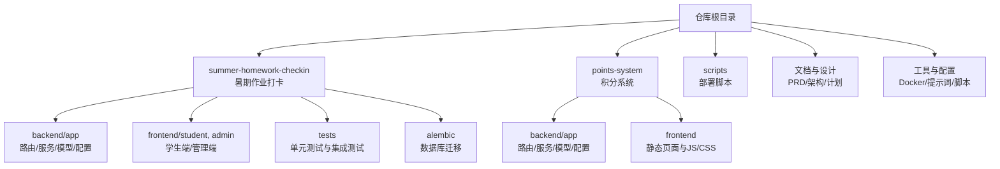
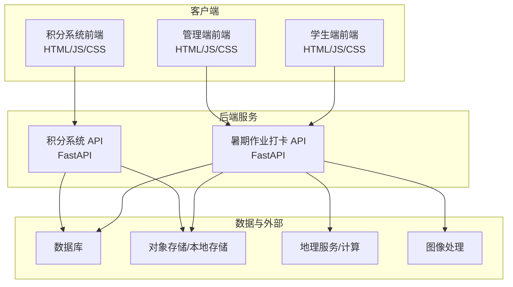
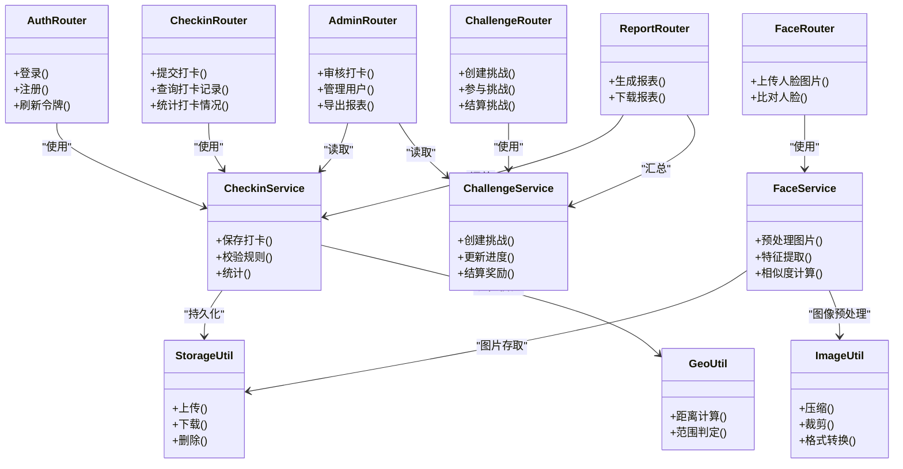
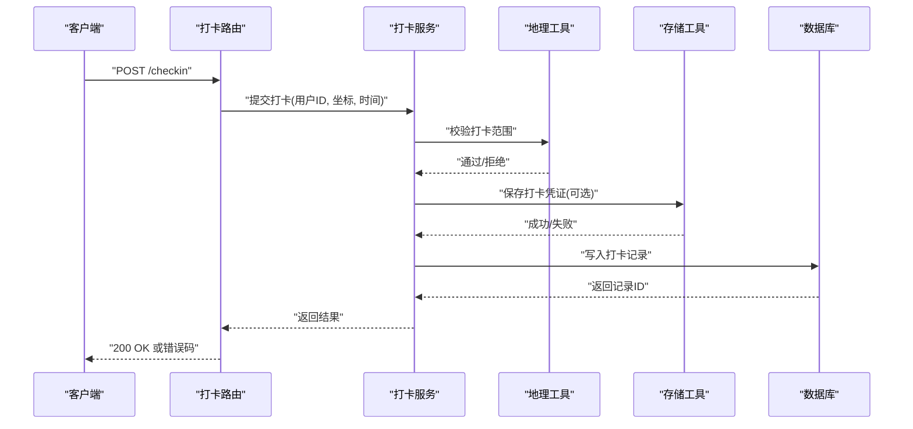
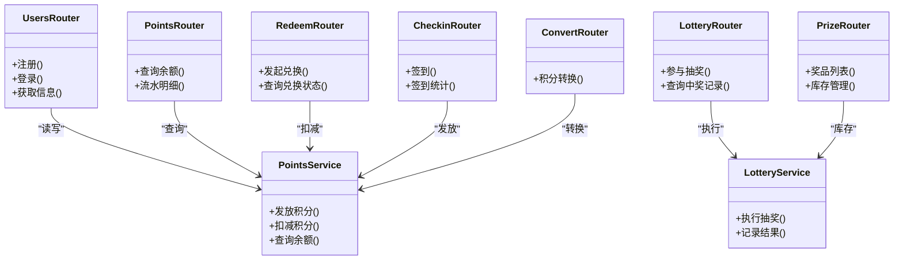
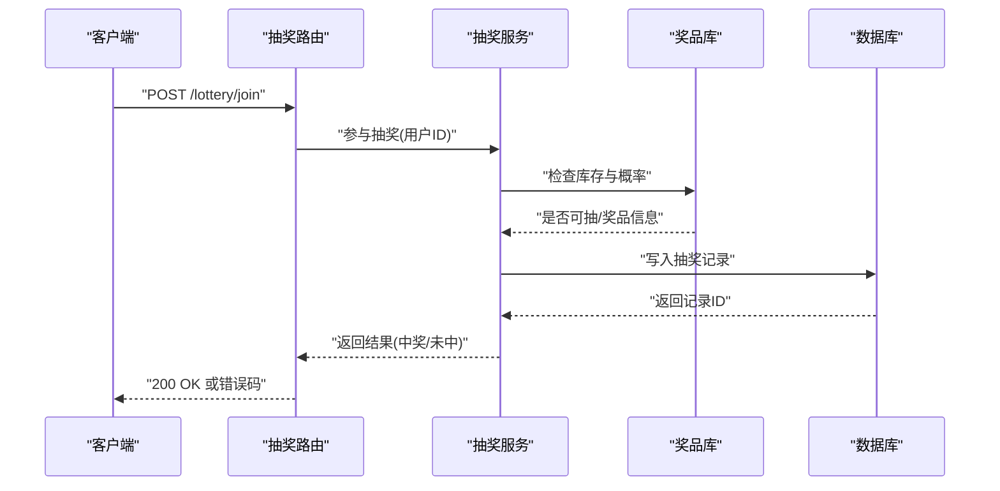
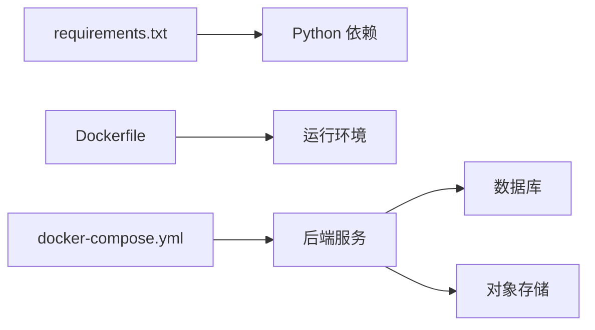

# 项目文档体系

<cite>
**本文引用的文件**   
- [docker-compose.yml](file://docker-compose.yml)
- [snake-game-project-plan.md](file://snake-game-project-plan.md)
- [snake-game-prd.md](file://snake-game-prd.md)
- [snake-game-architecture.md](file://snake-game-architecture.md)
- [optimized-prompt.md](file://optimized-prompt.md)
- [upload_to_github.js](file://upload_to_github.js)
- [兑换记录后台管理需求提示词.md](file://兑换记录后台管理需求提示词.md)
- [兑换记录后台管理-优化提示词.md](file://兑换记录后台管理-优化提示词.md)
- [summer-homework-checkin/README.md](file://summer-homework-checkin/README.md)
- [summer-homework-checkin/backend/app/main.py](file://summer-homework-checkin/backend/app/main.py)
- [summer-homework-checkin/backend/app/config.py](file://summer-homework-checkin/backend/app/config.py)
- [summer-homework-checkin/backend/app/database.py](file://summer-homework-checkin/backend/app/database.py)
- [summer-homework-checkin/backend/app/models.py](file://summer-homework-checkin/backend/app/models.py)
- [summer-homework-checkin/backend/app/schemas.py](file://summer-homework-checkin/backend/app/schemas.py)
- [summer-homework-checkin/backend/app/security.py](file://summer-homework-checkin/backend/app/security.py)
- [summer-homework-checkin/backend/app/deps.py](file://summer-homework-checkin/backend/app/deps.py)
- [summer-homework-checkin/backend/app/routers/auth.py](file://summer-homework-checkin/backend/app/routers/auth.py)
- [summer-homework-checkin/backend/app/routers/checkin.py](file://summer-homework-checkin/backend/app/routers/checkin.py)
- [summer-homework-checkin/backend/app/routers/challenge.py](file://summer-homework-checkin/backend/app/routers/challenge.py)
- [summer-homework-checkin/backend/app/routers/face.py](file://summer-homework-checkin/backend/app/routers/face.py)
- [summer-homework-checkin/backend/app/routers/admin.py](file://summer-homework-checkin/backend/app/routers/admin.py)
- [summer-homework-checkin/backend/app/routers/report.py](file://summer-homework-checkin/backend/app/routers/report.py)
- [summer-homework-checkin/backend/app/services/checkin_service.py](file://summer-homework-checkin/backend/app/services/checkin_service.py)
- [summer-homework-checkin/backend/app/services/challenge_service.py](file://summer-homework-checkin/backend/app/services/challenge_service.py)
- [summer-homework-checkin/backend/app/services/face_service.py](file://summer-homework-checkin/backend/app/services/face_service.py)
- [summer-homework-checkin/backend/app/utils/storage.py](file://summer-homework-checkin/backend/app/utils/storage.py)
- [summer-homework-checkin/backend/app/utils/image.py](file://summer-homework-checkin/backend/app/utils/image.py)
- [summer-homework-checkin/backend/app/utils/geo.py](file://summer-homework-checkin/backend/app/utils/geo.py)
- [summer-homework-checkin/backend/app/utils/rate_limit.py](file://summer-homework-checkin/backend/app/utils/rate_limit.py)
- [summer-homework-checkin/backend/requirements.txt](file://summer-homework-checkin/backend/requirements.txt)
- [summer-homework-checkin/Dockerfile](file://summer-homework-checkin/Dockerfile)
- [points-system/backend/app/main.py](file://points-system/backend/app/main.py)
- [points-system/backend/app/config.py](file://points-system/backend/app/config.py)
- [points-system/backend/app/database.py](file://points-system/backend/app/database.py)
- [points-system/backend/app/models.py](file://points-system/backend/app/models.py)
- [points-system/backend/app/schemas.py](file://points-system/backend/app/schemas.py)
- [points-system/backend/app/routers/users.py](file://points-system/backend/app/routers/users.py)
- [points-system/backend/app/routers/points.py](file://points-system/backend/app/routers/points.py)
- [points-system/backend/app/routers/redeem.py](file://points-system/backend/app/routers/redeem.py)
- [points-system/backend/app/routers/lottery.py](file://points-system/backend/app/routers/lottery.py)
- [points-system/backend/app/routers/prize.py](file://points-system/backend/app/routers/prize.py)
- [points-system/backend/app/routers/checkin.py](file://points-system/backend/app/routers/checkin.py)
- [points-system/backend/app/routers/convert.py](file://points-system/backend/app/routers/convert.py)
- [points-system/backend/app/services/points_service.py](file://points-system/backend/app/services/points_service.py)
- [points-system/backend/app/services/lottery_service.py](file://points-system/backend/app/services/lottery_service.py)
- [points-system/backend/run.py](file://points-system/backend/run.py)
- [points-system/frontend/index.html](file://points-system/frontend/index.html)
- [points-system/frontend/app.js](file://points-system/frontend/app.js)
- [points-system/frontend/styles.css](file://points-system/frontend/styles.css)
</cite>

## 目录
1. [引言](#引言)
2. [项目结构](#项目结构)
3. [核心组件](#核心组件)
4. [架构总览](#架构总览)
5. [详细组件分析](#详细组件分析)
6. [依赖关系分析](#依赖关系分析)
7. [性能与可扩展性](#性能与可扩展性)
8. [故障排查指南](#故障排查指南)
9. [结论](#结论)
10. [附录](#附录)

## 引言
本仓库为多项目聚合的“作业打卡与积分系统”工程，包含两个主要后端应用：
- 暑期作业打卡（summer-homework-checkin）：面向学生、家长与管理员的打卡挑战、人脸识别、抽奖与兑换等能力。
- 积分系统（points-system）：通用积分、兑换、抽奖与签到等能力，提供前后端分离的轻量实现。

此外，仓库还包含部署脚本、Docker 编排、产品与架构设计文档以及若干提示词与工具脚本，用于支撑开发、测试与发布流程。

## 项目结构
仓库采用按业务域划分的 monorepo 组织方式，顶层包含编排与文档，子目录分别承载独立可运行的服务与前端页面。

图表来源
- [docker-compose.yml](file://docker-compose.yml)
- [summer-homework-checkin/backend/app/main.py](file://summer-homework-checkin/backend/app/main.py)
- [points-system/backend/app/main.py](file://points-system/backend/app/main.py)

章节来源
- [docker-compose.yml](file://docker-compose.yml)
- [summer-homework-checkin/README.md](file://summer-homework-checkin/README.md)

## 核心组件
- 应用入口与生命周期
  - 暑期作业打卡：FastAPI 应用初始化、中间件注册、路由挂载、启动参数与配置加载。
  - 积分系统：FastAPI 应用初始化、路由挂载、基础配置与运行入口。
- 数据层
  - 数据库连接与会话管理、ORM 模型定义、迁移脚本。
- 安全与鉴权
  - JWT 签发与校验、权限控制、依赖注入。
- 业务路由与服务
  - 路由层负责请求解析与响应封装；服务层封装领域逻辑与跨模块调用。
- 工具与基础设施
  - 存储抽象、图像处理、地理位置计算、限流策略等。

章节来源
- [summer-homework-checkin/backend/app/main.py](file://summer-homework-checkin/backend/app/main.py)
- [summer-homework-checkin/backend/app/config.py](file://summer-homework-checkin/backend/app/config.py)
- [summer-homework-checkin/backend/app/database.py](file://summer-homework-checkin/backend/app/database.py)
- [summer-homework-checkin/backend/app/models.py](file://summer-homework-checkin/backend/app/models.py)
- [summer-homework-checkin/backend/app/schemas.py](file://summer-homework-checkin/backend/app/schemas.py)
- [summer-homework-checkin/backend/app/security.py](file://summer-homework-checkin/backend/app/security.py)
- [summer-homework-checkin/backend/app/deps.py](file://summer-homework-checkin/backend/app/deps.py)
- [points-system/backend/app/main.py](file://points-system/backend/app/main.py)
- [points-system/backend/app/config.py](file://points-system/backend/app/config.py)
- [points-system/backend/app/database.py](file://points-system/backend/app/database.py)
- [points-system/backend/app/models.py](file://points-system/backend/app/models.py)
- [points-system/backend/app/schemas.py](file://points-system/backend/app/schemas.py)

## 架构总览
整体采用前后端分离的微服务化思路，每个子系统独立部署，共享统一的容器编排与制品规范。

图表来源
- [summer-homework-checkin/backend/app/main.py](file://summer-homework-checkin/backend/app/main.py)
- [summer-homework-checkin/backend/app/routers/auth.py](file://summer-homework-checkin/backend/app/routers/auth.py)
- [summer-homework-checkin/backend/app/routers/checkin.py](file://summer-homework-checkin/backend/app/routers/checkin.py)
- [summer-homework-checkin/backend/app/routers/challenge.py](file://summer-homework-checkin/backend/app/routers/challenge.py)
- [summer-homework-checkin/backend/app/routers/face.py](file://summer-homework-checkin/backend/app/routers/face.py)
- [summer-homework-checkin/backend/app/routers/admin.py](file://summer-homework-checkin/backend/app/routers/admin.py)
- [summer-homework-checkin/backend/app/routers/report.py](file://summer-homework-checkin/backend/app/routers/report.py)
- [summer-homework-checkin/backend/app/services/checkin_service.py](file://summer-homework-checkin/backend/app/services/checkin_service.py)
- [summer-homework-checkin/backend/app/services/challenge_service.py](file://summer-homework-checkin/backend/app/services/challenge_service.py)
- [summer-homework-checkin/backend/app/services/face_service.py](file://summer-homework-checkin/backend/app/services/face_service.py)
- [summer-homework-checkin/backend/app/utils/storage.py](file://summer-homework-checkin/backend/app/utils/storage.py)
- [summer-homework-checkin/backend/app/utils/image.py](file://summer-homework-checkin/backend/app/utils/image.py)
- [summer-homework-checkin/backend/app/utils/geo.py](file://summer-homework-checkin/backend/app/utils/geo.py)
- [points-system/backend/app/main.py](file://points-system/backend/app/main.py)
- [points-system/backend/app/routers/users.py](file://points-system/backend/app/routers/users.py)
- [points-system/backend/app/routers/points.py](file://points-system/backend/app/routers/points.py)
- [points-system/backend/app/routers/redeem.py](file://points-system/backend/app/routers/redeem.py)
- [points-system/backend/app/routers/lottery.py](file://points-system/backend/app/routers/lottery.py)
- [points-system/backend/app/routers/prize.py](file://points-system/backend/app/routers/prize.py)
- [points-system/backend/app/routers/checkin.py](file://points-system/backend/app/routers/checkin.py)
- [points-system/backend/app/routers/convert.py](file://points-system/backend/app/routers/convert.py)

## 详细组件分析

### 暑期作业打卡后端（FastAPI）
- 应用入口与配置
  - 应用初始化、CORS/中间件、路由挂载、启动参数与配置加载。
- 认证与安全
  - 登录/注册、JWT 签发与校验、角色与权限控制。
- 核心路由
  - 认证、打卡、挑战、人脸、奖品、兑换、报表、管理等。
- 服务层
  - 打卡服务、挑战服务、人脸服务、通知服务、兑换服务、报表服务、验证服务等。
- 工具层
  - 存储抽象、图像处理、地理位置计算、限流策略等。

图表来源
- [summer-homework-checkin/backend/app/routers/auth.py](file://summer-homework-checkin/backend/app/routers/auth.py)
- [summer-homework-checkin/backend/app/routers/checkin.py](file://summer-homework-checkin/backend/app/routers/checkin.py)
- [summer-homework-checkin/backend/app/routers/challenge.py](file://summer-homework-checkin/backend/app/routers/challenge.py)
- [summer-homework-checkin/backend/app/routers/face.py](file://summer-homework-checkin/backend/app/routers/face.py)
- [summer-homework-checkin/backend/app/routers/admin.py](file://summer-homework-checkin/backend/app/routers/admin.py)
- [summer-homework-checkin/backend/app/routers/report.py](file://summer-homework-checkin/backend/app/routers/report.py)
- [summer-homework-checkin/backend/app/services/checkin_service.py](file://summer-homework-checkin/backend/app/services/checkin_service.py)
- [summer-homework-checkin/backend/app/services/challenge_service.py](file://summer-homework-checkin/backend/app/services/challenge_service.py)
- [summer-homework-checkin/backend/app/services/face_service.py](file://summer-homework-checkin/backend/app/services/face_service.py)
- [summer-homework-checkin/backend/app/utils/storage.py](file://summer-homework-checkin/backend/app/utils/storage.py)
- [summer-homework-checkin/backend/app/utils/image.py](file://summer-homework-checkin/backend/app/utils/image.py)
- [summer-homework-checkin/backend/app/utils/geo.py](file://summer-homework-checkin/backend/app/utils/geo.py)

章节来源
- [summer-homework-checkin/backend/app/main.py](file://summer-homework-checkin/backend/app/main.py)
- [summer-homework-checkin/backend/app/config.py](file://summer-homework-checkin/backend/app/config.py)
- [summer-homework-checkin/backend/app/security.py](file://summer-homework-checkin/backend/app/security.py)
- [summer-homework-checkin/backend/app/deps.py](file://summer-homework-checkin/backend/app/deps.py)
- [summer-homework-checkin/backend/app/models.py](file://summer-homework-checkin/backend/app/models.py)
- [summer-homework-checkin/backend/app/schemas.py](file://summer-homework-checkin/backend/app/schemas.py)
- [summer-homework-checkin/backend/app/routers/auth.py](file://summer-homework-checkin/backend/app/routers/auth.py)
- [summer-homework-checkin/backend/app/routers/checkin.py](file://summer-homework-checkin/backend/app/routers/checkin.py)
- [summer-homework-checkin/backend/app/routers/challenge.py](file://summer-homework-checkin/backend/app/routers/challenge.py)
- [summer-homework-checkin/backend/app/routers/face.py](file://summer-homework-checkin/backend/app/routers/face.py)
- [summer-homework-checkin/backend/app/routers/admin.py](file://summer-homework-checkin/backend/app/routers/admin.py)
- [summer-homework-checkin/backend/app/routers/report.py](file://summer-homework-checkin/backend/app/routers/report.py)
- [summer-homework-checkin/backend/app/services/checkin_service.py](file://summer-homework-checkin/backend/app/services/checkin_service.py)
- [summer-homework-checkin/backend/app/services/challenge_service.py](file://summer-homework-checkin/backend/app/services/challenge_service.py)
- [summer-homework-checkin/backend/app/services/face_service.py](file://summer-homework-checkin/backend/app/services/face_service.py)
- [summer-homework-checkin/backend/app/utils/storage.py](file://summer-homework-checkin/backend/app/utils/storage.py)
- [summer-homework-checkin/backend/app/utils/image.py](file://summer-homework-checkin/backend/app/utils/image.py)
- [summer-homework-checkin/backend/app/utils/geo.py](file://summer-homework-checkin/backend/app/utils/geo.py)

#### 打卡提交流程（序列图）

图表来源
- [summer-homework-checkin/backend/app/routers/checkin.py](file://summer-homework-checkin/backend/app/routers/checkin.py)
- [summer-homework-checkin/backend/app/services/checkin_service.py](file://summer-homework-checkin/backend/app/services/checkin_service.py)
- [summer-homework-checkin/backend/app/utils/geo.py](file://summer-homework-checkin/backend/app/utils/geo.py)
- [summer-homework-checkin/backend/app/utils/storage.py](file://summer-homework-checkin/backend/app/utils/storage.py)

### 积分系统后端（FastAPI）
- 应用入口与配置
  - 应用初始化、路由挂载、基础配置与运行入口。
- 核心路由
  - 用户、积分、兑换、抽奖、奖品、签到、积分转换等。
- 服务层
  - 积分服务、抽奖服务等。

图表来源
- [points-system/backend/app/main.py](file://points-system/backend/app/main.py)
- [points-system/backend/app/routers/users.py](file://points-system/backend/app/routers/users.py)
- [points-system/backend/app/routers/points.py](file://points-system/backend/app/routers/points.py)
- [points-system/backend/app/routers/redeem.py](file://points-system/backend/app/routers/redeem.py)
- [points-system/backend/app/routers/lottery.py](file://points-system/backend/app/routers/lottery.py)
- [points-system/backend/app/routers/prize.py](file://points-system/backend/app/routers/prize.py)
- [points-system/backend/app/routers/checkin.py](file://points-system/backend/app/routers/checkin.py)
- [points-system/backend/app/routers/convert.py](file://points-system/backend/app/routers/convert.py)
- [points-system/backend/app/services/points_service.py](file://points-system/backend/app/services/points_service.py)
- [points-system/backend/app/services/lottery_service.py](file://points-system/backend/app/services/lottery_service.py)

章节来源
- [points-system/backend/app/main.py](file://points-system/backend/app/main.py)
- [points-system/backend/app/config.py](file://points-system/backend/app/config.py)
- [points-system/backend/app/database.py](file://points-system/backend/app/database.py)
- [points-system/backend/app/models.py](file://points-system/backend/app/models.py)
- [points-system/backend/app/schemas.py](file://points-system/backend/app/schemas.py)
- [points-system/backend/app/routers/users.py](file://points-system/backend/app/routers/users.py)
- [points-system/backend/app/routers/points.py](file://points-system/backend/app/routers/points.py)
- [points-system/backend/app/routers/redeem.py](file://points-system/backend/app/routers/redeem.py)
- [points-system/backend/app/routers/lottery.py](file://points-system/backend/app/routers/lottery.py)
- [points-system/backend/app/routers/prize.py](file://points-system/backend/app/routers/prize.py)
- [points-system/backend/app/routers/checkin.py](file://points-system/backend/app/routers/checkin.py)
- [points-system/backend/app/routers/convert.py](file://points-system/backend/app/routers/convert.py)
- [points-system/backend/app/services/points_service.py](file://points-system/backend/app/services/points_service.py)
- [points-system/backend/app/services/lottery_service.py](file://points-system/backend/app/services/lottery_service.py)

#### 抽奖参与流程（序列图）

图表来源
- [points-system/backend/app/routers/lottery.py](file://points-system/backend/app/routers/lottery.py)
- [points-system/backend/app/services/lottery_service.py](file://points-system/backend/app/services/lottery_service.py)

### 前端与静态资源
- 暑期作业打卡
  - 学生端与管理端页面，基于原生 HTML/JS/CSS 构建，直接调用后端 REST API。
- 积分系统
  - 单页静态资源，包含首页、样式与交互脚本。

章节来源
- [summer-homework-checkin/frontend/student/index.html](file://summer-homework-checkin/frontend/student/index.html)
- [summer-homework-checkin/frontend/student/app.js](file://summer-homework-checkin/frontend/student/app.js)
- [summer-homework-checkin/frontend/admin/index.html](file://summer-homework-checkin/frontend/admin/index.html)
- [summer-homework-checkin/frontend/admin/app.js](file://summer-homework-checkin/frontend/admin/app.js)
- [points-system/frontend/index.html](file://points-system/frontend/index.html)
- [points-system/frontend/app.js](file://points-system/frontend/app.js)
- [points-system/frontend/styles.css](file://points-system/frontend/styles.css)

## 依赖关系分析
- 运行时依赖
  - Python 包依赖由 requirements.txt 声明，Dockerfile 指定镜像与安装步骤。
- 容器编排
  - docker-compose.yml 统一编排后端服务、数据库与可能的缓存/对象存储。
- 内部模块耦合
  - 路由层依赖服务层，服务层依赖工具层与数据层；安全与依赖注入贯穿各层。

图表来源
- [summer-homework-checkin/backend/requirements.txt](file://summer-homework-checkin/backend/requirements.txt)
- [summer-homework-checkin/Dockerfile](file://summer-homework-checkin/Dockerfile)
- [docker-compose.yml](file://docker-compose.yml)

章节来源
- [summer-homework-checkin/backend/requirements.txt](file://summer-homework-checkin/backend/requirements.txt)
- [summer-homework-checkin/Dockerfile](file://summer-homework-checkin/Dockerfile)
- [docker-compose.yml](file://docker-compose.yml)

## 性能与可扩展性
- 并发与吞吐
  - FastAPI 基于异步 I/O，适合高并发场景；建议结合 Gunicorn/Uvicorn 多进程部署提升吞吐。
- 数据库访问
  - 使用连接池与事务边界控制，避免长事务与 N+1 查询；热点数据引入缓存层。
- 存储与图片处理
  - 大文件与图片走对象存储与 CDN；服务端进行压缩与转码以降低带宽与延迟。
- 限流与防刷
  - 对关键接口（如打卡、人脸、抽奖）实施速率限制与幂等设计，防止滥用。
- 扩展性
  - 服务无状态化便于水平扩展；将复杂计算（如人脸特征）下沉到专用微服务或批处理任务。

[本节为通用指导，不直接分析具体文件]

## 故障排查指南
- 常见问题定位
  - 启动失败：检查环境变量、数据库连接、端口占用与镜像依赖。
  - 鉴权异常：核对 JWT 密钥、过期时间与签名算法。
  - 存储失败：确认对象存储凭据、路径权限与网络可达性。
  - 限流触发：查看限流配置与阈值，必要时调整窗口大小或放宽配额。
- 日志与监控
  - 集中收集后端日志，关联请求 ID；对关键指标（QPS、错误率、延迟）建立告警。
- 回滚与恢复
  - 使用迁移版本管理与灰度发布；保留快照与备份以便快速回滚。

章节来源
- [summer-homework-checkin/backend/app/security.py](file://summer-homework-checkin/backend/app/security.py)
- [summer-homework-checkin/backend/app/utils/rate_limit.py](file://summer-homework-checkin/backend/app/utils/rate_limit.py)
- [summer-homework-checkin/backend/app/utils/storage.py](file://summer-homework-checkin/backend/app/utils/storage.py)

## 结论
本仓库以 monorepo 形式整合了“暑期作业打卡”和“积分系统”两大业务域，采用 FastAPI 构建后端、原生前端页面，配合 Docker 与编排文件实现标准化部署。通过清晰的分层（路由/服务/工具/数据）、完善的鉴权与限流机制，具备良好的可维护性与扩展性。建议在后续迭代中持续完善监控、自动化测试与发布流水线，进一步提升稳定性与交付效率。

[本节为总结性内容，不直接分析具体文件]

## 附录
- 设计与规划文档
  - 项目计划、产品需求与架构设计文档位于仓库根目录，便于理解业务背景与技术选型。
- 提示词与工具
  - 包含优化提示词、GitHub 上传脚本等辅助材料，提升开发与协作效率。

章节来源
- [snake-game-project-plan.md](file://snake-game-project-plan.md)
- [snake-game-prd.md](file://snake-game-prd.md)
- [snake-game-architecture.md](file://snake-game-architecture.md)
- [optimized-prompt.md](file://optimized-prompt.md)
- [upload_to_github.js](file://upload_to_github.js)
- [兑换记录后台管理需求提示词.md](file://兑换记录后台管理需求提示词.md)
- [兑换记录后台管理-优化提示词.md](file://兑换记录后台管理-优化提示词.md)