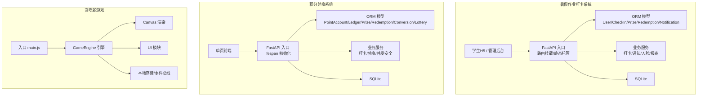
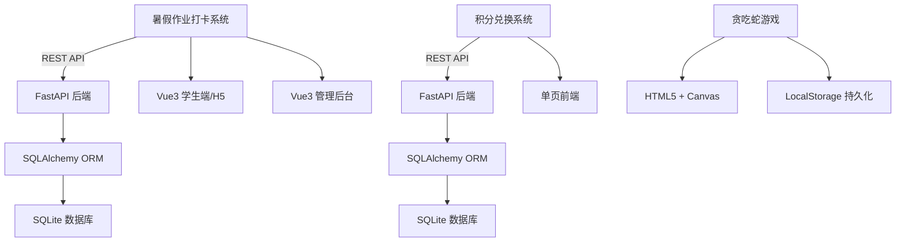
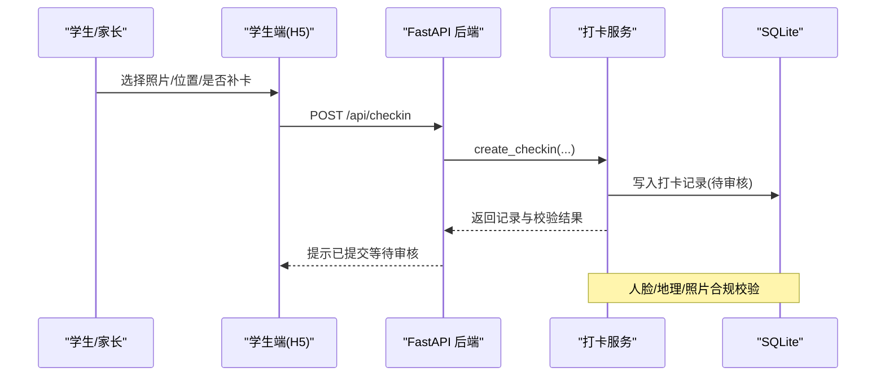
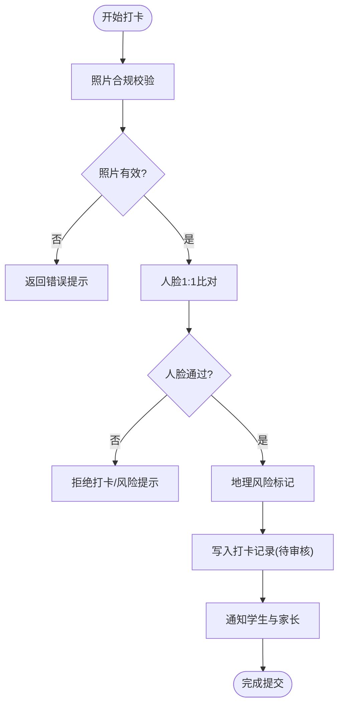
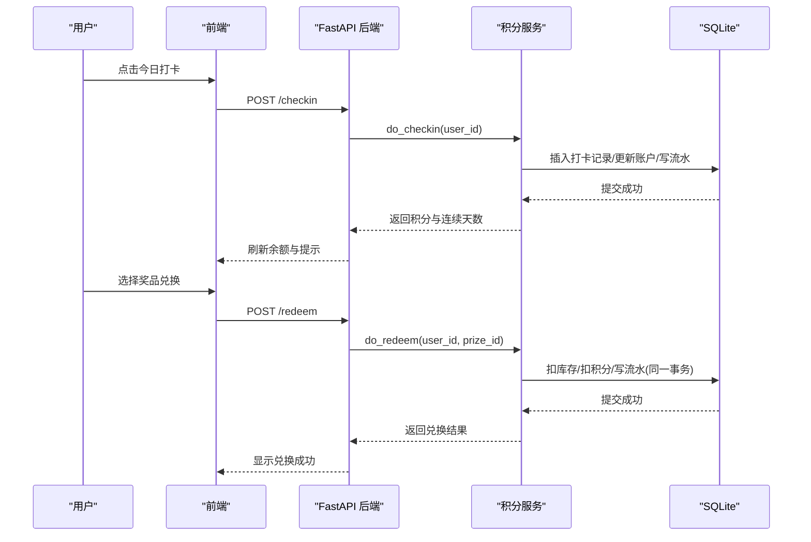
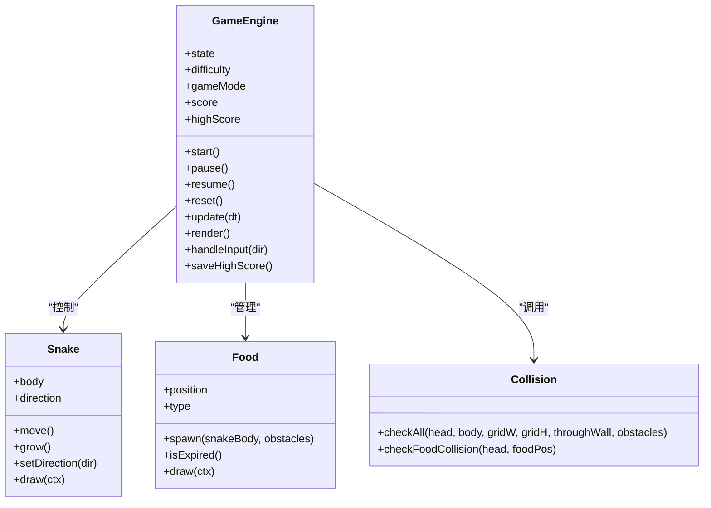
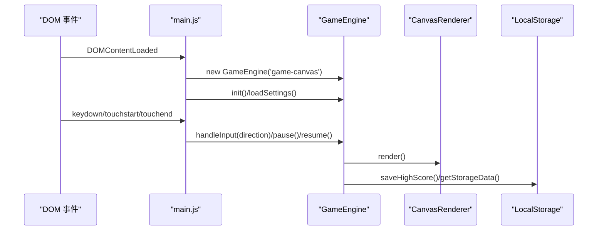
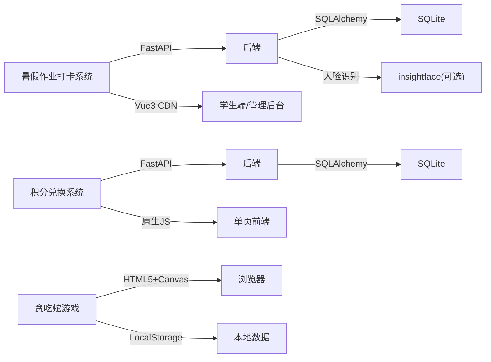

# 项目概述

<cite>
**本文引用的文件**   
- [summer-homework-checkin/README.md](file://summer-homework-checkin/README.md)
- [summer-homework-checkin/backend/app/main.py](file://summer-homework-checkin/backend/app/main.py)
- [summer-homework-checkin/backend/app/models.py](file://summer-homework-checkin/backend/app/models.py)
- [summer-homework-checkin/backend/app/services/checkin_service.py](file://summer-homework-checkin/backend/app/services/checkin_service.py)
- [summer-homework-checkin/frontend/student/index.html](file://summer-homework-checkin/frontend/student/index.html)
- [points-system/backend/app/main.py](file://points-system/backend/app/main.py)
- [points-system/backend/app/models.py](file://points-system/backend/app/models.py)
- [points-system/backend/app/services/points_service.py](file://points-system/backend/app/services/points_service.py)
- [points-system/frontend/index.html](file://points-system/frontend/index.html)
- [snake-game/js/main.js](file://snake-game/js/main.js)
- [snake-game/js/core/GameEngine.js](file://snake-game/js/core/GameEngine.js)
- [snake-game-architecture.md](file://snake-game-architecture.md)
- [snake-game-prd.md](file://snake-game-prd.md)
- [snake-game-project-plan.md](file://snake-game-project-plan.md)
</cite>

## 目录
1. [引言](#引言)
2. [项目结构](#项目结构)
3. [核心组件](#核心组件)
4. [架构总览](#架构总览)
5. [详细组件分析](#详细组件分析)
6. [依赖分析](#依赖分析)
7. [性能考量](#性能考量)
8. [故障排查指南](#故障排查指南)
9. [结论](#结论)
10. [附录](#附录)

## 引言
本工作区包含三个独立但可互补的项目，分别面向不同业务场景与用户群体：
- 暑假作业打卡系统（三年级）：面向小学生与家长的全周期学习管理平台，强调防代打卡、连续打卡激励、积分兑换与抽奖。
- 积分兑换系统：独立的积分账户、流水对账、奖品兑换与抽奖券体系，提供轻量前端体验。
- 贪吃蛇游戏：纯前端的HTML5网页游戏，具备多模式、皮肤、成就与排行榜等完整功能。

整体技术栈以 Python FastAPI 后端、Vue.js 前端（CDN 免构建）、SQLite 数据库为主；游戏项目采用 HTML5 + Canvas + 原生 JavaScript，零安装跨平台运行。三者通过统一的后端风格与数据模型设计，便于初学者理解前后端分离、事务一致性、权限与安全校验等工程实践。

## 项目结构
仓库根目录下并列三个子项目，各自拥有独立的前后端与文档：
- summer-homework-checkin：FastAPI 应用，挂载学生 H5 与管理后台静态页面，提供打卡、人脸核验、抽奖、报表等 API。
- points-system：独立的 FastAPI 服务，提供积分账户、兑换、抽奖券与转盘抽奖能力，前端为单页应用。
- snake-game：纯前端游戏，按模块划分 core/ui/render/audio/data/utils 等目录，支持 PWA 部署。

图示来源
- [summer-homework-checkin/backend/app/main.py:1-48](file://summer-homework-checkin/backend/app/main.py#L1-L48)
- [summer-homework-checkin/backend/app/models.py:1-176](file://summer-homework-checkin/backend/app/models.py#L1-L176)
- [points-system/backend/app/main.py:1-33](file://points-system/backend/app/main.py#L1-L33)
- [points-system/backend/app/models.py:1-151](file://points-system/backend/app/models.py#L1-L151)
- [snake-game/js/main.js:1-216](file://snake-game/js/main.js#L1-L216)
- [snake-game/js/core/GameEngine.js:1-800](file://snake-game/js/core/GameEngine.js#L1-L800)

章节来源
- [summer-homework-checkin/README.md:1-126](file://summer-homework-checkin/README.md#L1-L126)
- [snake-game-architecture.md:1-758](file://snake-game-architecture.md#L1-L758)

## 核心组件
- 暑假作业打卡系统
  - 后端入口与静态资源挂载：统一注册路由、挂载上传目录与学生/管理前端。
  - 数据模型：统一用户表（student/parent/admin），打卡记录含人脸与地理信息字段，奖品与兑换记录支持审核与替换。
  - 打卡服务：照片合规校验、补卡限额、人脸1:1比对策略、连续天数重算与抽奖资格发放、通知家长。
  - 前端：Vue3 CDN 免构建，学生端首页/打卡/商城/我的，管理后台独立页面。
- 积分兑换系统
  - 后端入口：使用 lifespan 在启动时建库建表，优先注册 API 再挂载静态前端。
  - 数据模型：积分账户与流水、打卡记录、奖品与兑换、抽奖券与流水、奖池与抽奖记录。
  - 业务服务：打卡防重复、连续奖励计算、兑换事务原子性（库存与积分同步扣减）。
  - 前端：卡片式布局展示余额、抽奖券、连续打卡、积分兑换、转盘抽奖与记录列表。
- 贪吃蛇游戏
  - 入口与事件绑定：DOM 加载后初始化引擎、菜单、HUD、设置、排行榜、音效管理器。
  - 游戏引擎：状态机（空闲/准备/进行中/暂停/结束）、主循环、碰撞检测、粒子与飘字效果、死亡动画。
  - 数据持久化：LocalStorage 保存设置、最高分、统计与历史记录。

章节来源
- [summer-homework-checkin/backend/app/main.py:1-48](file://summer-homework-checkin/backend/app/main.py#L1-L48)
- [summer-homework-checkin/backend/app/models.py:1-176](file://summer-homework-checkin/backend/app/models.py#L1-L176)
- [summer-homework-checkin/backend/app/services/checkin_service.py:1-254](file://summer-homework-checkin/backend/app/services/checkin_service.py#L1-L254)
- [summer-homework-checkin/frontend/student/index.html:1-271](file://summer-homework-checkin/frontend/student/index.html#L1-L271)
- [points-system/backend/app/main.py:1-33](file://points-system/backend/app/main.py#L1-L33)
- [points-system/backend/app/models.py:1-151](file://points-system/backend/app/models.py#L1-L151)
- [points-system/backend/app/services/points_service.py:1-146](file://points-system/backend/app/services/points_service.py#L1-L146)
- [points-system/frontend/index.html:1-111](file://points-system/frontend/index.html#L1-L111)
- [snake-game/js/main.js:1-216](file://snake-game/js/main.js#L1-L216)
- [snake-game/js/core/GameEngine.js:1-800](file://snake-game/js/core/GameEngine.js#L1-L800)

## 架构总览
三个项目均采用“前后端分离”的清晰分层：后端负责数据与规则，前端负责交互与展示。暑期打卡系统还引入人脸与地理位置等多模态校验，提升防代打卡能力；积分系统强调账户与流水的一致性；游戏项目则聚焦客户端渲染与用户体验。

图示来源
- [summer-homework-checkin/backend/app/main.py:1-48](file://summer-homework-checkin/backend/app/main.py#L1-L48)
- [summer-homework-checkin/backend/app/models.py:1-176](file://summer-homework-checkin/backend/app/models.py#L1-L176)
- [points-system/backend/app/main.py:1-33](file://points-system/backend/app/main.py#L1-L33)
- [points-system/backend/app/models.py:1-151](file://points-system/backend/app/models.py#L1-L151)
- [snake-game/js/core/GameEngine.js:1-800](file://snake-game/js/core/GameEngine.js#L1-L800)

## 详细组件分析

### 暑假作业打卡系统
- 目标与价值
  - 面向三年级小学生与家长，提供全周期学习打卡、防代打卡、连续打卡激励、积分兑换与抽奖、可视化报告等功能，帮助养成良好学习习惯并增强家校互动。
- 核心流程（打卡与审核）
  - 用户上传现场照片与位置，系统进行照片合规、人脸1:1比对、地理风险标记；提交后进入待审核，管理员通过后发放积分并重算连续天数与抽奖资格。
- 关键数据结构
  - 用户（角色区分）、打卡记录（含人脸与地理字段）、奖品（支持抽奖券类型）、兑换记录（支持替换与审核备注）、通知。
- 前端交互
  - 学生端三步完成打卡，支持补卡与凭证上传；家长可绑定孩子并接收通知；管理后台集中处理审核与数据查看。

图示来源
- [summer-homework-checkin/backend/app/services/checkin_service.py:64-163](file://summer-homework-checkin/backend/app/services/checkin_service.py#L64-L163)
- [summer-homework-checkin/backend/app/models.py:70-101](file://summer-homework-checkin/backend/app/models.py#L70-L101)
- [summer-homework-checkin/frontend/student/index.html:98-133](file://summer-homework-checkin/frontend/student/index.html#L98-L133)

图示来源
- [summer-homework-checkin/backend/app/services/checkin_service.py:64-163](file://summer-homework-checkin/backend/app/services/checkin_service.py#L64-L163)

章节来源
- [summer-homework-checkin/README.md:1-126](file://summer-homework-checkin/README.md#L1-L126)
- [summer-homework-checkin/backend/app/main.py:1-48](file://summer-homework-checkin/backend/app/main.py#L1-L48)
- [summer-homework-checkin/backend/app/models.py:1-176](file://summer-homework-checkin/backend/app/models.py#L1-L176)
- [summer-homework-checkin/backend/app/services/checkin_service.py:1-254](file://summer-homework-checkin/backend/app/services/checkin_service.py#L1-L254)
- [summer-homework-checkin/frontend/student/index.html:1-271](file://summer-homework-checkin/frontend/student/index.html#L1-L271)

### 积分兑换系统
- 目标与价值
  - 提供独立的积分账户与流水对账、奖品兑换、抽奖券兑换与转盘抽奖，适合用于活动运营或学习激励闭环。
- 核心流程（打卡与兑换）
  - 每日一次打卡，自动计算连续天数与奖励积分；在同一事务内完成库存与积分扣减，并生成支出流水，保证一致性。
- 关键数据结构
  - 积分账户（余额/累计收支/抽奖券）、积分流水、打卡记录、奖品与兑换、抽奖券与流水、奖池与抽奖记录。
- 前端交互
  - 卡片式展示余额、抽奖券、连续打卡；支持积分兑换抽奖券、转盘抽奖与记录查询。

图示来源
- [points-system/backend/app/services/points_service.py:41-92](file://points-system/backend/app/services/points_service.py#L41-L92)
- [points-system/backend/app/services/points_service.py:94-146](file://points-system/backend/app/services/points_service.py#L94-L146)
- [points-system/backend/app/models.py:20-94](file://points-system/backend/app/models.py#L20-L94)
- [points-system/frontend/index.html:1-111](file://points-system/frontend/index.html#L1-L111)

章节来源
- [points-system/backend/app/main.py:1-33](file://points-system/backend/app/main.py#L1-L33)
- [points-system/backend/app/models.py:1-151](file://points-system/backend/app/models.py#L1-L151)
- [points-system/backend/app/services/points_service.py:1-146](file://points-system/backend/app/services/points_service.py#L1-L146)
- [points-system/frontend/index.html:1-111](file://points-system/frontend/index.html#L1-L111)

### 贪吃蛇游戏
- 目标与价值
  - 面向全年龄段的轻竞技网页游戏，具备多模式、皮肤、成就与排行榜，零安装、跨平台、易部署。
- 核心流程（游戏主循环）
  - 使用 requestAnimationFrame 驱动主循环，按难度控制更新间隔；移动蛇体、检测碰撞、生成食物与特效、更新分数与最高分。
- 关键数据结构
  - 游戏状态机、网格坐标、蛇身段、食物类型、障碍物、粒子与飘字效果、设置与统计数据。
- 前端交互
  - 键盘与触控输入、虚拟方向键、暂停/继续、设置面板、成就界面与排行榜。

图示来源
- [snake-game/js/core/GameEngine.js:1-800](file://snake-game/js/core/GameEngine.js#L1-L800)

图示来源
- [snake-game/js/main.js:1-216](file://snake-game/js/main.js#L1-L216)
- [snake-game/js/core/GameEngine.js:1-800](file://snake-game/js/core/GameEngine.js#L1-L800)

章节来源
- [snake-game/js/main.js:1-216](file://snake-game/js/main.js#L1-L216)
- [snake-game/js/core/GameEngine.js:1-800](file://snake-game/js/core/GameEngine.js#L1-L800)
- [snake-game-architecture.md:1-758](file://snake-game-architecture.md#L1-L758)
- [snake-game-prd.md:1-440](file://snake-game-prd.md#L1-L440)
- [snake-game-project-plan.md:1-463](file://snake-game-project-plan.md#L1-L463)

## 依赖分析
- 暑假作业打卡系统
  - 后端依赖：FastAPI、CORS、静态文件挂载、SQLAlchemy、Pydantic（schemas）、人脸识别（insightface，可选联网下载模型）。
  - 前端依赖：Vue3 CDN，无构建工具链。
  - 外部集成：人脸模型首次运行按需下载；地理阈值与人脸阈值可通过环境变量调整。
- 积分兑换系统
  - 后端依赖：FastAPI、SQLAlchemy、SQLite；事务内原子操作保证账户与库存一致。
  - 前端依赖：原生 JS + fetch，无框架依赖。
- 贪吃蛇游戏
  - 前端依赖：HTML5 Canvas、Web Audio、LocalStorage、PWA（manifest/service-worker 可选）。
  - 无后端依赖，部署简单，支持离线游玩。

图示来源
- [summer-homework-checkin/backend/app/main.py:1-48](file://summer-homework-checkin/backend/app/main.py#L1-L48)
- [summer-homework-checkin/README.md:73-108](file://summer-homework-checkin/README.md#L73-L108)
- [points-system/backend/app/main.py:1-33](file://points-system/backend/app/main.py#L1-L33)
- [snake-game/js/core/GameEngine.js:1-800](file://snake-game/js/core/GameEngine.js#L1-L800)

章节来源
- [summer-homework-checkin/README.md:1-126](file://summer-homework-checkin/README.md#L1-L126)
- [points-system/backend/app/main.py:1-33](file://points-system/backend/app/main.py#L1-L33)
- [snake-game-architecture.md:1-758](file://snake-game-architecture.md#L1-L758)

## 性能考量
- 暑假作业打卡系统
  - 人脸模型首次下载耗时较大，建议预置模型或缓存；地理与人脸校验可在高并发下成为瓶颈，需考虑异步队列或降级策略。
  - SQLite 适合演示，生产环境建议迁移至 PostgreSQL/MySQL 并配置连接池与索引优化。
- 积分兑换系统
  - 事务内原子操作避免竞态条件；在高并发下可考虑悲观锁（如 PostgreSQL with_for_update）或消息队列保障一致性。
- 贪吃蛇游戏
  - 使用 requestAnimationFrame 保持60FPS；离屏Canvas缓存静态元素、局部重绘减少开销；移动端降低帧率与粒子数量以省电。

[本节为通用指导，不直接分析具体文件]

## 故障排查指南
- 暑假作业打卡系统
  - 人脸不可用：检查外网访问与模型路径；无外网将自动降级为安全模式，已采集底图账号可能拒绝打卡。
  - 打卡未生效：确认审核状态为 approved 且 is_effective 为 True；检查连续天数重算逻辑与抽奖资格发放。
  - 补卡失败：核对日期范围、月限额与凭证上传；确保目标日期不存在有效打卡。
- 积分兑换系统
  - 重复打卡：检查唯一约束与业务层先查后写；捕获 IntegrityError 并返回冲突提示。
  - 兑换不一致：确认库存与积分在同一事务内扣减；核查流水记录 balance_after 是否正确。
- 贪吃蛇游戏
  - 卡顿或掉帧：检查 updateInterval 与粒子数量；关闭不必要的动画与音效。
  - 触控误操作：增加最小滑动距离与虚拟方向键；防止长按弹出菜单。

章节来源
- [summer-homework-checkin/README.md:97-108](file://summer-homework-checkin/README.md#L97-L108)
- [summer-homework-checkin/backend/app/services/checkin_service.py:166-209](file://summer-homework-checkin/backend/app/services/checkin_service.py#L166-L209)
- [points-system/backend/app/services/points_service.py:77-83](file://points-system/backend/app/services/points_service.py#L77-L83)
- [snake-game/js/core/GameEngine.js:276-341](file://snake-game/js/core/GameEngine.js#L276-L341)

## 结论
本工作区提供了从教育激励到娱乐休闲的完整产品矩阵：
- 暑假作业打卡系统以强校验与激励机制为核心，兼顾家长参与与数据分析。
- 积分兑换系统以账户与流水一致性为重点，支撑活动运营与用户激励。
- 贪吃蛇游戏以轻量化与跨平台为目标，提供丰富的玩法与良好的用户体验。

三者共同展示了前后端分离、事务一致性、权限与安全校验、前端模块化与性能优化等关键工程实践，适合初学者循序渐进地学习与扩展。

[本节为总结，不直接分析具体文件]

## 附录
- 快速上手建议
  - 暑假作业打卡系统：按 README 步骤安装依赖、执行种子数据、启动 uvicorn，访问学生端与管理后台。
  - 积分兑换系统：启动后端后直接访问前端，进行打卡、兑换与抽奖测试。
  - 贪吃蛇游戏：直接在浏览器打开 index.html，即可开始游戏。
- 学习路径指引
  - 入门：阅读各项目的 README 与 PRD/架构文档，理解业务目标与技术选型。
  - 进阶：深入后端路由与服务层实现，理解事务与并发安全；前端关注模块化与事件驱动。
  - 实战：尝试扩展功能（如新增奖品、调整难度、接入云端排行榜），并进行性能与兼容性测试。

[本节为补充说明，不直接分析具体文件]